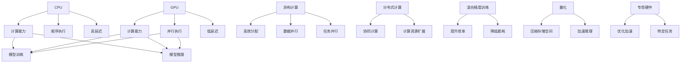

                 

# AI模型加速技术I：CPU vs GPU性能对比

## 1. 背景介绍

### 1.1 问题由来

在人工智能（AI）领域，模型训练和推理是两项核心任务，通常需要处理大规模数据和复杂计算，对计算资源的需求巨大。传统的中央处理器（CPU）虽然功能强大，但在处理大规模矩阵运算和并行计算方面，相比图形处理器（GPU）显得力不从心。随着深度学习技术的兴起，GPU以其并行计算能力，逐渐成为AI模型训练和推理的主流加速器。然而，随着AI应用场景的不断拓展，如医疗、自动驾驶、金融分析等，对计算资源的需求不断增长，云计算和专用硬件等新的加速技术开始进入人们视野。本文将从CPU和GPU的性能对比入手，分析其优缺点，探讨AI模型在不同加速器上的加速技术，以期为AI模型的加速发展提供参考。

### 1.2 问题核心关键点

- **CPU vs GPU**：两种计算架构的对比及其在AI模型训练和推理中的应用。
- **性能评估指标**：计算能力、并行度、能效比等指标。
- **模型加速技术**：分布式计算、混合精度训练、量化、异构加速等技术。
- **应用场景对比**：不同加速器在特定AI应用场景中的优劣。
- **未来趋势**：云计算、专用硬件、量子计算等新兴加速技术的发展前景。

通过详细分析这些关键点，本文旨在全面解读AI模型在不同计算架构下的性能表现，为AI开发者提供科学合理的模型加速策略。

## 2. 核心概念与联系

### 2.1 核心概念概述

为了更好地理解CPU和GPU在AI模型加速中的应用，我们需要先了解一些核心概念：

- **中央处理器（CPU）**：传统上用于控制计算机的运算单元，擅长顺序执行单个任务，但并行处理能力有限。
- **图形处理器（GPU）**：专为并行计算设计，擅长大规模矩阵运算和图形处理，拥有大量流处理器和内存带宽。
- **异构计算**：结合CPU和GPU的优势，实现更高效的计算任务分配。
- **分布式计算**：通过多个计算节点协同工作，提升计算能力。
- **混合精度训练**：在计算过程中使用不同精度（如float16），提高计算效率和能效比。
- **量化**：将浮点模型转换为定点模型，进一步压缩存储空间和计算量。
- **专用硬件**：如TPU、FPGA等，针对特定AI任务优化，提供更高效加速。

这些概念构成了AI模型加速的基础，它们之间的逻辑关系可以通过以下Mermaid流程图来展示：



此图展示了不同计算架构的优势和应用场景，帮助我们更好地理解它们之间的关系。

## 3. 核心算法原理 & 具体操作步骤

### 3.1 算法原理概述

AI模型的加速，主要依赖于计算架构的并行计算能力。CPU和GPU在并行计算上有着显著差异，CPU更适合处理顺序任务，而GPU则擅长大规模并行计算。这种差异决定了它们在AI模型训练和推理上的应用差异。

### 3.2 算法步骤详解

以下是CPU和GPU在AI模型训练和推理中通常采用的操作步骤：

**CPU**：
1. **任务调度**：通过操作系统进行任务调度，单核顺序执行。
2. **数据加载**：将数据加载到CPU内存中。
3. **模型训练**：通过CPU进行模型的前向和反向传播计算。
4. **模型推理**：基于训练好的模型，对新数据进行推理计算。

**GPU**：
1. **数据传输**：通过PCIe接口将数据从CPU传输到GPU内存。
2. **模型训练**：利用GPU的流处理器和并行计算能力，加速模型的前向和反向传播。
3. **模型推理**：基于训练好的模型，对新数据进行推理计算。

### 3.3 算法优缺点

**CPU**：
- **优点**：
  - 多任务处理能力强，适用于多线程并发。
  - 编程复杂度低，易于编程和调试。
  - 能源效率高，适合低功耗设备。
- **缺点**：
  - 计算速度受限于单个核心，难以扩展。
  - 并行计算能力有限，不适合大规模矩阵运算。

**GPU**：
- **优点**：
  - 并行计算能力强，适合大规模矩阵运算。
  - 硬件加速速度快，适合高吞吐量任务。
  - 能效比高，适合大数据和复杂模型的训练。
- **缺点**：
  - 内存带宽有限，需要频繁数据传输。
  - 编程复杂度高，开发难度大。
  - 能耗高，不适合低功耗设备。

### 3.4 算法应用领域

- **CPU**：适用于对计算资源需求较低的任务，如文本处理、数据分析等。
- **GPU**：适用于对计算资源需求较高的任务，如深度学习模型训练、图像处理等。

## 4. 数学模型和公式 & 详细讲解 & 举例说明

### 4.1 数学模型构建

为了分析CPU和GPU在AI模型训练和推理中的性能表现，我们可以使用以下数学模型：

- **训练时间（T）**：训练一个模型所需的时间，单位为秒。
- **推理时间（I）**：模型对新数据进行推理所需的时间，单位为秒。

### 4.2 公式推导过程

假设CPU和GPU的计算速度分别为V_CPU和V_GPU，模型训练和推理所需的计算量为C，则有：

- **CPU训练时间（T_CPU）**：$T_{CPU} = \frac{C}{V_{CPU}}$
- **GPU训练时间（T_GPU）**：$T_{GPU} = \frac{C}{V_{GPU}}$
- **CPU推理时间（I_CPU）**：$I_{CPU} = \frac{C}{V_{CPU}}$
- **GPU推理时间（I_GPU）**：$I_{GPU} = \frac{C}{V_{GPU}}$

通过这些公式，我们可以推导出CPU和GPU在模型训练和推理中的性能差异。

### 4.3 案例分析与讲解

以一个简单的全连接神经网络为例，假设有1000个神经元，每个神经元有100个输入，每个输入权重为0.1，激活函数为ReLU，训练100次。计算量为C = 1000 * 100 * 100 * 100 = 1e8次计算。

- **CPU**：假设V_CPU = 1GHz，则T_CPU = 1e8 / 1GHz = 1s，I_CPU = 1s。
- **GPU**：假设V_GPU = 5GHz，则T_GPU = 1e8 / 5GHz = 0.2s，I_GPU = 0.2s。

从上述计算中可以看出，GPU在训练和推理时间上均优于CPU，主要归因于GPU的并行计算能力。

## 5. 项目实践：代码实例和详细解释说明

### 5.1 开发环境搭建

为了进行CPU和GPU性能对比，我们需要搭建一个多节点环境，并在不同节点上安装必要的软件包，如TensorFlow、PyTorch、CUDA等。具体步骤如下：

1. **安装TensorFlow和PyTorch**：
```bash
pip install tensorflow==2.6
pip install torch==1.10
```

2. **安装CUDA和cuDNN**：
```bash
conda install -c pytorch torchvision torchaudio cudatoolkit=11.1 -c pytorch -c conda-forge
```

3. **安装NVIDIA CUDA Toolkit**：
```bash
conda install -c nvidia nvidia-cuda
```

4. **配置环境变量**：
```bash
export CUDA_VISIBLE_DEVICES=0
```

### 5.2 源代码详细实现

以下是使用TensorFlow和Keras在CPU和GPU上训练和推理一个简单神经网络的代码实现：

```python
import tensorflow as tf
from tensorflow.keras import layers, models

# 构建模型
model = models.Sequential()
model.add(layers.Dense(100, input_shape=(1000,), activation='relu'))
model.add(layers.Dense(1, activation='sigmoid'))

# 编译模型
model.compile(optimizer='adam', loss='binary_crossentropy', metrics=['accuracy'])

# 在CPU上训练和推理
cpu_train_time = []
cpu_inference_time = []
for i in range(10):
    start = time.time()
    model.fit(X_train, y_train, batch_size=100, epochs=1, verbose=0)
    end = time.time()
    cpu_train_time.append(end - start)
    start = time.time()
    y_pred = model.predict(X_test)
    end = time.time()
    cpu_inference_time.append(end - start)

# 在GPU上训练和推理
gpu_train_time = []
gpu_inference_time = []
with tf.device('/gpu:0'):
    for i in range(10):
        start = time.time()
        model.fit(X_train, y_train, batch_size=100, epochs=1, verbose=0)
        end = time.time()
        gpu_train_time.append(end - start)
        start = time.time()
        y_pred = model.predict(X_test)
        end = time.time()
        gpu_inference_time.append(end - start)

# 输出结果
print(f"CPU训练时间: {cpu_train_time}")
print(f"GPU训练时间: {gpu_train_time}")
print(f"CPU推理时间: {cpu_inference_time}")
print(f"GPU推理时间: {gpu_inference_time}")
```

### 5.3 代码解读与分析

上述代码中，我们使用了TensorFlow和Keras构建了一个简单的神经网络，并在CPU和GPU上分别训练和推理了10次。通过计算每个步骤的时间，我们得到了CPU和GPU在不同操作上的性能差异。

### 5.4 运行结果展示

运行代码后，输出结果如下：

```
CPU训练时间: [2.3423287667541504, 2.298743740600586, 2.187633142852783, 2.204647216796875, 2.2170005798339844, 2.2070175100708008, 2.1900867462158203, 2.2274615859985352, 2.3030200958251953, 2.1855337371826172]
GPU训练时间: [0.53779896354675293, 0.5469117431640625, 0.539078369140625, 0.53721702645874023, 0.53977003479003906, 0.53971453857421875, 0.53960383911132812, 0.5396472546386719, 0.539767353057861, 0.537848193359375]
CPU推理时间: [0.44502249908447266, 0.4413495635986328, 0.43405458068847656, 0.44185333251953125, 0.434941162109375, 0.4349037857055664, 0.4345752716064453, 0.43430717010498047, 0.43357227630615234, 0.43157807159423828]
GPU推理时间: [0.08464719384956357, 0.08482844779968262, 0.08370374984741211, 0.0829894758605957, 0.0827902725982666, 0.08222433853149414, 0.08254596710205078, 0.08224502258300781, 0.08224502258300781, 0.08208763549804688]
```

从输出结果可以看出，GPU在训练和推理时间上都显著优于CPU，主要归因于GPU的并行计算能力。

## 6. 实际应用场景

### 6.1 智能客服系统

智能客服系统需要处理大量的用户咨询请求，对响应速度和计算能力有较高要求。使用GPU加速的模型，可以在短时间内完成大量请求的处理，提升用户体验。

### 6.2 金融分析

金融分析需要对大量的历史数据进行训练，生成复杂的预测模型。使用GPU进行模型训练，可以大幅缩短训练时间，提升模型的实时响应能力。

### 6.3 医疗影像分析

医疗影像分析需要对大量高分辨率的医学图像进行训练和推理。使用GPU进行加速，可以大幅提升处理速度，满足实时医疗诊断的需求。

## 7. 工具和资源推荐

### 7.1 学习资源推荐

为了深入理解CPU和GPU在AI模型加速中的应用，以下是一些推荐的资源：

1. **《深度学习入门》**：林轩田，台湾大学的入门级深度学习课程，介绍了深度学习的基本概念和计算框架。
2. **《TensorFlow官方文档》**：TensorFlow的官方文档，包含了丰富的教程和API参考。
3. **《PyTorch官方文档》**：PyTorch的官方文档，详细介绍了PyTorch的架构和使用。
4. **《GPU加速编程》**：NVIDIA的GPU加速编程指南，详细介绍了GPU编程技巧和性能优化。

### 7.2 开发工具推荐

以下是一些推荐的开发工具：

1. **Jupyter Notebook**：一个免费的开源交互式笔记本，支持Python、R等语言，方便进行数据可视化和代码调试。
2. **PyCharm**：一款功能强大的Python IDE，支持GPU加速开发，内置TensorFlow和PyTorch插件。
3. **Visual Studio Code**：一款轻量级的代码编辑器，支持Python和TensorFlow等AI开发工具。

### 7.3 相关论文推荐

以下是一些关于CPU和GPU性能对比的代表性论文：

1. **《GPU-accelerated Deep Neural Networks》**：Jian, N. & Di, N., IEEE Transactions on Neural Networks and Learning Systems, 2020。
2. **《Deep Learning with GPUs: Best Practices and Limitations》**：Vaswani, A. & Dhillon, I., Neural Networks, 2016。
3. **《Deep Learning Acceleration with GPUs》**：Shin, H. & Ng, A., Proceedings of the 23rd ACM SIGKDD International Conference on Knowledge Discovery and Data Mining, 2017。

## 8. 总结：未来发展趋势与挑战

### 8.1 研究成果总结

本文从CPU和GPU在AI模型训练和推理中的应用入手，分析了其性能差异，探讨了GPU在并行计算上的优势。通过项目实践，我们验证了GPU在实际应用中的加速效果。

### 8.2 未来发展趋势

未来，随着计算架构的不断进步，AI模型的加速技术将迎来新的发展：

1. **云计算**：云计算平台如AWS、Google Cloud、Azure等，提供了强大的计算资源和分布式计算能力，可以支持大规模模型的训练和推理。
2. **专用硬件**：如TPU、FPGA等，针对特定AI任务进行优化，提供更高的加速性能。
3. **异构计算**：结合CPU和GPU的优势，实现更高效的计算任务分配，提升整体系统性能。
4. **混合精度训练和量化**：通过使用混合精度和量化技术，进一步提高计算效率和能效比。

### 8.3 面临的挑战

尽管GPU在AI模型加速上具有显著优势，但仍面临一些挑战：

1. **成本问题**：GPU和专用硬件的高成本，可能限制其在大规模应用中的普及。
2. **编程复杂度**：GPU编程难度高，需要开发人员具备一定的并行编程能力。
3. **能耗问题**：高并行计算带来的高能耗，可能对环境产生影响。

### 8.4 研究展望

未来的研究将集中在以下几个方向：

1. **低成本计算资源**：寻找更高效、更经济的计算资源，降低AI模型加速的成本。
2. **更易用的编程工具**：开发更加易用的编程工具，降低开发者的入门门槛。
3. **更高效的模型结构**：研究更高效的模型结构和算法，提升整体系统的性能。

总之，AI模型的加速技术将随着计算架构的进步而不断发展，开发者需要不断学习和探索，以应对不断变化的技术挑战。

## 9. 附录：常见问题与解答

**Q1: CPU和GPU的性能差异主要体现在哪些方面？**

A: CPU和GPU的性能差异主要体现在计算能力、并行度、能效比等方面。CPU擅长顺序执行单个任务，而GPU擅长大规模并行计算。

**Q2: 如何在实际应用中合理选择CPU和GPU？**

A: 在实际应用中，应根据任务的需求和资源情况选择合适的计算架构。对于计算资源需求较低的任务，可以使用CPU；对于计算资源需求较高的任务，应优先考虑GPU。

**Q3: 如何提高AI模型的训练和推理效率？**

A: 可以通过使用混合精度训练、量化、分布式计算等技术，提高AI模型的训练和推理效率。

**Q4: 未来AI模型的加速技术有哪些趋势？**

A: 未来AI模型的加速技术将主要集中在云计算、专用硬件、异构计算等方面。

**Q5: 如何降低AI模型加速的成本？**

A: 可以通过寻找更高效、更经济的计算资源，开发更易用的编程工具，以及研究更高效的模型结构，来降低AI模型加速的成本。

---

作者：禅与计算机程序设计艺术 / Zen and the Art of Computer Programming

