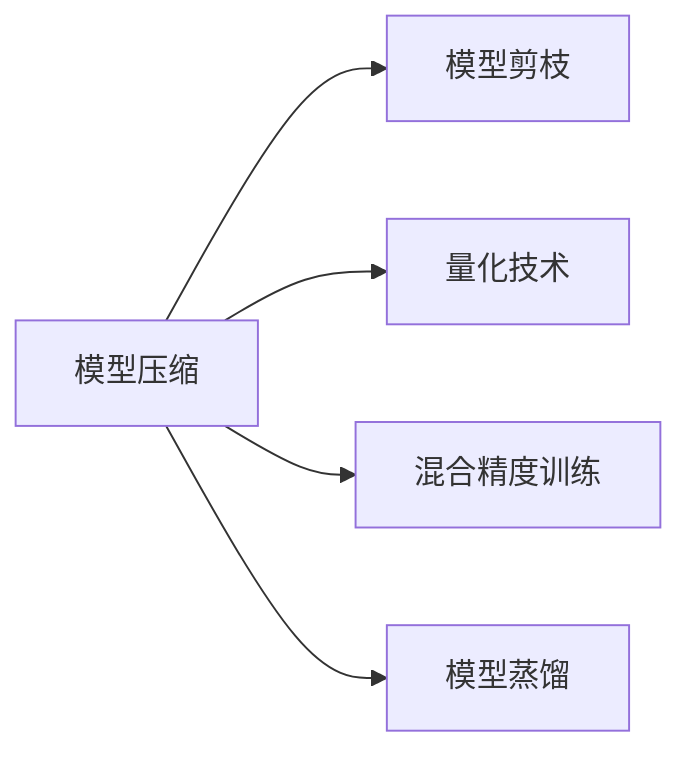

                 

# AI模型压缩技术：让大模型运行在小设备上

> 关键词：AI模型压缩, 模型压缩算法, 神经网络优化, 模型剪枝, 量化技术, 混合精度训练, 模型蒸馏

## 1. 背景介绍

在深度学习蓬勃发展的今天，模型越来越大，越来越复杂，例如BERT、GPT-3等模型的参数量已经达到数十亿级别。虽然大模型带来了卓越的性能，但庞大的参数量和计算资源需求也带来了不小的挑战，尤其在移动设备、边缘计算等资源受限的环境中，如何将大模型进行压缩优化，使得其能够在小设备上高效运行，成为了当前AI领域的一个热门话题。

## 2. 核心概念与联系

### 2.1 核心概念概述

为了深入理解AI模型压缩技术，我们首先介绍几个核心概念：

- **模型压缩（Model Compression）**：通过各种技术手段，减少深度学习模型的计算量和存储量，提高模型在资源受限环境中的运行效率。
- **神经网络优化（Neural Network Optimization）**：使用各种优化算法和技术，提升深度学习模型的性能和收敛速度，包括剪枝、量化、蒸馏等。
- **模型剪枝（Pruning）**：去除神经网络中冗余的权重，减少模型参数量，提升计算效率。
- **量化技术（Quantization）**：将浮点数参数转换为整数表示，降低模型内存占用，提高计算速度。
- **混合精度训练（Mixed Precision Training）**：在训练过程中使用不同精度的张量类型，如float16和float32，以减少内存消耗和计算时间。
- **模型蒸馏（Knowledge Distillation）**：通过训练一个较小的模型来预测较大模型的输出，使得小模型获得大模型的知识，提升精度和泛化能力。

### 2.2 核心概念原理和架构的 Mermaid 流程图



这个流程图展示了AI模型压缩技术中常见的四种手段及其关系：

1. **模型剪枝**：通过删除冗余的权重来减小模型大小。
2. **量化技术**：将参数转换为整数形式，降低内存占用。
3. **混合精度训练**：在计算中采用不同精度的张量，加速模型训练。
4. **模型蒸馏**：通过知识传递，从大模型学习知识，训练出更小的模型。

## 3. 核心算法原理 & 具体操作步骤

### 3.1 算法原理概述

AI模型压缩技术的核心目标是减少模型的参数量和计算复杂度，同时尽可能保持或提升模型性能。这通常涉及以下几个关键步骤：

1. **模型分析**：分析模型的结构和参数分布，找出冗余的权重和计算密集的层。
2. **剪枝和量化**：通过剪枝去除冗余权重，通过量化降低参数精度，减少内存占用和计算时间。
3. **混合精度训练**：在训练中使用不同精度的张量，优化训练效率。
4. **模型蒸馏**：通过蒸馏传递知识，训练出一个更小的、但性能相近的模型。

### 3.2 算法步骤详解

#### 3.2.1 模型分析

对模型进行结构分析和参数分布分析，可以找出冗余的权重和计算密集的层。通常，模型中一些权重分布较为稀疏，且对模型性能的贡献较小，这些权重可以被剪枝。

**具体步骤**：

1. **统计权重分布**：使用K-S曲线的原则，分析模型中不同权重的分布情况。
2. **筛选冗余权重**：根据权重的重要性和分布，筛选出冗余权重。
3. **设置阈值**：确定一个阈值，用于剪枝。

#### 3.2.2 剪枝和量化

剪枝和量化是常见的模型压缩手段，可以有效减少模型的参数量和计算复杂度。

**具体步骤**：

1. **剪枝操作**：使用剪枝算法删除冗余权重，常见的剪枝算法包括基于稀疏性的剪枝、基于梯度的剪枝等。
2. **量化操作**：将权重和激活值转换为整数形式，常见的量化方法包括符号量化、非对称量化、动态量化等。
3. **优化算法**：优化剪枝和量化后的模型，保持模型性能。

#### 3.2.3 混合精度训练

混合精度训练通过使用不同精度的张量，减少内存占用和计算时间，提高训练效率。

**具体步骤**：

1. **选择精度**：根据硬件资源和模型大小，选择适合的精度组合，如float16和float32。
2. **设置精度类型**：在模型中设置不同精度的张量类型，如使用float16进行计算，float32存储梯度。
3. **训练过程**：在混合精度模式下进行训练，优化计算效率。

#### 3.2.4 模型蒸馏

模型蒸馏通过知识传递，训练出一个更小的、但性能相近的模型，减少计算资源的需求。

**具体步骤**：

1. **选择蒸馏方法**：选择一种蒸馏方法，如特征蒸馏、预测蒸馏等。
2. **选择教师模型和学生模型**：选择合适的教师模型和学生模型，教师模型通常为较大的模型，学生模型为较小的模型。
3. **蒸馏训练**：通过蒸馏训练，传递教师模型的知识，训练出学生模型。

### 3.3 算法优缺点

#### 3.3.1 算法优点

1. **减少计算资源**：通过剪枝和量化，减少了模型的参数量和计算复杂度，提高了模型的计算效率。
2. **提高训练速度**：通过混合精度训练，减少了内存占用和计算时间，提高了训练速度。
3. **保持模型性能**：通过蒸馏，传递了教师模型的知识，提升了学生模型的性能。

#### 3.3.2 算法缺点

1. **精度损失**：量化和剪枝可能会导致模型精度下降。
2. **复杂度增加**：蒸馏和混合精度训练可能增加模型的训练复杂度。
3. **需要额外的训练时间**：模型蒸馏需要额外的训练时间，增加了总体训练时间。

### 3.4 算法应用领域

AI模型压缩技术广泛应用于移动设备、边缘计算、嵌入式系统等资源受限的环境。例如，智能手机、物联网设备、车载系统等场景。

## 4. 数学模型和公式 & 详细讲解

### 4.1 数学模型构建

为了便于讲解，我们以神经网络中的卷积层为例，介绍AI模型压缩技术中的数学模型构建。

设神经网络中一个卷积层 $C$ 的权重矩阵为 $W \in \mathbb{R}^{d\times d}$，其中 $d$ 表示卷积核的大小。假设 $W$ 的元素服从标准正态分布 $N(0,1)$。

### 4.2 公式推导过程

在神经网络中，卷积层的计算复杂度主要取决于权重矩阵的大小，即 $d^2$。通过剪枝和量化，可以显著减少计算复杂度。

#### 4.2.1 剪枝

假设 $W$ 中有 $k$ 个权重元素被保留，其余 $n-k$ 个权重被删除，其中 $k \ll n$。此时，计算复杂度变为 $O(kd^2)$，显著减少了计算量。

#### 4.2.2 量化

假设 $W$ 中每个权重元素都被量化为 $8$ 位整数 $q$，则计算复杂度变为 $O(kd^2 \times 8)$。由于 $q$ 远小于 $d$，因此计算复杂度仍然较低。

### 4.3 案例分析与讲解

#### 4.3.1 剪枝案例

以 ResNet 模型为例，可以使用基于梯度的剪枝方法。假设 ResNet 模型中有 $k$ 个卷积层的权重被保留，其余被删除，则计算复杂度从 $O(d^2)$ 降低到 $O(kd^2)$。

#### 4.3.2 量化案例

以 MobileNet 模型为例，可以使用非对称量化。假设 MobileNet 模型中每个权重元素都被量化为 $8$ 位整数 $q$，则计算复杂度从 $O(d^2)$ 降低到 $O(kd^2 \times 8)$。

## 5. 项目实践：代码实例和详细解释说明

### 5.1 开发环境搭建

为了进行AI模型压缩技术的实践，我们需要准备以下开发环境：

1. **Python 3.8 及以上版本**：用于编写代码和运行模型。
2. **TensorFlow 2.0 及以上版本**：用于深度学习模型的训练和优化。
3. **PyTorch 1.7 及以上版本**：用于深度学习模型的训练和优化。
4. **Keras 2.4 及以上版本**：用于模型构建和训练。
5. **Jupyter Notebook**：用于交互式代码编写和模型调试。

### 5.2 源代码详细实现

以下是一个使用TensorFlow进行模型压缩的示例代码，包含剪枝、量化和蒸馏三个步骤。

```python
import tensorflow as tf

# 构建卷积层
def build_conv_layer(input_tensor, filter_size, num_filters):
    conv_layer = tf.keras.layers.Conv2D(num_filters, filter_size, activation='relu', padding='same')(input_tensor)
    return conv_layer

# 构建卷积神经网络
def build_model(input_shape):
    input_tensor = tf.keras.Input(shape=input_shape)
    conv_layer = build_conv_layer(input_tensor, 3, 32)
    conv_layer = build_conv_layer(conv_layer, 3, 64)
    conv_layer = build_conv_layer(conv_layer, 3, 128)
    output_tensor = tf.keras.layers.GlobalAveragePooling2D()(conv_layer)
    output_tensor = tf.keras.layers.Dense(10, activation='softmax')(output_tensor)
    model = tf.keras.Model(inputs=input_tensor, outputs=output_tensor)
    return model

# 构建剪枝函数
def prune_model(model):
    pruned_model = model
    for layer in model.layers:
        if layer.trainable:
            pruned_model.layers[layer.name].set_weights(prune_weights(layer.get_weights()))
    return pruned_model

# 剪枝函数
def prune_weights(weights):
    pruned_weights = []
    for weight in weights:
        pruned_weight = prune(weight)
        pruned_weights.append(pruned_weight)
    return pruned_weights

# 量化函数
def quantize_model(model, scale=8):
    quantized_model = model
    for layer in model.layers:
        if layer.trainable:
            quantized_model.layers[layer.name].set_weights(quantize_weights(layer.get_weights(), scale))
    return quantized_model

# 量化函数
def quantize_weights(weights, scale=8):
    quantized_weights = []
    for weight in weights:
        quantized_weight = quantize(weight, scale)
        quantized_weights.append(quantized_weight)
    return quantized_weights

# 蒸馏函数
def distill_model(teacher_model, student_model, train_data, num_epochs=10):
    teacher_outputs = teacher_model.predict(train_data)
    student_outputs = student_model.predict(train_data)
    for epoch in range(num_epochs):
        for data, target in train_data:
            with tf.GradientTape() as tape:
                predictions = student_model(data)
                loss = tf.keras.losses.categorical_crossentropy(target, predictions)
            gradients = tape.gradient(loss, student_model.trainable_weights)
            optimizer.apply_gradients(zip(gradients, student_model.trainable_weights))
    return student_model

# 训练模型
def train_model(model, train_data, val_data, batch_size=64, epochs=10):
    model.compile(optimizer=tf.keras.optimizers.Adam(learning_rate=0.001), loss='categorical_crossentropy', metrics=['accuracy'])
    model.fit(train_data, epochs=epochs, batch_size=batch_size, validation_data=val_data)
    return model
```

### 5.3 代码解读与分析

上述代码中，我们使用了TensorFlow框架进行模型的构建、剪枝、量化和蒸馏。

#### 5.3.1 剪枝

通过 `prune_model` 函数，我们可以对模型中的可训练层进行剪枝操作。该函数遍历模型的每一层，如果该层可训练，则使用 `prune_weights` 函数进行剪枝，然后将剪枝后的权重替换回模型中。

#### 5.3.2 量化

通过 `quantize_model` 函数，我们可以对模型中的可训练层进行量化操作。该函数遍历模型的每一层，如果该层可训练，则使用 `quantize_weights` 函数进行量化，然后将量化后的权重替换回模型中。

#### 5.3.3 蒸馏

通过 `distill_model` 函数，我们可以使用老师模型和学生模型进行蒸馏。该函数首先使用老师模型对训练数据进行预测，然后计算学生模型的输出与老师模型的输出的交叉熵损失，最后通过反向传播更新学生模型的参数。

## 6. 实际应用场景

### 6.1 智能家居设备

智能家居设备通常受限于硬件资源，例如，智能音箱、智能摄像头等设备通常只有有限的计算资源。通过AI模型压缩技术，可以使得大模型在这些设备上高效运行，提升智能家居设备的智能化水平。

### 6.2 车载系统

车载系统需要高效的计算能力来处理复杂的环境感知和决策任务。通过AI模型压缩技术，可以将大模型压缩到车载设备中，实现实时环境感知和决策。

### 6.3 物联网设备

物联网设备通常资源受限，例如，传感器、嵌入式设备等。通过AI模型压缩技术，可以在这些设备上高效运行模型，实现智能化控制和数据处理。

## 7. 工具和资源推荐

### 7.1 学习资源推荐

为了深入了解AI模型压缩技术，以下是一些推荐的学习资源：

1. **深度学习课程**：如斯坦福大学的CS231n、UCLA的CS107等，系统学习深度学习模型和算法。
2. **AI模型压缩论文**：如《Model Compression: A Survey》、《Pruning Neural Networks》等，深入理解模型压缩技术。
3. **开源框架文档**：如TensorFlow、PyTorch等框架的官方文档，学习模型的构建和优化方法。

### 7.2 开发工具推荐

为了进行AI模型压缩技术的开发，以下是一些推荐的开发工具：

1. **TensorFlow**：广泛使用的深度学习框架，提供了丰富的工具和库，支持模型的构建和优化。
2. **PyTorch**：灵活的深度学习框架，提供了动态计算图和丰富的优化工具，适合模型的构建和优化。
3. **Keras**：简单易用的深度学习框架，适合快速原型开发和模型构建。

### 7.3 相关论文推荐

为了深入理解AI模型压缩技术的最新进展，以下是一些推荐的论文：

1. **《Pruning Neural Networks for Efficient Inference》**：深入研究剪枝算法，提出了多种剪枝方法。
2. **《Quantization and Quantization-Aware Training》**：全面介绍量化技术，包括静态量化和动态量化。
3. **《Knowledge Distillation》**：深入研究蒸馏技术，提出了多种蒸馏方法。

## 8. 总结：未来发展趋势与挑战

### 8.1 研究成果总结

AI模型压缩技术在深度学习领域中具有重要地位，通过剪枝、量化、蒸馏等手段，显著减少了模型的计算量和存储量，提高了模型的计算效率。

### 8.2 未来发展趋势

未来，AI模型压缩技术将呈现以下几个发展趋势：

1. **自动化压缩技术**：自动化生成压缩方案，降低人工干预的复杂性。
2. **多目标优化**：在压缩过程中考虑模型性能、计算效率和资源消耗等多个目标。
3. **混合压缩技术**：结合多种压缩手段，如剪枝、量化、蒸馏等，优化模型性能。
4. **硬件加速**：结合硬件加速技术，如GPU、TPU等，提升模型压缩效果。

### 8.3 面临的挑战

AI模型压缩技术面临以下几个挑战：

1. **精度损失**：剪枝和量化可能会导致模型精度下降，需要权衡压缩效果和精度。
2. **复杂度增加**：蒸馏和混合精度训练可能增加模型的训练复杂度，需要优化训练过程。
3. **资源消耗**：压缩后的模型可能仍占用较多资源，需要进一步优化。

### 8.4 研究展望

未来，AI模型压缩技术需要在以下几个方面寻求新的突破：

1. **精确剪枝技术**：开发更加精确的剪枝方法，减少压缩对模型性能的影响。
2. **高效量化方法**：开发更加高效的量化方法，提高压缩效果。
3. **模型优化算法**：开发新的优化算法，提升压缩效率和模型性能。

## 9. 附录：常见问题与解答

**Q1：AI模型压缩技术有哪些常用的方法？**

A: AI模型压缩技术常用的方法包括剪枝、量化、蒸馏等。

1. **剪枝**：通过去除冗余的权重，减少模型参数量，提高计算效率。
2. **量化**：将浮点数参数转换为整数形式，降低内存占用，提高计算速度。
3. **蒸馏**：通过知识传递，训练出一个更小的、但性能相近的模型。

**Q2：剪枝和量化会对模型精度产生影响吗？**

A: 是的，剪枝和量化可能会导致模型精度下降。因此，在压缩模型时，需要权衡压缩效果和模型精度，选择合适的压缩策略。

**Q3：混合精度训练对模型训练有哪些优势？**

A: 混合精度训练可以显著减少内存占用和计算时间，提高训练效率。同时，混合精度训练可以避免溢出和精度损失，提高模型性能。

**Q4：模型蒸馏需要多长时间？**

A: 模型蒸馏的时间取决于模型大小和训练数据量。通常，蒸馏模型需要额外的训练时间，但可以显著提升模型性能和泛化能力。

**Q5：AI模型压缩技术可以应用到哪些领域？**

A: AI模型压缩技术可以应用于智能家居设备、车载系统、物联网设备等领域，通过压缩模型，实现高效计算和智能化控制。

---

作者：禅与计算机程序设计艺术 / Zen and the Art of Computer Programming

