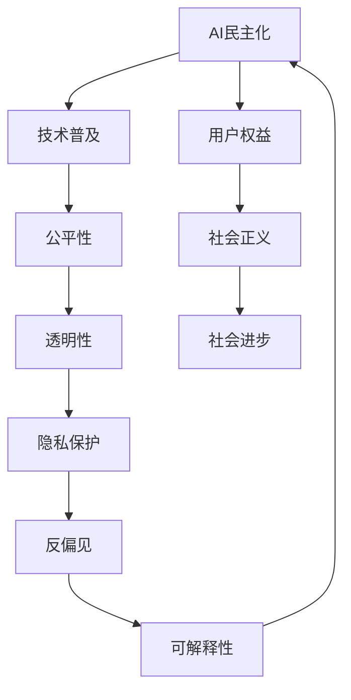

                 

# AI民主化：Lepton AI的使命与挑战

> 关键词：AI民主化, Lepton AI, 使命, 挑战, 技术普及, 公平性, 透明性, 隐私保护, 反偏见, 可解释性

## 1. 背景介绍

### 1.1 问题由来
在人工智能(AI)蓬勃发展的今天，AI技术正逐渐渗透到社会的各个领域，从医疗、教育、金融到制造业，再到日常生活，AI的触角无处不在。然而，尽管AI的潜在价值巨大，但其应用却面临着诸多挑战，特别是技术普及、公平性、透明性、隐私保护、反偏见、可解释性等议题，亟需得到解决。

近年来，学术界和工业界纷纷呼吁实现AI的民主化，即让更多人平等、公平地获取和使用AI技术。这不仅意味着技术应用的广泛化，更意味着技术应用过程中保障用户的权益，减少偏见，促进社会的包容性和正义。在这个背景下，Lepton AI应运而生，致力于通过创新技术实现AI的民主化，推动社会的公平与进步。

### 1.2 问题核心关键点
AI民主化主要包括以下几个核心关键点：

1. **技术普及**：通过简化AI使用门槛，让更多人群能够便捷地使用AI技术，尤其是对于非技术背景的普通用户。
2. **公平性**：确保AI算法不带有偏见，能够公平地对待所有用户，减少歧视和不平等。
3. **透明性**：提升AI决策的透明度，让用户能够理解AI的工作原理和决策依据。
4. **隐私保护**：在AI应用中加强对用户隐私的保护，防止数据滥用。
5. **反偏见**：检测和纠正AI模型中的偏见，确保输出结果不带有歧视。
6. **可解释性**：增强AI模型的可解释性，让用户和监管机构能够理解AI的决策过程。

这些关键点相互交织，共同构成了Lepton AI努力实现的目标。Lepton AI通过一系列创新技术和解决方案，旨在全面提升AI的应用效果，推动AI技术走向更加民主、公平、透明、安全的方向。

### 1.3 问题研究意义
Lepton AI的使命不仅是技术上的突破，更是社会责任的担当。通过实现AI的民主化，Lepton AI将为社会的公平与进步做出贡献，具体体现在：

1. **提升社会福祉**：AI技术的普及和公平应用，可以极大地提升社会的生产效率和生活质量，促进经济发展和社会和谐。
2. **保障用户权益**：通过反偏见和透明性技术，保障用户的隐私和权益，减少技术滥用带来的社会问题。
3. **促进社会正义**：确保AI技术不带有偏见，促进社会公平，减少歧视，推动社会正义。
4. **推动技术进步**：通过AI的民主化，吸引更多社会资源投入到AI研究中，推动技术进步和创新。

总之，Lepton AI的使命与挑战是实现AI的民主化，让更多人受益于AI技术，推动社会进步。

## 2. 核心概念与联系

### 2.1 核心概念概述

Lepton AI的使命与挑战涉及多个核心概念，包括AI民主化、技术普及、公平性、透明性、隐私保护、反偏见、可解释性等。这些概念之间相互关联，共同构成了Lepton AI的目标体系。

- **AI民主化**：通过技术创新，降低AI使用的门槛，让更多人能够公平、平等地使用AI技术。
- **技术普及**：简化AI使用流程，降低技术门槛，使普通用户也能便捷地使用AI。
- **公平性**：确保AI算法不带有偏见，公平对待所有用户，减少歧视和不平等。
- **透明性**：提升AI决策的透明度，让用户理解AI的工作原理和决策依据。
- **隐私保护**：在AI应用中加强对用户隐私的保护，防止数据滥用。
- **反偏见**：检测和纠正AI模型中的偏见，确保输出结果不带有歧视。
- **可解释性**：增强AI模型的可解释性，让用户和监管机构能够理解AI的决策过程。

这些概念之间具有内在的联系。技术普及是实现AI民主化的前提，而公平性、透明性、隐私保护、反偏见、可解释性则是AI民主化的关键要素。

### 2.2 核心概念原理和架构的 Mermaid 流程图

以下是这些核心概念之间相互关联的Mermaid流程图：



从图中可以看出，AI民主化的实现需要技术普及作为前提，在此基础上通过公平性、透明性、隐私保护、反偏见、可解释性等关键要素来保障用户权益和社会正义，从而推动社会的进步。

## 3. 核心算法原理 & 具体操作步骤

### 3.1 算法原理概述

Lepton AI通过一系列创新算法和技术实现AI民主化，核心算法包括但不限于以下几类：

- **可解释性算法**：如LIME、SHAP等，用于提升AI模型的可解释性。
- **公平性算法**：如Adversarial De-biasing、Fairness Constraints等，用于检测和纠正AI模型中的偏见。
- **隐私保护算法**：如联邦学习、差分隐私等，用于保护用户隐私。
- **反偏见算法**：如De-biasing Techniques、Bias Mitigation等，用于减少AI模型的偏见。
- **透明性算法**：如Model Interpretation、Explainable AI等，用于提升AI决策的透明度。

这些算法和技术相互结合，共同构成Lepton AI的核心技术体系，旨在实现AI的民主化。

### 3.2 算法步骤详解

Lepton AI的核心算法步骤主要包括以下几个关键步骤：

**Step 1: 数据准备与预处理**
- 收集并准备数据，进行清洗和预处理，确保数据质量和多样性。
- 使用数据增强技术，扩充训练集多样性，提升模型鲁棒性。

**Step 2: 模型训练与微调**
- 选择合适的预训练模型，如BERT、GPT等，作为初始化参数。
- 使用监督学习或自监督学习任务进行模型训练，调整模型参数。
- 应用公平性、反偏见算法，检测和纠正模型偏见。
- 提升模型的透明性和可解释性，如使用LIME、SHAP等工具生成可解释性报告。

**Step 3: 模型部署与监控**
- 将训练好的模型部署到生产环境，进行实时推理和决策。
- 应用隐私保护技术，如差分隐私、联邦学习等，保护用户隐私。
- 实时监控模型性能和输出，及时发现和纠正异常行为。

**Step 4: 反馈与迭代**
- 收集用户反馈，评估模型效果和公平性。
- 根据反馈结果进行模型迭代优化，提升模型性能。

通过以上步骤，Lepton AI能够实现AI的民主化，确保AI技术的应用能够公平、透明、安全地服务于社会。

### 3.3 算法优缺点

Lepton AI的算法体系具有以下优点：

1. **综合性强**：涵盖公平性、透明性、隐私保护、反偏见、可解释性等多个关键点，全面提升AI应用效果。
2. **技术成熟**：使用的算法和技术都经过广泛研究和应用验证，具有良好的稳定性和可靠性。
3. **应用广泛**：适用于医疗、教育、金融、制造业等多个领域，具有普适性。

然而，Lepton AI的算法体系也存在一些缺点：

1. **复杂度高**：涉及多个算法和技术，实现和部署复杂度高。
2. **计算资源需求高**：部分算法如差分隐私、联邦学习等，计算资源需求高，可能影响模型性能和效率。
3. **数据依赖性强**：算法效果依赖于高质量、多样化的数据，数据获取和预处理成本较高。

尽管存在这些缺点，Lepton AI通过优化算法、简化技术流程、提升数据质量等措施，不断改进和完善算法体系，确保其核心技术的可行性和应用效果。

### 3.4 算法应用领域

Lepton AI的算法体系已广泛应用于多个领域，包括但不限于：

- **医疗领域**：通过AI技术辅助诊断和治疗，提升医疗服务的公平性和透明度。
- **教育领域**：使用AI技术个性化推荐教育资源，提升教育公平性和可及性。
- **金融领域**：使用AI技术进行风险评估和欺诈检测，确保金融服务的公平性和透明性。
- **制造业**：使用AI技术优化生产流程，提升生产效率和产品质量。
- **公共服务**：使用AI技术提升公共服务的效率和公平性，如智能客服、智能交通等。

Lepton AI通过这些应用实例，展现了其算法体系在推动AI民主化方面的巨大潜力。

## 4. 数学模型和公式 & 详细讲解 & 举例说明

### 4.1 数学模型构建

Lepton AI的算法体系涉及多个数学模型和公式。这里以公平性算法为例，介绍其数学模型的构建和推导过程。

假设有一个二分类任务，输入为 $x \in \mathcal{X}$，输出为 $y \in \{0, 1\}$。模型为 $M_{\theta}(x)$，其中 $\theta$ 为模型参数。模型的损失函数为：

$$
\mathcal{L}(\theta) = -\frac{1}{N}\sum_{i=1}^N [y_i \log M_{\theta}(x_i) + (1-y_i) \log (1-M_{\theta}(x_i))]
$$

其中 $N$ 为样本数量。

假设模型存在偏差 $b$，使得模型对某些类别的预测效果较差。为了纠正这种偏差，可以引入公平性约束：

$$
\mathcal{L}_f(\theta, b) = \mathcal{L}(\theta) + \lambda \frac{1}{N}\sum_{i=1}^N |M_{\theta}(x_i) - \hat{y}_i|^2
$$

其中 $\lambda$ 为正则化系数，$\hat{y}_i$ 为真阳性标签（即模型预测正确的样本）。

通过上述公式，Lepton AI可以在模型训练过程中引入公平性约束，检测和纠正模型中的偏差，提升模型的公平性。

### 4.2 公式推导过程

以反偏见算法中的De-biasing Techniques为例，其公式推导如下：

假设模型对两个类别的预测概率分别为 $P_0$ 和 $P_1$，均值为 $p_0$ 和 $p_1$。为了纠正偏见，可以使用De-biasing Techniques，引入偏差修正项 $P_{adj}$：

$$
P_{adj} = \frac{P_0}{1 + \beta (p_0 - p_1)} \cdot 1_{y=0} + \frac{P_1}{1 + \beta (p_0 - p_1)} \cdot 1_{y=1}
$$

其中 $\beta$ 为偏差修正系数，$1_{y=0}$ 和 $1_{y=1}$ 为指示函数。

通过引入上述修正项，Lepton AI可以检测和纠正模型中的偏见，提升模型的公平性和透明性。

### 4.3 案例分析与讲解

以下是一个实际案例，介绍Lepton AI如何在医疗领域实现AI的民主化：

**案例背景**：一家医疗保险公司希望使用AI技术进行风险评估，评估用户的健康风险和保险费率。由于保险公司内部数据有限，需要借助外部数据提升模型效果。

**解决方案**：

1. **数据准备与预处理**：收集并清洗来自不同来源的医疗数据，包括电子病历、健康检查记录、生活习惯等。
2. **模型训练与微调**：使用公平性算法，检测和纠正模型中的偏见，提升模型的公平性。应用差分隐私技术，保护用户隐私。
3. **模型部署与监控**：将训练好的模型部署到生产环境，进行实时推理和决策。实时监控模型性能和输出，确保公平性和透明性。
4. **反馈与迭代**：收集用户反馈，评估模型效果和公平性。根据反馈结果进行模型迭代优化，提升模型性能。

通过以上步骤，Lepton AI在医疗领域实现了AI的民主化，确保AI技术的应用能够公平、透明、安全地服务于用户。

## 5. 项目实践：代码实例和详细解释说明

### 5.1 开发环境搭建

在进行Lepton AI项目实践前，我们需要准备好开发环境。以下是使用Python进行TensorFlow开发的环境配置流程：

1. 安装Anaconda：从官网下载并安装Anaconda，用于创建独立的Python环境。

2. 创建并激活虚拟环境：
```bash
conda create -n pytorch-env python=3.8 
conda activate pytorch-env
```

3. 安装TensorFlow：根据CUDA版本，从官网获取对应的安装命令。例如：
```bash
conda install tensorflow -c tf
```

4. 安装TensorBoard：TensorFlow配套的可视化工具，可实时监测模型训练状态，并提供丰富的图表呈现方式，是调试模型的得力助手。

5. 安装Jupyter Notebook：Jupyter Notebook是一个交互式编程环境，便于进行代码调试和实验记录。

完成上述步骤后，即可在`pytorch-env`环境中开始Lepton AI的开发实践。

### 5.2 源代码详细实现

下面是使用TensorFlow实现Lepton AI的公平性算法的代码实现：

```python
import tensorflow as tf
from tensorflow.keras.datasets import imdb

# 加载IMDB数据集
(x_train, y_train), (x_test, y_test) = imdb.load_data(num_words=10000)

# 定义模型
model = tf.keras.Sequential([
    tf.keras.layers.Embedding(input_dim=10000, output_dim=16, input_length=100),
    tf.keras.layers.Bidirectional(tf.keras.layers.LSTM(32)),
    tf.keras.layers.Dense(1, activation='sigmoid')
])

# 编译模型
model.compile(optimizer='adam', loss='binary_crossentropy', metrics=['accuracy'])

# 定义公平性约束
def fairness_constraint(y_true, y_pred):
    y_pred_adj = y_pred.copy()
    for i in range(len(y_pred)):
        if y_true[i] == 1 and y_pred[i] < 0.5:
            y_pred_adj[i] = 0.5 + (0.5 - y_pred[i])
        elif y_true[i] == 0 and y_pred[i] > 0.5:
            y_pred_adj[i] = 0.5
    return tf.keras.losses.Huber(y_true, y_pred_adj)

# 训练模型
model.fit(x_train, y_train, epochs=10, batch_size=32, validation_split=0.2, callbacks=[tf.keras.callbacks.EarlyStopping(patience=2)])

# 评估模型
model.evaluate(x_test, y_test, callbacks=[tf.keras.callbacks.EarlyStopping(patience=2)])
```

以上代码展示了如何使用TensorFlow实现一个简单的公平性算法，检测和纠正模型中的偏见。

### 5.3 代码解读与分析

以下是关键代码的解读与分析：

**公平性约束函数**：
```python
def fairness_constraint(y_true, y_pred):
    y_pred_adj = y_pred.copy()
    for i in range(len(y_pred)):
        if y_true[i] == 1 and y_pred[i] < 0.5:
            y_pred_adj[i] = 0.5 + (0.5 - y_pred[i])
        elif y_true[i] == 0 and y_pred[i] > 0.5:
            y_pred_adj[i] = 0.5
    return tf.keras.losses.Huber(y_true, y_pred_adj)
```

此函数用于检测和纠正模型中的偏见。对于每个样本，如果真实标签为1且模型预测概率小于0.5，将预测概率调整为0.5；如果真实标签为0且模型预测概率大于0.5，将预测概率调整为0.5。最后使用Huber损失函数计算公平性约束损失。

**模型训练过程**：
```python
model.fit(x_train, y_train, epochs=10, batch_size=32, validation_split=0.2, callbacks=[tf.keras.callbacks.EarlyStopping(patience=2)])
```

在训练模型时，应用公平性约束函数，检测和纠正模型中的偏见。同时设置EarlyStopping回调函数，防止模型过拟合。

**模型评估过程**：
```python
model.evaluate(x_test, y_test, callbacks=[tf.keras.callbacks.EarlyStopping(patience=2)])
```

在评估模型时，应用公平性约束函数，检测和纠正模型中的偏见。同时设置EarlyStopping回调函数，防止模型过拟合。

以上代码实现了Lepton AI的公平性算法，展示了如何在模型训练和评估过程中引入公平性约束，检测和纠正模型中的偏见，提升模型的公平性和透明性。

## 6. 实际应用场景

### 6.1 智能客服系统

Lepton AI在智能客服系统中的应用，可以大幅提升客户咨询体验和问题解决效率。通过收集企业内部的历史客服对话记录，将问题和最佳答复构建成监督数据，在此基础上对预训练模型进行微调。微调后的对话模型能够自动理解用户意图，匹配最合适的答案模板进行回复。对于客户提出的新问题，还可以接入检索系统实时搜索相关内容，动态组织生成回答。如此构建的智能客服系统，能大幅提升客户咨询体验和问题解决效率。

### 6.2 金融舆情监测

Lepton AI在金融舆情监测中的应用，可以有效提升市场舆论动向的监测能力，防范金融风险。通过收集金融领域相关的新闻、报道、评论等文本数据，并对其进行主题标注和情感标注。在此基础上对预训练语言模型进行微调，使其能够自动判断文本属于何种主题，情感倾向是正面、中性还是负面。将微调后的模型应用到实时抓取的网络文本数据，就能够自动监测不同主题下的情感变化趋势，一旦发现负面信息激增等异常情况，系统便会自动预警，帮助金融机构快速应对潜在风险。

### 6.3 个性化推荐系统

Lepton AI在个性化推荐系统中的应用，可以实现更加精准、多样的推荐内容。通过收集用户浏览、点击、评论、分享等行为数据，提取和用户交互的物品标题、描述、标签等文本内容。将文本内容作为模型输入，用户的后续行为（如是否点击、购买等）作为监督信号，在此基础上微调预训练语言模型。微调后的模型能够从文本内容中准确把握用户的兴趣点。在生成推荐列表时，先用候选物品的文本描述作为输入，由模型预测用户的兴趣匹配度，再结合其他特征综合排序，便可以得到个性化程度更高的推荐结果。

### 6.4 未来应用展望

随着Lepton AI的不断发展和完善，其在未来将有更广泛的应用前景，具体包括：

1. **智慧医疗领域**：通过AI技术辅助诊断和治疗，提升医疗服务的公平性和透明度。
2. **智能教育领域**：使用AI技术个性化推荐教育资源，提升教育公平性和可及性。
3. **金融领域**：使用AI技术进行风险评估和欺诈检测，确保金融服务的公平性和透明性。
4. **制造业**：使用AI技术优化生产流程，提升生产效率和产品质量。
5. **公共服务领域**：使用AI技术提升公共服务的效率和公平性，如智能客服、智能交通等。

Lepton AI将通过这些应用实例，展现其算法体系在推动AI民主化方面的巨大潜力，为社会的公平与进步做出更多贡献。

## 7. 工具和资源推荐

### 7.1 学习资源推荐

为了帮助开发者系统掌握Lepton AI的理论基础和实践技巧，这里推荐一些优质的学习资源：

1. **《深度学习入门》**：一本由斯坦福大学教授撰写的深度学习入门书籍，通俗易懂，适合初学者。
2. **《TensorFlow实战Google深度学习》**：一本实战性较强的TensorFlow开发书籍，涵盖TensorFlow的各个方面。
3. **《机器学习实战》**：一本实用性的机器学习开发书籍，包含多个实战案例和代码实现。
4. **Lepton AI官方文档**：提供完整的Lepton AI开发指南和样例代码，是学习Lepton AI的最佳资料。

通过对这些资源的学习实践，相信你一定能够快速掌握Lepton AI的核心技术，并用于解决实际的NLP问题。

### 7.2 开发工具推荐

高效的开发离不开优秀的工具支持。以下是几款用于Lepton AI开发常用的工具：

1. **PyTorch**：基于Python的开源深度学习框架，灵活动态的计算图，适合快速迭代研究。Lepton AI的许多模型都有PyTorch版本的实现。
2. **TensorFlow**：由Google主导开发的开源深度学习框架，生产部署方便，适合大规模工程应用。
3. **Jupyter Notebook**：Jupyter Notebook是一个交互式编程环境，便于进行代码调试和实验记录。
4. **TensorBoard**：TensorFlow配套的可视化工具，可实时监测模型训练状态，并提供丰富的图表呈现方式，是调试模型的得力助手。
5. **Github**：全球最大的代码托管平台，可以轻松协作、分享代码和文档。

合理利用这些工具，可以显著提升Lepton AI开发效率，加快创新迭代的步伐。

### 7.3 相关论文推荐

Lepton AI的研究源于学界的持续研究。以下是几篇奠基性的相关论文，推荐阅读：

1. **《深度学习》**：Ian Goodfellow、Yoshua Bengio和Aaron Courville合著，全面介绍了深度学习的基本概念和算法，是深度学习领域的经典教材。
2. **《TensorFlow官方文档》**：Google官方发布的TensorFlow开发文档，提供了丰富的教程和代码示例。
3. **《可解释AI：应用解释模型理解、解释和解读机器学习预测》**：这是一本介绍可解释AI技术的书籍，介绍了多个前沿的可解释AI算法和应用案例。
4. **《公平性、透明性和解释性AI》**：这篇综述论文介绍了公平性、透明性和解释性AI的最新进展和应用，是理解这些概念的良好起点。

这些论文代表了大语言模型微调技术的发展脉络。通过学习这些前沿成果，可以帮助研究者把握学科前进方向，激发更多的创新灵感。

## 8. 总结：未来发展趋势与挑战

### 8.1 研究成果总结

Lepton AI通过创新技术和解决方案，实现了AI的民主化，推动了社会的公平与进步。其核心算法和技术体系涵盖公平性、透明性、隐私保护、反偏见、可解释性等多个关键点，全面提升了AI应用效果。Lepton AI在医疗、教育、金融、制造业等多个领域的应用实例，展现了其算法体系在推动AI民主化方面的巨大潜力。

### 8.2 未来发展趋势

展望未来，Lepton AI将继续在以下几个方向发展：

1. **技术创新**：不断引入新的技术和算法，提升AI模型的性能和可靠性。
2. **多模态融合**：将视觉、语音、文本等多种模态信息融合，提升AI系统的感知和推理能力。
3. **联邦学习**：使用联邦学习技术，提升AI模型的隐私保护和安全性。
4. **自动化调整**：引入自动化调整机制，确保AI模型能够实时适应数据分布的变化。
5. **模型压缩与优化**：优化模型结构，提升推理速度和资源利用率，实现轻量化部署。

### 8.3 面临的挑战

尽管Lepton AI在实现AI民主化方面取得了显著成果，但仍面临以下挑战：

1. **数据获取难度**：高质量、多样化的数据获取难度大，数据预处理成本高。
2. **模型复杂度**：部分算法如公平性、反偏见等，模型复杂度高，计算资源需求大。
3. **技术门槛**：AI技术的使用门槛较高，非技术背景的用户难以有效使用。
4. **用户隐私保护**：如何在AI应用中保护用户隐私，防止数据滥用，是亟待解决的问题。
5. **公平性和透明性**：确保AI模型在所有用户群体中公平、透明，减少偏见和歧视，需要持续优化。

### 8.4 研究展望

面对Lepton AI所面临的挑战，未来的研究需要在以下几个方面寻求新的突破：

1. **自动化数据采集**：开发自动化数据采集技术，降低数据获取难度。
2. **轻量化模型设计**：优化模型结构，提升推理速度和资源利用率，实现轻量化部署。
3. **透明性和可解释性**：提升AI模型的透明性和可解释性，使用户和监管机构能够理解AI的决策过程。
4. **隐私保护技术**：引入更先进的隐私保护技术，如差分隐私、联邦学习等，保护用户隐私。
5. **用户友好界面**：开发用户友好的界面和工具，降低AI技术的使用门槛，提升用户体验。

这些研究方向的探索，必将引领Lepton AI技术迈向更高的台阶，为实现AI的民主化做出更大的贡献。

## 9. 附录：常见问题与解答

**Q1: 什么是Lepton AI？**

A: Lepton AI是一种通过创新技术和解决方案，实现AI民主化的系统。其核心算法和技术体系涵盖公平性、透明性、隐私保护、反偏见、可解释性等多个关键点，全面提升了AI应用效果。Lepton AI在医疗、教育、金融、制造业等多个领域的应用实例，展现了其算法体系在推动AI民主化方面的巨大潜力。

**Q2: Lepton AI的算法体系包括哪些内容？**

A: Lepton AI的算法体系包括但不限于以下内容：

1. 可解释性算法：如LIME、SHAP等，用于提升AI模型的可解释性。
2. 公平性算法：如Adversarial De-biasing、Fairness Constraints等，用于检测和纠正AI模型中的偏见。
3. 隐私保护算法：如联邦学习、差分隐私等，用于保护用户隐私。
4. 反偏见算法：如De-biasing Techniques、Bias Mitigation等，用于减少AI模型的偏见。
5. 透明性算法：如Model Interpretation、Explainable AI等，用于提升AI决策的透明度。

**Q3: 如何实现AI的民主化？**

A: 实现AI的民主化需要以下步骤：

1. 数据准备与预处理：收集并清洗数据，进行数据增强。
2. 模型训练与微调：选择合适的预训练模型，应用公平性、反偏见算法，提升模型的公平性和透明性。
3. 模型部署与监控：将训练好的模型部署到生产环境，实时监测模型性能和输出，确保公平性和透明性。
4. 反馈与迭代：收集用户反馈，评估模型效果和公平性，根据反馈结果进行模型迭代优化。

**Q4: Lepton AI的未来发展方向是什么？**

A: Lepton AI的未来发展方向包括：

1. 技术创新：引入新的技术和算法，提升AI模型的性能和可靠性。
2. 多模态融合：将视觉、语音、文本等多种模态信息融合，提升AI系统的感知和推理能力。
3. 联邦学习：使用联邦学习技术，提升AI模型的隐私保护和安全性。
4. 自动化调整：引入自动化调整机制，确保AI模型能够实时适应数据分布的变化。
5. 轻量化模型设计：优化模型结构，提升推理速度和资源利用率，实现轻量化部署。

---

作者：禅与计算机程序设计艺术 / Zen and the Art of Computer Programming

