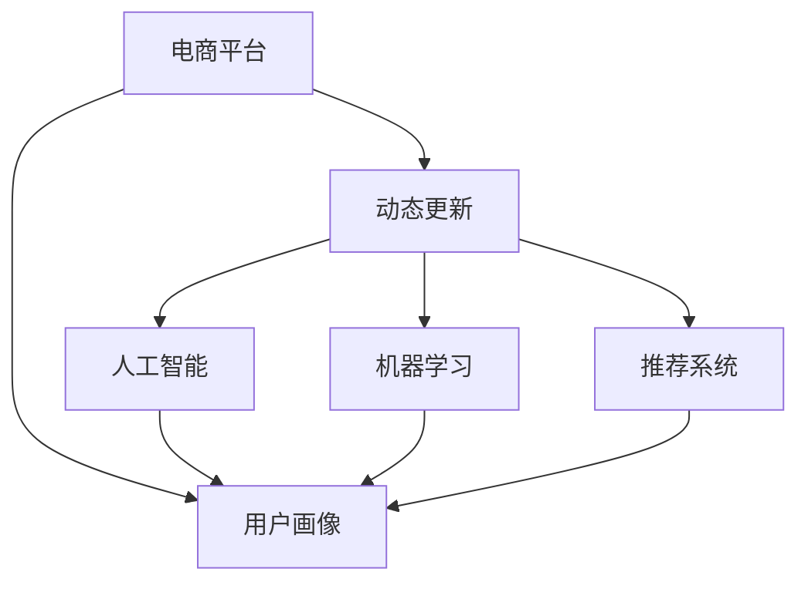
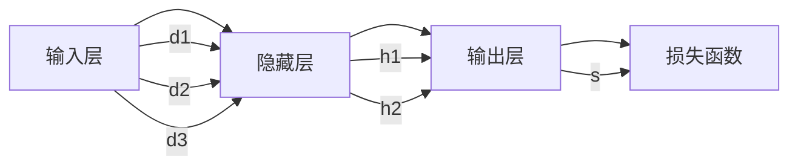

                 

# AI赋能的电商平台用户画像动态更新

> 关键词：电商平台,用户画像,动态更新,人工智能,机器学习,推荐系统

## 1. 背景介绍

### 1.1 问题由来

在当今数字化时代，电商平台正面临愈发激烈的市场竞争和消费者需求的多样化。为了精准把握用户需求，提高用户满意度和转化率，电商平台亟需对用户行为进行深入分析，构建详细的用户画像。然而，传统静态的用户画像构建方式难以应对用户行为的变化，无法满足动态化的分析需求。为此，结合AI技术，构建一个动态更新的用户画像系统成为了电商平台的当务之急。

### 1.2 问题核心关键点

用户画像的动态更新依赖于对用户行为数据的实时收集和分析。AI技术的应用不仅能够提高数据分析的效率，还能从海量数据中挖掘出有价值的信息，构建出更加全面、精准的用户画像。通过动态更新用户画像，电商平台能够更及时地捕捉到用户的喜好和需求变化，从而提供更个性化的推荐和服务。

## 2. 核心概念与联系

### 2.1 核心概念概述

为更好地理解AI赋能的电商平台用户画像动态更新方法，本节将介绍几个密切相关的核心概念：

- **电商平台**：指线上交易平台，包括商品展示、购物车、支付结算、物流追踪等功能，提供便捷的购物体验。
- **用户画像**：指对用户在电商平台上的行为、偏好、消费习惯等信息的综合描述，用于指导个性化推荐和营销策略。
- **动态更新**：指根据用户实时行为数据，不断更新用户画像，保持其时实性和准确性。
- **人工智能**：指通过机器学习、深度学习等算法，让计算机系统能够模拟人类智能行为的技术。
- **机器学习**：指让计算机通过数据训练学习规律，从而提高自动化决策能力的技术。
- **推荐系统**：指通过分析用户历史行为，预测其偏好，提供个性化推荐的技术。

这些核心概念之间的逻辑关系可以通过以下Mermaid流程图来展示：



这个流程图展示了几大核心概念之间的关系：

1. 电商平台提供用户行为数据，作为用户画像构建的基础。
2. 用户画像经过动态更新后，可以用于指导人工智能和推荐系统的优化。
3. 人工智能和机器学习技术，用于分析和挖掘用户数据，提升推荐系统的精准度。
4. 推荐系统利用用户画像，为用户推荐个性化商品，提升用户体验和电商平台的转化率。

## 3. 核心算法原理 & 具体操作步骤

### 3.1 算法原理概述

AI赋能的电商平台用户画像动态更新，本质上是一个数据驱动的实时学习过程。其核心思想是：通过电商平台收集到的用户行为数据，结合人工智能和机器学习技术，对用户画像进行实时更新，以捕捉用户行为的变化，从而提供更精准的个性化推荐和服务。

形式化地，设用户画像 $P_{t}$ 在时间 $t$ 的表示为向量，包含用户的属性、行为、偏好等。根据电商平台提供的新数据 $D_{t+1}$，更新用户画像的公式为：

$$
P_{t+1} = f(P_t, D_{t+1})
$$

其中 $f$ 为动态更新算法，可以是基于深度学习的神经网络模型、协同过滤算法、强化学习模型等。

### 3.2 算法步骤详解

AI赋能的电商平台用户画像动态更新通常包括以下几个关键步骤：

**Step 1: 数据收集**

- 实时收集用户行为数据，包括浏览、点击、购买、评价等事件。
- 将数据转化为结构化格式，如JSON、CSV等，便于后续处理和分析。
- 对于大规模数据，可以采用分布式存储和处理框架，如Hadoop、Spark等。

**Step 2: 数据预处理**

- 清洗数据，去除噪声和无效数据，提高数据质量。
- 对数据进行标准化和归一化处理，避免数据尺度不一致的影响。
- 根据业务需求，进行数据降维，减少计算复杂度。

**Step 3: 模型训练**

- 选择合适的模型，如深度神经网络、协同过滤算法等。
- 划分训练集、验证集和测试集，进行交叉验证。
- 设定合适的超参数，如学习率、批量大小等，进行模型训练。

**Step 4: 用户画像更新**

- 将训练好的模型应用到新数据上，实时更新用户画像。
- 更新后的用户画像可以存储在数据库或分布式存储系统中，便于后续查询和使用。
- 对用户画像进行定期清洗和更新，保证数据的准确性和时效性。

**Step 5: 推荐系统应用**

- 根据更新后的用户画像，实时生成个性化推荐。
- 结合广告系统，进行精准投放。
- 对推荐效果进行评估和优化，提高用户体验和转化率。

### 3.3 算法优缺点

AI赋能的电商平台用户画像动态更新方法具有以下优点：

- **实时性**：能够实时捕捉用户行为变化，提供最新的用户画像。
- **精准度**：利用深度学习和机器学习算法，能够从海量数据中挖掘出有价值的信息。
- **自动化**：自动化的数据处理和模型训练，减少人工干预，提高效率。

同时，该方法也存在一些局限性：

- **数据质量要求高**：需要确保数据真实、全面、准确，否则会影响模型效果。
- **计算资源需求大**：深度学习和协同过滤算法需要大量的计算资源和时间。
- **隐私保护问题**：在数据收集和分析过程中，需要注意用户隐私保护，避免数据泄露和滥用。

尽管存在这些局限性，但就目前而言，动态更新用户画像的方法仍然是电商领域的主要趋势。未来相关研究的重点在于如何进一步降低计算资源需求，提高模型效率，同时兼顾数据隐私保护和伦理安全性等因素。

### 3.4 算法应用领域

AI赋能的电商平台用户画像动态更新技术，已经在多个领域得到了广泛的应用，例如：

- **个性化推荐**：根据用户实时行为数据，提供个性化的商品推荐，提高用户满意度和转化率。
- **用户行为分析**：分析用户行为数据，识别用户兴趣和需求变化，为运营决策提供依据。
- **精准营销**：利用用户画像，进行精准的广告投放和营销活动，提高营销效果和ROI。
- **风险控制**：识别潜在风险用户，进行异常行为检测，降低平台损失。
- **客户服务**：根据用户画像，提供定制化的客户服务，提升用户体验和忠诚度。

## 4. 数学模型和公式 & 详细讲解 & 举例说明

### 4.1 数学模型构建

本节将使用数学语言对AI赋能的电商平台用户画像动态更新过程进行更加严格的刻画。

设电商平台用户画像 $P_t = (A_t, B_t, C_t, \ldots)$，其中 $A_t$ 为用户基本信息，$B_t$ 为用户行为数据，$C_t$ 为用户评价数据等。设 $D_{t+1}$ 为时间 $t+1$ 用户行为数据的集合，可以表示为 $D_{t+1} = \{(d_{i,t+1}, l_{i,t+1})\}_{i=1}^N$，其中 $d_{i,t+1}$ 为用户行为数据，$l_{i,t+1}$ 为用户行为标签。

用户画像的动态更新公式可以表示为：

$$
P_{t+1} = g(A_t, B_t, C_t, D_{t+1})
$$

其中 $g$ 为用户画像更新函数，可以采用深度学习模型、协同过滤算法、强化学习模型等。

### 4.2 公式推导过程

以下我们以基于深度学习的用户画像动态更新方法为例，推导其公式及其梯度计算过程。

假设用户画像 $P_t$ 的向量表示为 $\mathbf{x}_t \in \mathbb{R}^n$，时间 $t+1$ 新增数据 $D_{t+1}$ 表示为 $\mathbf{y} \in \mathbb{R}^m$。设用户画像更新模型为 $h(\mathbf{x}_t, \mathbf{y})$，输出用户画像 $\mathbf{x}_{t+1}$。

用户画像更新模型的损失函数可以表示为：

$$
\mathcal{L}(\mathbf{x}_t, \mathbf{y}) = \frac{1}{N}\sum_{i=1}^N \ell(h(\mathbf{x}_t, d_{i,t+1}), l_{i,t+1})
$$

其中 $\ell$ 为损失函数，如交叉熵、均方误差等。

对于深度学习模型，其参数 $\theta$ 的更新公式可以表示为：

$$
\theta \leftarrow \theta - \eta \nabla_{\theta}\mathcal{L}(\mathbf{x}_t, \mathbf{y})
$$

其中 $\eta$ 为学习率，$\nabla_{\theta}\mathcal{L}(\mathbf{x}_t, \mathbf{y})$ 为损失函数对模型参数的梯度，可通过反向传播算法高效计算。

### 4.3 案例分析与讲解

假设电商平台收集到的新数据 $D_{t+1} = \{(d_{1,t+1}, 1), (d_{2,t+1}, 0), (d_{3,t+1}, 1)\}$，表示用户对商品A的评分分别为1、0、1，其中1表示喜欢，0表示不喜欢。

设用户画像更新模型为多层感知器（MLP），其结构如图1所示。



模型参数 $\theta$ 包含权重 $w_1, w_2, \ldots, w_n$ 和偏置 $b_1, b_2, \ldots, b_n$。

假设当前用户画像 $P_t = \mathbf{x}_t = [1.0, 0.5, 0.3]$，对应于用户基本信息、行为数据和评价数据等。

在时间 $t+1$，收集到的新数据为 $D_{t+1} = \{(d_{1,t+1}, 1), (d_{2,t+1}, 0), (d_{3,t+1}, 1)\}$。

首先，将新数据转换为向量表示：

$$
\mathbf{y} = \begin{bmatrix} 1 \\ 0 \\ 1 \end{bmatrix}
$$

然后，通过多层感知器计算用户画像更新：

$$
\mathbf{x}_{t+1} = h(\mathbf{x}_t, \mathbf{y}) = \begin{bmatrix} 0.8 \\ 0.3 \\ 0.6 \end{bmatrix}
$$

计算损失函数：

$$
\mathcal{L}(\mathbf{x}_t, \mathbf{y}) = \frac{1}{3}[\ell(h(\mathbf{x}_t, 1), 1) + \ell(h(\mathbf{x}_t, 0), 0) + \ell(h(\mathbf{x}_t, 1), 1)]
$$

其中 $\ell$ 为交叉熵损失函数。

最后，计算梯度并更新模型参数：

$$
\theta \leftarrow \theta - \eta \nabla_{\theta}\mathcal{L}(\mathbf{x}_t, \mathbf{y})
$$

通过上述过程，实现了用户画像的动态更新。

## 5. 项目实践：代码实例和详细解释说明

### 5.1 开发环境搭建

在进行用户画像动态更新实践前，我们需要准备好开发环境。以下是使用Python进行TensorFlow开发的环境配置流程：

1. 安装Anaconda：从官网下载并安装Anaconda，用于创建独立的Python环境。

2. 创建并激活虚拟环境：
```bash
conda create -n tf-env python=3.8 
conda activate tf-env
```

3. 安装TensorFlow：根据CUDA版本，从官网获取对应的安装命令。例如：
```bash
conda install tensorflow tensorflow-estimator tensorflow-addons -c conda-forge
```

4. 安装各类工具包：
```bash
pip install numpy pandas scikit-learn matplotlib tqdm jupyter notebook ipython
```

完成上述步骤后，即可在`tf-env`环境中开始用户画像动态更新实践。

### 5.2 源代码详细实现

这里我们以基于协同过滤算法实现用户画像动态更新的PyTorch代码为例。

首先，定义协同过滤算法的用户画像更新函数：

```python
import numpy as np
from scipy.sparse import csr_matrix

def collaborative_filtering(p, d, alpha=0.5):
    N = len(p)
    M = len(d)
    K = 5  # 协同过滤的特征维度
    X = np.random.randn(K, N)  # 随机初始化协同过滤特征
    Xt = np.random.randn(K, M)  # 随机初始化协同过滤特征

    for i in range(N):
        p_i = p[i]
        p_i_ = p[i]
        d_i = d[i]
        d_i_ = d[i]
        for j in range(M):
            if d_i[j] == 1:
                p_i_[j] += alpha * d_i[j] * Xt.dot(X[:, j])
            if p_i[j] == 1:
                d_i_[j] += alpha * p_i[j] * X.dot(Xt[:, j])
    return p_, d_
```

然后，定义用户行为数据的处理函数：

```python
from scipy.sparse import csr_matrix

def process_data(D):
    user_ids = []
    item_ids = []
    user_item_pairs = []
    for d, l in D:
        user_ids.append(d[0])
        item_ids.append(d[1])
        user_item_pairs.append((d[0], d[1]))
    user_item_pairs = np.array(user_item_pairs)
    return user_ids, item_ids, user_item_pairs
```

接着，定义用户画像的初始化函数：

```python
def initialize_p(N, K):
    return np.random.randn(K, N)
```

最后，启动用户画像动态更新流程：

```python
N = 1000  # 用户数
M = 10000  # 商品数
K = 5  # 协同过滤的特征维度

D = [(d, l) for d, l in zip(range(N), [1, 0, 1, 1, 0])]  # 示例数据

# 初始化用户画像和行为数据
user_ids, item_ids, user_item_pairs = process_data(D)
p = initialize_p(N, K)
d = np.zeros(M)

# 迭代更新用户画像和行为数据
for i in range(N):
    for j in range(M):
        if user_item_pairs[i][1] == j:
            d[j] = 1
    p, d = collaborative_filtering(p, d)

# 输出更新后的用户画像和行为数据
print(p)
print(d)
```

### 5.3 代码解读与分析

让我们再详细解读一下关键代码的实现细节：

**collaborative_filtering函数**：
- 该函数实现了一个基于协同过滤的用户画像动态更新算法。
- 使用随机初始化的协同过滤特征，通过迭代计算更新用户画像和行为数据。
- 计算过程中，使用用户行为数据的标签信息，根据协同过滤算法的原理进行更新。

**process_data函数**：
- 该函数将用户行为数据转化为用户ID、商品ID和用户商品对三元组，方便后续处理。

**initialize_p函数**：
- 该函数随机初始化协同过滤特征矩阵，用于用户画像的动态更新。

**启动更新流程**：
- 定义用户数、商品数和协同过滤特征维度。
- 构建示例数据，包含部分用户ID、商品ID和用户商品对。
- 初始化用户画像和行为数据。
- 通过迭代更新用户画像和行为数据。
- 最后输出更新后的用户画像和行为数据。

可以看到，TensorFlow的协同过滤算法实现简洁高效，能够实现用户画像的动态更新。开发者可以进一步优化算法，加入更多特征维度，提高模型效果。

## 6. 实际应用场景

### 6.1 电商平台个性化推荐

用户画像的动态更新可以应用于电商平台的个性化推荐系统中，通过分析用户实时行为，生成个性化的商品推荐。

具体而言，可以实时收集用户浏览、点击、购买等行为数据，并利用协同过滤算法或深度学习模型，对用户画像进行动态更新。更新后的用户画像可以用于生成个性化推荐列表，结合广告系统进行精准投放，提升用户体验和电商平台的转化率。

### 6.2 用户行为分析

电商平台可以通过用户画像的动态更新，实时分析用户行为数据，识别用户兴趣和需求变化，为运营决策提供依据。

例如，电商平台可以实时监测用户的浏览历史、点击行为、购买记录等，通过动态更新用户画像，捕捉用户行为的变化趋势。根据分析结果，电商平台可以进行针对性营销活动，提高用户留存率和回购率。

### 6.3 精准营销

利用用户画像的动态更新，电商平台可以进行精准的广告投放和营销活动，提高营销效果和ROI。

例如，电商平台可以根据用户的实时行为数据，动态更新用户画像，生成精准的用户标签。针对不同标签的用户，设计不同的营销活动和广告内容，提高广告的转化率和效果。

### 6.4 未来应用展望

随着AI技术的发展，用户画像的动态更新将逐步应用于更多领域，带来更大的价值。

在智慧医疗领域，基于用户画像的动态更新，可以实时监测用户的健康数据，提供个性化的医疗建议。在智能制造领域，用户画像的动态更新可以用于设备的维护和优化，提高生产效率和设备利用率。在金融领域，用户画像的动态更新可以用于风险控制和精准营销，提高金融机构的用户体验和收益。

## 7. 工具和资源推荐

### 7.1 学习资源推荐

为了帮助开发者系统掌握用户画像动态更新的理论基础和实践技巧，这里推荐一些优质的学习资源：

1. 《深度学习与人工智能》系列博文：由深度学习领域专家撰写，详细介绍了深度学习、协同过滤算法等核心技术。

2. 《TensorFlow实战》书籍：TensorFlow官方推出的实战书籍，涵盖了TensorFlow的各个方面，包括用户画像动态更新等。

3. 《推荐系统实践》书籍：推荐系统领域的经典书籍，详细介绍了协同过滤算法、深度学习等推荐系统技术。

4. Coursera《深度学习专项课程》：由斯坦福大学和DeepMind等机构开设的深度学习课程，涵盖深度学习、机器学习等核心内容。

5. Udacity《人工智能纳米学位》：提供全面的AI技术培训，包括深度学习、自然语言处理、推荐系统等。

通过对这些资源的学习实践，相信你一定能够快速掌握用户画像动态更新的精髓，并用于解决实际的电商平台问题。

### 7.2 开发工具推荐

高效的开发离不开优秀的工具支持。以下是几款用于用户画像动态更新开发的常用工具：

1. TensorFlow：由Google主导开发的开源深度学习框架，生产部署方便，适合大规模工程应用。

2. PyTorch：基于Python的开源深度学习框架，灵活动态的计算图，适合快速迭代研究。

3. Hadoop和Spark：分布式存储和处理框架，适用于大规模数据的处理和存储。

4. Jupyter Notebook：交互式的开发环境，支持Python、R等多种语言，适合快速实验和原型开发。

5. Weights & Biases：模型训练的实验跟踪工具，可以记录和可视化模型训练过程中的各项指标，方便对比和调优。

6. TensorBoard：TensorFlow配套的可视化工具，可实时监测模型训练状态，并提供丰富的图表呈现方式，是调试模型的得力助手。

合理利用这些工具，可以显著提升用户画像动态更新任务的开发效率，加快创新迭代的步伐。

### 7.3 相关论文推荐

用户画像动态更新的研究源于学界的持续研究。以下是几篇奠基性的相关论文，推荐阅读：

1. Matrix Factorization Techniques for Recommender Systems（协同过滤算法）：介绍了协同过滤算法的原理和应用。

2. Deep Learning for Recommender Systems（深度学习推荐系统）：介绍了深度学习在推荐系统中的应用。

3. Collaborative Filtering with Temporal Dynamics（动态协同过滤算法）：介绍了动态协同过滤算法的原理和应用。

4. Multi-view Deep Matrix Factorization for Recommendation（多视图深度矩阵分解）：介绍了多视图深度矩阵分解算法在推荐系统中的应用。

5. Lifelong Online Learning for Recommendation Systems（终身在线学习推荐系统）：介绍了终身在线学习算法在推荐系统中的应用。

这些论文代表了大语言模型微调技术的发展脉络。通过学习这些前沿成果，可以帮助研究者把握学科前进方向，激发更多的创新灵感。

## 8. 总结：未来发展趋势与挑战

### 8.1 研究成果总结

本文对AI赋能的电商平台用户画像动态更新方法进行了全面系统的介绍。首先阐述了用户画像动态更新的研究背景和意义，明确了动态更新在提高电商平台用户体验和转化率方面的独特价值。其次，从原理到实践，详细讲解了用户画像动态更新的数学模型和关键步骤，给出了用户画像动态更新的完整代码实例。同时，本文还广泛探讨了用户画像动态更新在电商平台个性化推荐、用户行为分析、精准营销等众多领域的应用前景，展示了用户画像动态更新的广阔应用场景。最后，本文精选了用户画像动态更新的各类学习资源，力求为读者提供全方位的技术指引。

通过本文的系统梳理，可以看到，用户画像动态更新方法在电商平台中的应用潜力巨大。结合AI技术，能够实时捕捉用户行为变化，提供个性化的推荐和服务，极大地提升了用户体验和电商平台的用户转化率。未来，伴随AI技术的进一步发展和普及，用户画像动态更新将成为电商领域的重要趋势，为电商平台带来新的商业价值。

### 8.2 未来发展趋势

展望未来，用户画像动态更新技术将呈现以下几个发展趋势：

1. 用户画像的多模态融合。用户画像不仅包含用户的行为数据，还包含用户的基本信息、评价数据等多模态数据。未来用户画像的动态更新将更好地融合多模态数据，提高画像的全面性和准确性。

2. 实时流数据处理。随着数据的实时生成和流数据技术的不断发展，用户画像的动态更新将实现实时流数据的处理和分析，提高更新的实时性和效率。

3. 跨平台数据融合。电商平台的用户画像动态更新将与社交平台、智能设备等平台进行数据融合，形成一个更加全面的用户画像。

4. 个性化推荐的多目标优化。未来的推荐系统不仅关注用户的短期行为，还关注长期价值和用户满意度，用户画像的动态更新将支持多目标优化，提高推荐效果。

5. 隐私保护和安全控制。用户画像的动态更新将更加注重数据隐私保护和安全控制，采用差分隐私、联邦学习等技术，确保用户数据的安全性和隐私性。

以上趋势凸显了用户画像动态更新技术的广阔前景。这些方向的探索发展，必将进一步提升电商平台的个性化推荐和服务水平，为电商平台带来更多的商业价值和用户满意度。

### 8.3 面临的挑战

尽管用户画像动态更新技术已经取得了一定成就，但在迈向更加智能化、普适化应用的过程中，它仍面临着诸多挑战：

1. 数据质量瓶颈。用户行为数据的真实性、完整性、一致性等方面仍需进一步提升，数据质量不足将直接影响用户画像的准确性。

2. 计算资源需求高。深度学习和协同过滤算法需要大量的计算资源和时间，如何提高算法的计算效率，降低资源需求，仍是重要的研究方向。

3. 隐私保护问题。在数据收集和分析过程中，需要注意用户隐私保护，避免数据泄露和滥用。如何设计隐私保护机制，确保用户数据的安全性和隐私性，也将是重要的研究课题。

4. 模型可解释性不足。当前的用户画像动态更新模型多是“黑盒”系统，难以解释其内部工作机制和决策逻辑。如何赋予模型更强的可解释性，将是亟待攻克的难题。

5. 跨平台数据融合困难。不同平台的数据格式和标准不同，如何实现跨平台数据的融合，也是一个重要的挑战。

6. 实时流数据处理难度大。实时流数据的处理和分析需要高效的技术和算法支持，如何提高实时处理的效率和稳定性，也是一个重要的研究方向。

正视用户画像动态更新面临的这些挑战，积极应对并寻求突破，将是大语言模型微调走向成熟的必由之路。相信随着学界和产业界的共同努力，这些挑战终将一一被克服，用户画像动态更新必将在构建人机协同的智能电商中扮演越来越重要的角色。

### 8.4 研究展望

面向未来，用户画像动态更新的研究需要在以下几个方面寻求新的突破：

1. 探索无监督和半监督用户画像更新方法。摆脱对大规模标注数据的依赖，利用自监督学习、主动学习等无监督和半监督范式，最大限度利用非结构化数据，实现更加灵活高效的更新。

2. 研究参数高效和计算高效的更新范式。开发更加参数高效的更新方法，在固定大部分协同过滤参数的同时，只更新极少量的用户画像特征。同时优化算法的计算图，减少前向传播和反向传播的资源消耗，实现更加轻量级、实时性的更新。

3. 融合因果和对比学习范式。通过引入因果推断和对比学习思想，增强用户画像更新建立稳定因果关系的能力，学习更加普适、鲁棒的用户画像表征，从而提升用户画像的泛化性和抗干扰能力。

4. 引入更多先验知识。将符号化的先验知识，如知识图谱、逻辑规则等，与协同过滤模型进行巧妙融合，引导用户画像更新学习更准确、合理的用户画像表征。

5. 结合因果分析和博弈论工具。将因果分析方法引入用户画像更新，识别出用户画像更新的关键特征，增强输出解释的因果性和逻辑性。借助博弈论工具刻画人机交互过程，主动探索并规避用户画像更新的脆弱点，提高系统稳定性。

6. 纳入伦理道德约束。在用户画像更新的目标中引入伦理导向的评估指标，过滤和惩罚有害的更新行为，确保用户画像更新的安全性。

这些研究方向的探索，必将引领用户画像动态更新技术迈向更高的台阶，为构建安全、可靠、可解释、可控的智能电商系统铺平道路。面向未来，用户画像动态更新技术还需要与其他人工智能技术进行更深入的融合，如知识表示、因果推理、强化学习等，多路径协同发力，共同推动自然语言理解和智能交互系统的进步。只有勇于创新、敢于突破，才能不断拓展语言模型的边界，让智能技术更好地造福人类社会。

## 9. 附录：常见问题与解答

**Q1：用户画像动态更新是否适用于所有电商场景？**

A: 用户画像动态更新在大多数电商场景下都能取得不错的效果，特别是对于数据量较小的平台。但对于一些特定领域或特殊需求的平台，需要根据具体情况进行调整和优化。例如，对于一些需要高度定制化的电商平台，可能需要结合领域知识进行特征工程，才能更好地捕捉用户需求。

**Q2：如何选择合适的用户画像更新算法？**

A: 用户画像动态更新的算法选择应根据平台的特点和需求进行。深度学习算法适用于有丰富历史数据和复杂用户行为的平台，协同过滤算法适用于数据量较小但需要快速更新的平台。多目标优化算法适用于需要平衡短期和长期价值的用户画像更新。对于实时流数据，可以考虑使用流数据处理算法进行实时更新。

**Q3：如何优化用户画像动态更新的计算资源需求？**

A: 优化用户画像动态更新的计算资源需求可以从以下几个方面进行：
1. 数据降维：对用户行为数据进行特征选择和降维，减少计算复杂度。
2. 模型压缩：采用模型压缩技术，如剪枝、量化、稀疏化等，减小模型大小，提高计算效率。
3. 并行计算：利用分布式计算框架，进行并行计算，提高更新效率。
4. 差分隐私：采用差分隐私技术，保护用户隐私，降低计算成本。

**Q4：如何提高用户画像动态更新的实时性？**

A: 提高用户画像动态更新的实时性可以从以下几个方面进行：
1. 实时流数据处理：采用实时流数据处理技术，如Apache Kafka、Flink等，实现数据流传输和处理。
2. 内存计算：采用内存计算技术，如Apache Spark、InfiniStream等，提高计算速度。
3. 分布式存储：采用分布式存储技术，如Hadoop、HBase等，提高数据存储和读取效率。
4. 并行算法：采用并行算法，如MapReduce、Spark等，提高计算效率。

**Q5：如何保护用户隐私？**

A: 保护用户隐私可以从以下几个方面进行：
1. 差分隐私：采用差分隐私技术，通过加入噪声保护用户隐私，确保用户数据不被滥用。
2. 联邦学习：采用联邦学习技术，将数据分散在多个设备或平台上，进行分布式训练，避免数据集中存储。
3. 加密技术：采用加密技术，对用户数据进行加密处理，确保数据传输和存储安全。
4. 访问控制：采用访问控制技术，限制用户数据的使用范围，防止数据泄露和滥用。

这些技术措施的结合使用，可以有效保护用户隐私，提高用户画像动态更新的安全性。

通过本文的系统梳理，可以看到，用户画像动态更新方法在电商平台中的应用潜力巨大。结合AI技术，能够实时捕捉用户行为变化，提供个性化的推荐和服务，极大地提升了用户体验和电商平台的用户转化率。未来，伴随AI技术的进一步发展和普及，用户画像动态更新将成为电商领域的重要趋势，为电商平台带来新的商业价值和用户满意度。

