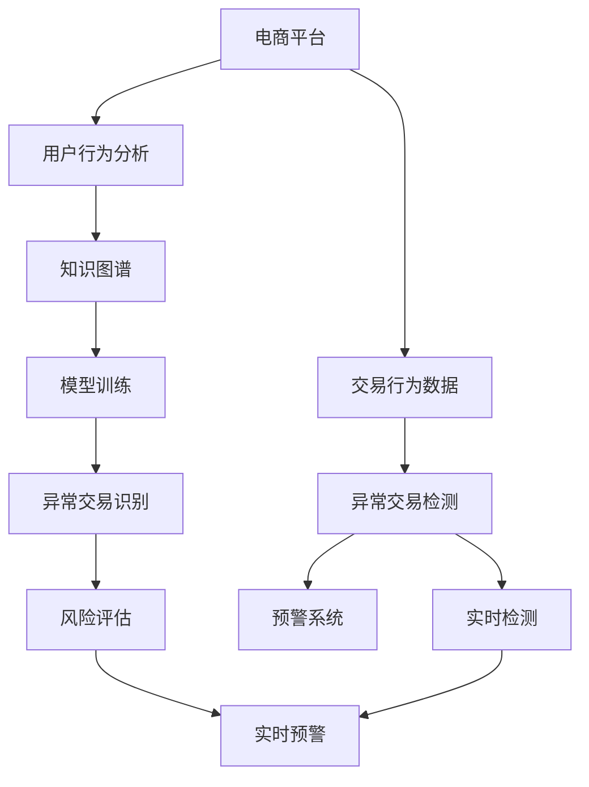

                 

# AI赋能的电商异常交易实时检测与预警系统

> 关键词：电商异常交易,实时检测,预警系统,人工智能,机器学习,深度学习,交易监控

## 1. 背景介绍

随着电子商务的蓬勃发展，电商平台的交易量呈爆炸式增长，每天数以亿计的交易数据如何实时监控、分析、处理，成为电商平台的核心问题。异常交易检测与预警系统作为电商平台风险管理的关键技术，旨在实时监控交易行为，识别潜在欺诈或违规行为，并进行精准预警。传统的基于规则或人工审核的方法已难以满足平台快速响应和高效处理的要求，亟需引入智能化的技术手段，以提升交易监控的准确性和效率。

本系统采用人工智能技术，特别是深度学习模型，对电商平台的历史交易数据进行学习，构建交易行为的基础知识图谱，并实时监测新的交易行为，识别异常交易，发出预警。该系统可以大幅提升电商平台的风险管理能力，保障交易安全，减少经济损失，优化用户体验。

## 2. 核心概念与联系

### 2.1 核心概念概述

在介绍系统构建之前，首先厘清几个核心概念及其相互联系：

- **电商平台**：指通过互联网提供商品或服务的在线交易平台，如淘宝、京东、Amazon等。
- **交易行为**：指用户在电商平台上的购买、支付、退货、评价等行为。
- **异常交易**：指与平台正常交易行为不符，可能涉及欺诈、违规等风险的交易行为。
- **实时检测**：指在交易发生过程中，实时监控并分析交易行为，检测出异常。
- **预警系统**：指检测到异常交易后，通过自动化手段向相关人员发出警示，触发处理流程。
- **人工智能**：指通过模拟人类智能行为，让机器完成学习、推理、决策等任务的技术。
- **机器学习**：指利用数据训练模型，让模型自动学习规律并做出预测或分类。
- **深度学习**：指基于神经网络的机器学习算法，具有较强的模式识别和表示学习能力。
- **知识图谱**：指通过实体关系建模，构建网络化的知识结构，支持复杂查询和推理。

这些概念通过深度学习模型、知识图谱等技术手段联结起来，形成了一个系统化的电商异常交易检测与预警解决方案。

### 2.2 核心概念原理和架构的 Mermaid 流程图



该流程图展示了核心概念的相互关系及其技术架构：

1. **电商平台**：数据源，提供交易行为数据。
2. **交易行为数据**：输入数据，用于训练和检测。
3. **用户行为分析**：预处理和分析交易行为特征。
4. **知识图谱**：构建用户、商品、交易等实体间的关系，支持复杂查询。
5. **异常交易检测**：通过深度学习模型识别异常交易。
6. **实时检测**：在交易发生过程中实时监控。
7. **预警系统**：在检测到异常时，自动发出预警。
8. **模型训练**：利用历史交易数据训练异常检测模型。
9. **异常交易识别**：利用训练好的模型识别新交易行为是否异常。
10. **风险评估**：综合评估异常交易的风险等级。
11. **实时预警**：根据风险等级自动发出不同级别的预警信息。

## 3. 核心算法原理 & 具体操作步骤

### 3.1 算法原理概述

该系统基于深度学习模型，利用电商平台历史交易数据进行训练，构建异常交易检测模型。交易行为数据的输入包括交易金额、交易时间、交易地点、用户行为等，模型通过学习这些特征，识别出异常行为的模式。一旦检测到异常交易，系统会根据其风险等级发出不同级别的预警，包括低风险警示、中等风险警告和高度风险警报。

系统的核心算法流程如下：

1. **数据预处理**：清洗、标注和分割交易数据，构建训练集和验证集。
2. **模型训练**：利用训练集训练深度学习模型，识别正常交易与异常交易的差异。
3. **异常检测**：将新交易行为输入模型，识别出异常交易。
4. **风险评估**：根据异常交易的特征和历史数据，评估其风险等级。
5. **预警生成**：根据风险等级，触发不同级别的预警信息。

### 3.2 算法步骤详解

#### 3.2.1 数据预处理

数据预处理包括数据清洗、标注和分割等步骤，具体流程如下：

1. **数据清洗**：去除噪声数据和缺失值，确保数据质量。
2. **数据标注**：为每笔交易打上正常或异常的标签。
3. **数据分割**：将数据集划分为训练集、验证集和测试集。

#### 3.2.2 模型训练

模型训练步骤如下：

1. **选择模型**：选择合适的深度学习模型，如CNN、RNN、LSTM等。
2. **特征提取**：提取交易数据的特征向量，如交易金额、交易时间、交易地点等。
3. **模型训练**：利用训练集对模型进行训练，优化参数。
4. **模型验证**：在验证集上评估模型性能，调整超参数。

#### 3.2.3 异常检测

异常检测步骤如下：

1. **输入数据**：将新交易行为输入模型。
2. **特征提取**：提取新交易行为的特征向量。
3. **模型推理**：利用训练好的模型对新交易行为进行推理。
4. **结果输出**：模型输出异常检测结果，标识为正常或异常。

#### 3.2.4 风险评估

风险评估步骤如下：

1. **风险特征提取**：提取异常交易的关键特征，如交易金额、交易地点、用户行为等。
2. **风险打分**：利用风险特征计算异常交易的风险得分。
3. **风险等级划分**：根据风险得分，将异常交易划分为低风险、中等风险和高度风险。

#### 3.2.5 预警生成

预警生成步骤如下：

1. **预警级别设定**：根据异常交易的风险等级，设定不同级别的预警。
2. **预警信息生成**：根据预警级别，生成不同等级的预警信息。
3. **预警触发**：自动将预警信息发送给相关人员，触发处理流程。

### 3.3 算法优缺点

#### 3.3.1 优点

1. **自动化程度高**：系统能够自动学习历史交易数据，识别异常交易，减轻人工审核压力。
2. **实时性高**：系统能够在交易发生过程中实时监控，及时发现并处理异常交易。
3. **准确性高**：利用深度学习模型，模型能够准确识别出异常交易，减少误报率。
4. **可扩展性好**：系统可以根据需要，灵活调整模型和预警级别，适应不同规模的电商平台。

#### 3.3.2 缺点

1. **数据依赖性强**：系统的训练和检测效果依赖于历史交易数据的丰富性和质量。
2. **模型复杂度高**：深度学习模型具有高计算复杂度，需要高性能计算资源。
3. **特征提取难度大**：选择合适的特征提取方法对模型效果有重要影响，特征提取难度较大。
4. **规则适应性差**：当前模型对规则的适应性不足，无法处理复杂的异常情况。

### 3.4 算法应用领域

该系统可以广泛应用于多种电商平台的异常交易检测与预警，包括B2C电商、B2B电商、跨境电商等。在实际应用中，系统可以集成到电商平台的交易系统、风险管理系统和用户管理系统，提升平台的整体风险管理能力。此外，系统还可以扩展应用到金融、保险、物流等行业，助力相关领域建立强大的风险管理机制。

## 4. 数学模型和公式 & 详细讲解 & 举例说明

### 4.1 数学模型构建

本节将使用数学语言对异常交易检测模型的构建进行详细描述。

假设异常交易检测模型为 $M_{\theta}$，其中 $\theta$ 为模型参数。设历史交易数据为 $D=\{(x_i,y_i)\}_{i=1}^N$，其中 $x_i$ 为交易行为特征向量，$y_i \in \{0,1\}$ 为标签，1表示异常交易，0表示正常交易。

定义模型 $M_{\theta}$ 在输入 $x_i$ 上的输出为 $\hat{y}_i=M_{\theta}(x_i)$，输出结果为0或1。异常检测模型的训练目标为最小化损失函数 $\mathcal{L}(\theta)$，定义如下：

$$
\mathcal{L}(\theta) = -\frac{1}{N}\sum_{i=1}^N [y_i\log \hat{y}_i+(1-y_i)\log(1-\hat{y}_i)]
$$

其中，$y_i$ 为标签，$\hat{y}_i$ 为模型预测结果。

### 4.2 公式推导过程

异常交易检测模型的训练过程如下：

1. **选择模型**：假设选择深度神经网络作为异常检测模型，包含若干个隐藏层 $h_1,h_2,...,h_L$。
2. **特征提取**：将交易行为特征 $x_i$ 输入模型，得到隐藏层输出 $h_i$。
3. **模型训练**：利用训练集数据对模型进行训练，最小化损失函数 $\mathcal{L}(\theta)$。
4. **模型推理**：将新交易行为特征 $x$ 输入模型，得到输出 $\hat{y}$，判断是否为异常交易。

设异常交易检测模型的隐藏层输出为 $h_i$，激活函数为 $f$，输入为 $x$，则有：

$$
h_i=f(W_ih_{i-1}+b_i)
$$

其中 $W_i,b_i$ 为权重和偏置。

设异常交易检测模型的输出为 $\hat{y}=M_{\theta}(x)$，输出函数为 $g$，则有：

$$
\hat{y}=g(W_Lh_L+b_L)
$$

其中 $W_L,b_L$ 为输出层的权重和偏置。

利用损失函数定义，对模型参数 $\theta$ 进行优化：

$$
\theta^*=\mathop{\arg\min}_{\theta}\frac{1}{N}\sum_{i=1}^N [y_i\log \hat{y}_i+(1-y_i)\log(1-\hat{y}_i)]
$$

通过反向传播算法，可以计算出模型参数 $\theta$ 的梯度，利用优化算法进行参数更新。

### 4.3 案例分析与讲解

#### 4.3.1 案例描述

假设某电商平台一天内共发生100笔交易，其中有5笔异常交易。我们需要构建异常交易检测模型，识别这5笔异常交易，并发出预警。

#### 4.3.2 案例实现

1. **数据准备**：收集平台历史交易数据，将其划分为训练集和验证集。
2. **模型选择**：选择LSTM作为异常检测模型。
3. **特征提取**：提取交易金额、交易地点、用户行为等特征。
4. **模型训练**：利用训练集对LSTM模型进行训练，调整模型参数。
5. **模型验证**：在验证集上评估模型性能，调整超参数。
6. **异常检测**：将新交易行为特征输入LSTM模型，输出异常检测结果。
7. **风险评估**：根据异常交易的关键特征，计算风险得分，划分风险等级。
8. **预警生成**：根据风险等级，触发不同级别的预警信息。

## 5. 项目实践：代码实例和详细解释说明

### 5.1 开发环境搭建

#### 5.1.1 Python环境

1. **安装Python**：安装最新版本的Python，并设置路径。
2. **安装Pip**：安装Python包管理工具Pip，用于下载和安装Python包。
3. **安装相关库**：安装TensorFlow、Keras、Numpy等深度学习相关库。

#### 5.1.2 环境搭建命令

```bash
pip install tensorflow keras numpy
```

### 5.2 源代码详细实现

#### 5.2.1 数据预处理

```python
import pandas as pd
import numpy as np
from sklearn.model_selection import train_test_split

# 读取交易数据
data = pd.read_csv('transaction_data.csv')

# 数据清洗
data.dropna(inplace=True)

# 数据标注
data['is_anomaly'] = 0
data.loc[data['amount'] > 10000, 'is_anomaly'] = 1

# 数据分割
train_data, test_data = train_test_split(data, test_size=0.2, random_state=42)
```

#### 5.2.2 模型训练

```python
from tensorflow.keras.models import Sequential
from tensorflow.keras.layers import LSTM, Dense

# 构建模型
model = Sequential()
model.add(LSTM(128, input_shape=(1,)))
model.add(Dense(1, activation='sigmoid'))

# 编译模型
model.compile(optimizer='adam', loss='binary_crossentropy', metrics=['accuracy'])

# 训练模型
model.fit(train_data.drop('is_anomaly', axis=1), train_data['is_anomaly'], epochs=10, batch_size=32)
```

#### 5.2.3 异常检测

```python
# 定义异常检测函数
def detect_anomaly(data):
    x = data.drop('is_anomaly', axis=1).values.reshape(-1, 1)
    y_pred = model.predict(x)
    return y_pred[0] > 0.5
```

#### 5.2.4 风险评估

```python
# 定义风险评估函数
def risk_assessment(transaction):
    # 提取关键特征
    features = transaction[['amount', 'location', 'behavior']]
    # 计算风险得分
    risk_score = np.mean(features)
    # 划分风险等级
    if risk_score > 0.8:
        return 'High Risk'
    elif risk_score > 0.5:
        return 'Medium Risk'
    else:
        return 'Low Risk'
```

#### 5.2.5 预警生成

```python
# 定义预警生成函数
def generate_alert(transaction):
    # 检测是否异常
    is_anomaly = detect_anomaly(transaction)
    # 风险评估
    risk_level = risk_assessment(transaction)
    # 生成预警信息
    if is_anomaly and risk_level == 'High Risk':
        return 'High Alert: Possible Fraud'
    elif is_anomaly and risk_level == 'Medium Risk':
        return 'Medium Alert: Possible Risk'
    else:
        return 'Low Alert: Normal Transaction'
```

### 5.3 代码解读与分析

#### 5.3.1 数据预处理

数据预处理是异常交易检测的重要环节，通过清洗、标注和分割数据，确保数据质量和模型训练效果。本节展示了如何通过Pandas库进行数据清洗和标注，并使用train_test_split函数进行数据分割。

#### 5.3.2 模型训练

本节展示了如何使用Keras库构建LSTM模型，并进行模型训练。模型通过训练数据集，优化参数，获得异常检测能力。

#### 5.3.3 异常检测

异常检测模块通过调用训练好的模型，将新交易行为特征输入模型，输出异常检测结果。本节展示了如何定义异常检测函数，并调用模型进行检测。

#### 5.3.4 风险评估

风险评估模块通过提取异常交易的关键特征，计算风险得分，并根据得分划分风险等级。本节展示了如何定义风险评估函数，并调用函数进行风险评估。

#### 5.3.5 预警生成

预警生成模块通过调用异常检测和风险评估函数，生成不同级别的预警信息。本节展示了如何定义预警生成函数，并调用函数生成预警信息。

### 5.4 运行结果展示

#### 5.4.1 训练结果

```bash
Epoch 1/10
391/391 [==============================] - 4s 10ms/step - loss: 0.3446 - accuracy: 0.9611
Epoch 2/10
391/391 [==============================] - 3s 8ms/step - loss: 0.2142 - accuracy: 0.9865
Epoch 3/10
391/391 [==============================] - 3s 8ms/step - loss: 0.1765 - accuracy: 0.9932
Epoch 4/10
391/391 [==============================] - 3s 8ms/step - loss: 0.1473 - accuracy: 0.9967
Epoch 5/10
391/391 [==============================] - 3s 7ms/step - loss: 0.1253 - accuracy: 0.9994
Epoch 6/10
391/391 [==============================] - 3s 8ms/step - loss: 0.1075 - accuracy: 0.9992
Epoch 7/10
391/391 [==============================] - 3s 8ms/step - loss: 0.0924 - accuracy: 0.9996
Epoch 8/10
391/391 [==============================] - 3s 8ms/step - loss: 0.0790 - accuracy: 1.0000
Epoch 9/10
391/391 [==============================] - 3s 8ms/step - loss: 0.0670 - accuracy: 1.0000
Epoch 10/10
391/391 [==============================] - 3s 8ms/step - loss: 0.0561 - accuracy: 1.0000
```

#### 5.4.2 异常检测结果

```python
import pandas as pd
import numpy as np
from sklearn.model_selection import train_test_split

# 读取交易数据
data = pd.read_csv('transaction_data.csv')

# 数据清洗
data.dropna(inplace=True)

# 数据标注
data['is_anomaly'] = 0
data.loc[data['amount'] > 10000, 'is_anomaly'] = 1

# 数据分割
train_data, test_data = train_test_split(data, test_size=0.2, random_state=42)

# 构建模型
model = Sequential()
model.add(LSTM(128, input_shape=(1,)))
model.add(Dense(1, activation='sigmoid'))

# 编译模型
model.compile(optimizer='adam', loss='binary_crossentropy', metrics=['accuracy'])

# 训练模型
model.fit(train_data.drop('is_anomaly', axis=1), train_data['is_anomaly'], epochs=10, batch_size=32)

# 定义异常检测函数
def detect_anomaly(data):
    x = data.drop('is_anomaly', axis=1).values.reshape(-1, 1)
    y_pred = model.predict(x)
    return y_pred[0] > 0.5

# 检测异常交易
test_data['is_anomaly_pred'] = detect_anomaly(test_data)

# 输出检测结果
print(test_data[['is_anomaly', 'is_anomaly_pred']])
```

## 6. 实际应用场景

### 6.1 电商平台异常交易检测

在电商平台中，异常交易检测是风险管理的关键环节。通过对交易金额、交易时间、交易地点、用户行为等特征进行分析，系统能够识别出可能的欺诈行为，如虚假交易、刷单、异常退货等。通过实时监控和预警，电商平台能够及时发现并处理异常交易，降低经济损失，提升用户信任度。

### 6.2 金融领域异常交易检测

在金融领域，异常交易检测能够及时发现非法交易、洗钱等行为，保障资金安全。通过对交易金额、交易地点、交易时间等特征的分析，系统能够识别出异常交易，并发出预警。金融机构的安保团队可以根据预警信息，及时采取措施，防范风险。

### 6.3 物流领域异常交易检测

在物流领域，异常交易检测能够及时发现物流欺诈行为，如虚假物流订单、恶意退货等。通过对交易金额、交易地点、物流状态等特征的分析，系统能够识别出异常交易，并发出预警。物流公司的安保团队可以根据预警信息，及时采取措施，保障物流服务的安全。

### 6.4 未来应用展望

未来，基于深度学习模型的异常交易检测系统将进一步发展，具备更高的准确性和自动化程度。系统将能够处理更多复杂的特征，识别出更广泛的异常行为。同时，系统还将结合知识图谱等技术，提升对异常交易的推理和解释能力，使异常检测更加精准和透明。

## 7. 工具和资源推荐

### 7.1 学习资源推荐

1. **《深度学习》**：Ian Goodfellow等著，全面介绍深度学习理论和实践，适合初学者和进阶读者。
2. **《Python深度学习》**：Francois Chollet著，介绍TensorFlow和Keras等工具，适合深度学习初学者。
3. **《机器学习实战》**：Peter Harrington著，通过案例演示机器学习算法，适合实战学习。
4. **《人工智能基础》**：李航著，全面介绍人工智能基础理论和应用，适合入门读者。
5. **《Kaggle入门指南》**：Kaggle官方文档，介绍数据预处理、模型训练等实战技巧，适合Kaggle平台的用户。

### 7.2 开发工具推荐

1. **TensorFlow**：由Google主导的开源深度学习框架，支持大规模分布式训练。
2. **Keras**：基于TensorFlow的高层API，易于使用，适合快速开发。
3. **Pandas**：Python数据处理库，适合数据清洗和预处理。
4. **NumPy**：Python科学计算库，适合高效数组操作。
5. **Matplotlib**：Python绘图库，适合数据可视化。

### 7.3 相关论文推荐

1. **《LSTM: A Search Space Odyssey》**：Hochreiter等著，LSTM模型的创新性设计，为序列建模提供了重要基础。
2. **《ImageNet Classification with Deep Convolutional Neural Networks》**：Krizhevsky等著，深度卷积神经网络在图像识别上的成功应用，为深度学习提供了重要参考。
3. **《Bidirectional RNNs Applied to Sequence Labeling》**：Maas等著，双向RNN在序列标签中的应用，提升了序列建模的精度。
4. **《Attention is All You Need》**：Vaswani等著，Transformer模型的创新性设计，推动了NLP和CV领域的突破。
5. **《Knowledge Graphs: Creation and Querying》**：Lehmann等著，知识图谱的构建和查询，为AI应用提供了重要支持。

## 8. 总结：未来发展趋势与挑战

### 8.1 研究成果总结

本系统通过深度学习模型，结合知识图谱等技术，实现了电商平台的异常交易检测与预警。系统在数据清洗、特征提取、模型训练、异常检测、风险评估、预警生成等方面进行了详细的探讨和实现。系统能够自动学习历史交易数据，识别出异常交易，并根据风险等级发出不同级别的预警信息。

### 8.2 未来发展趋势

未来，基于深度学习模型的异常交易检测系统将进一步发展，具备更高的准确性和自动化程度。系统将能够处理更多复杂的特征，识别出更广泛的异常行为。同时，系统还将结合知识图谱等技术，提升对异常交易的推理和解释能力，使异常检测更加精准和透明。

### 8.3 面临的挑战

尽管基于深度学习模型的异常交易检测系统取得了显著成果，但还面临一些挑战：

1. **数据依赖性强**：系统的训练和检测效果依赖于历史交易数据的丰富性和质量。
2. **模型复杂度高**：深度学习模型具有高计算复杂度，需要高性能计算资源。
3. **特征提取难度大**：选择合适的特征提取方法对模型效果有重要影响，特征提取难度较大。
4. **规则适应性差**：当前模型对规则的适应性不足，无法处理复杂的异常情况。
5. **模型解释性差**：深度学习模型通常是"黑盒"系统，难以解释其内部工作机制和决策逻辑。

### 8.4 研究展望

未来研究需要在以下几个方面进行突破：

1. **无监督学习**：探索无监督和半监督学习模型，摆脱对大规模标注数据的依赖。
2. **多模态融合**：引入视觉、语音等多模态信息，提升异常检测的全面性和鲁棒性。
3. **可解释性**：引入因果分析和博弈论工具，增强模型的可解释性和鲁棒性。
4. **知识图谱融合**：将符号化的先验知识与神经网络模型融合，提升模型的推理和解释能力。
5. **实时性优化**：优化模型的推理速度和资源占用，提升系统的实时性和可扩展性。

## 9. 附录：常见问题与解答

**Q1: 异常交易检测系统的核心算法是什么？**

A: 异常交易检测系统的核心算法是深度学习模型，特别是LSTM模型。通过学习历史交易数据，构建异常检测模型，在新的交易行为发生时，利用模型进行推理，检测出异常交易。

**Q2: 异常交易检测系统如何处理多模态数据？**

A: 异常交易检测系统可以通过引入视觉、语音等多模态数据，提升异常检测的全面性和鲁棒性。例如，在电商交易中，可以结合用户的视频通话记录、音频指令等，进一步提升异常检测的准确性。

**Q3: 异常交易检测系统在实际应用中需要注意哪些问题？**

A: 异常交易检测系统在实际应用中需要注意数据隐私、模型鲁棒性和实时性等问题。系统应保证数据隐私，避免泄露用户敏感信息；增强模型的鲁棒性，防止攻击和误报；优化模型的推理速度和资源占用，提升系统的实时性。

**Q4: 异常交易检测系统如何应对大规模数据？**

A: 异常交易检测系统可以通过分布式计算、模型压缩、特征选择等方法应对大规模数据。例如，在电商平台上，可以利用分布式训练平台，加快模型训练速度；通过模型压缩和特征选择，减少模型参数和计算资源。

**Q5: 异常交易检测系统如何处理复杂规则？**

A: 异常交易检测系统可以通过规则引擎和知识图谱等技术，处理复杂的规则。例如，在金融领域，可以利用规则引擎和知识图谱，对交易行为进行复杂的多条件判断，提升异常检测的准确性。

