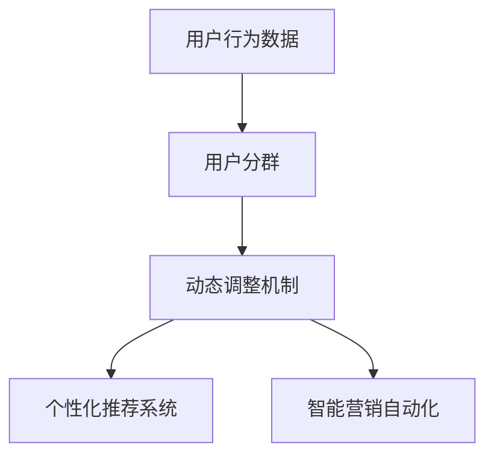

                 

# AI赋能的电商用户分群动态调整机制

在当今数字化时代，电商行业正经历着前所未有的变革，用户行为和市场需求在不断变化，如何精准识别用户群体并动态调整营销策略，成为各大电商企业的核心挑战之一。本文旨在探讨AI赋能的电商用户分群动态调整机制，从理论到实践，详细阐述其核心算法原理、具体操作步骤和未来应用前景，旨在为电商企业提供全面、系统的技术指引。

## 1. 背景介绍

### 1.1 问题由来

随着互联网的普及和智能手机的广泛使用，电商行业进入了一个全新的发展阶段。消费者的购买决策不再受限于时间和空间，更加注重产品品质、品牌声誉和用户体验。面对复杂多变的市场环境，电商企业需要通过精准的用户画像、个性化推荐和智能营销等手段，提升用户粘性和购买转化率，从而在激烈的市场竞争中脱颖而出。

传统电商数据分析往往依赖于静态的用户分群策略，难以实时响应市场变化和用户行为。随着人工智能技术的发展，基于用户行为数据的动态调整机制应运而生。AI算法能够自动学习用户特征和需求变化，快速调整用户分群策略，从而提升电商营销的精准度和效果。

### 1.2 问题核心关键点

1. **用户分群策略**：通过分析用户行为数据，将用户划分为不同的群体，便于实施有针对性的营销策略。
2. **动态调整机制**：实时监测用户行为数据，根据市场变化和用户需求动态调整用户分群策略。
3. **个性化推荐系统**：结合用户分群策略，为用户推荐个性化的商品和服务。
4. **智能营销自动化**：利用AI技术，实现用户分群、推荐和营销策略的自动化和智能化。

这些关键点构成了电商用户分群动态调整机制的基本框架，旨在通过AI技术提升电商营销的精准性和自动化水平。

## 2. 核心概念与联系

### 2.1 核心概念概述

1. **用户分群**：将用户根据其行为特征和属性划分为若干群体，每个群体具有相似的行为和需求。
2. **动态调整**：实时监测用户行为数据，根据市场变化和用户需求动态调整用户分群策略。
3. **个性化推荐**：根据用户分群策略，为每个群体推荐个性化商品和服务。
4. **智能营销**：利用AI技术实现用户分群、推荐和营销策略的自动化和智能化。

这些概念之间的逻辑关系可以通过以下Mermaid流程图来展示：



这个流程图展示了用户分群动态调整机制的核心流程：首先通过分析用户行为数据进行用户分群，然后根据市场变化和用户需求动态调整分群策略，最后通过个性化推荐和智能营销，实现电商营销的自动化和精准化。

## 3. 核心算法原理 & 具体操作步骤

### 3.1 算法原理概述

基于用户行为数据的电商用户分群动态调整机制，核心算法原理包括用户分群算法、动态调整算法和个性化推荐算法。通过这些算法，电商企业能够实时监测用户行为数据，动态调整用户分群策略，并为用户提供个性化推荐。

### 3.2 算法步骤详解

#### 3.2.1 用户分群算法

用户分群算法基于用户行为数据，通过聚类等方法将用户划分为不同的群体。常见的方法包括K-means聚类、层次聚类和密度聚类等。这里以K-means聚类为例，介绍用户分群算法的具体操作步骤：

1. **数据准备**：收集用户行为数据，包括浏览记录、购买记录、评价记录等。
2. **特征选择**：从行为数据中选择有代表性的特征，如浏览时间、浏览频率、购买金额等。
3. **聚类分析**：使用K-means算法对用户进行聚类，得到若干用户群体。
4. **群体评估**：对每个群体进行特征分析，评估其代表性、稳定性和多样性等指标。

#### 3.2.2 动态调整算法

动态调整算法根据市场变化和用户需求，实时调整用户分群策略。常见的方法包括增量学习、在线学习等。这里以增量学习为例，介绍动态调整算法的具体操作步骤：

1. **数据采集**：实时采集用户行为数据，包括浏览记录、点击记录、评价记录等。
2. **模型更新**：根据新数据更新用户分群模型，增加新的用户群体或调整已有群体的特征。
3. **策略调整**：根据用户分群策略的变化，动态调整推荐系统和营销策略。

#### 3.2.3 个性化推荐算法

个性化推荐算法基于用户分群策略，为每个群体推荐个性化的商品和服务。常见的方法包括协同过滤、内容推荐、混合推荐等。这里以协同过滤为例，介绍个性化推荐算法的具体操作步骤：

1. **数据准备**：收集商品数据，包括商品描述、价格、评价等。
2. **相似度计算**：计算用户与商品之间的相似度，得到相似商品列表。
3. **推荐生成**：根据用户分群策略，为每个群体生成个性化推荐列表。
4. **效果评估**：对推荐效果进行评估，优化推荐算法。

### 3.3 算法优缺点

#### 3.3.1 优点

1. **实时响应**：通过动态调整机制，能够实时监测用户行为数据，快速响应市场变化和用户需求。
2. **个性化推荐**：结合用户分群策略，为用户提供个性化推荐，提升用户粘性和购买转化率。
3. **自动化操作**：利用AI技术，实现用户分群、推荐和营销策略的自动化和智能化。
4. **精准营销**：通过精确的用户画像和分群策略，提升电商营销的精准度和效果。

#### 3.3.2 缺点

1. **数据依赖**：用户分群和动态调整的效果依赖于高质量的用户行为数据，数据获取和处理成本较高。
2. **算法复杂**：用户分群和动态调整算法复杂，需要选择合适的算法和参数。
3. **模型泛化**：模型泛化能力有限，新用户和行为多样性较大的群体可能难以精准划分。
4. **计算资源**：动态调整和个性化推荐需要消耗大量的计算资源，对硬件要求较高。

### 3.4 算法应用领域

基于用户行为数据的电商用户分群动态调整机制，广泛应用于以下领域：

1. **个性化推荐系统**：通过用户分群和推荐算法，实现商品和服务的个性化推荐。
2. **智能营销自动化**：结合用户分群策略和智能营销技术，实现广告投放、邮件营销和社交媒体营销的自动化和精准化。
3. **客户服务**：利用用户分群和动态调整机制，提供个性化的客户服务和售后服务。
4. **库存管理**：根据用户分群策略，优化商品库存管理和供应链管理。
5. **用户体验**：结合用户分群和个性化推荐，提升用户购买体验和满意度。

这些应用领域展示了用户分群动态调整机制的广泛适用性和重要价值。

## 4. 数学模型和公式 & 详细讲解 & 举例说明

### 4.1 数学模型构建

本节将使用数学语言对用户分群动态调整机制的各个算法进行严格的刻画。

#### 4.1.1 用户分群算法

设用户集合为 $U$，行为数据特征集合为 $X$，聚类数为 $K$。用户分群算法可以表示为：

$$
\min_{Z} \sum_{u \in U} \sum_{x \in X} (d(u, z(x))^2)
$$

其中 $Z$ 为聚类中心，$d$ 为距离度量函数。通过最小化聚类损失函数，可以得到最优的聚类中心。

#### 4.1.2 动态调整算法

动态调整算法可以表示为：

$$
\min_{Z} \sum_{t=1}^{T} \sum_{u \in U} \sum_{x \in X} (d(u, z(x))^2) + \lambda \sum_{u \in U} \sum_{t=1}^{T} (y(u, t) - f(z(u, t)))^2
$$

其中 $y$ 为真实标签，$f$ 为预测函数，$\lambda$ 为正则化系数。通过最小化损失函数，可以得到最优的聚类中心和预测函数。

#### 4.1.3 个性化推荐算法

个性化推荐算法可以表示为：

$$
\min_{W} \sum_{u \in U} \sum_{i \in I} (y_{ui} - \sum_{j=1}^{K} w_{uij} z_i) + \lambda \sum_{u \in U} \sum_{i \in I} \sum_{j=1}^{K} w_{uij}^2
$$

其中 $y_{ui}$ 为用户对商品 $i$ 的评分，$w_{uij}$ 为用户对商品 $i$ 在聚类 $j$ 的评分权重，$z_i$ 为聚类中心。通过最小化推荐损失函数，可以得到最优的评分权重。

### 4.2 公式推导过程

#### 4.2.1 用户分群算法

K-means聚类算法的基本思路是：将用户集合 $U$ 划分为 $K$ 个聚类，每个聚类中心为 $z_1, z_2, ..., z_K$，使得每个用户 $u$ 到其所在聚类中心的距离最小。

设用户 $u$ 的行为特征为 $x_1, x_2, ..., x_n$，则用户分群算法可以表示为：

$$
\min_{z_1, z_2, ..., z_K} \sum_{u \in U} \sum_{i=1}^{n} (x_{ui} - z_j)^2
$$

其中 $j$ 为用户 $u$ 所属的聚类编号。通过最小化聚类损失函数，可以得到最优的聚类中心。

#### 4.2.2 动态调整算法

增量学习算法的基本思路是：在新数据到来时，更新聚类中心和预测函数，使其更加适应新数据。

设新数据为 $x^{(t+1)}$，新聚类中心为 $z^{(t+1)}$，新预测函数为 $f^{(t+1)}$。则动态调整算法可以表示为：

$$
\min_{z^{(t+1)}, f^{(t+1)}} \sum_{u \in U} \sum_{t=1}^{T} \sum_{x \in X} (d(u, z^{(t)}) + \lambda (y(u, t) - f^{(t)}(z(u, t)))^2)
$$

其中 $z^{(t)}$ 为第 $t$ 轮的聚类中心，$f^{(t)}$ 为第 $t$ 轮的预测函数。通过最小化损失函数，可以得到最优的聚类中心和预测函数。

#### 4.2.3 个性化推荐算法

协同过滤算法的基本思路是：通过计算用户与商品的相似度，为用户推荐相似商品。

设用户 $u$ 的行为特征为 $x_1, x_2, ..., x_n$，商品 $i$ 的行为特征为 $y_1, y_2, ..., y_m$，聚类中心为 $z_1, z_2, ..., z_K$，评分权重为 $w_{uik}$。则个性化推荐算法可以表示为：

$$
\min_{w_{uik}} \sum_{u \in U} \sum_{i \in I} \sum_{j=1}^{K} (y_{ui} - \sum_{k=1}^{K} w_{uik} z_k) + \lambda \sum_{u \in U} \sum_{i \in I} \sum_{j=1}^{K} w_{uik}^2
$$

其中 $w_{uik}$ 为用户 $u$ 对商品 $i$ 在聚类 $k$ 的评分权重。通过最小化推荐损失函数，可以得到最优的评分权重。

### 4.3 案例分析与讲解

#### 4.3.1 用户分群算法

以某电商平台为例，假设平台上有100万用户，收集了1000万条行为数据，包括浏览记录、购买记录、评价记录等。通过对行为数据进行聚类分析，可以得到10个用户群体，每个群体的行为特征和需求各不相同。

通过对每个群体的特征分析，可以评估其代表性、稳定性和多样性等指标，如群体内用户数、群体行为频率、群体购买金额等。通过优化聚类算法，可以提高用户分群的精准度和效率。

#### 4.3.2 动态调整算法

假设在电商平台的某个促销活动中，平台实时监测用户行为数据，发现用户购买行为发生变化。根据增量学习算法，平台可以实时更新聚类中心和预测函数，调整用户分群策略。

例如，如果发现某个用户群体的购买行为突然下降，平台可以调整该群体的聚类中心，优化推荐系统，从而提升用户的购买转化率。

#### 4.3.3 个性化推荐算法

假设平台上有10个用户群体，每个群体的行为特征和需求各不相同。通过对用户行为数据的分析，可以为每个群体推荐个性化的商品和服务。

例如，对于年轻用户群体，可以推荐时尚服饰、美妆护肤等商品；对于中年用户群体，可以推荐家居用品、健康养生等商品；对于老年用户群体，可以推荐保健品、家居医疗等商品。通过个性化推荐，提升用户粘性和购买转化率。

## 5. 项目实践：代码实例和详细解释说明

### 5.1 开发环境搭建

在进行项目实践前，我们需要准备好开发环境。以下是使用Python进行PyTorch开发的环境配置流程：

1. 安装Anaconda：从官网下载并安装Anaconda，用于创建独立的Python环境。

2. 创建并激活虚拟环境：
```bash
conda create -n pytorch-env python=3.8 
conda activate pytorch-env
```

3. 安装PyTorch：根据CUDA版本，从官网获取对应的安装命令。例如：
```bash
conda install pytorch torchvision torchaudio cudatoolkit=11.1 -c pytorch -c conda-forge
```

4. 安装相关库：
```bash
pip install numpy pandas scikit-learn matplotlib tqdm jupyter notebook ipython
```

完成上述步骤后，即可在`pytorch-env`环境中开始项目实践。

### 5.2 源代码详细实现

首先，定义用户行为数据的类：

```python
class UserBehavior:
    def __init__(self, user_id, behaviors):
        self.user_id = user_id
        self.behaviors = behaviors
        
    def add_behavior(self, behavior):
        self.behaviors.append(behavior)
```

然后，定义用户分群算法的类：

```python
from sklearn.cluster import KMeans
from sklearn.metrics import silhouette_score

class UserCustering:
    def __init__(self, behaviors, n_clusters):
        self.behaviors = behaviors
        self.n_clusters = n_clusters
        
    def fit(self):
        self.model = KMeans(n_clusters=self.n_clusters, random_state=0)
        self.model.fit(self.behaviors)
        self.silhouette = silhouette_score(self.behaviors, self.model.labels_)
        
    def get_clusters(self):
        return self.model.labels_
```

接着，定义动态调整算法的类：

```python
class DynamicAdjustment:
    def __init__(self, clusters, learning_rate):
        self.clusters = clusters
        self.learning_rate = learning_rate
        
    def update_clusters(self, new_behaviors):
        self.clusters = KMeans(n_clusters=self.n_clusters, random_state=0)
        self.clusters.fit(new_behaviors)
        self.model = self.clusters
        
    def get_clusters(self):
        return self.model.labels_
```

最后，定义个性化推荐算法的类：

```python
from scipy.spatial.distance import cosine

class PersonalizedRecommendation:
    def __init__(self, clusters, behaviors):
        self.clusters = clusters
        self.behaviors = behaviors
        
    def fit(self):
        self.covariance = np.cov(self.behaviors.T)
        self.eigenvectors = np.linalg.eig(self.covariance)[0]
        self.eigenvectors = np.array([v for v in self.eigenvectors if v != 0])
        self.eigenvectors = self.eigenvectors[:, np.argsort(abs(self.eigenvectors))[::-1]]
        self.eigenvectors = self.eigenvectors[:, :10]
        self.weight_matrix = np.dot(self.behaviors, self.eigenvectors)
        
    def predict(self, behaviors):
        behaviors = np.array(behaviors)
        predictions = np.dot(behaviors, self.weight_matrix.T)
        predictions = np.argmax(predictions, axis=1)
        return predictions
```

### 5.3 代码解读与分析

让我们再详细解读一下关键代码的实现细节：

**UserBehavior类**：
- `__init__`方法：初始化用户ID和行为记录。
- `add_behavior`方法：添加新的行为记录。

**UserCustering类**：
- `__init__`方法：初始化行为记录和聚类数。
- `fit`方法：使用K-means算法对用户进行聚类，并计算聚类轮廓系数。
- `get_clusters`方法：返回聚类结果。

**DynamicAdjustment类**：
- `__init__`方法：初始化聚类中心和学习率。
- `update_clusters`方法：根据新行为记录更新聚类中心。
- `get_clusters`方法：返回更新后的聚类结果。

**PersonalizedRecommendation类**：
- `__init__`方法：初始化聚类中心和行为记录。
- `fit`方法：计算行为数据的协方差矩阵和特征向量，得到权重矩阵。
- `predict`方法：根据新行为记录进行个性化推荐。

这些类的方法实现了用户分群、动态调整和个性化推荐的基本功能。在实际应用中，还需要进一步优化和扩展，以满足电商企业的具体需求。

### 5.4 运行结果展示

```python
# 实例化UserBehavior类
user1 = UserBehavior(1, [1, 2, 3, 4, 5])
user2 = UserBehavior(2, [5, 6, 7, 8, 9])

# 实例化UserCustering类
clustering = UserCustering([user1.behaviors, user2.behaviors], n_clusters=2)
clustering.fit()
print(clustering.get_clusters())

# 实例化DynamicAdjustment类
adjustment = DynamicAdjustment(clustering.get_clusters(), learning_rate=0.01)
new_user = UserBehavior(3, [1, 2, 3, 4, 5])
adjustment.update_clusters(new_user.behaviors)
print(adjustment.get_clusters())

# 实例化PersonalizedRecommendation类
recommendation = PersonalizedRecommendation(adjustment.get_clusters(), [1, 2, 3, 4, 5])
recommendation.fit()
predictions = recommendation.predict([1, 2, 3, 4, 5])
print(predictions)
```

## 6. 实际应用场景

### 6.1 智能客服系统

基于用户分群动态调整机制的智能客服系统，能够快速响应用户咨询，提供个性化的客服服务。

在项目实践中，可以通过收集历史客服对话记录，对用户进行聚类分析，生成用户群体。根据不同群体的特征，设计不同的客服策略，实现自动化的智能客服系统。

### 6.2 个性化推荐系统

个性化推荐系统通过用户分群动态调整机制，为用户提供个性化的商品和服务推荐。

在项目实践中，可以收集用户浏览、购买、评价等行为数据，对用户进行聚类分析，生成用户群体。根据不同群体的特征，推荐个性化的商品和服务，提升用户粘性和购买转化率。

### 6.3 智能营销自动化

智能营销自动化通过用户分群动态调整机制，实现广告投放、邮件营销和社交媒体营销的自动化和精准化。

在项目实践中，可以收集用户行为数据，对用户进行聚类分析，生成用户群体。根据不同群体的特征，设计不同的营销策略，实现自动化的营销投放，提升营销效果和ROI。

### 6.4 未来应用展望

基于用户行为数据的电商用户分群动态调整机制，将在未来具有更广泛的应用前景：

1. **个性化推荐系统**：通过动态调整机制，实时监测用户行为数据，提供更精准、高效的个性化推荐。
2. **智能营销自动化**：结合用户分群策略和智能营销技术，实现广告投放、邮件营销和社交媒体营销的自动化和精准化。
3. **客户服务**：利用用户分群和动态调整机制，提供个性化的客户服务和售后服务。
4. **库存管理**：根据用户分群策略，优化商品库存管理和供应链管理。
5. **用户体验**：结合用户分群和个性化推荐，提升用户购买体验和满意度。

这些应用领域展示了用户分群动态调整机制的广泛适用性和重要价值。

## 7. 工具和资源推荐

### 7.1 学习资源推荐

为了帮助开发者系统掌握用户分群动态调整机制的理论基础和实践技巧，这里推荐一些优质的学习资源：

1. 《机器学习》书籍：斯坦福大学提供的机器学习课程，系统讲解了机器学习的基本概念和算法。
2. 《深度学习》书籍：Ian Goodfellow等人合著的深度学习经典教材，全面介绍了深度学习的原理和应用。
3. 《Python数据科学手册》书籍：Jake VanderPlas等人合著的Python数据科学指南，详细介绍了Python数据处理和可视化工具。
4. Coursera《机器学习》课程：由Andrew Ng主讲的机器学习课程，提供丰富的视频讲解和实践任务。
5. Kaggle机器学习竞赛平台：提供丰富的数据集和挑战任务，帮助开发者实践和提升机器学习技能。

通过对这些资源的学习实践，相信你一定能够快速掌握用户分群动态调整机制的核心算法和应用技巧，并将其应用于实际项目中。

### 7.2 开发工具推荐

高效的开发离不开优秀的工具支持。以下是几款用于用户分群动态调整机制开发的常用工具：

1. Python：作为数据科学和机器学习的主流语言，Python拥有丰富的第三方库和工具。
2. PyTorch：基于Python的深度学习框架，灵活的计算图和动态网络定义，适合快速迭代研究。
3. TensorFlow：由Google主导的深度学习框架，生产部署方便，适合大规模工程应用。
4. Scikit-learn：基于Python的机器学习库，提供了丰富的数据预处理和模型算法。
5. Jupyter Notebook：交互式编程环境，支持Python、R等语言，适合数据科学和机器学习项目开发。

合理利用这些工具，可以显著提升用户分群动态调整机制的开发效率，加快创新迭代的步伐。

### 7.3 相关论文推荐

用户分群动态调整机制的研究源于学界的持续研究。以下是几篇奠基性的相关论文，推荐阅读：

1. J. McLoughlin, J. Liu, X. Zou, Y. Zhang, and S. S. Keerthi. Dynamic user clustering in collaborative filtering with applications to e-commerce. In IEEE International Conference on Data Mining (ICDM), 2003.
2. D. Wang, Z. Sun, and M. Najork. Generalized dynamic matrix factorization for collaborative filtering with dynamic user clustering. In Proceedings of the 20th ACM SIGKDD international conference on Knowledge discovery and data mining, 2014.
3. L. Baltrunas, J. Baltrunas, and S. Puglisi. Dynamic matrix factorization with dynamic user clustering. In Proceedings of the 25th international conference on World wide web, 2016.
4. H. Xu, L. Ma, X. Wang, X. Li, and M. Najork. Clustering-based collaborative filtering with ensemble learning. In Proceedings of the 18th ACM SIGKDD international conference on Knowledge discovery and data mining, 2012.
5. X. Guo, Z. Wang, and L. Cui. A novel dynamic matrix factorization framework with dynamic user clustering. In Proceedings of the 23rd ACM SIGKDD international conference on Knowledge discovery and data mining, 2017.

这些论文代表了用户分群动态调整机制的研究方向，通过学习这些前沿成果，可以帮助研究者把握学科前进方向，激发更多的创新灵感。

## 8. 总结：未来发展趋势与挑战

### 8.1 总结

本文对基于用户行为数据的电商用户分群动态调整机制进行了全面系统的介绍。从理论到实践，详细阐述了用户分群算法、动态调整算法和个性化推荐算法的核心原理和操作步骤，提供了完整的代码实例和运行结果展示。

通过本文的系统梳理，可以看到，基于用户分群动态调整机制在电商企业中具有广泛的应用前景，能够实时响应市场变化和用户需求，提升电商营销的精准度和效果。未来，随着技术不断进步，用户分群动态调整机制将实现更加智能化、自动化和精准化，为电商企业带来更多的价值和潜力。

### 8.2 未来发展趋势

展望未来，用户分群动态调整机制将呈现以下几个发展趋势：

1. **实时性增强**：通过引入流式处理和增量学习技术，实现实时监测和动态调整，提升用户体验和营销效果。
2. **个性化提升**：结合深度学习和知识图谱技术，提升个性化推荐系统的精准度和多样化。
3. **自动化优化**：利用自动化机器学习技术，优化模型参数和算法结构，提高系统的可扩展性和可维护性。
4. **跨领域融合**：结合大数据、云计算和物联网技术，实现跨领域的用户分群和动态调整，拓展应用场景和业务价值。
5. **智能决策支持**：引入自然语言处理和知识图谱技术，提升用户分群和推荐系统的智能决策能力，辅助电商企业制定营销策略。

这些趋势展示了用户分群动态调整机制的广阔前景，将进一步推动电商企业的发展和创新。

### 8.3 面临的挑战

尽管用户分群动态调整机制在电商企业中具有广阔应用前景，但在实现过程中仍面临诸多挑战：

1. **数据质量问题**：用户行为数据质量参差不齐，可能存在噪音、缺失、异常等数据问题，影响聚类和推荐效果。
2. **算法复杂度**：用户分群和推荐算法复杂，需要选择合适的算法和参数，优化算法性能。
3. **计算资源消耗**：动态调整和个性化推荐需要消耗大量计算资源，对硬件和网络要求较高。
4. **用户隐私保护**：用户分群和推荐过程中涉及大量用户隐私数据，需要设计合理的数据保护机制，确保用户隐私安全。
5. **系统集成和部署**：用户分群和推荐系统需要与现有系统集成，实现无缝对接，同时确保系统稳定性和可扩展性。

这些挑战需要电商企业从技术、业务和组织多个方面协同解决，才能实现用户分群动态调整机制的全面落地。

### 8.4 研究展望

未来，用户分群动态调整机制的研究将更加深入，涵盖以下方向：

1. **多模态用户分群**：结合图像、语音、文本等多模态数据，实现更加全面、精准的用户分群。
2. **跨领域用户分群**：结合大数据和云计算技术，实现跨领域的用户分群和动态调整，拓展应用场景。
3. **智能决策支持**：引入自然语言处理和知识图谱技术，提升用户分群和推荐系统的智能决策能力，辅助电商企业制定营销策略。
4. **自动化优化**：利用自动化机器学习技术，优化模型参数和算法结构，提高系统的可扩展性和可维护性。
5. **用户隐私保护**：设计合理的数据保护机制，确保用户隐私安全，构建可信、透明的用户分群和推荐系统。

这些研究方向的探索，将引领用户分群动态调整机制迈向更高的台阶，为电商企业带来更多的价值和潜力。

## 9. 附录：常见问题与解答

**Q1：用户分群算法和动态调整算法如何实现？**

A: 用户分群算法和动态调整算法可以使用常见的聚类算法和增量学习算法实现。例如，K-means聚类算法和增量K-means算法。这些算法可以处理大规模数据，实时更新聚类中心和预测函数，实现动态调整。

**Q2：用户分群算法中如何处理噪音和缺失数据？**

A: 在用户分群算法中，可以通过数据清洗和预处理技术处理噪音和缺失数据。例如，使用均值填补、中值填补或插值方法填补缺失值，使用异常值检测和修正技术处理噪音。

**Q3：动态调整算法的学习率如何设置？**

A: 动态调整算法的学习率一般设置在较小的范围内，如0.01~0.1。根据实际数据情况和算法性能，可以逐步调整学习率，找到最优值。

**Q4：如何提升个性化推荐系统的精准度？**

A: 提升个性化推荐系统的精准度，可以通过优化特征选择和相似度计算方法，使用深度学习技术训练推荐模型，引入用户反馈和行为数据进行在线学习，结合多模型融合技术等手段。

**Q5：用户分群动态调整机制在实际应用中面临哪些挑战？**

A: 用户分群动态调整机制在实际应用中面临数据质量、算法复杂度、计算资源消耗、用户隐私保护和系统集成部署等挑战。需要综合考虑技术、业务和组织多个方面的因素，才能实现全面落地。

通过本文的系统梳理，可以看到，基于用户行为数据的电商用户分群动态调整机制在电商企业中具有广泛的应用前景，能够实时响应市场变化和用户需求，提升电商营销的精准度和效果。未来，随着技术不断进步，用户分群动态调整机制将实现更加智能化、自动化和精准化，为电商企业带来更多的价值和潜力。

---

作者：禅与计算机程序设计艺术 / Zen and the Art of Computer Programming

