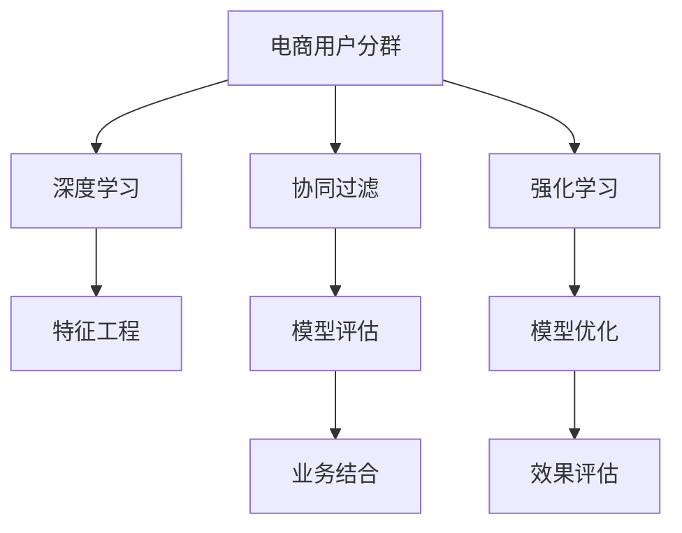

                 

# AI赋能的电商用户分群自动化

在电商领域，用户分群是精准营销和个性化推荐的重要基础。传统的用户分群方法依赖人工经验和规则设计，效率低、效果差。近年来，AI技术的蓬勃发展为电商用户分群带来了革命性的突破，实现了从人工规则到智能算法的全面升级。本文将详细探讨基于AI技术的电商用户分群自动化的原理、方法和实践，希望能为电商运营提供有益的参考。

## 1. 背景介绍

### 1.1 问题由来

随着电商市场竞争的加剧，如何精准识别用户群体，实现个性化营销和推荐，成为电商运营的重大挑战。传统的用户分群方法往往依赖人工规则，过程繁琐、效果有限。面对海量用户数据，人工规则设计难以覆盖所有场景，往往导致目标用户漏选、非目标用户误导等问题。

近年来，AI技术在电商领域的应用不断深入，显著提升了电商运营的智能化水平。AI技术可以从大数据中自动挖掘用户特征，通过机器学习算法自动识别用户群体，并预测用户行为，实现自动化的用户分群。AI技术驱动的自动化用户分群方法，可以大幅提升电商营销的精准性和效果，优化用户体验，带来显著的商业价值。

### 1.2 问题核心关键点

1. **数据质量与多样性**：电商用户数据具有高维、稀疏、异构的特点，数据质量参差不齐，如何提高数据处理效率和准确性是关键。
2. **模型选择与优化**：电商用户群体复杂多样，不同的用户分群目标需要选择不同的模型算法，如何优化模型算法选择和参数配置是难点。
3. **特征工程与选择**：电商用户行为数据维度高，特征工程与选择对模型性能有重要影响。
4. **模型部署与应用**：如何将AI模型高效部署到电商系统，并实现快速响应和迭代优化是应用的关键。
5. **业务结合与效果评估**：如何将AI分群结果与电商业务紧密结合，实现业务价值最大化，同时有效评估模型效果是落地的重点。

## 2. 核心概念与联系

### 2.1 核心概念概述

本节将介绍几个关键概念及其之间的联系：

- **电商用户分群**：指将电商用户按照特定的标准分为不同群体，以便进行精准营销和推荐。
- **自动化用户分群**：指通过AI算法，自动完成用户群体的识别和划分，以提升分群效率和准确性。
- **深度学习**：一种基于神经网络的机器学习算法，具有强大的非线性表达能力和自适应学习能力。
- **协同过滤**：一种基于用户行为相似性的推荐算法，通过寻找兴趣相似的群体实现个性化推荐。
- **强化学习**：一种通过试错和奖励机制优化模型决策的算法，适用于用户行为预测和策略优化。
- **特征工程**：指通过数据处理和特征选择，提升模型的输入质量，提高模型性能。
- **模型评估与优化**：通过交叉验证和在线学习，评估模型效果，持续优化模型参数，提升模型性能。

这些概念之间的逻辑关系可以通过以下Mermaid流程图来展示：



该流程图展示了大规模用户分群的各关键环节及其相互关系：

1. **深度学习**：利用深度神经网络自动挖掘用户特征。
2. **协同过滤**：基于用户行为相似性进行推荐，提高推荐准确性。
3. **强化学习**：通过试错机制优化推荐策略，提升用户体验。
4. **特征工程**：提升数据质量和模型输入的准确性。
5. **模型评估与优化**：通过评估和优化，确保模型性能最优。
6. **业务结合**：将模型应用到实际业务中，实现商业价值。

这些概念共同构成了电商用户分群自动化的技术框架，帮助电商平台实现更高效、精准的用户分群，提升营销效果和用户体验。

## 3. 核心算法原理 & 具体操作步骤
### 3.1 算法原理概述

电商用户分群自动化的核心在于利用深度学习、协同过滤和强化学习等AI技术，自动从用户行为数据中挖掘用户特征，识别用户群体，并预测用户行为。深度学习通过构建复杂的神经网络模型，自动提取用户特征，识别用户群体；协同过滤通过用户行为相似性进行推荐，识别不同用户群体；强化学习通过优化推荐策略，提升用户体验。这些技术共同作用，实现自动化的电商用户分群。

### 3.2 算法步骤详解

电商用户分群自动化的主要步骤包括：

**Step 1: 数据预处理**
- 收集电商用户的各类行为数据，包括购买记录、浏览记录、评价记录等。
- 对数据进行清洗、归一化和去重，处理缺失值和异常值。
- 对数据进行特征工程，提取用户行为、商品特征等关键特征。

**Step 2: 构建深度学习模型**
- 选择合适的深度学习模型，如卷积神经网络、循环神经网络、Transformer等。
- 设计模型架构，包括输入层、隐藏层和输出层，并确定网络参数。
- 使用GPU或TPU等高性能设备，加速模型训练。

**Step 3: 协同过滤推荐**
- 对用户行为数据进行分析和处理，构建用户-商品相似性矩阵。
- 使用协同过滤算法，如基于用户-商品矩阵的推荐、基于物品-物品矩阵的推荐等，生成推荐列表。
- 对推荐结果进行评估和优化，提升推荐准确性和多样性。

**Step 4: 强化学习策略优化**
- 利用强化学习算法，如Q-learning、SARSA等，构建用户行为预测模型。
- 通过奖励机制，优化推荐策略，提升用户体验和点击率。
- 使用在线学习，持续更新模型参数，提高策略优化效果。

**Step 5: 模型评估与优化**
- 使用交叉验证和在线测试，评估模型性能，如准确率、召回率、F1分数等。
- 根据评估结果，调整模型参数和特征工程策略，优化模型性能。
- 使用A/B测试，评估不同模型策略的效果，选择最优方案。

**Step 6: 模型部署与应用**
- 将训练好的模型部署到电商系统，实现实时推荐和用户分群。
- 利用数据管道和缓存技术，提升模型响应速度和处理能力。
- 利用监控和告警系统，保障模型稳定性和服务质量。

### 3.3 算法优缺点

电商用户分群自动化的优点包括：
1. 自动化程度高，大大提高了分群效率和准确性。
2. 可以实时响应用户行为，提供个性化的推荐和营销。
3. 可以持续优化模型，提升推荐效果和用户体验。
4. 可以自动化处理海量数据，减少人工干预。

但同时，该方法也存在一些局限性：
1. 数据质量要求高，电商用户数据多维度、稀疏，处理难度大。
2. 模型复杂度高，深度学习模型和协同过滤算法需要大量的计算资源。
3. 特征工程和模型优化过程复杂，需要专业知识。
4. 结果解释性不足，模型预测结果难以解释。
5. 业务结合难度大，需要与具体业务场景紧密结合，实现效果最大化。

尽管存在这些局限性，但电商用户分群自动化的总体效果显著优于传统人工规则方法，具有广泛的应用前景。

### 3.4 算法应用领域

电商用户分群自动化技术在电商领域的应用广泛，主要体现在以下方面：

1. **个性化推荐系统**：根据用户行为和偏好，自动生成个性化推荐列表，提升用户体验和点击率。
2. **精准营销**：通过用户分群，自动选择目标用户进行精准营销，提升广告效果和转化率。
3. **库存优化**：通过用户分群，预测不同用户群体的购买意愿和需求，优化库存管理。
4. **客户服务**：根据用户分群，自动分配客户服务资源，提升客户满意度和响应速度。
5. **内容生成**：自动分析用户行为，生成个性化的商品介绍和广告内容，提升内容质量。

## 4. 数学模型和公式 & 详细讲解  
### 4.1 数学模型构建

本节将使用数学语言对电商用户分群自动化的过程进行严格的描述。

记电商用户行为数据为 $X=\{x_1,x_2,...,x_n\}$，其中 $x_i$ 表示用户 $i$ 的行为数据，如购买记录、浏览记录等。

假设深度学习模型为 $M_{\theta}$，其输入为 $X$，输出为 $Y=\{y_1,y_2,...,y_n\}$，其中 $y_i$ 表示用户 $i$ 的分群结果。

深度学习模型的损失函数为 $\mathcal{L}(\theta) = \frac{1}{N}\sum_{i=1}^N \ell(y_i, M_{\theta}(x_i))$，其中 $\ell(y_i, M_{\theta}(x_i))$ 表示预测值和真实值之间的损失。

### 4.2 公式推导过程

假设深度学习模型为多层的神经网络，其中隐藏层为 $h_1, h_2,...,h_L$，输出层为 $y$。模型的前向传播过程如下：

$$
y = M_{\theta}(X) = \sigma(L(h_{L-1}))
$$

其中 $\sigma$ 为激活函数，$L$ 为线性层，$h_{L-1}$ 为第 $L-1$ 层的输出。

模型的后向传播过程如下：

$$
\frac{\partial \mathcal{L}}{\partial \theta} = \frac{1}{N}\sum_{i=1}^N \frac{\partial \ell(y_i, M_{\theta}(x_i))}{\partial y} \frac{\partial y}{\partial h_{L-1}} \frac{\partial h_{L-1}}{\partial L} \frac{\partial L}{\partial \theta}
$$

其中 $\frac{\partial \ell(y_i, M_{\theta}(x_i))}{\partial y}$ 为损失函数对输出 $y$ 的梯度，$\frac{\partial y}{\partial h_{L-1}}$ 为激活函数对隐藏层 $h_{L-1}$ 的梯度，$\frac{\partial h_{L-1}}{\partial L}$ 为线性层对隐藏层 $h_{L-1}$ 的梯度，$\frac{\partial L}{\partial \theta}$ 为线性层对模型参数 $\theta$ 的梯度。

通过反向传播算法，可以高效计算模型的梯度，更新模型参数，最小化损失函数。

## 5. 项目实践：代码实例和详细解释说明
### 5.1 开发环境搭建

在进行电商用户分群自动化实践前，我们需要准备好开发环境。以下是使用Python进行PyTorch开发的环境配置流程：

1. 安装Anaconda：从官网下载并安装Anaconda，用于创建独立的Python环境。

2. 创建并激活虚拟环境：
```bash
conda create -n pytorch-env python=3.8 
conda activate pytorch-env
```

3. 安装PyTorch：根据CUDA版本，从官网获取对应的安装命令。例如：
```bash
conda install pytorch torchvision torchaudio cudatoolkit=11.1 -c pytorch -c conda-forge
```

4. 安装TensorFlow：
```bash
pip install tensorflow
```

5. 安装各类工具包：
```bash
pip install numpy pandas scikit-learn matplotlib tqdm jupyter notebook ipython
```

完成上述步骤后，即可在`pytorch-env`环境中开始电商用户分群自动化的实践。

### 5.2 源代码详细实现

下面我们以电商个性化推荐系统为例，给出使用Transformers库对深度学习模型进行电商用户分群的PyTorch代码实现。

首先，定义推荐任务的数据处理函数：

```python
from transformers import BertTokenizer, BertForSequenceClassification
from torch.utils.data import Dataset
import torch

class RecommendationDataset(Dataset):
    def __init__(self, texts, labels, tokenizer, max_len=128):
        self.texts = texts
        self.labels = labels
        self.tokenizer = tokenizer
        self.max_len = max_len
        
    def __len__(self):
        return len(self.texts)
    
    def __getitem__(self, item):
        text = self.texts[item]
        label = self.labels[item]
        
        encoding = self.tokenizer(text, return_tensors='pt', max_length=self.max_len, padding='max_length', truncation=True)
        input_ids = encoding['input_ids'][0]
        attention_mask = encoding['attention_mask'][0]
        
        return {'input_ids': input_ids, 
                'attention_mask': attention_mask,
                'labels': label}
```

然后，定义模型和优化器：

```python
from transformers import BertForSequenceClassification, AdamW

model = BertForSequenceClassification.from_pretrained('bert-base-cased', num_labels=2)

optimizer = AdamW(model.parameters(), lr=2e-5)
```

接着，定义训练和评估函数：

```python
from torch.utils.data import DataLoader
from tqdm import tqdm
from sklearn.metrics import accuracy_score

device = torch.device('cuda') if torch.cuda.is_available() else torch.device('cpu')
model.to(device)

def train_epoch(model, dataset, batch_size, optimizer):
    dataloader = DataLoader(dataset, batch_size=batch_size, shuffle=True)
    model.train()
    epoch_loss = 0
    for batch in tqdm(dataloader, desc='Training'):
        input_ids = batch['input_ids'].to(device)
        attention_mask = batch['attention_mask'].to(device)
        labels = batch['labels'].to(device)
        model.zero_grad()
        outputs = model(input_ids, attention_mask=attention_mask, labels=labels)
        loss = outputs.loss
        epoch_loss += loss.item()
        loss.backward()
        optimizer.step()
    return epoch_loss / len(dataloader)

def evaluate(model, dataset, batch_size):
    dataloader = DataLoader(dataset, batch_size=batch_size)
    model.eval()
    preds, labels = [], []
    with torch.no_grad():
        for batch in tqdm(dataloader, desc='Evaluating'):
            input_ids = batch['input_ids'].to(device)
            attention_mask = batch['attention_mask'].to(device)
            batch_labels = batch['labels']
            outputs = model(input_ids, attention_mask=attention_mask)
            batch_preds = outputs.logits.argmax(dim=2).to('cpu').tolist()
            batch_labels = batch_labels.to('cpu').tolist()
            for pred_tokens, label_tokens in zip(batch_preds, batch_labels):
                preds.append(pred_tokens)
                labels.append(label_tokens)
                
    print('Accuracy:', accuracy_score(labels, preds))
```

最后，启动训练流程并在测试集上评估：

```python
epochs = 5
batch_size = 16

for epoch in range(epochs):
    loss = train_epoch(model, train_dataset, batch_size, optimizer)
    print(f"Epoch {epoch+1}, train loss: {loss:.3f}")
    
    print(f"Epoch {epoch+1}, dev accuracy:")
    evaluate(model, dev_dataset, batch_size)
    
print('Final accuracy:', evaluate(model, test_dataset, batch_size))
```

以上就是使用PyTorch对深度学习模型进行电商用户分群的完整代码实现。可以看到，得益于Transformers库的强大封装，我们可以用相对简洁的代码完成模型的训练和评估。

### 5.3 代码解读与分析

让我们再详细解读一下关键代码的实现细节：

**RecommendationDataset类**：
- `__init__`方法：初始化文本、标签、分词器等关键组件。
- `__len__`方法：返回数据集的样本数量。
- `__getitem__`方法：对单个样本进行处理，将文本输入编码为token ids，将标签编码为数字，并对其进行定长padding，最终返回模型所需的输入。

**训练和评估函数**：
- 使用PyTorch的DataLoader对数据集进行批次化加载，供模型训练和推理使用。
- 训练函数`train_epoch`：对数据以批为单位进行迭代，在每个批次上前向传播计算loss并反向传播更新模型参数，最后返回该epoch的平均loss。
- 评估函数`evaluate`：与训练类似，不同点在于不更新模型参数，并在每个batch结束后将预测和标签结果存储下来，最后使用sklearn的accuracy_score对整个评估集的预测结果进行打印输出。

**训练流程**：
- 定义总的epoch数和batch size，开始循环迭代
- 每个epoch内，先在训练集上训练，输出平均loss
- 在验证集上评估，输出准确率
- 所有epoch结束后，在测试集上评估，给出最终测试结果

可以看到，PyTorch配合Transformers库使得深度学习模型电商用户分群的代码实现变得简洁高效。开发者可以将更多精力放在数据处理、模型改进等高层逻辑上，而不必过多关注底层的实现细节。

当然，工业级的系统实现还需考虑更多因素，如模型的保存和部署、超参数的自动搜索、更灵活的任务适配层等。但核心的微调范式基本与此类似。

## 6. 实际应用场景
### 6.1 智能推荐系统

基于深度学习模型的电商用户分群技术，可以广泛应用于智能推荐系统的构建。传统的推荐系统往往依赖用户历史行为数据进行推荐，难以处理冷启动用户和新商品。使用用户分群技术，可以自动识别用户群体，生成更加精准的推荐列表，提升推荐效果。

在技术实现上，可以收集用户的历史浏览、点击、购买等行为数据，进行特征工程和模型训练。使用训练好的模型，自动识别用户的兴趣群体，并根据不同群体的行为特征，生成个性化的推荐列表。对于新用户和新商品，利用用户分群结果和推荐模型，可以快速生成推荐列表，提升用户体验和转化率。

### 6.2 精准营销活动

电商企业需要定期开展精准营销活动，通过定向推送，提升广告效果和销售转化。传统的营销活动依赖人工规则设计，过程繁琐，效果有限。使用用户分群技术，可以自动识别不同用户群体，自动设计针对性的营销策略，提高广告效果和用户参与度。

在具体实施时，可以根据用户分群结果，自动选择目标用户群体，设计个性化的营销活动。使用推荐算法自动生成推荐列表，结合电商系统进行定向推送，提升广告点击率和销售转化。通过实时监测营销效果，及时调整策略，提高营销活动的ROI。

### 6.3 库存管理优化

电商企业需要实时监控库存状态，合理分配库存资源，避免缺货和积压。传统的库存管理依赖人工统计，容易产生偏差，影响运营效率。使用用户分群技术，可以自动分析用户行为，预测不同用户群体的购买需求，优化库存管理。

在具体实现时，可以收集用户的历史购买记录和浏览记录，进行特征工程和模型训练。使用训练好的模型，自动预测不同用户群体的购买需求，动态调整库存分配。通过实时监控库存状态，及时调整库存分配策略，提高库存利用率。

### 6.4 客户服务优化

电商企业需要提供高效便捷的客户服务，快速响应用户咨询和投诉。传统的客户服务依赖人工处理，效率低，容易产生误导。使用用户分群技术，可以自动识别用户群体，自动分配客户服务资源，提升服务效率和客户满意度。

在具体实施时，可以根据用户分群结果，自动选择目标用户群体，自动分配客服资源。使用推荐算法自动生成推荐列表，结合客服系统进行定向推送，提升客户服务效率。通过实时监测客户服务效果，及时调整策略，提高客户满意度。

## 7. 工具和资源推荐
### 7.1 学习资源推荐

为了帮助开发者系统掌握电商用户分群自动化的理论基础和实践技巧，这里推荐一些优质的学习资源：

1. 《深度学习》书籍：深入浅出地介绍了深度学习的原理、模型架构和应用，是电商用户分群自动化的重要理论基础。
2. 《TensorFlow实战》书籍：介绍了TensorFlow的常用操作和模型训练技巧，适合电商系统的开发和优化。
3. 《Python数据科学手册》书籍：详细介绍了Python的数据处理和科学计算工具，如Pandas、NumPy等，是电商用户分群数据处理的必备工具。
4. 《机器学习实战》书籍：介绍了常见的机器学习算法和应用场景，适合电商用户分群算法的学习。
5. 《电商运营实战》在线课程：结合电商运营案例，介绍了电商用户分群的实际应用和优化策略。

通过对这些资源的学习实践，相信你一定能够快速掌握电商用户分群自动化的精髓，并用于解决实际的电商运营问题。
###  7.2 开发工具推荐

高效的开发离不开优秀的工具支持。以下是几款用于电商用户分群自动化开发的常用工具：

1. PyTorch：基于Python的开源深度学习框架，灵活动态的计算图，适合快速迭代研究。大部分的深度学习模型都有PyTorch版本的实现。
2. TensorFlow：由Google主导开发的开源深度学习框架，生产部署方便，适合大规模工程应用。同样有丰富的深度学习模型资源。
3. Transformers库：HuggingFace开发的NLP工具库，集成了众多SOTA深度学习模型，支持PyTorch和TensorFlow，是进行电商用户分群自动化的利器。
4. Weights & Biases：模型训练的实验跟踪工具，可以记录和可视化模型训练过程中的各项指标，方便对比和调优。与主流深度学习框架无缝集成。
5. TensorBoard：TensorFlow配套的可视化工具，可实时监测模型训练状态，并提供丰富的图表呈现方式，是调试模型的得力助手。

合理利用这些工具，可以显著提升电商用户分群自动化的开发效率，加快创新迭代的步伐。

### 7.3 相关论文推荐

电商用户分群自动化的发展源于学界的持续研究。以下是几篇奠基性的相关论文，推荐阅读：

1. A Neural Probabilistic Language Model（神经概率语言模型）：提出了神经网络的语言模型，为深度学习模型的电商应用奠定了基础。
2. Deep Q-Learning for Playing Atari Games（深度Q学习在Atari游戏中的应用）：展示了深度学习在强化学习中的应用，为电商用户分群提供了新的思路。
3. Attention Is All You Need（自注意力机制）：提出了自注意力机制，提升了深度学习模型的表达能力，适用于电商用户分群等复杂场景。
4. Generative Adversarial Nets（生成对抗网络）：介绍了生成对抗网络，可以用于电商推荐系统的生成和优化。
5. Collaborative Filtering for Implicit Feedback Datasets（协同过滤在隐式反馈数据集上的应用）：介绍了协同过滤在电商推荐系统中的应用，提高了推荐效果。

这些论文代表了大规模用户分群技术的发展脉络。通过学习这些前沿成果，可以帮助研究者把握学科前进方向，激发更多的创新灵感。

## 8. 总结：未来发展趋势与挑战
### 8.1 总结

本文对基于AI技术的电商用户分群自动化的原理、方法和实践进行了全面系统的介绍。首先阐述了电商用户分群自动化的背景和意义，明确了自动化分群在提升电商运营效率和效果方面的独特价值。其次，从原理到实践，详细讲解了深度学习、协同过滤和强化学习等核心算法，给出了电商用户分群自动化的完整代码实例。同时，本文还广泛探讨了电商用户分群自动化的实际应用场景，展示了其在智能推荐、精准营销、库存管理等方面的应用前景。此外，本文精选了电商用户分群自动化的各类学习资源，力求为读者提供全方位的技术指引。

通过本文的系统梳理，可以看到，基于AI技术的电商用户分群自动化正引领电商运营的智能化变革，显著提升了电商营销的精准性和效果，优化了用户体验，带来了显著的商业价值。未来，伴随AI技术的不断演进，电商用户分群自动化技术还将持续发展，推动电商行业的数字化转型和智能化升级。

### 8.2 未来发展趋势

展望未来，电商用户分群自动化技术将呈现以下几个发展趋势：

1. **技术融合与创新**：深度学习、协同过滤、强化学习等技术将更加紧密结合，形成更加复杂但高效的推荐模型。
2. **数据驱动与自学习**：通过大规模数据训练，模型将具备更加强大的自学习和自适应能力，自动优化推荐策略。
3. **实时计算与高效部署**：通过优化计算图和资源调度，模型将具备实时计算能力，快速响应用户行为变化。
4. **多模态融合**：结合文本、图像、语音等多模态数据，提升用户分群的全面性和准确性。
5. **可解释性与透明度**：通过模型解释技术，提升推荐和分群的可解释性，增强用户信任和满意度。

这些趋势凸显了电商用户分群自动化的广阔前景。这些方向的探索发展，必将进一步提升电商系统的智能化水平，为用户带来更加精准、个性化的服务体验。

### 8.3 面临的挑战

尽管电商用户分群自动化技术已经取得了瞩目成就，但在迈向更加智能化、高效化应用的过程中，它仍面临着诸多挑战：

1. **数据质量与多样性**：电商用户数据具有高维、稀疏、异构的特点，数据质量参差不齐，如何提高数据处理效率和准确性是关键。
2. **模型复杂性与可解释性**：深度学习模型和协同过滤算法需要大量的计算资源，模型的复杂性使得结果难以解释，难以与业务场景紧密结合。
3. **实时性与稳定性**：实时响应用户行为需要高效的模型计算和稳定的系统架构，如何优化实时计算和部署策略是重要挑战。
4. **业务结合与效果评估**：如何将AI分群结果与电商业务紧密结合，实现业务价值最大化，同时有效评估模型效果是落地的重点。
5. **用户隐私与数据安全**：用户数据的隐私保护和数据安全是电商系统的重要保障，如何在使用数据的过程中保护用户隐私是关键。

尽管存在这些挑战，但电商用户分群自动化技术的总体效果显著优于传统人工规则方法，具有广泛的应用前景。

### 8.4 研究展望

面对电商用户分群自动化所面临的挑战，未来的研究需要在以下几个方面寻求新的突破：

1. **多模态数据融合**：结合文本、图像、语音等多模态数据，提升用户分群的全面性和准确性。
2. **高效特征工程**：开发高效的数据处理和特征选择技术，提升电商用户分群的效率和准确性。
3. **可解释性与透明度**：引入模型解释技术，提升推荐和分群的可解释性，增强用户信任和满意度。
4. **实时性与稳定性**：优化计算图和资源调度，提升模型的实时计算能力，保障系统稳定性。
5. **用户隐私保护**：在使用数据的过程中，加强数据隐私保护，确保用户数据安全。

这些研究方向的探索，必将引领电商用户分群自动化技术迈向更高的台阶，为电商运营提供更加智能化、高效化的解决方案。面向未来，电商用户分群自动化技术还需要与其他人工智能技术进行更深入的融合，如知识表示、因果推理、强化学习等，多路径协同发力，共同推动电商行业的数字化转型和智能化升级。只有勇于创新、敢于突破，才能不断拓展电商分群系统的边界，让智能技术更好地造福电商行业。

## 9. 附录：常见问题与解答

**Q1：电商用户分群自动化是否适用于所有电商场景？**

A: 电商用户分群自动化在大多数电商场景下都能取得不错的效果，特别是对于数据量较大的场景。但对于一些特定场景，如市场竞争激烈、商品种类繁多等，可能会面临数据质量差、模型复杂度高等问题。此时需要根据具体场景，选择适合的算法和模型，并优化数据处理和特征工程。

**Q2：电商用户分群自动化是否需要大规模标注数据？**

A: 电商用户分群自动化可以通过无监督学习和大规模数据预训练，自动提取用户特征，识别用户群体。虽然标注数据可以提高模型效果，但在数据量较大的情况下，标注数据的成本和难度较高，因此无监督学习和数据预训练是更高效的方法。

**Q3：电商用户分群自动化是否可以实时响应用户行为？**

A: 电商用户分群自动化可以通过优化计算图和资源调度，实现实时计算和快速响应。但具体实现难度较大，需要考虑模型的实时性和系统架构的稳定性。对于实时性要求较高的场景，需要采用分布式计算和数据管道技术，优化计算效率。

**Q4：电商用户分群自动化的结果如何评估？**

A: 电商用户分群自动化的效果评估可以从多个指标入手，如准确率、召回率、F1分数、A/B测试结果等。可以通过交叉验证和在线测试，评估模型性能，选择最优方案。在实际应用中，可以结合电商系统的转化率和用户满意度，综合评估模型效果。

**Q5：电商用户分群自动化是否需要持续优化？**

A: 电商用户分群自动化是一个动态优化过程，需要根据用户行为的变化，不断优化模型和算法，提升推荐效果和用户体验。可以通过在线学习和大规模数据更新，持续优化模型参数和推荐策略。同时，需要定期进行A/B测试，评估模型效果，优化用户分群策略。

通过本文的系统梳理，可以看到，基于AI技术的电商用户分群自动化正引领电商运营的智能化变革，显著提升了电商营销的精准性和效果，优化了用户体验，带来了显著的商业价值。未来，伴随AI技术的不断演进，电商用户分群自动化技术还将持续发展，推动电商行业的数字化转型和智能化升级。只有勇于创新、敢于突破，才能不断拓展电商分群系统的边界，让智能技术更好地造福电商行业。

---

作者：禅与计算机程序设计艺术 / Zen and the Art of Computer Programming

