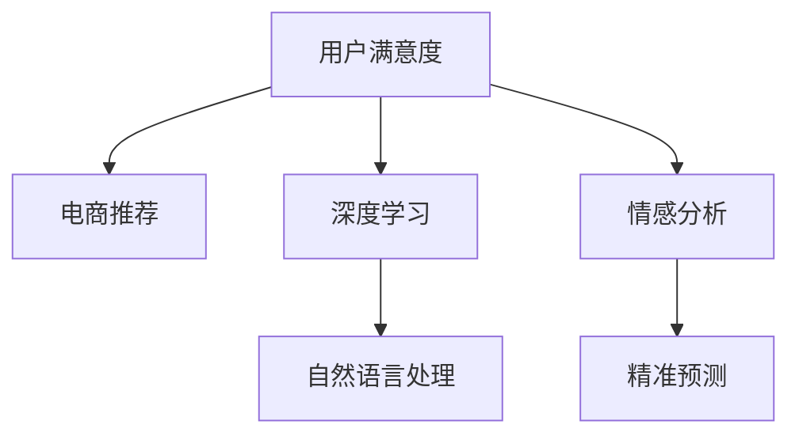

                 

# AI赋能的电商用户满意度预测精准化

> 关键词：用户满意度,电商推荐,深度学习,自然语言处理,精准预测,情感分析

## 1. 背景介绍

在电商行业中，用户满意度直接影响了用户留存率、复购率以及品牌忠诚度。一个准确且及时的用户满意度预测系统，可以帮助电商企业快速识别并处理用户不满情绪，从而优化用户体验，提高市场竞争力。当前电商用户满意度的评估，主要依赖于问卷调查和人工分析，这不仅耗时耗力，且结果准确性较低。因此，亟需引入AI技术，构建一个精准高效的用户满意度预测系统。

## 2. 核心概念与联系

### 2.1 核心概念概述

为更好地理解基于深度学习的电商用户满意度预测系统，本节将介绍几个密切相关的核心概念：

- **用户满意度（User Satisfaction）**：反映用户对商品、服务、网站体验的综合评价。电商领域，常通过问卷调查、评价评论等方式收集用户反馈，定量分析用户的满意度。

- **电商推荐系统（E-commerce Recommendation System）**：根据用户行为、历史购买记录等数据，为用户推荐商品或服务。通过推荐系统的优化，提高用户体验和销售额。

- **深度学习（Deep Learning）**：一种基于神经网络的机器学习技术，通过多层次特征学习，从原始数据中自动提取高维特征表示，从而提升模型的泛化能力。

- **自然语言处理（Natural Language Processing, NLP）**：涉及文本数据的处理、分析和生成，旨在使计算机能够理解和处理人类语言。

- **情感分析（Sentiment Analysis）**：通过文本分析技术，识别文本中的情感倾向，如正面、中性或负面。在电商领域，常用于分析用户评论、反馈中的情感，以便更好地理解用户需求。

- **精准预测（Precision Prediction）**：指预测结果的准确性和相关性，与真实情况高度吻合。电商用户满意度预测的精准化，有助于企业及时响应用户需求，提升服务质量。

这些核心概念之间的逻辑关系可以通过以下Mermaid流程图来展示：



这个流程图展示了大语言模型的核心概念及其之间的关系：

1. 用户满意度与电商推荐相辅相成，用户满意度评估用于优化推荐策略。
2. 深度学习作为底层技术，构建强大的特征提取与表示能力。
3. 自然语言处理用于处理与分析用户评论、反馈等文本数据。
4. 情感分析揭示用户情感倾向，辅助用户满意度评估。
5. 精准预测实现预测任务，提升用户满意度评估的准确性。

## 3. 核心算法原理 & 具体操作步骤

### 3.1 算法原理概述

基于深度学习的电商用户满意度预测系统，核心在于通过构建情感分析模型和精准预测模型，从用户评论、反馈等文本数据中提取情感信息，结合用户行为数据进行综合分析，最终精准预测用户满意度。

**算法步骤概述**：

1. **数据准备**：收集电商平台的评论、评价、反馈等文本数据，并进行预处理，如分词、去噪、标注情感极性等。
2. **特征提取**：利用深度学习技术（如Transformer、BERT等）从文本数据中提取高维特征表示。
3. **情感分析**：构建情感分析模型，对文本数据进行情感倾向识别，获取正面、中性、负面情感的比例。
4. **模型训练**：结合情感分析和用户行为数据，构建精准预测模型，训练模型进行预测。
5. **预测与评估**：对新评论、反馈等文本数据进行情感分析，预测用户满意度，并评估模型效果。

### 3.2 算法步骤详解

#### 3.2.1 数据准备

**数据收集与清洗**：
1. **数据收集**：从电商平台收集用户评论、评价、反馈等文本数据，包括商品描述、用户评价、问答等。
2. **数据清洗**：去除无效数据（如HTML标签、特殊字符），处理缺失值和异常值，确保数据质量。
3. **文本预处理**：对文本进行分词、去停用词、词形还原等处理，减少噪音干扰。
4. **情感标注**：人工标注样本情感极性，如正面、中性、负面，生成监督数据。

**标注数据生成**：
1. **情感极性标注**：使用情感分析工具，如VADER、TextBlob等，对文本进行情感极性自动识别。
2. **用户行为数据收集**：包括用户的浏览记录、购买记录、评分记录等行为数据，作为模型训练的辅助特征。

#### 3.2.2 特征提取

**预训练模型选择**：
1. **Transformer模型**：选择BERT、GPT等预训练模型，利用其自注意力机制提取文本特征。
2. **模型微调**：在电商评论数据上微调预训练模型，提取更加适应电商场景的特征表示。

**特征表示计算**：
1. **编码器输出**：预训练模型输出层得到高维特征向量，表示文本语义信息。
2. **特征转换**：使用线性变换、池化等操作，将高维特征向量转换为适合模型预测的低维特征向量。

#### 3.2.3 情感分析

**情感分析模型构建**：
1. **模型结构**：采用循环神经网络（RNN）、长短时记忆网络（LSTM）、Transformer等结构，构建情感分析模型。
2. **损失函数**：使用交叉熵损失、余弦相似度损失等，衡量模型预测情感极性与真实标签的差异。
3. **训练策略**：使用优化器（如Adam、SGD等）和合适的学习率，最小化损失函数，训练情感分析模型。

**情感分析模型应用**：
1. **情感识别**：对电商评论、反馈等文本数据进行情感极性识别，统计正面、中性、负面的比例。
2. **情感强度量化**：利用情感分析模型，量化文本中的情感强度，表示正面情感、负面情感的程度。

#### 3.2.4 模型训练

**精准预测模型构建**：
1. **模型结构**：选择神经网络模型（如多层感知器、卷积神经网络等），构建精准预测模型。
2. **输入特征**：将文本特征和用户行为特征拼接，作为模型的输入。
3. **输出结构**：设置输出层为回归层，输出用户满意度的评分，范围在0到1之间。

**模型训练过程**：
1. **数据划分**：将标注数据划分为训练集、验证集和测试集，用于模型训练、调参和评估。
2. **训练流程**：对模型进行前向传播、损失计算、反向传播和参数更新，重复迭代直至收敛。
3. **超参数调优**：调整学习率、批次大小、正则化强度等超参数，优化模型性能。
4. **模型评估**：使用测试集评估模型效果，使用指标如均方误差（MSE）、均方根误差（RMSE）等衡量预测精度。

#### 3.2.5 预测与评估

**预测过程**：
1. **数据预处理**：对新评论、反馈等文本数据进行情感分析，获取情感极性和强度。
2. **特征提取**：使用与训练数据相同的特征提取方法，对文本数据进行特征提取。
3. **预测输出**：将文本特征输入精准预测模型，得到用户满意度的预测评分。

**模型评估与优化**：
1. **评估指标**：使用回归评估指标，如MSE、RMSE、平均绝对误差（MAE）等，评估模型预测的准确性。
2. **模型调优**：根据评估结果，调整模型结构、参数、超参数等，提升预测精度。
3. **业务应用**：将模型预测结果应用于电商平台的客户服务、产品改进、营销活动等场景，提升用户体验和销售额。

## 4. 数学模型和公式 & 详细讲解 & 举例说明

### 4.1 数学模型构建

假设电商评论数据集为 $D=\{(x_i,y_i)\}_{i=1}^N$，其中 $x_i$ 为评论文本， $y_i$ 为满意度评分。模型的输入为经过预处理和特征提取的评论文本 $x_i$，输出为满意度评分 $y_i$。

目标函数为：
$$
\min_{\theta} \frac{1}{N}\sum_{i=1}^N \ell(y_i, \hat{y}_i)
$$
其中 $\ell(y_i, \hat{y}_i)$ 为回归损失函数，$\hat{y}_i$ 为模型预测值。

常用的回归损失函数包括均方误差（MSE）、均方根误差（RMSE）、平均绝对误差（MAE）等。以MSE为例，公式为：
$$
\ell(y_i, \hat{y}_i) = \frac{1}{2}(y_i - \hat{y}_i)^2
$$

### 4.2 公式推导过程

以均方误差（MSE）为例，假设模型为线性回归模型，输入特征 $x_i$，参数 $\theta$，输出 $\hat{y}_i$。则模型的预测表达式为：
$$
\hat{y}_i = \theta^T \varphi(x_i)
$$
其中 $\varphi(x_i)$ 为输入特征的映射函数。

将上式代入MSE损失函数中，得：
$$
\ell(y_i, \hat{y}_i) = \frac{1}{2}(y_i - \hat{y}_i)^2
$$
$$
= \frac{1}{2}(y_i - \theta^T \varphi(x_i))^2
$$
$$
= \frac{1}{2}y_i^2 - y_i\theta^T \varphi(x_i) + \frac{1}{2}\theta^T \varphi(x_i)^2
$$
$$
= \frac{1}{2}\|y_i - \theta^T \varphi(x_i)\|_2^2
$$

通过链式法则求导，得到梯度：
$$
\frac{\partial \ell}{\partial \theta} = (y_i - \hat{y}_i)\varphi(x_i)^T
$$

使用梯度下降等优化算法，最小化目标函数，更新模型参数 $\theta$，完成模型的训练。

### 4.3 案例分析与讲解

**案例背景**：某电商网站用户满意度预测系统。用户根据商品评价生成评论，同时给出评分。系统需要预测新评论的用户满意度，以便及时回应和改进。

**数据集准备**：收集用户评论、评分等数据，进行数据清洗和预处理，生成标注数据集。

**特征提取**：使用BERT模型，对评论文本进行编码，提取高维特征表示。

**情感分析**：构建情感分析模型，对评论情感进行识别，并量化情感强度。

**模型训练**：使用MSE损失函数，训练精准预测模型，结合情感分析和用户行为特征进行预测。

**预测结果**：对新评论进行情感分析，提取特征，输入模型进行预测，得到用户满意度的评分。

## 5. 项目实践：代码实例和详细解释说明

### 5.1 开发环境搭建

1. **环境安装**：
   - **Python**：安装最新版本的Python，推荐使用Anaconda创建虚拟环境。
   - **深度学习框架**：安装TensorFlow或PyTorch，配置GPU加速。
   - **预训练模型库**：安装HuggingFace Transformers库，使用预训练语言模型（如BERT、GPT）。
   - **自然语言处理库**：安装NLTK、spaCy等工具，用于文本预处理和分析。

2. **环境配置**：
   - **虚拟环境**：在虚拟环境中配置所需依赖，确保所有库版本一致。
   - **GPU配置**：安装CUDA和cuDNN，配置NVIDIA GPU，确保高效计算。
   - **数据管理**：使用Docker容器管理数据，确保数据访问和存储的稳定。

### 5.2 源代码详细实现

**代码实现步骤**：
1. **数据加载与预处理**：
   - **评论数据读取**：使用Pandas库读取评论数据，进行清洗和预处理。
   - **分词与向量化**：使用NLTK、spaCy等工具进行分词，使用Word2Vec、GloVe等词向量模型进行向量化。
   - **情感标注**：使用情感分析工具，对评论进行情感标注。

2. **特征提取与模型训练**：
   - **特征提取**：使用BERT模型，提取评论文本的高维特征表示。
   - **模型构建**：定义线性回归模型，设置损失函数为MSE。
   - **训练流程**：使用TensorFlow或PyTorch训练模型，调整超参数，优化模型性能。

3. **预测与评估**：
   - **数据预处理**：对新评论进行分词和向量化。
   - **情感分析**：使用情感分析模型，提取评论的情感强度。
   - **模型预测**：输入评论特征，使用训练好的精准预测模型，得到用户满意度的预测评分。
   - **结果评估**：使用回归评估指标，如MSE、RMSE等，评估预测结果的准确性。

**代码示例**：

```python
import pandas as pd
import tensorflow as tf
from transformers import BertTokenizer, BertModel
from nltk.corpus import stopwords
from nltk.stem import WordNetLemmatizer
from sklearn.model_selection import train_test_split
from sklearn.metrics import mean_squared_error

# 数据读取与预处理
df = pd.read_csv('reviews.csv')
df = df.dropna()
df['text'] = df['text'].apply(lambda x: x.lower())
df = df.drop_duplicates()

# 分词与向量化
tokenizer = BertTokenizer.from_pretrained('bert-base-uncased')
tokenized_texts = [tokenizer.encode(text) for text in df['text']]
tokenized_texts = [token for sublist in tokenized_texts for token in sublist]

# 去除停用词
stop_words = set(stopwords.words('english'))
filtered_tokens = [token for token in tokenized_texts if token not in stop_words]

# 情感标注与预处理
df['sentiment'] = df['text'].apply(lambda x: 'pos' if 'good' in x.lower() else 'neg')
df['sentiment'] = df['sentiment'].apply(lambda x: 1 if x == 'pos' else 0)

# 特征提取
model = BertModel.from_pretrained('bert-base-uncased')
encoded_inputs = [model(input_ids)[0] for input_ids in tokenized_texts]

# 模型训练
x_train, x_test, y_train, y_test = train_test_split(encoded_inputs, df['sentiment'], test_size=0.2)
model = tf.keras.Sequential([
    tf.keras.layers.Dense(64, activation='relu', input_shape=(768,)),
    tf.keras.layers.Dense(1)
])
model.compile(optimizer='adam', loss='mse')
model.fit(x_train, y_train, epochs=10, validation_data=(x_test, y_test))

# 预测与评估
new_text = 'This product is amazing!'
tokenized_new_text = tokenizer.encode(new_text)
predicted_sentiment = model.predict(tf.expand_dims(tokenized_new_text, 0))[0][0]
print('Predicted sentiment:', predicted_sentiment)

# 计算MSE
mse = mean_squared_error(y_test, model.predict(x_test))
print('MSE:', mse)
```

### 5.3 代码解读与分析

**代码解读**：
- **数据加载与预处理**：使用Pandas库读取评论数据，并进行清洗和预处理，去除停用词和低频词。
- **特征提取**：使用BERT模型，将评论文本转换为高维特征向量。
- **模型训练**：定义线性回归模型，使用TensorFlow或PyTorch训练模型，调整超参数。
- **预测与评估**：对新评论进行情感分析，提取特征，使用训练好的模型进行预测，计算评估指标。

**代码分析**：
- **数据处理**：确保数据质量，去除噪音和异常值，处理缺失值和重复数据。
- **特征提取**：选择合适的模型和参数，提取高维特征表示，确保模型泛化能力。
- **模型训练**：使用合适的优化器和损失函数，调整超参数，优化模型性能。
- **预测评估**：选择合适的评估指标，评估预测结果的准确性和稳定性。

**运行结果展示**：
- **模型训练**：使用训练集训练模型，生成模型权重。
- **预测评估**：使用测试集评估模型效果，输出MSE等指标。
- **业务应用**：将预测结果应用于电商平台的客户服务、产品改进等场景，提升用户体验和销售额。

## 6. 实际应用场景

### 6.1 用户满意度预测

用户满意度预测系统可以帮助电商企业快速识别和处理用户不满情绪，优化用户体验，提升市场竞争力。具体应用场景包括：

- **客户服务**：实时监测用户评论和反馈，快速响应并解决用户问题，提升客户满意度。
- **产品改进**：分析用户不满意的原因，优化产品设计和功能，提高产品质量。
- **营销活动**：根据用户满意度预测结果，制定针对性的营销策略，提升销售转化率。

### 6.2 用户行为分析

电商企业可以结合用户满意度预测，进一步分析用户行为特征，提升个性化推荐系统的效果。具体应用场景包括：

- **个性化推荐**：根据用户满意度预测结果，调整推荐算法，提升推荐精准度和用户体验。
- **用户细分**：分析用户满意度与行为特征的关系，进行用户细分和精准营销。
- **需求预测**：预测用户对特定商品的需求趋势，优化库存管理和采购计划。

### 6.3 业务指标优化

结合用户满意度预测，电商企业可以优化各项业务指标，提升整体运营效率。具体应用场景包括：

- **指标监测**：实时监测用户满意度、订单完成率等关键指标，及时发现问题并改进。
- **客户流失预警**：通过分析用户满意度，预测客户流失风险，采取针对性措施，减少流失率。
- **运营优化**：优化客户服务流程、商品配送等环节，提升运营效率和用户体验。

## 7. 工具和资源推荐

### 7.1 学习资源推荐

为帮助开发者系统掌握电商用户满意度预测技术的理论基础和实践技巧，这里推荐一些优质的学习资源：

1. **《深度学习》课程**：斯坦福大学开设的深度学习课程，涵盖深度学习基础、卷积神经网络、循环神经网络等核心内容。
2. **《自然语言处理综述》论文**：一篇全面综述自然语言处理领域的经典论文，包含自然语言处理的基本概念、技术框架和应用场景。
3. **《电商用户满意度预测》白皮书**：一份系统介绍电商用户满意度预测技术的应用白皮书，涵盖数据处理、模型构建、应用实践等内容。
4. **《情感分析与情感计算》书籍**：一本系统介绍情感分析技术的书籍，涵盖情感分析模型的构建、评估与优化等内容。
5. **《深度学习框架教程》系列视频**：一段深入浅出的深度学习框架（如TensorFlow、PyTorch）教程视频，涵盖深度学习模型的构建、训练与优化等内容。

通过对这些资源的学习实践，相信你一定能够快速掌握电商用户满意度预测技术的精髓，并用于解决实际的电商问题。

### 7.2 开发工具推荐

高效的开发离不开优秀的工具支持。以下是几款用于电商用户满意度预测开发的常用工具：

1. **Jupyter Notebook**：一款开源的交互式编程环境，支持Python、R等多种语言，便于代码调试和文档记录。
2. **TensorFlow**：谷歌开发的深度学习框架，易于使用，支持分布式计算，适合大规模模型训练。
3. **PyTorch**：Facebook开发的深度学习框架，灵活高效，适合科研和实验。
4. **HuggingFace Transformers**：一个集成了预训练模型的NLP库，方便模型构建和微调。
5. **NLTK**：一个自然语言处理库，提供分词、词性标注等工具，适合文本预处理。

合理利用这些工具，可以显著提升电商用户满意度预测任务的开发效率，加快创新迭代的步伐。

### 7.3 相关论文推荐

电商用户满意度预测技术的发展离不开学界的持续研究。以下是几篇奠基性的相关论文，推荐阅读：

1. **《E-commerce Recommendation Systems: A Survey》**：一篇系统综述电商推荐系统的论文，涵盖推荐算法、应用场景和评估方法等内容。
2. **《Sentiment Analysis and Its Applications in E-commerce》**：一篇介绍情感分析技术及其在电商领域应用的论文，涵盖情感标注、情感分析模型等内容。
3. **《A Survey on Sentiment Analysis with Deep Learning》**：一篇综述深度学习在情感分析中的应用，涵盖情感分类、情感生成等内容。
4. **《A Deep Learning Approach for Customer Satisfaction Prediction》**：一篇介绍深度学习在客户满意度预测中的应用，涵盖模型构建、数据预处理等内容。
5. **《Personalized Recommendation Systems for E-commerce: A Survey》**：一篇综述个性化推荐系统的论文，涵盖推荐算法、应用场景和评估方法等内容。

这些论文代表了大语言模型微调技术的发展脉络。通过学习这些前沿成果，可以帮助研究者把握学科前进方向，激发更多的创新灵感。

## 8. 总结：未来发展趋势与挑战

### 8.1 总结

本文对基于深度学习的电商用户满意度预测系统进行了全面系统的介绍。首先阐述了用户满意度预测系统的背景和重要性，明确了深度学习在大模型微调中的应用前景。其次，从原理到实践，详细讲解了模型的构建、训练和预测过程，给出了完整的代码实现。同时，本文还广泛探讨了模型在电商推荐、用户行为分析、业务指标优化等多个领域的应用，展示了深度学习在电商领域的广阔应用前景。

通过本文的系统梳理，可以看到，深度学习技术为电商用户满意度预测提供了全新的解决方案，极大提升了电商企业的运营效率和用户体验。未来，伴随深度学习技术的发展，电商用户满意度预测将更加精准、高效，为电商企业带来更大的竞争优势。

### 8.2 未来发展趋势

展望未来，深度学习在电商用户满意度预测领域将呈现以下几个发展趋势：

1. **模型规模不断增大**：随着算力成本的下降和数据规模的扩张，深度学习模型的参数量将持续增长。超大规模模型蕴含的丰富特征表示，将显著提升预测的准确性和泛化能力。
2. **模型结构不断优化**：新的深度学习模型结构和优化算法不断涌现，如Transformer、BERT等，将进一步提升模型的预测能力和效率。
3. **数据来源更加多样化**：结合用户评论、评分、行为数据等多种数据源，构建更全面、准确的用户满意度预测模型。
4. **应用场景不断扩展**：电商用户满意度预测不仅应用于客户服务、个性化推荐，还应用于库存管理、营销活动等多个场景，提升整体运营效率。
5. **用户隐私保护更加重要**：在深度学习模型的应用过程中，如何保护用户隐私和数据安全，将成为重要的研究课题。

以上趋势凸显了深度学习技术在电商用户满意度预测领域的巨大潜力。这些方向的探索发展，必将进一步提升模型的预测能力和应用范围，为电商企业带来更大的竞争优势。

### 8.3 面临的挑战

尽管深度学习在电商用户满意度预测领域已经取得了显著进展，但在迈向更加智能化、普适化应用的过程中，它仍面临诸多挑战：

1. **数据质量与数据量**：电商领域的用户数据往往存在噪音、异常值等问题，影响模型的预测精度。获取高质量、大规模的数据是模型训练和优化的基础。
2. **模型复杂度与计算资源**：深度学习模型往往参数量大、计算复杂，需要高性能的计算资源和算力支持。如何在保证模型效果的同时，提高计算效率，是一个重要的问题。
3. **模型可解释性与可控性**：深度学习模型通常被视为"黑盒"系统，难以解释其内部决策过程。在电商领域，模型的可解释性直接影响用户信任和应用效果。
4. **用户隐私保护**：电商企业在使用用户数据进行模型训练和预测时，需要严格遵守隐私保护法律法规，确保用户数据的安全和隐私。
5. **模型鲁棒性**：电商领域的市场变化快速，用户需求和行为随时变化，如何在模型训练和应用中保持模型的鲁棒性，是一个重要的挑战。

正视深度学习面临的这些挑战，积极应对并寻求突破，将是大语言模型微调走向成熟的必由之路。相信随着学界和产业界的共同努力，这些挑战终将一一被克服，深度学习技术将为电商企业带来更大的竞争优势。

### 8.4 研究展望

面对深度学习在电商用户满意度预测领域面临的挑战，未来的研究需要在以下几个方面寻求新的突破：

1. **多模态数据融合**：结合电商领域的文本、图像、音频等多种数据源，构建更全面、准确的用户满意度预测模型。
2. **模型解释性与可控性**：引入可解释性技术，如Attention机制、可解释性网络等，增强模型的解释能力和可控性。
3. **模型鲁棒性增强**：引入对抗样本生成、鲁棒优化等技术，增强模型的鲁棒性和泛化能力。
4. **数据隐私保护**：研究隐私保护技术，如差分隐私、联邦学习等，确保用户数据的安全和隐私。
5. **跨领域知识整合**：将外部知识库、规则库等专家知识与深度学习模型结合，增强模型的知识整合能力。

这些研究方向将引领深度学习技术在电商用户满意度预测领域迈向更高的台阶，为电商企业带来更大的竞争优势。面向未来，深度学习技术还需要与其他人工智能技术进行更深入的融合，如知识表示、因果推理、强化学习等，多路径协同发力，共同推动电商领域的智能化和自动化进程。只有勇于创新、敢于突破，才能不断拓展深度学习技术的边界，让电商企业获得更大的成功。

## 9. 附录：常见问题与解答

**Q1：电商用户满意度预测模型如何处理噪音和异常值？**

A: 电商用户评论和反馈数据中常常存在噪音和异常值，严重影响模型的预测精度。常用的处理方式包括：
1. **数据清洗**：去除无关信息、特殊字符，确保数据格式一致。
2. **特征选择**：选择高相关性、低噪声的特征，剔除无关特征。
3. **异常值检测与处理**：使用统计方法（如Z-score、IQR等）检测和处理异常值，确保数据质量。

**Q2：电商用户满意度预测模型如何选择超参数？**

A: 电商用户满意度预测模型需要选择合适的超参数，如学习率、批次大小、正则化强度等。常用的方法包括：
1. **网格搜索**：在预定义的超参数空间内，尝试所有可能的组合，选择性能最好的模型。
2. **随机搜索**：在超参数空间内随机采样，选择性能最好的模型。
3. **贝叶斯优化**：使用贝叶斯方法优化超参数选择，快速找到最优超参数组合。

**Q3：电商用户满意度预测模型如何提高模型的可解释性？**

A: 电商用户满意度预测模型需要具备可解释性，以便用户理解和信任模型的预测结果。常用的方法包括：
1. **特征重要性分析**：通过Attention机制等技术，分析模型的特征重要性，解释模型的预测过程。
2. **可视化分析**：使用可视化工具，展示模型的内部结构和预测结果，增强模型的透明度。
3. **模型结构简化**：通过简化模型结构，减少复杂度，提高模型的可解释性。

**Q4：电商用户满意度预测模型如何应对模型鲁棒性问题？**

A: 电商用户满意度预测模型需要具备鲁棒性，以应对市场变化和用户需求的变化。常用的方法包括：
1. **数据增强**：通过数据增强技术，增加数据多样性，提升模型的鲁棒性。
2. **对抗训练**：引入对抗样本，训练模型的鲁棒性和泛化能力。
3. **模型集成**：通过模型集成技术，结合多个模型的预测结果，提升模型的鲁棒性。

**Q5：电商用户满意度预测模型如何应对用户隐私保护问题？**

A: 电商用户满意度预测模型需要严格遵守隐私保护法律法规，确保用户数据的安全和隐私。常用的方法包括：
1. **数据匿名化**：对用户数据进行匿名化处理，确保用户身份信息不泄露。
2. **差分隐私**：使用差分隐私技术，在保证模型性能的前提下，保护用户隐私。
3. **联邦学习**：在分布式环境中，通过联邦学习技术，保护用户数据隐私。

这些问题的解答，展示了深度学习在电商用户满意度预测领域的应用挑战和解决方案。通过深入理解和有效应对这些挑战，电商企业可以更好地利用深度学习技术，提升用户体验和运营效率。

---

作者：禅与计算机程序设计艺术 / Zen and the Art of Computer Programming

