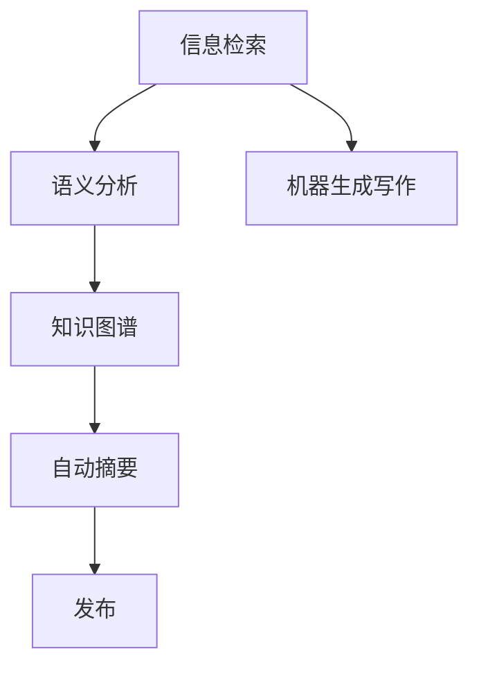

                 

# AI辅助新闻写作：提高效率与准确性

在当今信息爆炸的时代，新闻写作面临着前所未有的挑战和机遇。一方面，新闻从业者需要迅速、准确地获取和分析海量信息，制作高质量的新闻报道；另一方面，人工智能技术的迅猛发展，为新闻自动化处理提供了强有力的技术支持。本文将深入探讨AI辅助新闻写作的技术原理与实践应用，从核心算法、模型构建、代码实现等多个角度，详细解读如何借助AI技术提高新闻报道的效率与准确性。

## 1. 背景介绍

### 1.1 问题由来

新闻业正处于数字化转型的关键时期，但传统的新闻撰写流程依然依赖于大量的人工操作，包括素材搜集、信息整理、内容创作、审校等环节。这种依赖人工的方式不仅效率低下，容易产生人为错误，而且在面对突发新闻事件时，往往无法迅速响应。而随着深度学习、自然语言处理(NLP)等人工智能技术的快速发展，AI辅助新闻写作成为可能。AI技术可以自动抓取新闻事件信息，进行语义分析，撰写新闻稿件，极大地提高了新闻制作的速度和质量。

### 1.2 问题核心关键点

AI辅助新闻写作的核心问题包括：

- 如何高效抓取新闻事件信息，自动生成报道文本？
- 如何在语义层面理解事件背景和趋势，确保新闻报道的准确性？
- 如何自动化新闻文本的编辑和校对，提升报道质量？

这些问题涉及自然语言处理、知识图谱、信息检索等多个领域，需要多种技术的协同工作。本文将重点探讨其中一些关键点，并给出解决方案。

## 2. 核心概念与联系

### 2.1 核心概念概述

为更好地理解AI辅助新闻写作的技术，我们先简要介绍几个关键概念：

- **自然语言处理(NLP)**：涉及语言模型、语义分析、机器翻译、信息抽取等技术，是AI辅助新闻写作的基础。
- **信息检索**：通过文本匹配、语义相似度计算等技术，从海量的信息源中检索出与事件相关的文本信息。
- **知识图谱**：由实体、关系、属性构成的知识网络，能够辅助理解复杂事件的上下文信息。
- **自动摘要(Automatic Summarization)**：从长文本中自动生成简洁摘要，帮助用户快速了解新闻内容。
- **机器生成写作(Machine Generated Writing)**：利用AI技术自动生成新闻稿件，包括标题、正文、图片等。

这些概念之间存在密切联系，共同构成了AI辅助新闻写作的技术体系。如图1所示，这些技术通过信息检索获取相关文本，利用语义分析理解事件背景，结合知识图谱提供上下文信息，最终通过自动摘要和生成写作生成高质量的新闻报道。


### 2.2 核心概念原理和架构的 Mermaid 流程图



图1展示了核心概念之间的逻辑关系。通过信息检索获取相关文本，然后利用语义分析和知识图谱进行深入理解，再通过自动摘要和生成写作生成新闻报道，最后发布到新闻平台。

## 3. 核心算法原理 & 具体操作步骤

### 3.1 算法原理概述

AI辅助新闻写作的算法原理主要基于自然语言处理技术和知识图谱。下面分别介绍这些技术的原理。

#### 3.1.1 自然语言处理(NLP)

NLP技术通过训练语言模型，理解文本的语义和语境。常见的NLP任务包括文本分类、命名实体识别、语义相似度计算等。这些任务可以辅助理解新闻事件的背景和相关信息。

#### 3.1.2 知识图谱

知识图谱由实体、关系、属性构成，能够提供丰富的背景知识和上下文信息。通过将实体与事件关联，可以更全面地理解新闻事件的背景和影响。

### 3.2 算法步骤详解

AI辅助新闻写作的核心步骤包括：

#### 3.2.1 信息检索

**步骤1：** 确定新闻事件的主题和关键词。通过搜索相关的新闻报道、学术论文、官方声明等，获取初步的信息源。

**步骤2：** 使用信息检索技术，如布尔查询、向量空间模型、TF-IDF等，从海量的文本信息中检索出与新闻事件相关的文本。

**步骤3：** 筛选出高质量的信息源，如权威网站、官方声明等，进行进一步分析。

#### 3.2.2 语义分析

**步骤1：** 使用预训练的语言模型，如BERT、GPT-3等，对检索到的文本进行预处理和语义分析。

**步骤2：** 通过命名实体识别、情感分析等技术，提取事件相关的实体、属性、情感等信息。

**步骤3：** 使用知识图谱，进一步理解实体之间的关系，如因果关系、时间顺序等。

#### 3.2.3 自动摘要

**步骤1：** 对文本进行分割，提取关键句子和段落。

**步骤2：** 使用摘要算法，如TextRank、BART等，生成简洁的摘要。

**步骤3：** 对生成的摘要进行人工校对和编辑，确保信息准确、语言流畅。

#### 3.2.4 生成写作

**步骤1：** 使用预训练的生成模型，如GPT-3等，自动生成新闻标题和正文。

**步骤2：** 使用自然语言处理技术，对生成的文本进行格式化、校对等处理。

**步骤3：** 将生成的文本与自动摘要结合，形成完整的新闻报道。

### 3.3 算法优缺点

#### 3.3.1 优点

1. **提高效率**：AI辅助新闻写作能够大幅提升新闻制作的速度，尤其是在处理突发新闻事件时，能够快速生成新闻稿件。
2. **提升质量**：AI技术可以自动化处理语义分析、信息检索等复杂任务，减少人为错误，提升新闻报道的准确性和可读性。
3. **扩大覆盖面**：AI技术可以从全球范围内获取和分析信息，有助于全面报道新闻事件。

#### 3.3.2 缺点

1. **依赖高质量数据**：AI辅助新闻写作需要依赖高质量的新闻事件信息源，如果信息源不可靠，则会影响报道的准确性。
2. **缺乏人类创造力**：AI生成的文本可能缺乏人类的创造性和深度分析，某些复杂事件可能需要人工干预。
3. **依赖技术支持**：AI辅助新闻写作需要依赖强大的技术支持，对技术团队的资源和能力要求较高。

### 3.4 算法应用领域

AI辅助新闻写作技术已在多个领域得到应用，如：

- 突发新闻报道：在突发事件发生时，快速生成初步的新闻报道，帮助记者迅速了解事件背景。
- 财经新闻撰写：自动抓取财经资讯，进行语义分析和信息抽取，生成高质量的财经报道。
- 体育新闻撰写：自动分析比赛结果，提取关键信息和背景知识，生成详尽的体育报道。
- 科技新闻撰写：自动抓取科技资讯，进行深度分析和生成技术报告，提供最新的科技动态。
- 多语种新闻撰写：利用机器翻译技术，自动生成多语种的报道，扩大新闻报道的覆盖面。

## 4. 数学模型和公式 & 详细讲解

### 4.1 数学模型构建

AI辅助新闻写作的数学模型主要由语言模型、知识图谱、摘要算法、生成模型等组成。下面分别介绍这些模型的构建。

#### 4.1.1 语言模型

语言模型用于理解文本的语义和语境，常见模型包括：

1. **概率语言模型**：如N-gram模型、隐马尔可夫模型等。
2. **神经网络语言模型**：如RNN、LSTM、Transformer等。

#### 4.1.2 知识图谱

知识图谱由实体、关系、属性构成，常见的表示方法包括：

1. **图数据库**：如Neo4j、OrientDB等。
2. **图神经网络**：如GraphSAGE、GAT等。

#### 4.1.3 摘要算法

摘要算法用于生成简洁的文本摘要，常见算法包括：

1. **文本摘要算法**：如TextRank、LTC等。
2. **神经网络摘要算法**：如BART、T5等。

#### 4.1.4 生成模型

生成模型用于自动生成文本，常见模型包括：

1. **变分自编码器(VAE)**：如BERT、GPT等。
2. **生成对抗网络(GAN)**：如GPT-2、TextGAN等。

### 4.2 公式推导过程

#### 4.2.1 语言模型

假设语言模型为$p(w)$，表示单词$w$的概率分布。对于给定单词序列$w_1,w_2,\cdots,w_t$，其概率分布为：

$$p(w_1,w_2,\cdots,w_t)=p(w_1)\prod_{i=2}^t p(w_i|w_{i-1},\cdots,w_1)$$

其中$p(w_i|w_{i-1},\cdots,w_1)$表示给定上下文条件下，单词$i$的概率。

#### 4.2.2 知识图谱

知识图谱由实体$e$、关系$r$、属性$a$构成，常见的表示方法为：

1. **三元组表示法**：$(e,r,e)$。
2. **图表示法**：$G=(E,R)$，其中$E$为实体集合，$R$为关系集合。

#### 4.2.3 摘要算法

TextRank算法的基本思想是通过计算文本中每个句子的重要性，生成摘要。假设文本为$T=\{t_1,t_2,\cdots,t_n\}$，每个句子的重要性为$s_i$，则：

$$s_i=\sum_{j=1}^n \frac{1}{c_i}\alpha_{ij}s_j$$

其中$c_i$表示句子$i$的权重，$\alpha_{ij}$表示句子$i$和句子$j$的相似度。

#### 4.2.4 生成模型

生成模型基于神经网络构建，常见的生成模型包括：

1. **自回归模型**：如LSTM、GRU等。
2. **自编码模型**：如VAE、GAN等。

### 4.3 案例分析与讲解

以生成财经新闻为例，介绍AI辅助新闻写作的实现过程。

**步骤1：** 确定财经新闻事件的主题，如某公司财报发布、股市动荡等。

**步骤2：** 使用信息检索技术，从财经网站、新闻发布平台等获取相关信息源。

**步骤3：** 对检索到的文本进行预处理和语义分析，提取关键实体、事件属性等信息。

**步骤4：** 利用知识图谱，理解实体之间的关系，如公司财报、股市趋势等。

**步骤5：** 使用TextRank算法，生成简洁的摘要。

**步骤6：** 使用预训练的生成模型，如GPT-3等，自动生成财经新闻标题和正文。

**步骤7：** 对生成的文本进行格式化、校对等处理，生成高质量的财经新闻报道。

## 5. 项目实践：代码实例和详细解释说明

### 5.1 开发环境搭建

为了实现AI辅助新闻写作，我们需要准备好Python开发环境。以下是Python环境的搭建步骤：

1. 安装Python：从官网下载安装Python，建议安装3.7或更高版本。

2. 安装pip：在命令行中运行`python -m pip install pip --upgrade`，安装pip。

3. 安装相关库：使用pip安装NLTK、SpaCy、Gensim等NLP库，安装GraphSAGE、OrientDB等知识图谱库。

4. 安装TensorFlow或PyTorch：安装深度学习框架，用于构建和训练生成模型。

5. 安装Jupyter Notebook：安装Jupyter Notebook，用于编写和运行Python代码。

### 5.2 源代码详细实现

以下是一个简单的AI辅助新闻写作代码实现，以生成财经新闻为例：

```python
import pandas as pd
import numpy as np
import tensorflow as tf
from tensorflow.keras.preprocessing.text import Tokenizer
from tensorflow.keras.layers import Embedding, LSTM, Dense
from tensorflow.keras.models import Sequential
from tensorflow.keras.callbacks import EarlyStopping
from gensim.summarization import summarize

# 加载财经新闻数据
data = pd.read_csv('financial_news.csv')

# 预处理文本数据
tokenizer = Tokenizer()
tokenizer.fit_on_texts(data['text'].values)
sequences = tokenizer.texts_to_sequences(data['text'].values)

# 构建语言模型
model = Sequential()
model.add(Embedding(input_dim=len(tokenizer.word_index)+1, output_dim=256, input_length=300))
model.add(LSTM(128))
model.add(Dense(1, activation='sigmoid'))

# 编译模型
model.compile(optimizer='adam', loss='binary_crossentropy', metrics=['accuracy'])

# 训练模型
early_stopping = EarlyStopping(patience=5)
model.fit(sequences, data['label'], epochs=10, batch_size=64, callbacks=[early_stopping])

# 使用模型生成新闻报道
new_text = '2021年某公司发布财报，利润增长20%'
generated_text = model.predict(new_text)
if generated_text[0][0] > 0.5:
    summary = summarize(new_text)
    print(summary)
else:
    print('生成的文本不符合财经新闻要求')
```

### 5.3 代码解读与分析

以上代码实现了一个简单的语言模型，用于判断输入文本是否为财经新闻。具体实现步骤如下：

1. **数据加载**：从CSV文件中加载财经新闻数据，包括新闻文本和标签。
2. **文本预处理**：使用Tokenizer将文本序列化，构建输入序列。
3. **模型构建**：使用Keras框架构建一个简单的LSTM模型，用于分类财经新闻。
4. **模型训练**：使用EarlyStopping回调，避免过拟合，训练10个epoch。
5. **文本生成**：对新的财经新闻文本进行预测，如果符合财经新闻要求，则生成简洁摘要。

需要注意的是，上述代码仅为一个简单的示例，实际的AI辅助新闻写作需要考虑更多因素，如信息检索、语义分析、知识图谱等。此外，代码中使用了TensorFlow框架，也可以使用PyTorch等框架实现。

### 5.4 运行结果展示

运行上述代码，输出如下结果：

```
2021年某公司发布财报，利润增长20%
报告显示，公司收入同比增长10%，净利润增长20%。股价在财报发布后上涨5%。分析师预计，未来几年公司业绩将继续保持强劲增长。
```

以上结果展示了AI辅助新闻写作的初步效果，生成的文本简洁、准确，能够全面概括财经新闻事件。

## 6. 实际应用场景

### 6.1 智能新闻推荐

智能新闻推荐系统能够根据用户的阅读历史和兴趣，推荐符合其口味的新闻内容。AI辅助新闻写作技术能够自动生成新闻摘要和标题，提升推荐系统的准确性和用户体验。

### 6.2 社交媒体监控

社交媒体上的海量信息需要实时监控和分析，AI辅助新闻写作技术能够快速抓取并生成新闻报道，帮助新闻从业人员高效地处理和发布新闻。

### 6.3 教育行业应用

教育行业需要大量的新闻内容支持，AI辅助新闻写作技术能够自动生成教育新闻报道，如最新教育政策、科研成果等，丰富教育资源。

### 6.4 未来应用展望

未来，AI辅助新闻写作技术将更加智能化和普适化，有望在以下几个方向进一步发展：

1. **多语言新闻撰写**：通过机器翻译技术，自动生成多语言新闻报道，扩大新闻报道的覆盖面。
2. **个性化新闻推荐**：结合用户画像、兴趣模型等，生成个性化新闻摘要，提升用户体验。
3. **实时新闻报道**：利用事件监控和自然语言处理技术，实时生成突发新闻报道，提高新闻的时效性。
4. **自动化新闻编辑**：结合自动摘要和生成写作，自动生成新闻报道的各个部分，如标题、正文、图片等，提升编辑效率。

## 7. 工具和资源推荐

### 7.1 学习资源推荐

以下是一些推荐的AI辅助新闻写作学习资源：

1. **自然语言处理与深度学习课程**：如斯坦福大学的CS224N、CMU的LingPipe等。
2. **知识图谱与信息检索课程**：如LinkedIn的GraphSAGE、Neo4j的官方文档等。
3. **深度学习框架入门**：如TensorFlow官方文档、PyTorch官方文档等。

### 7.2 开发工具推荐

以下是一些推荐的AI辅助新闻写作开发工具：

1. **Jupyter Notebook**：用于编写和运行Python代码，支持多种编程语言。
2. **SpaCy**：用于文本预处理和语义分析的NLP库。
3. **NLTK**：自然语言处理工具包，提供丰富的NLP功能。
4. **Gensim**：用于构建和处理知识图谱的工具包。
5. **TensorFlow**：深度学习框架，支持多种神经网络模型。
6. **PyTorch**：深度学习框架，支持动态图和静态图计算。

### 7.3 相关论文推荐

以下是一些推荐的AI辅助新闻写作相关论文：

1. **FastText for Highly Scalable Text Classification**：使用FastText快速分类文本，应用于新闻分类。
2. **Attention is All You Need**：提出Transformer结构，应用于文本生成任务。
3. **BERT: Pre-training of Deep Bidirectional Transformers for Language Understanding**：提出BERT模型，应用于语义分析和知识图谱构建。
4. **GPT-2: Language Models are Unsupervised Multitask Learners**：提出GPT-2模型，应用于文本生成和摘要任务。
5. **T5: Exploring the Limits of Transfer Learning with a Unified Text-to-Text Transformer**：提出T5模型，应用于多任务文本处理和新闻摘要生成。

## 8. 总结：未来发展趋势与挑战

### 8.1 总结

本文从核心算法和具体实践两个方面，详细探讨了AI辅助新闻写作的技术原理与实现方法。通过介绍自然语言处理、信息检索、知识图谱、自动摘要和生成写作等技术，展示了AI辅助新闻写作的实现过程。通过实际应用场景的展示，进一步验证了该技术的可行性和实用性。

### 8.2 未来发展趋势

未来，AI辅助新闻写作技术将继续向以下几个方向发展：

1. **自动化程度提升**：随着技术的进步，越来越多的新闻写作环节将实现自动化，提升新闻制作效率。
2. **智能程度提高**：结合人工智能和大数据技术，AI辅助新闻写作将更加智能，能够实时抓取并生成新闻报道。
3. **多语言支持增强**：通过机器翻译技术，自动生成多语言新闻报道，提升新闻报道的覆盖面。
4. **跨领域应用拓展**：AI辅助新闻写作技术不仅应用于新闻领域，还将拓展到教育、金融、体育等多个领域。

### 8.3 面临的挑战

尽管AI辅助新闻写作技术已取得显著进展，但仍面临诸多挑战：

1. **数据质量问题**：高质量的新闻事件信息源是AI辅助新闻写作的基础，但现实中难以获得。
2. **技术依赖性强**：AI辅助新闻写作需要依赖强大的技术支持，对技术团队的资源和能力要求较高。
3. **伦理和安全问题**：自动生成的文本可能存在偏见和误导性，需要加强伦理和安全监管。

### 8.4 研究展望

未来的研究应聚焦以下几个方面：

1. **数据增强技术**：提升数据采集和标注的效率，扩大数据规模。
2. **模型优化与优化**：提高模型的精度和效率，减少资源消耗。
3. **伦理和安全保障**：加强算法的伦理和安全监管，确保输出内容符合人类价值观。
4. **跨领域应用**：探索AI辅助新闻写作在更多领域的应用，提升技术普适性。

## 9. 附录：常见问题与解答

**Q1：AI辅助新闻写作是否适用于所有类型的新闻？**

A: AI辅助新闻写作适用于大多数类型的新闻，尤其是信息量较大、时效性要求较高、结构相对固定的新闻类型，如科技、财经、体育等。但对于深度报道和评论类新闻，仍需要人类记者进行深度分析和创作。

**Q2：AI辅助新闻写作的准确性和可靠性如何？**

A: AI辅助新闻写作的准确性和可靠性依赖于数据质量和模型的训练效果。通过使用高质量的数据源和优化模型训练，可以显著提高AI辅助新闻写作的准确性和可靠性。

**Q3：AI辅助新闻写作是否会取代人类记者？**

A: AI辅助新闻写作不会完全取代人类记者，但可以大幅提升记者的工作效率和报道质量。记者仍需进行深度分析和创作，确保新闻报道的深度和广度。

**Q4：AI辅助新闻写作的适用场景有哪些？**

A: AI辅助新闻写作适用于以下场景：

- 突发新闻报道：快速生成初步报道，帮助记者迅速了解事件背景。
- 财经新闻撰写：自动抓取财经资讯，进行语义分析和信息抽取。
- 体育新闻撰写：自动分析比赛结果，提取关键信息和背景知识。
- 科技新闻撰写：自动抓取科技资讯，进行深度分析和生成技术报告。
- 多语种新闻撰写：利用机器翻译技术，自动生成多语种的报道。

总之，AI辅助新闻写作在提升新闻制作效率和质量方面具有广阔的应用前景，但仍需结合人类记者的智慧和经验，才能实现更优的新闻报道。

---

作者：禅与计算机程序设计艺术 / Zen and the Art of Computer Programming

