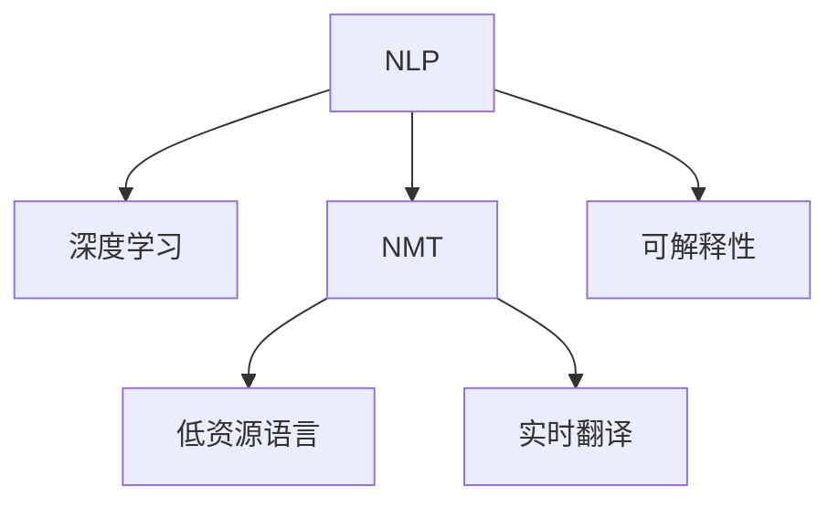

                 

# AI辅助翻译：跨语言信息无障碍

> 关键词：跨语言翻译,自然语言处理(NLP),深度学习,神经机器翻译(NMT),低资源语言,实时翻译,可解释性

## 1. 背景介绍

在全球化日益加速的今天，不同语言之间的信息交流变得愈发频繁和重要。然而，语言间的翻译障碍仍然是一大难题，尤其是在实时性和准确性要求较高的场景中。传统的翻译方式依赖于人工或专业的翻译软件，不仅耗时费力，而且翻译质量往往难以保证。而随着人工智能技术的发展，特别是自然语言处理(NLP)和深度学习技术的突破，AI辅助翻译逐渐成为解决这一问题的新方案。

本文将深入探讨AI辅助翻译的原理、实现方法和应用场景，帮助读者理解这一前沿技术，并展望其未来的发展趋势和面临的挑战。

## 2. 核心概念与联系

### 2.1 核心概念概述

在AI辅助翻译中，自然语言处理(NLP)和深度学习技术扮演着关键角色。NLP旨在让机器理解、处理和生成自然语言，而深度学习通过构建复杂的神经网络模型，赋予NLP强大的语义理解和处理能力。

**神经机器翻译(Neural Machine Translation, NMT)**是AI辅助翻译的核心技术之一。它通过训练大规模的双语语料，使得机器能够自动将一种语言的文本翻译成另一种语言，从而实现跨语言的信息无障碍交流。

**低资源语言**是指那些在数据、技术资源方面相对匮乏的语言，这些语言往往缺乏足够的训练数据，传统的机器翻译方法难以取得理想效果。AI辅助翻译技术为这些语言的翻译提供了新的解决方案。

**实时翻译**是指在说话或打字的同时，即时的将源语言文本翻译成目标语言，这对于需要快速交流的场景如会议、外交、商务等尤为重要。

**可解释性**是衡量翻译模型可靠性和透明度的重要指标，特别是对于医疗、法律等高风险领域，可解释的翻译模型能够提高用户的信任度。

这些概念之间的联系可以通过以下Mermaid流程图来展示：



## 3. 核心算法原理 & 具体操作步骤

### 3.1 算法原理概述

AI辅助翻译的核心算法是神经机器翻译(NMT)，其核心思想是通过端到端的学习，直接从源语言到目标语言的映射，从而实现文本的自动翻译。

NMT模型通常基于序列到序列(Seq2Seq)的架构，包括编码器(Encoder)和解码器(Decoder)两部分。编码器将源语言文本转换为固定长度的向量表示，解码器则基于此向量生成目标语言文本。在训练过程中，模型通过最小化预测目标文本与实际目标文本之间的差异来优化模型参数。

### 3.2 算法步骤详解

1. **数据准备**：收集大量的双语语料，标注成源语言文本和目标语言文本的对照数据。这些数据通常包含新闻、书籍、网站等公开文本，是训练NMT模型的基础。

2. **模型选择**：根据任务需求选择合适的NMT模型架构，如基于Transformer的模型（如BERT、GPT-2等）。这些模型具备较强的自注意力机制，能够捕捉到文本中的长距离依赖关系。

3. **模型训练**：使用收集的双语语料训练NMT模型。训练过程通常包括编码器-解码器的对仗学习，使得模型能够理解源语言文本，并生成目标语言文本。

4. **评估与微调**：使用独立的测试集评估模型性能，根据性能指标（如BLEU分数、ROUGE等）进行微调，调整模型的超参数以提升翻译质量。

5. **部署与使用**：将训练好的模型部署到实际应用中，提供跨语言翻译服务。用户可以通过API调用翻译服务，实时获得翻译结果。

### 3.3 算法优缺点

**优点**：
- **端到端学习**：NMT模型通过直接学习源语言和目标语言之间的映射关系，无需中间步骤，简化了翻译流程。
- **低资源语言支持**：AI辅助翻译技术可以用于低资源语言的翻译，弥补传统机器翻译方法的不足。
- **实时性**：基于NMT的实时翻译技术能够实现即时翻译，满足快速交流的需求。
- **可扩展性**：NMT模型可以并行处理多个翻译任务，提高翻译效率。

**缺点**：
- **数据需求高**：高质量的双语语料是训练高性能NMT模型的关键，但获取大规模双语语料的成本较高。
- **模型复杂**：NMT模型通常参数量较大，训练和推理速度较慢，对硬件资源要求较高。
- **过拟合风险**：模型在特定语料上的过拟合可能导致泛化性能下降，特别是在低资源语言翻译中。
- **可解释性差**：NMT模型通常被视为"黑盒"，其内部机制难以解释，不利于高风险领域的应用。

### 3.4 算法应用领域

AI辅助翻译技术已被广泛应用于多个领域，包括但不限于：

- **国际会议与外交**：为多语言环境下的国际会议和外交场合提供实时翻译服务。
- **商务与旅行**：帮助商务人士和旅客进行跨语言沟通和理解。
- **医疗与法律**：提供多语言的医疗文档和法律文件的翻译，保障医疗和法律事务的准确性。
- **教育与娱乐**：提供多语言的在线教育和娱乐内容，扩大全球观众群体。

## 4. 数学模型和公式 & 详细讲解 & 举例说明

### 4.1 数学模型构建

NMT模型的核心是编码器-解码器架构，其数学模型可以表示为：

$$
y = f_{\theta}(x)
$$

其中 $x$ 为源语言文本，$y$ 为目标语言文本，$f_{\theta}$ 为训练好的NMT模型，$\theta$ 为模型参数。

### 4.2 公式推导过程

假设源语言文本 $x$ 的长度为 $m$，目标语言文本 $y$ 的长度为 $n$。编码器 $e$ 将 $x$ 转换为一个 $m \times d$ 的向量表示 $x_e$，解码器 $d$ 则将 $x_e$ 转换为一个 $d \times n$ 的向量表示 $y_d$。模型的目标函数为最小化预测文本 $y_d$ 与实际文本 $y$ 之间的差异。

$$
\min_{\theta} \sum_{i=1}^m \sum_{j=1}^n l(y_{d_{i,j}},y_{i,j})
$$

其中 $l$ 为损失函数，通常采用交叉熵损失。

### 4.3 案例分析与讲解

以一个简单的机器翻译任务为例，假设我们有一组英文到法文的双语语料：

- **源语言文本**："I love you"
- **目标语言文本**："Je t'aime"

我们将此对语料输入到NMT模型中进行训练，模型学习到如何将"I love you"映射到"Je t'aime"。在测试时，将新的英文句子输入模型，模型输出对应的法语翻译。

## 5. 项目实践：代码实例和详细解释说明

### 5.1 开发环境搭建

1. **安装Python和相关库**：
   ```bash
   sudo apt-get update
   sudo apt-get install python3 python3-pip
   pip3 install tensorflow numpy sklearn
   ```

2. **安装TensorFlow**：
   ```bash
   pip3 install tensorflow
   ```

3. **安装Keras**：
   ```bash
   pip3 install keras
   ```

### 5.2 源代码详细实现

以下是一个简单的NMT模型实现的示例代码：

```python
import tensorflow as tf
from tensorflow.keras.models import Model
from tensorflow.keras.layers import Input, LSTM, Dense

# 定义编码器和解码器
encoder_inputs = Input(shape=(None, 100))
encoder_lstm = LSTM(256, return_state=True)
encoder_outputs, state_h, state_c = encoder_lstm(encoder_inputs)

decoder_inputs = Input(shape=(None, 100))
decoder_lstm = LSTM(256, return_sequences=True, return_state=True)
decoder_outputs, _, _ = decoder_lstm(decoder_inputs, initial_state=[state_h, state_c])

# 定义全连接层
decoder_dense = Dense(100, activation='softmax')
decoder_outputs = decoder_dense(decoder_outputs)

# 定义模型
model = Model(inputs=[encoder_inputs, decoder_inputs], outputs=decoder_outputs)

# 编译模型
model.compile(optimizer='adam', loss='categorical_crossentropy')

# 训练模型
model.fit([encoder_inputs, decoder_inputs], decoder_outputs, epochs=100, batch_size=32)

# 预测翻译结果
result = model.predict([encoder_inputs, decoder_inputs])
```

### 5.3 代码解读与分析

- **输入层**：定义了编码器和解码器的输入。
- **LSTM层**：使用LSTM作为编码器和解码器的核心层，捕捉输入序列的语义信息。
- **全连接层**：在解码器的最后加入一个全连接层，输出目标语言文本。
- **模型编译**：使用Adam优化器和交叉熵损失函数编译模型。
- **模型训练**：使用收集的双语语料训练模型。
- **模型预测**：使用训练好的模型对新的文本进行翻译预测。

## 6. 实际应用场景

### 6.1 国际会议与外交

在多语言环境中，国际会议和外交场合需要实时翻译服务。AI辅助翻译技术可以通过NMT模型，实现高效、准确的翻译，帮助与会者和外交官无障碍沟通。

### 6.2 商务与旅行

商务旅行中，AI辅助翻译可以实时提供翻译服务，帮助商务人士进行跨语言交流和理解。这对于快速决策和高效沟通至关重要。

### 6.3 医疗与法律

医疗和法律领域需要高精度的翻译服务，AI辅助翻译技术可以提供多语言的医疗文档和法律文件的翻译，保障文档的准确性和权威性。

### 6.4 教育与娱乐

在教育领域，AI辅助翻译技术可以提供多语言的在线教育内容，扩大教育资源的覆盖范围。在娱乐领域，AI辅助翻译技术可以提供多语言的娱乐内容，吸引全球观众。

## 7. 工具和资源推荐

### 7.1 学习资源推荐

- **《深度学习》书籍**：Ian Goodfellow等人编写的经典深度学习教材，涵盖了NMT模型的基本原理和实现方法。
- **Coursera《自然语言处理》课程**：斯坦福大学开设的NLP入门课程，介绍了NMT模型的基本概念和实现技巧。
- **Kaggle比赛**：参加Kaggle举办的机器翻译比赛，实践NMT模型的训练和优化。

### 7.2 开发工具推荐

- **TensorFlow**：Google开发的深度学习框架，支持NMT模型的训练和推理。
- **Keras**：基于TensorFlow的高层次API，简化模型的构建和训练过程。
- **PyTorch**：Facebook开发的深度学习框架，支持动态图和静态图两种计算图。

### 7.3 相关论文推荐

- **《Neural Machine Translation by Jointly Learning to Align and Translate》**：Machine Translation: A Statistical Programming Technique论文，介绍了NMT模型的基本原理和训练方法。
- **《Attention Is All You Need》**：Google开发的Transformer模型，提升了NMT模型的翻译效果。
- **《Neural Machine Translation of Rare Words with Subword Units》**：提出了基于子词单元的NMT模型，提升了低资源语言的翻译效果。

## 8. 总结：未来发展趋势与挑战

### 8.1 研究成果总结

本文深入探讨了AI辅助翻译的原理、实现方法和应用场景，通过实例代码展示了NMT模型的训练和应用。AI辅助翻译技术通过深度学习和NLP技术，实现了跨语言信息的无障碍交流，极大地提升了翻译效率和质量。

### 8.2 未来发展趋势

1. **多模态翻译**：未来的翻译技术将不仅仅局限于文本，还将扩展到图像、视频和语音等领域，实现更全面、深入的跨语言交流。
2. **低资源语言支持**：AI辅助翻译技术将进一步优化，更好地支持低资源语言的翻译。
3. **实时性提升**：未来的翻译技术将更加注重实时性，实现即时的跨语言交流。
4. **可解释性增强**：AI辅助翻译技术将提供更加可解释的翻译结果，提升用户的信任度。

### 8.3 面临的挑战

1. **数据资源瓶颈**：高质量双语语料的需求仍然是一个挑战，特别是在低资源语言领域。
2. **模型复杂性**：NMT模型参数量较大，训练和推理速度较慢，硬件资源需求较高。
3. **过拟合风险**：模型在特定语料上的过拟合可能导致泛化性能下降。
4. **可解释性差**：NMT模型通常被视为"黑盒"，其内部机制难以解释。

### 8.4 研究展望

未来的研究需要关注以下几个方面：
1. **多模态翻译技术**：研究如何更好地整合文本、图像、视频和语音等模态的信息，实现多模态翻译。
2. **低资源语言翻译**：开发更适合低资源语言的翻译技术，如基于子词单元的模型。
3. **实时翻译系统**：研究如何进一步提升翻译的实时性，实现即时的跨语言交流。
4. **可解释性增强**：研究如何提高翻译模型的可解释性，增强用户信任度。

## 9. 附录：常见问题与解答

**Q1: 什么是神经机器翻译(NMT)?**

A: 神经机器翻译(NMT)是一种通过深度学习模型实现自动翻译的技术，直接从源语言到目标语言映射，无需中间步骤。

**Q2: NMT模型如何处理低资源语言?**

A: NMT模型可以通过子词单元或基于注意力机制的技术，提升低资源语言的翻译效果。

**Q3: 实时翻译系统如何提升翻译效率?**

A: 实时翻译系统通常采用在线模型和并行处理，实现即时翻译，满足快速交流的需求。

**Q4: 如何提高翻译模型的可解释性?**

A: 可以通过引入因果分析和博弈论工具，研究模型决策的关键特征，增强输出的解释性。

**Q5: 未来的翻译技术有哪些发展方向?**

A: 未来的翻译技术将更加注重多模态翻译、低资源语言支持、实时性和可解释性。

---

作者：禅与计算机程序设计艺术 / Zen and the Art of Computer Programming

