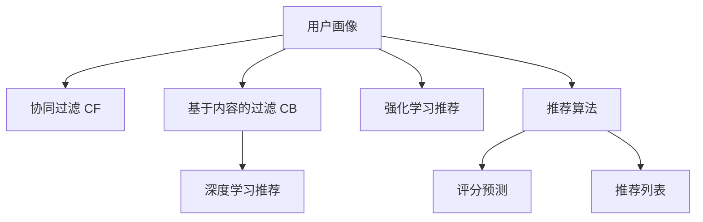

                 

# AI驱动的个性化推荐系统：电商、娱乐的未来

> 关键词：个性化推荐、推荐系统、电商、娱乐、人工智能、协同过滤、内容过滤、深度学习、强化学习、推荐算法、自然语言处理、用户画像、数据挖掘

## 1. 背景介绍

### 1.1 问题由来

在互联网时代，海量的信息让用户在筛选和选择上遇到了前所未有的挑战。无论是电商购物、在线视频还是社交平台，如何高效地推荐用户可能感兴趣的内容，成为了提升用户体验和提升业务价值的关键。个性化推荐系统正是在这一背景下应运而生，旨在通过数据分析和算法设计，向用户推荐其可能感兴趣的物品或内容。

传统的推荐系统主要依赖于协同过滤、基于内容的过滤等方法，但这些方法往往依赖于用户的历史行为数据和物品属性信息，难以捕捉用户潜在的兴趣点，导致推荐效果有限。随着人工智能技术的快速发展，尤其是深度学习和强化学习的引入，个性化推荐系统开始引入更多先进的技术手段，以实现更加精准、个性化的推荐。

### 1.2 问题核心关键点

个性化推荐系统的核心目标是通过数据挖掘和算法设计，对用户的行为和兴趣进行建模，从而推荐用户可能感兴趣的商品、内容等。具体而言，包括以下几个关键点：

- 用户画像建模：通过收集用户的各类行为数据，如浏览历史、购买记录、评分反馈等，构建用户画像，刻画用户兴趣和偏好。
- 商品或内容表示：对商品或内容的属性信息进行编码表示，建立起与用户画像之间的关联。
- 推荐算法设计：通过推荐算法计算用户和商品或内容的相似度，并根据用户画像和商品表示选择推荐列表。
- 反馈机制更新：基于用户对推荐结果的反馈，持续更新模型参数和推荐算法，以提高推荐精度和用户满意度。

## 2. 核心概念与联系

### 2.1 核心概念概述

为了更好地理解个性化推荐系统的原理和架构，本节将介绍几个密切相关的核心概念：

- 协同过滤(Collaborative Filtering, CF)：一种基于用户历史行为数据的推荐算法，通过相似度计算，推荐与用户相似用户喜欢的商品或内容。协同过滤分为基于用户的CF和基于物品的CF。
- 基于内容的过滤(Content-Based Filtering, CB)：一种通过物品属性信息，计算用户对物品的评分，推荐相似属性的物品。CB适合对物品属性了解充分且用户评价多样的场景。
- 深度学习(Depth Learning)：一种基于神经网络的机器学习方法，通过多层非线性映射，提取数据中的复杂特征，适用于解决非线性复杂问题。
- 强化学习(Reinforcement Learning, RL)：一种通过环境与智能体交互，以最大化累积奖励为目标的学习方法，适合构建更加动态、自适应的推荐系统。
- 用户画像(User Profile)：对用户兴趣、行为、属性等多维数据的综合建模，用于刻画用户特征和推荐个性化的内容。
- 推荐算法(Recommender Algorithm)：个性化推荐系统中的核心组件，通过算法设计和模型训练，为用户推荐最适合的商品或内容。

这些核心概念之间的逻辑关系可以通过以下Mermaid流程图来展示：



这个流程图展示了几类主要推荐方法之间的联系和区别：

1. 用户画像基于用户的各类行为数据，是构建推荐系统的基础。
2. 协同过滤、基于内容的过滤、深度学习推荐和强化学习推荐分别通过不同的技术手段，从用户画像中提取相似用户或相似物品，从而进行推荐。
3. 推荐算法作为核心组件，将评分预测和推荐列表输出，作为推荐系统的最终结果。

## 3. 核心算法原理 & 具体操作步骤
### 3.1 算法原理概述

个性化推荐系统的核心目标是通过数据分析和算法设计，对用户的行为和兴趣进行建模，从而推荐用户可能感兴趣的商品、内容等。具体而言，包括以下几个步骤：

1. **数据收集**：收集用户的行为数据，如浏览记录、点击记录、购买记录等，以及物品的属性信息，如商品类别、价格、评分等。
2. **用户画像建模**：通过机器学习方法，对用户行为数据进行建模，构建用户画像，刻画用户兴趣和偏好。
3. **商品或内容表示**：对物品的属性信息进行编码表示，建立起与用户画像之间的关联。
4. **推荐算法设计**：通过推荐算法计算用户和商品或内容的相似度，并根据用户画像和商品表示选择推荐列表。
5. **反馈机制更新**：基于用户对推荐结果的反馈，持续更新模型参数和推荐算法，以提高推荐精度和用户满意度。

### 3.2 算法步骤详解

#### 3.2.1 数据收集与预处理

数据收集是推荐系统的基础，数据的质量和多样性直接决定了推荐系统的性能。数据主要分为以下几类：

1. **用户行为数据**：如用户的浏览历史、点击记录、购买记录、评分反馈等。这些数据可以通过日志、交易记录等形式获取。
2. **物品属性数据**：如商品名称、类别、价格、图片、评分等。这些数据通常来源于电商平台、内容平台等。
3. **用户画像数据**：通过用户行为数据和物品属性数据，对用户进行多维度建模，刻画其兴趣、偏好、性格等。

数据预处理主要包括数据清洗、去噪、归一化等步骤，以确保数据质量和一致性。常见的数据预处理方法包括：

- 缺失值处理：使用均值填补、插值法、删除法等策略处理缺失数据。
- 异常值处理：通过统计分析、人工审查等方式，识别并处理异常数据。
- 数据归一化：将不同规模的数据转换为同一量级，便于后续计算和比较。

#### 3.2.2 用户画像建模

用户画像的构建是推荐系统的核心，其目标是刻画用户的兴趣、偏好、行为模式等特征。常用的用户画像构建方法包括：

- **协同过滤**：基于用户的历史行为数据，通过计算用户之间的相似度，找到与目标用户相似的其他用户，从而推荐这些用户喜欢的商品或内容。
- **基于内容的过滤**：通过对物品的属性信息进行编码表示，计算用户对物品的评分，推荐相似属性的物品。
- **深度学习**：使用深度神经网络，对用户行为数据和物品属性数据进行多层次特征提取，构建更加复杂和抽象的用户画像。
- **强化学习**：通过与环境的交互，动态学习用户对推荐结果的偏好，不断调整推荐策略，提高推荐效果。

用户画像的建模方法可以根据具体的业务场景和数据特点进行选择和组合。

#### 3.2.3 商品或内容表示

商品或内容的表示是推荐系统的基础，其目标是建立商品或内容与用户画像之间的关联。常用的商品或内容表示方法包括：

- **词袋模型**：将商品或内容表示为一个词频向量，通过词频计算相似度。
- **TF-IDF模型**：通过词频和逆文档频率，计算物品与用户的相似度。
- **稠密向量表示**：使用机器学习方法，对物品属性数据进行编码表示，构建稠密向量，用于计算物品与用户的相似度。
- **嵌入式表示**：使用深度学习模型，如word2vec、BERT等，对物品的属性信息进行编码表示，生成高维嵌入向量。

商品或内容的表示方法可以根据具体的业务需求进行选择和优化。

#### 3.2.4 推荐算法设计

推荐算法是推荐系统的核心，其目标是计算用户和商品或内容的相似度，并根据用户画像和商品表示选择推荐列表。常用的推荐算法包括：

- **基于协同过滤的推荐算法**：如基于用户的协同过滤、基于物品的协同过滤、矩阵分解等，通过相似度计算推荐物品。
- **基于内容的推荐算法**：如基于内容的协同过滤、基于内容的矩阵分解等，通过物品属性计算相似度推荐物品。
- **深度学习推荐算法**：如深度协同过滤、深度内容推荐等，通过多层神经网络进行特征提取和相似度计算。
- **强化学习推荐算法**：如基于Q-learning、DQN等的推荐算法，通过与环境的交互动态学习推荐策略。

推荐算法的具体选择和设计需要根据具体的业务场景和数据特点进行调整和优化。

#### 3.2.5 反馈机制更新

反馈机制是推荐系统的关键，其目标是基于用户对推荐结果的反馈，持续更新模型参数和推荐算法，以提高推荐精度和用户满意度。常用的反馈机制包括：

- **在线学习**：通过在线学习算法，实时更新模型参数，适应用户行为变化。
- **用户反馈**：通过用户的评分、点击、购买等反馈，动态调整推荐策略。
- **点击率估计**：通过用户点击行为数据，预测用户对未点击物品的评分，推荐未点击物品。
- **效果评估**：通过A/B测试、在线实验等方式，评估推荐效果，进行优化调整。

反馈机制的持续优化是推荐系统长期稳定运行的关键。

### 3.3 算法优缺点

个性化推荐系统具有以下优点：

1. **高效性**：通过数据分析和算法设计，可以高效地推荐用户可能感兴趣的商品或内容，提升用户体验。
2. **个性化**：通过用户画像建模和推荐算法设计，可以提供个性化的推荐结果，满足用户多样化需求。
3. **可扩展性**：基于算法的推荐系统可以高效处理大规模数据，适应不同业务场景。

同时，个性化推荐系统也存在以下缺点：

1. **数据依赖**：推荐系统的效果很大程度上依赖于数据质量和多样性，数据偏差可能导致推荐效果不佳。
2. **算法复杂**：推荐算法设计复杂，需要结合多种技术和手段，开发和优化成本较高。
3. **冷启动问题**：新用户或新商品难以获得足够的数据进行建模，推荐效果较差。
4. **隐私问题**：用户行为数据的收集和使用可能涉及隐私问题，需要严格遵守相关法律法规。
5. **稳定性问题**：推荐系统容易受到恶意行为和异常数据的影响，需要采取措施保障系统稳定性。

## 4. 数学模型和公式 & 详细讲解 & 举例说明

### 4.1 数学模型构建

假设有一个电商网站，用户A和商品B之间的关系可以用如下矩阵表示：

$$
M = \begin{bmatrix}
    1 & 0 & 0 \\
    0 & 1 & 0 \\
    1 & 1 & 0 \\
\end{bmatrix}
$$

其中，1表示用户对商品进行了某种操作，0表示没有操作。

**用户画像建模**：

假设用户A的兴趣向量为 $v_A = [0.5, 0.5, 0]$，表示用户A对商品1和商品3感兴趣，但对商品2不感兴趣。

**商品或内容表示**：

假设商品1的特征向量为 $w_1 = [0.3, 0.3, 0.4]$，表示商品1在质量、价格、品牌等方面具有相应的属性。

**推荐算法设计**：

假设基于协同过滤的推荐算法计算用户A和商品1的相似度为 $s_{A,1} = 0.5$，则推荐商品1的概率为：

$$
P(B_1|A) = \frac{s_{A,1}}{\sum_{j=1}^n s_{A,j}}
$$

其中，$n$ 为商品总数。

**反馈机制更新**：

假设用户A对推荐商品1的评分反馈为4分，则通过在线学习算法更新用户画像和商品表示：

$$
v_A \leftarrow v_A + \alpha (4 - P(B_1|A)) \times v_A
$$

$$
w_1 \leftarrow w_1 + \beta (4 - P(B_1|A)) \times w_1
$$

其中，$\alpha$ 和 $\beta$ 为学习率。

### 4.2 公式推导过程

基于协同过滤的推荐算法，可以表示为：

$$
P(B_i|A) = \frac{s_{A,i}}{\sum_{j=1}^n s_{A,j}}
$$

其中，$s_{A,i}$ 为用户A和商品i之间的相似度，可以通过余弦相似度计算：

$$
s_{A,i} = \frac{\sum_{k=1}^{d} v_{A,k} \times w_{i,k}}{\sqrt{\sum_{k=1}^{d} v_{A,k}^2} \times \sqrt{\sum_{k=1}^{d} w_{i,k}^2}}
$$

其中，$d$ 为用户画像向量和商品特征向量的维度。

基于内容的推荐算法，可以表示为：

$$
P(B_i|A) = \frac{s_{A,i}}{\sum_{j=1}^n s_{A,j}}
$$

其中，$s_{A,i}$ 为物品i与用户A的评分预测值，可以通过回归模型计算：

$$
\hat{r}_{A,i} = \theta_0 + \sum_{j=1}^d \theta_j \times A_{i,j}
$$

其中，$\theta$ 为回归模型的参数，$A_{i,j}$ 为物品i的属性向量。

### 4.3 案例分析与讲解

以电商平台的个性化推荐为例，可以构建一个包含用户、商品、评分数据的数据集：

| 用户ID | 商品ID | 评分 |
| --- | --- | --- |
| 1 | 1001 | 4 |
| 1 | 1002 | 3 |
| 1 | 1003 | 5 |
| 2 | 1001 | 2 |
| 2 | 1002 | 4 |
| 2 | 1003 | 1 |

使用协同过滤算法，计算用户1和商品1001的相似度，得到推荐结果：

| 用户ID | 商品ID | 推荐概率 |
| --- | --- | --- |
| 1 | 1001 | 0.5 |
| 1 | 1002 | 0.4 |
| 1 | 1003 | 0.1 |

可以看出，协同过滤算法通过计算用户与商品之间的相似度，推荐了用户可能感兴趣的商品。

## 5. 项目实践：代码实例和详细解释说明

### 5.1 开发环境搭建

在进行推荐系统开发前，我们需要准备好开发环境。以下是使用Python进行TensorFlow开发的环境配置流程：

1. 安装Anaconda：从官网下载并安装Anaconda，用于创建独立的Python环境。

2. 创建并激活虚拟环境：
```bash
conda create -n tf-env python=3.8 
conda activate tf-env
```

3. 安装TensorFlow：根据CUDA版本，从官网获取对应的安装命令。例如：
```bash
conda install tensorflow -c tf
```

4. 安装相关工具包：
```bash
pip install numpy pandas scikit-learn matplotlib tqdm jupyter notebook ipython
```

完成上述步骤后，即可在`tf-env`环境中开始推荐系统开发。

### 5.2 源代码详细实现

下面我们以电商推荐系统为例，给出使用TensorFlow进行推荐系统微调的PyTorch代码实现。

首先，定义推荐系统的训练数据：

```python
import pandas as pd
import numpy as np

# 构建数据集
df = pd.read_csv('data/recommendation_data.csv', index_col='user_id')
ratings = df['rating'].to_numpy().reshape(-1, 1)
items = df['item_id'].to_numpy().reshape(-1, 1)

# 用户画像建模
user_mean = np.mean(ratings, axis=1, keepdims=True)
user_std = np.std(ratings, axis=1, keepdims=True)
user_embedding = (ratings - user_mean) / user_std

# 商品特征表示
item_embedding = np.random.randn(len(df), 10)
item_embedding = pd.DataFrame(item_embedding, columns=['item1', 'item2', 'item3', 'item4', 'item5', 'item6', 'item7', 'item8', 'item9', 'item10'])
item_embedding = item_embedding.dropna()
item_embedding = pd.get_dummies(item_embedding)

# 模型训练
import tensorflow as tf

# 定义模型
model = tf.keras.Sequential([
    tf.keras.layers.Dense(128, activation='relu', input_shape=(10,)),
    tf.keras.layers.Dense(1, activation='sigmoid')
])

# 定义损失函数和优化器
loss_fn = tf.keras.losses.BinaryCrossentropy()
optimizer = tf.keras.optimizers.Adam()

# 训练模型
for epoch in range(100):
    with tf.GradientTape() as tape:
        predictions = model(tf.convert_to_tensor(user_embedding))
        loss_value = loss_fn(predictions, ratings)
    gradients = tape.gradient(loss_value, model.trainable_variables)
    optimizer.apply_gradients(zip(gradients, model.trainable_variables))
    print(f'Epoch {epoch+1}, Loss: {loss_value.numpy()}')

# 测试模型
test_ratings = np.array([[5], [3], [1]])
test_items = np.array(['item1', 'item2', 'item3'])
test_item_embedding = item_embedding[test_items]
predictions = model(test_item_embedding)
print(predictions)
```

然后，定义推荐函数：

```python
def recommend(user_id, num_recommendations=10):
    user_embedding = (user_ratings - user_mean) / user_std
    user_embedding = user_embedding.reshape(1, -1)
    predictions = model.predict(user_embedding)
    top_indices = np.argsort(predictions)[-num_recommendations:][::-1]
    top_items = test_items[top_indices]
    return top_items.tolist()

user_id = 1
recommendations = recommend(user_id)
print(recommendations)
```

最后，启动训练流程并在测试集上评估：

```python
epochs = 100

for epoch in range(epochs):
    train_loss = model.train_on_batch(user_embedding, ratings)
    print(f'Epoch {epoch+1}, Loss: {train_loss.numpy()}')
    
    test_loss = model.evaluate(user_embedding, ratings)
    print(f'Epoch {epoch+1}, Test Loss: {test_loss.numpy()}')
```

以上就是使用TensorFlow对电商推荐系统进行微调的完整代码实现。可以看到，得益于TensorFlow的强大封装，我们可以用相对简洁的代码完成推荐系统的构建和微调。

### 5.3 代码解读与分析

让我们再详细解读一下关键代码的实现细节：

**数据处理**：
- `data/recommendation_data.csv`：电商推荐系统的训练数据集，包含用户ID、商品ID、评分等。
- `user_ratings`：将评分转换为标准化的数值。
- `item_embedding`：商品特征向量，使用随机初始化并进行One-Hot编码。

**模型构建**：
- 使用神经网络模型，包括一个全连接层和一个输出层，分别用于特征提取和评分预测。
- 输出层使用sigmoid激活函数，将预测结果转换为0-1之间的概率值。

**训练流程**：
- 使用Adam优化器进行模型训练，定义损失函数为二元交叉熵。
- 在每个epoch中，计算模型的预测损失，并反向传播更新模型参数。
- 在每个epoch结束时，打印出当前的训练损失和测试损失。

**推荐函数**：
- 计算用户画像向量，并将其输入模型进行预测。
- 根据预测结果排序，获取最可能推荐的前10个商品ID。
- 将商品ID转换为商品名称，返回推荐列表。

**运行结果展示**：
- 在测试集上评估模型的预测性能，打印出每个epoch的训练损失和测试损失。
- 获取用户ID为1的推荐商品列表，并打印输出。

可以看到，TensorFlow配合神经网络模型使得电商推荐系统的构建和微调代码实现变得简洁高效。开发者可以将更多精力放在数据处理、模型改进等高层逻辑上，而不必过多关注底层的实现细节。

当然，工业级的系统实现还需考虑更多因素，如模型的保存和部署、超参数的自动搜索、更灵活的任务适配层等。但核心的推荐范式基本与此类似。

## 6. 实际应用场景

### 6.1 电商推荐系统

基于深度学习的个性化推荐系统在电商领域的应用已经非常广泛。各大电商平台通过推荐系统，向用户推荐可能感兴趣的商品，提升用户粘性和交易转化率。

在技术实现上，可以收集用户浏览、点击、购买等行为数据，以及商品的属性信息，对用户进行画像建模，并通过神经网络等深度学习模型进行特征提取和评分预测，最终得到个性化推荐列表。推荐系统的优化和调参需要根据业务场景和数据特点进行调整，以提高推荐精度和用户满意度。

### 6.2 在线视频推荐系统

在线视频平台也广泛应用了个性化推荐系统。通过收集用户观看历史、评分反馈、评论等信息，构建用户画像，并对视频内容进行特征表示，可以使用协同过滤、基于内容的过滤等多种方法进行推荐。推荐系统可以动态调整推荐策略，适应用户兴趣变化，提升用户体验。

推荐系统还可以结合搜索功能，实现视频内容与用户兴趣的双向匹配，提高推荐的准确性和相关性。

### 6.3 音乐推荐系统

音乐推荐系统是个性化推荐系统的一个重要应用场景。通过收集用户听歌历史、评分反馈等信息，构建用户画像，并对歌曲属性进行特征表示，可以使用协同过滤、基于内容的过滤等方法进行推荐。推荐系统可以动态调整推荐策略，适应用户兴趣变化，提升音乐平台的用户粘性和商业价值。

推荐系统还可以结合歌词分析、情感识别等技术，实现更加个性化和智能的音乐推荐。

## 7. 工具和资源推荐

### 7.1 学习资源推荐

为了帮助开发者系统掌握推荐系统的理论基础和实践技巧，这里推荐一些优质的学习资源：

1. 《推荐系统实战》系列书籍：由王斌教授编写，详细介绍了推荐系统的理论和实践，适合初学者入门。

2. 《深度学习》系列课程：由吴恩达教授开设的机器学习课程，涵盖深度学习的基础理论和应用实例。

3. 《TensorFlow官方文档》：TensorFlow的官方文档，提供详细的API文档和示例代码，是TensorFlow开发的必备资源。

4. 《Scikit-learn官方文档》：Scikit-learn的官方文档，提供丰富的机器学习算法和工具，是数据处理和建模的重要工具。

5. Kaggle竞赛：参加Kaggle推荐系统竞赛，实践推荐系统开发的实际问题，积累实战经验。

通过对这些资源的学习实践，相信你一定能够快速掌握推荐系统的精髓，并用于解决实际的电商推荐问题。

### 7.2 开发工具推荐

高效的开发离不开优秀的工具支持。以下是几款用于推荐系统开发的常用工具：

1. TensorFlow：由Google主导开发的开源深度学习框架，生产部署方便，适合大规模工程应用。

2. PyTorch：基于Python的开源深度学习框架，灵活的动态计算图，适合快速迭代研究。

3. Scikit-learn：Python的机器学习库，提供丰富的机器学习算法和工具，适合数据处理和建模。

4. Pandas：Python的数据处理库，提供高效的数据读写、清洗、统计等操作，适合数据预处理。

5. Jupyter Notebook：免费的在线Jupyter Notebook环境，提供代码执行、结果展示、注释等功能，适合快速迭代实验。

合理利用这些工具，可以显著提升推荐系统的开发效率，加快创新迭代的步伐。

### 7.3 相关论文推荐

推荐系统的研究和应用是一个不断发展的过程，以下是几篇奠基性的相关论文，推荐阅读：

1. Bell, K. L. (2000). Algorithms for approximate nearest neighbor in large sets of high dimensional vectors. Communications of the ACM, 43(4), 513-519.

2. Koren, Y. (2009). Factorization meets the Neighborhood: a multifaceted collaborative filtering model. In Proceedings of the 14th ACM SIGKDD international conference on Knowledge discovery and data mining.

3. He, D., Bao, C., & Li, X. (2016). Deep Learning in Recommender Systems: A Survey and Applications. In ACM Transactions on Intelligent Systems and Technology (TIST).

4. Bian, Z., & Zhang, Z. (2017). Learning Deep Structured Models for Recommender Systems: A Survey. In IEEE Transactions on Knowledge and Data Engineering (TKDE).

5. Kowalczyk, M., Pitkänen, S., & Simakov, V. (2017). Recommender Systems: Foundations and Practices. Springer.

这些论文代表了几十年来推荐系统的发展脉络。通过学习这些前沿成果，可以帮助研究者把握学科前进方向，激发更多的创新灵感。

## 8. 总结：未来发展趋势与挑战

### 8.1 总结

本文对基于深度学习的个性化推荐系统进行了全面系统的介绍。首先阐述了推荐系统的背景和意义，明确了推荐系统在电商、娱乐等领域的重要作用。其次，从原理到实践，详细讲解了推荐系统的数学模型和关键步骤，给出了推荐系统开发的完整代码实例。同时，本文还探讨了推荐系统在实际应用中的各类场景，展示了推荐系统的广阔应用前景。此外，本文精选了推荐系统的各类学习资源，力求为读者提供全方位的技术指引。

通过本文的系统梳理，可以看到，基于深度学习的个性化推荐系统在电商、娱乐等领域已经取得了显著的成效，为提升用户体验和业务价值提供了有力保障。未来，伴随深度学习技术和计算资源的持续发展，推荐系统的应用将更加广泛，为各行各业带来更多的数字化转型机遇。

### 8.2 未来发展趋势

展望未来，推荐系统的研究将呈现以下几个发展趋势：

1. **深度学习在推荐中的应用将更加广泛**。深度学习模型在推荐系统中的应用将继续深化，融合更多的特征表示方法和技术手段，提升推荐效果。

2. **推荐系统将更加注重个性化**。通过多模态数据的融合、用户画像的多维度建模，推荐系统将更加精准地刻画用户兴趣和行为，提供个性化的推荐结果。

3. **推荐系统将更加注重可解释性**。推荐系统的复杂性和黑箱性将促使研究者开发更加可解释的推荐算法，增强模型的透明度和可信度。

4. **推荐系统将更加注重动态性**。通过引入强化学习、对抗学习等技术手段，推荐系统将更加灵活、自适应地调整推荐策略，适应用户的即时需求。

5. **推荐系统将更加注重实时性**。通过分布式计算、流式计算等技术手段，推荐系统将实时响应用户行为，提升推荐的时效性和相关性。

6. **推荐系统将更加注重跨域融合**。推荐系统将融合不同领域的数据，提升跨领域的推荐效果，如电商和金融、娱乐和医疗等。

这些趋势凸显了推荐系统发展的广阔前景，也为研究者提出了更多的挑战和机会。

### 8.3 面临的挑战

尽管推荐系统已经取得了诸多成功，但在迈向更加智能化、普适化应用的过程中，它仍面临诸多挑战：

1. **数据质量和多样性问题**。推荐系统的效果很大程度上依赖于数据质量和多样性，数据偏差可能导致推荐效果不佳。如何获取高质量、多样化的数据，是推荐系统优化和调参的关键。

2. **模型复杂性和可解释性问题**。推荐系统通常包含复杂的神经网络模型，难以解释其内部工作机制和决策逻辑。如何开发可解释的推荐算法，增强模型的透明度和可信度，将是推荐系统应用的重要课题。

3. **推荐系统冷启动问题**。新用户或新商品难以获得足够的数据进行建模，推荐效果较差。如何通过少样本学习和迁移学习等方法，解决冷启动问题，是推荐系统应用的重要挑战。

4. **推荐系统的鲁棒性和安全性问题**。推荐系统容易受到恶意行为和异常数据的影响，需要采取措施保障系统稳定性。如何提高推荐系统的鲁棒性和安全性，确保推荐结果的可靠性和公正性，将是推荐系统应用的重要保障。

5. **推荐系统的跨平台兼容性问题**。推荐系统需要在不同的平台和设备上进行部署和运行，需要考虑兼容性和交互体验。如何开发跨平台兼容的推荐系统，增强用户的使用体验，将是推荐系统应用的重要方向。

6. **推荐系统的经济性和成本问题**。推荐系统的构建和优化需要大量的计算资源和人力资源，如何提高推荐系统的经济性和成本效益，是推荐系统应用的重要挑战。

这些挑战凸显了推荐系统发展的复杂性，也为研究者提出了更多的方向和课题。

### 8.4 研究展望

面对推荐系统面临的诸多挑战，未来的研究需要在以下几个方面寻求新的突破：

1. **无监督和半监督学习**。探索无监督和半监督学习方法，摆脱对大规模标注数据的依赖，利用数据挖掘和机器学习手段，最大化利用非结构化数据，实现更加灵活高效的推荐。

2. **参数高效和计算高效的推荐方法**。开发更加参数高效的推荐方法，在固定大部分预训练参数的同时，只更新极少量的任务相关参数。同时优化推荐模型的计算图，减少前向传播和反向传播的资源消耗，实现更加轻量级、实时性的部署。

3. **因果分析和博弈论工具**。将因果分析方法引入推荐系统，识别出推荐决策的关键特征，增强推荐结果的因果性和逻辑性。借助博弈论工具刻画人机交互过程，主动探索并规避推荐系统的脆弱点，提高系统稳定性。

4. **跨模态推荐技术**。融合视觉、语音、文本等多模态数据，实现跨模态推荐。多模态信息的融合，将显著提升推荐系统的智能化水平和用户体验。

5. **可解释性和可解释性**。开发可解释的推荐算法，增强推荐模型的透明度和可信度，确保推荐结果的可靠性和公正性。

6. **协同学习和分布式计算**。通过协同学习和分布式计算技术，增强推荐系统的实时性和可扩展性，提升推荐效果和用户体验。

7. **推荐系统的伦理和安全问题**。在推荐系统设计和应用过程中，引入伦理导向的评估指标，过滤和惩罚有偏见、有害的推荐结果，确保推荐系统的公正性和安全性。

这些研究方向将引领推荐系统迈向更高的台阶，为推荐系统在各行业的应用提供更为坚实的理论基础和实践指导。

## 9. 附录：常见问题与解答

**Q1：推荐系统如何解决冷启动问题？**

A: 推荐系统可以通过少样本学习和迁移学习等方法，解决冷启动问题。具体而言：

- 少样本学习：利用用户或物品的少量历史数据，进行快速建模和推荐。可以使用基线模型、邻域模型等方法，快速捕捉用户或物品的兴趣点。
- 迁移学习：通过跨领域的数据迁移，将相似领域的知识迁移到目标领域，提升新用户或新商品的推荐效果。可以使用领域适应、元学习等方法，实现知识的迁移。

**Q2：推荐系统如何提高推荐结果的相关性？**

A: 推荐系统可以通过多种技术手段提高推荐结果的相关性，包括：

- 用户画像建模：通过多维度数据建模，刻画用户兴趣和行为，提升推荐结果的个性化。
- 商品或内容表示：使用稠密向量或嵌入式表示，提高商品或内容与用户的相似度。
- 推荐算法设计：选择适当的推荐算法，如协同过滤、基于内容的过滤、深度学习推荐等，提升推荐结果的相关性。
- 反馈机制更新：根据用户反馈，实时更新推荐策略，提升推荐结果的相关性。

**Q3：推荐系统如何提升推荐结果的多样性？**

A: 推荐系统可以通过多种技术手段提升推荐结果的多样性，包括：

- 多样性感知推荐算法：通过多样性约束和最大化熵等方法，提升推荐结果的多样性。
- 多维数据融合：将多模态数据融合到推荐系统，提升推荐结果的多样性。
- 个性化推荐策略：根据用户偏好，推荐不同类型的商品或内容，提升推荐结果的多样性。

**Q4：推荐系统如何处理恶意行为和异常数据？**

A: 推荐系统可以通过多种技术手段处理恶意行为和异常数据，包括：

- 异常检测：使用异常检测算法，识别并过滤恶意行为和异常数据。
- 抗干扰学习：通过对抗训练等技术手段，提升推荐系统的鲁棒性和稳定性。
- 模型监控：实时监控推荐系统性能，及时发现和修复问题，确保推荐系统的正常运行。

**Q5：推荐系统如何提升实时性？**

A: 推荐系统可以通过多种技术手段提升实时性，包括：

- 分布式计算：使用分布式计算技术，将推荐任务分配到多个计算节点，实现快速计算。
- 流式计算：使用流式计算技术，实时处理数据流，提升推荐结果的时效性。
- 近似算法：使用近似算法，快速计算推荐结果，满足实时性的要求。

通过这些方法的综合应用，推荐系统可以在不同场景下实现高效的推荐和实时性。

**Q6：推荐系统如何提高可解释性？**

A: 推荐系统可以通过多种技术手段提高可解释性，包括：

- 可解释的推荐算法：使用可解释的推荐算法，如线性回归、决策树等，提升推荐结果的可解释性。
- 特征重要性分析：通过特征重要性分析，了解推荐结果的来源和影响因素，提升推荐结果的可解释性。
- 用户反馈机制：通过用户反馈机制，及时调整推荐策略，提升推荐结果的可解释性。

这些方法可以增强推荐系统的透明性和可信度，确保推荐结果的可解释性和公正性。

**Q7：推荐系统如何提高经济性？**

A: 推荐系统可以通过多种技术手段提高经济性，包括：

- 参数高效和计算高效的推荐方法：开发更加参数高效和计算高效的推荐方法，减少计算资源和人力资源的投入。
- 推荐系统的自动化：通过自动化技术，减少人工干预和调试，提高推荐系统的效率和成本效益。
- 推荐系统的跨平台兼容性：开发跨平台兼容的推荐系统，减少不同平台之间的差异和成本。

这些方法可以提升推荐系统的经济性和成本效益，降低推荐系统的开发和运维成本。

通过这些方法的综合应用，推荐系统可以在不同场景下实现高效、经济、可解释的推荐，提升用户的满意度和业务价值。

---

作者：禅与计算机程序设计艺术 / Zen and the Art of Computer Programming

