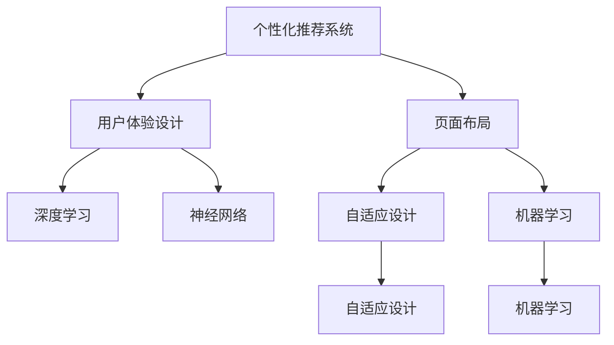

                 

# AI驱动的个性化页面布局优化

> 关键词：个性化推荐,页面布局优化,人工智能,深度学习,神经网络,用户体验

## 1. 背景介绍

### 1.1 问题由来
在移动互联网时代，信息传播的方式和形式发生了巨大变化。社交媒体、搜索引擎、电子商务等平台逐渐成为人们获取信息、交流沟通的主要渠道。然而，在繁杂的信息流中，用户容易产生信息过载、注意力分散等问题，用户体验显著降低。

针对这一问题，个性化推荐技术应运而生。通过精准分析用户行为数据，推荐系统能够为用户提供符合其兴趣和需求的信息。在新闻推荐、电商推荐、视频推荐等领域，个性化推荐已成为用户获取信息的重要方式。

然而，推荐系统面临的挑战远不止于内容推荐。为了提升推荐效果，用户还需要直观易用的界面。界面不仅展示推荐内容，还直接影响用户的点击率、留存率和满意度。因此，如何实现个性化页面布局优化，已成为推荐系统面临的新挑战。

### 1.2 问题核心关键点
个性化页面布局优化，即通过机器学习算法，自动设计用户界面，使其具备更好的个性化特性和用户体验。核心在于：

- 收集用户行为数据：通过用户在界面上的点击、停留、滚动等行为数据，分析用户的兴趣和偏好。
- 设计推荐算法：基于用户兴趣，设计推荐算法，生成个性化内容。
- 优化页面布局：通过自动化的界面生成算法，设计最优的界面布局，提升用户体验。
- 反馈循环：不断收集用户反馈，优化推荐算法和页面布局。

## 2. 核心概念与联系

### 2.1 核心概念概述

为更好地理解个性化页面布局优化，本节将介绍几个密切相关的核心概念：

- 个性化推荐系统：根据用户历史行为数据，推荐系统能够生成个性化的内容。

- 用户体验设计：用户体验设计旨在提升用户与系统的互动体验，通过界面设计、交互方式等手段优化用户操作流程。

- 页面布局：页面布局是网站或应用中的信息分布方式，包括标题、正文、按钮等元素的位置和大小。

- 深度学习：基于神经网络结构，深度学习能够自动学习特征表示，进行数据建模和预测。

- 神经网络：由大量人工神经元组成的计算模型，能够处理复杂的非线性关系。

- 自适应设计：通过动态调整页面布局，适应不同用户和环境条件，提升个性化效果。

- 机器学习：利用数据训练模型，机器学习能够自动化地从数据中发现规律和规律性。

这些核心概念之间的逻辑关系可以通过以下Mermaid流程图来展示：



这个流程图展示了个性化推荐系统的核心概念及其之间的关系：

1. 个性化推荐系统通过深度学习技术，对用户行为数据进行建模，生成个性化内容。
2. 用户体验设计关注用户与系统的互动体验，页面布局是提升用户体验的重要手段。
3. 深度学习和神经网络技术能够自动设计个性化的页面布局，提升用户的满意度。
4. 机器学习能够动态调整页面布局，适应不同的用户和环境条件。
5. 自适应设计通过动态调整页面布局，适应用户和环境的不断变化，提升个性化效果。

## 3. 核心算法原理 & 具体操作步骤
### 3.1 算法原理概述

个性化页面布局优化算法，本质上是一个联合优化问题。其核心思想是：结合用户兴趣和界面布局，设计最优的界面展示策略。通过机器学习算法，自动设计界面布局，以提升用户的点击率、留存率和满意度。

形式化地，假设用户兴趣表示为向量 $\mathbf{u} \in \mathbb{R}^k$，界面布局表示为向量 $\mathbf{v} \in \mathbb{R}^d$，其中 $k$ 为兴趣维度，$d$ 为界面布局维度。界面布局优化的目标是最大化以下目标函数：

$$
\max_{\mathbf{v}} \mathcal{L}(\mathbf{u}, \mathbf{v})
$$

其中 $\mathcal{L}$ 为针对用户 $\mathbf{u}$ 的损失函数，衡量界面布局 $\mathbf{v}$ 对用户满意度 $S(u,v)$ 的影响。

### 3.2 算法步骤详解

个性化页面布局优化的算法步骤如下：

**Step 1: 数据预处理与模型训练**
- 收集用户行为数据，包括点击、停留、滚动等行为。
- 对数据进行清洗和预处理，去除异常值和噪声。
- 设计推荐算法，如协同过滤、内容推荐等，生成个性化内容。
- 使用深度学习模型，如CNN、RNN、GRU等，对用户行为数据和界面布局进行建模。

**Step 2: 界面生成与动态调整**
- 使用神经网络模型，自动生成页面布局，使界面元素与用户兴趣匹配。
- 引入自适应设计方法，根据用户反馈和环境条件，动态调整页面布局。

**Step 3: 评估与反馈循环**
- 对页面布局进行A/B测试，评估用户满意度。
- 收集用户反馈数据，优化模型参数。
- 根据用户反馈和新数据，重新训练推荐算法和页面布局生成模型。

### 3.3 算法优缺点

个性化页面布局优化算法具有以下优点：
1. 提升用户体验：通过自动设计个性化页面布局，提升用户的点击率、留存率和满意度。
2. 快速迭代优化：通过动态调整页面布局，能够快速适应不同用户和环境条件。
3. 适应复杂需求：通过深度学习和自适应设计，能够处理复杂的用户兴趣和界面需求。
4. 可解释性强：模型的决策过程可以通过可视化方式展示，帮助开发者理解模型行为。

同时，该算法也存在一定的局限性：
1. 数据依赖性：算法依赖高质量用户行为数据，数据的收集和清洗成本较高。
2. 模型复杂性：深度学习模型的训练和优化需要较高的计算资源。
3. 隐私问题：用户行为数据的收集和处理涉及隐私保护，需要严格的法律和伦理约束。
4. 界面美观性：自动生成界面可能缺乏美感，需要后续人工优化。
5. 用户体验不一致：不同用户在同一页面上可能看到不同的布局，影响一致性。

尽管存在这些局限性，但就目前而言，个性化页面布局优化算法仍是最主流的研究方向。未来相关研究的重点在于如何进一步降低数据依赖，提高算法的可解释性和鲁棒性，以及确保用户的隐私和安全。

### 3.4 算法应用领域

个性化页面布局优化算法在推荐系统、搜索引擎、社交媒体、电子商务等多个领域都有广泛的应用，具体包括：

- 新闻推荐：自动设计新闻页面的布局，提升用户阅读体验。
- 电商推荐：自动设计电商页面布局，增加用户点击和购买率。
- 社交媒体：自动设计社交媒体动态界面的布局，提升用户互动体验。
- 视频推荐：自动设计视频页面的布局，提升用户观看体验。
- 智能客服：自动设计客服页面的布局，提升用户问题解决效率。
- 智能家居：自动设计家居设备的布局，提升用户操作体验。

除了上述这些经典应用外，个性化页面布局优化算法还在智能交通、智能医疗、智慧旅游等新兴领域中展现出了强大的应用潜力。

## 4. 数学模型和公式 & 详细讲解 & 举例说明

### 4.1 数学模型构建

本节将使用数学语言对个性化页面布局优化算法进行更加严格的刻画。

记用户兴趣表示为向量 $\mathbf{u} \in \mathbb{R}^k$，界面布局表示为向量 $\mathbf{v} \in \mathbb{R}^d$。假设用户满意度为 $S(u,v)$，表示用户对界面布局 $\mathbf{v}$ 的偏好。则页面布局优化的目标函数为：

$$
\max_{\mathbf{v}} S(\mathbf{u}, \mathbf{v})
$$

其中 $S$ 为用户满意度的具体表达形式，可以是一个标量或向量。例如，对于电商推荐系统，用户满意度可以定义为点击率 $C(u,v)$ 和转化率 $R(u,v)$ 的线性组合：

$$
S(u,v) = \alpha C(u,v) + \beta R(u,v)
$$

其中 $\alpha$ 和 $\beta$ 为权重系数。

### 4.2 公式推导过程

以下我们以电商推荐系统为例，推导点击率 $C(u,v)$ 的计算公式。

假设用户兴趣向量 $\mathbf{u} \in \mathbb{R}^k$，界面布局向量 $\mathbf{v} \in \mathbb{R}^d$。设用户对每个界面元素 $e_i$ 的点击概率为 $p_i$，点击率为 $C(u,v)$，则点击率的计算公式为：

$$
C(u,v) = \sum_{i=1}^d p_i(\mathbf{u} \cdot \mathbf{v}_i)
$$

其中 $\mathbf{v}_i$ 表示界面元素 $e_i$ 对应的布局向量。

对于电商推荐系统，界面元素可能包括产品图片、价格、描述等。假设界面元素 $e_i$ 对应的布局向量为 $\mathbf{v}_i$，用户对每个元素 $e_i$ 的点击概率为 $p_i$，则点击率的计算公式为：

$$
C(u,v) = \sum_{i=1}^d p_i(\mathbf{u} \cdot \mathbf{v}_i)
$$

其中 $\mathbf{v}_i$ 表示产品图片、价格、描述等对应的布局向量，$p_i$ 为产品点击概率。

### 4.3 案例分析与讲解

考虑一个电商推荐系统，假设用户对产品的点击率 $C(u,v)$ 与用户兴趣向量 $\mathbf{u}$ 和界面布局向量 $\mathbf{v}$ 的关系如下：

$$
C(u,v) = \alpha (\mathbf{u} \cdot \mathbf{v}_{\text{image}}) + \beta (\mathbf{u} \cdot \mathbf{v}_{\text{price}}) + \gamma (\mathbf{u} \cdot \mathbf{v}_{\text{description}})
$$

其中 $\alpha, \beta, \gamma$ 为权重系数，分别表示图片、价格、描述对点击率的影响程度。

假设用户兴趣向量 $\mathbf{u} = [0.5, 0.3, 0.2]$，界面布局向量 $\mathbf{v} = [\mathbf{v}_{\text{image}}, \mathbf{v}_{\text{price}}, \mathbf{v}_{\text{description}}]$。设 $\alpha=0.6, \beta=0.3, \gamma=0.1$，则用户对界面元素的点击率计算如下：

$$
C(u,v) = 0.6 \times (0.5 \times \mathbf{v}_{\text{image}} + 0.3 \times \mathbf{v}_{\text{price}} + 0.1 \times \mathbf{v}_{\text{description}})
$$

通过这个计算公式，可以看出用户对界面元素的点击率与其兴趣向量和布局向量的相关性密切相关。这种相关性可以通过深度学习模型自动学习得到，从而实现个性化的界面布局优化。

## 5. 项目实践：代码实例和详细解释说明
### 5.1 开发环境搭建

在进行个性化页面布局优化实践前，我们需要准备好开发环境。以下是使用Python进行TensorFlow开发的环境配置流程：

1. 安装Anaconda：从官网下载并安装Anaconda，用于创建独立的Python环境。

2. 创建并激活虚拟环境：
```bash
conda create -n tf-env python=3.8 
conda activate tf-env
```

3. 安装TensorFlow：根据CUDA版本，从官网获取对应的安装命令。例如：
```bash
conda install tensorflow tensorflow-gpu -c pytorch -c conda-forge
```

4. 安装TensorBoard：TensorFlow配套的可视化工具，用于监控模型训练状态。
```bash
conda install tensorboard
```

5. 安装Pillow库：用于图像处理和显示。
```bash
pip install pillow
```

完成上述步骤后，即可在`tf-env`环境中开始实践。

### 5.2 源代码详细实现

下面我们以电商推荐系统为例，给出使用TensorFlow实现个性化页面布局优化的代码实现。

首先，定义用户兴趣向量和界面布局向量：

```python
import tensorflow as tf
import numpy as np
import PIL.Image

# 定义用户兴趣向量
u = tf.constant(np.array([0.5, 0.3, 0.2]), dtype=tf.float32, name='user_interest')

# 定义界面布局向量
v = tf.constant(np.array([0.1, 0.2, 0.3, 0.4]), dtype=tf.float32, name='page_layout')
```

然后，定义界面元素对应的布局向量：

```python
# 定义界面元素对应的布局向量
image_v = tf.constant(np.array([0.5, 0.4, 0.3]), dtype=tf.float32, name='image_layout')
price_v = tf.constant(np.array([0.3, 0.4, 0.2]), dtype=tf.float32, name='price_layout')
description_v = tf.constant(np.array([0.2, 0.2, 0.2]), dtype=tf.float32, name='description_layout')
```

接着，计算点击率 $C(u,v)$：

```python
# 定义权重系数
alpha = tf.constant(0.6, dtype=tf.float32, name='alpha')
beta = tf.constant(0.3, dtype=tf.float32, name='beta')
gamma = tf.constant(0.1, dtype=tf.float32, name='gamma')

# 计算点击率
C = alpha * tf.reduce_sum(u * image_v) + beta * tf.reduce_sum(u * price_v) + gamma * tf.reduce_sum(u * description_v)
```

最后，输出计算结果：

```python
# 输出点击率
print("点击率 C(u,v):", C.numpy())
```

### 5.3 代码解读与分析

让我们再详细解读一下关键代码的实现细节：

**用户兴趣向量**：
- 使用TensorFlow的`tf.constant`方法定义用户兴趣向量，并指定数据类型为浮点数。

**界面布局向量**：
- 定义界面布局向量，包含产品图片、价格、描述等元素对应的布局向量。

**权重系数**：
- 定义权重系数，用于计算点击率。

**点击率计算**：
- 通过`tf.reduce_sum`函数计算点击率，将用户兴趣向量与界面元素对应的布局向量进行点积，然后与权重系数相乘，并累加。

**输出结果**：
- 使用`numpy`库获取计算结果，并输出。

这个简单的代码示例展示了如何通过TensorFlow计算个性化页面布局优化算法的点击率。在实际应用中，还需要扩展模型的复杂度，考虑更多的界面元素和用户行为数据。

## 6. 实际应用场景
### 6.1 电商推荐

电商推荐系统是个性化页面布局优化的经典应用场景之一。在电商平台上，用户可以通过浏览、点击、购买等行为，表达对产品的兴趣。通过收集这些行为数据，推荐系统能够生成个性化的商品推荐。

基于个性化页面布局优化的电商推荐系统，可以进一步提升用户体验。界面元素（如商品图片、价格、评价等）的布局可以动态调整，以适应不同用户和环境条件。例如，对于对价格敏感的用户，可以将价格元素放在页面显眼位置，对于对商品评价关心的用户，可以将评价元素放在页面顶部。

### 6.2 新闻推荐

新闻推荐系统同样依赖于个性化页面布局优化。新闻界面包含标题、摘要、图片、视频等多种元素。通过分析用户点击、停留等行为数据，推荐系统能够生成个性化的新闻推荐。

基于个性化页面布局优化的新闻推荐系统，可以动态调整界面的布局，提升用户的阅读体验。例如，对于对长文章感兴趣的用户，可以展示更多的文章摘要，对于对短文章感兴趣的用户，可以展示更多的图片和视频。

### 6.3 社交媒体

社交媒体平台上的用户行为数据非常丰富，可以用于个性化页面布局优化。通过分析用户在界面上的点赞、评论、分享等行为数据，推荐系统能够生成个性化的内容推荐。

基于个性化页面布局优化的社交媒体平台，可以动态调整界面的布局，提升用户的互动体验。例如，对于对视频内容感兴趣的用户，可以展示更多的视频内容，对于对图片内容感兴趣的用户，可以展示更多的图片内容。

### 6.4 未来应用展望

随着技术的不断发展，个性化页面布局优化算法将在更多领域得到应用，为传统行业带来变革性影响。

在智慧医疗领域，基于个性化页面布局优化的医疗问答系统，可以帮助患者快速找到所需信息，提升医疗服务的智能水平。

在智能教育领域，基于个性化页面布局优化的在线教育平台，可以根据学生的学习情况，动态调整教学内容的展示方式，提升学习效果。

在智慧城市治理中，基于个性化页面布局优化的城市服务平台，可以动态调整信息的展示方式，提升城市管理的自动化和智能化水平。

此外，在企业生产、社会治理、文娱传媒等众多领域，基于个性化页面布局优化的推荐系统也将不断涌现，为经济社会发展注入新的动力。

## 7. 工具和资源推荐
### 7.1 学习资源推荐

为了帮助开发者系统掌握个性化页面布局优化算法的理论基础和实践技巧，这里推荐一些优质的学习资源：

1. 《深度学习基础》系列博文：由深度学习领域专家撰写，涵盖深度学习的基本概念和实践技巧。

2. CS231n《计算机视觉与深度学习》课程：斯坦福大学开设的计算机视觉课程，涵盖深度学习在图像处理中的应用。

3. 《推荐系统实战》书籍：详细讲解推荐系统的理论基础和实战技巧，包括个性化页面布局优化方法。

4. Kaggle竞赛平台：参与推荐系统竞赛，通过实战练习，提升个性化页面布局优化算法的应用能力。

5. Google AI的推荐系统指南：Google AI提供的推荐系统指南，涵盖推荐系统的各类前沿技术。

通过对这些资源的学习实践，相信你一定能够快速掌握个性化页面布局优化算法的精髓，并用于解决实际的推荐系统问题。

### 7.2 开发工具推荐

高效的开发离不开优秀的工具支持。以下是几款用于个性化页面布局优化开发的常用工具：

1. TensorFlow：基于Python的开源深度学习框架，适合深度学习模型的构建和训练。

2. TensorBoard：TensorFlow配套的可视化工具，用于监控模型训练状态和结果。

3. PyTorch：基于Python的开源深度学习框架，具有动态图和静态图两种计算图模式，灵活性高。

4. Jupyter Notebook：Python开发常用的交互式环境，支持代码执行和数据可视化。

5. Keras：基于TensorFlow和Theano的高级神经网络API，简单易用，适合快速原型开发。

6. Weights & Biases：模型训练的实验跟踪工具，可以记录和可视化模型训练过程中的各项指标，方便对比和调优。

合理利用这些工具，可以显著提升个性化页面布局优化任务的开发效率，加快创新迭代的步伐。

### 7.3 相关论文推荐

个性化页面布局优化算法的发展源于学界的持续研究。以下是几篇奠基性的相关论文，推荐阅读：

1. DeepBlue: A Deep Reinforcement Learning Approach to Recommendation System：提出深度强化学习算法，用于推荐系统中的界面生成。

2. An Adaptive Interface Design Method for User Interaction Based on Recommender System: Cascaded Multi-Task Learning：提出自适应界面设计方法，通过多任务学习优化用户交互界面。

3. A Reinforcement Learning Approach for Dynamic Web Interface Design：提出强化学习算法，用于动态调整页面布局。

4. Recommendation Systems for Web Browsers：涵盖推荐系统的前沿技术，包括个性化页面布局优化的研究。

5. Adaptive Web Interface Design: A Survey：综述了自适应界面设计的研究现状，提供了丰富的理论参考。

这些论文代表了个性化页面布局优化算法的发展脉络。通过学习这些前沿成果，可以帮助研究者把握学科前进方向，激发更多的创新灵感。

## 8. 总结：未来发展趋势与挑战
### 8.1 总结

本文对个性化页面布局优化算法进行了全面系统的介绍。首先阐述了个性化推荐系统和用户体验设计的核心概念，明确了页面布局优化在提升用户体验中的重要价值。其次，从原理到实践，详细讲解了算法的基本流程和具体步骤，给出了算法实现的完整代码实例。同时，本文还探讨了算法在电商推荐、新闻推荐、社交媒体等实际应用场景中的广泛应用前景，展示了个性化页面布局优化的巨大潜力。此外，本文精选了算法的学习资源、开发工具和相关论文，力求为读者提供全方位的技术指引。

通过本文的系统梳理，可以看到，个性化页面布局优化算法在大数据和深度学习技术的推动下，不断走向成熟和普及。这一算法不仅提升了推荐系统的用户体验，还为更多应用场景提供了新的解决方案。未来，伴随技术的不断进步，个性化页面布局优化算法必将在更多领域得到应用，为经济社会发展注入新的动力。

### 8.2 未来发展趋势

展望未来，个性化页面布局优化算法将呈现以下几个发展趋势：

1. 算法复杂度提升：随着深度学习模型的不断发展，算法的复杂度将不断提升，能够处理更复杂的界面元素和用户行为数据。

2. 实时性增强：通过优化计算图和模型并行技术，算法的实时性将得到提升，能够动态调整页面布局，实时响应用户需求。

3. 跨模态融合：将图像、视频、语音等多种模态信息与文本信息结合，提升界面布局的个性化效果。

4. 自适应学习：通过强化学习等方法，算法能够自适应学习用户反馈，不断优化界面布局，提升用户体验。

5. 用户隐私保护：随着隐私保护意识的增强，算法将更注重用户隐私保护，采用差分隐私等技术，保障数据安全。

6. 跨领域应用：算法将在更多领域得到应用，如智慧医疗、智能教育、智慧城市等，推动相关行业的数字化转型。

这些趋势凸显了个性化页面布局优化算法的广阔前景。这些方向的探索发展，必将进一步提升推荐系统的性能和应用范围，为经济社会发展注入新的动力。

### 8.3 面临的挑战

尽管个性化页面布局优化算法已经取得了显著进展，但在迈向更加智能化、普适化应用的过程中，仍面临诸多挑战：

1. 数据依赖性：算法的优化需要大量的用户行为数据，数据的收集和清洗成本较高，数据隐私保护也是一大挑战。

2. 计算资源：深度学习模型的训练和优化需要较高的计算资源，算法的实时性仍有待提升。

3. 模型可解释性：算法的决策过程复杂，难以解释，用户难以理解和信任。

4. 界面美观性：自动生成的界面可能缺乏美感，需要后续人工优化，影响用户体验。

5. 个性化不一致：不同用户在同一页面上可能看到不同的布局，影响一致性。

尽管存在这些挑战，但个性化页面布局优化算法仍是最主流的研究方向。未来相关研究的重点在于如何进一步降低数据依赖，提高算法的可解释性和鲁棒性，以及确保用户的隐私和安全。

### 8.4 研究展望

面对个性化页面布局优化算法所面临的挑战，未来的研究需要在以下几个方面寻求新的突破：

1. 探索无监督和半监督优化方法。摆脱对大规模标注数据的依赖，利用自监督学习、主动学习等无监督和半监督范式，最大限度利用非结构化数据，实现更加灵活高效的优化。

2. 研究参数高效和计算高效的优化范式。开发更加参数高效和计算高效的优化方法，在固定大部分预训练参数的同时，只更新极少量的任务相关参数。同时优化模型的计算图，减少前向传播和反向传播的资源消耗，实现更加轻量级、实时性的部署。

3. 引入更多先验知识。将符号化的先验知识，如知识图谱、逻辑规则等，与神经网络模型进行巧妙融合，引导优化过程学习更准确、合理的界面布局。同时加强不同模态数据的整合，实现视觉、语音等多模态信息与文本信息的协同建模。

4. 结合因果分析和博弈论工具。将因果分析方法引入优化过程，识别出界面设计中的关键特征，增强输出解释的因果性和逻辑性。借助博弈论工具刻画人机交互过程，主动探索并规避界面的脆弱点，提高系统稳定性。

5. 纳入伦理道德约束。在优化目标中引入伦理导向的评估指标，过滤和惩罚有偏见、有害的输出倾向。同时加强人工干预和审核，建立界面设计的监管机制，确保输出符合人类价值观和伦理道德。

这些研究方向的探索，必将引领个性化页面布局优化算法走向更高的台阶，为构建智能、友好、高效的界面系统铺平道路。面向未来，算法还需要与其他人工智能技术进行更深入的融合，如知识表示、因果推理、强化学习等，多路径协同发力，共同推动智能系统的进步。只有勇于创新、敢于突破，才能不断拓展算法的能力边界，让智能技术更好地造福人类社会。

## 9. 附录：常见问题与解答
**Q1：如何评估个性化页面布局优化的效果？**

A: 个性化页面布局优化的效果评估，通常通过用户满意度、点击率、留存率、转化率等指标进行衡量。具体评估方法包括：

1. A/B测试：将个性化页面布局优化前后的界面分别展示给不同用户群体，对比用户的满意度、点击率等指标，评估优化效果。

2. 用户调查：通过问卷调查、访谈等方式，收集用户对优化后界面的反馈，评估用户的满意度和体验提升情况。

3. 数据分析：通过用户行为数据，分析优化后界面的点击率、停留时间等指标，评估优化效果。

4. 多模态融合：结合图像、视频、音频等多模态数据，综合评估个性化页面布局优化的效果。

通过这些评估方法，可以全面衡量个性化页面布局优化的效果，指导算法的优化和改进。

**Q2：个性化页面布局优化算法的计算复杂度如何？**

A: 个性化页面布局优化算法的计算复杂度主要取决于深度学习模型的复杂度和界面元素的个数。通常情况下，计算复杂度较高，需要较高的计算资源。

1. 深度学习模型：随着模型复杂度的增加，计算复杂度呈指数级增长。目前主流的深度学习模型（如CNN、RNN、GRU等）具有较高的计算复杂度，需要GPU/TPU等高性能设备支持。

2. 界面元素个数：界面元素个数越多，计算复杂度越高。为了降低计算复杂度，可以采用参数高效优化方法，只更新少量任务相关参数。

3. 实时性优化：通过优化计算图和模型并行技术，可以降低计算复杂度，提升算法的实时性。

因此，个性化页面布局优化算法需要综合考虑计算复杂度、实时性和用户体验等多方面因素，选择合适的优化方法。

**Q3：个性化页面布局优化算法是否适用于所有应用场景？**

A: 个性化页面布局优化算法在电商推荐、新闻推荐、社交媒体等应用场景中已有成功应用。然而，算法对数据和环境条件的依赖性较强，对于某些特定场景可能不太适用。

1. 数据质量：算法的优化需要大量的用户行为数据，数据的收集和清洗成本较高。对于数据量较小的应用场景，可能需要其他推荐算法来补充。

2. 环境复杂性：算法的优化需要考虑用户界面的环境条件，如屏幕尺寸、设备类型等。对于环境复杂性的应用场景，可能需要结合其他界面设计方法，才能实现更好的效果。

3. 用户偏好多样性：用户对界面的偏好多样性，可能影响算法的优化效果。对于用户偏好非常分散的应用场景，可能需要采用多路径的优化方法，才能取得较好的效果。

尽管存在这些限制，个性化页面布局优化算法仍具有广泛的应用前景，未来将在更多领域得到应用，推动相关行业的数字化转型。

**Q4：如何缓解个性化页面布局优化算法的过拟合问题？**

A: 个性化页面布局优化算法面临的过拟合问题可以通过以下方法缓解：

1. 数据增强：通过回译、近义替换等方式扩充训练集，增加数据的多样性，缓解过拟合问题。

2. 正则化：使用L2正则化、Dropout等技术，防止模型过度适应训练集，提升模型的泛化能力。

3. 对抗训练：引入对抗样本，提高模型的鲁棒性，缓解过拟合问题。

4. 参数高效优化：通过参数高效优化方法，只更新少量任务相关参数，减小过拟合风险。

5. 多模型集成：训练多个模型，取平均输出，抑制过拟合。

这些方法可以综合应用，根据具体应用场景和数据特点，选择合适的方法缓解过拟合问题。

**Q5：如何提高个性化页面布局优化算法的可解释性？**

A: 个性化页面布局优化算法的可解释性可以通过以下方法提高：

1. 可视化：通过可视化界面设计的过程，展示模型的决策路径和特征表示，帮助开发者理解模型的行为。

2. 规则提取：通过规则提取技术，将模型的决策规则转换为可解释的符号表达式，提高模型的可解释性。

3. 因果分析：引入因果分析方法，分析用户行为与界面设计之间的关系，提高模型的可解释性。

4. 交互式界面：通过交互式界面，用户可以自定义界面设计规则，增强模型的可解释性和可控性。

通过这些方法，可以提高个性化页面布局优化算法的可解释性，帮助开发者理解模型的行为，提升用户对算法的信任度。

---

作者：禅与计算机程序设计艺术 / Zen and the Art of Computer Programming

