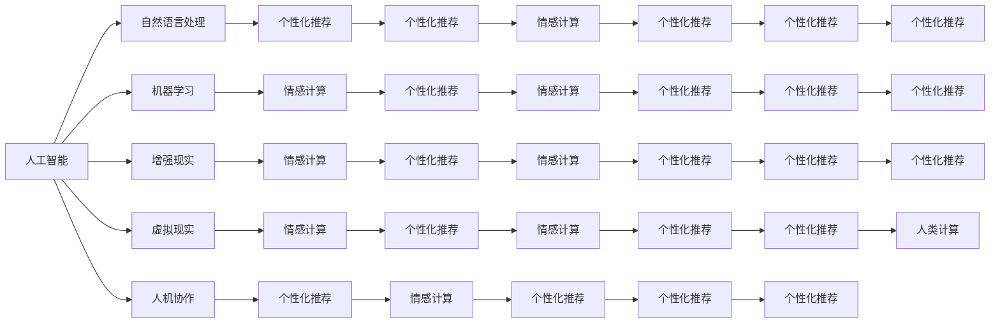

                 

## 1. 背景介绍

### 1.1 问题由来

随着人工智能(AI)技术的迅速发展，尤其是人类计算(Human-Computer Interaction, HCI)领域，逐渐成为商业创新的重要驱动力。如何利用AI技术，优化人类计算，提升用户体验，成为商业界关注的焦点。本文将从AI技术在人类计算中的应用前景出发，探讨AI驱动的创新趋势，预测其未来的发展路径。

### 1.2 问题核心关键点

AI在人类计算中的应用，主要集中在以下几个方面：

- **智能助理**：通过自然语言处理(NLP)和机器学习(ML)技术，为用户提供智能化的语音和文本交互，如Siri、Alexa、Google Assistant等。
- **增强现实(AR)和虚拟现实(VR)**：利用计算机视觉和机器感知技术，为用户提供沉浸式体验，如微软Hololens、Oculus Rift等。
- **人机协作**：通过AI技术，实现人与机器的高效协作，提升工作效率，如自动驾驶、智能制造等。
- **个性化推荐**：基于用户历史行为和偏好，提供个性化的产品和服务推荐，如Netflix推荐系统、亚马逊推荐引擎等。
- **情感计算**：通过分析用户的语音、表情、行为等，判断用户的情绪状态，提供更加人性化的服务，如情绪识别系统、情感聊天机器人等。

这些应用展示了AI技术在人类计算中的强大潜力，有望在商业创新中发挥关键作用。本文将重点讨论AI技术在这些领域中的实际应用，并预测其未来的发展趋势。

### 1.3 问题研究意义

AI驱动的创新，能够显著提升人类计算的效率和体验，推动各行各业的数字化转型。其研究意义在于：

1. **提升用户体验**：通过智能助理、AR/VR、情感计算等技术，提供更加个性化的服务，提升用户满意度。
2. **提高工作效率**：利用人机协作和自动化技术，减少人工操作，提升生产效率和业务流程优化。
3. **开拓新商业模式**：通过AI技术，探索新的服务模式和盈利方式，如智能推荐系统、虚拟体验店等。
4. **推动行业创新**：AI技术的不断进步，将驱动更多行业进行技术革新，形成新的产业链和生态圈。
5. **增强竞争力**：通过引入AI技术，企业能够提升自身的技术实力和市场竞争力，保持行业领先地位。

## 2. 核心概念与联系

### 2.1 核心概念概述

本节将介绍几个核心概念及其相互联系，以便更好地理解AI在人类计算中的应用：

- **人工智能(AI)**：指通过模拟人的智能行为，实现机器的自主学习、决策和推理能力。
- **人类计算(Human-Computer Interaction, HCI)**：指通过计算机技术与人的交互，提升人机交互的效率和体验。
- **自然语言处理(NLP)**：指通过计算机处理和理解人类语言的技术，实现语音识别、语义理解和自然语言生成。
- **机器学习(ML)**：指通过算法让计算机从数据中学习，提升模型的预测能力和泛化能力。
- **增强现实(AR)和虚拟现实(VR)**：利用计算机视觉和交互技术，创建沉浸式、交互式的体验。
- **人机协作**：指通过AI技术，实现人与机器的高效协同工作，提升工作效率。
- **个性化推荐**：利用用户行为数据，实现产品或服务的个性化推荐。
- **情感计算**：通过分析用户情感状态，提供更加人性化的服务和交互。

这些概念之间有着密切的联系，共同构成了AI在人类计算中的基本框架。下面通过一个Mermaid流程图展示这些概念之间的联系：



## 3. 核心算法原理 & 具体操作步骤

### 3.1 算法原理概述

AI在人类计算中的应用，主要依赖于一系列算法和技术。这些算法和技术可以通过以下步骤实现：

1. **数据采集与预处理**：通过传感器、用户输入等方式，收集用户数据，并进行清洗和标准化。
2. **特征提取与选择**：从原始数据中提取有用特征，并进行特征选择，用于后续建模。
3. **模型训练与优化**：使用机器学习算法，如决策树、神经网络、支持向量机等，对数据进行建模，并使用交叉验证等方法优化模型。
4. **模型评估与部署**：通过测试集对模型进行评估，并部署到实际应用中。

### 3.2 算法步骤详解

以下以自然语言处理(NLP)中的情感识别为例，详细说明AI技术在人类计算中的应用流程：

1. **数据采集**：从社交媒体、客服记录、用户评论等渠道，收集用户情感相关的文本数据。
2. **数据预处理**：对文本进行分词、去停用词、词性标注等预处理步骤，转化为模型可以处理的格式。
3. **特征提取**：使用词袋模型、TF-IDF等方法，提取文本特征向量。
4. **模型训练**：使用支持向量机、神经网络等算法，对特征向量进行建模，并使用交叉验证优化模型。
5. **模型评估**：在测试集上对模型进行评估，计算准确率、召回率等指标。
6. **模型部署**：将训练好的模型部署到实际应用中，如智能客服系统、情感聊天机器人等。

### 3.3 算法优缺点

AI技术在人类计算中的应用，具有以下优点和缺点：

**优点**：

- **提升用户体验**：通过智能助理、AR/VR、情感计算等技术，提供更加个性化的服务，提升用户满意度。
- **提高工作效率**：利用人机协作和自动化技术，减少人工操作，提升生产效率和业务流程优化。
- **开拓新商业模式**：通过AI技术，探索新的服务模式和盈利方式，如智能推荐系统、虚拟体验店等。
- **推动行业创新**：AI技术的不断进步，将驱动更多行业进行技术革新，形成新的产业链和生态圈。
- **增强竞争力**：通过引入AI技术，企业能够提升自身的技术实力和市场竞争力，保持行业领先地位。

**缺点**：

- **数据隐私问题**：用户数据的采集和处理，可能引发隐私泄露和数据安全问题。
- **模型复杂度高**：AI模型通常参数量庞大，训练和推理复杂度高，需要高性能计算资源。
- **模型可解释性差**：AI模型通常被认为是"黑盒"，难以解释其内部决策过程。
- **技术门槛高**：AI技术的开发和部署，需要较高的技术门槛和专业知识。

### 3.4 算法应用领域

AI技术在人类计算中的应用，已经覆盖了多个领域，以下是几个典型的应用领域：

1. **智能助理**：如Siri、Alexa、Google Assistant等，通过语音识别和自然语言处理，提供智能化的语音和文本交互。
2. **增强现实(AR)和虚拟现实(VR)**：如微软Hololens、Oculus Rift等，利用计算机视觉和交互技术，创建沉浸式、交互式的体验。
3. **人机协作**：如自动驾驶、智能制造等，通过AI技术，实现人与机器的高效协同工作，提升工作效率。
4. **个性化推荐**：如Netflix推荐系统、亚马逊推荐引擎等，利用用户行为数据，实现产品或服务的个性化推荐。
5. **情感计算**：如情绪识别系统、情感聊天机器人等，通过分析用户的语音、表情、行为等，判断用户的情绪状态，提供更加人性化的服务。

## 4. 数学模型和公式 & 详细讲解 & 举例说明

### 4.1 数学模型构建

为了更好地理解AI在人类计算中的应用，我们通过一个具体的案例——情感识别，来构建数学模型。假设我们有一组情感相关的文本数据 $D=\{(x_i, y_i)\}_{i=1}^N$，其中 $x_i$ 是文本，$y_i$ 是情感标签（如积极、中性、消极）。我们的目标是通过训练一个分类模型，将新的文本输入转换为对应的情感标签。

假设我们使用支持向量机(SVM)作为分类模型，其数学模型为：

$$
\min_{w, b, \xi} \frac{1}{2}w^Tw + C\sum_{i=1}^N \xi_i \quad s.t. \sum_{i=1}^N \alpha_i y_i (w^T \varphi(x_i) + b) \geq 1 - \varepsilon \\
0 \leq \alpha_i \leq C \\
\xi_i \geq 0
$$

其中 $w$ 是模型权重向量，$b$ 是偏置，$\xi_i$ 是松弛变量，$C$ 是正则化系数，$\varphi(x_i)$ 是特征映射函数，将原始文本映射到高维特征空间，$\varepsilon$ 是误差上界。

### 4.2 公式推导过程

在构建好数学模型后，我们需要求解模型参数。假设我们有一组特征向量 $\phi(x_i)$，通过求解下列优化问题，得到模型参数 $w$ 和 $b$：

$$
\min_{w, b} \frac{1}{2}w^Tw + C\sum_{i=1}^N \max(0, 1 - y_i(w^T \varphi(x_i) + b)) \\
0 \leq \alpha_i \leq C \\
\alpha_i y_i (w^T \varphi(x_i) + b) = 1
$$

通过求解上述优化问题，我们可以得到模型的预测函数：

$$
f(x) = \sum_{i=1}^N \alpha_i y_i \varphi(x_i)^T \varphi(x) + b
$$

将新的文本 $x$ 输入到预测函数中，可以得到其对应的情感标签。

### 4.3 案例分析与讲解

假设我们有一组标注好的情感文本数据，包含积极、中性、消极三种情感标签。我们通过支持向量机进行模型训练，并使用交叉验证优化模型参数。训练完成后，我们将新的文本输入到模型中进行情感识别，得到其情感标签。

## 5. 项目实践：代码实例和详细解释说明

### 5.1 开发环境搭建

在进行AI技术应用开发前，我们需要准备好开发环境。以下是使用Python进行TensorFlow开发的环境配置流程：

1. 安装Anaconda：从官网下载并安装Anaconda，用于创建独立的Python环境。

2. 创建并激活虚拟环境：
```bash
conda create -n tf-env python=3.8 
conda activate tf-env
```

3. 安装TensorFlow：根据CUDA版本，从官网获取对应的安装命令。例如：
```bash
pip install tensorflow==2.x
```

4. 安装Scikit-Learn、Pandas等工具包：
```bash
pip install scikit-learn pandas numpy
```

5. 安装TensorBoard：TensorFlow配套的可视化工具，实时监测模型训练状态，并提供丰富的图表呈现方式。

```bash
pip install tensorboard
```

6. 安装Jupyter Notebook：用于编写和执行Python代码，支持代码块的快速编辑和执行。

```bash
pip install jupyter notebook
```

完成上述步骤后，即可在`tf-env`环境中开始AI技术应用开发。

### 5.2 源代码详细实现

以下是一个简单的情感识别模型实现代码，包括数据处理、模型训练和预测：

```python
import tensorflow as tf
import numpy as np
from sklearn.feature_extraction.text import TfidfVectorizer
from sklearn.model_selection import train_test_split
from sklearn.metrics import accuracy_score

# 加载数据
data = load_data()

# 数据预处理
vectorizer = TfidfVectorizer(stop_words='english')
X = vectorizer.fit_transform(data['text'])
y = data['label']

# 划分训练集和测试集
X_train, X_test, y_train, y_test = train_test_split(X, y, test_size=0.2, random_state=42)

# 构建模型
model = tf.keras.Sequential([
    tf.keras.layers.Dense(128, activation='relu', input_shape=(X_train.shape[1],)),
    tf.keras.layers.Dense(1, activation='sigmoid')
])

# 编译模型
model.compile(optimizer='adam', loss='binary_crossentropy', metrics=['accuracy'])

# 训练模型
model.fit(X_train, y_train, epochs=10, batch_size=32, validation_data=(X_test, y_test))

# 预测新文本的情感标签
new_text = ["This movie is amazing!"]
new_X = vectorizer.transform(new_text)
predictions = model.predict(new_X)
print(predictions)
```

### 5.3 代码解读与分析

**数据加载与预处理**：

1. 加载数据：使用`load_data()`函数加载情感文本数据，并将其分为文本和标签两部分。
2. 数据预处理：使用`TfidfVectorizer`将文本转换为特征向量，并进行标准化处理。

**模型构建与训练**：

1. 模型构建：使用`Sequential`构建一个简单的神经网络模型，包含一个全连接层和一个输出层。
2. 模型编译：使用`compile()`函数指定优化器、损失函数和评估指标。
3. 模型训练：使用`fit()`函数训练模型，并指定训练轮数、批大小等参数。

**模型预测**：

1. 加载新文本：使用`vectorizer.transform()`将新文本转换为特征向量。
2. 模型预测：使用`predict()`函数对新文本进行情感识别，输出预测结果。

## 6. 实际应用场景

### 6.1 智能助理

智能助理技术在商业中的应用非常广泛。通过AI技术，智能助理可以提供智能化的语音和文本交互，提升用户体验。例如，亚马逊的Alexa可以通过语音命令控制智能家居设备，Apple的Siri可以回答问题、设置提醒等。

### 6.2 增强现实(AR)和虚拟现实(VR)

AR和VR技术在游戏、教育、医疗等多个领域有广泛应用。通过AI技术，AR和VR系统可以提供更加真实、沉浸的体验。例如，微软的Hololens可以用于教育培训、医疗诊断等场景，增强用户的感知体验。

### 6.3 人机协作

人机协作技术在生产制造、物流配送等场景中具有重要应用。通过AI技术，人机协作系统可以实现自动化操作，提高生产效率和精确度。例如，特斯拉的自动驾驶系统可以实现高度自主的驾驶，提高行车安全。

### 6.4 个性化推荐

个性化推荐系统在电商、娱乐等多个领域有广泛应用。通过AI技术，推荐系统可以提供更加精准、个性化的推荐内容。例如，亚马逊的推荐系统可以根据用户浏览历史和购买记录，推荐相关商品。

### 6.5 情感计算

情感计算技术在客户服务、社交媒体等多个场景中具有重要应用。通过AI技术，情感计算系统可以分析用户的情感状态，提供更加人性化的服务。例如，情感聊天机器人可以用于客服服务、心理咨询等场景。

## 7. 工具和资源推荐

### 7.1 学习资源推荐

为了帮助开发者系统掌握AI技术在人类计算中的应用，这里推荐一些优质的学习资源：

1. **《Python深度学习》**：Ian Goodfellow、Yoshua Bengio和Aaron Courville合著的深度学习经典教材，系统介绍了深度学习的基本概念和算法。
2. **TensorFlow官方文档**：TensorFlow的官方文档，提供了丰富的API文档和代码示例，适合快速上手学习。
3. **PyTorch官方文档**：PyTorch的官方文档，提供了详细的API文档和教程，适合深度学习初学者。
4. **Coursera深度学习课程**：由吴恩达教授主讲的深度学习课程，涵盖了深度学习的基本概念和算法，适合入门学习。
5. **Kaggle竞赛平台**：Kaggle是全球最大的数据科学竞赛平台，提供丰富的数据集和模型代码，适合实战练习。

### 7.2 开发工具推荐

高效的开发离不开优秀的工具支持。以下是几款用于AI技术应用开发的常用工具：

1. **Jupyter Notebook**：用于编写和执行Python代码，支持代码块的快速编辑和执行。
2. **TensorBoard**：TensorFlow配套的可视化工具，实时监测模型训练状态，并提供丰富的图表呈现方式。
3. **Keras**：Keras是一个高级神经网络API，可以运行在TensorFlow、Theano和CNTK之上，适合快速搭建深度学习模型。
4. **PyTorch**：PyTorch是一个动态计算图深度学习框架，具有强大的GPU加速能力和灵活的编程接口。
5. **Scikit-Learn**：Scikit-Learn是一个Python机器学习库，提供了丰富的算法和工具，适合快速实现机器学习模型。

### 7.3 相关论文推荐

AI技术在人类计算中的应用，源于学界的持续研究。以下是几篇奠基性的相关论文，推荐阅读：

1. **《深度学习》**：Ian Goodfellow、Yoshua Bengio和Aaron Courville合著的深度学习经典教材，详细介绍了深度学习的基本概念和算法。
2. **《自然语言处理综论》**：Daniel Jurafsky和James H. Martin合著的自然语言处理经典教材，介绍了自然语言处理的基本概念和算法。
3. **《机器人学导论》**：Oriol Koppens、Joris Verreuw和Ian O. Collins合著的机器人学经典教材，介绍了机器人学的基础理论和应用。
4. **《增强现实技术》**：John C. Russell和Don Fussell合著的增强现实技术经典教材，介绍了增强现实技术的基本概念和应用。
5. **《情感计算》**：Joseph E. Penney和Katie H. Ashwoth合著的情感计算经典教材，介绍了情感计算的基本概念和算法。

这些论文代表了AI技术在人类计算中的应用方向，通过学习这些前沿成果，可以帮助研究者把握学科前进方向，激发更多的创新灵感。

## 8. 总结：未来发展趋势与挑战

### 8.1 总结

本文对AI技术在人类计算中的应用进行了全面系统的介绍。首先阐述了AI技术在人类计算中的广泛应用，明确了其在提升用户体验、提高工作效率、开拓新商业模式等方面的独特价值。其次，从算法原理到项目实践，详细讲解了情感识别等AI技术的具体实现过程。最后，本文预测了AI技术在未来商业创新中的发展趋势，指出了其面临的挑战和未来的研究展望。

通过本文的系统梳理，可以看到，AI技术在人类计算中的强大潜力，有望在商业创新中发挥关键作用。未来，伴随AI技术的不断进步，人类计算领域将迎来更多的创新和变革。

### 8.2 未来发展趋势

展望未来，AI技术在人类计算中的应用将呈现以下几个发展趋势：

1. **更加智能化**：AI技术将更加智能化，具备更强的自主决策能力和适应能力，提供更加个性化的服务。
2. **更加普及化**：AI技术将逐渐普及到各个领域，成为各行各业的重要工具，推动数字化转型。
3. **更加集成化**：AI技术将与其他技术进行深度集成，形成新的解决方案和产品。
4. **更加人性化**：AI技术将更加注重用户体验，提供更加自然、人性化的交互体验。
5. **更加安全可靠**：AI技术将更加注重数据隐私和安全，提供更加可信的服务。

以上趋势凸显了AI技术在人类计算中的广阔前景，未来将继续推动各行各业的创新和变革。

### 8.3 面临的挑战

尽管AI技术在人类计算中的应用前景广阔，但在实际应用中仍面临诸多挑战：

1. **数据隐私问题**：用户数据的采集和处理，可能引发隐私泄露和数据安全问题。
2. **模型复杂度高**：AI模型通常参数量庞大，训练和推理复杂度高，需要高性能计算资源。
3. **模型可解释性差**：AI模型通常被认为是"黑盒"，难以解释其内部决策过程。
4. **技术门槛高**：AI技术的开发和部署，需要较高的技术门槛和专业知识。
5. **伦理和社会问题**：AI技术可能引发伦理和社会问题，如就业替代、社会不公等。

这些挑战需要全社会共同努力，通过技术创新、法规规范、伦理引导等多方面协同，才能克服困难，推动AI技术在人类计算中的应用。

### 8.4 研究展望

面对AI技术在人类计算中的应用，未来的研究需要在以下几个方面寻求新的突破：

1. **隐私保护技术**：研究更加隐私友好的数据采集和处理技术，保障用户数据的安全。
2. **轻量级模型**：研究更加轻量级的模型架构和优化算法，降低计算资源消耗。
3. **模型可解释性**：研究更加可解释的AI模型，提高模型的透明度和可信度。
4. **跨领域融合**：研究AI技术与跨领域技术的深度融合，形成新的解决方案。
5. **伦理和社会规范**：研究AI技术的伦理和社会影响，制定相关规范和标准，确保技术应用的安全和公平。

这些研究方向的探索，必将引领AI技术在人类计算中的应用走向成熟，为构建更加智能、安全、公平的商业环境提供技术保障。

## 9. 附录：常见问题与解答

**Q1: AI技术在人类计算中的应用前景如何？**

A: AI技术在人类计算中的应用前景非常广阔。通过AI技术，我们可以实现智能助理、增强现实、人机协作、个性化推荐和情感计算等功能，提升用户体验和工作效率。未来，AI技术将继续推动各行各业的数字化转型，成为商业创新的重要驱动力。

**Q2: 如何构建高效的情感识别模型？**

A: 构建高效的情感识别模型，需要从数据采集、预处理、模型选择和训练等方面进行全面优化。具体步骤如下：

1. 数据采集：收集情感相关的文本数据，并进行标注。
2. 数据预处理：使用TF-IDF等方法，将文本转换为特征向量。
3. 模型选择：选择合适的机器学习算法，如支持向量机、神经网络等。
4. 模型训练：使用交叉验证等方法优化模型参数，确保模型泛化能力。
5. 模型评估：在测试集上评估模型性能，调整模型参数，提升模型精度。

**Q3: AI技术在应用过程中如何保障数据隐私？**

A: 保障数据隐私是AI技术应用的重要挑战之一。以下是几种常见的方法：

1. 数据匿名化：对敏感数据进行匿名化处理，防止用户隐私泄露。
2. 数据加密：使用加密技术，保护数据在传输和存储过程中的安全性。
3. 差分隐私：通过在数据中引入噪声，保护个体隐私，同时保证数据的统计性质。
4. 访问控制：对数据进行严格访问控制，确保只有授权用户可以访问敏感数据。

通过以上方法，可以有效保障数据隐私，确保AI技术在应用中的安全性。

**Q4: AI技术在商业创新中的优势和劣势是什么？**

A: AI技术在商业创新中的优势包括：

1. 提升用户体验：通过智能助理、AR/VR、情感计算等技术，提供更加个性化的服务。
2. 提高工作效率：利用人机协作和自动化技术，减少人工操作，提升生产效率和业务流程优化。
3. 开拓新商业模式：通过AI技术，探索新的服务模式和盈利方式。
4. 推动行业创新：AI技术的不断进步，将驱动更多行业进行技术革新。
5. 增强竞争力：通过引入AI技术，企业能够提升自身的技术实力和市场竞争力。

劣势包括：

1. 数据隐私问题：用户数据的采集和处理，可能引发隐私泄露和数据安全问题。
2. 模型复杂度高：AI模型通常参数量庞大，训练和推理复杂度高，需要高性能计算资源。
3. 模型可解释性差：AI模型通常被认为是"黑盒"，难以解释其内部决策过程。
4. 技术门槛高：AI技术的开发和部署，需要较高的技术门槛和专业知识。

通过全面考虑AI技术在商业创新中的优势和劣势，可以有效规避风险，发挥其最大的潜力。

**Q5: AI技术在商业创新中的未来发展方向是什么？**

A: AI技术在商业创新中的未来发展方向包括：

1. 更加智能化：AI技术将更加智能化，具备更强的自主决策能力和适应能力。
2. 更加普及化：AI技术将逐渐普及到各个领域，成为各行各业的重要工具。
3. 更加集成化：AI技术将与其他技术进行深度集成，形成新的解决方案和产品。
4. 更加人性化：AI技术将更加注重用户体验，提供更加自然、人性化的交互体验。
5. 更加安全可靠：AI技术将更加注重数据隐私和安全，提供更加可信的服务。

通过以上方向，AI技术将继续推动各行各业的创新和变革，为商业创新注入新的动力。

---

作者：禅与计算机程序设计艺术 / Zen and the Art of Computer Programming

