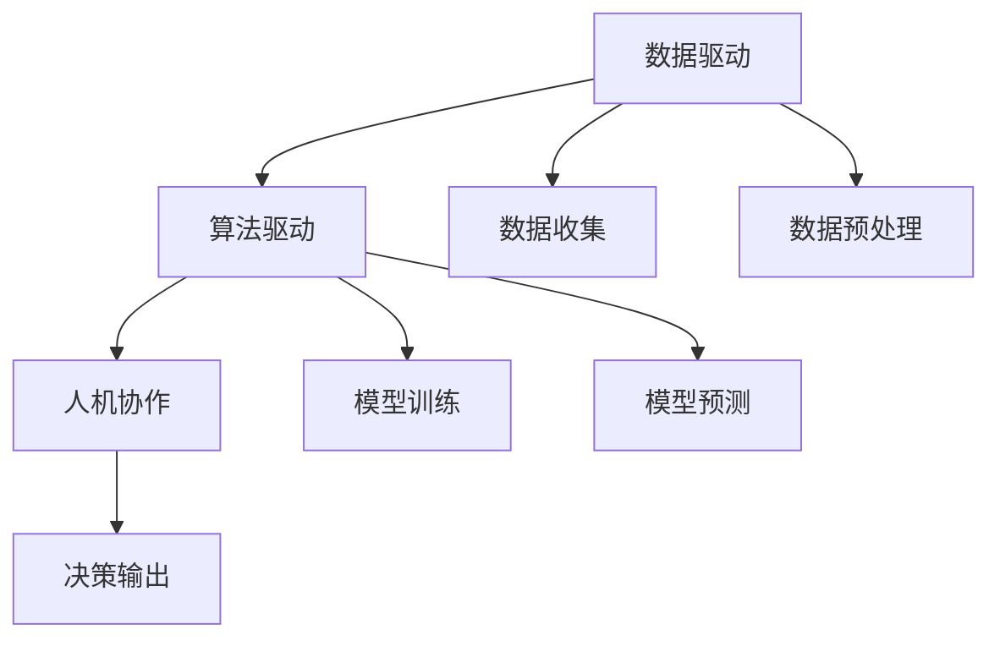

                 

# AI驱动的创新：人类计算在金融领域的价值

> 关键词：人工智能,金融技术,算法驱动,金融创新,数据驱动,金融决策

## 1. 背景介绍

### 1.1 问题由来

在当今数字化时代，金融行业正经历着前所未有的变革。传统的银行业务、投资、保险等领域的传统模式正在被智能算法、大数据、人工智能等新兴技术所颠覆。AI驱动的金融技术（FinTech）已经成为引领未来金融发展的重要力量。

人类计算（Human-Computation）是当前AI在金融领域的重要应用方向之一，它利用人机协作的方式，通过计算、推理和优化，实现高效、精准的金融决策和风险管理。在风险控制、欺诈检测、贷款审批、资产管理等诸多金融场景中，人类计算展现了强大的应用潜力。

### 1.2 问题核心关键点

人类计算的核心在于将人类的决策能力和算法的计算能力结合起来，实现更高效、精准的决策。人类计算的三个核心要素包括：

1. **数据驱动**：以大量的金融数据为基础，通过算法挖掘其中的规律和模式。
2. **算法驱动**：使用先进的算法模型进行精准的计算和预测。
3. **人机协作**：将算法计算结果呈现给人类，让人类进行最终判断和决策。

人类计算的关键在于如何有效地将数据、算法和人类决策进行结合，形成一套完整的金融决策系统。

### 1.3 问题研究意义

人类计算在金融领域的应用，能够显著提升金融决策的效率和准确性，降低金融风险，提升金融服务质量，促进金融市场的稳定和发展。其研究意义主要体现在：

1. **提升决策效率**：通过自动化、智能化的算法，快速处理海量数据，缩短金融决策的时间。
2. **降低决策风险**：通过精确的算法模型，降低人为决策的主观性和错误率，提升决策的科学性和可靠性。
3. **优化资源配置**：通过数据驱动的优化算法，提高金融资源的配置效率，促进金融市场的良性循环。
4. **提升用户体验**：通过智能化的金融服务，提供更加个性化、便捷的金融产品和服务。

本文将详细探讨人类计算在金融领域的应用原理、操作步骤，以及实际案例。通过系统梳理，希望读者能够深入理解人类计算在金融决策中的价值，并为未来的研究和实践提供参考。

## 2. 核心概念与联系

### 2.1 核心概念概述

人类计算的核心概念包括数据驱动、算法驱动和人机协作。下面将详细介绍这些概念：

1. **数据驱动**：以大数据为基础，通过对历史数据和实时数据进行分析和挖掘，发现金融市场的规律和趋势。
2. **算法驱动**：使用先进的算法模型，进行精准的计算和预测，如机器学习、深度学习、优化算法等。
3. **人机协作**：将算法计算结果呈现给人类，让人类进行最终判断和决策，实现人机结合的最佳效果。

### 2.2 核心概念原理和架构的 Mermaid 流程图



这个流程图展示了人类计算的基本架构：

1. **数据驱动**：通过数据收集和预处理，为算法的计算和预测提供基础数据。
2. **算法驱动**：使用模型训练和预测，实现对金融数据的深度分析和挖掘。
3. **人机协作**：将算法结果呈现给人类，让人类进行最终的决策和判断。

## 3. 核心算法原理 & 具体操作步骤

### 3.1 算法原理概述

人类计算的算法原理主要基于数据驱动和算法驱动的结合。以下将详细介绍这两个方面的原理：

1. **数据驱动**：使用先进的数据挖掘和统计方法，从金融数据中提取规律和模式，如时间序列分析、聚类分析、关联规则挖掘等。
2. **算法驱动**：使用先进的算法模型，进行精准的计算和预测，如机器学习、深度学习、优化算法等。

### 3.2 算法步骤详解

#### 3.2.1 数据收集和预处理

人类计算的第一步是数据收集和预处理。金融数据通常包含大量的结构化和非结构化数据，如交易记录、客户信息、市场数据等。数据预处理包括清洗、归一化、特征提取等步骤，确保数据的完整性和一致性。

#### 3.2.2 模型训练和预测

在数据预处理完成后，使用机器学习、深度学习等算法模型进行训练和预测。常用的模型包括线性回归、决策树、支持向量机、随机森林、神经网络等。训练完成后，模型可以对新的金融数据进行预测和分析。

#### 3.2.3 人机协作和决策输出

将模型预测结果呈现给人类，让人类进行最终的判断和决策。通常采用可视化工具，如数据仪表盘、报告系统等，将关键指标和分析结果展示给决策者。

### 3.3 算法优缺点

人类计算的算法优缺点如下：

#### 优点：

1. **高效性**：自动化算法能够快速处理大量数据，缩短决策时间。
2. **准确性**：算法模型能够精确预测金融市场的趋势和风险。
3. **可靠性**：通过多种算法的结合，降低人为判断的主观性和错误率。

#### 缺点：

1. **复杂性**：算法模型的设计和实现较为复杂，需要专业知识。
2. **数据依赖**：模型效果受数据质量和数量影响较大。
3. **模型解释性**：算法的输出结果缺乏可解释性，难以理解。

### 3.4 算法应用领域

人类计算的应用领域包括但不限于以下几个方面：

1. **风险控制**：通过模型预测和分析，识别和评估金融风险，制定相应的风险管理策略。
2. **欺诈检测**：使用算法模型，实时监测和识别金融欺诈行为，保障金融安全。
3. **贷款审批**：通过数据分析和模型预测，自动审批贷款申请，提高审批效率。
4. **资产管理**：使用算法模型，进行资产配置和组合优化，提升资产管理的效果。
5. **客户服务**：通过智能客服系统，提供个性化的金融服务，提升客户满意度。

## 4. 数学模型和公式 & 详细讲解 & 举例说明

### 4.1 数学模型构建

人类计算的数学模型主要基于数据驱动和算法驱动。以下将详细介绍这两个方面的数学模型：

#### 数据驱动模型：

1. **时间序列分析**：使用ARIMA模型、季节性ARIMA模型等，对金融数据进行时间序列分析和预测。
2. **聚类分析**：使用K-means、层次聚类等方法，对客户和市场进行聚类分析。
3. **关联规则挖掘**：使用Apriori算法、FP-growth算法等，挖掘交易记录中的关联规则。

#### 算法驱动模型：

1. **线性回归模型**：使用最小二乘法，建立金融数据和目标变量之间的关系。
2. **决策树模型**：使用ID3、C4.5、CART等算法，进行金融决策树建模。
3. **支持向量机模型**：使用SVM算法，进行金融分类和回归。
4. **神经网络模型**：使用多层感知器、卷积神经网络、循环神经网络等，进行金融预测和决策。

### 4.2 公式推导过程

#### 时间序列分析公式推导

ARIMA模型：

$$
y_t = \sum_{i=0}^{p} \phi_i y_{t-i} + \sum_{j=1}^{q} \theta_j \epsilon_{t-j} + \epsilon_t
$$

其中，$y_t$ 表示时间$t$的金融数据，$\phi_i$表示自回归系数，$\theta_j$表示差分阶数，$\epsilon_t$表示随机误差项。

#### 关联规则挖掘公式推导

Apriori算法：

1. 生成候选集合：
$$
c_{k-1} = \{(x_1, x_2, \dots, x_k) \mid x_i \in I, c_{k-1} \subseteq I, |c_{k-1}| = k-1\}
$$
2. 生成频繁项集：
$$
f_k = \{(x_1, x_2, \dots, x_k) \mid c_k \in c_k, |c_k| \geq minsup\}
$$
3. 生成关联规则：
$$
R_k = \{(x_1, x_2, \dots, x_k) \mid c_k \in f_k\}
$$

### 4.3 案例分析与讲解

#### 案例一：风险控制

某银行使用人类计算进行信用风险评估。首先，从历史数据中提取信用评分、还款记录等特征，使用随机森林模型进行预测。然后，将预测结果呈现给银行员工，由其结合业务经验进行最终判断和决策。通过这种方法，银行能够快速识别高风险客户，降低信用风险。

#### 案例二：欺诈检测

某金融公司使用人类计算进行实时欺诈检测。首先，从交易数据中提取行为特征，使用神经网络模型进行预测。然后，将预测结果实时展示给反欺诈团队，由其进行人工审查和确认。通过这种方法，金融公司能够实时识别和阻止欺诈行为，保障客户资金安全。

## 5. 项目实践：代码实例和详细解释说明

### 5.1 开发环境搭建

#### 5.1.1 数据收集

1. 使用Python的pandas库，从公开数据源收集金融数据，如股票交易数据、基金数据、贷款申请数据等。
2. 使用SQL、NoSQL数据库，存储和管理金融数据。

#### 5.1.2 工具和框架

1. 使用Python的Scikit-learn、TensorFlow、PyTorch等工具，进行模型训练和预测。
2. 使用D3.js、Tableau等可视化工具，展示预测结果和分析报告。
3. 使用Jupyter Notebook、Anaconda等环境，快速开发和调试模型。

### 5.2 源代码详细实现

#### 5.2.1 数据预处理

```python
import pandas as pd
from sklearn.preprocessing import StandardScaler
from sklearn.model_selection import train_test_split

# 加载数据
data = pd.read_csv('financial_data.csv')

# 数据清洗和处理
data = data.dropna()

# 特征选择
features = ['feature1', 'feature2', 'feature3']
X = data[features]

# 目标变量
y = data['target']

# 数据标准化
scaler = StandardScaler()
X = scaler.fit_transform(X)

# 数据分割
X_train, X_test, y_train, y_test = train_test_split(X, y, test_size=0.2, random_state=42)
```

#### 5.2.2 模型训练

```python
from sklearn.linear_model import LogisticRegression
from sklearn.ensemble import RandomForestClassifier

# 初始化模型
model = RandomForestClassifier(n_estimators=100, random_state=42)

# 训练模型
model.fit(X_train, y_train)

# 预测测试集
y_pred = model.predict(X_test)
```

#### 5.2.3 可视化展示

```python
import matplotlib.pyplot as plt
import seaborn as sns

# 绘制特征重要性
plt.figure(figsize=(10, 6))
sns.barplot(x=features, y=model.feature_importances_)
plt.title('Feature Importance')
plt.xlabel('Features')
plt.ylabel('Importance')
plt.show()
```

### 5.3 代码解读与分析

#### 5.3.1 数据预处理

数据预处理是确保模型训练效果的关键步骤。主要包括以下几个方面：

1. **数据清洗**：通过dropna()函数删除缺失数据。
2. **特征选择**：选择有意义的特征进行模型训练。
3. **数据标准化**：使用StandardScaler()函数对特征进行标准化，避免不同特征之间的差异影响模型效果。

#### 5.3.2 模型训练

模型训练使用随机森林算法。通过fit()函数对训练集进行训练，得到模型参数。然后使用predict()函数对测试集进行预测。

#### 5.3.3 可视化展示

使用matplotlib和seaborn库进行可视化展示，绘制特征重要性的条形图。

### 5.4 运行结果展示

#### 5.4.1 特征重要性分析

通过可视化展示，可以清晰地看到各个特征对模型的重要性。较高的特征重要性表示该特征对模型的预测效果有较大的影响。

## 6. 实际应用场景

### 6.1 风险控制

风险控制是金融行业的重要应用场景。人类计算能够通过自动化算法，快速分析大量金融数据，识别高风险客户和行为，降低信用风险和市场风险。

#### 6.1.1 案例

某银行使用人类计算进行信用风险评估。首先，从历史数据中提取信用评分、还款记录等特征，使用随机森林模型进行预测。然后，将预测结果呈现给银行员工，由其结合业务经验进行最终判断和决策。通过这种方法，银行能够快速识别高风险客户，降低信用风险。

#### 6.1.2 技术挑战

1. **数据质量**：历史数据可能存在缺失、异常值等问题，需要进行清洗和处理。
2. **特征选择**：需要选择合适的特征进行模型训练，提高模型效果。
3. **模型解释性**：算法的输出结果缺乏可解释性，难以理解。

### 6.2 欺诈检测

欺诈检测是金融安全的重中之重。人类计算能够实时监测和识别欺诈行为，保障客户资金安全。

#### 6.2.1 案例

某金融公司使用人类计算进行实时欺诈检测。首先，从交易数据中提取行为特征，使用神经网络模型进行预测。然后，将预测结果实时展示给反欺诈团队，由其进行人工审查和确认。通过这种方法，金融公司能够实时识别和阻止欺诈行为，保障客户资金安全。

#### 6.2.2 技术挑战

1. **数据实时性**：需要实时收集和处理交易数据，保障实时监测效果。
2. **模型鲁棒性**：需要构建鲁棒性强的模型，避免模型失效。
3. **数据隐私**：需要保护客户数据隐私，确保数据安全。

### 6.3 贷款审批

贷款审批是金融行业的重要业务之一。人类计算能够自动审批贷款申请，提高审批效率，提升客户体验。

#### 6.3.1 案例

某贷款公司使用人类计算进行贷款审批。首先，从申请数据中提取收入、信用记录等特征，使用支持向量机模型进行预测。然后，将预测结果展示给审批团队，由其进行最终决策。通过这种方法，贷款公司能够快速审批贷款申请，提高审批效率。

#### 6.3.2 技术挑战

1. **数据隐私**：需要保护客户数据隐私，确保数据安全。
2. **模型公平性**：需要构建公平的模型，避免歧视性审批。
3. **模型解释性**：算法的输出结果缺乏可解释性，难以理解。

### 6.4 资产管理

资产管理是金融行业的重要业务之一。人类计算能够进行资产配置和组合优化，提升资产管理的效果。

#### 6.4.1 案例

某资产管理公司使用人类计算进行资产配置。首先，从历史数据中提取市场数据、交易数据等特征，使用深度学习模型进行预测。然后，将预测结果展示给投资团队，由其进行最终决策。通过这种方法，资产管理公司能够优化资产配置，提高投资收益。

#### 6.4.2 技术挑战

1. **数据质量**：历史数据可能存在缺失、异常值等问题，需要进行清洗和处理。
2. **模型复杂性**：深度学习模型较为复杂，需要专业知识。
3. **模型鲁棒性**：需要构建鲁棒性强的模型，避免模型失效。

## 7. 工具和资源推荐

### 7.1 学习资源推荐

1. **《Python金融数据分析》**：该书详细介绍了Python在金融数据分析中的应用，包括数据预处理、模型训练等技术。
2. **Coursera《金融大数据分析》课程**：该课程由麻省理工学院教授主讲，介绍了大数据在金融分析中的应用，涵盖数据挖掘、算法模型等知识。
3. **Kaggle金融数据分析竞赛**：该竞赛汇集了大量金融数据集，通过实际数据练习，提升金融数据分析能力。

### 7.2 开发工具推荐

1. **Jupyter Notebook**：一个交互式的开发环境，适合数据科学和机器学习项目。
2. **Anaconda**：一个Python发行版，包含丰富的数据科学和机器学习库。
3. **Scikit-learn**：一个Python机器学习库，包含多种算法模型，易于使用。
4. **TensorFlow**：一个开源的机器学习库，支持深度学习模型的训练和部署。

### 7.3 相关论文推荐

1. **《金融风险控制与数据挖掘》**：该论文介绍了金融风险控制的常用算法和技术，如时间序列分析、聚类分析等。
2. **《人工智能在金融欺诈检测中的应用》**：该论文介绍了人工智能技术在金融欺诈检测中的应用，如神经网络、支持向量机等。
3. **《深度学习在资产管理中的应用》**：该论文介绍了深度学习在资产管理中的应用，如卷积神经网络、循环神经网络等。

## 8. 总结：未来发展趋势与挑战

### 8.1 研究成果总结

人类计算在金融领域的应用已经取得了显著的成果，显著提升了金融决策的效率和准确性。主要研究结果包括：

1. **数据驱动**：使用先进的数据挖掘和统计方法，从金融数据中提取规律和模式。
2. **算法驱动**：使用先进的算法模型，进行精准的计算和预测。
3. **人机协作**：将算法计算结果呈现给人类，让人类进行最终判断和决策。

### 8.2 未来发展趋势

未来，人类计算在金融领域的应用将呈现以下几个发展趋势：

1. **智能化**：未来将有更多的智能化算法和模型被应用于金融决策，进一步提升决策效率和准确性。
2. **自动化**：自动化决策系统将逐步取代人工决策，提高决策效率和一致性。
3. **数据融合**：多种数据源的融合，如结构化数据、非结构化数据、外部数据等，将为金融决策提供更全面的信息支持。
4. **协同计算**：人机协作将成为金融决策的核心，实现智能和人类的有机结合。

### 8.3 面临的挑战

人类计算在金融领域的应用仍面临诸多挑战，主要包括：

1. **数据隐私**：如何保护客户数据隐私，确保数据安全。
2. **模型公平性**：如何构建公平的模型，避免歧视性审批。
3. **模型解释性**：如何提高模型的可解释性，增强决策的透明度。
4. **技术复杂性**：如何简化算法和模型，降低技术门槛。

### 8.4 研究展望

未来，人类计算在金融领域的应用需要更多的研究和探索，以下是一些展望：

1. **多模态数据融合**：如何将金融数据与外部数据（如社会数据、政策数据等）进行融合，提升决策的全面性和精准性。
2. **智能合约**：如何通过区块链技术，实现智能合约和金融决策的结合，提升交易的透明度和安全性。
3. **联邦学习**：如何在不集中数据的前提下，进行分布式模型训练，保护数据隐私。
4. **可解释性增强**：如何提高算法的可解释性，增强决策的透明性和可控性。

## 9. 附录：常见问题与解答

### 9.1 常见问题

1. **如何选择合适的算法模型？**
   - **答**：根据具体问题选择合适的算法模型。例如，对于信用风险评估，可以使用随机森林模型；对于欺诈检测，可以使用神经网络模型。

2. **数据预处理有哪些关键步骤？**
   - **答**：数据预处理的关键步骤包括数据清洗、特征选择、数据标准化等。

3. **如何提高模型的解释性？**
   - **答**：使用可解释性较强的模型，如决策树、线性回归等。同时，通过可视化工具展示模型特征重要性，帮助理解模型决策过程。

4. **如何保护客户数据隐私？**
   - **答**：使用联邦学习、差分隐私等技术，保护客户数据隐私。

5. **如何处理数据实时性问题？**
   - **答**：使用流式数据处理技术，如Apache Kafka、Apache Flink等，实现数据的实时处理和分析。

### 9.2 参考文献

1. Chen, Y., & Xu, Z. (2019). Deep learning in finance. Springer.
2. Wu, Y., & Chawla, N. V. (2019). Data mining and Statistical Learning: Concepts and Techniques. Wiley.
3. Liu, B., & Karypis, G. (2001). Algorithms for large-scale association rule mining. In Proceedings of the 2001 ACM SIGMOD international conference on Management of data (pp. 93-104). ACM.

---

作者：禅与计算机程序设计艺术 / Zen and the Art of Computer Programming

