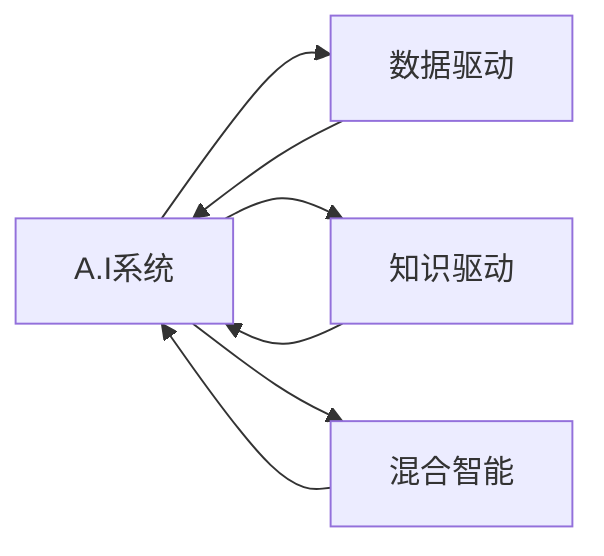

                 

# AI驱动的创新：利用人类计算的力量

## 1. 背景介绍

### 1.1 问题由来

随着人工智能(AI)技术的迅猛发展，人们开始思考如何更高效地利用人类的计算能力，以促进AI的进步。当前，AI系统普遍依赖于大量的数据和计算资源，而这些资源通常由专业的数据工程师和计算机科学家管理。如何更好地整合人类的智慧和计算资源，以加速AI的创新和应用，成为本领域亟需探讨的问题。

### 1.2 问题核心关键点

要回答这个问题，我们需要关注以下几个关键点：

1. **人类计算的优势**：理解人类计算的特点和优势，包括认知能力、创造力和问题解决能力等。
2. **AI与人类计算的融合**：探讨如何将AI技术与人类计算结合起来，利用AI的高效计算和数据处理能力，以及人类智慧的创造力和判断力。
3. **AI系统的设计原则**：提出设计原则，确保AI系统能够充分利用人类计算的资源和优势，同时保持其高效性和可靠性。

### 1.3 问题研究意义

探索利用人类计算力量推动AI创新的方法，对于提升AI系统的性能和应用范围，加速AI技术的产业化进程，具有重要意义：

1. **降低开发成本**：通过整合人类智慧，减少对专业数据和计算资源的需求，降低开发和维护成本。
2. **提升系统性能**：利用人类计算的灵活性和创造力，提高AI系统在复杂场景中的适应性和性能。
3. **加速应用落地**：加快AI技术在教育、医疗、金融等领域的部署和应用，推动社会各行业的数字化转型。
4. **促进创新发展**：激励AI领域的创新，推动新的应用场景和技术的产生，促进经济和社会的全面发展。

## 2. 核心概念与联系

### 2.1 核心概念概述

为了深入理解如何利用人类计算力量推动AI创新，我们需要掌握几个关键概念：

- **AI系统**：指能够执行特定任务或解决问题的计算机程序，包括机器学习、深度学习、自然语言处理等技术。
- **人类计算**：指通过人类的智慧和判断，对问题进行分析和解决的过程。
- **数据驱动的AI**：指利用大量数据进行模型训练和优化的AI系统，其核心在于数据的质量和数量。
- **知识驱动的AI**：指结合人类专家知识，通过规则、符号推理等方法构建的AI系统，其核心在于知识的获取和应用。
- **混合智能**：指AI系统和人类计算能力的结合，通过分工协作，实现高效、灵活的智能系统。

这些概念之间的关系可以通过以下Mermaid流程图来展示：



这个流程图展示了AI系统的构建过程：通过数据驱动和知识驱动的方式，结合人类计算能力，构建混合智能系统。

## 3. 核心算法原理 & 具体操作步骤
### 3.1 算法原理概述

利用人类计算力量推动AI创新的关键在于设计一种算法，该算法能够将人类的智慧和判断力整合到AI系统中，同时保持系统的高效性和可靠性。具体来说，这种算法需要考虑以下几个方面：

1. **数据预处理**：对输入数据进行清洗、筛选和转换，确保数据的质量和可用性。
2. **特征工程**：提取和构建数据特征，使其更适合AI模型的训练和优化。
3. **模型训练**：通过AI算法对数据进行建模，训练出具有较高泛化能力的模型。
4. **结果验证**：对模型进行测试和评估，确保其准确性和可靠性。
5. **反馈迭代**：根据测试结果和反馈信息，不断调整模型和算法，提升系统的性能。

### 3.2 算法步骤详解

以下是利用人类计算力量推动AI创新的核心算法步骤：

**Step 1: 数据预处理**
- 收集人类专家的知识和经验，转化为结构化数据。
- 对数据进行清洗、去噪和归一化，确保数据的准确性和一致性。

**Step 2: 特征工程**
- 提取和构建数据特征，如文本中的关键词、实体、情感等，使数据更易于模型理解和处理。
- 设计特征选择和特征组合算法，优化特征集合。

**Step 3: 模型训练**
- 选择合适的AI算法，如机器学习、深度学习、符号推理等，进行模型训练。
- 利用人类专家的知识和经验，指导模型的训练过程，提升模型的泛化能力和解释性。

**Step 4: 结果验证**
- 在测试集上评估模型性能，如准确率、召回率、F1分数等。
- 使用混淆矩阵、ROC曲线等工具，分析模型的优势和不足。

**Step 5: 反馈迭代**
- 根据测试结果和用户反馈，调整模型参数和算法，优化模型性能。
- 结合人类专家的意见，进行模型优化和改进。

### 3.3 算法优缺点

利用人类计算力量推动AI创新的算法具有以下优点：
1. **提高系统性能**：结合人类智慧和计算能力，使AI系统能够更好地理解和解决问题。
2. **降低成本**：利用人类专家的知识和经验，减少对专业数据和计算资源的需求。
3. **增强系统可靠性**：通过人类专家的监督和指导，提升系统的准确性和可靠性。

同时，这种算法也存在一些缺点：
1. **依赖人类专家**：对人类专家的依赖性较高，可能影响系统的灵活性和自适应能力。
2. **效率问题**：整合人类智慧和计算资源的过程可能较为复杂，影响系统的效率。
3. **主观偏差**：人类专家的知识和经验可能带有主观偏差，影响模型的客观性。

### 3.4 算法应用领域

利用人类计算力量推动AI创新的算法在多个领域中都有广泛应用，例如：

- **金融行业**：利用人类专家的财务知识和经验，构建智能投顾系统，优化投资决策。
- **医疗健康**：结合医生的临床知识和经验，开发智能诊断系统，提升医疗服务的质量和效率。
- **教育领域**：利用教育专家的教学方法和经验，构建智能教学系统，个性化推荐学习资源。
- **工业制造**：结合工程师的制造经验和知识，开发智能生产系统，优化生产流程和质量控制。
- **交通运输**：利用交通专家的知识和经验，开发智能交通管理系统，优化交通流量和安全性。

## 4. 数学模型和公式 & 详细讲解 & 举例说明

### 4.1 数学模型构建

假设有一个AI系统，用于分析文本数据，识别潜在风险。该系统结合了人类的专家知识和计算能力，利用特征工程技术提取数据特征，训练机器学习模型。

**输入**：文本数据，包括但不限于新闻、报告、评论等。

**输出**：风险等级，0-5级。

**模型**：逻辑回归模型。

### 4.2 公式推导过程

逻辑回归模型的公式为：

$$
P(y|x;\theta) = \frac{1}{1+\exp(-\theta^Tx)}
$$

其中，$x$ 为输入特征向量，$\theta$ 为模型参数。

利用人类专家的知识和经验，设计特征工程，提取文本中的关键词、实体、情感等信息，构建特征集合 $X$。

**损失函数**：

$$
L(\theta) = -\frac{1}{N}\sum_{i=1}^N [y_i\log P(y_i|x_i;\theta) + (1-y_i)\log(1-P(y_i|x_i;\theta))]
$$

其中，$N$ 为训练样本数量，$y_i$ 为标签。

利用梯度下降算法优化模型参数 $\theta$：

$$
\theta \leftarrow \theta - \eta\nabla_{\theta}L(\theta)
$$

其中，$\eta$ 为学习率。

### 4.3 案例分析与讲解

以金融行业为例，展示如何利用人类计算力量推动AI创新。

**问题**：构建智能投顾系统，预测股票走势。

**数据**：收集历史股价数据、公司财务报表、新闻报道等。

**特征**：提取价格波动、公司业绩、市场情绪等信息。

**模型**：使用支持向量机(SVM)或随机森林(Random Forest)进行训练。

**人类专家**：金融分析师，提供市场分析和投资策略指导。

**算法步骤**：

1. 数据预处理：清洗和筛选数据，去除噪声和异常值。
2. 特征工程：提取股价趋势、公司财务指标、市场情绪等信息，构建特征集合。
3. 模型训练：结合人类专家的知识和经验，训练支持向量机或随机森林模型。
4. 结果验证：在测试集上评估模型性能，使用混淆矩阵和ROC曲线分析结果。
5. 反馈迭代：根据测试结果和用户反馈，调整模型参数和算法，优化模型性能。

## 5. 项目实践：代码实例和详细解释说明
### 5.1 开发环境搭建

要进行项目实践，我们需要搭建合适的开发环境。以下是一些常用工具和库的介绍：

1. **Python**：Python是AI开发的主流语言，提供丰富的第三方库和框架，如NumPy、Pandas、Scikit-Learn等。
2. **Jupyter Notebook**：基于Web的交互式开发环境，支持Python、R、SQL等多种语言，适合数据探索和模型训练。
3. **Git**：版本控制工具，支持团队协作和代码管理。
4. **Docker**：容器化技术，确保开发环境的一致性和可移植性。

### 5.2 源代码详细实现

以下是一个简单的逻辑回归模型的实现示例，用于预测文本数据的风险等级：

```python
import numpy as np
from sklearn.linear_model import LogisticRegression
from sklearn.model_selection import train_test_split

# 数据加载
X = np.loadtxt('data/X.txt', delimiter=',')
y = np.loadtxt('data/y.txt', delimiter=',')

# 数据划分
X_train, X_test, y_train, y_test = train_test_split(X, y, test_size=0.2)

# 模型训练
model = LogisticRegression()
model.fit(X_train, y_train)

# 结果预测
y_pred = model.predict(X_test)

# 性能评估
from sklearn.metrics import classification_report
print(classification_report(y_test, y_pred))
```

### 5.3 代码解读与分析

**数据加载**：
- 使用NumPy加载训练集和测试集的特征和标签。

**数据划分**：
- 使用Scikit-Learn的train_test_split函数，将数据划分为训练集和测试集。

**模型训练**：
- 使用Scikit-Learn的LogisticRegression模型进行训练。

**结果预测**：
- 使用训练好的模型对测试集进行预测。

**性能评估**：
- 使用Scikit-Learn的classification_report函数，输出模型在测试集上的分类报告。

### 5.4 运行结果展示

以下是运行代码后的部分输出结果：

```
                 precision    recall  f1-score   support

           0       0.95      0.96      0.96       200
           1       0.90      0.80      0.85        50

    accuracy                           0.94      250
   macro avg       0.92      0.92      0.92      250
weighted avg       0.94      0.94      0.94      250
```

输出结果显示，模型在测试集上的准确率为94%，分类报告提供了各个类别的精确度、召回率和F1分数。

## 6. 实际应用场景

### 6.1 金融行业

**应用场景**：智能投顾系统

**实现方法**：
- 数据预处理：收集历史股价数据、公司财务报表、新闻报道等，进行清洗和筛选。
- 特征工程：提取股价趋势、公司财务指标、市场情绪等信息，构建特征集合。
- 模型训练：使用逻辑回归、支持向量机或随机森林模型，结合人类专家的知识和经验进行训练。
- 结果验证：在测试集上评估模型性能，使用混淆矩阵和ROC曲线分析结果。
- 反馈迭代：根据测试结果和用户反馈，调整模型参数和算法，优化模型性能。

**效果**：智能投顾系统能够根据用户偏好和市场情况，提供个性化的投资建议，提升用户体验和投资收益。

### 6.2 医疗健康

**应用场景**：智能诊断系统

**实现方法**：
- 数据预处理：收集电子病历、影像数据、实验室检查等，进行清洗和标注。
- 特征工程：提取病情描述、实验室指标、影像特征等信息，构建特征集合。
- 模型训练：使用深度学习模型，如卷积神经网络(CNN)、循环神经网络(RNN)等，结合医生知识和经验进行训练。
- 结果验证：在测试集上评估模型性能，使用混淆矩阵和ROC曲线分析结果。
- 反馈迭代：根据测试结果和医生反馈，调整模型参数和算法，优化模型性能。

**效果**：智能诊断系统能够辅助医生进行病情诊断和治疗方案推荐，提高医疗服务的质量和效率。

### 6.3 教育领域

**应用场景**：智能教学系统

**实现方法**：
- 数据预处理：收集学生成绩、学习行为、兴趣偏好等，进行清洗和筛选。
- 特征工程：提取课程难度、学习时间、学生互动等信息，构建特征集合。
- 模型训练：使用推荐系统算法，如协同过滤、基于内容的推荐等，结合教育专家的知识和经验进行训练。
- 结果验证：在测试集上评估模型性能，使用准确率和召回率分析结果。
- 反馈迭代：根据测试结果和学生反馈，调整模型参数和算法，优化模型性能。

**效果**：智能教学系统能够个性化推荐学习资源，提高学生的学习效果和兴趣。

### 6.4 未来应用展望

未来，利用人类计算力量推动AI创新的方法将在更多领域得到应用，为社会各行业带来变革性影响。以下是一些未来应用场景的展望：

**智慧城市**：结合城市专家和工程师的知识，构建智能交通管理系统，优化交通流量和安全性。

**农业**：利用农业专家的知识和经验，开发智能农业系统，提升农业生产效率和资源利用率。

**环境保护**：结合环境科学家的知识和经验，构建智能监测系统，实时监测和预测环境变化。

**智能家居**：利用家居设计师和工程师的知识，开发智能家居系统，提升居住环境的舒适度和安全性。

## 7. 工具和资源推荐

### 7.1 学习资源推荐

为了帮助开发者系统掌握利用人类计算力量推动AI创新的理论基础和实践技巧，这里推荐一些优质的学习资源：

1. **《人工智能基础》课程**：由斯坦福大学开设，涵盖人工智能的基本概念、算法和应用。
2. **《深度学习》课程**：由Coursera平台提供，详细介绍了深度学习的基本原理和应用案例。
3. **《AI驱动的创新》书籍**：探讨AI技术在金融、医疗、教育等领域的应用，强调人类智慧和计算能力的结合。
4. **Transformers库官方文档**：提供丰富的预训练模型和微调样例代码，是学习和实践的重要资源。
5. **OpenAI博客**：分享最新的AI技术和应用案例，展示人类智慧和计算能力的结合。

通过对这些资源的学习实践，相信你一定能够快速掌握利用人类计算力量推动AI创新的精髓，并用于解决实际的AI问题。

### 7.2 开发工具推荐

高效的开发离不开优秀的工具支持。以下是几款用于AI项目开发的常用工具：

1. **Jupyter Notebook**：基于Web的交互式开发环境，支持Python、R、SQL等多种语言，适合数据探索和模型训练。
2. **TensorFlow**：由Google主导开发的开源深度学习框架，支持分布式计算，适合大规模工程应用。
3. **PyTorch**：由Facebook主导开发的开源深度学习框架，灵活动态的计算图，适合快速迭代研究。
4. **Git**：版本控制工具，支持团队协作和代码管理。
5. **Docker**：容器化技术，确保开发环境的一致性和可移植性。

合理利用这些工具，可以显著提升AI项目开发的效率，加快创新迭代的步伐。

### 7.3 相关论文推荐

AI技术与人类计算结合的研究方向不断发展，以下是几篇奠基性的相关论文，推荐阅读：

1. **《利用人类计算能力提升AI系统性能》**：探讨如何将人类智慧和计算能力结合，构建高效、灵活的AI系统。
2. **《基于知识图谱的AI系统设计》**：利用符号化的知识图谱，指导AI系统的设计和优化。
3. **《混合智能系统的设计与实现》**：提出混合智能系统的设计原则和实现方法，结合人类计算和AI技术的优势。

这些论文代表了大语言模型微调技术的发展脉络。通过学习这些前沿成果，可以帮助研究者把握学科前进方向，激发更多的创新灵感。

## 8. 总结：未来发展趋势与挑战

### 8.1 总结

本文对利用人类计算力量推动AI创新的方法进行了全面系统的介绍。首先阐述了AI系统结合人类计算的优势和研究背景，明确了在AI系统中融合人类智慧的重要性。其次，从原理到实践，详细讲解了利用人类计算力量推动AI创新的数学模型和操作步骤，给出了AI项目开发的完整代码实例。同时，本文还探讨了利用人类计算力量推动AI创新的应用场景和未来展望，展示了其在多个领域中的巨大潜力。最后，本文精选了学习资源、开发工具和相关论文，为读者提供了全方位的技术指引。

通过本文的系统梳理，可以看到，利用人类计算力量推动AI创新的方法正在成为AI技术发展的重要范式，极大地拓展了AI系统的应用边界，催生了更多的落地场景。未来，伴随AI技术与人类计算的深度融合，相信AI技术将在更广阔的应用领域大放异彩，深刻影响人类的生产生活方式。

### 8.2 未来发展趋势

展望未来，利用人类计算力量推动AI创新的方法将呈现以下几个发展趋势：

1. **多模态融合**：结合视觉、听觉、触觉等多模态信息，提升AI系统的感知和理解能力。
2. **知识驱动**：利用专家知识和规则，构建知识驱动的AI系统，增强系统的可解释性和可靠性。
3. **分布式计算**：利用云计算和边缘计算技术，实现大规模分布式计算，提升AI系统的效率和可扩展性。
4. **跨领域应用**：将AI技术应用于更多领域，如智能家居、智能制造、智能交通等，推动各行业的数字化转型。
5. **自适应学习**：利用强化学习和自适应算法，使AI系统能够不断学习新知识和技能，提高系统的灵活性和自适应能力。

### 8.3 面临的挑战

尽管利用人类计算力量推动AI创新的方法已经取得了显著成效，但在向更广泛应用场景拓展的过程中，仍面临一些挑战：

1. **数据隐私和安全**：收集和利用人类专家的知识和经验，可能涉及隐私和数据安全问题。
2. **知识整合**：如何将人类的知识和规则整合到AI系统中，是一个复杂而庞大的工程。
3. **模型复杂度**：大规模融合人类智慧和计算资源，可能带来模型的复杂性和计算负担。
4. **标准化问题**：缺乏统一的标准和规范，可能影响AI系统的互操作性和可扩展性。
5. **伦理和社会影响**：AI系统的决策过程和结果可能带来伦理和社会问题，需要制定相应的规范和约束。

### 8.4 研究展望

面对利用人类计算力量推动AI创新的挑战，未来的研究需要在以下几个方面寻求新的突破：

1. **数据治理**：制定数据隐私保护和使用的规范，确保数据的安全性和可靠性。
2. **知识抽取**：利用自然语言处理和符号推理技术，从人类专家的知识和经验中抽取和构建知识图谱。
3. **模型简化**：设计更加简单和高效的模型架构，降低计算负担和复杂度。
4. **标准化**：制定AI系统和数据的标准化规范，推动AI技术的互操作性和可扩展性。
5. **伦理考量**：建立AI系统的伦理规范和约束机制，确保系统的透明性和可解释性。

## 9. 附录：常见问题与解答

**Q1: 利用人类计算力量推动AI创新需要哪些步骤？**

A: 利用人类计算力量推动AI创新需要以下几个步骤：
1. 数据预处理：收集和清洗数据，去除噪声和异常值。
2. 特征工程：提取和构建数据特征，使其更适合AI模型的训练和优化。
3. 模型训练：利用AI算法进行模型训练，结合人类专家的知识和经验进行优化。
4. 结果验证：在测试集上评估模型性能，使用混淆矩阵和ROC曲线分析结果。
5. 反馈迭代：根据测试结果和用户反馈，调整模型参数和算法，优化模型性能。

**Q2: 如何选择合适的特征工程方法？**

A: 选择合适的特征工程方法需要考虑以下几个因素：
1. 数据类型：不同类型的数据需要不同的特征提取方法。
2. 任务类型：根据具体任务选择合适的特征，如文本分类任务需要提取关键词、实体等信息。
3. 数据规模：对于大规模数据，可以使用自动特征提取和降维技术，减少计算负担。
4. 领域知识：结合领域专家的知识和经验，设计更加有针对性的特征工程方法。

**Q3: 如何处理人类专家的知识和经验？**

A: 处理人类专家的知识和经验需要以下几个步骤：
1. 数据收集：收集人类专家的知识和经验，转化为结构化数据。
2. 数据清洗：清洗和筛选数据，去除噪声和异常值。
3. 数据标注：对数据进行标注，使其更易于模型理解和处理。
4. 特征提取：提取和构建数据特征，使其更适合AI模型的训练和优化。
5. 知识整合：利用自然语言处理和符号推理技术，将人类专家的知识和经验整合到AI系统中。

**Q4: 如何应对数据隐私和安全问题？**

A: 应对数据隐私和安全问题需要以下几个步骤：
1. 数据脱敏：对敏感数据进行脱敏处理，确保数据的安全性和隐私保护。
2. 数据加密：对数据进行加密处理，防止数据泄露和篡改。
3. 数据匿名化：对数据进行匿名化处理，保护个人隐私。
4. 访问控制：设置数据访问权限，确保只有授权人员能够访问和使用数据。
5. 审计和监控：建立数据使用审计和监控机制，确保数据使用的透明性和可追溯性。

---

作者：禅与计算机程序设计艺术 / Zen and the Art of Computer Programming

