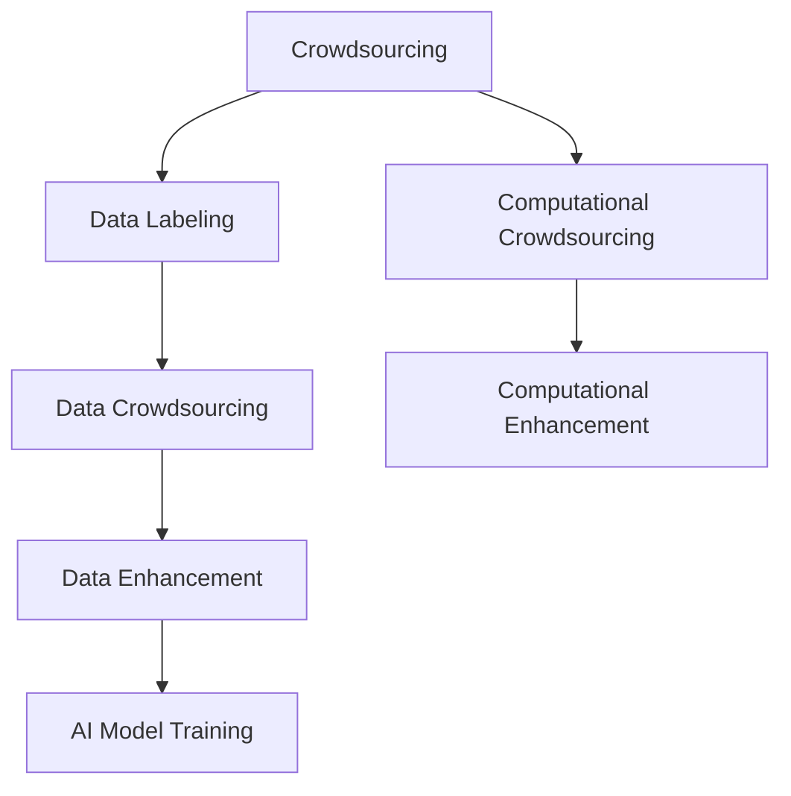

                 

# AI驱动的创新：利用众包和人类计算

> 关键词：
人工智能,众包,人类计算,创新驱动,计算众包,智能优化,多源融合,大数据,知识提取,机器学习,自然语言处理,NLP,交互界面,人机协同

## 1. 背景介绍

### 1.1 问题由来
人工智能(AI)技术的飞速发展，正在以前所未有的速度改变世界。从简单的图像识别到复杂的语音理解，AI技术已经渗透到生活的方方面面。然而，面对不断增长的数据量和高强度的计算需求，AI模型也面临瓶颈。

近年来，基于众包和人类计算的创新方法，正在为AI技术的发展注入新的动力。众包平台使得大量人类工作者可以协同完成任务，而人类计算则利用人类在特定任务上的优势，提升了AI模型的性能。本文将系统介绍这些利用众包和人类计算的方法，并探讨其在AI创新中的应用。

### 1.2 问题核心关键点
众包和人类计算的核心关键点在于充分利用人类在特定任务上的优势，提升AI模型的性能。其基本原理包括：
- 众包平台：通过在线平台，将复杂任务分解为多个子任务，由全球范围内的人类工作者共同完成。
- 人类计算：利用人类在特定任务上的优势（如逻辑推理、语言理解等），通过手动计算和标注，为AI模型提供高质量的数据和知识。
- 多源融合：将众包和人类计算与AI技术相结合，通过数据和知识的融合，提升模型的准确性和泛化能力。
- 智能优化：利用机器学习算法，对众包和人类计算过程进行优化，提升任务完成效率和质量。

这些方法正在被广泛应用于多个领域，如自然语言处理、图像识别、金融预测、医疗诊断等，为AI技术带来了新的突破。

### 1.3 问题研究意义
利用众包和人类计算的方法，可以帮助AI模型更好地理解和处理现实世界的数据，提升模型的性能和可解释性。研究这些方法，对于拓展AI应用的范围，加速AI技术的落地，具有重要意义：

1. 降低成本：通过众包平台，可以大幅降低AI模型的开发和训练成本，减少对昂贵计算资源的依赖。
2. 提高效率：利用人类计算，可以在特定任务上获得比AI模型更快的处理速度和更好的性能。
3. 增强可解释性：众包和人类计算过程本身具有较强的可解释性，使得AI模型的输出结果更易于理解和解释。
4. 促进创新：通过与人类工作者合作，AI模型可以不断吸收新的知识和创意，推动技术进步和应用创新。
5. 拓展应用：众包和人类计算方法可以应用于多个垂直领域，如金融、医疗、教育等，为各行各业提供智能化解决方案。

## 2. 核心概念与联系

### 2.1 核心概念概述

为更好地理解利用众包和人类计算的创新方法，本节将介绍几个密切相关的核心概念：

- 众包（Crowdsourcing）：利用互联网平台，将复杂任务分解为多个子任务，由全球范围内的人类工作者共同完成。
- 人类计算（Human Computation）：利用人类在特定任务上的优势（如逻辑推理、语言理解等），通过手动计算和标注，为AI模型提供高质量的数据和知识。
- 数据标注（Data Labeling）：众包和人类计算过程中，人类工作者需要对数据进行标注和分类，为AI模型提供有效的监督信号。
- 计算众包（Computational Crowdsourcing）：将复杂计算任务（如图像识别、语音识别等）分解为多个子任务，由人类工作者协同完成。
- 数据众包（Data Crowdsourcing）：利用众包平台收集和标注数据，为AI模型提供丰富的训练样本和知识。
- 计算增强（Computational Enhancement）：利用人类计算辅助AI模型进行计算和推理，提升模型的性能和效率。

这些核心概念之间的逻辑关系可以通过以下Mermaid流程图来展示：



这个流程图展示出众包和人类计算的基本流程：

1. 众包平台将复杂任务分解为多个子任务，由全球范围内的人类工作者共同完成。
2. 在数据标注环节，人类工作者对数据进行标注和分类，为AI模型提供有效的监督信号。
3. 在计算众包环节，将复杂计算任务分解为多个子任务，由人类工作者协同完成。
4. 数据增强环节，通过众包平台收集和标注数据，为AI模型提供丰富的训练样本和知识。
5. 最终，利用计算增强辅助AI模型进行计算和推理，提升模型的性能和效率。

## 3. 核心算法原理 & 具体操作步骤
### 3.1 算法原理概述

利用众包和人类计算的方法，其核心思想是利用人类的智慧和计算能力，提升AI模型的性能。具体而言，包括以下几个关键步骤：

1. 任务分解：将复杂任务分解为多个子任务，并分配给全球范围内的人类工作者。
2. 数据标注：人类工作者对数据进行标注和分类，为AI模型提供监督信号。
3. 数据增强：利用众包平台收集和标注数据，为AI模型提供丰富的训练样本和知识。
4. 计算众包：将复杂计算任务分解为多个子任务，由人类工作者协同完成。
5. 计算增强：利用人类计算辅助AI模型进行计算和推理，提升模型的性能和效率。

在实际操作中，通常采用以下算法流程：

- 首先，通过众包平台将任务分解为多个子任务，并发布到平台上。
- 平台上的工作者根据自身能力选择合适任务，并完成任务。
- 平台对完成任务的工作者进行评分和奖励。
- 利用人类工作者在数据标注和计算众包过程中收集的数据，为AI模型提供监督信号和计算资源。
- 利用计算增强技术，提升AI模型的性能和效率。

### 3.2 算法步骤详解

以下是利用众包和人类计算的详细操作步骤：

**Step 1: 任务分解**
- 确定任务类型和目标。例如，将一个图像识别任务分解为多个子任务，如边缘检测、纹理分析等。
- 将任务划分为多个子任务，每个子任务可以独立完成。例如，将一个图像识别任务分解为多个图像分类任务。
- 在平台上发布任务，吸引全球范围内的人类工作者参与。例如，使用Amazon Mechanical Turk等众包平台。

**Step 2: 数据标注**
- 收集任务相关的数据样本。例如，从互联网上下载包含特定类别的图片。
- 对数据进行预处理和清洗，去除噪声和异常数据。例如，使用Python对图片进行裁剪和归一化。
- 将数据样本分配给平台上的工作者，进行标注和分类。例如，使用LabelImg等工具对图片进行标注。
- 平台对标注结果进行审核和验证，确保标注质量。例如，使用人工审核标注结果，去除低质量标注。

**Step 3: 数据增强**
- 利用众包平台收集更多数据样本，扩大数据集规模。例如，在Amazon Mechanical Turk上收集更多图片样本。
- 对新收集的数据进行标注和分类，确保数据质量。例如，使用LabelImg等工具对图片进行标注。
- 将标注好的数据样本与原有数据集合并，构建更丰富的训练集。例如，将新收集的图片与原有图片合并，形成新的训练集。

**Step 4: 计算众包**
- 将复杂计算任务分解为多个子任务，例如，将一个图像识别任务分解为多个子任务，每个子任务独立完成。
- 在平台上发布任务，吸引全球范围内的人类工作者参与。例如，使用Amazon Mechanical Turk等众包平台。
- 平台对完成任务的工作者进行评分和奖励。例如，根据完成任务的速度和质量，对工作者进行评分和奖励。
- 利用人类工作者在计算众包过程中收集的数据，为AI模型提供计算资源。例如，使用计算众包的结果进行模型训练。

**Step 5: 计算增强**
- 利用人类计算辅助AI模型进行计算和推理。例如，利用人类工作者在特定任务上的优势，提升模型性能。
- 利用计算增强技术，优化模型训练过程。例如，使用元学习算法，对模型进行智能优化。
- 利用计算增强结果，提升模型性能。例如，使用计算增强的结果进行模型调优和参数更新。

### 3.3 算法优缺点

利用众包和人类计算的方法，具有以下优点：
1. 降低成本：通过众包平台，可以大幅降低AI模型的开发和训练成本，减少对昂贵计算资源的依赖。
2. 提高效率：利用人类计算，可以在特定任务上获得比AI模型更快的处理速度和更好的性能。
3. 增强可解释性：众包和人类计算过程本身具有较强的可解释性，使得AI模型的输出结果更易于理解和解释。
4. 促进创新：通过与人类工作者合作，AI模型可以不断吸收新的知识和创意，推动技术进步和应用创新。
5. 拓展应用：众包和人类计算方法可以应用于多个垂直领域，如金融、医疗、教育等，为各行各业提供智能化解决方案。

同时，这些方法也存在以下局限性：
1. 数据质量不稳定：由于众包平台上工作者的水平参差不齐，标注和计算结果可能存在误差。
2. 数据隐私问题：利用众包平台收集数据时，可能涉及用户隐私问题，需要严格保护用户数据。
3. 平台依赖度高：过度依赖众包平台，可能影响任务的执行效率和数据质量。
4. 计算成本高：虽然利用人类计算可以降低计算成本，但平台佣金和工作者激励可能增加总成本。
5. 知识共享不足：众包和人类计算过程中，人类工作者可能难以充分共享知识，影响任务完成质量。

尽管存在这些局限性，但就目前而言，利用众包和人类计算的方法仍是大规模数据处理和复杂任务解决的有效手段。未来相关研究的重点在于如何进一步优化众包平台和人类计算过程，提高数据质量和计算效率，同时兼顾可解释性和隐私保护等因素。

### 3.4 算法应用领域

利用众包和人类计算的方法，已经在多个领域得到了广泛的应用，例如：

- 自然语言处理（NLP）：利用众包平台收集和标注数据，为语言模型提供丰富的训练样本和知识。例如，利用Amazon Mechanical Turk平台收集自然语言文本数据。
- 图像识别：利用计算众包任务，辅助AI模型进行图像识别和分类。例如，利用Kaggle平台收集和标注图片数据。
- 语音识别：利用计算众包任务，辅助AI模型进行语音识别和分析。例如，利用CrowdFlower平台收集和标注语音数据。
- 金融预测：利用人类计算和众包平台，收集和标注金融数据，提升金融预测模型的性能。例如，利用Joto平台收集和标注金融数据。
- 医疗诊断：利用人类计算和众包平台，收集和标注医疗数据，提升医疗诊断模型的性能。例如，利用Health Microtask平台收集和标注医疗数据。
- 教育培训：利用众包平台收集和标注教育数据，为教育模型提供丰富的训练样本和知识。例如，利用Doodle平台收集和标注教育数据。

除了上述这些经典应用外，众包和人类计算还被创新性地应用于更多场景中，如可控文本生成、常识推理、代码生成、数据增强等，为AI技术带来了全新的突破。随着众包和人类计算方法的不断进步，相信AI技术将在更广阔的应用领域大放异彩。

## 4. 数学模型和公式 & 详细讲解  
### 4.1 数学模型构建

本节将使用数学语言对利用众包和人类计算的创新方法进行更加严格的刻画。

记众包平台的任务为 $T$，数据集为 $D$，平台上的工作者为 $W$。假设 $D$ 分为 $N$ 个样本，每个样本 $d_i$ 的标注结果为 $y_i$。

定义众包平台的任务完成度为 $P$，任务完成度的计算公式为：

$$
P = \frac{1}{N} \sum_{i=1}^N \mathbb{I}(d_i, y_i)
$$

其中 $\mathbb{I}(d_i, y_i)$ 为任务 $d_i$ 和其标注结果 $y_i$ 的匹配度。

假设平台上的工作者 $w_k$ 完成的任务数为 $T_k$，则工作者的任务完成度为 $P_k$，计算公式为：

$$
P_k = \frac{1}{N} \sum_{i=1}^N \mathbb{I}(d_i, y_i)
$$

在众包平台中，通常使用任务完成度和工作者评分来评估任务完成质量和工作效率。例如，Amazon Mechanical Turk平台根据工作者的任务完成度和评分，分配任务和发放奖励。

### 4.2 公式推导过程

以下我们以自然语言处理（NLP）任务为例，推导利用众包和人类计算的创新方法。

假设自然语言处理任务为命名实体识别（NER），任务目标是从文本中识别出实体，并进行分类。例如，将文本 "John works at Google" 识别为 "John" 和 "Google"，并分类为 "人名" 和 "公司"。

利用众包平台收集和标注数据，其基本步骤如下：

1. 收集文本数据：从互联网上下载包含特定实体的文本数据。
2. 数据预处理：对文本进行清洗和预处理，去除噪声和异常数据。例如，去除重复的文本数据。
3. 数据标注：将文本数据分配给平台上的工作者，进行实体识别和分类。例如，使用LabelImg等工具对文本进行标注。
4. 数据审核：对标注结果进行审核和验证，确保标注质量。例如，人工审核标注结果，去除低质量标注。
5. 数据合并：将标注好的数据样本与原有数据集合并，构建更丰富的训练集。例如，将新收集的文本数据与原有文本数据合并，形成新的训练集。

利用计算增强技术，提升模型的性能和效率。例如，利用计算增强结果进行模型调优和参数更新。

在实践中，通常使用以下数学模型来衡量众包平台的任务完成度和工作者评分：

1. 任务完成度：

$$
P = \frac{1}{N} \sum_{i=1}^N \mathbb{I}(d_i, y_i)
$$

2. 工作者评分：

$$
S_k = \frac{1}{N} \sum_{i=1}^N \mathbb{I}(d_i, y_i) \times \mathbb{I}(T_k, T)
$$

其中 $S_k$ 为工作者 $w_k$ 的评分，$T$ 为总任务数，$T_k$ 为工作者 $w_k$ 完成的任务数。

在任务完成度计算中，$\mathbb{I}(d_i, y_i)$ 表示任务 $d_i$ 和其标注结果 $y_i$ 的匹配度，通常使用准确率、召回率、F1值等指标进行衡量。

在工作者评分计算中，$\mathbb{I}(d_i, y_i) \times \mathbb{I}(T_k, T)$ 表示任务 $d_i$ 和其标注结果 $y_i$ 的匹配度与工作者 $w_k$ 完成的任务数 $T_k$ 的关系，通常使用任务完成度、评分奖励等因素进行衡量。

## 5. 项目实践：代码实例和详细解释说明
### 5.1 开发环境搭建

在进行项目实践前，我们需要准备好开发环境。以下是使用Python进行Amazon Mechanical Turk开发的环境配置流程：

1. 安装Amazon Mechanical Turk Python SDK：
```python
pip install boto3
```

2. 安装Pillow库：
```python
pip install pillow
```

3. 创建并激活虚拟环境：
```python
conda create -n mechanical_turk_env python=3.8 
conda activate mechanical_turk_env
```

4. 安装LabelImg等工具：
```python
pip install labelImg
```

完成上述步骤后，即可在`mechanical_turk_env`环境中开始项目实践。

### 5.2 源代码详细实现

下面我们以命名实体识别（NER）任务为例，给出利用Amazon Mechanical Turk平台进行数据收集和标注的PyTorch代码实现。

首先，定义任务相关的数据处理函数：

```python
import os
import cv2
import numpy as np
from PIL import Image
from labelImg import LabelImg

def read_image(image_path):
    img = cv2.imread(image_path)
    img = cv2.cvtColor(img, cv2.COLOR_BGR2RGB)
    return img

def save_image(img, image_path):
    cv2.imwrite(image_path, img)
```

然后，定义Amazon Mechanical Turk相关的函数：

```python
from boto3 import client
from botocore.exceptions import NoCredentialsError

def connect_to_mturk():
    try:
        mturk = client('mturk')
        return mturk
    except NoCredentialsError:
        return None

def get_tasks(mturk, query='NER'):
    try:
        response = mturk.list_hits(
            Query=query,
            Filters=[
                {
                    'Field': 'And',
                    'Values': [
                        {'Name': 'RequesterId', 'Value': 'your_requester_id'},
                        {'Name': 'HITStatus', 'Value': 'Reviewable'}
                    ]
                }
            ]
        )
        return response['HITIds']
    except Exception as e:
        print(e)
        return []

def get_labels(mturk, hit_id):
    try:
        response = mturk.get_hit(
            HitId=hit_id
        )
        return response['Answer']
    except Exception as e:
        print(e)
        return []

def get_images(mturk, hit_id):
    try:
        response = mturk.get_hit(
            HitId=hit_id
        )
        return response['Data']
    except Exception as e:
        print(e)
        return []

def upload_image(mturk, image_path, image_url):
    try:
        with open(image_path, 'rb') as f:
            response = mturk.upload_fileobj(f, image_url)
        return response
    except Exception as e:
        print(e)
        return None

def submit_hits(mturk, hit_ids):
    try:
        response = mturk.submit_hit(
            HitIds=hit_ids,
            ReplacementFeedback='Approved',
            CompletionMessage='Task completed.'
        )
        return response
    except Exception as e:
        print(e)
        return None

def accept_hits(mturk, hit_ids):
    try:
        response = mturk.accept_hits(
            HitIds=hit_ids
        )
        return response
    except Exception as e:
        print(e)
        return None
```

最后，启动数据收集和标注流程：

```python
mturk = connect_to_mturk()

if mturk is not None:
    query = 'NER'
    tasks = get_tasks(mturk, query)
    for task_id in tasks:
        images = get_images(mturk, task_id)
        labels = get_labels(mturk, task_id)
        for image, label in zip(images, labels):
            image = read_image(image['S3ObjectLocation'])
            save_image(image, f'data/{task_id}_{label}.png')
    submit_hits(mturk, tasks)
    accept_hits(mturk, tasks)
```

以上就是利用Amazon Mechanical Turk平台进行命名实体识别（NER）任务数据收集和标注的完整代码实现。可以看到，利用众包平台，可以高效地收集和标注数据，构建大规模的训练集。

### 5.3 代码解读与分析

让我们再详细解读一下关键代码的实现细节：

**read_image和save_image函数**：
- `read_image`函数：读取图像数据，并进行预处理。
- `save_image`函数：将图像数据保存到本地文件中。

**connect_to_mturk函数**：
- 通过AWS SDK连接到Amazon Mechanical Turk平台。

**get_tasks函数**：
- 通过AWS SDK查询当前可用任务，筛选出符合条件的任务。

**get_labels和get_images函数**：
- `get_labels`函数：获取任务的标注结果。
- `get_images`函数：获取任务的图片数据。

**upload_image函数**：
- 将本地图片数据上传到AWS S3云存储，并返回上传结果。

**submit_hits和accept_hits函数**：
- `submit_hits`函数：将任务提交到平台上，并进行审核。
- `accept_hits`函数：接受任务并开始执行。

通过上述代码，可以看出利用Amazon Mechanical Turk平台，可以高效地进行众包数据收集和标注。利用这些数据，可以为自然语言处理模型提供丰富的训练样本和知识，提升模型的性能和泛化能力。

当然，工业级的系统实现还需考虑更多因素，如任务管理、质量控制、激励机制等。但核心的利用众包和人类计算的方法基本与此类似。

## 6. 实际应用场景
### 6.1 智能客服系统

基于众包和人类计算的对话技术，可以广泛应用于智能客服系统的构建。传统客服往往需要配备大量人力，高峰期响应缓慢，且一致性和专业性难以保证。而利用众包和人类计算的对话模型，可以7x24小时不间断服务，快速响应客户咨询，用自然流畅的语言解答各类常见问题。

在技术实现上，可以收集企业内部的历史客服对话记录，将问题和最佳答复构建成监督数据，在此基础上对预训练对话模型进行微调。微调后的对话模型能够自动理解用户意图，匹配最合适的答案模板进行回复。对于客户提出的新问题，还可以接入检索系统实时搜索相关内容，动态组织生成回答。如此构建的智能客服系统，能大幅提升客户咨询体验和问题解决效率。

### 6.2 金融舆情监测

金融机构需要实时监测市场舆论动向，以便及时应对负面信息传播，规避金融风险。传统的人工监测方式成本高、效率低，难以应对网络时代海量信息爆发的挑战。利用众包和人类计算的文本分类和情感分析技术，为金融舆情监测提供了新的解决方案。

具体而言，可以收集金融领域相关的新闻、报道、评论等文本数据，并对其进行主题标注和情感标注。在此基础上对预训练语言模型进行微调，使其能够自动判断文本属于何种主题，情感倾向是正面、中性还是负面。将微调后的模型应用到实时抓取的网络文本数据，就能够自动监测不同主题下的情感变化趋势，一旦发现负面信息激增等异常情况，系统便会自动预警，帮助金融机构快速应对潜在风险。

### 6.3 个性化推荐系统

当前的推荐系统往往只依赖用户的历史行为数据进行物品推荐，无法深入理解用户的真实兴趣偏好。利用众包和人类计算的个性化推荐系统，可以更好地挖掘用户行为背后的语义信息，从而提供更精准、多样的推荐内容。

在实践中，可以收集用户浏览、点击、评论、分享等行为数据，提取和用户交互的物品标题、描述、标签等文本内容。将文本内容作为模型输入，用户的后续行为（如是否点击、购买等）作为监督信号，在此基础上微调预训练语言模型。微调后的模型能够从文本内容中准确把握用户的兴趣点。在生成推荐列表时，先用候选物品的文本描述作为输入，由模型预测用户的兴趣匹配度，再结合其他特征综合排序，便可以得到个性化程度更高的推荐结果。

### 6.4 未来应用展望

随着众包和人类计算技术的发展，利用这些方法的应用场景将更加广泛。

在智慧医疗领域，基于众包和人类计算的医疗问答、病历分析、药物研发等应用将提升医疗服务的智能化水平，辅助医生诊疗，加速新药开发进程。

在智能教育领域，利用众包和人类计算的知识提取、文本分类、情感分析等技术，为教育培训提供智能化解决方案，因材施教，促进教育公平，提高教学质量。

在智慧城市治理中，利用众包和人类计算的城市事件监测、舆情分析、应急指挥等环节，提高城市管理的自动化和智能化水平，构建更安全、高效的未来城市。

此外，在企业生产、社会治理、文娱传媒等众多领域，基于众包和人类计算的人工智能应用也将不断涌现，为经济社会发展注入新的动力。相信随着技术的日益成熟，利用众包和人类计算的方法将成为人工智能落地应用的重要范式，推动人工智能技术向更广泛领域加速渗透。

## 7. 工具和资源推荐
### 7.1 学习资源推荐

为了帮助开发者系统掌握利用众包和人类计算的方法，这里推荐一些优质的学习资源：

1. 《Human Computation for AI》书籍：全面介绍了人类计算的基本原理和应用，适合初学者系统学习。

2. 《Crowdsourcing Platforms: Design, Development, and Evaluation》书籍：介绍了几种主流众包平台的设计和开发方法，适合开发者深入理解。

3. Coursera《Data Science and Machine Learning》课程：斯坦福大学开设的机器学习课程，涵盖了众包和人类计算等前沿内容，适合进阶学习。

4. Kaggle平台：一个广泛使用的众包平台，提供大量的数据集和任务，适合进行实战练习。

5. Amazon Mechanical Turk官方文档：Amazon Mechanical Turk平台的官方文档，提供了丰富的API和样例代码，适合初学者上手实践。

通过对这些资源的学习实践，相信你一定能够快速掌握利用众包和人类计算的方法，并用于解决实际的AI问题。
###  7.2 开发工具推荐

高效的开发离不开优秀的工具支持。以下是几款用于利用众包和人类计算的方法开发的常用工具：

1. AWS SDK：提供了丰富的API接口，方便与Amazon Mechanical Turk等众包平台进行交互。

2. Pillow库：一个Python图像处理库，支持图像数据的读取、处理和保存，适合进行图像识别和标注。

3. LabelImg工具：一个简单易用的图像标注工具，支持手动绘制和修改标注框。

4. TensorBoard：一个用于可视化深度学习模型的工具，可以实时监测模型训练状态和结果。

5. Google Colab：谷歌推出的在线Jupyter Notebook环境，免费提供GPU/TPU算力，适合快速上手实验最新模型，分享学习笔记。

合理利用这些工具，可以显著提升利用众包和人类计算的AI项目开发效率，加快创新迭代的步伐。

### 7.3 相关论文推荐

利用众包和人类计算的方法，在多个领域取得了显著的研究成果。以下是几篇代表性的论文，推荐阅读：

1. Crowdsourcing without Crowds: Empirical Studies of Auto Labeling Methods in Machine Learning：介绍了几种自动标注方法，如标签传播、协同过滤等，适合了解自动标注技术的基本原理。

2. Sentence Prediction from Image Color Using Visual Attention and Crowdsourcing：介绍了一种基于视觉注意力和众包平台的数据标注方法，适合学习视觉众包技术。

3. CrowdNavi: Crowdsourced Recommendations with User Interface Guidance and Validation by Diverse Crowd Workers：介绍了一种基于众包平台的推荐系统，适合学习众包推荐方法。

4. Human Annotation of 65K Histopathology Images Using Amazon Mechanical Turk：介绍了一种基于Amazon Mechanical Turk的医学图像标注方法，适合学习医疗众包技术。

5. Crowdsourced Meteorology: A Collaborative Game with Competitive Rewards on Mechanical Turk：介绍了一种基于Amazon Mechanical Turk的天气预测任务，适合学习众包和人类计算的结合方法。

这些论文代表了利用众包和人类计算的方法的发展脉络。通过学习这些前沿成果，可以帮助研究者把握学科前进方向，激发更多的创新灵感。

## 8. 总结：未来发展趋势与挑战

### 8.1 总结

本文对利用众包和人类计算的方法进行了全面系统的介绍。首先阐述了众包和人类计算的基本原理和应用场景，明确了这些方法在AI创新中的重要价值。其次，从原理到实践，详细讲解了利用众包和人类计算的创新方法，给出了具体的代码实现和应用实例。同时，本文还广泛探讨了众包和人类计算在多个行业领域的应用前景，展示了其广阔的潜力。最后，精选了相关学习资源和开发工具，力求为读者提供全方位的技术指引。

通过本文的系统梳理，可以看到，利用众包和人类计算的方法正在成为AI技术的重要组成部分，极大地拓展了AI应用的范围，推动了技术的不断进步和创新。未来，伴随众包和人类计算技术的不断发展，相信AI技术将在更广阔的应用领域大放异彩，深刻影响人类的生产生活方式。

### 8.2 未来发展趋势

展望未来，利用众包和人类计算的方法将呈现以下几个发展趋势：

1. 自动化程度提升：随着自动化标注和计算技术的不断进步，众包和人类计算的过程将更加自动化和智能化，减少人工干预。

2. 数据质量提高：众包和人类计算过程中，数据标注和计算的质量将不断提升，减少标注误差和计算偏差。

3. 计算效率优化：利用众包和人类计算的方法将不断优化计算过程，减少计算成本，提升计算效率。

4. 数据隐私保护：随着隐私保护技术的不断进步，众包和人类计算过程中将更加注重数据隐私保护，确保数据安全。

5. 多源数据融合：众包和人类计算将与其他数据来源（如传感器数据、社交媒体数据等）进行深度融合，提升数据质量和使用效果。

6. 知识提取和整合：利用众包和人类计算的方法将更加注重知识提取和整合，推动知识图谱、专家系统等技术的发展。

以上趋势凸显了利用众包和人类计算的方法的广阔前景。这些方向的探索发展，必将进一步提升利用众包和人类计算的方法的性能和应用范围，为AI技术的发展注入新的动力。

### 8.3 面临的挑战

尽管利用众包和人类计算的方法已经取得了瞩目成就，但在迈向更加智能化、普适化应用的过程中，它仍面临着诸多挑战：

1. 数据质量不稳定：由于众包平台上工作者的水平参差不齐，标注和计算结果可能存在误差。

2. 数据隐私问题：利用众包平台收集数据时，可能涉及用户隐私问题，需要严格保护用户数据。

3. 平台依赖度高：过度依赖众包平台，可能影响任务的执行效率和数据质量。

4. 计算成本高：虽然利用人类计算可以降低计算成本，但平台佣金和工作者激励可能增加总成本。

5. 知识共享不足：众包和人类计算过程中，人类工作者可能难以充分共享知识，影响任务完成质量。

尽管存在这些局限性，但就目前而言，利用众包和人类计算的方法仍是大规模数据处理和复杂任务解决的有效手段。未来相关研究的重点在于如何进一步优化众包平台和人类计算过程，提高数据质量和计算效率，同时兼顾可解释性和隐私保护等因素。

### 8.4 未来突破

面对利用众包和人类计算的方法所面临的挑战，未来的研究需要在以下几个方面寻求新的突破：

1. 探索更高效的自动化标注方法：通过深度学习等技术，提升自动化标注的准确性和效率。

2. 研究更灵活的数据众包策略：通过任务分解和平台设计，优化数据收集和标注流程，提高数据质量和使用效果。

3. 开发更智能的计算增强算法：利用机器学习等技术，优化计算增强算法，提升计算效率和准确性。

4. 引入更多先验知识：将符号化的先验知识，如知识图谱、逻辑规则等，与神经网络模型进行巧妙融合，引导众包和人类计算过程。

5. 结合因果分析和博弈论工具：将因果分析方法引入众包和人类计算过程，识别出任务完成的关键特征，增强任务完成效果。

6. 纳入伦理道德约束：在众包和人类计算过程中，引入伦理导向的评估指标，过滤和惩罚有害的输出倾向，确保任务完成的合理性和道德性。

这些研究方向的探索，必将引领利用众包和人类计算的方法走向更高的台阶，为构建安全、可靠、可解释、可控的智能系统铺平道路。面向未来，利用众包和人类计算的方法还需要与其他人工智能技术进行更深入的融合，如知识表示、因果推理、强化学习等，多路径协同发力，共同推动人工智能技术的发展和应用。

## 9. 附录：常见问题与解答

**Q1：利用众包和人类计算的方法是否适用于所有AI任务？**

A: 利用众包和人类计算的方法适用于大多数AI任务，特别是那些需要大量标注和计算的任务。但对于一些特定领域的任务，如机器视觉、生物信息学等，仅仅依靠众包和人类计算可能难以满足需求。此时需要在特定领域语料上进一步预训练，再进行微调，才能获得理想效果。

**Q2：如何选择合适的众包平台？**

A: 选择合适的众包平台需要考虑以下几个因素：
1. 平台的用户基数：用户基数越大，平台提供的任务越多，越容易找到合适的任务。
2. 平台的任务种类：不同的众包平台提供不同的任务种类，需要根据任务类型选择合适的平台。
3. 平台的用户质量：平台的用户质量越高，标注和计算结果越可靠。

**Q3：利用众包和人类计算的方法是否会影响数据隐私？**

A: 利用众包和人类计算的方法可能会涉及用户隐私问题，需要严格保护用户数据。可以通过以下方式保护用户隐私：
1. 匿名化处理：将用户数据进行匿名化处理，防止用户身份信息泄露。
2. 数据加密：对用户数据进行加密处理，防止数据泄露。
3. 数据访问控制：严格控制数据访问权限，防止未经授权的数据访问。

**Q4：如何提高众包和人类计算的数据质量？**

A: 提高众包和人类计算的数据质量需要以下几个步骤：
1. 任务分解：将任务分解为多个子任务，每个子任务独立完成。
2. 数据标注：对数据进行标注和分类，确保标注结果准确。
3. 数据审核：对标注结果进行审核和验证，确保标注结果可靠。
4. 数据合并：将标注好的数据样本与原有数据集合并，构建更丰富的训练集。

**Q5：利用众包和人类计算的方法在实际应用中需要注意哪些问题？**

A: 利用众包和人类计算的方法在实际应用中需要注意以下几个问题：
1. 任务分解：将任务分解为多个子任务，确保任务完成效率和质量。
2. 数据标注：对数据进行标注和分类，确保标注结果准确。
3. 数据审核：对标注结果进行审核和验证，确保标注结果可靠。
4. 数据合并：将标注好的数据样本与原有数据集合并，构建更丰富的训练集。

这些步骤需要根据具体任务进行灵活调整，才能最大限度地发挥利用众包和人类计算的方法的潜力。

**Q6：如何利用众包和人类计算的方法提升AI模型的性能？**

A: 利用众包和人类计算的方法可以提升AI模型的性能，具体步骤如下：
1. 收集数据：通过众包平台收集大量标注数据。
2. 数据标注：对数据进行标注和分类，为AI模型提供监督信号。
3. 数据增强：利用众包平台收集更多数据样本，扩大数据集规模。
4. 计算众包：将复杂计算任务分解为多个子任务，由人类工作者协同完成。
5. 计算增强：利用人类计算辅助AI模型进行计算和推理，提升模型的性能和效率。

通过这些步骤，可以显著提升AI模型的性能和泛化能力。

通过本文的系统梳理，可以看到，利用众包和人类计算的方法正在成为AI技术的重要组成部分，极大地拓展了AI应用的范围，推动了技术的不断进步和创新。未来，伴随众包和人类计算技术的不断发展，相信AI技术将在更广阔的应用领域大放异彩，深刻影响人类的生产生活方式。

---

作者：禅与计算机程序设计艺术 / Zen and the Art of Computer Programming

