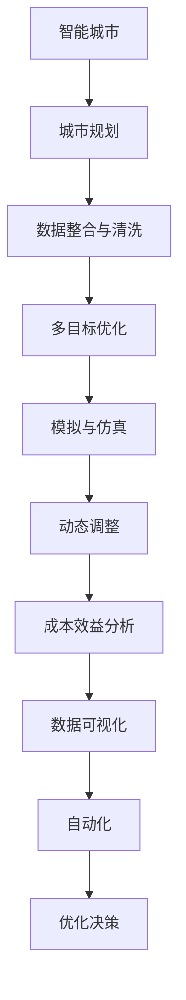

                 

# AI驱动的智能城市规划工具

> 关键词：智能城市,城市规划,人工智能,数据科学,规划工具,深度学习,数据可视,自动化

## 1. 背景介绍

### 1.1 问题由来

随着全球人口的急剧增长，城市化进程加速，城市规划和建设面临前所未有的挑战。传统城市规划依赖于大量的人力和时间，难以在复杂多变的城市环境中做出合理决策。而人工智能(AI)和大数据技术为城市规划提供了全新的手段，通过数据分析、模型建模、仿真模拟等技术，能够快速、精准地辅助城市决策者进行规划。

城市规划是一个多目标优化问题，涉及经济、环境、交通、安全等多个维度的综合考量。过去，城市规划依靠经验、手工计算和部分定量分析，难以兼顾各方面的需求和约束。而通过AI技术，可以利用大数据进行高效的分析和预测，大大提升了城市规划的科学性和准确性。

### 1.2 问题核心关键点

城市规划面临的核心问题是如何在有限的城市空间内实现高效、健康、可持续的发展。AI驱动的智能城市规划工具，通过大数据分析、模型仿真、优化决策等手段，能够系统性地解决这些问题。

**主要关键点包括：**

1. **数据整合与清洗**：城市规划数据量庞大、类型多样，整合清洗后能够为模型提供高质量输入。
2. **多目标优化**：规划目标复杂多样，需要通过优化算法平衡不同目标。
3. **模拟与仿真**：利用仿真工具模拟城市运行，评估决策效果。
4. **动态调整**：城市环境动态变化，规划方案需要具备灵活适应性。
5. **可解释性**：规划决策需要透明，AI工具需提供模型解释和可解释性。
6. **成本效益分析**：评估规划方案的经济效益和资源消耗。

## 2. 核心概念与联系

### 2.1 核心概念概述

为了深入理解AI驱动的智能城市规划工具，本节将介绍几个核心概念及其相互关系：

- **智能城市**：通过信息技术手段，实现城市设施、交通、能源、环境等的智能化管理。
- **城市规划**：对城市空间进行设计、布局、配置和管理，实现城市发展的合理性、持续性和可持续性。
- **数据科学**：利用数据挖掘、统计分析、机器学习等技术手段，处理和分析城市数据，提取有价值的信息。
- **深度学习**：一种特殊的机器学习技术，能够处理复杂非线性的数据关系，适用于城市规划中的多目标优化问题。
- **数据可视化**：将复杂的城市数据通过图形化展示，直观地辅助决策者理解数据分析结果。
- **自动化**：通过AI技术自动化地处理和分析城市数据，节省人力和时间成本。
- **优化决策**：利用优化算法寻找最优的城市规划方案，实现多目标最优解。

这些核心概念构成了智能城市规划的基础框架，通过数据分析、模型预测和优化决策等技术手段，可以系统性地解决城市规划中的各种问题。

### 2.2 核心概念原理和架构的 Mermaid 流程图



该流程图展示了智能城市规划工具的核心组件及其相互关系：

1. **数据整合与清洗**：通过收集城市各类数据，并进行清洗、整合，为模型提供高质量输入。
2. **多目标优化**：综合考虑经济、环境、交通、安全等多个目标，利用优化算法寻找最优方案。
3. **模拟与仿真**：利用仿真工具模拟城市运行，预测决策效果。
4. **动态调整**：城市环境动态变化，规划方案需具备灵活适应性。
5. **成本效益分析**：评估规划方案的经济效益和资源消耗，确保方案可行。
6. **数据可视化**：通过图形化展示城市数据和规划方案，辅助决策者理解。
7. **自动化**：自动化地处理和分析城市数据，提升效率。
8. **优化决策**：利用优化算法寻找最优的城市规划方案。

## 3. 核心算法原理 & 具体操作步骤

### 3.1 算法原理概述

AI驱动的智能城市规划工具的核心算法包括数据处理、模型优化、模拟仿真等，下面分别介绍其主要原理：

**3.1.1 数据处理**

城市规划涉及的数据类型多样，包括地理信息数据、交通流量数据、人口统计数据、经济指标数据等。数据处理的目标是清洗和整合这些数据，消除数据噪声，保证数据的准确性和完整性。

具体步骤包括：

1. **数据收集**：通过传感器、数据库、API等手段收集各类城市数据。
2. **数据清洗**：去除数据中的噪声、错误、缺失值等，保证数据质量。
3. **数据整合**：将各类数据进行统一标准，整合到一个数据平台中，方便后续分析。

**3.1.2 模型优化**

城市规划是一个多目标优化问题，涉及经济、环境、交通、安全等多个维度。模型优化的目标是寻找平衡这些目标的最优方案。

具体步骤包括：

1. **模型选择**：选择合适的优化算法，如遗传算法、粒子群算法、深度学习等。
2. **模型训练**：利用历史数据训练优化模型，保证模型的泛化能力。
3. **模型评估**：通过测试数据评估模型性能，调整参数和结构，提升模型效果。

**3.1.3 模拟仿真**

模拟仿真是城市规划中的重要环节，通过仿真工具模拟城市运行，预测决策效果，评估方案的可行性。

具体步骤包括：

1. **仿真模型建立**：根据城市规划需求，建立相应的仿真模型，如交通流模型、城市动态模型等。
2. **仿真数据生成**：利用优化后的规划方案，生成仿真数据，模拟城市运行。
3. **仿真效果评估**：通过仿真结果评估决策效果，反馈优化过程。

### 3.2 算法步骤详解

**3.2.1 数据处理步骤**

1. **数据收集**：收集各类城市数据，如交通流量、人口统计、经济指标等。

2. **数据清洗**：对数据进行初步清洗，去除错误、噪声、缺失值等。

3. **数据整合**：将清洗后的数据整合到一个数据平台中，统一格式和标准。

4. **数据可视化**：通过数据可视化工具，如Tableau、Power BI等，直观展示数据特征和趋势。

**3.2.2 模型优化步骤**

1. **模型选择**：根据规划目标，选择合适的优化算法。

2. **模型训练**：利用历史数据训练模型，调整参数和结构，提升模型效果。

3. **模型评估**：通过测试数据评估模型性能，调整参数和结构，提升模型效果。

4. **优化决策**：利用优化后的模型，辅助决策者进行城市规划。

**3.2.3 模拟仿真步骤**

1. **仿真模型建立**：根据城市规划需求，建立相应的仿真模型，如交通流模型、城市动态模型等。

2. **仿真数据生成**：利用优化后的规划方案，生成仿真数据，模拟城市运行。

3. **仿真效果评估**：通过仿真结果评估决策效果，反馈优化过程。

### 3.3 算法优缺点

AI驱动的智能城市规划工具具有以下优点：

1. **高效性**：利用大数据分析和模型优化，能够快速、准确地辅助决策。
2. **准确性**：基于深度学习和优化算法，能够处理复杂非线性的数据关系。
3. **可解释性**：通过数据可视化和模型解释，提高决策的透明度和可理解性。
4. **灵活性**：模型具备动态调整能力，适应城市环境的动态变化。
5. **成本效益**：优化决策能够节约资源消耗，提升经济效益。

同时，该方法也存在一些缺点：

1. **数据依赖**：高质量数据的获取和处理成本较高。
2. **模型复杂**：优化算法和仿真模型较为复杂，需要专业知识支持。
3. **模拟精度**：仿真结果可能与实际情况存在差异。
4. **可解释性不足**：深度学习模型的决策过程较为复杂，难以解释。

### 3.4 算法应用领域

AI驱动的智能城市规划工具在多个领域都有广泛应用，具体包括：

1. **交通规划**：通过交通流仿真，优化道路网络，提升交通效率。

2. **空间布局**：利用地理信息系统，优化城市空间布局，提升城市品质。

3. **环境保护**：通过环境模拟，评估城市建设对环境的影响，实现可持续发展。

4. **资源配置**：利用优化算法，合理配置城市资源，提升资源利用率。

5. **应急管理**：利用模拟仿真，预测城市灾害风险，制定应急预案。

## 4. 数学模型和公式 & 详细讲解 & 举例说明

### 4.1 数学模型构建

**4.1.1 数据处理模型**

数据处理模型用于对各类城市数据进行清洗和整合。设城市数据集为 $D=\{x_1, x_2, ..., x_n\}$，其中 $x_i$ 表示第 $i$ 个数据记录。数据处理模型 $M_{\text{data}}$ 的目标是对数据进行清洗、整合和可视化，构建数据平台 $P_{\text{data}}$。

**4.1.2 模型优化模型**

模型优化模型用于对城市规划问题进行多目标优化。设优化目标函数为 $F(x)$，其中 $x$ 表示城市规划方案。模型优化模型 $M_{\text{opt}}$ 的目标是求解最优解 $x^*$。

**4.1.3 模拟仿真模型**

模拟仿真模型用于对城市运行进行仿真模拟。设仿真模型为 $M_{\text{sim}}$，其输入为优化后的规划方案 $x^*$，输出为仿真结果 $y$。

### 4.2 公式推导过程

**4.2.1 数据处理模型**

数据处理模型的输入为原始数据集 $D$，输出为清洗后的数据平台 $P_{\text{data}}$。假设数据清洗函数为 $f(x)$，则数据处理模型的公式为：

$$
P_{\text{data}} = f(D)
$$

**4.2.2 模型优化模型**

模型优化模型的输入为城市规划目标函数 $F(x)$，输出为最优解 $x^*$。假设优化算法为 $A$，则模型优化模型的公式为：

$$
x^* = A(F(x))
$$

**4.2.3 模拟仿真模型**

模拟仿真模型的输入为优化后的规划方案 $x^*$，输出为仿真结果 $y$。假设仿真函数为 $g(x)$，则模拟仿真模型的公式为：

$$
y = g(x^*)
$$

### 4.3 案例分析与讲解

**案例分析**：某城市规划中，目标是最大化城市经济收益和环境质量。

**数据处理**：收集城市各类数据，如交通流量、人口统计、经济指标等。通过清洗和整合，得到一个统一的数据平台 $P_{\text{data}}$。

**模型优化**：利用优化算法，构建多目标优化模型 $M_{\text{opt}}$。目标函数为 $F(x) = E(x) - C(x) + S(x)$，其中 $E(x)$ 表示城市经济收益，$C(x)$ 表示城市成本，$S(x)$ 表示环境质量。

**仿真模拟**：利用优化后的规划方案，生成仿真数据，通过仿真模型 $M_{\text{sim}}$ 进行城市运行仿真。评估仿真结果，反馈优化过程，调整规划方案。

## 5. 项目实践：代码实例和详细解释说明

### 5.1 开发环境搭建

**开发环境搭建**：

1. **数据平台搭建**：搭建一个支持SQL、NoSQL等数据存储和查询的数据平台，如Apache Hadoop、Apache Spark等。

2. **模型训练环境搭建**：搭建一个高性能计算环境，支持深度学习框架，如TensorFlow、PyTorch等。

3. **仿真平台搭建**：搭建一个支持仿真模拟的计算平台，如Simulink、AnyLogic等。

4. **可视化平台搭建**：搭建一个数据可视化平台，如Tableau、Power BI等。

### 5.2 源代码详细实现

**数据处理模型实现**：

```python
# 数据清洗函数
def data_cleaning(data):
    # 数据清洗操作
    pass

# 数据整合函数
def data_integration(data):
    # 数据整合操作
    pass

# 数据可视化函数
def data_visualization(data):
    # 数据可视化操作
    pass
```

**模型优化模型实现**：

```python
# 多目标优化函数
def multi_objective_optimization(target):
    # 优化算法
    pass

# 模型训练函数
def model_training(data):
    # 构建优化模型
    pass

# 模型评估函数
def model_evaluation(data):
    # 评估模型性能
    pass
```

**仿真模拟模型实现**：

```python
# 仿真模型函数
def simulation_model(data):
    # 仿真模拟操作
    pass

# 仿真结果评估函数
def simulation_result_evaluation(data):
    # 评估仿真结果
    pass
```

### 5.3 代码解读与分析

**代码解读**：

- **数据清洗函数**：通过去除错误、噪声、缺失值等操作，保证数据的准确性。
- **数据整合函数**：将清洗后的数据整合到一个统一的数据平台中，方便后续分析。
- **多目标优化函数**：利用优化算法，对城市规划问题进行多目标优化。
- **模型训练函数**：构建优化模型，并利用历史数据进行训练和评估。
- **仿真模型函数**：建立相应的仿真模型，进行城市运行仿真。
- **仿真结果评估函数**：评估仿真结果，反馈优化过程。

**代码分析**：

- **数据处理模型**：通过数据清洗、整合和可视化，构建高质量的数据平台，为后续模型优化和仿真模拟提供可靠的数据输入。
- **模型优化模型**：通过多目标优化算法，寻找平衡各类目标的最优规划方案。
- **仿真模拟模型**：通过仿真工具模拟城市运行，评估决策效果，反馈优化过程，调整规划方案。

### 5.4 运行结果展示

**运行结果**：

- **数据处理结果**：通过数据清洗和整合，得到一个高质量的数据平台 $P_{\text{data}}$。
- **模型优化结果**：通过多目标优化算法，得到最优的规划方案 $x^*$。
- **仿真模拟结果**：通过仿真模型，生成城市运行仿真数据，评估决策效果。

## 6. 实际应用场景

**实际应用场景**：

1. **智慧交通**：通过交通流仿真，优化道路网络，提升交通效率。

2. **智能能源**：利用优化算法，合理配置城市能源，提升能源利用率。

3. **环境保护**：通过环境模拟，评估城市建设对环境的影响，实现可持续发展。

4. **智能医疗**：利用优化算法，优化医疗资源配置，提升医疗服务质量。

5. **应急管理**：利用模拟仿真，预测城市灾害风险，制定应急预案。

## 7. 工具和资源推荐

### 7.1 学习资源推荐

1. **《智能城市规划与设计》**：介绍智能城市规划的基本概念和实现方法，适合初学者阅读。
2. **《城市数据科学》**：讲解如何利用数据科学手段处理和分析城市数据，提升规划决策的科学性。
3. **《深度学习在城市规划中的应用》**：讲解深度学习在城市规划中的应用案例和实践经验。
4. **《城市规划中的仿真技术》**：讲解城市规划中的仿真技术和应用实例。

### 7.2 开发工具推荐

1. **Apache Hadoop**：支持大规模数据存储和处理，适合数据平台搭建。
2. **Apache Spark**：支持高性能计算，适合模型训练环境搭建。
3. **Simulink**：支持仿真模拟，适合仿真平台搭建。
4. **Tableau**：支持数据可视化，适合数据可视化平台搭建。
5. **PyTorch**：支持深度学习模型训练，适合模型优化模型实现。
6. **TensorFlow**：支持深度学习模型训练，适合模型优化模型实现。

### 7.3 相关论文推荐

1. **《基于数据驱动的城市规划方法》**：介绍如何利用大数据驱动城市规划决策。
2. **《智能城市中的深度学习应用》**：讲解深度学习在智能城市中的应用案例。
3. **《城市规划中的优化算法研究》**：讲解优化算法在城市规划中的应用。
4. **《城市仿真技术的发展与应用》**：讲解城市仿真技术的发展和应用实例。

## 8. 总结：未来发展趋势与挑战

### 8.1 研究成果总结

AI驱动的智能城市规划工具在多目标优化、仿真模拟、数据处理等方面取得了显著进展，显著提升了城市规划的科学性和准确性。未来，随着深度学习和大数据技术的不断进步，该工具将具备更强的预测和优化能力。

### 8.2 未来发展趋势

1. **深度学习算法改进**：未来深度学习算法将更加先进，能够更好地处理复杂非线性的数据关系。

2. **多目标优化算法优化**：多目标优化算法将更加高效，能够更好地平衡各类目标，提升规划方案的合理性。

3. **仿真技术提升**：仿真技术将更加精细，能够更真实地模拟城市运行，提升规划决策的准确性。

4. **数据治理强化**：数据治理技术将更加完善，能够更好地处理和分析城市数据，提升决策的科学性。

5. **智能决策辅助**：智能决策辅助技术将更加成熟，能够更好地支持决策者的决策过程。

### 8.3 面临的挑战

1. **数据获取与处理**：高质量数据的获取和处理成本较高，需要不断优化数据治理技术。

2. **模型复杂性**：模型复杂性较高，需要专业知识支持，难以普及应用。

3. **仿真精度**：仿真结果可能与实际情况存在差异，需要不断优化仿真模型。

4. **可解释性不足**：深度学习模型的决策过程较为复杂，难以解释，需要更多研究提升可解释性。

### 8.4 研究展望

未来研究将聚焦以下几个方向：

1. **自动化数据治理**：开发自动化的数据治理技术，提升数据处理效率和准确性。

2. **可解释性增强**：研究增强模型可解释性的方法，提升决策的透明度和可信度。

3. **多模态数据融合**：研究多模态数据融合技术，提升数据处理能力和模型优化效果。

4. **跨领域应用拓展**：拓展智能城市规划工具在更多领域的应用，提升智能化水平。

5. **算法优化与创新**：开发更高效的算法和模型，提升智能城市规划工具的性能和实用性。

## 9. 附录：常见问题与解答

**Q1：AI驱动的智能城市规划工具如何提升城市规划的科学性？**

A: AI驱动的智能城市规划工具通过大数据分析和模型优化，能够快速、准确地辅助决策。具体来说，数据处理模型能够清洗和整合城市各类数据，构建高质量的数据平台。模型优化模型通过多目标优化算法，平衡各类目标，得到最优的规划方案。仿真模拟模型通过仿真工具模拟城市运行，评估决策效果，反馈优化过程，调整规划方案。这些技术手段能够显著提升城市规划的科学性和准确性。

**Q2：智能城市规划工具中，数据处理和模型优化的区别是什么？**

A: 数据处理和模型优化是智能城市规划工具的两个关键环节。数据处理的目标是清洗和整合各类城市数据，构建高质量的数据平台。模型优化的目标是通过多目标优化算法，平衡各类目标，得到最优的规划方案。具体来说，数据处理是将原始数据转化为适合模型分析的格式，而模型优化则是在数据平台上，利用优化算法寻找最优规划方案。两者相辅相成，共同提升城市规划的科学性和合理性。

**Q3：AI驱动的智能城市规划工具在实际应用中需要注意哪些问题？**

A: AI驱动的智能城市规划工具在实际应用中需要注意以下几个问题：

1. 数据依赖：高质量数据的获取和处理成本较高，需要不断优化数据治理技术。

2. 模型复杂：模型复杂性较高，需要专业知识支持，难以普及应用。

3. 仿真精度：仿真结果可能与实际情况存在差异，需要不断优化仿真模型。

4. 可解释性不足：深度学习模型的决策过程较为复杂，难以解释，需要更多研究提升可解释性。

通过不断优化数据治理、仿真模型和算法，AI驱动的智能城市规划工具将在实际应用中发挥更大作用。

---

作者：禅与计算机程序设计艺术 / Zen and the Art of Computer Programming

