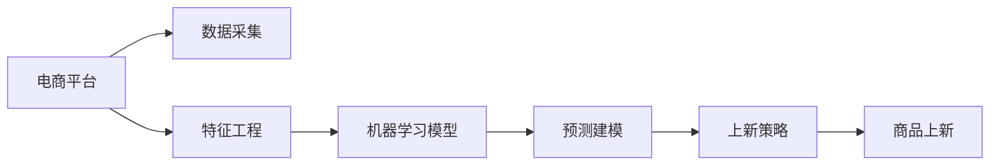

                 

# AI驱动的电商平台商品上新策略

## 1. 背景介绍

随着电商行业的蓬勃发展，消费者需求的多样化与日俱增，电商平台的商品上新策略直接影响到其市场竞争力。然而，如何高效、精准地决定何时、何地、以何种方式上新商品，已成为电商企业急需解决的问题。为此，结合人工智能技术，提出一种基于机器学习的电商平台商品上新策略，以期提升电商平台的商品运营效率，优化用户体验，实现更高的销售额和利润。

## 2. 核心概念与联系

### 2.1 核心概念概述

本策略的核心在于利用人工智能技术，尤其是机器学习算法，对电商平台的数据进行建模与分析，从而找出最佳的商品上新时机与方式。具体涉及以下几个核心概念：

- **电商平台**：在线交易平台，如淘宝、京东、亚马逊等，涵盖商品搜索、展示、销售、物流等环节。
- **商品上新**：指将新产品、新型号或新库存补充到电商平台中，以吸引消费者购买。
- **机器学习**：通过数据训练模型，从历史数据中学习规律，以预测未来的行为或结果。
- **特征工程**：从原始数据中提取和构造有意义的特征，供机器学习算法使用。
- **预测建模**：利用训练好的模型，对未来事件进行预测。

这些概念之间通过数据流和算法流程紧密联系，共同构成了商品上新策略的实施基础。

### 2.2 核心概念原理和架构的 Mermaid 流程图



这个流程图展示了核心概念间的逻辑关系：

- 数据采集模块：从电商平台中收集用户行为、销售数据等。
- 特征工程模块：对原始数据进行清洗、转换和特征提取。
- 机器学习模型：使用历史数据训练预测模型。
- 预测建模模块：通过训练好的模型进行预测，生成上新策略。
- 上新策略：根据预测结果，制定具体的商品上新计划。
- 商品上新：根据上新策略，执行商品上架操作。

## 3. 核心算法原理 & 具体操作步骤

### 3.1 算法原理概述

本策略基于监督学习和强化学习算法，利用历史数据对电商平台进行建模，预测商品上新时机的最佳选择。其主要算法原理包括以下几个方面：

- **监督学习**：通过历史数据训练模型，预测特定商品的销量变化。
- **强化学习**：通过模拟电商平台的运营过程，学习如何最大化整体收益。
- **集成学习**：将多个预测模型进行组合，提高预测的准确性和鲁棒性。
- **时间序列分析**：利用时间序列数据，预测未来的商品销售趋势。
- **A/B测试**：通过对比实验，验证不同上新策略的效果，优化策略。

### 3.2 算法步骤详解

#### 3.2.1 数据预处理

数据预处理是确保数据质量的关键步骤。具体包括：

- 清洗数据，去除异常值和缺失值。
- 标准化数据，确保不同特征之间的数值可比。
- 分拆数据集，划分为训练集和测试集。

#### 3.2.2 特征选择与构造

特征选择与构造是模型性能提升的重要环节。具体包括：

- 确定核心特征，如用户点击率、转化率、用户画像等。
- 构造复合特征，如用户行为特征、季节性特征、促销活动特征等。

#### 3.2.3 模型训练与评估

模型训练与评估是策略实施的核心步骤。具体包括：

- 选择合适的监督学习模型，如线性回归、决策树、随机森林等。
- 使用交叉验证等技术，评估模型性能，调整超参数。
- 利用集成学习技术，提高模型的准确性和稳定性。

#### 3.2.4 策略制定与优化

策略制定与优化是策略实施的落地方案。具体包括：

- 根据模型预测，制定初步的上新策略。
- 通过A/B测试，验证不同上新策略的效果。
- 利用强化学习算法，动态调整上新策略，优化整体收益。

### 3.3 算法优缺点

#### 3.3.1 优点

1. **高效性**：通过机器学习算法，快速分析大量数据，找到最佳上新时机。
2. **精度高**：利用历史数据进行训练，模型预测准确性高。
3. **灵活性**：支持多种特征和模型选择，适应不同电商平台的运营情况。
4. **可解释性**：模型训练过程透明，结果易于理解。

#### 3.3.2 缺点

1. **数据依赖**：模型性能依赖于数据质量，数据质量不佳时效果有限。
2. **模型复杂性**：复杂模型训练耗时，需要较多计算资源。
3. **过拟合风险**：模型过拟合训练数据，泛化能力可能不足。
4. **策略调整困难**：策略调整需要多次A/B测试，调整周期长。

### 3.4 算法应用领域

本策略主要应用于电商平台的商品运营与销售预测，尤其适合于商品种类多、用户需求多样化的大型电商平台。同样，该策略也可以扩展到其他需要进行时间序列预测和动态策略优化的场景，如金融投资、资源分配等。

## 4. 数学模型和公式 & 详细讲解 & 举例说明

### 4.1 数学模型构建

本策略的数学模型构建主要基于监督学习和时间序列分析。假设有n个历史数据点，每个数据点包含m个特征，用X表示特征向量，y表示目标变量（如销量）。建立线性回归模型：

$$
y = \theta_0 + \sum_{i=1}^m \theta_i x_i + \epsilon
$$

其中，$\theta$为模型参数，$\epsilon$为误差项。

### 4.2 公式推导过程

以线性回归模型为例，进行公式推导：

1. 定义损失函数：

$$
L(\theta) = \frac{1}{2N} \sum_{i=1}^N \left(y_i - (\theta_0 + \sum_{j=1}^m \theta_j x_{ij})\right)^2
$$

2. 求梯度：

$$
\frac{\partial L(\theta)}{\partial \theta_k} = \frac{1}{N} \sum_{i=1}^N \left(y_i - (\theta_0 + \sum_{j=1}^m \theta_j x_{ij})\right) x_{ik}
$$

3. 更新模型参数：

$$
\theta_k = \theta_k - \alpha \frac{\partial L(\theta)}{\partial \theta_k}
$$

其中，$\alpha$为学习率。

### 4.3 案例分析与讲解

以商品A的销量预测为例，展示模型训练与预测过程。

- **数据预处理**：对历史销量数据进行清洗和标准化处理。
- **特征选择**：选择用户点击率、用户转化率、促销活动等因素作为特征。
- **模型训练**：使用线性回归模型对历史数据进行拟合，得到模型参数。
- **策略制定**：根据模型预测结果，选择最佳的上新时机和方式。

## 5. 项目实践：代码实例和详细解释说明

### 5.1 开发环境搭建

开发环境搭建主要包括：

1. 安装Python：安装最新版本的Python，推荐使用Anaconda环境。
2. 安装数据处理库：安装Pandas、NumPy、Scikit-learn等库。
3. 安装机器学习库：安装Scikit-learn、TensorFlow、Keras等库。
4. 安装可视化工具：安装Matplotlib、Seaborn等库。
5. 安装模型评估工具：安装Scikit-learn评估工具。

### 5.2 源代码详细实现

```python
import pandas as pd
from sklearn.model_selection import train_test_split
from sklearn.linear_model import LinearRegression
from sklearn.metrics import mean_squared_error
import matplotlib.pyplot as plt

# 加载数据
data = pd.read_csv('sales_data.csv')

# 数据预处理
data = data.dropna()
data = data.drop_duplicates()

# 特征选择
features = ['click_rate', 'conversion_rate', 'promotion_activity']
X = data[features]
y = data['sales']

# 划分训练集和测试集
X_train, X_test, y_train, y_test = train_test_split(X, y, test_size=0.2, random_state=42)

# 训练模型
model = LinearRegression()
model.fit(X_train, y_train)

# 评估模型
y_pred = model.predict(X_test)
mse = mean_squared_error(y_test, y_pred)
print(f'MSE: {mse}')

# 预测销量
new_data = pd.DataFrame([[0.8, 0.9, 1]], columns=features)
predicted_sales = model.predict(new_data)
print(f'预测销量: {predicted_sales}')

# 可视化结果
plt.scatter(y_test, y_pred)
plt.xlabel('真实销量')
plt.ylabel('预测销量')
plt.show()
```

### 5.3 代码解读与分析

本代码实现了一个基于线性回归的销量预测模型，具体解读如下：

1. **数据加载**：使用Pandas加载销量数据，并进行数据预处理。
2. **特征选择**：选择用户点击率、用户转化率、促销活动等因素作为特征。
3. **模型训练**：使用LinearRegression模型对训练集进行拟合。
4. **模型评估**：计算模型在测试集上的均方误差，评估模型性能。
5. **预测销量**：对新的数据进行预测。
6. **可视化结果**：使用Matplotlib可视化预测结果。

## 6. 实际应用场景

### 6.1 智能推荐

电商平台可以基于商品上新策略，推荐相关的商品给用户。通过对用户行为的分析，模型可以预测用户可能感兴趣的商品，并通过推荐系统进行展示。

### 6.2 库存管理

平台可以根据上新策略，自动调整商品的库存，避免过剩或不足。利用预测模型，可以提前预知商品的销量变化，调整采购和库存管理策略。

### 6.3 营销策略优化

平台可以通过商品上新策略，优化促销活动的设计与投放。模型可以预测不同促销方式对销量的影响，帮助制定最优的营销策略。

### 6.4 未来应用展望

未来，电商平台可以结合增强学习、深度学习等技术，进一步优化商品上新策略。利用强化学习算法，动态调整上新策略，提升整体收益。同时，可以引入多模态数据，结合用户行为、情感等信息，进行更全面的商品分析与预测。

## 7. 工具和资源推荐

### 7.1 学习资源推荐

1. **《Python数据科学手册》**：该书系统介绍了数据科学的基本概念和方法，适合入门学习。
2. **Kaggle平台**：提供丰富的数据集和机器学习竞赛，可以实战练习。
3. **Coursera课程**：提供机器学习、深度学习等课程，涵盖多种算法和应用。
4. **GitHub项目**：提供丰富的开源项目和代码示例，便于学习和参考。

### 7.2 开发工具推荐

1. **Jupyter Notebook**：交互式的Python编程环境，方便实验和数据处理。
2. **TensorBoard**：可视化工具，方便监控模型训练过程。
3. **Weights & Biases**：实验跟踪工具，记录模型训练和评估结果。
4. **Anaconda**：Python发行版，方便环境管理和包安装。

### 7.3 相关论文推荐

1. **《电商平台推荐系统》**：该书系统介绍了电商平台的推荐系统构建方法。
2. **《电商平台的库存管理》**：该文介绍了库存管理的算法和策略。
3. **《电商平台的营销策略优化》**：该文介绍了营销策略优化的模型和方法。

## 8. 总结：未来发展趋势与挑战

### 8.1 研究成果总结

本策略基于机器学习算法，通过历史数据训练模型，预测商品上新时机。其高效、精准、灵活的优势，为电商平台提供了科学的上新决策支持。同时，该策略还可以进一步扩展到其他时间序列预测和动态优化场景。

### 8.2 未来发展趋势

1. **模型复杂度提升**：未来的模型将更复杂、更精确，可以处理多模态数据，融合更多信息。
2. **算法多样化**：结合强化学习、深度学习等技术，优化策略制定过程。
3. **实时化**：实时预测和调整，提升动态适应能力。
4. **个性化**：基于用户画像和行为数据，进行个性化推荐和预测。
5. **跨平台应用**：跨电商平台的商品上新策略，提升整体市场竞争力。

### 8.3 面临的挑战

1. **数据质量问题**：数据清洗和预处理难度大，数据质量直接影响模型性能。
2. **计算资源消耗**：复杂模型训练需要高性能计算资源，成本较高。
3. **模型解释性差**：部分高级算法模型的决策过程不透明，难以解释。
4. **模型泛化能力**：模型过拟合训练数据，泛化能力可能不足。

### 8.4 研究展望

1. **数据增强技术**：利用数据增强技术，提高数据质量，提升模型性能。
2. **模型集成技术**：采用模型集成技术，提升模型稳定性和泛化能力。
3. **实时预测技术**：引入实时预测技术，提升动态适应能力。
4. **个性化推荐技术**：结合个性化推荐技术，提升用户体验。
5. **跨平台协同优化**：实现跨平台协同优化，提升整体市场竞争力。

## 9. 附录：常见问题与解答

**Q1: 如何提升数据质量？**

A: 数据质量直接影响模型性能，可以采用以下方法：
1. 数据清洗：去除异常值和缺失值，确保数据完整性。
2. 数据标准化：对不同来源的数据进行标准化，确保数值可比。
3. 数据增量：不断更新和扩展数据集，保持数据的时效性。

**Q2: 如何选择特征？**

A: 特征选择是模型性能提升的重要环节，可以采用以下方法：
1. 相关性分析：计算特征与目标变量之间的相关性，选择相关性高的特征。
2. 特征工程：对原始数据进行变换和组合，构造新的特征。
3. 特征选择算法：使用Lasso、Ridge等算法进行特征选择。

**Q3: 如何评估模型性能？**

A: 模型性能评估是策略实施的重要步骤，可以采用以下方法：
1. 均方误差：计算模型预测值与真实值之间的误差。
2. R^2系数：衡量模型对数据的拟合程度。
3. 交叉验证：利用交叉验证技术，评估模型的泛化能力。

**Q4: 如何优化上新策略？**

A: 上新策略的优化是策略实施的关键步骤，可以采用以下方法：
1. A/B测试：对比不同上新策略的效果，选择最优策略。
2. 强化学习：通过模拟电商平台的运营过程，学习如何最大化整体收益。
3. 动态调整：根据实时数据，动态调整上新策略。

**Q5: 如何应对数据质量问题？**

A: 数据质量问题需要从数据采集、处理和分析多个环节进行综合优化。可以采用以下方法：
1. 数据清洗：对数据进行清洗和预处理，去除异常值和缺失值。
2. 数据标准化：对不同来源的数据进行标准化，确保数值可比。
3. 数据增量：不断更新和扩展数据集，保持数据的时效性。

通过上述策略和工具，可以有效提升电商平台的商品上新策略的科学性和效率，从而实现更高的销售额和利润。面向未来，持续的研究和优化将进一步推动商品上新策略的进步，为电商平台提供更加智能化、高效化的决策支持。

---

作者：禅与计算机程序设计艺术 / Zen and the Art of Computer Programming

