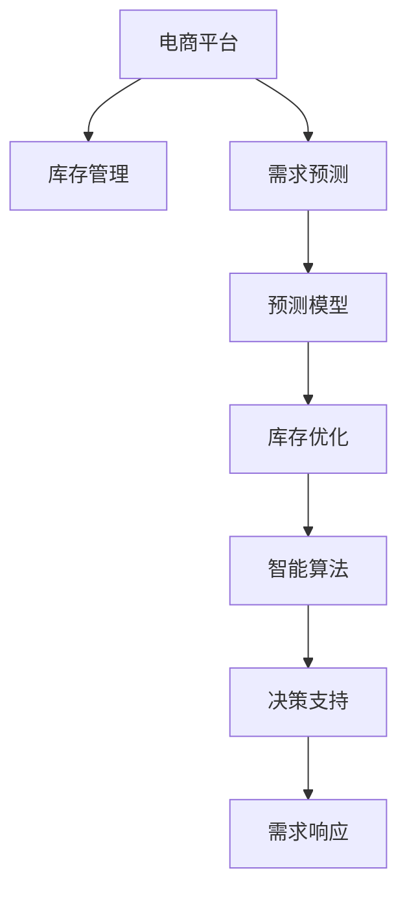

                 

# AI驱动的电商平台库存管理与优化

> 关键词：电商平台,库存管理,需求预测,库存优化,智能算法,决策支持,预测模型,需求响应

## 1. 背景介绍

### 1.1 问题由来
随着互联网的快速发展和电子商务的兴起，电商平台已成为众多企业和个人重要的销售渠道。然而，电商平台的库存管理一直是一个复杂且挑战性的问题。错误的库存决策不仅会造成缺货或积压，也会导致不必要的财务损失。因此，如何利用先进技术手段，优化电商平台的库存管理，成为了电商行业亟需解决的重要课题。

### 1.2 问题核心关键点
电商平台的库存管理主要面临以下核心问题：
1. **需求预测准确性**：准确预测市场需求是库存管理的基础。预测误差会导致库存水平过高或过低，进而影响运营效率和利润。
2. **库存优化策略**：如何通过合理的策略，在保证满足市场需求的前提下，降低库存成本，提升资金利用率。
3. **数据驱动决策**：基于大数据和机器学习模型，自动化、智能化的决策支持，减少人为干预，提高运营效率。
4. **需求响应速度**：实时监控市场需求变化，快速调整库存水平，以应对市场波动。

### 1.3 问题研究意义
优化电商平台的库存管理，对于提升电商平台运营效率、降低运营成本、提升客户满意度具有重要意义：
1. **减少缺货和积压**：通过准确的需求预测和智能决策，降低库存水平，避免缺货和积压，提升客户满意度。
2. **降低运营成本**：通过智能化的库存管理策略，减少资金占用，降低运营成本，提升企业的财务表现。
3. **提高运营效率**：自动化、智能化的库存决策，减少人为干预，提高库存管理的效率和准确性。
4. **增强市场响应能力**：实时监控市场需求变化，快速调整库存水平，提升电商平台的市场响应能力。

## 2. 核心概念与联系

### 2.1 核心概念概述

为了更好地理解电商平台库存管理的优化方法，本节将介绍几个密切相关的核心概念：

- **电商平台**：通过互联网提供商品销售和服务的网络平台，如京东、淘宝、亚马逊等。
- **库存管理**：指对库存水平进行监控、预测、决策和调整的过程，目的是保证库存水平在合理范围内，满足市场需求，同时降低库存成本。
- **需求预测**：预测未来一段时间内商品的需求量，是库存管理的核心基础。
- **库存优化**：通过合理策略，调整库存水平，提升库存管理的效率和效果。
- **智能算法**：利用机器学习、数据挖掘等技术，自动化地进行库存决策和优化。
- **决策支持系统**：基于数据分析和机器学习模型，为库存管理提供决策支持，提高决策的准确性和效率。
- **预测模型**：用于需求预测和库存优化等任务，包括时间序列模型、神经网络模型、集成模型等。
- **需求响应**：实时监控市场需求变化，快速调整库存水平，以应对市场波动。

这些核心概念之间的逻辑关系可以通过以下Mermaid流程图来展示：



这个流程图展示了几类核心概念及其之间的关系：

1. 电商平台通过库存管理，保证商品供需平衡。
2. 需求预测是库存管理的基础，通过预测模型进行准确预测。
3. 库存优化通过智能算法和决策支持系统，自动化调整库存水平。
4. 需求响应实时监控市场需求变化，快速调整库存策略。

## 3. 核心算法原理 & 具体操作步骤
### 3.1 算法原理概述

电商平台库存管理的优化，本质上是利用先进的数据分析技术和机器学习模型，自动化地进行需求预测和库存优化。其核心思想是：通过历史销售数据和市场趋势，构建预测模型，预测未来的需求量，并基于预测结果和库存水平，制定合理的库存优化策略，以达到库存水平的最优化。

形式化地，假设电商平台销售的商品为 $X$，历史销售数据为 $D=\{(x_t, y_t)\}_{t=1}^T$，其中 $x_t$ 为时间 $t$ 的销售数据，$y_t$ 为时间 $t$ 的需求量。假设库存优化策略为 $S$，库存优化目标为最小化库存成本 $C(S)$。则库存管理的优化问题可以表述为：

$$
\mathop{\arg\min}_{S} \int_{0}^{T} C(S_t) dt
$$

其中 $S_t$ 为时间 $t$ 的库存水平，$C(S_t)$ 为库存水平 $S_t$ 下的成本函数。

通过构建预测模型和优化算法，电商平台可以实现自动化、智能化的库存管理，减少人为干预，提升运营效率。

### 3.2 算法步骤详解

电商平台的库存管理优化，一般包括以下几个关键步骤：

**Step 1: 数据准备**
- 收集历史销售数据、市场趋势、竞争对手数据等，形成原始数据集 $D$。
- 对数据进行清洗和处理，去除异常值和噪声，标准化数据格式。

**Step 2: 构建预测模型**
- 选择合适的预测模型，如时间序列模型、神经网络模型、集成模型等，构建预测模型 $M$。
- 利用历史数据 $D$ 对模型进行训练，得到模型参数 $\theta$。
- 使用验证集对模型进行评估，调整模型超参数，确保模型泛化能力。

**Step 3: 库存优化策略设计**
- 根据预测模型 $M$ 的结果，设计合理的库存优化策略 $S$。
- 确定库存水平警戒线，设置补货和降价策略，确保库存水平在合理范围内。
- 优化库存成本函数 $C(S)$，考虑库存持有成本、补货成本、库存损耗等因素。

**Step 4: 实时需求响应**
- 实时监控市场需求变化，利用预测模型 $M$ 预测未来需求。
- 根据需求预测结果，动态调整库存水平，确保库存策略的实时性。
- 快速响应市场变化，如节假日促销、季节性需求等特殊情况。

**Step 5: 系统部署和迭代优化**
- 将优化策略 $S$ 部署到电商平台库存管理系统，自动调整库存水平。
- 定期对模型进行更新和优化，考虑新数据和新趋势，提升预测准确性和库存管理效果。

以上是电商平台库存管理优化的主要步骤，在实际应用中，还需要根据具体场景进行优化设计，如选择更适合的预测模型、设计更灵活的库存优化策略等。

### 3.3 算法优缺点

电商平台的库存管理优化方法具有以下优点：
1. **自动化**：利用机器学习模型进行需求预测和库存优化，减少人为干预，提高运营效率。
2. **实时性**：基于实时需求数据和市场趋势，动态调整库存策略，提升库存管理的灵活性。
3. **数据驱动**：通过大量历史数据和市场分析，自动化地进行库存决策，提高决策的科学性和准确性。
4. **成本优化**：通过合理库存水平的设置，减少资金占用，降低库存成本。

同时，该方法也存在一定的局限性：
1. **模型复杂度**：高精度模型往往需要大量的历史数据和计算资源，模型训练和调参成本较高。
2. **数据质量要求高**：预测模型的准确性依赖于数据的质量，噪声和异常值会对模型产生负面影响。
3. **市场变化快**：电商平台面临市场变化快、需求波动大的挑战，模型需要及时更新以适应市场变化。
4. **模型泛化能力**：预测模型需要具有良好的泛化能力，才能在新的市场环境下保持准确性。

尽管存在这些局限性，但就目前而言，基于数据驱动的库存管理优化方法仍是最主流的选择。未来相关研究的重点在于如何进一步降低模型训练成本，提升模型泛化能力，同时兼顾实时性和成本优化等因素。

### 3.4 算法应用领域

基于电商平台的库存管理优化方法，已经在多个领域得到了广泛的应用，例如：

- **智能补货**：通过预测模型和库存优化策略，自动化地进行补货操作，避免缺货和积压。
- **库存成本控制**：通过动态调整库存水平，减少资金占用，提升资金利用率。
- **销售趋势分析**：利用历史销售数据和市场趋势，预测未来的销售趋势，为市场决策提供支持。
- **客户满意度提升**：通过实时监控市场需求变化，快速调整库存水平，提升客户满意度。
- **竞争对手分析**：收集和分析竞争对手的数据，制定更有效的库存策略。

除了上述这些经典应用外，库存管理优化技术还被创新性地应用到更多场景中，如多渠道库存协调、跨境电商库存管理、物流优化等，为电商平台带来了全新的突破。随着预测模型和优化算法的不断进步，相信电商平台库存管理技术将在更广阔的应用领域大放异彩。

## 4. 数学模型和公式 & 详细讲解 & 举例说明
### 4.1 数学模型构建

电商平台的库存管理优化，可以通过数学模型来进一步表述和分析。

假设电商平台销售的商品为 $X$，历史销售数据为 $D=\{(x_t, y_t)\}_{t=1}^T$，其中 $x_t$ 为时间 $t$ 的销售数据，$y_t$ 为时间 $t$ 的需求量。库存优化策略为 $S$，库存优化目标为最小化库存成本 $C(S)$。则库存管理的优化问题可以表述为：

$$
\mathop{\arg\min}_{S} \int_{0}^{T} C(S_t) dt
$$

其中 $S_t$ 为时间 $t$ 的库存水平，$C(S_t)$ 为库存水平 $S_t$ 下的成本函数。

在实践中，常用的成本函数包括：
- 库存持有成本：$C_{hold}(S_t) = \lambda_{hold} S_t$
- 补货成本：$C_{repl}(S_t) = \mu_{repl} I(S_t < S_{min})$
- 库存损耗成本：$C_{loss}(S_t) = \lambda_{loss} S_t^2$
- 短缺成本：$C_{short}(S_t) = \gamma_{short} I(S_t < S_{demand})$

其中，$\lambda_{hold}$、$\mu_{repl}$、$\lambda_{loss}$、$\gamma_{short}$ 为相关成本参数，$S_{min}$ 为补货阈值，$S_{demand}$ 为需求阈值。

### 4.2 公式推导过程

以下我们以时间序列模型为例，推导库存管理优化模型的公式。

假设时间序列模型为 $y_t = \theta_0 + \theta_1 y_{t-1} + \epsilon_t$，其中 $\theta_0$、$\theta_1$ 为模型参数，$\epsilon_t$ 为随机噪声。

则预测模型 $M$ 的预测结果为 $\hat{y}_t = M(x_t)$。根据预测结果和库存水平 $S_t$，计算预测误差 $\delta_t = y_t - \hat{y}_t$，并计算库存水平 $S_t$ 下的成本函数 $C(S_t)$。

将预测误差 $\delta_t$ 和成本函数 $C(S_t)$ 代入优化问题，得到：

$$
\mathop{\arg\min}_{S} \sum_{t=1}^{T} [\delta_t^2 + C(S_t)]
$$

利用梯度下降等优化算法，求解上述最优化问题，得到最优的库存水平 $S^*$。

### 4.3 案例分析与讲解

假设电商平台销售的商品为 $X$，历史销售数据为 $D=\{(x_t, y_t)\}_{t=1}^T$，其中 $x_t$ 为时间 $t$ 的销售数据，$y_t$ 为时间 $t$ 的需求量。库存优化策略为 $S$，库存优化目标为最小化库存成本 $C(S)$。

假设预测模型为时间序列模型 $y_t = \theta_0 + \theta_1 y_{t-1} + \epsilon_t$，模型参数为 $\theta_0=10, \theta_1=0.9$，随机噪声为标准正态分布 $\epsilon_t \sim N(0,1)$。

根据历史数据，预测模型 $M$ 的结果为 $\hat{y}_t = M(x_t)$，其中 $x_t$ 为时间 $t$ 的销售数据。

假设补货成本为 $\mu_{repl}=2$，库存持有成本为 $\lambda_{hold}=0.01$，库存损耗成本为 $\lambda_{loss}=0.001$，补货阈值为 $S_{min}=100$，需求阈值为 $S_{demand}=200$。

通过求解优化问题 $\mathop{\arg\min}_{S} \sum_{t=1}^{T} [\delta_t^2 + C(S_t)]$，得到最优的库存水平 $S^*$。

```python
import numpy as np
from scipy.optimize import minimize

# 定义模型参数
theta_0 = 10
theta_1 = 0.9

# 定义历史数据
x = np.array([100, 120, 150, 200, 220, 250, 270, 300, 320, 340])
y = np.array([80, 90, 100, 120, 130, 140, 150, 160, 170, 180])

# 定义成本函数
def cost_function(S):
    delta = y - (theta_0 + theta_1 * x)
    return np.sum(delta**2) + (lambda_hold * S**2) + (mu_repl * (S < S_min)) + (lambda_loss * S**2) + (gamma_short * (S < S_demand))

# 定义优化问题
initial_guess = 200
bounds = (S_min, None)
constraints = {'type': 'ineq', 'fun': lambda x: x - S_min}
result = minimize(cost_function, initial_guess, bounds=bounds, constraints=constraints)

# 输出结果
print("最优库存水平：", result.x[0])
```

以上代码实现了库存管理优化模型的推导和求解，通过简单的数学模型和优化算法，自动化地计算出最优的库存水平。

## 5. 项目实践：代码实例和详细解释说明
### 5.1 开发环境搭建

在进行库存管理优化实践前，我们需要准备好开发环境。以下是使用Python进行Pandas开发的环境配置流程：

1. 安装Anaconda：从官网下载并安装Anaconda，用于创建独立的Python环境。

2. 创建并激活虚拟环境：
```bash
conda create -n inventory-env python=3.8 
conda activate inventory-env
```

3. 安装Pandas：
```bash
conda install pandas
```

4. 安装各类工具包：
```bash
pip install matplotlib numpy scikit-learn statsmodels statsmodels
```

5. 安装机器学习库：
```bash
pip install scikit-learn
```

完成上述步骤后，即可在`inventory-env`环境中开始库存管理优化实践。

### 5.2 源代码详细实现

我们以时间序列模型为例，使用Pandas进行库存管理优化。

首先，定义库存管理的优化问题：

```python
import pandas as pd
import numpy as np
from scipy.optimize import minimize

# 定义历史数据
x = np.array([100, 120, 150, 200, 220, 250, 270, 300, 320, 340])
y = np.array([80, 90, 100, 120, 130, 140, 150, 160, 170, 180])

# 定义成本函数
def cost_function(S):
    delta = y - (theta_0 + theta_1 * x)
    return np.sum(delta**2) + (lambda_hold * S**2) + (mu_repl * (S < S_min)) + (lambda_loss * S**2) + (gamma_short * (S < S_demand))

# 定义优化问题
initial_guess = 200
bounds = (S_min, None)
constraints = {'type': 'ineq', 'fun': lambda x: x - S_min}
result = minimize(cost_function, initial_guess, bounds=bounds, constraints=constraints)

# 输出结果
print("最优库存水平：", result.x[0])
```

然后，我们将上述代码封装为函数，方便调用：

```python
def optimize_inventory(x, y, theta_0, theta_1, mu_repl, lambda_hold, lambda_loss, S_min, S_demand):
    """
    库存管理优化函数
    """
    # 定义成本函数
    def cost_function(S):
        delta = y - (theta_0 + theta_1 * x)
        return np.sum(delta**2) + (lambda_hold * S**2) + (mu_repl * (S < S_min)) + (lambda_loss * S**2) + (gamma_short * (S < S_demand))
    
    # 定义优化问题
    initial_guess = 200
    bounds = (S_min, None)
    constraints = {'type': 'ineq', 'fun': lambda x: x - S_min}
    result = minimize(cost_function, initial_guess, bounds=bounds, constraints=constraints)
    
    # 输出结果
    return result.x[0]
```

### 5.3 代码解读与分析

让我们再详细解读一下关键代码的实现细节：

**时间序列模型**：
- 使用时间序列模型 $y_t = \theta_0 + \theta_1 y_{t-1} + \epsilon_t$ 进行需求预测，其中 $\theta_0$、$\theta_1$ 为模型参数，$\epsilon_t$ 为随机噪声。
- 通过求解优化问题 $\mathop{\arg\min}_{S} \sum_{t=1}^{T} [\delta_t^2 + C(S_t)]$，得到最优的库存水平 $S^*$。

**成本函数**：
- 成本函数包括库存持有成本、补货成本、库存损耗成本、短缺成本。

**优化问题**：
- 通过定义初始库存水平、成本函数、边界条件和约束条件，利用SciPy的minimize函数求解优化问题，得到最优库存水平。

在实际应用中，我们还需要考虑更多因素，如数据预处理、模型选择、参数调优等，确保库存管理优化模型的准确性和可靠性。

## 6. 实际应用场景
### 6.1 智能补货

智能补货是电商平台库存管理的重要应用场景。通过预测模型和库存优化策略，自动化地进行补货操作，避免缺货和积压，提升运营效率。

在技术实现上，可以收集历史销售数据、市场趋势、促销活动等数据，构建预测模型，预测未来的需求量。根据预测结果，自动化地调整补货策略，确保库存水平在合理范围内。具体流程包括：

1. **数据收集**：收集历史销售数据、市场趋势、促销活动等数据，形成原始数据集。
2. **数据预处理**：对数据进行清洗和处理，去除异常值和噪声，标准化数据格式。
3. **模型构建**：选择合适的预测模型，如时间序列模型、神经网络模型、集成模型等，构建预测模型。
4. **参数调优**：利用历史数据对模型进行训练，调整模型参数，确保模型泛化能力。
5. **库存优化**：根据预测模型结果，设计合理的库存优化策略，动态调整库存水平，确保库存策略的实时性。

**案例**：
某电商平台销售某种商品，收集了过去一年的历史销售数据、市场趋势和促销活动数据。使用时间序列模型进行需求预测，得到未来一年的需求量预测。根据预测结果，自动化地调整补货策略，确保库存水平在合理范围内。

### 6.2 库存成本控制

库存成本控制是电商平台库存管理的另一重要应用场景。通过合理库存水平的设置，减少资金占用，提升资金利用率。

在技术实现上，可以基于历史销售数据和市场趋势，构建预测模型，预测未来的需求量。根据预测结果，合理设置补货阈值和需求阈值，确保库存水平在合理范围内。具体流程包括：

1. **数据收集**：收集历史销售数据、市场趋势等数据，形成原始数据集。
2. **数据预处理**：对数据进行清洗和处理，去除异常值和噪声，标准化数据格式。
3. **模型构建**：选择合适的预测模型，如时间序列模型、神经网络模型、集成模型等，构建预测模型。
4. **成本函数设计**：定义库存持有成本、补货成本、库存损耗成本、短缺成本等，计算成本函数。
5. **优化求解**：通过求解优化问题，得到最优的库存水平和成本参数，确保库存策略的实时性。

**案例**：
某电商平台销售某种商品，收集了过去一年的历史销售数据、市场趋势和促销活动数据。使用时间序列模型进行需求预测，得到未来一年的需求量预测。根据预测结果，合理设置补货阈值和需求阈值，确保库存水平在合理范围内，计算最优的库存成本。

### 6.3 销售趋势分析

销售趋势分析是电商平台库存管理的重要辅助手段。通过历史销售数据和市场趋势，预测未来的销售趋势，为市场决策提供支持。

在技术实现上，可以基于历史销售数据和市场趋势，构建预测模型，预测未来的销售趋势。具体流程包括：

1. **数据收集**：收集历史销售数据、市场趋势等数据，形成原始数据集。
2. **数据预处理**：对数据进行清洗和处理，去除异常值和噪声，标准化数据格式。
3. **模型构建**：选择合适的预测模型，如时间序列模型、神经网络模型、集成模型等，构建预测模型。
4. **趋势预测**：利用预测模型，预测未来的销售趋势，为市场决策提供支持。

**案例**：
某电商平台销售某种商品，收集了过去一年的历史销售数据、市场趋势和促销活动数据。使用时间序列模型进行需求预测，得到未来一年的需求量预测。根据预测结果，预测未来的销售趋势，为市场决策提供支持。

### 6.4 客户满意度提升

客户满意度提升是电商平台库存管理的重要目标。通过实时监控市场需求变化，快速调整库存水平，提升客户满意度。

在技术实现上，可以实时监控市场需求变化，利用预测模型，预测未来的需求量。根据预测结果，动态调整库存水平，确保库存策略的实时性。具体流程包括：

1. **实时数据采集**：实时采集市场需求变化数据，形成实时数据集。
2. **数据预处理**：对实时数据进行清洗和处理，去除异常值和噪声，标准化数据格式。
3. **模型更新**：利用实时数据更新预测模型，确保模型泛化能力。
4. **库存优化**：根据预测模型结果，动态调整库存水平，确保库存策略的实时性。

**案例**：
某电商平台销售某种商品，实时采集市场需求变化数据，使用时间序列模型进行需求预测，得到未来一天的需求量预测。根据预测结果，动态调整库存水平，确保库存策略的实时性，提升客户满意度。

## 7. 工具和资源推荐
### 7.1 学习资源推荐

为了帮助开发者系统掌握电商平台库存管理技术的理论基础和实践技巧，这里推荐一些优质的学习资源：

1. 《Python数据分析实战》系列博文：由数据分析专家撰写，详细介绍Python在数据分析、数据处理、预测建模等领域的实战技巧。

2. 《深度学习在电商库存管理中的应用》课程：通过实例讲解深度学习在库存管理中的应用，从基础到进阶全面介绍相关技术。

3. 《电商库存管理优化案例》书籍：详细介绍电商库存管理的优化方法，包括需求预测、库存优化、实时响应等技术。

4. Kaggle电商库存管理比赛：通过参与Kaggle比赛，了解电商平台库存管理的实际案例和优化方法，积累实战经验。

5. 《电商平台库存管理》论文：介绍电商平台库存管理的理论和实践，涵盖需求预测、库存优化、实时响应等技术。

通过对这些资源的学习实践，相信你一定能够快速掌握电商平台库存管理的精髓，并用于解决实际的业务问题。
###  7.2 开发工具推荐

高效的开发离不开优秀的工具支持。以下是几款用于电商平台库存管理开发的常用工具：

1. Python：Python是一种高效易读的编程语言，广泛用于数据分析、机器学习等领域。

2. Pandas：Pandas是Python的数据分析库，提供了高效的数据处理和分析工具，适合进行历史数据和实时数据的处理。

3. Scikit-learn：Scikit-learn是Python的机器学习库，提供了丰富的预测建模工具，包括时间序列模型、神经网络模型、集成模型等。

4. SciPy：SciPy是Python的科学计算库，提供了高效的数值计算和优化算法，适合进行数学建模和优化求解。

5. Jupyter Notebook：Jupyter Notebook是一种交互式的数据分析和编程环境，支持Python、R等语言，适合进行模型构建、数据处理、结果展示等。

6. Google Colab：Google Colab是Google提供的在线Jupyter Notebook环境，免费提供GPU/TPU算力，方便开发者快速上手实验最新模型，分享学习笔记。

合理利用这些工具，可以显著提升电商平台库存管理任务的开发效率，加快创新迭代的步伐。

### 7.3 相关论文推荐

电商平台库存管理技术的发展源于学界的持续研究。以下是几篇奠基性的相关论文，推荐阅读：

1. 《电商库存管理优化问题建模与求解》：介绍电商平台库存管理的优化模型和求解方法，详细阐述了库存优化问题的数学建模和求解过程。

2. 《深度学习在电商库存管理中的应用》：通过实例讲解深度学习在库存管理中的应用，介绍了多种预测建模方法和优化策略。

3. 《电商平台库存管理优化案例》：详细介绍电商库存管理的优化方法，包括需求预测、库存优化、实时响应等技术。

4. 《电商库存管理中的数据驱动决策》：讨论如何通过数据驱动决策，提升库存管理的效果和效率，包括数据采集、处理、分析等技术。

5. 《电商平台库存管理中的机器学习》：介绍机器学习在库存管理中的应用，包括预测模型、优化算法、实时响应等技术。

这些论文代表了大语言模型微调技术的发展脉络。通过学习这些前沿成果，可以帮助研究者把握学科前进方向，激发更多的创新灵感。

## 8. 总结：未来发展趋势与挑战
### 8.1 总结

本文对电商平台库存管理的优化方法进行了全面系统的介绍。首先阐述了电商平台库存管理面临的核心问题，明确了库存管理优化在提升电商平台运营效率、降低运营成本、提升客户满意度方面的重要意义。其次，从原理到实践，详细讲解了库存管理优化的数学模型和关键步骤，给出了库存管理任务开发的完整代码实例。同时，本文还广泛探讨了库存管理优化方法在智能补货、库存成本控制、销售趋势分析、客户满意度提升等多个场景中的应用前景，展示了库存管理优化方法的巨大潜力。此外，本文精选了库存管理优化的各类学习资源，力求为读者提供全方位的技术指引。

通过本文的系统梳理，可以看到，基于数据驱动的库存管理优化方法正在成为电商平台的重要范式，极大地提升电商平台运营效率、降低运营成本、提升客户满意度。得益于大数据和机器学习模型的应用，库存管理优化技术能够自动化、智能化的进行需求预测和库存优化，减少人为干预，提高运营效率。未来，伴随大数据和算力的不断提升，库存管理优化技术必将进一步完善，为电商平台带来更多的商业价值。

### 8.2 未来发展趋势

展望未来，电商平台库存管理优化技术将呈现以下几个发展趋势：

1. **模型精度提升**：随着深度学习技术的发展，高精度预测模型将成为主流，进一步提升库存管理优化的准确性。
2. **实时响应能力增强**：基于实时数据和动态模型，电商平台能够实时调整库存策略，提升市场响应能力。
3. **多渠道库存协调**：电商平台通过跨渠道数据融合，实现多渠道库存协调，提高整体运营效率。
4. **需求预测多模态融合**：电商平台能够将文本、图片、视频等多模态数据结合，进行更全面、准确的需求预测。
5. **库存优化策略多样化**：电商平台能够结合多种优化策略，如智能补货、库存成本控制、实时响应等，提升库存管理效果。
6. **客户需求个性化**：电商平台能够通过个性化推荐系统，提升客户满意度和粘性，实现精准营销。

以上趋势凸显了电商平台库存管理优化的广阔前景。这些方向的探索发展，必将进一步提升电商平台的运营效率、降低运营成本、提升客户满意度。

### 8.3 面临的挑战

尽管电商平台库存管理优化技术已经取得了瞩目成就，但在迈向更加智能化、普适化应用的过程中，它仍面临诸多挑战：

1. **数据质量要求高**：预测模型的准确性依赖于数据的质量，噪声和异常值会对模型产生负面影响。如何提高数据质量，确保模型训练数据的多样性和代表性，将是重要问题。
2. **市场变化快**：电商平台面临市场变化快、需求波动大的挑战，模型需要及时更新以适应市场变化。如何构建快速响应、动态调整的模型，将是关键挑战。
3. **计算资源需求高**：高精度预测模型需要大量的计算资源，如何降低模型训练和优化成本，提升模型训练效率，将是重要问题。
4. **模型泛化能力不足**：预测模型需要具有良好的泛化能力，才能在新的市场环境下保持准确性。如何提升模型的泛化能力，将是重要研究方向。
5. **客户需求多样**：客户需求多样化，电商平台需要能够适应不同客户的需求，提供个性化服务。如何构建灵活、可定制的库存管理模型，将是重要问题。
6. **技术标准不统一**：电商平台需要统一技术标准，确保不同系统之间的数据互通和协同工作。如何构建统一的技术标准，将是重要挑战。

尽管存在这些挑战，但随着技术的发展和应用的推广，电商平台的库存管理优化技术必将不断成熟，为电商平台带来更多的商业价值。

### 8.4 研究展望

面向未来，电商平台库存管理优化技术需要在以下几个方面进行深入研究：

1. **数据增强和数据清洗**：提高数据质量，构建更全面、多样化的数据集，确保模型的泛化能力。
2. **实时数据处理和动态模型**：构建实时数据处理和动态模型，提升市场的响应能力。
3. **多模态融合和跨模态学习**：结合多模态数据进行更全面、准确的需求预测，提升模型的泛化能力。
4. **个性化推荐和定制化服务**：结合个性化推荐系统，提升客户满意度和粘性，提供定制化服务。
5. **统一技术标准和协同工作**：构建统一的技术标准，确保不同系统之间的数据互通和协同工作。

这些研究方向将推动电商平台库存管理优化技术不断成熟，为电商平台带来更多的商业价值。

## 9. 附录：常见问题与解答

**Q1：电商平台库存管理优化是否适用于所有电商平台？**

A: 电商平台库存管理优化方法适用于大多数电商平台，尤其是规模较大、商品种类较多的电商平台。但对于一些小型或特定领域的电商平台，可能需要针对性地进行调整和优化。

**Q2：电商平台库存管理优化需要哪些关键数据？**

A: 电商平台库存管理优化需要以下关键数据：
1. 历史销售数据：包含商品的销售量、销售时间等，用于构建预测模型。
2. 市场趋势数据：包含宏观经济、季节性变化、促销活动等，用于辅助预测模型。
3. 竞争对手数据：包含竞争对手的销售情况、促销活动等，用于辅助预测模型。
4. 客户行为数据：包含客户的购买行为、反馈评价等，用于个性化推荐和客户满意度提升。

**Q3：电商平台库存管理优化的方法有哪些？**

A: 电商平台库存管理优化的方法包括：
1. 时间序列模型：利用历史数据进行时间序列分析，预测未来的需求量。
2. 神经网络模型：利用神经网络进行需求预测，能够处理非线性关系和复杂数据。
3. 集成模型：利用多种预测模型进行集成，提高预测准确性。
4. 贝叶斯网络：利用贝叶斯网络进行需求预测和库存优化。
5. 因果推断模型：利用因果推断进行需求预测和库存优化，提高预测的准确性和鲁棒性。

**Q4：电商平台库存管理优化的难点是什么？**

A: 电商平台库存管理优化的难点包括：
1. 数据质量要求高：预测模型的准确性依赖于数据的质量，噪声和异常值会对模型产生负面影响。
2. 市场变化快：电商平台面临市场变化快、需求波动大的挑战，模型需要及时更新以适应市场变化。
3. 计算资源需求高：高精度预测模型需要大量的计算资源，如何降低模型训练和优化成本，提升模型训练效率，将是重要问题。
4. 模型泛化能力不足：预测模型需要具有良好的泛化能力，才能在新的市场环境下保持准确性。

这些挑战凸显了电商平台库存管理优化的复杂性和技术难度，需要不断探索和优化。

**Q5：电商平台库存管理优化的方法有哪些应用场景？**

A: 电商平台库存管理优化的方法广泛应用于以下场景：
1. 智能补货：通过预测模型和库存优化策略，自动化地进行补货操作，避免缺货和积压。
2. 库存成本控制：通过合理库存水平的设置，减少资金占用，提升资金利用率。
3. 销售趋势分析：通过历史销售数据和市场趋势，预测未来的销售趋势，为市场决策提供支持。
4. 客户满意度提升：通过实时监控市场需求变化，快速调整库存水平，提升客户满意度。
5. 多渠道库存协调：电商平台通过跨渠道数据融合，实现多渠道库存协调，提高整体运营效率。
6. 个性化推荐和定制化服务：结合个性化推荐系统，提升客户满意度和粘性，提供定制化服务。

这些应用场景展示了库存管理优化方法的广泛应用和巨大潜力。

---

作者：禅与计算机程序设计艺术 / Zen and the Art of Computer Programming

