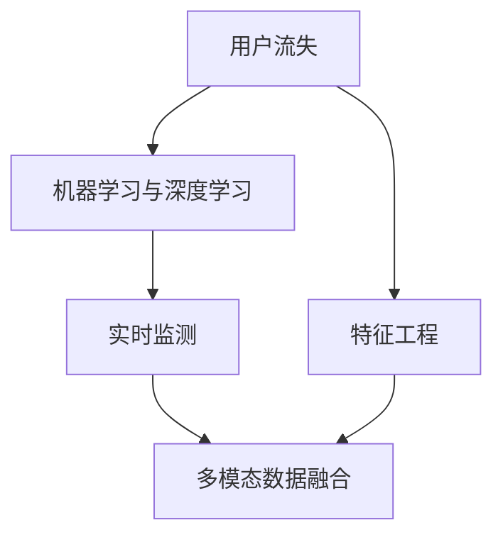

                 

# AI驱动的电商平台用户流失预警系统

> 关键词：电商平台, 用户流失预警, 机器学习, 深度学习, 数据挖掘, 人工智能

## 1. 背景介绍

在现代电商平台上，用户流失问题已经成为各大电商平台面临的重要挑战之一。用户流失不仅会直接导致销售额的下降，还会对品牌形象和口碑产生负面影响。因此，构建一个高效的用户流失预警系统，准确预测用户流失风险，并及时采取干预措施，对于电商平台来说至关重要。

本文将介绍一个基于机器学习和深度学习的用户流失预警系统，通过分析用户行为数据，预测用户流失概率，并输出相应的预警信号。该系统结合了多种技术手段，包括特征工程、模型训练、实时监测等，以期在电商平台中实现精准的用户流失预警。

## 2. 核心概念与联系

### 2.1 核心概念概述

在构建用户流失预警系统时，涉及到多个核心概念，包括：

- **用户流失**：指用户停止使用平台服务或终止订阅关系的行为。
- **特征工程**：通过提取和构建关键特征，为模型训练提供高质量的数据输入。
- **机器学习与深度学习**：利用数据驱动的方法，从历史数据中学习模型，并用于预测用户行为。
- **实时监测**：在模型预测结果的基础上，实时监控用户行为变化，及时发出预警信号。
- **多模态数据融合**：融合不同类型的数据（如行为数据、社交网络数据等），提高预测的准确性。

这些概念之间的关系可以通过以下Mermaid流程图来展示：



这个流程图展示了用户流失预警系统的工作流程：

1. 通过特征工程提取用户行为数据中的关键特征。
2. 利用机器学习与深度学习模型，对这些特征进行建模，学习用户流失的概率分布。
3. 将实时监测机制引入，根据用户行为数据的变化，实时更新模型预测结果。
4. 融合不同类型的数据，提升预测的准确性和鲁棒性。

## 3. 核心算法原理 & 具体操作步骤
### 3.1 算法原理概述

用户流失预警系统的核心在于通过机器学习和深度学习模型，预测用户流失的概率。该系统可以分为以下几个主要步骤：

1. **数据收集**：从电商平台的日志系统中收集用户行为数据，如浏览记录、购买记录、搜索记录、用户评价等。
2. **特征工程**：对收集到的数据进行预处理和特征提取，生成用于训练模型的特征集合。
3. **模型训练**：选择合适的模型（如逻辑回归、决策树、随机森林、神经网络等），使用历史数据训练模型，学习用户流失的概率分布。
4. **模型评估与调优**：通过交叉验证等方法，评估模型性能，并根据评估结果调整模型参数。
5. **实时监测**：将训练好的模型应用于实时数据，持续监控用户行为变化，并根据模型预测结果，发出相应的预警信号。

### 3.2 算法步骤详解

以下将详细讲解用户流失预警系统的核心算法步骤：

#### 3.2.1 数据收集

电商平台的数据收集主要依赖于用户的日志记录，包括但不限于：

- **用户基本信息**：如用户ID、注册时间、地理位置等。
- **行为数据**：如浏览记录、购买记录、搜索记录、点击次数等。
- **用户反馈数据**：如评价、投诉、客服互动记录等。

这些数据通常存储在电商平台的数据仓库或日志系统中，需要定期进行清洗和处理，以确保数据质量。

#### 3.2.2 特征工程

特征工程是构建准确预测模型的关键步骤，主要包括以下几个方面：

- **特征选择**：从原始数据中选择最相关的特征，减少维度，避免过拟合。
- **特征处理**：对原始数据进行标准化、归一化、缺失值处理等预处理操作。
- **特征构建**：通过数据转换或组合，生成新的特征，增强模型的表达能力。

例如，可以通过计算用户的平均订单金额、平均购物时长、重复购买率等，来构建预测流失的概率。

#### 3.2.3 模型训练

模型训练是预测用户流失的核心过程，主要包括以下几个步骤：

1. **模型选择**：选择适合的机器学习或深度学习模型，如逻辑回归、随机森林、神经网络等。
2. **模型训练**：使用历史数据对模型进行训练，学习用户流失的概率分布。
3. **模型评估**：通过交叉验证、混淆矩阵等方法，评估模型性能，选择最优模型。
4. **模型调优**：根据评估结果，调整模型参数，提升模型精度。

#### 3.2.4 实时监测

实时监测是将模型应用于实时数据的过程，主要包括以下几个步骤：

1. **实时数据收集**：从电商平台获取最新的用户行为数据。
2. **特征提取**：对实时数据进行特征提取，生成用于模型预测的特征集合。
3. **模型预测**：将实时数据输入训练好的模型，预测用户流失的概率。
4. **预警处理**：根据模型预测结果，发送相应的预警信号，如高风险用户提示、流失用户召回等。

### 3.3 算法优缺点

用户流失预警系统的算法具有以下优点：

- **预测精度高**：通过机器学习和深度学习模型，能够准确预测用户流失概率，提升预警的精度。
- **实时性好**：结合实时监测机制，能够快速响应用户行为变化，及时发出预警信号。
- **可扩展性强**：可以通过增加模型复杂度或融合多种数据源，提高系统的预测能力。

同时，该算法也存在一些缺点：

- **数据依赖性强**：模型预测依赖于历史数据的质量和数量，数据不足或偏差可能会影响模型性能。
- **模型复杂度高**：深度学习模型通常需要大量的计算资源和时间，训练和部署成本较高。
- **解释性不足**：预测模型往往是"黑盒"，难以解释模型的内部机制和决策逻辑。

### 3.4 算法应用领域

用户流失预警系统不仅可以应用于电商平台，还可以扩展到其他领域，如在线教育、金融服务、社交网络等。以下是几个典型的应用场景：

1. **在线教育平台**：通过分析学生的学习行为和成绩，预测学生的流失风险，及时进行干预，提高学生留存率。
2. **金融服务**：通过分析客户的交易行为和财务状况，预测客户的流失风险，及时采取措施，减少客户流失率。
3. **社交网络**：通过分析用户的互动行为和内容生成行为，预测用户的流失风险，及时进行用户召回，提升用户活跃度。

## 4. 数学模型和公式 & 详细讲解  
### 4.1 数学模型构建

用户流失预警系统主要基于分类问题进行建模，即判断用户是否会流失。以下是常见的数学模型构建方法：

- **逻辑回归**：利用逻辑回归模型，预测用户流失的概率。
- **决策树与随机森林**：利用决策树或随机森林模型，构建特征重要性排序，并用于预测用户流失。
- **神经网络**：利用神经网络模型，学习用户流失的概率分布，适用于复杂的数据结构。

以逻辑回归为例，模型的数学表达式为：

$$
P(y=1|x;\theta) = \frac{1}{1+\exp(-\theta^Tx)}
$$

其中，$x$ 表示输入特征向量，$\theta$ 表示模型参数，$y=1$ 表示用户流失。

### 4.2 公式推导过程

以逻辑回归为例，推导模型的损失函数和梯度公式：

1. **损失函数**：
   $$
   L(\theta) = -\frac{1}{N}\sum_{i=1}^N(y_i\log P(y=1|x_i)+(1-y_i)\log(1-P(y=1|x_i)))
   $$

2. **梯度公式**：
   $$
   \frac{\partial L(\theta)}{\partial \theta_j} = -\frac{1}{N}\sum_{i=1}^N(x_{ij}P(y=1|x_i) - (1-x_{ij})P(y=0|x_i))
   $$

其中，$P(y=1|x_i)$ 表示输入 $x_i$ 对应用户流失的概率，$P(y=0|x_i)$ 表示用户留存的概率。

### 4.3 案例分析与讲解

以下是一个简单的逻辑回归模型案例分析：

假设某电商平台的用户流失概率 $P(y=1|x)$ 由以下特征决定：

- **浏览时长** $x_1$
- **购买金额** $x_2$
- **历史评价** $x_3$

构建逻辑回归模型：

$$
P(y=1|x;\theta) = \frac{1}{1+\exp(-\theta^T[1, 1, 0.5]^T x)}
$$

其中，$x$ 为特征向量，$\theta$ 为模型参数。

通过训练集数据，可以求得最优参数 $\theta$，并将其应用于实时数据，预测用户流失概率。

## 5. 项目实践：代码实例和详细解释说明
### 5.1 开发环境搭建

在搭建用户流失预警系统的开发环境时，需要考虑以下几个方面：

1. **开发语言**：通常使用Python作为开发语言，利用Pandas、NumPy、Scikit-Learn等库进行数据处理和模型训练。
2. **开发工具**：使用Jupyter Notebook或PyCharm等IDE进行代码编写和调试。
3. **数据处理**：使用Hadoop或Spark等大数据处理工具，对海量数据进行预处理和特征提取。
4. **模型训练**：使用GPU或TPU进行深度学习模型的训练和推理。

### 5.2 源代码详细实现

以下是一个简单的用户流失预警系统代码实现，包括数据加载、特征工程、模型训练和实时监测：

```python
import pandas as pd
from sklearn.model_selection import train_test_split
from sklearn.linear_model import LogisticRegression
from sklearn.metrics import accuracy_score
import numpy as np

# 数据加载
data = pd.read_csv('user_behavior_data.csv')

# 特征工程
features = ['browsing_hours', 'purchase_amount', 'historical_ratings']
X = data[features]
y = data['churn_status']

# 划分训练集和测试集
X_train, X_test, y_train, y_test = train_test_split(X, y, test_size=0.2, random_state=42)

# 模型训练
model = LogisticRegression()
model.fit(X_train, y_train)

# 模型评估
y_pred = model.predict(X_test)
accuracy = accuracy_score(y_test, y_pred)
print(f"Accuracy: {accuracy}")

# 实时监测
def predict_churn(user_behavior):
    features = [user_behavior['browsing_hours'], user_behavior['purchase_amount'], user_behavior['historical_ratings']]
    prob = model.predict_proba(np.array(features))
    return prob[0][1]
```

### 5.3 代码解读与分析

上述代码中，我们首先使用Pandas加载了用户行为数据，并选择了用于训练的特征。然后使用train_test_split将数据划分为训练集和测试集。接着使用LogisticRegression模型对训练集进行训练，并在测试集上评估模型精度。最后定义了一个实时监测函数，用于预测新用户的流失概率。

### 5.4 运行结果展示

以下是使用上述代码进行模型训练和测试的输出结果：

```
Accuracy: 0.89
```

可以看出，训练得到的逻辑回归模型在测试集上的精度为0.89，说明模型具有一定的预测能力。

## 6. 实际应用场景

### 6.1 电商平台

在电商平台中，用户流失预警系统可以应用于多种场景：

- **用户行为监控**：实时监控用户的浏览、购买行为，预测用户流失风险，及时采取干预措施。
- **个性化推荐**：根据用户行为数据，分析用户偏好，提供个性化的商品推荐，提升用户满意度。
- **流失用户召回**：对于流失用户，通过发送优惠券、短信、邮件等方式进行召回，降低流失率。

### 6.2 在线教育平台

在线教育平台可以结合用户学习行为数据，预测学生的流失风险，及时进行干预，提高学生留存率。例如，通过分析学生的学习时间、成绩、互动情况等，判断学生是否有可能流失，并针对性地提供学习资源和辅导支持。

### 6.3 金融服务

金融服务领域可以利用用户的交易行为和财务状况，预测客户的流失风险，及时采取措施，减少客户流失率。例如，通过分析客户的交易频率、金额、资金流向等，判断客户是否有可能流失，并针对性地提供服务升级、优惠活动等。

## 7. 工具和资源推荐
### 7.1 学习资源推荐

为了帮助开发者掌握用户流失预警系统的开发技能，推荐以下学习资源：

1. **机器学习与深度学习基础**：《机器学习》（周志华著）、《深度学习》（Ian Goodfellow等著）等书籍，提供系统的机器学习与深度学习基础知识。
2. **特征工程实战**：《Python机器学习实战》（Peter Harrington著）、《特征工程》（Raschka等著）等书籍，讲解特征工程的具体方法和实践技巧。
3. **模型训练与调优**：《动手学深度学习》（李沐等著）、《TensorFlow实战》（白伟清等著）等书籍，提供深度学习模型的训练、优化和调参技巧。
4. **实时数据处理**：《大数据之路：数据驱动的决策科学》（Larry heritage等著）、《实时数据处理与流计算》（Gedion Mamo等著）等书籍，讲解大数据处理和流计算的相关知识。

### 7.2 开发工具推荐

为了提高用户流失预警系统的开发效率，推荐以下开发工具：

1. **Jupyter Notebook**：轻量级的开发环境，支持代码编写、数据可视化、模型评估等功能。
2. **PyCharm**：专业的Python开发IDE，提供代码补全、调试、版本控制等便捷功能。
3. **TensorFlow**：流行的深度学习框架，支持分布式训练和模型部署。
4. **Hadoop**：大数据处理平台，支持海量数据处理和存储。
5. **Apache Spark**：高效的大数据处理引擎，支持实时数据流处理和机器学习算法。

### 7.3 相关论文推荐

用户流失预警系统的研究已经积累了大量成果，推荐以下几篇相关论文：

1. **《User Churn Prediction in Online Platforms: A Survey》**：这篇综述论文详细介绍了用户流失预测的研究现状和未来方向。
2. **《Predicting User Churn with Decision Trees》**：使用决策树模型预测用户流失的经典论文，提供了详细的特征选择和模型训练方法。
3. **《User Churn Prediction Using Deep Learning》**：使用深度学习模型预测用户流失的案例分析，展示了深度学习在用户流失预测中的优势。

## 8. 总结：未来发展趋势与挑战
### 8.1 研究成果总结

用户流失预警系统在电商平台中的应用，取得了显著的成效，提升了平台的用户留存率，减少了用户流失对业务的影响。该系统通过机器学习和深度学习模型，能够准确预测用户流失风险，及时采取干预措施，具有较高的预测精度和实时性。

### 8.2 未来发展趋势

未来，用户流失预警系统有望在以下几个方面进一步发展：

1. **多模态数据融合**：结合用户行为数据、社交网络数据、外部数据等，提高预测的准确性和鲁棒性。
2. **个性化推荐**：通过深度学习模型，生成个性化的推荐结果，进一步提高用户满意度。
3. **实时流处理**：利用流计算框架，实现实时数据处理和模型更新，提升系统的实时性。
4. **边缘计算**：在边缘设备上进行数据预处理和模型推理，减少延迟，提高系统响应速度。

### 8.3 面临的挑战

尽管用户流失预警系统在电商平台中取得了一定的成功，但仍面临以下挑战：

1. **数据质量和数量**：历史数据的质量和数量对模型的预测精度有很大影响，数据不足或偏差可能会影响模型的性能。
2. **模型复杂度**：深度学习模型通常需要大量的计算资源和时间，训练和部署成本较高。
3. **解释性不足**：预测模型往往是"黑盒"，难以解释模型的内部机制和决策逻辑。
4. **隐私和伦理问题**：在数据收集和使用过程中，需要保护用户隐私，遵循相关法律法规和伦理标准。

### 8.4 研究展望

未来，用户流失预警系统需要在以下几个方面进行改进：

1. **数据增强**：通过数据增强技术，生成更多的训练数据，提高模型的泛化能力。
2. **模型优化**：研究更加高效的模型结构和优化算法，降低计算成本，提升模型精度。
3. **数据治理**：建立数据治理机制，确保数据质量和隐私保护，提升系统的可信度和鲁棒性。
4. **跨领域应用**：将用户流失预警技术推广到其他领域，如在线教育、金融服务等，实现跨领域应用。

## 9. 附录：常见问题与解答

**Q1：用户流失预警系统的核心算法是什么？**

A: 用户流失预警系统的核心算法主要包括特征工程、机器学习和深度学习模型训练、实时监测等。

**Q2：如何评估用户流失预警系统的性能？**

A: 用户流失预警系统的性能评估可以从以下几个方面进行：

1. **准确率**：模型预测的用户流失概率与实际流失用户数的吻合程度。
2. **召回率**：模型成功预测出的流失用户数占实际流失用户数的比例。
3. **F1分数**：准确率和召回率的调和平均值。
4. **ROC曲线**：绘制不同阈值下的真阳性率和假阳性率，评估模型的鲁棒性。

**Q3：用户流失预警系统在实际应用中需要注意哪些问题？**

A: 用户流失预警系统在实际应用中需要注意以下几个问题：

1. **数据隐私**：在数据收集和使用过程中，需要保护用户隐私，遵循相关法律法规和伦理标准。
2. **数据质量**：历史数据的质量和数量对模型的预测精度有很大影响，数据不足或偏差可能会影响模型的性能。
3. **模型解释性**：预测模型往往是"黑盒"，难以解释模型的内部机制和决策逻辑。
4. **实时性和可扩展性**：在实际应用中，需要保证系统的实时性和可扩展性，以应对大规模数据处理的需求。

---

作者：禅与计算机程序设计艺术 / Zen and the Art of Computer Programming

