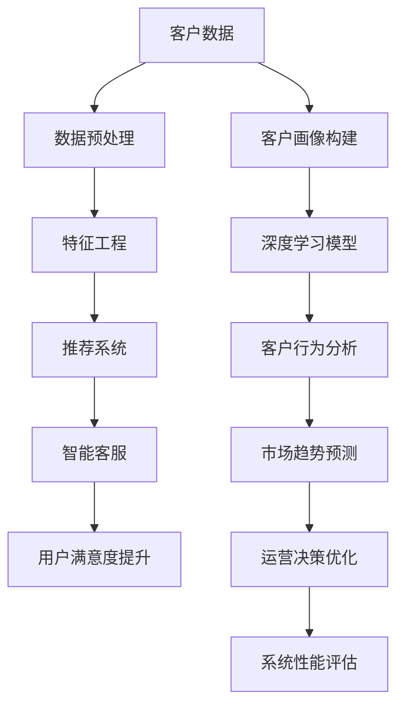

                 

# AI驱动的电商智能客户洞察系统

> 关键词：电商客户洞察,智能系统,机器学习,深度学习,推荐系统,客户行为分析,自然语言处理

## 1. 背景介绍

### 1.1 问题由来
随着电商行业的发展，企业需要更加深入地理解其客户的购买行为和需求，以便精准营销、优化商品推荐、提升用户体验。传统的客户洞察方法往往依赖于统计分析和人工调研，不仅耗时耗力，效果也难以量化。然而，随着AI和大数据技术的普及，企业开始探索利用机器学习、深度学习等先进技术，对客户数据进行深度挖掘，以实现更加精细化的客户洞察和智能化决策。

### 1.2 问题核心关键点
为了更好地帮助电商企业构建智能客户洞察系统，我们提出了基于机器学习和深度学习的电商智能客户洞察方案。该方案通过分析客户行为数据，挖掘其背后的潜藏需求，实现精准推荐、个性化营销和智能客服等功能，从而提升电商企业的市场竞争力和用户体验。

### 1.3 问题研究意义
构建基于AI的电商智能客户洞察系统，对于提升电商企业的市场竞争力、优化客户体验和提升营销效果具有重要意义：

1. 精准推荐：通过对客户行为数据的深入分析，实现个性化商品推荐，提升购买转化率。
2. 个性化营销：基于客户画像和行为数据，实现精准广告投放和个性化内容推送，提升客户粘性。
3. 智能客服：通过自然语言处理技术，实现智能客服系统，提升用户咨询响应速度和满意度。
4. 多渠道统一管理：实现多渠道数据整合和分析，统一客户视角，提供全面、一致的客户洞察。
5. 客户行为分析：通过对客户行为数据的综合分析，挖掘潜在需求，预测市场趋势，优化产品和服务。

通过AI驱动的智能客户洞察系统，电商企业可以更全面、深入地理解其客户需求，优化运营决策，提升市场竞争力。

## 2. 核心概念与联系

### 2.1 核心概念概述

在构建电商智能客户洞察系统时，我们需要明确以下几个核心概念：

- **电商客户洞察**：通过对客户数据的深入分析，挖掘客户需求和行为模式，实现精准营销和个性化服务。
- **机器学习和深度学习**：利用统计学和神经网络模型，从数据中提取知识，提升决策的智能化水平。
- **推荐系统**：通过分析用户行为和偏好，推荐最适合的商品和服务，提升用户体验和满意度。
- **客户行为分析**：通过分析客户行为数据，挖掘潜在的购买动机和需求，优化产品和服务。
- **智能客服**：利用自然语言处理技术，实现自动问答、情感分析、意图识别等功能，提升用户互动效率和满意度。
- **多渠道统一管理**：实现不同渠道数据整合和分析，提供统一的客户视角和洞察。

这些核心概念之间的逻辑关系可以通过以下Mermaid流程图来展示：

这个流程图展示了电商智能客户洞察系统的核心组件及其逻辑关系：

1. 收集客户数据，进行预处理和特征工程。
2. 构建客户画像，分析客户行为，使用深度学习模型挖掘客户需求。
3. 实现推荐系统，实现个性化商品推荐。
4. 开发智能客服，提升用户互动效率。
5. 利用客户行为分析，挖掘市场趋势，优化运营决策。
6. 持续评估系统性能，优化提升。

这些组件共同构成了电商智能客户洞察系统的工作框架，使其能够全面、深入地理解客户需求，实现精准营销和个性化服务。

## 3. 核心算法原理 & 具体操作步骤
### 3.1 算法原理概述

基于机器学习和深度学习的电商智能客户洞察系统，核心思想是通过分析客户行为数据，挖掘其背后的潜藏需求，实现个性化推荐、精准营销和智能客服等功能。主要算法包括：

- **客户画像构建**：通过聚类、降维等技术，从客户数据中提取关键特征，构建客户画像。
- **推荐系统**：基于协同过滤、矩阵分解等技术，实现个性化商品推荐。
- **深度学习模型**：利用神经网络模型，从客户行为数据中提取高层次语义特征，提升推荐精度。
- **客户行为分析**：通过序列模型、时间序列分析等技术，挖掘客户行为背后的潜藏需求和市场趋势。
- **智能客服**：通过自然语言处理技术，实现自动问答、情感分析、意图识别等功能。

### 3.2 算法步骤详解

基于机器学习和深度学习的电商智能客户洞察系统，通常包括以下关键步骤：

**Step 1: 数据收集与预处理**
- 从电商平台收集客户的交易记录、浏览行为、评价反馈、社交媒体互动等数据。
- 对数据进行清洗、去重、合并等预处理，去除噪声和异常值。

**Step 2: 客户画像构建**
- 利用聚类、降维等技术，从客户数据中提取关键特征，构建客户画像。
- 通过客户画像，了解客户的基本信息、偏好和行为模式。

**Step 3: 推荐系统构建**
- 收集商品属性、用户历史行为、商品评价等数据，构建推荐模型。
- 利用协同过滤、矩阵分解等技术，实现个性化商品推荐。

**Step 4: 深度学习模型训练**
- 收集客户行为数据，构建深度学习模型。
- 利用神经网络模型，从数据中提取高层次语义特征，提升推荐精度。

**Step 5: 智能客服系统开发**
- 利用自然语言处理技术，开发智能客服系统。
- 实现自动问答、情感分析、意图识别等功能，提升用户互动效率。

**Step 6: 客户行为分析**
- 利用序列模型、时间序列分析等技术，挖掘客户行为背后的潜藏需求和市场趋势。
- 通过客户行为分析，优化产品和服务，提升市场竞争力。

**Step 7: 系统集成与评估**
- 将客户画像、推荐系统、智能客服等组件整合到电商平台。
- 通过A/B测试等方法，评估系统性能，优化提升。

### 3.3 算法优缺点

基于机器学习和深度学习的电商智能客户洞察系统，具有以下优点：

- 深度挖掘客户需求：通过深度学习模型，能够从客户行为数据中提取高层次语义特征，实现精准推荐和个性化营销。
- 提升用户体验：利用智能客服技术，提升用户互动效率和满意度。
- 优化运营决策：通过客户行为分析，挖掘市场趋势，优化产品和服务。

同时，该系统也存在一些局限性：

- 对数据质量要求高：系统依赖于客户行为数据，数据质量对系统性能有很大影响。
- 复杂度高：构建深度学习模型和推荐系统需要较高技术门槛，系统集成和维护复杂。
- 动态调整困难：客户需求和市场环境不断变化，需要系统快速适应和调整。

尽管存在这些局限性，但整体而言，基于机器学习和深度学习的电商智能客户洞察系统，仍是目前电商企业实现智能化客户洞察的重要手段。

### 3.4 算法应用领域

基于机器学习和深度学习的电商智能客户洞察系统，在电商行业得到了广泛应用，具体领域包括：

- **推荐系统**：通过分析用户行为和偏好，推荐最适合的商品和服务，提升用户体验和满意度。
- **个性化营销**：基于客户画像和行为数据，实现精准广告投放和个性化内容推送，提升客户粘性。
- **智能客服**：利用自然语言处理技术，实现自动问答、情感分析、意图识别等功能，提升用户互动效率。
- **客户行为分析**：通过分析客户行为数据，挖掘潜在的购买动机和需求，优化产品和服务。
- **运营决策优化**：利用客户行为分析，预测市场趋势，优化运营决策，提升市场竞争力。

这些应用领域展示了基于机器学习和深度学习的电商智能客户洞察系统在电商行业中的广泛应用和重要价值。

## 4. 数学模型和公式 & 详细讲解 & 举例说明

### 4.1 数学模型构建

电商智能客户洞察系统涉及多个数学模型，包括客户画像构建、推荐系统、深度学习模型和智能客服系统等。以下以推荐系统为例，介绍其数学模型构建。

假设客户行为数据为 $D=\{(x_i,y_i)\}_{i=1}^N$，其中 $x_i$ 为输入特征向量，$y_i$ 为标签（如是否购买商品）。推荐系统目标是最小化预测误差，即：

$$
\min_{\theta} \frac{1}{N} \sum_{i=1}^N \ell(\hat{y}_i, y_i)
$$

其中 $\ell$ 为损失函数，$\hat{y}_i$ 为模型预测值。常用的损失函数包括均方误差损失、交叉熵损失等。

### 4.2 公式推导过程

以协同过滤推荐系统为例，推导矩阵分解模型的损失函数。

假设用户-商品矩阵为 $R \in \mathbb{R}^{m \times n}$，其中 $m$ 为商品数，$n$ 为用户数。矩阵分解模型假设用户和商品可以表示为两个低维向量 $\mathbf{U} \in \mathbb{R}^{m \times k}$ 和 $\mathbf{V} \in \mathbb{R}^{n \times k}$，其中 $k$ 为分解维数。则预测矩阵 $R'$ 为：

$$
R' = \mathbf{U} \mathbf{V}^T
$$

模型的目标是最小化均方误差损失：

$$
\min_{\mathbf{U}, \mathbf{V}} \frac{1}{2N} \sum_{i=1}^N \sum_{j=1}^N (R_{ij} - \mathbf{u}_i^T \mathbf{v}_j)^2
$$

其中 $\mathbf{u}_i = \mathbf{U}_i$ 为第 $i$ 个用户对应的低维向量，$\mathbf{v}_j = \mathbf{V}_j$ 为第 $j$ 个商品对应的低维向量。

通过优化上述损失函数，矩阵分解模型能够有效地学习用户和商品的低维表示，从而实现个性化推荐。

### 4.3 案例分析与讲解

以Amazon的推荐系统为例，分析其背后的数学模型和算法原理。

Amazon的推荐系统采用了基于矩阵分解的协同过滤模型，构建了用户-商品矩阵 $R$，其中每个元素 $R_{ij}$ 表示用户 $i$ 对商品 $j$ 的评分。系统利用矩阵分解模型，将 $R$ 分解为 $\mathbf{U}$ 和 $\mathbf{V}$ 两个低维矩阵：

$$
\min_{\mathbf{U}, \mathbf{V}} \text{Frobenius norm}(\mathbf{R} - \mathbf{U} \mathbf{V}^T)^2
$$

通过求解上述优化问题，系统能够学习到用户和商品的低维表示，从而实现个性化推荐。

Amazon的推荐系统还引入了多种算法优化策略，如基于梯度下降的优化算法、用户-商品互动的在线学习算法等。此外，系统还利用了丰富的特征工程技巧，如用户画像、商品属性等，进一步提升了推荐精度。

## 5. 项目实践：代码实例和详细解释说明
### 5.1 开发环境搭建

在进行电商智能客户洞察系统开发前，我们需要准备好开发环境。以下是使用Python进行TensorFlow开发的环

