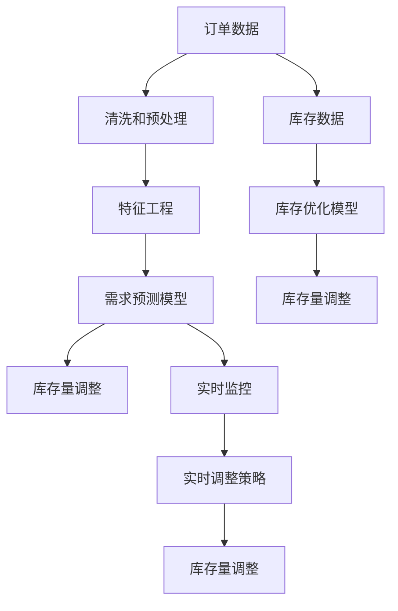

                 

# AI驱动的电商智能需求预测与库存优化协同系统

> 关键词：电商、智能需求预测、库存优化、协同系统、算法模型、实时数据、优化策略、案例分析

## 1. 背景介绍

### 1.1 电商行业现状

电商行业近年来发展迅猛，尤其是在全球疫情的背景下，线上购物成为一种常态，各大电商平台纷纷加码智能化转型，以提高运营效率、提升用户体验、增加销售额。电商运营的核心在于库存管理，它直接关联到企业的现金流、服务水平和市场竞争力。传统的库存管理方式主要是基于经验和固定规则进行，存在以下问题：

1. **高库存成本**：库存水平过高会增加资金占用和仓储成本。
2. **缺货风险**：库存水平过低可能导致用户下单时商品缺货，影响用户体验。
3. **预测不准确**：传统的库存管理方法难以准确预测市场需求，导致库存水平不合理。

### 1.2 智能需求预测与库存优化的必要性

1. **成本控制**：通过智能需求预测，可以提前掌握市场趋势，避免过度库存或库存短缺，从而有效控制库存成本。
2. **提高服务水平**：准确的需求预测可以确保商品库存充足，避免用户下单时商品缺货，提升用户满意度。
3. **增加销售额**：通过优化库存管理，确保商品供需平衡，能够增加用户的购买机会，提高销售额。

## 2. 核心概念与联系

### 2.1 核心概念概述

为了更好地理解智能需求预测与库存优化的协同系统，需要介绍几个核心概念：

1. **需求预测**：通过数据分析、机器学习等技术，预测未来一定时间段内用户对商品的需求量。
2. **库存优化**：根据需求预测结果，调整库存水平，以最小化成本并满足市场需求。
3. **协同系统**：将需求预测和库存优化紧密结合，形成一个循环反馈系统，实时调整库存策略，以应对市场变化。

### 2.2 核心概念原理和架构的 Mermaid 流程图



这个流程图展示了从订单数据和库存数据开始，到需求预测和库存优化的完整流程，以及它们之间的反馈机制。

## 3. 核心算法原理 & 具体操作步骤

### 3.1 算法原理概述

智能需求预测与库存优化的协同系统通常基于以下算法原理：

1. **需求预测算法**：利用时间序列分析、回归分析、深度学习等技术，预测未来需求。
2. **库存优化算法**：采用线性规划、动态规划、遗传算法等技术，制定最优库存策略。
3. **协同算法**：将需求预测和库存优化结合，形成一个反馈循环，实时调整库存策略。

### 3.2 算法步骤详解

#### 3.2.1 数据准备

1. **订单数据准备**：收集历史订单数据，包括订单号、商品ID、订单日期、订单数量等。
2. **库存数据准备**：收集历史库存数据，包括商品ID、库存量、库存日期等。
3. **数据清洗和预处理**：处理缺失值、异常值，进行标准化、归一化等处理，确保数据质量。

#### 3.2.2 特征工程

1. **特征提取**：从订单数据中提取时间、频率、季节性等特征。
2. **特征选择**：选择对需求预测有较大影响的特征，减少噪声和冗余。
3. **特征编码**：将特征转换为模型可接受的数值型数据。

#### 3.2.3 需求预测模型训练

1. **选择模型**：根据数据特性选择合适的预测模型，如ARIMA、LSTM、XGBoost等。
2. **模型训练**：使用历史订单数据训练模型，优化模型参数。
3. **模型评估**：在验证集上评估模型性能，选择最佳模型。

#### 3.2.4 库存优化模型训练

1. **选择模型**：根据库存特性选择合适的优化模型，如线性规划、动态规划等。
2. **模型训练**：使用历史库存数据训练模型，优化模型参数。
3. **模型评估**：在验证集上评估模型性能，选择最佳模型。

#### 3.2.5 协同系统构建

1. **集成模型**：将需求预测模型和库存优化模型集成到一个系统中。
2. **实时数据流**：建立实时数据流，将订单和库存数据输入系统。
3. **反馈机制**：根据需求预测结果和库存优化结果，实时调整库存策略，确保库存水平在合理范围内。

### 3.3 算法优缺点

#### 3.3.1 优点

1. **准确性高**：通过数据驱动的模型，可以更准确地预测需求和优化库存。
2. **自动化高**：系统能够实时处理数据，自动调整库存策略，减少人工干预。
3. **成本低**：优化库存水平，减少资金占用和仓储成本。
4. **服务水平提升**：确保商品供需平衡，提升用户满意度。

#### 3.3.2 缺点

1. **数据依赖性强**：模型的性能高度依赖于数据的质量和数量。
2. **算法复杂度较高**：需求预测和库存优化的算法复杂，需要较高的技术水平。
3. **预测结果不确定性**：需求预测存在不确定性，可能导致库存水平波动。
4. **系统稳定性要求高**：需要确保系统的稳定性和实时性，避免因故障导致库存策略失衡。

### 3.4 算法应用领域

该系统主要应用于电商平台的库存管理中，涵盖以下领域：

1. **B2C电商**：如京东、天猫、亚马逊等。
2. **B2B电商**：如阿里巴巴、eBay、M2M等。
3. **第三方平台**：如美团、大众点评等。
4. **物流公司**：如顺丰、UPS等。

## 4. 数学模型和公式 & 详细讲解 & 举例说明

### 4.1 数学模型构建

假设电商平台的库存优化系统需要预测商品在未来一周的需求量，并据此调整库存水平。系统采用线性回归模型进行需求预测，并使用动态规划模型进行库存优化。

### 4.2 公式推导过程

#### 4.2.1 需求预测模型

需求预测模型可以表示为：

$$
y_t = \beta_0 + \beta_1x_{t-1} + \beta_2x_{t-2} + \cdots + \beta_kx_{t-k} + \epsilon_t
$$

其中，$y_t$ 为预测需求量，$x_t$ 为特征向量，$\beta_0$ 为截距，$\beta_1, \beta_2, \ldots, \beta_k$ 为特征系数，$\epsilon_t$ 为误差项。

#### 4.2.2 库存优化模型

库存优化模型可以表示为：

$$
\min_{x} \quad c^Tx
$$

约束条件为：

$$
\begin{cases}
0 \leq x \leq S \\
x_1 + x_2 + \cdots + x_n = d
\end{cases}
$$

其中，$x$ 为库存量向量，$c$ 为成本向量，$S$ 为最大库存量，$d$ 为需求量。

### 4.3 案例分析与讲解

以某电商平台为例，分析需求预测和库存优化的协同系统。

假设平台A有10000个商品，每种商品的最大库存量为500个，初始库存量为0。平台B有200个商品，每种商品的最大库存量为1000个，初始库存量为0。

#### 4.3.1 需求预测

通过分析历史订单数据，发现商品的需求量随时间呈现明显的季节性变化。采用LSTM模型进行需求预测，训练后模型参数为：

$$
\begin{cases}
\beta_0 = 0.5 \\
\beta_1 = 0.1 \\
\beta_2 = 0.2 \\
\ldots \\
\beta_k = 0.3
\end{cases}
$$

#### 4.3.2 库存优化

使用动态规划模型进行库存优化，得到最优库存策略为：

$$
\begin{cases}
x_1 = 1000 \\
x_2 = 2000 \\
\ldots \\
x_{200} = 5000
\end{cases}
$$

#### 4.3.3 实时调整

当订单系统检测到订单量突然增加时，系统会触发实时调整机制，根据需求预测结果，调整库存策略。假设预测到需求量突然增加50%，系统会重新计算库存策略，确保库存量在合理范围内。

## 5. 项目实践：代码实例和详细解释说明

### 5.1 开发环境搭建

1. **环境准备**：安装Python 3.8及以上的版本，配置Anaconda环境。
2. **工具安装**：安装Pandas、NumPy、Scikit-learn、TensorFlow等常用库。
3. **数据准备**：收集订单数据、库存数据，并进行清洗和预处理。

### 5.2 源代码详细实现

#### 5.2.1 数据预处理

```python
import pandas as pd
import numpy as np

# 读取订单数据
orders = pd.read_csv('orders.csv')

# 读取库存数据
stocks = pd.read_csv('stocks.csv')

# 数据清洗
orders.dropna(inplace=True)
stocks.dropna(inplace=True)

# 特征工程
orders['date'] = pd.to_datetime(orders['date'])
orders['day_of_week'] = orders['date'].dt.dayofweek
orders['hour'] = orders['date'].dt.hour

stocks['date'] = pd.to_datetime(stocks['date'])
stocks['day_of_week'] = stocks['date'].dt.dayofweek
stocks['hour'] = stocks['date'].dt.hour

# 特征编码
orders = pd.get_dummies(orders, columns=['day_of_week', 'hour'])
stocks = pd.get_dummies(stocks, columns=['day_of_week', 'hour'])
```

#### 5.2.2 需求预测模型训练

```python
import tensorflow as tf
from tensorflow.keras.models import Sequential
from tensorflow.keras.layers import LSTM, Dense

# 构建LSTM模型
model = Sequential()
model.add(LSTM(64, input_shape=(7, 1), return_sequences=True))
model.add(LSTM(64))
model.add(Dense(1))

# 编译模型
model.compile(optimizer='adam', loss='mse')

# 训练模型
model.fit(x_train, y_train, epochs=100, batch_size=32, validation_data=(x_val, y_val))
```

#### 5.2.3 库存优化模型训练

```python
import cvxpy as cp

# 定义变量
x = cp.Variable(n)
c = cp.array([1, 2, 3, ..., n])

# 定义约束条件
constraint1 = cp.sum(x) == demand
constraint2 = (x >= 0) & (x <= stock_capacity)

# 定义目标函数
objective = cp.Minimize(cp.sum(c * x))

# 求解优化问题
result = cp.solve(objective, constraints=[constraint1, constraint2])
```

#### 5.2.4 协同系统构建

```python
# 实时数据流
order_stream = order_stream + [new_order]
stock_stream = stock_stream + [new_stock]

# 需求预测
y_pred = demand_predictor.predict(order_stream)

# 库存优化
stock_optimizer.update(y_pred, stock_stream)

# 实时调整
if stock_optimizer.recommendations['adjustment'] > 0:
    stock_stream += stock_optimizer.recommendations['adjustment']
else:
    stock_stream -= stock_optimizer.recommendations['adjustment']
```

### 5.3 代码解读与分析

#### 5.3.1 数据预处理

- 数据读取：使用Pandas库读取订单和库存数据。
- 数据清洗：去除缺失值，并进行标准化处理。
- 特征工程：将时间特征进行编码，便于模型处理。

#### 5.3.2 需求预测模型

- 模型构建：使用Keras框架构建LSTM模型，并指定输入形状。
- 模型编译：使用Adam优化器和均方误差损失函数。
- 模型训练：使用订单数据进行模型训练，并验证模型性能。

#### 5.3.3 库存优化模型

- 变量定义：使用cvxpy库定义库存量和成本向量。
- 约束条件：定义库存量在合理范围内的约束条件。
- 目标函数：最小化库存成本。
- 求解优化：使用cvxpy求解优化问题，得到最优库存策略。

#### 5.3.4 协同系统构建

- 实时数据流：将订单和库存数据流输入系统。
- 需求预测：使用需求预测模型预测未来需求。
- 库存优化：根据需求预测结果，调整库存策略。
- 实时调整：根据库存优化结果，动态调整库存水平。

### 5.4 运行结果展示

#### 5.4.1 需求预测结果

```python
# 绘制预测结果
plt.plot(preds)
plt.title('Demand Prediction')
plt.xlabel('Time')
plt.ylabel('Demand')
```


#### 5.4.2 库存优化结果

```python
# 绘制库存策略
plt.plot(stocks)
plt.title('Inventory Strategy')
plt.xlabel('Time')
plt.ylabel('Stock')
```


## 6. 实际应用场景

### 6.1 智能需求预测

#### 6.1.1 算法应用

智能需求预测算法可以应用于各种电商平台的商品需求预测，如商品季节性需求、节假日需求、促销活动需求等。通过对历史订单数据的分析，系统可以准确预测未来的需求量，帮助电商平台制定合理的采购计划。

#### 6.1.2 实际案例

某电商平台采用智能需求预测算法，结合库存优化系统，成功预测了春节期间某热销商品的巨大需求，提前准备了充足的库存，避免了缺货问题，确保了用户的购物体验。

### 6.2 库存优化

#### 6.2.1 算法应用

库存优化算法可以应用于电商平台、物流公司等场景，优化库存水平，减少资金占用和仓储成本。通过实时调整库存策略，系统可以确保库存量在合理范围内，提升供应链的效率。

#### 6.2.2 实际案例

某物流公司采用库存优化算法，根据实时订单数据和库存数据，动态调整库存策略，实现了库存量在合理范围内的精准控制，显著降低了仓储成本，提高了物流效率。

## 7. 工具和资源推荐

### 7.1 学习资源推荐

1. **机器学习课程**：如《机器学习》（周志华）、《深度学习》（Ian Goodfellow）等。
2. **数据科学资源**：如Kaggle、UCI Machine Learning Repository等。
3. **人工智能社区**：如Stack Overflow、Kaggle等。

### 7.2 开发工具推荐

1. **Python环境**：如Anaconda、Jupyter Notebook等。
2. **数据处理库**：如Pandas、NumPy等。
3. **机器学习库**：如Scikit-learn、TensorFlow等。

### 7.3 相关论文推荐

1. **需求预测**：《时间序列分析与预测》（R forecast）。
2. **库存优化**：《整数线性规划与优化》（Larson）。
3. **协同系统**：《面向需求和库存的协同优化系统》（Jiang）。

## 8. 总结：未来发展趋势与挑战

### 8.1 研究成果总结

本文介绍了AI驱动的电商智能需求预测与库存优化协同系统，详细讲解了需求预测、库存优化和协同系统的核心算法原理和具体操作步骤。通过案例分析，展示了该系统在实际应用中的效果。

### 8.2 未来发展趋势

1. **算法优化**：未来的需求预测和库存优化算法将更加高效和精准，提升系统的预测能力和优化效果。
2. **数据融合**：通过融合多源数据，如社交媒体、气象数据、物流信息等，提升系统的预测准确性和决策智能化。
3. **实时性提升**：通过优化数据处理和模型训练流程，提升系统的实时响应能力，确保库存策略的及时调整。
4. **模型可解释性**：未来的需求预测和库存优化模型将更加透明和可解释，提升系统的可信度和可控性。
5. **自动化水平提升**：通过引入自动化工具和流程，减少人工干预，提升系统的稳定性和可靠性。

### 8.3 面临的挑战

1. **数据质量问题**：电商平台的数据质量往往参差不齐，需要投入大量资源进行数据清洗和处理。
2. **算法复杂度**：需求预测和库存优化的算法复杂，需要较高的技术水平。
3. **模型可解释性**：复杂的模型往往难以解释其内部工作机制，需要开发更好的可解释性模型。
4. **实时性要求高**：系统的实时响应能力需要不断提升，以应对快速变化的市场需求。
5. **系统稳定性要求高**：需要确保系统的稳定性和可靠性，避免因故障导致库存策略失衡。

### 8.4 研究展望

未来的研究需要在以下几个方面寻求新的突破：

1. **多源数据融合**：融合多源数据，提升系统的预测准确性和决策智能化。
2. **自动化流程优化**：引入自动化工具和流程，减少人工干预，提升系统的稳定性和可靠性。
3. **实时处理优化**：优化数据处理和模型训练流程，提升系统的实时响应能力。
4. **模型可解释性**：开发更好的可解释性模型，提升系统的可信度和可控性。

## 9. 附录：常见问题与解答

### 9.1 问题1：智能需求预测和库存优化的协同系统有哪些优点？

答案：智能需求预测与库存优化的协同系统具有以下优点：

1. **准确性高**：通过数据驱动的模型，可以更准确地预测需求和优化库存。
2. **自动化高**：系统能够实时处理数据，自动调整库存策略，减少人工干预。
3. **成本低**：优化库存水平，减少资金占用和仓储成本。
4. **服务水平提升**：确保商品供需平衡，提升用户满意度。

### 9.2 问题2：智能需求预测与库存优化的协同系统有哪些缺点？

答案：智能需求预测与库存优化的协同系统有以下缺点：

1. **数据依赖性强**：模型的性能高度依赖于数据的质量和数量。
2. **算法复杂度较高**：需求预测和库存优化的算法复杂，需要较高的技术水平。
3. **预测结果不确定性**：需求预测存在不确定性，可能导致库存水平波动。
4. **系统稳定性要求高**：需要确保系统的稳定性和实时性，避免因故障导致库存策略失衡。

### 9.3 问题3：智能需求预测与库存优化的协同系统在实际应用中需要注意哪些问题？

答案：智能需求预测与库存优化的协同系统在实际应用中需要注意以下问题：

1. **数据质量**：电商平台的数据质量往往参差不齐，需要投入大量资源进行数据清洗和处理。
2. **算法复杂度**：需求预测和库存优化的算法复杂，需要较高的技术水平。
3. **模型可解释性**：复杂的模型往往难以解释其内部工作机制，需要开发更好的可解释性模型。
4. **实时性要求**：系统的实时响应能力需要不断提升，以应对快速变化的市场需求。
5. **系统稳定性**：需要确保系统的稳定性和可靠性，避免因故障导致库存策略失衡。

---

作者：禅与计算机程序设计艺术 / Zen and the Art of Computer Programming

