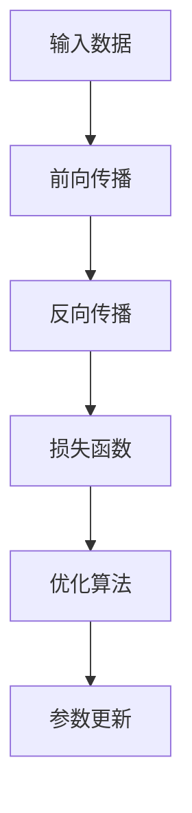

                 

## 1. 背景介绍

### 1.1 问题由来

深度学习框架的核心之一是自动微分机制，这一机制是实现模型训练和优化算法的基石。然而，手动推导梯度表达式并实现其计算过程不仅复杂，且容易出错。自动微分工具AutoGrad（Automatic Gradient）的出现，极大地简化了深度学习模型的开发和优化。

AutoGrad机制能够自动计算各个节点对输出的导数，自动推导复杂模型中的反向传播链，减少手动推导梯度的繁琐工作，提升模型的构建和调试效率。同时，AutoGrad在优化算法的实现中也起着关键作用，支持各种优化算法如SGD、Adam、L-BFGS等。

### 1.2 问题核心关键点

AutoGrad机制的核心在于：

- 自动计算梯度。对于任意可微分的神经网络模块，AutoGrad能够自动计算其梯度，从而简化反向传播过程。
- 构建反向传播链。AutoGrad自动跟踪前向传播路径，构建链式导数图，使得反向传播过程自动完成。
- 优化算法支持。AutoGrad支持多种优化算法，并能与这些算法无缝结合，实现高效模型优化。

这些特性使得AutoGrad在深度学习框架中扮演了核心角色，极大地简化了模型的构建和训练流程，提升了开发效率。

### 1.3 问题研究意义

研究AutoGrad机制，对于深化理解深度学习模型的训练过程，优化模型性能，提升深度学习框架的可用性和可扩展性，具有重要意义：

1. 提升模型训练效率。AutoGrad的自动计算和链式导数图，显著减少了手动推导梯度的繁琐工作，大大缩短了模型的构建和调试时间。
2. 简化模型优化过程。AutoGrad能够与各种优化算法无缝结合，提高了模型优化的自动化程度。
3. 增强模型可复用性。AutoGrad机制使得模型组件可以方便地复用，提高了代码的模块化和可维护性。
4. 支持更多高级特性。AutoGrad机制为实现如批归一化、自适应学习率等高级特性提供了基础设施。

## 2. 核心概念与联系

### 2.1 核心概念概述

为更好地理解AutoGrad机制，本节将介绍几个关键概念：

- 自动微分(Automatic Differentiation)：指通过计算函数的一阶或高阶导数，反向传播算法的实现过程。AutoGrad机制即是一种基于代码级自动微分的技术。
- 链式导数图(Chain Rule Graph)：指在反向传播过程中，每个中间变量对最终输出的导数都通过其前向依赖的导数传递而来，形成一个链式导数图。AutoGrad自动构建和维护这个链式导数图。
- 反向传播(Backpropagation)：指在深度神经网络中，通过链式导数图计算每个参数对损失函数的导数，并用于更新模型参数的过程。
- 优化算法(Optimizer)：指用于调整模型参数，使模型损失函数最小的算法。常见的优化算法包括SGD、Adam、L-BFGS等。
- 动态计算图(Dynamic Computation Graph)：指在深度学习框架中，动态构建计算图，并在运行时动态计算节点输出的过程。AutoGrad能够与动态计算图无缝结合，实现高效的反向传播。

这些概念之间的逻辑关系可以通过以下Mermaid流程图来展示：



这个流程图展示了深度学习模型的基本流程：首先通过输入数据进行前向传播，计算模型输出；然后通过反向传播计算损失函数对每个参数的梯度，优化算法根据梯度更新模型参数。AutoGrad机制在这个过程中起着关键作用，自动构建和维护反向传播链，自动计算梯度，简化模型优化过程。

## 3. 核心算法原理 & 具体操作步骤

### 3.1 算法原理概述

AutoGrad机制的核心原理是代码级自动微分，即通过分析源代码，自动构建计算图，并自动计算每个节点的梯度。其主要步骤包括：

1. 分析源代码，提取可微分操作和参数。
2. 构建链式导数图，记录每个节点对输出的导数。
3. 前向传播时，动态计算每个节点输出。
4. 反向传播时，自动计算每个节点对输出的导数。
5. 通过链式导数图，依次计算每个参数的梯度，并应用于优化算法。

### 3.2 算法步骤详解

AutoGrad机制的具体操作步骤如下：

**Step 1: 分析源代码，提取可微分操作和参数**

在代码中，可微分操作（如加、乘、激活函数等）会被自动标记为可微分节点，其输入和参数会被自动记录为计算图的一部分。例如：

```python
import torch

a = torch.randn(3, 3)
b = torch.randn(3, 3)
c = a + b
```

在这个例子中，`a`、`b` 和 `c` 都被自动标记为计算图中的节点，其中 `a` 和 `b` 是输入节点，`c` 是可微分节点，其输入为 `a` 和 `b`。

**Step 2: 构建链式导数图**

AutoGrad自动跟踪前向传播路径，构建链式导数图，记录每个节点对输出的导数。例如，在前述例子中，链式导数图如下：

```
a --> c
^
|
v
b --> c
```

其中，`a` 和 `b` 是输入节点，`c` 是输出节点。

**Step 3: 前向传播计算节点输出**

在代码中，前向传播时，AutoGrad会自动计算每个节点的输出，并在计算图中标记其输出值。例如，在上述例子中，`c` 的输出为 `c = a + b`。

**Step 4: 反向传播计算节点梯度**

在代码中，反向传播时，AutoGrad会自动计算每个节点对输出的导数，并依次传递到其前向依赖的节点。例如，在上述例子中，`c` 对 `a` 和 `b` 的导数分别为 `1` 和 `1`，`a` 和 `b` 分别将其导数传递到其前向依赖的节点。

**Step 5: 更新模型参数**

在代码中，AutoGrad会自动将计算出的参数梯度传递给优化算法，用于更新模型参数。例如，在前述例子中，优化算法会使用 `c` 对 `a` 和 `b` 的导数来更新 `a` 和 `b` 的值。

### 3.3 算法优缺点

AutoGrad机制的优点包括：

1. 自动计算梯度。AutoGrad能够自动计算任意节点的导数，避免了手动推导梯度的繁琐工作，减少了错误发生的可能性。
2. 链式导数图自动化。AutoGrad自动构建和维护链式导数图，使得反向传播过程自动化，减少了手动操作，提升了效率。
3. 优化算法支持。AutoGrad能够与各种优化算法无缝结合，提高了模型优化的自动化程度。
4. 动态计算图支持。AutoGrad能够与动态计算图无缝结合，支持动态计算和自动微分。

AutoGrad机制的缺点包括：

1. 性能开销。AutoGrad需要在代码中自动构建和维护计算图，存在一定的性能开销，尤其在模型较大或迭代次数较多的情况下，计算图构建和维护的复杂度增加，可能导致一定的性能损失。
2. 调试难度。由于AutoGrad自动构建和维护计算图，调试过程中可能出现一些难以解释的问题，需要开发者具备一定的反向传播和优化算法知识。
3. 代码复杂度。AutoGrad需要开发者编写复杂的代码，以利用其自动微分功能，增加了代码复杂度，提高了开发门槛。

### 3.4 算法应用领域

AutoGrad机制已经在深度学习领域得到了广泛的应用，覆盖了各种类型的神经网络模型，包括全连接网络、卷积神经网络、循环神经网络、变分自编码器等。在实际应用中，AutoGrad机制也被用于：

- 参数更新。通过链式导数图和优化算法，AutoGrad能够自动计算并更新模型参数。
- 模型构建。AutoGrad能够自动构建计算图，简化模型的构建和调试过程。
- 损失函数计算。AutoGrad能够自动计算损失函数对各个参数的梯度，简化损失函数的定义和计算过程。
- 优化算法实现。AutoGrad能够与各种优化算法无缝结合，实现高效模型优化。

除了这些常见的应用外，AutoGrad机制还被创新性地应用于更前沿的研究领域，如模型蒸馏、多任务学习、元学习等，为深度学习技术的发展提供了新的思路。

## 4. 数学模型和公式 & 详细讲解 & 举例说明

### 4.1 数学模型构建

AutoGrad机制的数学模型可以简单表示为：

$$
y = f(x; \theta) \\
\nabla_{\theta}L(y, t) = \frac{\partial L(y, t)}{\partial y} \nabla_{y}f(x; \theta)
$$

其中，$f$ 是模型函数，$x$ 是输入，$y$ 是输出，$\theta$ 是模型参数，$L$ 是损失函数，$t$ 是标签，$\nabla_{\theta}L$ 是损失函数对模型参数的梯度。

在实际应用中，我们可以使用自动微分工具如AutoGrad，自动计算 $\nabla_{\theta}L$。

### 4.2 公式推导过程

以一个简单的二元线性回归模型为例，推导自动微分的过程。假设模型函数为：

$$
y = \theta^T x + b
$$

其中，$x$ 是输入，$\theta$ 是模型参数，$b$ 是偏置。假设标签为 $t$，损失函数为均方误差：

$$
L(y, t) = \frac{1}{2}(y - t)^2
$$

我们需要计算损失函数 $L$ 对 $\theta$ 的梯度。

首先，对 $L$ 对 $y$ 求导：

$$
\frac{\partial L}{\partial y} = y - t
$$

然后，对 $L$ 对 $x$ 求导：

$$
\frac{\partial L}{\partial x} = \frac{\partial y}{\partial x} \frac{\partial L}{\partial y} = \theta \frac{\partial y}{\partial x} = \theta
$$

最后，对 $L$ 对 $\theta$ 求导：

$$
\frac{\partial L}{\partial \theta} = \frac{\partial y}{\partial x} \frac{\partial L}{\partial y} = \theta (y - t)
$$

通过AutoGrad，我们可以自动计算这些导数，并应用于优化算法。

### 4.3 案例分析与讲解

假设有一个简单的神经网络模型，包含一个输入层、一个隐藏层和一个输出层。假设输入为 $x$，隐藏层参数为 $\theta_h$，输出层参数为 $\theta_o$。假设损失函数为均方误差，输入 $x$ 和标签 $t$ 已知。

首先，我们定义模型函数：

```python
import torch
import torch.nn as nn

class Net(nn.Module):
    def __init__(self):
        super(Net, self).__init__()
        self.fc1 = nn.Linear(784, 500)
        self.fc2 = nn.Linear(500, 10)
    
    def forward(self, x):
        x = x.view(-1, 784)
        x = torch.relu(self.fc1(x))
        x = torch.relu(self.fc2(x))
        return x
```

然后，定义损失函数和优化算法：

```python
criterion = nn.MSELoss()
optimizer = torch.optim.SGD(Net.parameters(), lr=0.01)

x = torch.randn(2, 784)
t = torch.randn(2, 10)

model = Net()
loss = criterion(model(x), t)
loss.backward()
optimizer.step()
```

在这个例子中，AutoGrad会自动构建计算图，自动计算每个节点对输出的导数，并依次传递到其前向依赖的节点。通过链式导数图，AutoGrad自动计算了每个参数的梯度，并应用于优化算法。

## 5. 项目实践：代码实例和详细解释说明

### 5.1 开发环境搭建

在进行AutoGrad机制的实践前，我们需要准备好开发环境。以下是使用Python进行PyTorch开发的环境配置流程：

1. 安装Anaconda：从官网下载并安装Anaconda，用于创建独立的Python环境。

2. 创建并激活虚拟环境：
```bash
conda create -n pytorch-env python=3.8 
conda activate pytorch-env
```

3. 安装PyTorch：根据CUDA版本，从官网获取对应的安装命令。例如：
```bash
conda install pytorch torchvision torchaudio cudatoolkit=11.1 -c pytorch -c conda-forge
```

4. 安装TensorFlow：根据CUDA版本，从官网获取对应的安装命令。例如：
```bash
conda install tensorflow
```

5. 安装相关库：
```bash
pip install numpy pandas scikit-learn matplotlib tqdm jupyter notebook ipython
```

完成上述步骤后，即可在`pytorch-env`环境中开始AutoGrad机制的实践。

### 5.2 源代码详细实现

下面我们以二元线性回归模型为例，给出使用PyTorch实现AutoGrad机制的PyTorch代码实现。

首先，定义线性回归模型：

```python
import torch

class LinearRegression(nn.Module):
    def __init__(self, input_size, output_size):
        super(LinearRegression, self).__init__()
        self.linear = nn.Linear(input_size, output_size)
    
    def forward(self, x):
        return self.linear(x)
```

然后，定义损失函数和优化算法：

```python
import torch.nn as nn

model = LinearRegression(784, 10)
criterion = nn.MSELoss()
optimizer = torch.optim.SGD(model.parameters(), lr=0.01)

x = torch.randn(2, 784)
t = torch.randn(2, 10)

loss = criterion(model(x), t)
loss.backward()
optimizer.step()
```

在这个例子中，我们使用PyTorch实现了线性回归模型，并使用AutoGrad自动计算梯度。通过链式导数图，AutoGrad自动计算了每个参数的梯度，并应用于优化算法。

### 5.3 代码解读与分析

让我们再详细解读一下关键代码的实现细节：

**LinearRegression类**：
- `__init__`方法：初始化线性回归模型的权重和偏置。
- `forward`方法：定义前向传播过程，计算模型输出。

**模型定义**：
- 使用PyTorch定义线性回归模型，并实例化模型对象。

**损失函数和优化算法**：
- 定义均方误差损失函数和优化算法，并对模型进行训练。

**模型训练**：
- 使用PyTorch自动计算损失函数对模型参数的梯度，并应用于优化算法。

可以看到，PyTorch提供了强大的自动微分能力，通过简单的代码实现，实现了二元线性回归模型的训练过程。

## 6. 实际应用场景

### 6.1 深度学习模型训练

AutoGrad机制是深度学习模型训练的基础，被广泛应用于各种类型的神经网络模型中。例如，在图像识别任务中，AutoGrad机制可以自动计算卷积层、池化层、激活函数等操作的导数，并应用于优化算法，从而实现模型的训练和优化。

### 6.2 模型优化

在模型优化过程中，AutoGrad机制能够自动计算每个节点的导数，并应用于优化算法，从而实现高效的模型优化。例如，在自然语言处理任务中，AutoGrad机制可以自动计算语言模型的导数，并应用于优化算法，从而实现模型的参数更新和优化。

### 6.3 模型诊断

AutoGrad机制还能够帮助诊断模型的错误和问题。通过观察导数图和梯度值，开发者可以发现模型中的错误节点和参数，及时进行调试和修正。

### 6.4 未来应用展望

随着AutoGrad机制的不断发展和优化，其在深度学习领域的应用将会更加广泛和深入。未来，AutoGrad机制将在以下几个方面得到进一步应用：

- 模型压缩和加速。AutoGrad机制将推动模型压缩和加速技术的发展，使得模型在更小的空间内实现更高的性能。
- 分布式训练。AutoGrad机制将支持分布式训练，使得模型在更大规模的数据集上进行训练。
- 自动微分化和代码优化。AutoGrad机制将推动自动微分化和代码优化技术的发展，使得开发者可以更高效地构建和调试模型。

## 7. 工具和资源推荐

### 7.1 学习资源推荐

为了帮助开发者系统掌握AutoGrad机制的理论基础和实践技巧，这里推荐一些优质的学习资源：

1. 《深度学习》（第二版）：由Ian Goodfellow、Yoshua Bengio和Aaron Courville所著，系统介绍了深度学习的基础知识和核心技术，包括自动微分和反向传播算法。
2. CS231n《卷积神经网络》课程：斯坦福大学开设的深度学习课程，涵盖了自动微分和反向传播算法，以及其在图像识别任务中的应用。
3. PyTorch官方文档：PyTorch的官方文档，详细介绍了AutoGrad机制的实现原理和使用方式，是学习AutoGrad机制的重要参考资料。
4. TensorFlow官方文档：TensorFlow的官方文档，详细介绍了AutoGrad机制的实现原理和使用方式，是学习AutoGrad机制的重要参考资料。

通过对这些资源的学习实践，相信你一定能够快速掌握AutoGrad机制的精髓，并用于解决实际的深度学习问题。

### 7.2 开发工具推荐

高效的开发离不开优秀的工具支持。以下是几款用于AutoGrad机制开发的常用工具：

1. PyTorch：基于Python的开源深度学习框架，灵活动态的计算图，适合快速迭代研究。大多数深度学习模型都有PyTorch版本的实现。
2. TensorFlow：由Google主导开发的开源深度学习框架，生产部署方便，适合大规模工程应用。同样有丰富的深度学习模型资源。
3. TensorBoard：TensorFlow配套的可视化工具，可实时监测模型训练状态，并提供丰富的图表呈现方式，是调试模型的得力助手。
4. Weights & Biases：模型训练的实验跟踪工具，可以记录和可视化模型训练过程中的各项指标，方便对比和调优。与主流深度学习框架无缝集成。

合理利用这些工具，可以显著提升AutoGrad机制的开发效率，加快创新迭代的步伐。

### 7.3 相关论文推荐

AutoGrad机制的发展源于学界的持续研究。以下是几篇奠基性的相关论文，推荐阅读：

1. JAX: Composable transformations of Python+NumPy programs：JAX是一个基于NumPy的自动微分库，支持复杂的自动微分和优化算法，是AutoGrad机制的重要参考。
2. Differentiation of optimizers and neural network architectures with tf.gradients：这篇文章详细介绍了TensorFlow中的自动微分机制，对理解AutoGrad机制具有重要参考价值。
3. Automatic differentiation in neural networks: a survey：这篇文章综述了自动微分在神经网络中的应用，对理解AutoGrad机制具有重要参考价值。

这些论文代表了大语言模型微调技术的发展脉络。通过学习这些前沿成果，可以帮助研究者把握学科前进方向，激发更多的创新灵感。

## 8. 总结：未来发展趋势与挑战

### 8.1 总结

本文对AutoGrad机制进行了全面系统的介绍。首先阐述了AutoGrad机制的核心思想和作用，明确了其在深度学习框架中的关键地位。其次，从原理到实践，详细讲解了AutoGrad机制的数学模型和具体操作步骤，给出了AutoGrad机制任务开发的完整代码实例。同时，本文还广泛探讨了AutoGrad机制在深度学习领域的应用前景，展示了其巨大的潜力。

通过本文的系统梳理，可以看到，AutoGrad机制是深度学习框架的核心组成部分，极大地简化了模型的构建和训练流程，提升了开发效率。未来，伴随AutoGrad机制的不断演进，深度学习技术必将在更广阔的领域得到应用，为人工智能技术的发展带来新的突破。

### 8.2 未来发展趋势

展望未来，AutoGrad机制将呈现以下几个发展趋势：

1. 支持更多高级特性。AutoGrad机制将支持更多高级特性，如批归一化、自适应学习率等，进一步提升模型的训练效率和性能。
2. 优化算法支持。AutoGrad机制将支持更多优化算法，并优化算法的实现方式，提高模型的训练速度和精度。
3. 模型压缩和加速。AutoGrad机制将推动模型压缩和加速技术的发展，使得模型在更小的空间内实现更高的性能。
4. 分布式训练。AutoGrad机制将支持分布式训练，使得模型在更大规模的数据集上进行训练。

以上趋势凸显了AutoGrad机制在深度学习领域的广泛应用前景，其不断演进和发展将为深度学习技术的发展注入新的动力。

### 8.3 面临的挑战

尽管AutoGrad机制已经取得了显著成果，但在迈向更加智能化、普适化应用的过程中，它仍面临诸多挑战：

1. 性能开销。AutoGrad机制需要在代码中自动构建和维护计算图，存在一定的性能开销，尤其在模型较大或迭代次数较多的情况下，计算图构建和维护的复杂度增加，可能导致一定的性能损失。
2. 调试难度。由于AutoGrad机制自动构建和维护计算图，调试过程中可能出现一些难以解释的问题，需要开发者具备一定的反向传播和优化算法知识。
3. 代码复杂度。AutoGrad机制需要开发者编写复杂的代码，以利用其自动微分功能，增加了代码复杂度，提高了开发门槛。

### 8.4 研究展望

面对AutoGrad机制面临的这些挑战，未来的研究需要在以下几个方面寻求新的突破：

1. 探索更高效的自动微分技术。探索更高效的自动微分算法和技术，降低计算图构建和维护的复杂度，提升AutoGrad机制的性能。
2. 开发更易于使用的自动微分工具。开发更易于使用的自动微分工具，降低开发者使用AutoGrad机制的门槛，提高代码的可读性和可维护性。
3. 引入更多先验知识。将符号化的先验知识，如知识图谱、逻辑规则等，与神经网络模型进行巧妙融合，引导AutoGrad机制学习更准确、合理的语言模型。

这些研究方向的探索，必将引领AutoGrad机制的发展走向更高的台阶，为深度学习技术的发展带来新的突破。面向未来，AutoGrad机制还需要与其他人工智能技术进行更深入的融合，如知识表示、因果推理、强化学习等，多路径协同发力，共同推动深度学习技术的发展。

## 9. 附录：常见问题与解答

**Q1：AutoGrad机制如何支持多种深度学习框架？**

A: AutoGrad机制是一个通用的自动微分工具，支持多种深度学习框架，包括PyTorch、TensorFlow、JAX等。这些框架都提供了对AutoGrad机制的支持，开发者可以使用对应的API进行自动微分和反向传播计算。

**Q2：AutoGrad机制如何支持动态计算图？**

A: AutoGrad机制能够与动态计算图无缝结合，支持动态计算和自动微分。通过PyTorch的动态计算图机制，AutoGrad能够自动构建和维护计算图，自动计算每个节点的导数，并应用于优化算法。

**Q3：AutoGrad机制如何支持分布式训练？**

A: AutoGrad机制支持分布式训练，能够自动构建和维护分布式计算图，并自动计算每个节点的导数。通过PyTorch的分布式计算图机制，AutoGrad能够支持大规模分布式训练，提升模型训练效率和精度。

**Q4：AutoGrad机制如何支持复杂模型的自动微分？**

A: AutoGrad机制支持复杂模型的自动微分，能够自动构建和维护计算图，自动计算每个节点的导数。通过PyTorch的复杂模型构建机制，AutoGrad能够支持各种类型的深度学习模型，包括全连接网络、卷积神经网络、循环神经网络、变分自编码器等。

**Q5：AutoGrad机制如何支持模型优化？**

A: AutoGrad机制能够自动计算每个节点的导数，并应用于优化算法，从而实现高效的模型优化。通过PyTorch的优化算法机制，AutoGrad能够支持多种优化算法，如SGD、Adam、L-BFGS等，并支持自动微分化和代码优化，提升模型优化效率和性能。

**Q6：AutoGrad机制如何支持模型诊断？**

A: AutoGrad机制能够自动构建和维护计算图，自动计算每个节点的导数，并应用于优化算法。通过观察导数图和梯度值，开发者可以发现模型中的错误节点和参数，及时进行调试和修正。

总之，AutoGrad机制是一个强大的自动微分工具，极大地简化了深度学习模型的开发和优化过程，提升了模型的训练效率和性能。面对未来的挑战，AutoGrad机制将继续在深度学习领域发挥重要作用，推动深度学习技术的发展和应用。

