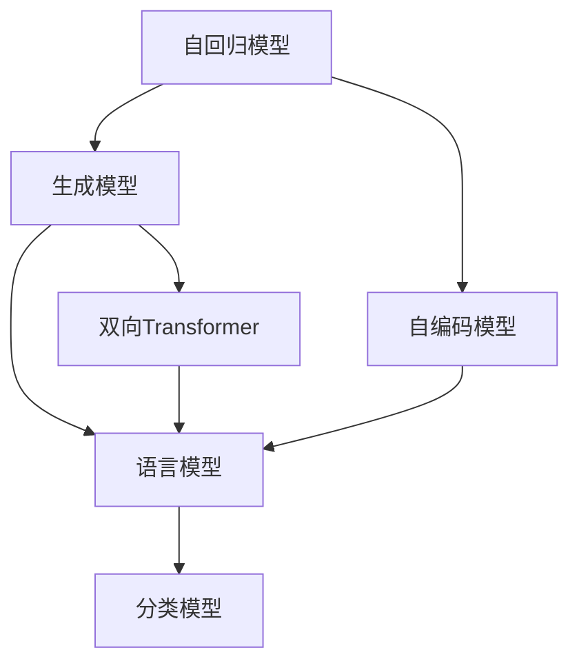

                 

# BERT vs GPT：双向vs单向语言模型

> 关键词：BERT, GPT, 语言模型, 预训练, 双向, 单向, 自回归, 自编码, 生成模型, Transformer

## 1. 背景介绍

### 1.1 问题由来
近年来，基于神经网络的语言模型在自然语言处理(NLP)领域取得了长足的进步，成为了处理文本数据的关键工具。其中，BERT和GPT是两个代表性的语言模型。BERT采用了双向Transformer架构，而GPT则采用了单向自回归架构。这两种架构的对比引发了广泛的讨论和应用。

### 1.2 问题核心关键点
- 双向语言模型：BERT等模型的主要特点是能够同时利用左右上下文信息进行特征提取和表示学习。
- 单向语言模型：GPT等模型的主要特点是能够通过前向传播预测后文内容，具有高度的可预测性。
- 双向与单向对比：双向语言模型在语义理解上更加全面，而单向语言模型在生成文本方面更具优势。
- 自回归与自编码：自回归模型每次预测依赖于前文信息，自编码模型则通过编码器-解码器结构进行语义映射。
- 预训练与微调：模型先在大规模语料上进行预训练，再在特定任务上进行微调。
- 生成模型与分类模型：生成模型重点在生成文本，分类模型重点在识别和分类。

这些核心概念之间的逻辑关系可以通过以下Mermaid流程图来展示：

```mermaid
graph TB
    A[双向语言模型(BERT)] --> B[双向Transformer]
    A --> C[单向语言模型(GPT)]
    C --> D[单向自回归]
    A --> E[自编码]
    C --> F[生成模型]
    A --> G[预训练]
    C --> H[微调]
    A --> I[分类模型]
    C --> J[生成模型]
```

这个流程图展示了大语言模型的核心概念及其之间的关系：

1. 双向语言模型通过双向Transformer结构进行语义表示学习。
2. 单向语言模型通过自回归模型进行文本生成。
3. 自编码模型通过编码器-解码器结构进行语义映射。
4. 预训练与微调模型在大规模语料上进行训练，并应用到特定任务上。
5. 生成模型和分类模型在文本生成和文本分类上有不同应用。

这些概念共同构成了大语言模型的学习框架，使其在文本理解、生成等方面发挥强大的能力。通过理解这些核心概念，我们可以更好地把握大语言模型的优劣势，并在此基础上选择合适的模型架构进行应用。

## 2. 核心概念与联系

### 2.1 核心概念概述

为更好地理解BERT和GPT的原理与架构，本节将介绍几个密切相关的核心概念：

- 语言模型：用于预测文本序列下一个单词或字符的概率分布的模型。常见的语言模型包括n-gram模型、神经网络语言模型等。
- 预训练：在大规模无标签文本语料上进行自监督学习，学习通用的语言表示。
- 自回归模型：模型通过前文信息预测后文内容，具有高度的可预测性。
- 自编码模型：通过编码器将输入映射为隐表示，通过解码器将隐表示映射回输入，实现语义映射。
- 双向Transformer：通过并行处理左右上下文信息，提取更加全面的语义表示。
- 生成模型与分类模型：生成模型重点在生成文本，分类模型重点在识别和分类。

这些核心概念之间的逻辑关系可以通过以下Mermaid流程图来展示：



这个流程图展示了大语言模型的核心概念及其之间的联系：

1. 自回归模型和自编码模型通过编码器-解码器结构学习语义映射。
2. 自回归模型通过前向传播进行文本生成，生成模型通过训练生成样本实现语言建模。
3. 语言模型通过预测下一个单词或字符的概率分布，用于训练自回归模型。
4. 双向Transformer通过并行处理左右上下文信息，提取更加全面的语义表示。
5. 分类模型通过训练识别和分类样本，实现文本分类任务。

这些概念共同构成了大语言模型的学习框架，使其在文本理解、生成等方面发挥强大的能力。通过理解这些核心概念，我们可以更好地把握BERT和GPT的原理与架构，并在此基础上进行进一步的对比分析。

## 3. 核心算法原理 & 具体操作步骤
### 3.1 算法原理概述

BERT和GPT是两种经典的预训练语言模型，其核心原理和架构设计有所不同。以下将对BERT和GPT的算法原理进行详细讲解。

#### 3.1.1 BERT算法原理

BERT是由Google提出的双向Transformer语言模型，通过大规模语料预训练和微调，获得在多任务上的优异表现。其核心算法包括：

- 双向Transformer：通过并行处理左右上下文信息，提取更加全面的语义表示。
- 预训练任务：在大规模无标签文本语料上进行自监督预训练，学习通用的语言表示。
- 微调任务：在特定任务上进行有监督微调，提升模型在特定任务上的性能。

#### 3.1.2 GPT算法原理

GPT是由OpenAI提出的单向自回归语言模型，通过大规模语料预训练和微调，获得高度的可预测性和生成能力。其核心算法包括：

- 单向自回归：通过前向传播预测后文内容，具有高度的可预测性。
- 预训练任务：在大规模无标签文本语料上进行自监督预训练，学习通用的语言表示。
- 微调任务：在特定任务上进行有监督微调，提升模型在特定任务上的性能。

### 3.2 算法步骤详解

#### 3.2.1 BERT算法步骤

1. **预训练任务设计**：BERT使用掩码语言模型和下一句预测任务进行预训练。掩码语言模型通过随机掩码输入序列的一部分，预测被掩码的单词。下一句预测任务通过随机选择两个句子作为输入，预测它们是否为相邻的连续句子。

2. **预训练模型训练**：在预训练任务上，通过反向传播算法更新模型参数，最小化预测误差。预训练过程中，BERT使用Transformer模型作为特征提取器，通过多层自注意力机制提取输入序列的语义表示。

3. **微调任务设计**：根据具体任务，设计相应的任务适配层和损失函数。例如，对于分类任务，通常在顶层添加线性分类器和交叉熵损失函数。

4. **微调模型训练**：在微调任务上，使用有监督数据进行训练，优化模型参数，提升模型在特定任务上的性能。微调过程中，BERT通常只微调顶层，固定预训练权重，以减小过拟合风险。

#### 3.2.2 GPT算法步骤

1. **预训练任务设计**：GPT使用语言模型进行预训练。通过输入一段文本，模型预测下一个单词或字符的概率分布。

2. **预训练模型训练**：在预训练任务上，通过反向传播算法更新模型参数，最小化预测误差。GPT使用单向自回归模型作为特征提取器，通过前向传播预测后文内容。

3. **微调任务设计**：根据具体任务，设计相应的任务适配层和损失函数。例如，对于生成任务，通常使用语言模型的解码器输出概率分布，并以负对数似然为损失函数。

4. **微调模型训练**：在微调任务上，使用有监督数据进行训练，优化模型参数，提升模型在特定任务上的性能。微调过程中，GPT通常调整所有参数，以充分利用预训练权重。

### 3.3 算法优缺点

#### 3.3.1 BERT算法优缺点

- **优点**：
  - 双向语义理解：通过并行处理左右上下文信息，BERT能够捕捉更全面的语义信息，提升模型的理解能力。
  - 预训练效果：BERT通过大规模预训练，学习到丰富的语言表示，适合多种NLP任务。
  - 参数高效微调：BERT通常只微调顶层，固定预训练权重，减少过拟合风险，提高微调效率。

- **缺点**：
  - 计算开销：BERT的双向Transformer结构计算复杂度较高，需要较高的算力和存储资源。
  - 训练耗时：由于需要同时处理左右上下文信息，BERT的训练速度较慢，耗时较长。
  - 依赖大规模预训练数据：BERT的预训练效果高度依赖于大规模语料，对于小规模数据，效果可能不佳。

#### 3.3.2 GPT算法优缺点

- **优点**：
  - 生成能力强：GPT的单向自回归结构具有高度的可预测性，适合生成任务，如对话、摘要、翻译等。
  - 计算效率高：GPT的前向传播计算复杂度较低，适合实时应用，如自动客服、智能翻译等。
  - 少样本学习能力强：GPT在少样本条件下，生成效果较好，适用于小规模数据集。

- **缺点**：
  - 语义理解不足：由于GPT只能利用前文信息进行预测，其语义理解能力较弱，对于长句子和复杂文本，效果可能不佳。
  - 依赖大规模预训练数据：GPT的预训练效果同样高度依赖于大规模语料，对于小规模数据，效果可能不佳。
  - 训练时间长：GPT的单向自回归结构计算复杂度较高，训练速度较慢，耗时较长。

### 3.4 算法应用领域

BERT和GPT在NLP领域都有广泛的应用。以下是一些典型的应用场景：

- BERT：适用于文本分类、命名实体识别、问答系统、机器翻译等任务，具有较强的语义理解和表示能力。
- GPT：适用于对话系统、文本生成、摘要、翻译等任务，具有较强的生成能力和可预测性。

BERT和GPT在各自的领域中都取得了显著的成果，推动了NLP技术的进步和发展。

## 4. 数学模型和公式 & 详细讲解  
### 4.1 数学模型构建

BERT和GPT的数学模型可以分别用以下公式表示：

#### 4.1.1 BERT数学模型

$$
\mathcal{L} = -\frac{1}{N} \sum_{i=1}^{N} [\log P(x_i|x_{1:i-1}) + \log P(x_i|x_{i+1:N})]
$$

其中，$x_i$为输入序列的第$i$个单词，$P(x_i|x_{1:i-1})$为单词$x_i$在上下文$x_{1:i-1}$下的概率分布，$P(x_i|x_{i+1:N})$为单词$x_i$在后文$x_{i+1:N}$下的概率分布。

#### 4.1.2 GPT数学模型

$$
\mathcal{L} = -\frac{1}{N} \sum_{i=1}^{N} \log P(x_i|x_{1:i-1})
$$

其中，$x_i$为输入序列的第$i$个单词，$P(x_i|x_{1:i-1})$为单词$x_i$在上下文$x_{1:i-1}$下的概率分布。

### 4.2 公式推导过程

BERT和GPT的公式推导过程如下：

#### 4.2.1 BERT公式推导

BERT的预训练任务包括掩码语言模型和下一句预测任务。假设输入序列为$x_{1:T}$，掩码语言模型通过随机掩码部分单词，预测被掩码的单词。设$M$为掩码概率，则掩码语言模型的训练目标为：

$$
\min_{\theta} -\frac{1}{N} \sum_{i=1}^{N} \sum_{j=1}^{T} [\log P(\tilde{x}_i|x_{1:j-1}) + M \log P(x_{1:j-1}|\tilde{x}_i)]
$$

其中，$\tilde{x}_i$为被掩码的单词。

下一句预测任务通过随机选择两个句子作为输入，预测它们是否为相邻的连续句子。设$P_{true}$为真相邻概率，$P_{false}$为假相邻概率，则下一句预测任务的训练目标为：

$$
\min_{\theta} -\frac{1}{N} \sum_{i=1}^{N} [\log P_{true} + \log P_{false}]
$$

将两个任务结合，得到BERT的预训练目标函数为：

$$
\mathcal{L} = -\frac{1}{N} \sum_{i=1}^{N} [\log P(x_i|x_{1:i-1}) + \log P(x_i|x_{i+1:N})]
$$

#### 4.2.2 GPT公式推导

GPT的预训练任务是语言模型。假设输入序列为$x_{1:T}$，模型通过前向传播预测下一个单词。设$P(x_i|x_{1:i-1})$为单词$x_i$在上下文$x_{1:i-1}$下的概率分布，则语言模型的训练目标为：

$$
\min_{\theta} -\frac{1}{N} \sum_{i=1}^{N} \log P(x_i|x_{1:i-1})
$$

GPT的微调目标函数与预训练目标函数类似，只需根据具体任务设计相应的损失函数即可。

### 4.3 案例分析与讲解

以BERT和GPT在文本分类任务上的应用为例，说明两种模型的性能差异。

#### 4.3.1 数据集准备

首先，准备一个包含多个类别文本的数据集，每个样本由文本和标签组成。例如，一个包含电影评论的数据集，每个样本包含一条评论和其情感标签。

#### 4.3.2 BERT模型微调

1. **准备预训练模型**：使用BERT模型作为初始化参数，可以从HuggingFace官方库中下载预训练的BERT模型。
2. **任务适配层设计**：在BERT模型顶层添加线性分类器和交叉熵损失函数。
3. **微调模型训练**：将数据集划分为训练集、验证集和测试集，使用有监督数据进行训练，优化模型参数。

#### 4.3.3 GPT模型微调

1. **准备预训练模型**：使用GPT模型作为初始化参数，同样可以从HuggingFace官方库中下载预训练的GPT模型。
2. **任务适配层设计**：在GPT模型顶层添加线性分类器和交叉熵损失函数。
3. **微调模型训练**：将数据集划分为训练集、验证集和测试集，使用有监督数据进行训练，优化模型参数。

#### 4.3.4 性能对比

在验证集上评估两种模型的性能，记录其准确率、精确率、召回率和F1分数。由于BERT具有双向语义理解能力，其分类效果通常优于GPT，尤其是在长句子和复杂文本上。

## 5. 项目实践：代码实例和详细解释说明
### 5.1 开发环境搭建

在进行BERT和GPT的微调实践前，我们需要准备好开发环境。以下是使用Python进行PyTorch开发的环境配置流程：

1. 安装Anaconda：从官网下载并安装Anaconda，用于创建独立的Python环境。

2. 创建并激活虚拟环境：
```bash
conda create -n pytorch-env python=3.8 
conda activate pytorch-env
```

3. 安装PyTorch：根据CUDA版本，从官网获取对应的安装命令。例如：
```bash
conda install pytorch torchvision torchaudio cudatoolkit=11.1 -c pytorch -c conda-forge
```

4. 安装Transformers库：
```bash
pip install transformers
```

5. 安装各类工具包：
```bash
pip install numpy pandas scikit-learn matplotlib tqdm jupyter notebook ipython
```

完成上述步骤后，即可在`pytorch-env`环境中开始微调实践。

### 5.2 源代码详细实现

下面我们以BERT模型进行文本分类任务为例，给出使用Transformers库对BERT模型进行微调的PyTorch代码实现。

首先，定义文本分类任务的数据处理函数：

```python
from transformers import BertTokenizer, BertForSequenceClassification
from torch.utils.data import Dataset
import torch

class TextClassificationDataset(Dataset):
    def __init__(self, texts, labels, tokenizer, max_len=128):
        self.texts = texts
        self.labels = labels
        self.tokenizer = tokenizer
        self.max_len = max_len
        
    def __len__(self):
        return len(self.texts)
    
    def __getitem__(self, item):
        text = self.texts[item]
        label = self.labels[item]
        
        encoding = self.tokenizer(text, return_tensors='pt', max_length=self.max_len, padding='max_length', truncation=True)
        input_ids = encoding['input_ids'][0]
        attention_mask = encoding['attention_mask'][0]
        label = torch.tensor([label], dtype=torch.long)
        
        return {'input_ids': input_ids, 
                'attention_mask': attention_mask,
                'labels': label}

# 加载数据
tokenizer = BertTokenizer.from_pretrained('bert-base-uncased')
train_dataset = TextClassificationDataset(train_texts, train_labels, tokenizer)
dev_dataset = TextClassificationDataset(dev_texts, dev_labels, tokenizer)
test_dataset = TextClassificationDataset(test_texts, test_labels, tokenizer)

# 加载模型
model = BertForSequenceClassification.from_pretrained('bert-base-uncased', num_labels=3)

# 定义优化器
optimizer = AdamW(model.parameters(), lr=2e-5)
```

然后，定义训练和评估函数：

```python
from torch.utils.data import DataLoader
from tqdm import tqdm
from sklearn.metrics import classification_report

device = torch.device('cuda') if torch.cuda.is_available() else torch.device('cpu')
model.to(device)

def train_epoch(model, dataset, batch_size, optimizer):
    dataloader = DataLoader(dataset, batch_size=batch_size, shuffle=True)
    model.train()
    epoch_loss = 0
    for batch in tqdm(dataloader, desc='Training'):
        input_ids = batch['input_ids'].to(device)
        attention_mask = batch['attention_mask'].to(device)
        labels = batch['labels'].to(device)
        model.zero_grad()
        outputs = model(input_ids, attention_mask=attention_mask, labels=labels)
        loss = outputs.loss
        epoch_loss += loss.item()
        loss.backward()
        optimizer.step()
    return epoch_loss / len(dataloader)

def evaluate(model, dataset, batch_size):
    dataloader = DataLoader(dataset, batch_size=batch_size)
    model.eval()
    preds, labels = [], []
    with torch.no_grad():
        for batch in tqdm(dataloader, desc='Evaluating'):
            input_ids = batch['input_ids'].to(device)
            attention_mask = batch['attention_mask'].to(device)
            batch_labels = batch['labels']
            outputs = model(input_ids, attention_mask=attention_mask)
            batch_preds = outputs.logits.argmax(dim=2).to('cpu').tolist()
            batch_labels = batch_labels.to('cpu').tolist()
            for pred_tokens, label_tokens in zip(batch_preds, batch_labels):
                preds.append(pred_tokens)
                labels.append(label_tokens)
                
    print(classification_report(labels, preds))
```

最后，启动训练流程并在测试集上评估：

```python
epochs = 5
batch_size = 16

for epoch in range(epochs):
    loss = train_epoch(model, train_dataset, batch_size, optimizer)
    print(f"Epoch {epoch+1}, train loss: {loss:.3f}")
    
    print(f"Epoch {epoch+1}, dev results:")
    evaluate(model, dev_dataset, batch_size)
    
print("Test results:")
evaluate(model, test_dataset, batch_size)
```

以上就是使用PyTorch对BERT进行文本分类任务微调的完整代码实现。可以看到，得益于Transformers库的强大封装，我们可以用相对简洁的代码完成BERT模型的加载和微调。

### 5.3 代码解读与分析

让我们再详细解读一下关键代码的实现细节：

**TextClassificationDataset类**：
- `__init__`方法：初始化文本、标签、分词器等关键组件。
- `__len__`方法：返回数据集的样本数量。
- `__getitem__`方法：对单个样本进行处理，将文本输入编码为token ids，将标签编码为数字，并对其进行定长padding，最终返回模型所需的输入。

**模型训练与评估**：
- 使用PyTorch的DataLoader对数据集进行批次化加载，供模型训练和推理使用。
- 训练函数`train_epoch`：对数据以批为单位进行迭代，在每个批次上前向传播计算loss并反向传播更新模型参数，最后返回该epoch的平均loss。
- 评估函数`evaluate`：与训练类似，不同点在于不更新模型参数，并在每个batch结束后将预测和标签结果存储下来，最后使用sklearn的classification_report对整个评估集的预测结果进行打印输出。

**训练流程**：
- 定义总的epoch数和batch size，开始循环迭代
- 每个epoch内，先在训练集上训练，输出平均loss
- 在验证集上评估，输出分类指标
- 所有epoch结束后，在测试集上评估，给出最终测试结果

可以看到，PyTorch配合Transformers库使得BERT微调的代码实现变得简洁高效。开发者可以将更多精力放在数据处理、模型改进等高层逻辑上，而不必过多关注底层的实现细节。

当然，工业级的系统实现还需考虑更多因素，如模型的保存和部署、超参数的自动搜索、更灵活的任务适配层等。但核心的微调范式基本与此类似。

## 6. 实际应用场景
### 6.1 智能客服系统

基于BERT的智能客服系统可以广泛应用于智能客服系统的构建。传统客服往往需要配备大量人力，高峰期响应缓慢，且一致性和专业性难以保证。而使用微调后的BERT模型，可以7x24小时不间断服务，快速响应客户咨询，用自然流畅的语言解答各类常见问题。

在技术实现上，可以收集企业内部的历史客服对话记录，将问题和最佳答复构建成监督数据，在此基础上对预训练BERT模型进行微调。微调后的BERT模型能够自动理解用户意图，匹配最合适的答复模板进行回复。对于客户提出的新问题，还可以接入检索系统实时搜索相关内容，动态组织生成回答。如此构建的智能客服系统，能大幅提升客户咨询体验和问题解决效率。

### 6.2 金融舆情监测

金融机构需要实时监测市场舆论动向，以便及时应对负面信息传播，规避金融风险。传统的人工监测方式成本高、效率低，难以应对网络时代海量信息爆发的挑战。基于BERT的文本分类和情感分析技术，为金融舆情监测提供了新的解决方案。

具体而言，可以收集金融领域相关的新闻、报道、评论等文本数据，并对其进行主题标注和情感标注。在此基础上对预训练BERT模型进行微调，使其能够自动判断文本属于何种主题，情感倾向是正面、中性还是负面。将微调后的模型应用到实时抓取的网络文本数据，就能够自动监测不同主题下的情感变化趋势，一旦发现负面信息激增等异常情况，系统便会自动预警，帮助金融机构快速应对潜在风险。

### 6.3 个性化推荐系统

当前的推荐系统往往只依赖用户的历史行为数据进行物品推荐，无法深入理解用户的真实兴趣偏好。基于BERT的个性化推荐系统可以更好地挖掘用户行为背后的语义信息，从而提供更精准、多样的推荐内容。

在实践中，可以收集用户浏览、点击、评论、分享等行为数据，提取和用户交互的物品标题、描述、标签等文本内容。将文本内容作为模型输入，用户的后续行为（如是否点击、购买等）作为监督信号，在此基础上微调BERT模型。微调后的模型能够从文本内容中准确把握用户的兴趣点。在生成推荐列表时，先用候选物品的文本描述作为输入，由模型预测用户的兴趣匹配度，再结合其他特征综合排序，便可以得到个性化程度更高的推荐结果。

### 6.4 未来应用展望

随着BERT和GPT的不断发展，基于双向和单向语言模型的应用也将不断拓展。以下是对未来应用场景的展望：

- 智能家居：通过分析用户对话和行为数据，智能家居系统可以为用户提供个性化的服务和建议。
- 智能医疗：基于BERT的医学知识图谱和文本分类，智能医疗系统可以辅助医生进行诊断和治疗决策。
- 自动摘要：利用GPT的生成能力，自动摘要系统可以快速生成高质量的新闻摘要和文档摘要。
- 智能对话：通过微调的GPT模型，智能对话系统可以提供自然流畅的对话体验，适用于智能客服、智能助手等应用。
- 自动问答：利用微调的BERT模型，自动问答系统可以回答用户的问题，提供准确的答案和解释。

以上应用场景展示了BERT和GPT在NLP领域的广泛应用，预示了未来人工智能技术的发展方向。

## 7. 工具和资源推荐
### 7.1 学习资源推荐

为了帮助开发者系统掌握BERT和GPT的理论基础和实践技巧，这里推荐一些优质的学习资源：

1. 《Transformer from Model to Application》系列博文：由大模型技术专家撰写，深入浅出地介绍了Transformer原理、BERT模型、微调技术等前沿话题。

2. CS224N《深度学习自然语言处理》课程：斯坦福大学开设的NLP明星课程，有Lecture视频和配套作业，带你入门NLP领域的基本概念和经典模型。

3. 《Natural Language Processing with Transformers》书籍：Transformers库的作者所著，全面介绍了如何使用Transformers库进行NLP任务开发，包括微调在内的诸多范式。

4. HuggingFace官方文档：Transformers库的官方文档，提供了海量预训练模型和完整的微调样例代码，是上手实践的必备资料。

5. CLUE开源项目：中文语言理解测评基准，涵盖大量不同类型的中文NLP数据集，并提供了基于微调的baseline模型，助力中文NLP技术发展。

通过对这些资源的学习实践，相信你一定能够快速掌握BERT和GPT的精髓，并用于解决实际的NLP问题。
###  7.2 开发工具推荐

高效的开发离不开优秀的工具支持。以下是几款用于BERT和GPT微调开发的常用工具：

1. PyTorch：基于Python的开源深度学习框架，灵活动态的计算图，适合快速迭代研究。BERT和GPT都有PyTorch版本的实现。

2. TensorFlow：由Google主导开发的开源深度学习框架，生产部署方便，适合大规模工程应用。同样有丰富的预训练语言模型资源。

3. Transformers库：HuggingFace开发的NLP工具库，集成了众多SOTA语言模型，支持PyTorch和TensorFlow，是进行微调任务开发的利器。

4. Weights & Biases：模型训练的实验跟踪工具，可以记录和可视化模型训练过程中的各项指标，方便对比和调优。与主流深度学习框架无缝集成。

5. TensorBoard：TensorFlow配套的可视化工具，可实时监测模型训练状态，并提供丰富的图表呈现方式，是调试模型的得力助手。

6. Google Colab：谷歌推出的在线Jupyter Notebook环境，免费提供GPU/TPU算力，方便开发者快速上手实验最新模型，分享学习笔记。

合理利用这些工具，可以显著提升BERT和GPT微调的开发效率，加快创新迭代的步伐。

### 7.3 相关论文推荐

BERT和GPT的发展源于学界的持续研究。以下是几篇奠基性的相关论文，推荐阅读：

1. Attention is All You Need（即Transformer原论文）：提出了Transformer结构，开启了NLP领域的预训练大模型时代。

2. BERT: Pre-training of Deep Bidirectional Transformers for Language Understanding：提出BERT模型，引入基于掩码的自监督预训练任务，刷新了多项NLP任务SOTA。

3. Generating a Conversation from a Neural Network（GPT-1论文）：展示了GPT-1模型在生成对话上的卓越表现。

4. T5: A Text-to-Text Transfer Transformer（T5论文）：提出T5模型，可以通用地处理各种文本生成和转换任务，极大提升了模型的泛化能力。

5. Exploring the Limits of Transfer Learning with a Unified Text-to-Text Transformer（T5论文的后续）：进一步展示了T5模型在不同文本生成任务上的优越表现。

6. On the Unsupervised Learning of Declarative Constraints from Natural Language Descriptions：提出KaTeX项目，将数学公式嵌入到文本中，推动了自然语言与数学符号的深度融合。

这些论文代表了大语言模型BERT和GPT的发展脉络。通过学习这些前沿成果，可以帮助研究者把握学科前进方向，激发更多的创新灵感。

## 8. 总结：未来发展趋势与挑战

### 8.1 总结

本文对BERT和GPT进行了全面系统的介绍。首先阐述了BERT和GPT的算法原理和架构设计，明确了双向和单向语言模型的核心思想和实现方法。其次，从原理到实践，详细讲解了BERT和GPT的数学模型和关键步骤，给出了微调任务开发的完整代码实例。同时，本文还广泛探讨了BERT和GPT在智能客服、金融舆情、个性化推荐等多个行业领域的应用前景，展示了双向和单向语言模型的巨大潜力。此外，本文精选了BERT和GPT的技术学习资源，力求为读者提供全方位的技术指引。

通过本文的系统梳理，可以看到，BERT和GPT在各自领域中都取得了显著的成果，推动了NLP技术的进步和发展。然而，它们在语义理解、生成能力、计算资源等方面的差异也带来了不同的应用场景和限制。未来，研究者需要在这两种模型之间找到平衡，结合不同任务的特性，选择适合的模型架构，才能进一步推动NLP技术的创新和应用。

### 8.2 未来发展趋势

展望未来，BERT和GPT将呈现以下几个发展趋势：

1. 模型规模持续增大：随着算力成本的下降和数据规模的扩张，预训练语言模型的参数量还将持续增长。超大规模语言模型蕴含的丰富语言知识，有望支撑更加复杂多变的下游任务微调。

2. 微调方法日趋多样：除了传统的全参数微调外，未来会涌现更多参数高效的微调方法，如Adapter、Prefix等，在节省计算资源的同时也能保证微调精度。

3. 持续学习成为常态：随着数据分布的不断变化，微调模型也需要持续学习新知识以保持性能。如何在不遗忘原有知识的同时，高效吸收新样本信息，将成为重要的研究课题。

4. 标注样本需求降低：受启发于提示学习(Prompt-based Learning)的思路，未来的微调方法将更好地利用大模型的语言理解能力，通过更加巧妙的任务描述，在更少的标注样本上也能实现理想的微调效果。

5. 生成能力提升：未来模型将通过更多的自回归和自编码任务，提升生成能力和文本多样性。

6. 多模态微调崛起：当前的微调主要聚焦于纯文本数据，未来会进一步拓展到图像、视频、语音等多模态数据微调。多模态信息的融合，将显著提升语言模型对现实世界的理解和建模能力。

以上趋势凸显了BERT和GPT在NLP领域的广阔前景。这些方向的探索发展，必将进一步提升BERT和GPT模型的性能和应用范围，为人工智能技术的发展注入新的动力。

### 8.3 面临的挑战

尽管BERT和GPT在NLP领域取得了显著的成果，但在迈向更加智能化、普适化应用的过程中，它们仍面临着诸多挑战：

1. 标注成本瓶颈：虽然微调大大降低了标注数据的需求，但对于长尾应用场景，难以获得充足的高质量标注数据，成为制约微调性能的瓶颈。如何进一步降低微调对标注样本的依赖，将是一大难题。

2. 模型鲁棒性不足：当前微调模型面对域外数据时，泛化性能往往大打折扣。对于测试样本的微小扰动，微调模型的预测也容易发生波动。如何提高微调模型的鲁棒性，避免灾难性遗忘，还需要更多理论和实践的积累。

3. 推理效率有待提高：大规模语言模型虽然精度高，但在实际部署时往往面临推理速度慢、内存占用大等效率问题。如何在保证性能的同时，简化模型结构，提升推理速度，优化资源占用，将是重要的优化方向。

4. 可解释性亟需加强：当前微调模型更像是"黑盒"系统，难以解释其内部工作机制和决策逻辑。对于医疗、金融等高风险应用，算法的可解释性和可审计性尤为重要。如何赋予微调模型更强的可解释性，将是亟待攻克的难题。

5. 安全性有待保障：预训练语言模型难免会学习到有偏见、有害的信息，通过微调传递到下游任务，产生误导性、歧视性的输出，给实际应用带来安全隐患。如何从数据和算法层面消除模型偏见，避免恶意用途，确保输出的安全性，也将是重要的研究课题。

6. 知识整合能力不足：现有的微调模型往往局限于任务内数据，难以灵活吸收和运用更广泛的先验知识。如何让微调过程更好地与外部知识库、规则库等专家知识结合，形成更加全面、准确的信息整合能力，还有很大的想象空间。

正视BERT和GPT面临的这些挑战，积极应对并寻求突破，将是大语言模型微调走向成熟的必由之路。相信随着学界和产业界的共同努力，这些挑战终将一一被克服，BERT和GPT必将在构建安全、可靠、可解释、可控的智能系统铺平道路。

### 8.4 研究展望

未来BERT和GPT的研究将在以下几个方向上进一步深化：

1. 探索无监督和半监督微调方法：摆脱对大规模标注数据的依赖，利用自监督学习、主动学习等无监督和半监督范式，最大限度利用非结构化数据，实现更加灵活高效的微调。

2. 研究参数高效和计算高效的微调范式：开发更加参数高效的微调方法，在固定大部分预训练参数的同时，只更新极少量的任务相关参数。同时优化微调模型的计算图，减少前向传播和反向传播的资源消耗，实现更加轻量级、实时性的部署。

3. 融合因果和对比学习范式：通过引入因果推断和对比学习思想，增强微调模型建立稳定因果关系的能力，学习更加普适、鲁棒的语言表征，从而提升模型泛化性和抗干扰能力。

4. 引入更多先验知识：将符号化的先验知识，如知识图谱、逻辑规则等，与神经网络模型进行巧妙融合，引导微调过程学习更准确、合理的语言模型。同时加强不同模态数据的整合，实现视觉、语音等多模态信息与文本信息的协同建模。

5. 结合因果分析和博弈论工具：将因果分析方法引入微调模型，识别出模型决策的关键特征，增强输出解释的因果性和逻辑性。借助博弈论工具刻画人机交互过程，主动探索并规避模型的脆弱点，提高系统稳定性。

6. 纳入伦理道德约束：在模型训练目标中引入伦理导向的评估指标，过滤和惩罚有偏见、有害的输出倾向。同时加强人工干预和审核，建立模型行为的监管机制，确保输出符合人类价值观和伦理道德。

这些研究方向的探索，必将引领BERT和GPT在NLP领域的进一步创新和应用，为构建安全、可靠、可解释、可控的智能系统铺平道路。面向未来，BERT和GPT还需要与其他人工智能技术进行更深入的融合，如知识表示、因果推理、强化学习等，多路径协同发力，共同推动自然语言理解和智能交互系统的进步。只有勇于创新、敢于突破，才能不断拓展语言模型的边界，让智能技术更好地造福人类社会。

## 9. 附录：常见问题与解答

**Q1：BERT和GPT在生成能力上有什么差异？**

A: BERT在生成能力上主要依赖于双向Transformer结构，能够同时利用左右上下文信息，生成更加自然流畅的文本。GPT在生成能力上主要依赖于单向自回归结构，通过前向传播预测后文内容，具有高度的可预测性。因此，GPT更适合生成连贯性强的文本，如对话、摘要等，而BERT更适合生成结构化信息较少的文本，如命名实体识别、关系抽取等。

**Q2：如何选择BERT和GPT进行微调？**

A: 选择BERT或GPT进行微调，主要取决于任务的需求。如果任务需要较好的语义理解和结构化信息，可以选择BERT；如果任务需要高度的可预测性和生成能力，可以选择GPT。此外，对于数据量较小、标注成本较高的任务，GPT可能更加适合，因为GPT在少样本条件下，生成效果较好。

**Q3：BERT和GPT在实时应用中是否存在差异？**

A: BERT和GPT在实时应用中的主要差异在于计算效率和推理速度。由于BERT的双向Transformer结构计算复杂度较高，训练速度较慢，实时推理时可能需要较长的延迟。而GPT的单向自回归结构计算复杂度较低，推理速度较快，适合实时应用，如智能客服、智能翻译等。因此，在实时应用中，GPT可能更具优势。

**Q4：BERT和GPT在计算资源消耗方面有什么差异？**

A: BERT和GPT在计算资源消耗方面有显著差异。BERT的双向Transformer结构计算复杂度较高，需要较高的算力和存储资源。而GPT的单向自回归结构计算复杂度较低，需要的算力和存储资源较少。因此，在计算资源有限的情况下，选择GPT可能更为经济。

**Q5：BERT和GPT在微调过程中的训练效率有什么差异？**

A: BERT和GPT在微调过程中的训练效率也有所不同。由于BERT的双向Transformer结构复杂，训练时间较长，微调时可能需要更长的训练时间。而GPT的单向自回归结构简单，训练时间较短，微调时需要的训练时间较少。因此，在时间资源有限的情况下，选择GPT可能更加合适。

通过上述分析和比较，可以看到，BERT和GPT在生成能力、实时应用、计算资源消耗和训练效率等方面都有不同的优势和局限性。开发者需要根据具体任务的需求和资源情况，选择合适的模型进行微调，才能实现最佳效果。

