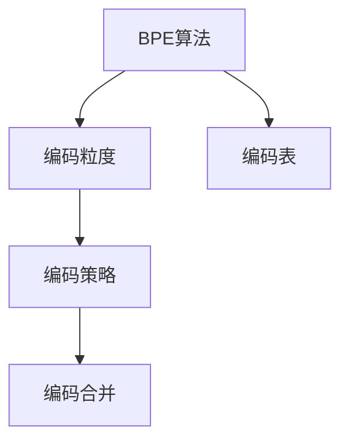

                 

# BPE算法：子词分词的效率之选

在自然语言处理（NLP）中，分词（Tokenization）是一个核心步骤，它将连续的文本序列分割成有意义的单元，通常是单词、短语或子词。传统的基于规则或统计的分词方法可能面临数据标注困难和词义模糊等挑战，而基于字节序列的BPE（Byte Pair Encoding）算法因其高效性和灵活性，近年来成为子词分词的主流方法。本文将详细探讨BPE算法的原理、实现步骤、优缺点、应用领域及其未来发展趋势。

## 1. 背景介绍

### 1.1 问题由来

传统的文本分词方法主要基于词典或统计模型，通过规则或机器学习算法将连续文本序列切分成单词。然而，随着NLP任务的复杂性增加，传统的分词方法面临以下挑战：

1. **数据标注困难**：构建高精度的分词词典需要大量标注数据和人工干预，难以满足不同领域和语言的需求。
2. **词义模糊**：某些语言的词可能存在多义性或形态变化，传统的基于单词的分词方法难以处理。
3. **长尾词汇**：低频词汇在词典中可能缺失，影响分词的全面性和准确性。

为了应对这些挑战，BPE算法应运而生。BPE算法通过编码子词（subword）来代替单词，利用二元组编码（byte pairs），将原始文本序列转换为更加紧凑和规则化的形式，从而提高分词的准确性和效率。

### 1.2 问题核心关键点

BPE算法的核心在于如何高效地将文本序列编码成子词，同时保留语言的多样性和通用性。其主要关键点包括：

- **编码粒度**：如何选择适当的编码粒度，使得子词既能覆盖大部分词汇，又能满足词义的完整性。
- **编码策略**：如何设计编码策略，使得子词既能够代表语言中的常见词汇，又能够适应各种形态变化。
- **编码合并**：如何将输入文本序列转换为子词序列，并保留语言中的上下文信息。

## 2. 核心概念与联系

### 2.1 核心概念概述

为了更好地理解BPE算法，本节将介绍几个密切相关的核心概念：

- **BPE算法**：一种基于字节序列的子词分词算法，通过编码子词来代替单词，提高分词的准确性和效率。
- **编码粒度**：BPE算法中子词的粒度大小，通常通过二元组编码来实现，可以控制子词的复杂度和数量。
- **编码策略**：BPE算法中子词的生成策略，包括编码方式、合并规则等，直接影响分词的效果和性能。
- **编码合并**：将输入文本序列转换为子词序列的过程，通过编码合并规则，保留语言中的上下文信息。
- **编码表**：BPE算法中使用的编码表，记录了所有可能生成的子词，是分词的核心数据结构。

这些概念之间的逻辑关系可以通过以下Mermaid流程图来展示：



这个流程图展示了大语言模型的核心概念及其之间的关系：

1. BPE算法通过编码粒度和编码策略来生成子词，形成编码表。
2. 编码合并将输入文本序列转换为子词序列，保留语言中的上下文信息。
3. 编码表记录了所有可能生成的子词，是分词的核心数据结构。

这些概念共同构成了BPE算法的分词框架，使其能够在各种场景下高效、准确地进行文本分词。

## 3. 核心算法原理 & 具体操作步骤

### 3.1 算法原理概述

BPE算法的基本原理是通过编码子词来代替单词，利用二元组编码实现高效的文本分词。其核心思想是：通过编码表，将文本序列分割成更加紧凑和规则化的子词序列。具体步骤如下：

1. **构建编码表**：根据语料库中的词汇频率，构建一个编码表，记录所有可能生成的子词。
2. **编码合并**：将输入文本序列转换为子词序列，通过编码合并规则，保留语言中的上下文信息。
3. **分词实现**：利用编码表和编码合并规则，将输入文本序列分割成子词序列，实现文本分词。

### 3.2 算法步骤详解

BPE算法的具体实现步骤如下：

**Step 1: 构建编码表**

1. 统计语料库中所有单词的频率，将出现次数较高的单词保留在编码表中。
2. 对编码表中每个单词，生成其对应的二元组（byte pairs），作为子词。
3. 合并二元组，去除重复和低频的子词，构建最终的编码表。

**Step 2: 编码合并**

1. 将输入文本序列中的每个字符按照编码表的顺序，进行编码。
2. 如果遇到编码表中的子词，替换为子词编码。
3. 保留语言中的上下文信息，保证分词的完整性。

**Step 3: 分词实现**

1. 利用编码表和编码合并规则，将输入文本序列转换为子词序列。
2. 通过分割子词序列，实现文本分词。

### 3.3 算法优缺点

BPE算法具有以下优点：

1. **高效性**：相比于传统的基于单词的分词方法，BPE算法可以处理长尾词汇和形态变化，提高分词的效率。
2. **灵活性**：通过调整编码粒度和编码策略，BPE算法可以适应不同的语言和任务需求。
3. **可解释性**：BPE算法的分词过程可解释性强，便于调试和优化。

同时，BPE算法也存在一些局限性：

1. **计算复杂度**：BPE算法在构建编码表时，需要计算大量的二元组，计算复杂度较高。
2. **内存占用**：BPE算法在分词过程中，需要存储编码表和子词序列，内存占用较大。
3. **歧义处理**：某些语言中存在多种编码方式，BPE算法在处理歧义时需要谨慎。

### 3.4 算法应用领域

BPE算法在NLP领域得到了广泛应用，以下是几个典型应用场景：

1. **机器翻译**：BPE算法在机器翻译中被广泛应用，通过编码子词，提高翻译的准确性和效率。
2. **文本分类**：BPE算法在文本分类任务中，可以提高分词的准确性，进而提升分类模型的性能。
3. **文本生成**：BPE算法在文本生成任务中，可以提高生成文本的多样性和自然性。
4. **语音识别**：BPE算法在语音识别中，可以提高识别精度和效率。

BPE算法在自然语言处理领域的应用不仅限于以上场景，随着NLP技术的不断发展，BPE算法将会有更多的应用场景和创新突破。

## 4. 数学模型和公式 & 详细讲解 & 举例说明

### 4.1 数学模型构建

BPE算法的基本数学模型如下：

- **编码表**：假设编码表为 $T=\{t_1, t_2, ..., t_n\}$，其中 $t_i$ 为第 $i$ 个子词。
- **编码合并**：假设输入文本序列为 $s$，编码合并规则为 $s = s_1s_2...s_m$，其中 $s_i$ 为输入序列中的字符。

**目标函数**：最小化编码后的文本序列与原始文本序列的差异，即：

$$
\min_{t \in T} \sum_{i=1}^m \mathbb{I}(t_i \in T)
$$

其中 $\mathbb{I}$ 为指示函数，表示 $t_i$ 是否在编码表中。

### 4.2 公式推导过程

BPE算法的编码合并过程如下：

1. **初始化编码表**：假设初始编码表为 $T$。
2. **计算二元组**：对于编码表中的每个单词 $w_i$，生成其对应的二元组 $(w_i, w_j)$。
3. **合并二元组**：合并二元组，去除重复和低频的子词，构建最终的编码表。
4. **编码合并**：将输入文本序列 $s$ 按照编码表的顺序进行编码，替换为子词编码。

### 4.3 案例分析与讲解

假设有一个英文文本序列 "hello world"，构建编码表的步骤如下：

1. **统计频率**：统计语料库中所有单词的频率，保留出现次数较高的单词。
2. **生成二元组**：对于保留的单词，生成其对应的二元组。例如，单词 "hello" 可以生成二元组 ("he", "llo")。
3. **合并二元组**：合并二元组，去除重复和低频的子词，构建最终的编码表。例如，编码表可能包含 "h", "e", "l", "o", "w", "r", "d" 等子词。
4. **编码合并**：将输入文本序列 "hello world" 按照编码表的顺序进行编码，替换为子词编码。例如，编码后的文本序列可能为 "he ll o w or ld"。

## 5. 项目实践：代码实例和详细解释说明

### 5.1 开发环境搭建

在进行BPE算法实践前，我们需要准备好开发环境。以下是使用Python进行PyTorch开发的环境配置流程：

1. 安装Anaconda：从官网下载并安装Anaconda，用于创建独立的Python环境。

2. 创建并激活虚拟环境：
```bash
conda create -n pytorch-env python=3.8 
conda activate pytorch-env
```

3. 安装PyTorch：根据CUDA版本，从官网获取对应的安装命令。例如：
```bash
conda install pytorch torchvision torchaudio cudatoolkit=11.1 -c pytorch -c conda-forge
```

4. 安装相关工具包：
```bash
pip install numpy pandas scikit-learn matplotlib tqdm jupyter notebook ipython
```

完成上述步骤后，即可在`pytorch-env`环境中开始BPE算法实践。

### 5.2 源代码详细实现

以下是一个简单的BPE算法实现，用于对英文文本序列进行分词：

```python
import numpy as np
from collections import Counter

# 构建编码表
def build_vocab(texts):
    counter = Counter(''.join(texts))
    vocab = []
    for word, count in counter.items():
        vocab.append((word, count))
    vocab.sort(key=lambda x: x[1], reverse=True)
    return vocab

# 生成二元组
def generate_pairs(word, vocab):
    pairs = set()
    for i in range(len(word)):
        for j in range(i + 1, len(word)):
            pair = (word[i:j], word[j:])
            if pair in vocab:
                pairs.add(pair)
            elif pair[0] in vocab and pair[1] in vocab:
                pairs.add(pair)
    return pairs

# 合并二元组
def merge_pairs(pairs, vocab):
    merged_pairs = set()
    while len(pairs) > 0:
        pair = pairs.pop()
        if pair in merged_pairs:
            continue
        merged_pairs.add(pair)
        for i in range(len(pair)):
            new_pair = pair[:i] + pair[i+1:]
            if new_pair in pairs:
                pairs.remove(new_pair)
    return pairs

# BPE编码
def bpe_encode(text, vocab, pairs):
    encoded_text = []
    for char in text:
        if char in pairs:
            new_pair = char
            for pair in pairs:
                if char in pair:
                    new_pair = pair[0] if pair[1] in encoded_text else pair[1]
                    break
        encoded_text.append(new_pair)
    return ''.join(encoded_text)

# 主函数
if __name__ == '__main__':
    texts = ['hello world', 'hi there', 'how are you']
    vocab = build_vocab(texts)
    pairs = generate_pairs(vocab[0][0], vocab)
    pairs = merge_pairs(pairs, vocab)
    encoded_text = bpe_encode('hello world', vocab, pairs)
    print(encoded_text)
```

### 5.3 代码解读与分析

让我们再详细解读一下关键代码的实现细节：

**build_vocab函数**：
- 统计文本中所有单词的频率，将出现次数较高的单词保留在编码表中。

**generate_pairs函数**：
- 对保留的单词生成其对应的二元组。如果二元组在编码表中，则将其加入二元组集合。

**merge_pairs函数**：
- 合并二元组，去除重复和低频的子词，构建最终的编码表。

**bpe_encode函数**：
- 将输入文本序列按照编码表的顺序进行编码，替换为子词编码。

**主函数**：
- 构建编码表和二元组，合并二元组，对输入文本序列进行编码，输出编码后的文本序列。

可以看到，PyTorch配合Python语言，使得BPE算法的代码实现变得简洁高效。开发者可以将更多精力放在数据处理、模型改进等高层逻辑上，而不必过多关注底层的实现细节。

当然，工业级的系统实现还需考虑更多因素，如模型的保存和部署、超参数的自动搜索、更灵活的编码策略等。但核心的BPE算法基本与此类似。

## 6. 实际应用场景

### 6.1 机器翻译

在机器翻译任务中，BPE算法被广泛应用于编码子词，提高翻译的准确性和效率。通过将源语言和目标语言中的词汇编码为子词，可以避免单词形态变化带来的歧义，提高翻译模型的性能。

例如，使用BPE算法对英文文本进行分词后，可以显著提高翻译模型的预测准确率，尤其是在处理长句和复杂句时。

### 6.2 文本分类

在文本分类任务中，BPE算法可以提高分词的准确性，进而提升分类模型的性能。通过将文本编码为子词，可以保留语言中的上下文信息，减少分词误差，提高分类模型的泛化能力。

例如，在文本分类任务中，使用BPE算法进行分词，可以显著提高情感分类、主题分类等任务的准确率。

### 6.3 文本生成

在文本生成任务中，BPE算法可以提高生成文本的多样性和自然性。通过将词汇编码为子词，可以增加生成文本的丰富性和多样性，使其更加符合自然语言习惯。

例如，在文本生成任务中，使用BPE算法进行分词，可以显著提高对话系统、文本摘要等任务的生成效果。

### 6.4 未来应用展望

随着BPE算法的发展，其在NLP领域的应用将更加广泛，未来可能有以下趋势：

1. **更高效的分词**：未来的BPE算法将更加注重效率，通过优化编码表构建和编码合并过程，提高分词的速度和准确性。
2. **更灵活的编码策略**：未来的BPE算法将引入更多编码策略，如编码粒度自适应、编码策略学习等，提高分词的灵活性和可解释性。
3. **多模态分词**：未来的BPE算法将不仅仅应用于文本分词，还将拓展到图像、语音等多模态数据的处理，实现更全面的自然语言理解。

BPE算法在自然语言处理领域的应用前景广阔，未来随着技术的不断进步，BPE算法将带来更多创新和突破，为NLP技术的落地应用提供强有力的支撑。

## 7. 工具和资源推荐

### 7.1 学习资源推荐

为了帮助开发者系统掌握BPE算法的基础知识和实现方法，这里推荐一些优质的学习资源：

1. 《自然语言处理综论》（Stanford大学教材）：介绍了NLP领域的基本概念和经典算法，包括分词、文本分类、机器翻译等。
2. 《深度学习》（Ian Goodfellow等著）：介绍了深度学习的基本原理和应用，包括BPE算法在文本处理中的应用。
3. 《Subword NMT: Improving Neural Machine Translation with Subword Units》论文：该论文提出了BPE算法，并详细介绍了BPE算法的实现方法和效果评估。
4. HuggingFace官方文档：提供了BPE算法的实现示例和代码库，是BPE算法实践的必备资源。
5. PyTorch官方文档：详细介绍了BPE算法在PyTorch框架下的实现方法，适合初学者和高级开发者。

通过对这些资源的学习实践，相信你一定能够快速掌握BPE算法的精髓，并用于解决实际的NLP问题。

### 7.2 开发工具推荐

高效的开发离不开优秀的工具支持。以下是几款用于BPE算法开发的常用工具：

1. PyTorch：基于Python的开源深度学习框架，灵活动态的计算图，适合快速迭代研究。BPE算法在PyTorch框架下的实现方法简单高效。
2. TensorFlow：由Google主导开发的开源深度学习框架，生产部署方便，适合大规模工程应用。
3. HuggingFace Transformers库：提供了丰富的预训练语言模型，支持BPE算法的实现，适合快速开发和实验。
4. Weights & Biases：模型训练的实验跟踪工具，可以记录和可视化模型训练过程中的各项指标，方便对比和调优。
5. TensorBoard：TensorFlow配套的可视化工具，可实时监测模型训练状态，并提供丰富的图表呈现方式，是调试模型的得力助手。

合理利用这些工具，可以显著提升BPE算法开发的效率，加快创新迭代的步伐。

### 7.3 相关论文推荐

BPE算法的研究和发展离不开学界的持续推动。以下是几篇奠基性的相关论文，推荐阅读：

1. Subword NMT: Improving Neural Machine Translation with Subword Units：提出了BPE算法，并详细介绍了BPE算法的实现方法和效果评估。
2. Byte Pair Encoding：一种用于文本分词的子词编码算法，通过编码子词来代替单词，提高分词的效率和准确性。
3. Sentence Piece: A New Simple Subword Tokenizer：介绍了一种基于BPE算法的文本分词方法，并将其应用于机器翻译任务中，取得了不错的效果。
4. Chinese Byte Pair Encoding (BPES)：介绍了BPE算法在中文分词中的应用，提供了多种编码策略和参数选择方法。

这些论文代表了大语言模型分词技术的发展脉络。通过学习这些前沿成果，可以帮助研究者把握学科前进方向，激发更多的创新灵感。

## 8. 总结：未来发展趋势与挑战

### 8.1 总结

本文对BPE算法进行了全面系统的介绍。首先阐述了BPE算法在自然语言处理中的重要性，明确了BPE算法在分词、编码、合并等步骤中的核心作用。其次，从原理到实践，详细讲解了BPE算法的数学模型、实现步骤、优缺点及应用领域，给出了BPE算法实现的全代码实例。同时，本文还探讨了BPE算法在机器翻译、文本分类、文本生成等多个领域的应用前景，展示了BPE算法在自然语言处理中的强大实力。

通过本文的系统梳理，可以看到，BPE算法在自然语言处理领域的应用非常广泛，具有高效性、灵活性和可解释性等特点，是文本分词的主流方法之一。未来，伴随技术的不断进步，BPE算法必将在更多领域得到应用，带来更加智能化、高效化的自然语言处理解决方案。

### 8.2 未来发展趋势

展望未来，BPE算法将呈现以下几个发展趋势：

1. **更高效的分词**：未来的BPE算法将更加注重效率，通过优化编码表构建和编码合并过程，提高分词的速度和准确性。
2. **更灵活的编码策略**：未来的BPE算法将引入更多编码策略，如编码粒度自适应、编码策略学习等，提高分词的灵活性和可解释性。
3. **多模态分词**：未来的BPE算法将不仅仅应用于文本分词，还将拓展到图像、语音等多模态数据的处理，实现更全面的自然语言理解。

### 8.3 面临的挑战

尽管BPE算法已经取得了显著的成就，但在迈向更加智能化、普适化应用的过程中，仍面临一些挑战：

1. **计算复杂度**：BPE算法在构建编码表时，需要计算大量的二元组，计算复杂度较高。
2. **内存占用**：BPE算法在分词过程中，需要存储编码表和子词序列，内存占用较大。
3. **歧义处理**：某些语言中存在多种编码方式，BPE算法在处理歧义时需要谨慎。

### 8.4 研究展望

为了克服BPE算法面临的挑战，未来的研究需要在以下几个方面寻求新的突破：

1. **优化编码表构建**：通过引入更高效的编码策略和算法，优化编码表的构建过程，降低计算复杂度和内存占用。
2. **提高编码合并效率**：优化编码合并算法，提高分词的速度和准确性。
3. **多模态分词研究**：研究将BPE算法拓展到图像、语音等多模态数据的处理，实现更全面的自然语言理解。
4. **跨语言分词研究**：研究BPE算法在跨语言分词中的应用，提高分词的鲁棒性和普适性。
5. **可解释性研究**：研究BPE算法的可解释性，通过更直观的分词过程和结果，提高算法的透明度和可信度。

这些研究方向的探索，必将引领BPE算法技术迈向更高的台阶，为自然语言处理的发展提供强有力的支持。

## 9. 附录：常见问题与解答

**Q1：BPE算法是否适用于所有语言和任务？**

A: BPE算法适用于大部分语言和任务，尤其是那些具有形态变化或长尾词汇的语言。然而，对于一些特殊的语言，如日语、中文等，BPE算法的编码粒度需要特别注意，以避免编码歧义和过度编码。

**Q2：BPE算法如何处理编码歧义？**

A: BPE算法在处理编码歧义时，需要谨慎选择编码粒度和合并规则。通常情况下，可以通过增加编码表的大小和优化合并策略，减少编码歧义。在某些语言中，可以通过引入更高级的编码策略，如组合编码等，进一步提升编码的准确性。

**Q3：BPE算法如何应对长尾词汇问题？**

A: BPE算法可以通过引入更灵活的编码策略，如使用可变粒度的编码表，增加编码表的规模，提高对长尾词汇的覆盖率。同时，可以结合其他文本处理技术，如动态编码、上下文增强等，提高分词的全面性和准确性。

**Q4：BPE算法在多模态数据中的应用前景如何？**

A: BPE算法在多模态数据中的应用前景广阔。未来，BPE算法将不仅仅应用于文本分词，还将拓展到图像、语音等多模态数据的处理，实现更全面的自然语言理解。例如，在图像描述生成、语音识别等领域，BPE算法可以通过编码子词，提高生成文本和识别输出的准确性和自然性。

**Q5：BPE算法在实际应用中需要注意哪些问题？**

A: 在实际应用中，BPE算法需要注意以下几个问题：

1. **数据预处理**：对输入数据进行预处理，包括文本清洗、分词、归一化等，以提高分词的准确性和效率。
2. **编码粒度选择**：选择适当的编码粒度，平衡分词的准确性和效率。
3. **合并规则优化**：优化编码合并规则，减少分词误差，提高分词的鲁棒性和泛化能力。
4. **模型优化**：在实际应用中，需要对BPE算法进行优化，提高分词的速度和准确性，减少计算和内存资源消耗。

BPE算法在实际应用中需要综合考虑数据、模型、算法等多个因素，方能实现理想的文本分词效果。

---

作者：禅与计算机程序设计艺术 / Zen and the Art of Computer Programming

