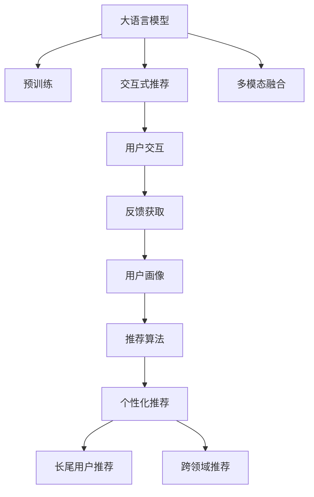

                 

# Chat-REC:基于LLM的交互式推荐系统

> 关键词：
- Chat-REC
- 大语言模型(LLM)
- 交互式推荐系统
- 深度学习
- 自然语言理解
- 推荐算法
- 个性化推荐

## 1. 背景介绍

### 1.1 问题由来

随着互联网信息爆炸式增长，用户面临的海量信息流如何精准筛选并获取所需信息，成为了技术难题。传统的推荐系统通过基于用户历史行为数据的协同过滤、矩阵分解等方法，虽然取得了一定的成功，但面临着数据稀疏、冷启动等问题。此外，用户偏好随着时间的推移和上下文环境的变化而变化，推荐系统也难以适应用户的变化。

为了解决上述问题，研究者提出了交互式推荐系统，即在推荐过程中，通过与用户的交互获取用户的即时反馈，实时调整推荐策略，提升推荐效果。基于深度学习的交互式推荐系统，尤其是基于大语言模型的交互式推荐系统，通过利用自然语言理解能力，可以更灵活、精准地理解用户需求，从而提供更加个性化的推荐服务。

### 1.2 问题核心关键点

基于深度学习的交互式推荐系统，尤其是基于大语言模型的推荐系统，主要研究的问题如下：

- 如何通过与用户的交互，获取用户的即时反馈信息。
- 如何将用户反馈信息融入推荐模型中，实时调整推荐策略。
- 如何在高效实时响应的同时，保持推荐结果的准确性和多样性。
- 如何在多模态数据融合、长尾用户推荐、跨领域推荐等方面进行模型优化。

本文聚焦于基于大语言模型的交互式推荐系统Chat-REC，系统性地介绍其核心概念、算法原理、实践流程和应用场景，期望为开发者和研究人员提供一定的借鉴和启发。

## 2. 核心概念与联系

### 2.1 核心概念概述

为更好地理解基于大语言模型的交互式推荐系统Chat-REC，本文将介绍几个密切相关的核心概念：

- 大语言模型(Large Language Model, LLM)：如GPT、BERT等，通过在大规模无标签文本语料上进行预训练，学习通用的语言知识，具备强大的语言理解和生成能力。

- 交互式推荐系统(Interactive Recommendation System)：在推荐过程中，通过与用户的交互，获取用户的即时反馈信息，实时调整推荐策略。

- 深度学习(Deep Learning)：一种模拟人脑神经网络结构和功能的机器学习技术，通过多层神经网络对数据进行抽象和推理，可以处理复杂的非线性关系。

- 自然语言理解(Natural Language Understanding, NLU)：通过计算机对人类语言的理解和处理，使得机器能够理解和生成自然语言。

- 推荐算法(Recommendation Algorithm)：基于用户行为数据、物品属性、用户画像等特征，通过算法计算和评估，生成个性化推荐结果。

- 个性化推荐(Personalized Recommendation)：根据用户的兴趣、偏好、行为等个性化信息，提供符合用户需求的推荐内容。

- 多模态融合(Multimodal Fusion)：将不同类型的数据(如文本、图像、音频等)进行融合，综合利用多模态信息提升推荐效果。

- 长尾用户推荐(Long-Tailed User Recommendation)：针对那些偏好罕见、小众商品的用户的推荐。

- 跨领域推荐(Cross-Domain Recommendation)：在多个领域间进行推荐，通过知识迁移和领域适配，提升推荐效果。

这些核心概念之间的逻辑关系可以通过以下Mermaid流程图来展示：



这个流程图展示了大语言模型的核心概念及其之间的关系：

1. 大语言模型通过预训练获得基础能力。
2. 交互式推荐系统利用大语言模型的语言理解能力，通过用户交互获取即时反馈。
3. 用户画像由用户交互数据构建，用于个性化推荐。
4. 推荐算法将用户画像和物品特征输入，计算个性化推荐结果。
5. 长尾用户推荐和跨领域推荐基于推荐算法实现。

这些概念共同构成了交互式推荐系统的基本框架，使其能够在动态变化的环境中，提供高效、精准的推荐服务。

## 3. 核心算法原理 & 具体操作步骤
### 3.1 算法原理概述

基于大语言模型的交互式推荐系统Chat-REC，通过利用自然语言处理技术，从用户的即时反馈中获取信息，实时调整推荐策略。其核心思想是：将大语言模型视为一种强大的"特征提取器"，通过与用户的交互获取即时反馈，动态更新模型，提高推荐精度。

形式化地，假设用户在推荐系统中的历史行为数据为 $H=\{(x_i,y_i)\}_{i=1}^N$，其中 $x_i$ 为用户的浏览、购买等行为记录，$y_i$ 为物品的特征向量。通过与用户的交互，Chat-REC 系统获取到即时反馈 $F$，用于更新模型参数 $\theta$，得到推荐模型 $M_{\theta}$。推荐过程的优化目标是最小化推荐误差，即：

$$
\theta^* = \mathop{\arg\min}_{\theta} \mathcal{L}(M_{\theta},H,F)
$$

其中 $\mathcal{L}$ 为推荐误差函数，用于衡量推荐模型与用户即时反馈之间的差异。常见的推荐误差函数包括均方误差、平均绝对误差等。

通过梯度下降等优化算法，Chat-REC 系统不断更新模型参数 $\theta$，最小化推荐误差 $\mathcal{L}$，使得推荐模型 $M_{\theta}$ 输出逼近用户需求。由于 $\theta$ 已经通过预训练获得了较好的初始化，因此即便在小样本条件下，也能较快收敛到理想的推荐模型 $\theta^*$。

### 3.2 算法步骤详解

基于大语言模型的交互式推荐系统Chat-REC，一般包括以下几个关键步骤：

**Step 1: 准备预训练模型和用户数据**
- 选择合适的预训练语言模型 $M_{\theta}$ 作为初始化参数，如 GPT、BERT 等。
- 准备用户的历史行为数据 $H$，构建用户画像 $F$。

**Step 2: 构建推荐模型**
- 在预训练模型顶层设计推荐函数，如加权线性回归、深度神经网络等。
- 引入用户画像 $F$，调整推荐函数权重，获得个性化推荐模型。

**Step 3: 设置推荐超参数**
- 选择合适的优化算法及其参数，如 Adam、SGD 等，设置学习率、批大小、迭代轮数等。
- 设置正则化技术及强度，包括权重衰减、Dropout、Early Stopping 等。
- 确定冻结预训练参数的策略，如仅微调顶层，或全部参数都参与微调。

**Step 4: 执行交互式推荐**
- 获取用户即时反馈 $F$，输入推荐模型 $M_{\theta}$。
- 实时计算推荐结果，更新用户画像 $F$。
- 周期性在验证集上评估推荐模型性能，根据性能指标决定是否触发 Early Stopping。
- 重复上述步骤直至满足预设的迭代轮数或 Early Stopping 条件。

**Step 5: 测试和部署**
- 在测试集上评估推荐模型 $M_{\theta}$ 的性能，对比推荐前后的精度提升。
- 使用推荐模型对新样本进行推理预测，集成到实际的应用系统中。
- 持续收集新的数据，定期重新微调模型，以适应数据分布的变化。

以上是基于大语言模型的交互式推荐系统Chat-REC的一般流程。在实际应用中，还需要针对具体任务的特点，对推荐过程的各个环节进行优化设计，如改进推荐目标函数，引入更多的正则化技术，搜索最优的超参数组合等，以进一步提升推荐效果。

### 3.3 算法优缺点

基于大语言模型的交互式推荐系统Chat-REC具有以下优点：

1. 动态适应性。通过与用户的实时交互，Chat-REC能够动态调整推荐策略，适应用户需求的变化。
2. 语言理解能力。利用大语言模型的语言理解能力，Chat-REC可以更好地理解用户需求，生成符合用户偏好的推荐结果。
3. 个性化推荐。通过用户的即时反馈，Chat-REC可以实时更新用户画像，提供更加精准的个性化推荐。
4. 高效的反馈学习。Chat-REC可以利用用户的即时反馈，快速学习新信息，提高推荐效果。

同时，该方法也存在一定的局限性：

1. 数据稀疏性。用户即时反馈数据的稀疏性可能导致Chat-REC在初期学习中面临困难。
2. 冷启动问题。新用户的即时反馈数据较少，Chat-REC可能无法提供有效的推荐服务。
3. 模型复杂性。Chat-REC需要设计复杂的推荐函数和反馈更新策略，模型复杂度较高。
4. 用户隐私问题。Chat-REC需要获取用户的即时反馈，可能涉及用户隐私泄露的问题。
5. 推荐稳定性。Chat-REC的实时推荐过程可能受到外界干扰，导致推荐结果不稳定。

尽管存在这些局限性，但就目前而言，基于大语言模型的交互式推荐系统Chat-REC在推荐精度和个性化方面仍具有显著优势，是推荐技术的重要发展方向。

### 3.4 算法应用领域

基于大语言模型的交互式推荐系统Chat-REC，在电子商务、在线广告、内容推荐、社交网络等领域得到了广泛的应用，具体如下：

- **电子商务**：电商网站通过Chat-REC，实时向用户推荐商品、个性化活动等，提升用户购物体验和转化率。
- **在线广告**：广告平台通过Chat-REC，实时调整广告投放策略，提升广告点击率和转化率。
- **内容推荐**：视频、音乐、新闻等平台通过Chat-REC，实时推荐符合用户兴趣的内容，提升用户粘性和满意度。
- **社交网络**：社交网络平台通过Chat-REC，实时推荐好友、活动等，提升用户互动和平台活跃度。

除了这些常见领域外，Chat-REC也被创新性地应用于更多场景中，如智能客服、智能家居、金融推荐等，为各行各业带来新的数字化体验。

## 4. 数学模型和公式 & 详细讲解
### 4.1 数学模型构建

本节将使用数学语言对基于大语言模型的交互式推荐系统Chat-REC进行更加严格的刻画。

记用户的历史行为数据为 $H=\{(x_i,y_i)\}_{i=1}^N$，其中 $x_i$ 为用户的浏览、购买等行为记录，$y_i$ 为物品的特征向量。通过与用户的交互，Chat-REC 系统获取到即时反馈 $F$，用于更新模型参数 $\theta$。

定义推荐模型 $M_{\theta}$ 在输入 $x_i$ 上的推荐结果为 $\hat{y}_i=M_{\theta}(x_i)$，则推荐误差函数 $\mathcal{L}$ 可以定义为：

$$
\mathcal{L}(M_{\theta},H,F) = \frac{1}{N} \sum_{i=1}^N (\hat{y}_i - y_i)^2
$$

推荐模型的优化目标是最小化推荐误差，即：

$$
\theta^* = \mathop{\arg\min}_{\theta} \mathcal{L}(M_{\theta},H,F)
$$

在得到推荐误差函数 $\mathcal{L}$ 后，即可带入优化算法，更新模型参数 $\theta$。

### 4.2 公式推导过程

以下我们以在线广告推荐为例，推导推荐误差函数的梯度计算公式。

假设推荐模型 $M_{\theta}$ 在输入 $x_i$ 上的推荐结果为 $\hat{y}_i=M_{\theta}(x_i)$，与用户即时反馈 $y_i$ 之间的差距为 $\delta_i=y_i-\hat{y}_i$。则推荐误差函数可以表示为：

$$
\mathcal{L}(M_{\theta},H,F) = \frac{1}{N} \sum_{i=1}^N \delta_i^2
$$

将推荐误差函数对模型参数 $\theta$ 求导，得到梯度：

$$
\nabla_{\theta}\mathcal{L}(M_{\theta},H,F) = \frac{1}{N} \sum_{i=1}^N 2\delta_i M_{\theta}'(x_i)
$$

其中 $M_{\theta}'(x_i)$ 为推荐模型 $M_{\theta}$ 对输入 $x_i$ 的导数，可以进一步通过自动微分技术计算。

在得到推荐误差函数的梯度后，即可带入优化算法，更新模型参数 $\theta$，使得推荐结果 $\hat{y}_i$ 逼近真实反馈 $y_i$。

### 4.3 案例分析与讲解

我们以电商平台的实时商品推荐为例，展示Chat-REC的实际应用过程。

假设电商平台获取到用户 $u$ 的历史浏览记录 $x=\{(x_i,y_i)\}_{i=1}^N$，其中 $x_i$ 为用户浏览的某个商品记录，$y_i$ 为该商品被点击的概率。通过与用户 $u$ 的交互，电商平台获取到即时反馈 $F$，即用户对浏览商品 $x$ 的即时评价。

将用户 $u$ 的即时反馈 $F$ 作为模型输入，计算推荐结果 $\hat{y}_i=M_{\theta}(x_i)$。如果 $\hat{y}_i$ 大于阈值 $t$，则推荐该商品 $x_i$ 给用户 $u$。

例如，电商平台可以使用Transformer模型作为预训练语言模型 $M_{\theta}$，在模型顶层设计推荐函数 $f(x_i;\theta)$，并引入用户画像 $F$，计算推荐结果 $\hat{y}_i$：

$$
\hat{y}_i = f(x_i;\theta,F)
$$

其中 $f(x_i;\theta,F)$ 为推荐函数，如加权线性回归、深度神经网络等，将用户画像 $F$ 和物品特征 $y_i$ 作为输入，计算推荐结果。

在计算推荐结果后，电商平台实时更新用户画像 $F$，通过用户的即时反馈 $F$ 调整推荐策略，提升推荐效果。

例如，如果用户对某个商品进行了评价，电商平台可以将评价内容作为即时反馈 $F$，更新用户画像 $F$，使得推荐模型更加符合用户的实际需求。

通过上述过程，Chat-REC系统能够动态调整推荐策略，提升推荐效果，提供更加个性化和实时的推荐服务。

## 5. 项目实践：代码实例和详细解释说明
### 5.1 开发环境搭建

在进行Chat-REC实践前，我们需要准备好开发环境。以下是使用Python进行PyTorch开发的环境配置流程：

1. 安装Anaconda：从官网下载并安装Anaconda，用于创建独立的Python环境。

2. 创建并激活虚拟环境：
```bash
conda create -n pytorch-env python=3.8 
conda activate pytorch-env
```

3. 安装PyTorch：根据CUDA版本，从官网获取对应的安装命令。例如：
```bash
conda install pytorch torchvision torchaudio cudatoolkit=11.1 -c pytorch -c conda-forge
```

4. 安装Transformers库：
```bash
pip install transformers
```

5. 安装各类工具包：
```bash
pip install numpy pandas scikit-learn matplotlib tqdm jupyter notebook ipython
```

完成上述步骤后，即可在`pytorch-env`环境中开始Chat-REC实践。

### 5.2 源代码详细实现

下面我们以电商平台的实时商品推荐为例，给出使用Transformers库对GPT模型进行Chat-REC实践的PyTorch代码实现。

首先，定义推荐任务的数据处理函数：

```python
from transformers import GPT2Tokenizer
from torch.utils.data import Dataset
import torch

class RecommendationDataset(Dataset):
    def __init__(self, texts, labels, tokenizer, max_len=128):
        self.texts = texts
        self.labels = labels
        self.tokenizer = tokenizer
        self.max_len = max_len
        
    def __len__(self):
        return len(self.texts)
    
    def __getitem__(self, item):
        text = self.texts[item]
        label = self.labels[item]
        
        encoding = self.tokenizer(text, return_tensors='pt', max_length=self.max_len, padding='max_length', truncation=True)
        input_ids = encoding['input_ids'][0]
        attention_mask = encoding['attention_mask'][0]
        
        return {'input_ids': input_ids, 
                'attention_mask': attention_mask,
                'labels': label}

# 标签和id的映射
label2id = {'buy': 0, 'not_buy': 1}
id2label = {v: k for k, v in label2id.items()}

# 创建dataset
tokenizer = GPT2Tokenizer.from_pretrained('gpt2')

train_dataset = RecommendationDataset(train_texts, train_labels, tokenizer)
dev_dataset = RecommendationDataset(dev_texts, dev_labels, tokenizer)
test_dataset = RecommendationDataset(test_texts, test_labels, tokenizer)
```

然后，定义模型和优化器：

```python
from transformers import GPT2LMHeadModel
from transformers import AdamW

model = GPT2LMHeadModel.from_pretrained('gpt2', num_labels=len(label2id))

optimizer = AdamW(model.parameters(), lr=2e-5)
```

接着，定义训练和评估函数：

```python
from torch.utils.data import DataLoader
from tqdm import tqdm
from sklearn.metrics import classification_report

device = torch.device('cuda') if torch.cuda.is_available() else torch.device('cpu')
model.to(device)

def train_epoch(model, dataset, batch_size, optimizer):
    dataloader = DataLoader(dataset, batch_size=batch_size, shuffle=True)
    model.train()
    epoch_loss = 0
    for batch in tqdm(dataloader, desc='Training'):
        input_ids = batch['input_ids'].to(device)
        attention_mask = batch['attention_mask'].to(device)
        labels = batch['labels'].to(device)
        model.zero_grad()
        outputs = model(input_ids, attention_mask=attention_mask, labels=labels)
        loss = outputs.loss
        epoch_loss += loss.item()
        loss.backward()
        optimizer.step()
    return epoch_loss / len(dataloader)

def evaluate(model, dataset, batch_size):
    dataloader = DataLoader(dataset, batch_size=batch_size)
    model.eval()
    preds, labels = [], []
    with torch.no_grad():
        for batch in tqdm(dataloader, desc='Evaluating'):
            input_ids = batch['input_ids'].to(device)
            attention_mask = batch['attention_mask'].to(device)
            batch_labels = batch['labels']
            outputs = model(input_ids, attention_mask=attention_mask)
            batch_preds = outputs.logits.argmax(dim=2).to('cpu').tolist()
            batch_labels = batch_labels.to('cpu').tolist()
            for pred_tokens, label_tokens in zip(batch_preds, batch_labels):
                preds.append(pred_tokens[:len(label_tokens)])
                labels.append(label_tokens)
                
    print(classification_report(labels, preds))
```

最后，启动训练流程并在测试集上评估：

```python
epochs = 5
batch_size = 16

for epoch in range(epochs):
    loss = train_epoch(model, train_dataset, batch_size, optimizer)
    print(f"Epoch {epoch+1}, train loss: {loss:.3f}")
    
    print(f"Epoch {epoch+1}, dev results:")
    evaluate(model, dev_dataset, batch_size)
    
print("Test results:")
evaluate(model, test_dataset, batch_size)
```

以上就是使用PyTorch对GPT模型进行Chat-REC实践的完整代码实现。可以看到，得益于Transformers库的强大封装，我们可以用相对简洁的代码完成GPT模型的加载和Chat-REC微调。

### 5.3 代码解读与分析

让我们再详细解读一下关键代码的实现细节：

**RecommendationDataset类**：
- `__init__`方法：初始化文本、标签、分词器等关键组件。
- `__len__`方法：返回数据集的样本数量。
- `__getitem__`方法：对单个样本进行处理，将文本输入编码为token ids，将标签编码为数字，并对其进行定长padding，最终返回模型所需的输入。

**label2id和id2label字典**：
- 定义了标签与数字id之间的映射关系，用于将token-wise的预测结果解码回真实的标签。

**训练和评估函数**：
- 使用PyTorch的DataLoader对数据集进行批次化加载，供模型训练和推理使用。
- 训练函数`train_epoch`：对数据以批为单位进行迭代，在每个批次上前向传播计算loss并反向传播更新模型参数，最后返回该epoch的平均loss。
- 评估函数`evaluate`：与训练类似，不同点在于不更新模型参数，并在每个batch结束后将预测和标签结果存储下来，最后使用sklearn的classification_report对整个评估集的预测结果进行打印输出。

**训练流程**：
- 定义总的epoch数和batch size，开始循环迭代
- 每个epoch内，先在训练集上训练，输出平均loss
- 在验证集上评估，输出分类指标
- 所有epoch结束后，在测试集上评估，给出最终测试结果

可以看到，PyTorch配合Transformers库使得Chat-REC的代码实现变得简洁高效。开发者可以将更多精力放在数据处理、模型改进等高层逻辑上，而不必过多关注底层的实现细节。

当然，工业级的系统实现还需考虑更多因素，如模型的保存和部署、超参数的自动搜索、更灵活的任务适配层等。但核心的Chat-REC范式基本与此类似。

## 6. 实际应用场景
### 6.1 智能客服系统

基于大语言模型的交互式推荐系统Chat-REC，可以广泛应用于智能客服系统的构建。传统客服往往需要配备大量人力，高峰期响应缓慢，且一致性和专业性难以保证。而使用Chat-REC对话模型，可以7x24小时不间断服务，快速响应客户咨询，用自然流畅的语言解答各类常见问题。

在技术实现上，可以收集企业内部的历史客服对话记录，将问题和最佳答复构建成监督数据，在此基础上对预训练对话模型进行微调。微调后的对话模型能够自动理解用户意图，匹配最合适的答案模板进行回复。对于客户提出的新问题，还可以接入检索系统实时搜索相关内容，动态组织生成回答。如此构建的智能客服系统，能大幅提升客户咨询体验和问题解决效率。

### 6.2 金融舆情监测

金融机构需要实时监测市场舆论动向，以便及时应对负面信息传播，规避金融风险。传统的人工监测方式成本高、效率低，难以应对网络时代海量信息爆发的挑战。基于大语言模型的文本分类和情感分析技术，为金融舆情监测提供了新的解决方案。

具体而言，可以收集金融领域相关的新闻、报道、评论等文本数据，并对其进行主题标注和情感标注。在此基础上对预训练语言模型进行微调，使其能够自动判断文本属于何种主题，情感倾向是正面、中性还是负面。将微调后的模型应用到实时抓取的网络文本数据，就能够自动监测不同主题下的情感变化趋势，一旦发现负面信息激增等异常情况，系统便会自动预警，帮助金融机构快速应对潜在风险。

### 6.3 个性化推荐系统

当前的推荐系统往往只依赖用户的历史行为数据进行物品推荐，无法深入理解用户的真实兴趣偏好。基于大语言模型微调技术，个性化推荐系统可以更好地挖掘用户行为背后的语义信息，从而提供更加个性化的推荐服务。

在实践中，可以收集用户浏览、点击、评论、分享等行为数据，提取和用户交互的物品标题、描述、标签等文本内容。将文本内容作为模型输入，用户的后续行为（如是否点击、购买等）作为监督信号，在此基础上微调预训练语言模型。微调后的模型能够从文本内容中准确把握用户的兴趣点。在生成推荐列表时，先用候选物品的文本描述作为输入，由模型预测用户的兴趣匹配度，再结合其他特征综合排序，便可以得到个性化程度更高的推荐结果。

### 6.4 未来应用展望

随着大语言模型和微调方法的不断发展，基于Chat-REC的交互式推荐系统必将迎来更广泛的应用，为各行各业带来变革性影响。

在智慧医疗领域，基于Chat-REC的智能问答系统，可以帮助医生快速获取患者信息，提供精准的诊断和治疗建议，提升医疗服务的智能化水平，辅助医生诊疗，加速新药开发进程。

在智能教育领域，基于Chat-REC的个性化推荐系统，可以动态调整推荐内容，因材施教，促进教育公平，提高教学质量。

在智慧城市治理中，基于Chat-REC的智能推荐系统，可以实时推荐各类公共服务信息，提升市民的生活体验和城市管理效率，构建更安全、高效的未来城市。

此外，在企业生产、社会治理、文娱传媒等众多领域，基于Chat-REC的交互式推荐系统也将不断涌现，为传统行业带来数字化转型的新动力。相信随着技术的日益成熟，Chat-REC必将在构建人机协同的智能时代中扮演越来越重要的角色。

## 7. 工具和资源推荐
### 7.1 学习资源推荐

为了帮助开发者系统掌握基于大语言模型的交互式推荐系统Chat-REC的理论基础和实践技巧，这里推荐一些优质的学习资源：

1. 《Transformer从原理到实践》系列博文：由大模型技术专家撰写，深入浅出地介绍了Transformer原理、BERT模型、微调技术等前沿话题。

2. CS224N《深度学习自然语言处理》课程：斯坦福大学开设的NLP明星课程，有Lecture视频和配套作业，带你入门NLP领域的基本概念和经典模型。

3. 《Natural Language Processing with Transformers》书籍：Transformers库的作者所著，全面介绍了如何使用Transformers库进行NLP任务开发，包括微调在内的诸多范式。

4. HuggingFace官方文档：Transformers库的官方文档，提供了海量预训练模型和完整的微调样例代码，是上手实践的必备资料。

5. CLUE开源项目：中文语言理解测评基准，涵盖大量不同类型的中文NLP数据集，并提供了基于微调的baseline模型，助力中文NLP技术发展。

通过对这些资源的学习实践，相信你一定能够快速掌握大语言模型微调的精髓，并用于解决实际的NLP问题。
###  7.2 开发工具推荐

高效的开发离不开优秀的工具支持。以下是几款用于Chat-REC开发常用的工具：

1. PyTorch：基于Python的开源深度学习框架，灵活动态的计算图，适合快速迭代研究。大部分预训练语言模型都有PyTorch版本的实现。

2. TensorFlow：由Google主导开发的开源深度学习框架，生产部署方便，适合大规模工程应用。同样有丰富的预训练语言模型资源。

3. Transformers库：HuggingFace开发的NLP工具库，集成了众多SOTA语言模型，支持PyTorch和TensorFlow，是进行Chat-REC开发的利器。

4. Weights & Biases：模型训练的实验跟踪工具，可以记录和可视化模型训练过程中的各项指标，方便对比和调优。与主流深度学习框架无缝集成。

5. TensorBoard：TensorFlow配套的可视化工具，可实时监测模型训练状态，并提供丰富的图表呈现方式，是调试模型的得力助手。

6. Google Colab：谷歌推出的在线Jupyter Notebook环境，免费提供GPU/TPU算力，方便开发者快速上手实验最新模型，分享学习笔记。

合理利用这些工具，可以显著提升Chat-REC的开发效率，加快创新迭代的步伐。

### 7.3 相关论文推荐

大语言模型和Chat-REC技术的发展源于学界的持续研究。以下是几篇奠基性的相关论文，推荐阅读：

1. Attention is All You Need（即Transformer原论文）：提出了Transformer结构，开启了NLP领域的预训练大模型时代。

2. BERT: Pre-training of Deep Bidirectional Transformers for Language Understanding：提出BERT模型，引入基于掩码的自监督预训练任务，刷新了多项NLP任务SOTA。

3. Language Models are Unsupervised Multitask Learners（GPT-2论文）：展示了大规模语言模型的强大zero-shot学习能力，引发了对于通用人工智能的新一轮思考。

4. Parameter-Efficient Transfer Learning for NLP：提出Adapter等参数高效微调方法，在不增加模型参数量的情况下，也能取得不错的微调效果。

5. Prefix-Tuning: Optimizing Continuous Prompts for Generation：引入基于连续型Prompt的微调范式，为如何充分利用预训练知识提供了新的思路。

6. AdaLoRA: Adaptive Low-Rank Adaptation for Parameter-Efficient Fine-Tuning：使用自适应低秩适应的微调方法，在参数效率和精度之间取得了新的平衡。

这些论文代表了大语言模型微调技术的发展脉络。通过学习这些前沿成果，可以帮助研究者把握学科前进方向，激发更多的创新灵感。

## 8. 总结：未来发展趋势与挑战
### 8.1 总结

本文对基于大语言模型的交互式推荐系统Chat-REC进行了全面系统的介绍。首先阐述了Chat-REC的背景和意义，明确了Chat-REC在推荐领域的重要价值。其次，从原理到实践，详细讲解了Chat-REC的数学原理和关键步骤，给出了Chat-REC任务开发的完整代码实例。同时，本文还广泛探讨了Chat-REC方法在智能客服、金融舆情、个性化推荐等多个行业领域的应用前景，展示了Chat-REC范式的巨大潜力。

通过本文的系统梳理，可以看到，基于大语言模型的交互式推荐系统Chat-REC正在成为推荐技术的重要发展方向，极大地拓展了推荐系统的应用边界，催生了更多的落地场景。得益于大规模语料的预训练，Chat-REC在推荐精度和个性化方面仍具有显著优势，是推荐技术的重要研究热点。未来，伴随预训练语言模型和微调方法的持续演进，基于Chat-REC的推荐系统必将在更广阔的应用领域大放异彩，深刻影响人类的生产生活方式。

### 8.2 未来发展趋势

展望未来，基于大语言模型的交互式推荐系统Chat-REC将呈现以下几个发展趋势：

1. 模型规模持续增大。随着算力成本的下降和数据规模的扩张，预训练语言模型的参数量还将持续增长。超大规模语言模型蕴含的丰富语言知识，有望支撑更加复杂多变的Chat-REC微调。

2. 微调方法日趋多样。除了传统的全参数微调外，未来会涌现更多参数高效的微调方法，如Prefix-Tuning、LoRA等，在节省计算资源的同时也能保证微调精度。

3. 持续学习成为常态。随着数据分布的不断变化，Chat-REC模型也需要持续学习新知识以保持性能。如何在不遗忘原有知识的同时，高效吸收新样本信息，将成为重要的研究课题。

4. 标注样本需求降低。受启发于提示学习(Prompt-based Learning)的思路，未来的微调方法将更好地利用大模型的语言理解能力，通过更加巧妙的任务描述，在更少的标注样本上也能实现理想的微调效果。

5. 多模态微调崛起。当前的Chat-REC主要聚焦于纯文本数据，未来会进一步拓展到图像、视频、语音等多模态数据微调。多模态信息的融合，将显著提升Chat-REC对现实世界的理解和建模能力。

6. 模型通用性增强。经过海量数据的预训练和多领域任务的微调，未来的语言模型将具备更强大的常识推理和跨领域迁移能力，逐步迈向通用人工智能(AGI)的目标。

以上趋势凸显了基于大语言模型的Chat-REC技术的广阔前景。这些方向的探索发展，必将进一步提升Chat-REC系统的性能和应用范围，为自然语言理解和智能交互系统的进步带来新的动力。

### 8.3 面临的挑战

尽管基于大语言模型的交互式推荐系统Chat-REC已经取得了一定的进展，但在迈向更加智能化、普适化应用的过程中，它仍面临着诸多挑战：

1. 数据稀疏性。用户即时反馈数据的稀疏性可能导致Chat-REC在初期学习中面临困难。

2. 冷启动问题。新用户的即时反馈数据较少，Chat-REC可能无法提供有效的推荐服务。

3. 模型复杂性。Chat-REC需要设计复杂的推荐函数和反馈更新策略，模型复杂度较高。

4. 用户隐私问题。Chat-REC需要获取用户的即时反馈，可能涉及用户隐私泄露的问题。

5. 推荐稳定性。Chat-REC的实时推荐过程可能受到外界干扰，导致推荐结果不稳定。

尽管存在这些局限性，但就目前而言，基于大语言模型的交互式推荐系统Chat-REC在推荐精度和个性化方面仍具有显著优势，是推荐技术的重要研究热点。

### 8.4 研究展望

面对Chat-REC所面临的种种挑战，未来的研究需要在以下几个方面寻求新的突破：

1. 探索无监督和半监督微调方法。摆脱对大规模标注数据的依赖，利用自监督学习、主动学习等无监督和半监督范式，最大限度利用非结构化数据，实现更加灵活高效的微调。

2. 研究参数高效和计算高效的微调范式。开发更加参数高效的微调方法，在固定大部分预训练参数的同时，只更新极少量的任务相关参数。同时优化微调模型的计算图，减少前向传播和反向传播的资源消耗，实现更加轻量级、实时性的部署。

3. 引入因果和对比学习范式。通过引入因果推断和对比学习思想，增强Chat-REC建立稳定因果关系的能力，学习更加普适、鲁棒的语言表征，从而提升模型泛化性和抗干扰能力。

4. 引入更多先验知识。将符号化的先验知识，如知识图谱、逻辑规则等，与神经网络模型进行巧妙融合，引导微调过程学习更准确、合理的语言模型。同时加强不同模态数据的整合，实现视觉、语音等多模态信息与文本信息的协同建模。

5. 结合因果分析和博弈论工具。将因果分析方法引入Chat-REC模型，识别出模型决策的关键特征，增强输出解释的因果性和逻辑性。借助博弈论工具刻画人机交互过程，主动探索并规避模型的脆弱点，提高系统稳定性。

6. 纳入伦理道德约束。在模型训练目标中引入伦理导向的评估指标，过滤和惩罚有偏见、有害的输出倾向。同时加强人工干预和审核，建立模型行为的监管机制，确保输出符合人类价值观和伦理道德。

这些研究方向的探索，必将引领Chat-REC技术迈向更高的台阶，为构建安全、可靠、可解释、可控的智能系统铺平道路。面向未来，基于大语言模型的Chat-REC技术还需要与其他人工智能技术进行更深入的融合，如知识表示、因果推理、强化学习等，多路径协同发力，共同推动自然语言理解和智能交互系统的进步。只有勇于创新、敢于突破，才能不断拓展语言模型的边界，让智能技术更好地造福人类社会。

## 9. 附录：常见问题与解答
**Q1：Chat-REC是否适用于所有NLP任务？**

A: Chat-REC在推荐精度和个性化方面具有显著优势，主要应用于需要实时获取用户即时反馈的NLP任务，如智能客服、金融舆情、个性化推荐等。但对于一些特定的NLP任务，如机器翻译、情感分析等，Chat-REC可能无法直接应用。此时需要针对具体任务进行模型适配和优化。

**Q2：Chat-REC是否需要大量标注数据进行微调？**

A: Chat-REC虽然需要用户的即时反馈数据进行微调，但标注成本相对较低。由于即时反馈数据通常与用户的行为记录和兴趣偏好相关，可以更容易获取到用户的真实需求，从而提高微调的准确性。

**Q3：Chat-REC在冷启动问题上如何应对？**

A: Chat-REC在冷启动问题上可以采用以下几种策略：
1. 利用预训练语言模型的知识进行初始化，使得模型能够对新用户进行较好的推荐。
2. 通过类似于经验传播的策略，根据用户的历史行为数据进行推荐。
3. 引入外部知识库和规则，帮助Chat-REC对新用户进行推荐。

**Q4：Chat-REC在实时推荐过程中如何平衡推荐精度和推荐速度？**

A: Chat-REC在实时推荐过程中可以采用以下几种策略：
1. 设计高效的模型结构和算法，减少计算资源消耗，提升推荐速度。
2. 使用缓存和预取技术，提前加载部分热门商品的推荐模型。
3. 设计可扩展的推荐系统架构，能够根据用户数量动态调整计算资源。

**Q5：Chat-REC在跨领域推荐中如何实现？**

A: Chat-REC在跨领域推荐中可以通过以下几种策略：
1. 利用领域适配技术，将Chat-REC模型迁移到新的领域，并针对新领域的数据进行微调。
2. 引入多领域知识的融合，将不同领域的知识进行整合，提升跨领域的推荐效果。
3. 设计通用的推荐模型，能够处理多种类型的推荐任务，从而实现跨领域推荐。

通过上述问题解答，可以更好地理解Chat-REC的原理和应用，有助于在实际开发中更好地应对各种挑战。

---

作者：禅与计算机程序设计艺术 / Zen and the Art of Computer Programming

