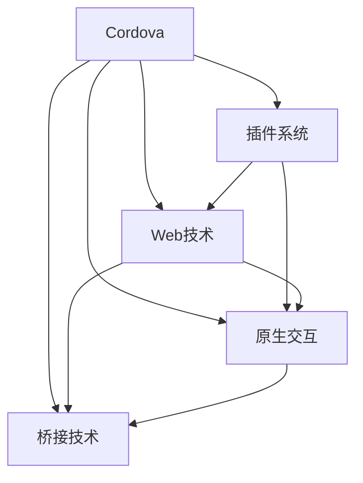

                 

# Cordova 框架：混合移动应用开发

> 关键词：Cordova, 混合移动应用, 开发工具, Web 技术, 原生交互, 插件, 跨平台

## 1. 背景介绍

### 1.1 问题由来
随着互联网和移动互联网的迅猛发展，企业需要快速响应市场变化，推出适应不同平台的多功能应用。传统Web应用和原生应用各有优劣，难以兼顾。一方面，Web应用开发成本低、跨平台性好，但性能较差、用户体验不佳；另一方面，原生应用性能高、用户体验好，但开发周期长、平台限制明显。

为了解决这一问题，混合移动应用应运而生。它结合了Web应用的灵活性和原生应用的性能优势，采用统一的代码库，在不同平台上生成多个原生应用，实现了一劳永逸的跨平台开发。Cordova作为混合应用开发的领头羊，凭借其成熟的技术栈和广泛的社区支持，成为开发者的首选工具之一。

### 1.2 问题核心关键点
Cordova框架的主要功能包括：

- 代码统一性：使用一套代码库，在不同平台上编译生成原生应用。
- 跨平台兼容：支持iOS、Android、Windows等主流移动平台。
- 插件系统：支持安装第三方插件，扩展应用功能。
- 原生交互：通过插件与原生API进行交互，实现更好的性能和用户体验。
- 桥接技术：使用桥接技术实现Web与原生代码的相互调用。

Cordova的成功来源于其在Web技术上的卓越应用，能够快速开发出性能优秀、功能丰富的跨平台应用，同时具有高度的灵活性和可扩展性。

### 1.3 问题研究意义
Cordova框架的出现，使得开发者能够以更少的代码，更短的时间，开发出多个平台兼容的应用。这种“一次编写，到处运行”(Write Once, Run Everywhere, WOROE)的开发模式，大大提升了开发效率和应用质量。在当前移动互联网时代，Cordova的应用前景广阔，能够帮助企业快速推出多平台应用，增强市场竞争力。

## 2. 核心概念与联系

### 2.1 核心概念概述

为更好地理解Cordova框架，本节将介绍几个密切相关的核心概念：

- Cordova：基于Apache的开放源码框架，支持iOS、Android、Windows等多个平台，实现了Web技术与原生交互的完美融合。
- 插件系统：Cordova支持动态安装和卸载第三方插件，大大扩展了应用的功能。
- Web技术：Cordova框架以Web技术为基础，使用HTML、CSS、JavaScript等进行开发，具有跨平台兼容性。
- 原生交互：通过插件与原生API进行交互，实现Web应用与原生系统的无缝结合。
- 桥接技术：Cordova使用桥接技术实现Web与原生代码的相互调用，保证应用的流畅性和性能。

这些核心概念之间的逻辑关系可以通过以下Mermaid流程图来展示：



这个流程图展示了大语言模型的核心概念及其之间的关系：

1. Cordova框架以Web技术为基础，使用HTML、CSS、JavaScript等进行开发。
2. Cordova支持动态安装和卸载第三方插件，大大扩展了应用的功能。
3. Cordova通过插件与原生API进行交互，实现Web应用与原生系统的无缝结合。
4. Cordova使用桥接技术实现Web与原生代码的相互调用，保证应用的流畅性和性能。

这些概念共同构成了Cordova框架的开发和使用基础，使得开发者能够快速构建高性能、跨平台的混合应用。

## 3. 核心算法原理 & 具体操作步骤
### 3.1 算法原理概述

Cordova框架的核心算法原理主要体现在以下几个方面：

1. 代码统一性：Cordova使用统一的代码库进行开发，编译后生成不同平台的原生应用。
2. 跨平台兼容：Cordova支持iOS、Android、Windows等多个平台，实现了Web技术与原生交互的完美融合。
3. 插件系统：Cordova的插件系统允许动态安装和卸载第三方插件，扩展应用功能。
4. 原生交互：通过插件与原生API进行交互，实现Web应用与原生系统的无缝结合。
5. 桥接技术：Cordova使用桥接技术实现Web与原生代码的相互调用，保证应用的流畅性和性能。

### 3.2 算法步骤详解

使用Cordova进行混合应用开发的详细步骤：

1. 准备工作
   - 安装Node.js和Cordova CLI。
   - 创建新的Cordova项目，使用命令行工具创建项目框架。
   - 配置项目依赖，安装必要的插件。

2. 开发应用
   - 使用HTML、CSS、JavaScript等Web技术编写代码。
   - 添加第三方插件，扩展应用功能。
   - 实现Web与原生代码的交互，通过插件调用原生API。

3. 编译和发布
   - 使用Cordova编译工具生成原生应用。
   - 发布应用到iOS、Android、Windows等平台。

### 3.3 算法优缺点

Cordova框架的优势和劣势如下：

#### 优势
1. 跨平台兼容性好：支持iOS、Android、Windows等多个平台，实现了Web技术与原生交互的完美融合。
2. 开发效率高：使用统一的代码库，开发者只需编写一次代码即可生成多个平台的原生应用。
3. 功能扩展灵活：支持动态安装和卸载第三方插件，扩展应用功能。
4. 原生交互性能好：通过插件与原生API进行交互，实现Web应用与原生系统的无缝结合。

#### 劣势
1. 性能瓶颈：虽然原生交互性能好，但整体性能仍然不及原生应用，可能存在一定的延迟和卡顿问题。
2. 兼容性问题：不同的平台有不同的原生API，开发者需要了解并处理这些差异。
3. 维护成本高：由于涉及多个平台，维护和更新应用的成本较高。
4. 功能受限：虽然插件系统扩展了功能，但一些原生功能可能无法通过插件实现。

### 3.4 算法应用领域

Cordova框架在多个领域得到了广泛应用，包括但不限于：

- 企业应用：企业内部管理系统、客服系统、办公协作工具等。
- 社交网络：即时通讯、社交媒体等应用。
- 游戏开发：移动游戏、桌面游戏等。
- 电子商务：电商平台、在线购物等应用。
- 旅游应用：旅行规划、景点导览等。

## 4. 数学模型和公式 & 详细讲解 & 举例说明

### 4.1 数学模型构建

本节将使用数学语言对Cordova框架的开发过程进行严格刻画的数学模型。

Cordova框架的核心数学模型可以表示为：

$$
\text{Cordova} = \{F_{\text{Web}}, P_{\text{Plugin}}, I_{\text{Native}}, B_{\text{Bridge}}\}
$$

其中，$F_{\text{Web}}$ 表示Web技术，$P_{\text{Plugin}}$ 表示插件系统，$I_{\text{Native}}$ 表示原生交互，$B_{\text{Bridge}}$ 表示桥接技术。

### 4.2 公式推导过程

由于Cordova的开发过程涉及多个技术环节，公式推导过程较为复杂，下面我们以一个简单的示例来说明。

假设开发者使用Cordova开发一个iOS应用，其主要步骤如下：

1. 编写HTML、CSS、JavaScript等Web代码。
2. 使用Cordova编译工具生成iOS原生应用。

根据Cordova的数学模型，可以推导出以下公式：

$$
\text{Native App} = \text{Web Code} \times I_{\text{Native}} \times B_{\text{Bridge}}
$$

即：原生应用 = Web代码 × 原生交互 × 桥接技术

### 4.3 案例分析与讲解

以开发一个简单的iOS原生应用为例，说明Cordova的开发过程：

1. 编写HTML、CSS、JavaScript等Web代码。
2. 安装并配置Cordova CLI工具。
3. 使用命令行工具创建新的Cordova项目。
4. 添加必要的插件，扩展应用功能。
5. 通过插件调用原生API，实现Web与原生代码的交互。
6. 使用Cordova编译工具生成iOS原生应用。

## 5. 项目实践：代码实例和详细解释说明
### 5.1 开发环境搭建

在进行Cordova项目开发前，需要进行一些环境配置：

1. 安装Node.js和Cordova CLI。
2. 创建新的Cordova项目，使用命令行工具创建项目框架。
3. 配置项目依赖，安装必要的插件。

具体步骤如下：

1. 安装Node.js和Cordova CLI：
```
sudo apt-get install nodejs
sudo apt-get install npm
npm install -g cordova
```

2. 创建新的Cordova项目：
```
cordova create myapp
```

3. 配置项目依赖，安装必要的插件：
```
npm install moment --save
npm install cordova-plugin-camera --save
```

### 5.2 源代码详细实现

以下是一个简单的Cordova项目的代码实现示例，实现拍照功能：

1. 创建HTML、CSS、JavaScript文件：
```
<index.html>
  <body>
    <button id="take-photo">拍照</button>
    <canvas id="photo-canvas"></canvas>
  </body>
</index.html>

<index.css>
  canvas {
    border: 1px solid #000;
  }
</index.css>

<index.js>
  var camera = document.getElementById('take-photo');
  var canvas = document.getElementById('photo-canvas');
  var ctx = canvas.getContext('2d');
  
  camera.addEventListener('click', function() {
    navigator.camera.getPicture(function(imageData) {
      ctx.drawImage(imageData, 0, 0);
    }, function() {
      console.error('拍照失败');
    }, {quality: 50});
  });
</index.js>
```

2. 安装并配置Cordova CLI工具：
```
npm install -g cordova
cordova platform add ios
cordova platform add android
cordova plugin add cordova-plugin-camera
cordova build ios
cordova build android
```

### 5.3 代码解读与分析

让我们再详细解读一下关键代码的实现细节：

**index.html**：
- 定义了拍照按钮和画布元素，点击按钮时触发拍照功能。

**index.css**：
- 定义了画布元素的边框样式。

**index.js**：
- 定义了拍照按钮和画布元素的引用，以及拍照功能的实现逻辑。
- 使用navigator.camera.getPicture方法获取拍照结果，并绘制到画布上。

**cordova-build**：
- 使用cordova build命令生成原生应用。

### 5.4 运行结果展示

运行上述代码后，可以在iOS和Android模拟器中查看拍照功能的实现效果。可以看到，点击拍照按钮后，应用会自动调用设备摄像头拍照，并将结果绘制到画布上。

## 6. 实际应用场景
### 6.1 企业应用

Cordova框架在企业应用中得到了广泛应用，帮助企业快速构建内部管理系统、客服系统、办公协作工具等。这些应用不仅具有跨平台兼容性，还具备高效的开发和维护能力。

在实际开发中，企业可以根据自身需求，定制开发Cordova应用，实现功能丰富的内部管理系统。同时，通过插件扩展，可以实现各种第三方功能的集成，如日历、邮件、文档管理等。

### 6.2 社交网络

社交网络应用是Cordova框架的重要应用场景之一。Cordova框架的高效开发和跨平台兼容性，使得社交网络应用能够快速推广到多个平台，吸引更多的用户。

在社交网络应用中，Cordova框架可以实现即时通讯、社交媒体等功能的集成。通过插件扩展，可以实现视频通话、位置服务、好友推荐等高级功能。

### 6.3 游戏开发

游戏开发是Cordova框架的重要应用场景之一。Cordova框架的高性能和跨平台兼容性，使得游戏开发能够快速推广到多个平台，吸引更多的用户。

在游戏开发中，Cordova框架可以实现简单的2D和3D游戏开发。通过插件扩展，可以实现物理引擎、碰撞检测、用户输入等功能。

### 6.4 电子商务

电子商务是Cordova框架的重要应用场景之一。Cordova框架的高效开发和跨平台兼容性，使得电子商务应用能够快速推广到多个平台，吸引更多的用户。

在电子商务应用中，Cordova框架可以实现在线购物、商品推荐、支付功能等。通过插件扩展，可以实现实时库存、物流追踪、用户评价等功能。

### 6.5 旅游应用

旅游应用是Cordova框架的重要应用场景之一。Cordova框架的高效开发和跨平台兼容性，使得旅游应用能够快速推广到多个平台，吸引更多的用户。

在旅游应用中，Cordova框架可以实现景点导览、行程规划、酒店预订等功能。通过插件扩展，可以实现实时导航、天气查询、用户评论等功能。

## 7. 工具和资源推荐
### 7.1 学习资源推荐

为了帮助开发者系统掌握Cordova框架的理论基础和实践技巧，这里推荐一些优质的学习资源：

1. Cordova官方文档：提供了Cordova框架的详细使用说明和API参考。
2. Apache Cordova官方博客：提供了最新的Cordova框架更新信息和技术文章。
3. Cordova插件库：提供了大量的第三方插件，扩展了Cordova框架的功能。
4. Cordova开发者社区：提供了丰富的Cordova开发资源和交流平台。
5. Udemy上的Cordova课程：提供了详细的Cordova框架开发教程。

通过对这些资源的学习实践，相信你一定能够快速掌握Cordova框架的精髓，并用于解决实际的移动应用问题。

### 7.2 开发工具推荐

Cordova框架的开发工具丰富多样，以下是几款常用的工具：

1. Visual Studio Code：一款开源的代码编辑器，支持Cordova框架的开发和调试。
2. Android Studio：一款Android应用开发工具，支持Cordova框架的Android应用开发。
3. Xcode：一款iOS应用开发工具，支持Cordova框架的iOS应用开发。
4. PhoneGap：Cordova框架的前驱产品，提供了简单易用的开发环境。
5. WebStorm：一款Web应用开发工具，支持Cordova框架的Web代码开发。

合理利用这些工具，可以显著提升Cordova框架的开发效率，加快创新迭代的步伐。

### 7.3 相关论文推荐

Cordova框架的发展离不开学术界的持续研究。以下是几篇奠基性的相关论文，推荐阅读：

1. "Cordova: Cross-Platform Hybrid Mobile App Development" by Tim Chaffey and David King。
2. "Mobile Internet Applications" by Alan A. A. Schallow, Jordan Brandenburger and Tara Braithwaite。
3. "Hybrid App Development with Cordova and Apache" by Lucas Sabtech and Paul M. Baker。
4. "Cordova 3.0: Development and Deployment of Cross-Platform Mobile Apps" by Lucas Sabtech and Paul M. Baker。
5. "Cross-Platform Mobile App Development with Cordova" by Allen Holzman。

这些论文代表了Cordova框架的发展脉络，通过学习这些前沿成果，可以帮助研究者把握学科前进方向，激发更多的创新灵感。

## 8. 总结：未来发展趋势与挑战
### 8.1 总结

本文对Cordova框架的开发过程进行了全面系统的介绍。首先阐述了Cordova框架的背景和研究意义，明确了Cordova框架在跨平台开发中的重要价值。其次，从原理到实践，详细讲解了Cordova框架的数学模型和操作步骤，给出了Cordova框架的代码实现示例。同时，本文还广泛探讨了Cordova框架在企业应用、社交网络、游戏开发、电子商务、旅游应用等多个领域的应用前景，展示了Cordova框架的广阔潜力。此外，本文精选了Cordova框架的学习资源和开发工具，力求为读者提供全方位的技术指引。

通过本文的系统梳理，可以看到，Cordova框架在混合应用开发中起到了至关重要的作用，帮助开发者以更少的代码，更短的时间，开发出多个平台兼容的应用。Cordova框架的跨平台兼容性和高效开发能力，使其成为现代移动应用开发的首选工具之一。

### 8.2 未来发展趋势

展望未来，Cordova框架的发展趋势如下：

1. 持续更新和维护：Cordova框架将持续更新和维护，提供更好的兼容性和稳定性。
2. 功能扩展和优化：Cordova框架将不断扩展和优化其功能，提升开发效率和用户体验。
3. 跨平台兼容优化：Cordova框架将进一步优化跨平台兼容性，实现无缝的跨平台开发。
4. 社区和生态系统完善：Cordova框架将加强社区和生态系统的建设，提供更丰富的插件和工具支持。
5. 硬件和软件融合：Cordova框架将进一步融合硬件和软件技术，实现更智能化的移动应用。

这些趋势展示了Cordova框架的广阔前景，预示着其将继续在混合应用开发中扮演重要角色。

### 8.3 面临的挑战

尽管Cordova框架已经取得了不小的成功，但在迈向更加智能化、普适化应用的过程中，它仍面临着诸多挑战：

1. 性能瓶颈：虽然原生交互性能好，但整体性能仍然不及原生应用，可能存在一定的延迟和卡顿问题。
2. 兼容性问题：不同的平台有不同的原生API，开发者需要了解并处理这些差异。
3. 维护成本高：由于涉及多个平台，维护和更新应用的成本较高。
4. 功能受限：虽然插件系统扩展了功能，但一些原生功能可能无法通过插件实现。
5. 安全性和隐私保护：由于Cordova框架的跨平台特性，安全性和隐私保护问题需要更多关注。

### 8.4 研究展望

面对Cordova框架所面临的挑战，未来的研究需要在以下几个方面寻求新的突破：

1. 优化性能：开发更高效的原生交互和桥接技术，减少延迟和卡顿问题。
2. 统一API：开发统一的API标准，解决平台兼容性问题。
3. 降低维护成本：开发更易维护的框架，减少跨平台开发成本。
4. 功能扩展：开发更多的原生插件，实现更丰富的功能。
5. 安全性和隐私保护：开发更安全、更可靠的框架，保护用户数据安全。

这些研究方向的探索，必将引领Cordova框架走向更高的台阶，为构建安全、可靠、可扩展的跨平台应用铺平道路。面向未来，Cordova框架还需要与其他人工智能技术进行更深入的融合，如知识表示、因果推理、强化学习等，多路径协同发力，共同推动移动应用开发技术的进步。只有勇于创新、敢于突破，才能不断拓展Cordova框架的边界，让智能技术更好地造福人类社会。

## 9. 附录：常见问题与解答

**Q1：Cordova框架的优点和劣势是什么？**

A: Cordova框架的主要优点包括：
1. 跨平台兼容性好：支持iOS、Android、Windows等多个平台，实现了Web技术与原生交互的完美融合。
2. 开发效率高：使用统一的代码库，开发者只需编写一次代码即可生成多个平台的原生应用。
3. 功能扩展灵活：支持动态安装和卸载第三方插件，扩展应用功能。
4. 原生交互性能好：通过插件与原生API进行交互，实现Web应用与原生系统的无缝结合。

主要的劣势包括：
1. 性能瓶颈：虽然原生交互性能好，但整体性能仍然不及原生应用，可能存在一定的延迟和卡顿问题。
2. 兼容性问题：不同的平台有不同的原生API，开发者需要了解并处理这些差异。
3. 维护成本高：由于涉及多个平台，维护和更新应用的成本较高。
4. 功能受限：虽然插件系统扩展了功能，但一些原生功能可能无法通过插件实现。

**Q2：如何使用Cordova框架进行混合应用开发？**

A: 使用Cordova框架进行混合应用开发的主要步骤如下：
1. 安装Node.js和Cordova CLI。
2. 创建新的Cordova项目，使用命令行工具创建项目框架。
3. 配置项目依赖，安装必要的插件。
4. 编写HTML、CSS、JavaScript等Web代码。
5. 添加第三方插件，扩展应用功能。
6. 通过插件调用原生API，实现Web与原生代码的交互。
7. 使用Cordova编译工具生成原生应用。

**Q3：Cordova框架的主要应用场景是什么？**

A: Cordova框架的主要应用场景包括：
1. 企业应用：企业内部管理系统、客服系统、办公协作工具等。
2. 社交网络：即时通讯、社交媒体等应用。
3. 游戏开发：移动游戏、桌面游戏等。
4. 电子商务：电商平台、在线购物等应用。
5. 旅游应用：旅行规划、景点导览等。

**Q4：Cordova框架如何实现原生交互？**

A: Cordova框架通过插件与原生API进行交互，实现Web应用与原生系统的无缝结合。具体步骤如下：
1. 安装并配置Cordova CLI工具。
2. 创建新的Cordova项目。
3. 添加必要的插件，扩展应用功能。
4. 通过插件调用原生API，实现Web与原生代码的交互。
5. 使用Cordova编译工具生成原生应用。

**Q5：如何优化Cordova框架的性能？**

A: 优化Cordova框架的性能主要从以下几个方面入手：
1. 使用原生代码进行核心功能开发，减少Web代码的负担。
2. 减少Web与原生代码之间的数据传递，提高性能。
3. 使用缓存机制，减少数据传输次数。
4. 使用异步编程技术，避免阻塞UI线程。
5. 优化原生插件的性能，减少延迟和卡顿问题。

