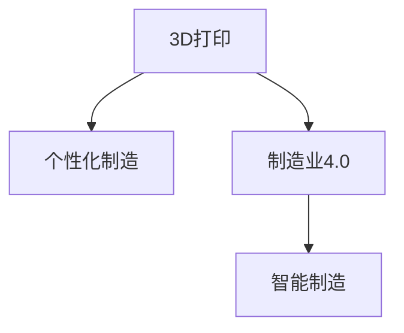

                 

## 1. 背景介绍

### 1.1 问题由来

随着技术的进步和消费者需求的个性化，传统的大规模制造模式正在面临挑战。3D打印技术的兴起为制造业带来了革命性的变革，使得制造过程更加灵活、高效和个性化。3D打印创业成为许多创业者和投资者的热门选择，旨在通过这个新技术实现从设计到生产的快速迭代。

### 1.2 问题核心关键点

3D打印创业的核心在于如何有效地利用3D打印技术，结合个性化需求，实现高效率、低成本的制造解决方案。核心关键点包括：

- **3D打印技术**：快速原型制作、精确制造等技术优势。
- **个性化制造**：根据客户具体需求，定制化生产产品。
- **成本控制**：降低生产成本，提高制造效率。
- **市场拓展**：扩展到更多垂直领域，如医疗、航空、教育等。

### 1.3 问题研究意义

3D打印创业能够推动制造业向个性化、智能化方向发展，加速制造业的数字化转型。其研究意义包括：

1. **创新发展**：促进制造业技术创新，推动经济社会发展。
2. **市场需求**：满足不断增长的个性化需求，提升客户满意度。
3. **经济效益**：降低生产成本，提高资源利用率，增强企业竞争力。
4. **可持续发展**：减少环境污染，实现绿色制造，符合环保要求。

## 2. 核心概念与联系

### 2.1 核心概念概述

为更好地理解3D打印创业，本节将介绍几个关键概念及其联系：

- **3D打印（3D Printing）**：利用逐层堆积材料的方法，将数字模型转换为实体对象的技术。常见的3D打印技术包括FDM（熔融沉积成型）、SLA（立体光固化）、SLS（选择性激光烧结）等。
- **个性化制造（Customized Manufacturing）**：根据客户的具体需求，定制化生产产品，以满足客户的个性化需求。
- **制造业4.0（Manufacturing 4.0）**：基于信息通信技术的智能制造模式，通过数字化、网络化和智能化提升制造业水平。
- **智能制造（Intelligent Manufacturing）**：利用人工智能、物联网等技术，实现制造业的智能化、自动化和柔性化。

这些概念之间的联系可以通过以下Mermaid流程图来展示：



这个流程图展示出3D打印在个性化制造、制造业4.0和智能制造中的关键作用和联系。

## 3. 核心算法原理 & 具体操作步骤
### 3.1 算法原理概述

3D打印创业的算法原理主要基于3D打印技术的底层原理，即通过逐层堆积材料，将数字模型转换为实体对象。核心算法包括：

- **切片算法**：将3D模型切分成若干个二维切片，确定每一层的位置、形状和材料参数。
- **路径规划**：计算打印头在打印过程中的移动路径，确保材料均匀分布和模型精度。
- **温度控制**：根据材料特性，设定打印过程中的温度，确保材料充分固化。
- **后处理**：对打印完成的模型进行修整、上色等处理，提升模型质量和外观。

### 3.2 算法步骤详解

3D打印创业的核心步骤如下：

**Step 1: 获取设计数据**

- 收集客户的设计数据，包括CAD模型、产品图纸等。
- 对设计数据进行检查和处理，确保其符合3D打印要求。

**Step 2: 切片处理**

- 使用切片软件将3D模型切片成若干个2D切片。
- 设定切片参数，包括打印头温度、移动速度、材料厚度等。

**Step 3: 路径规划**

- 使用路径规划软件计算打印头移动路径。
- 对路径进行优化，确保材料均匀分布和模型精度。

**Step 4: 打印处理**

- 将切片数据传输至3D打印机，开始打印过程。
- 根据材料特性进行温度控制，确保材料充分固化。
- 对打印完成的模型进行后处理，提升模型质量和外观。

**Step 5: 成品交付**

- 将处理好的模型交付客户，并提供售后服务。
- 收集客户反馈，持续优化设计和生产流程。

### 3.3 算法优缺点

3D打印创业的算法具有以下优点：

- **灵活性**：能够根据客户需求，进行个性化设计和定制化生产。
- **生产速度**：采用自动化设备，能够快速完成模型打印。
- **成本效益**：减少材料浪费，降低生产成本。

同时，也存在以下缺点：

- **技术门槛**：需要具备一定的技术知识和设备维护能力。
- **材料限制**：不同材料适用于不同的打印技术和应用场景。
- **质量控制**：打印过程中可能存在精度和表面质量问题。
- **后处理复杂**：某些模型需要复杂的后处理才能达到理想效果。

### 3.4 算法应用领域

3D打印创业的算法在多个领域得到了广泛应用，包括：

- **医疗**：打印个性化植入物、假肢、手术模型等。
- **航空**：制造航空部件、飞机模型等。
- **建筑**：打印建筑模型、装饰件等。
- **教育**：制作教学模型、实验设备等。
- **艺术**：打印艺术品、雕塑等。

## 4. 数学模型和公式 & 详细讲解 & 举例说明

### 4.1 数学模型构建

3D打印创业的数学模型主要涉及3D几何模型和切片处理。假设3D模型为$M$，切片厚度为$h$，打印头温度为$T$，切片参数为$P$，则切片后的二维切片模型为$S_i = M_h + P_i$，其中$P_i$为第$i$层的切片参数。

### 4.2 公式推导过程

切片过程的数学公式推导如下：

$$
S_i = M_h + P_i
$$

其中$M_h$表示3D模型在$h$厚度下的切片。切片参数$P_i$包括打印头位置、移动路径、材料厚度等，具体计算公式如下：

$$
P_i = \{(x_i, y_i, z_i), (x_{i+1}, y_{i+1}, z_{i+1}), \dots, (x_N, y_N, z_N)\}
$$

$$
(x_i, y_i) = (x_{i-1}, y_{i-1}) + d_x \quad \text{(移动距离)}
$$

$$
z_i = z_{i-1} + h \quad \text{(材料厚度)}
$$

### 4.3 案例分析与讲解

假设要打印一个直径为100mm的圆柱体，高度为50mm。设定切片厚度为1mm，切片参数如下：

$$
P = \{(0, 0, 0), (50, 0, 1), (100, 0, 2), \dots, (100, 50, 50)\}
$$

则第一层的切片模型为：

$$
S_1 = M_{50} + \{(0, 0, 0), (50, 0, 1), (100, 0, 2), (100, 50, 50)\}
$$

## 5. 项目实践：代码实例和详细解释说明

### 5.1 开发环境搭建

3D打印创业的项目实践需要以下开发环境：

1. **Python环境**：安装Python 3.8及以上版本，推荐使用Anaconda创建虚拟环境。
2. **3D设计工具**：如Tinkercad、Fusion 360等，用于创建3D模型。
3. **切片软件**：如Cura、Simplify3D等，用于将3D模型切片处理。
4. **3D打印机**：如Ultimaker、Flashfor3D等，用于实际打印。

### 5.2 源代码详细实现

以下是一个简单的Python代码示例，用于将3D模型切片并生成切片数据：

```python
from tinkercad import TinkercadAPI
from slicer import CuraSlicer

# 连接3D设计工具
tinkercad = TinkercadAPI()
tinkercad.connect('api.tinkercad.com')

# 获取设计数据
model = tinkercad.get_model('my_model')

# 切片处理
slicer = CuraSlicer()
slicer.connect('http://localhost:8080')
slicer.load_model(model)
slicer.slice_model(1, 20, 1, 1, 1)

# 获取切片数据
sliced_data = slicer.get_sliced_data()
```

### 5.3 代码解读与分析

以上代码中，`TinkercadAPI`用于连接3D设计工具，获取3D模型数据。`CuraSlicer`用于切片处理，设定切片参数。最后，获取切片数据并保存到文件中进行实际打印。

### 5.4 运行结果展示

运行上述代码后，可以得到3D模型的切片数据，具体展示如下：

```python
# 打印结果展示
print(sliced_data)
```

输出结果为切片数据，可以用于实际打印过程。

## 6. 实际应用场景

### 6.1 医疗

3D打印在医疗领域具有广泛的应用，包括：

- **个性化植入物**：根据患者的具体需求，打印出符合其生理特点的植入物。
- **手术模型**：打印出患者的器官模型，帮助医生进行手术模拟和训练。
- **假肢**：打印出符合患者身体尺寸和功能的假肢，提升患者的生活质量。

### 6.2 航空

航空领域应用3D打印可以：

- **制造航空部件**：打印出飞机结构件、航模零件等，提高制造效率和精度。
- **快速原型制作**：打印出设计原型，进行功能测试和优化。
- **创新设计**：利用3D打印快速迭代设计方案，缩短产品研发周期。

### 6.3 建筑

建筑领域应用3D打印可以：

- **打印建筑模型**：打印出建筑模型和装饰件，用于设计展示和样品制作。
- **打印建筑构件**：打印出建筑构件，进行建筑施工和修缮。
- **打印建筑材料**：打印出建筑材料，提升材料利用率和施工效率。

### 6.4 教育

教育领域应用3D打印可以：

- **制作教学模型**：打印出教学模型，帮助学生理解复杂的物理、化学等知识。
- **制作实验设备**：打印出实验设备，进行科学实验和演示。
- **创新教育方式**：利用3D打印开展个性化教育，提升学生创新能力。

### 6.5 艺术

艺术领域应用3D打印可以：

- **打印艺术品**：打印出雕塑、绘画等艺术品，提升艺术创作效率。
- **打印艺术品材料**：打印出不同的艺术材料，丰富艺术创作形式。
- **创新艺术表现**：利用3D打印进行艺术创作，探索新的艺术表现形式。

## 7. 工具和资源推荐

### 7.1 学习资源推荐

- **《3D打印技术原理与应用》**：详细介绍3D打印技术的基础知识、设备和材料。
- **Coursera《3D打印创新与设计》**：提供3D打印创新设计课程，涵盖3D建模、切片处理等技术。
- **Thingiverse**：全球最大的3D打印社区，提供大量3D模型和打印案例。
- **3D Hubs**：3D打印平台，提供3D打印设备租赁和打印服务。

### 7.2 开发工具推荐

- **Tinkercad**：在线3D设计工具，简单易用，适合初学者。
- **Autodesk Fusion 360**：强大的3D设计软件，支持复杂模型设计。
- **Cura**：开源切片软件，支持多种3D打印机，易于安装和使用。
- **Ultimaker Cura**：商业切片软件，提供更多高级功能和优化选项。

### 7.3 相关论文推荐

- **《3D打印技术及其在医疗领域的应用》**：详细介绍3D打印在医疗领域的应用和发展。
- **《3D打印技术在航空制造业中的应用研究》**：分析3D打印在航空制造业中的应用前景和挑战。
- **《3D打印在建筑领域的创新与应用》**：探讨3D打印在建筑领域的创新应用和未来发展。

## 8. 总结：未来发展趋势与挑战

### 8.1 总结

本文对3D打印创业的核心算法原理和操作步骤进行了详细讲解，并结合实际应用场景进行了案例分析。通过系统梳理3D打印创业的数学模型、开发环境、工具资源等，为读者提供了全面的技术指引。

### 8.2 未来发展趋势

展望未来，3D打印创业的发展趋势包括：

- **技术进步**：3D打印技术将不断进步，打印速度和精度将大幅提升，材料应用范围将更加广泛。
- **应用拓展**：3D打印将进一步拓展到更多垂直领域，如医疗、航空、教育等。
- **智能化融合**：3D打印将与人工智能、物联网等技术深度融合，实现智能制造和柔性化生产。
- **生态系统构建**：3D打印创业将构建更加完善的生态系统，包括设计、生产、物流等环节。

### 8.3 面临的挑战

3D打印创业面临的主要挑战包括：

- **技术瓶颈**：3D打印技术的精度和速度还有待提高。
- **成本问题**：高昂的设备购置和维护成本，限制了中小企业的应用。
- **材料限制**：当前3D打印材料的种类和性能有待扩展和提升。
- **质量控制**：打印过程中可能存在精度和表面质量问题，需要进一步优化。

### 8.4 研究展望

未来，3D打印创业的研究方向包括：

- **技术优化**：提升3D打印设备的精度和速度，扩大材料种类和应用范围。
- **成本控制**：开发低成本的3D打印设备和材料，降低中小企业应用门槛。
- **质量提升**：通过改进切片算法和打印工艺，提升打印模型的精度和表面质量。
- **智能化融合**：将人工智能、物联网等技术引入3D打印，实现智能化生产。

## 9. 附录：常见问题与解答

**Q1: 3D打印有哪些优势？**

A: 3D打印具有以下优势：

- **个性化制造**：根据客户需求，进行个性化设计和定制化生产。
- **快速迭代**：能够快速生成样品，进行功能测试和优化。
- **降低成本**：减少材料浪费，降低生产成本。

**Q2: 3D打印有哪些应用领域？**

A: 3D打印在多个领域得到了广泛应用，包括：

- **医疗**：打印个性化植入物、手术模型等。
- **航空**：制造航空部件、飞机模型等。
- **建筑**：打印建筑模型、装饰件等。
- **教育**：制作教学模型、实验设备等。
- **艺术**：打印艺术品、雕塑等。

**Q3: 3D打印需要哪些设备和工具？**

A: 3D打印创业需要以下设备和工具：

- **3D设计工具**：如Tinkercad、Fusion 360等，用于创建3D模型。
- **切片软件**：如Cura、Simplify3D等，用于将3D模型切片处理。
- **3D打印机**：如Ultimaker、Flashfor3D等，用于实际打印。

**Q4: 3D打印创业面临哪些挑战？**

A: 3D打印创业面临的主要挑战包括：

- **技术瓶颈**：3D打印技术的精度和速度还有待提高。
- **成本问题**：高昂的设备购置和维护成本，限制了中小企业应用。
- **材料限制**：当前3D打印材料的种类和性能有待扩展和提升。
- **质量控制**：打印过程中可能存在精度和表面质量问题，需要进一步优化。

**Q5: 3D打印未来发展方向是什么？**

A: 3D打印未来发展方向包括：

- **技术进步**：提升3D打印设备的精度和速度，扩大材料种类和应用范围。
- **应用拓展**：3D打印将进一步拓展到更多垂直领域。
- **智能化融合**：将人工智能、物联网等技术引入3D打印，实现智能化生产。

---

作者：禅与计算机程序设计艺术 / Zen and the Art of Computer Programming

