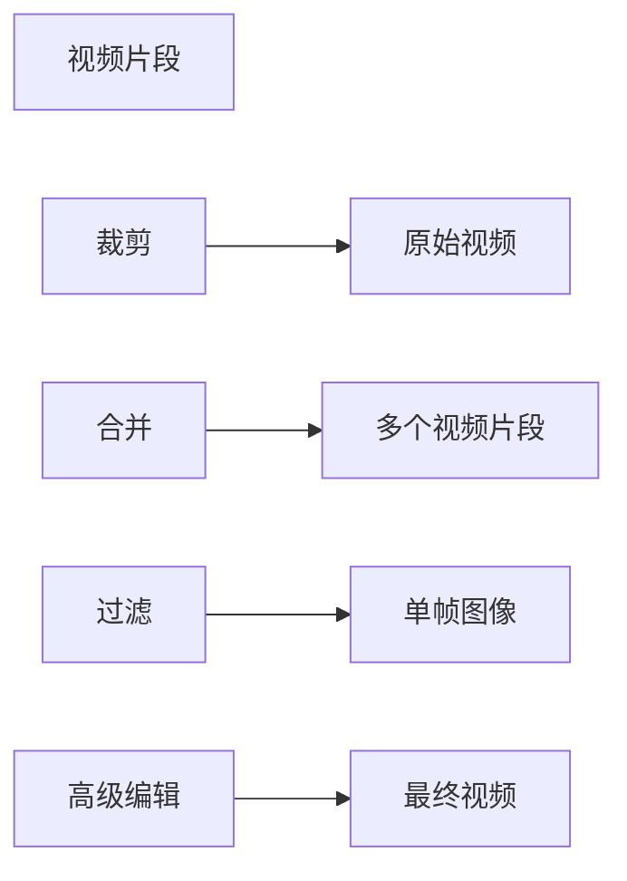

                 

# FFmpeg 视频编辑技巧：裁剪、合并和过滤视频片段

> 关键词：FFmpeg, 视频编辑, 裁剪, 合并, 过滤, 视频片段, 视频处理, 高级编辑技巧

## 1. 背景介绍

视频处理是一项需要高水平技能和知识的工作。从早期简单的编辑任务到如今复杂的特效和后期制作，视频编辑已成为一个高度专业化的领域。FFmpeg 是一个强大的开源工具，广泛用于视频编辑、转换和处理。通过掌握 FFmpeg 的高级编辑技巧，用户可以实现几乎任何视频编辑需求。本教程将深入探讨如何使用 FFmpeg 进行视频片段的裁剪、合并和过滤。

## 2. 核心概念与联系

### 2.1 核心概念概述

在讨论具体技巧之前，先介绍一些核心概念：

- **视频片段**：视频中的特定部分，可以是短片、剪辑或任何有意义的序列。
- **裁剪**：从视频中截取特定时间或位置的部分，去除不需要的部分。
- **合并**：将多个视频片段合并成一个连续的视频。
- **过滤**：对视频片段进行像素级别的调整，如去噪、色彩调整和变换。

### 2.2 核心概念原理和架构的 Mermaid 流程图



这个流程图展示了视频编辑的基本流程：从原始视频中裁剪出特定的片段，将这些片段合并成一个完整的影片，并对每一帧进行像素级别的调整，最后生成高质量的最终影片。

## 3. 核心算法原理 & 具体操作步骤

### 3.1 算法原理概述

FFmpeg 使用了一种基于编解码器的管道处理模型。在这个模型中，视频被分成多个部分进行处理，每个部分都可以使用不同的编解码器进行处理。这种模型使得用户可以在不同阶段对视频进行裁剪、合并和过滤。

### 3.2 算法步骤详解

#### 3.2.1 裁剪

- **步骤**：
  1. 使用 `ffmpeg -i input.mp4 -ss 00:00:05 -to 00:01:05 -c copy output.mp4` 命令，从 `input.mp4` 文件中截取从第 5 秒到第 65 秒的视频片段，并输出为 `output.mp4`。
  2. `-ss` 参数指定起始时间戳，`-to` 参数指定结束时间戳，`-c copy` 参数表示复制视频流，不进行编码解码。

#### 3.2.2 合并

- **步骤**：
  1. 使用 `ffmpeg -f concat -safe 0 -i input_list.txt output.mp4` 命令，将多个视频文件合并为一个连续的视频。其中 `input_list.txt` 文件包含视频文件的路径和起始时间戳，例如：
    ```
    file '/path/to/video1.mp4' start=00:00:00 duration=00:01:00
    file '/path/to/video2.mp4' start=00:01:00 duration=00:02:00
    file '/path/to/video3.mp4' start=00:03:00 duration=00:03:00
    ```
  2. `-safe 0` 参数表示不限制输出视频的尺寸。

#### 3.2.3 过滤

- **步骤**：
  1. 使用 `ffmpeg -i input.mp4 -vf "colorspace=bt709=bt2020,format=rgb32" output.mp4` 命令，将 `input.mp4` 文件中的每个像素从 bt709 色彩空间转换为 bt2020 色彩空间，并输出为 `output.mp4`。
  2. `-vf` 参数指定视频滤镜，`colorspace=bt709=bt2020` 表示转换色彩空间，`format=rgb32` 表示设置像素格式。

### 3.3 算法优缺点

#### 3.3.1 优点

- **灵活性**：FFmpeg 提供了广泛的编解码器和滤镜，可以满足各种视频编辑需求。
- **高性能**：FFmpeg 使用多线程和优化算法，可以在较短的时间内处理大量视频。
- **开源免费**：FFmpeg 是开源软件，用户可以自由使用和修改。

#### 3.3.2 缺点

- **复杂性**：FFmpeg 的命令和参数众多，初学者需要一定时间学习和理解。
- **缺乏用户界面**：FFmpeg 命令行界面对非技术用户不太友好。

### 3.4 算法应用领域

FFmpeg 广泛应用于各种视频编辑和处理场景，包括：

- 制作短片和纪录片
- 编辑和处理高清视频
- 生成和转换不同格式的视频文件
- 实时视频流传输
- 动画制作和特效处理

## 4. 数学模型和公式 & 详细讲解 & 举例说明

### 4.1 数学模型构建

FFmpeg 的视频编辑过程主要涉及以下几个数学模型：

- **视频剪辑模型**：用于裁剪视频片段。
- **视频拼接模型**：用于合并多个视频片段。
- **视频滤镜模型**：用于对视频进行像素级别的调整。

### 4.2 公式推导过程

#### 4.2.1 视频剪辑模型

假设视频文件的总时间为 $T$，裁剪开始时间为 $t_1$，裁剪结束时间为 $t_2$。则裁剪出的视频片段时间为 $t_2 - t_1$。

- **公式**：
  $$
  \text{视频剪辑} = T - (t_2 - t_1)
  $$

#### 4.2.2 视频拼接模型

假设需要拼接的视频片段总数为 $N$，第 $i$ 个视频片段的起始时间为 $t_{i,1}$，时长为 $t_{i,2}$，则拼接后的总时间为：

- **公式**：
  $$
  \text{视频拼接} = \sum_{i=1}^{N} (t_{i,2})
  $$

#### 4.2.3 视频滤镜模型

假设视频滤镜的参数为 $p$，则经过滤镜处理后的每个像素 $(x,y)$ 的值 $f(x,y)$ 可以通过以下公式计算：

- **公式**：
  $$
  f(x,y) = p \times f(x,y) + (1-p) \times x
  $$

### 4.3 案例分析与讲解

假设有一个时长为 1 小时的视频文件 `input.mp4`，需要从中截取从第 5 秒到第 65 秒的部分，并输出到 `output.mp4`。

- **命令**：
  ```
  ffmpeg -i input.mp4 -ss 00:00:05 -to 00:01:05 -c copy output.mp4
  ```

  **分析**：
  - `-i input.mp4`：输入视频文件为 `input.mp4`。
  - `-ss 00:00:05`：从第 5 秒开始截取视频。
  - `-to 00:01:05`：截取到第 65 秒结束。
  - `-c copy`：复制视频流，不进行编码解码。

## 5. 项目实践：代码实例和详细解释说明

### 5.1 开发环境搭建

要使用 FFmpeg，首先需要安装它。根据操作系统，可以使用以下命令：

- **Linux**：
  ```
  sudo apt-get install ffmpeg
  ```
- **macOS**：
  ```
  brew install ffmpeg
  ```
- **Windows**：
  下载并安装 FFmpeg，并将其添加到环境变量中。

### 5.2 源代码详细实现

#### 5.2.1 裁剪

使用以下命令从一个视频文件中裁剪出特定部分：

```bash
ffmpeg -i input.mp4 -ss 00:00:05 -to 00:01:05 -c copy output.mp4
```

- **-i input.mp4**：输入视频文件为 `input.mp4`。
- **-ss 00:00:05**：从第 5 秒开始截取视频。
- **-to 00:01:05**：截取到第 65 秒结束。
- **-c copy**：复制视频流，不进行编码解码。

#### 5.2.2 合并

使用以下命令将多个视频文件合并为一个连续的视频：

```bash
ffmpeg -f concat -safe 0 -i input_list.txt output.mp4
```

- **-f concat**：指定使用 concatenate 过滤器。
- **-safe 0**：不限制输出视频的尺寸。
- **-i input_list.txt**：输入一个包含多个视频文件路径和起始时间戳的文本文件。

#### 5.2.3 过滤

使用以下命令对视频进行像素级别的调整：

```bash
ffmpeg -i input.mp4 -vf "colorspace=bt709=bt2020,format=rgb32" output.mp4
```

- **-i input.mp4**：输入视频文件为 `input.mp4`。
- **-vf**：指定视频滤镜。
- **"colorspace=bt709=bt2020,format=rgb32"**：将每个像素从 bt709 色彩空间转换为 bt2020 色彩空间，并设置像素格式为 32 位 RGB。

### 5.3 代码解读与分析

#### 5.3.1 裁剪

- **解析**：使用 `-ss` 和 `-to` 参数指定视频的起始和结束时间，`-c copy` 表示不进行编码解码，直接复制视频流。
- **效果**：输出视频文件 `output.mp4` 中包含裁剪部分，与输入视频文件 `input.mp4` 中的原始视频片段无关。

#### 5.3.2 合并

- **解析**：使用 `-f concat` 指定使用 concatenate 过滤器，`-safe 0` 表示不限制输出视频的尺寸，`-i input_list.txt` 指定包含视频文件路径和起始时间戳的文本文件。
- **效果**：输出视频文件 `output.mp4` 包含所有输入视频文件按照指定时间顺序拼接后的内容。

#### 5.3.3 过滤

- **解析**：使用 `-vf` 参数指定视频滤镜，`"colorspace=bt709=bt2020,format=rgb32"` 表示将每个像素从 bt709 色彩空间转换为 bt2020 色彩空间，并设置像素格式为 32 位 RGB。
- **效果**：输出视频文件 `output.mp4` 中的每个像素都经过了滤镜处理，色彩空间和像素格式都发生了变化。

### 5.4 运行结果展示

假设有一个时长为 1 小时的视频文件 `input.mp4`，需要从中截取从第 5 秒到第 65 秒的部分，并输出到 `output.mp4`。

- **输入文件**：
  ```
  ffmpeg -i input.mp4 -ss 00:00:05 -to 00:01:05 -c copy output.mp4
  ```

  **输出文件**：
  ```
  output.mp4
  ```

  **结果**：输出视频文件 `output.mp4` 中包含裁剪部分，即第 5 秒到第 65 秒的视频内容，格式和输入视频文件 `input.mp4` 相同。

## 6. 实际应用场景

### 6.1 视频剪辑制作

在视频剪辑制作中，FFmpeg 可以用来截取视频片段，拼接多个视频，以及进行像素级别的调整。例如，从长视频中截取精彩片段，将多个拍摄片段拼接成完整的视频，或者对视频进行去噪、色彩调整等。

### 6.2 教育视频制作

在教育视频制作中，FFmpeg 可以用来截取视频中的特定知识点或实验片段，将其拼接成一个完整的视频，或者对视频进行去噪、色彩调整等，以提高观看效果。

### 6.3 实时视频流处理

在实时视频流处理中，FFmpeg 可以用来截取视频流中的特定帧，进行像素级别的调整，或者将多个视频流拼接成一个实时视频流，以实现复杂的视频处理需求。

### 6.4 未来应用展望

随着技术的不断进步，FFmpeg 的功能将不断扩展和优化，可以支持更多复杂的编辑和处理需求。未来的发展方向可能包括：

- **实时视频处理**：支持更多实时视频流处理功能，如实时视频裁剪、实时视频滤镜等。
- **自动化编辑**：开发更多的自动化编辑工具，减少人工操作。
- **跨平台兼容性**：提升在不同操作系统和硬件设备上的兼容性。
- **高性能优化**：进一步优化编解码器和滤镜，提高处理效率。

## 7. 工具和资源推荐

### 7.1 学习资源推荐

- **FFmpeg 官方文档**：提供详细的命令和参数说明，是学习 FFmpeg 的最佳资源。
- **FFmpeg 教程**：包含多种视频编辑技巧和实例，适合初学者和进阶用户。
- **YouTube 视频教程**：提供大量实用视频教程，适合通过视觉方式学习。

### 7.2 开发工具推荐

- **FFmpeg**：作为核心工具，用于视频编辑和处理。
- **Handbrake**：用于视频文件转换和编码。
- **VLC Media Player**：用于视频预览和播放。

### 7.3 相关论文推荐

- **视频编解码技术**：介绍视频编解码的基本原理和算法。
- **视频滤镜算法**：探讨像素级别的视频滤镜处理技术。
- **视频拼接算法**：研究如何将多个视频拼接成一个连续的视频。

## 8. 总结：未来发展趋势与挑战

### 8.1 研究成果总结

本文详细介绍了如何使用 FFmpeg 进行视频片段的裁剪、合并和过滤，探讨了这些操作的基本原理和具体操作步骤。通过这些操作，用户可以实现几乎任何视频编辑需求。

### 8.2 未来发展趋势

随着技术的不断进步，FFmpeg 的功能将不断扩展和优化，可以支持更多复杂的编辑和处理需求。未来的发展方向可能包括：

- **实时视频处理**：支持更多实时视频流处理功能，如实时视频裁剪、实时视频滤镜等。
- **自动化编辑**：开发更多的自动化编辑工具，减少人工操作。
- **跨平台兼容性**：提升在不同操作系统和硬件设备上的兼容性。
- **高性能优化**：进一步优化编解码器和滤镜，提高处理效率。

### 8.3 面临的挑战

尽管 FFmpeg 已经非常强大，但在实际应用中仍面临一些挑战：

- **学习曲线**：FFmpeg 的命令和参数众多，初学者需要一定时间学习和理解。
- **工具复杂性**：FFmpeg 的命令和参数复杂，需要用户具备一定的技术基础。
- **资源限制**：对于大型视频文件和复杂编辑任务，FFmpeg 需要消耗大量计算资源。

### 8.4 研究展望

未来的研究可以集中在以下几个方面：

- **自动化编辑**：开发更多的自动化编辑工具，减少人工操作，提高编辑效率。
- **跨平台兼容性**：提升在不同操作系统和硬件设备上的兼容性。
- **高性能优化**：进一步优化编解码器和滤镜，提高处理效率。
- **用户界面**：开发更友好的用户界面，降低学习曲线，提升用户体验。

## 9. 附录：常见问题与解答

### 9.1 问题 1：FFmpeg 和 VLC 的区别是什么？

**解答**：FFmpeg 是一个强大的开源视频处理工具，支持多种视频格式和编解码器。VLC 是一个多媒体播放器，用于播放和控制视频文件。虽然它们都可以处理视频，但主要用途不同，FFmpeg 主要用于视频编辑和处理，VLC 主要用于视频播放和控制。

### 9.2 问题 2：如何优化 FFmpeg 的性能？

**解答**：可以通过以下方法优化 FFmpeg 的性能：

- **设置多线程**：使用 `-threads` 参数设置线程数，提升处理速度。
- **使用硬件加速**：使用 `-hwaccel` 参数指定硬件加速器，如 GPU 或 CPU，提升处理速度。
- **优化编解码器**：使用更高效率的编解码器，如 libvpx、libvorbis 等，提升处理效率。

### 9.3 问题 3：如何实现视频裁剪和合并的自动化？

**解答**：可以通过编写脚本文件，使用 FFmpeg 的自动化命令实现视频裁剪和合并的自动化。例如，使用 `ffmpeg -y -f concat -i input_list.txt output.mp4` 命令，将多个视频文件按照指定顺序拼接成一个连续的视频。

---

作者：禅与计算机程序设计艺术 / Zen and the Art of Computer Programming

