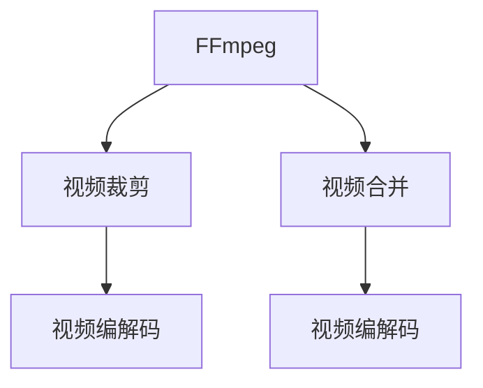

                 

## 1. 背景介绍

在视频处理领域，FFmpeg是一个非常强大的工具，可以用于视频和音频的编解码、裁剪、合并等操作。本文将详细讲解如何使用FFmpeg进行视频片段的裁剪和合并，并分析这些操作背后的原理和应用场景。

## 2. 核心概念与联系

### 2.1 核心概念概述

为了更好地理解FFmpeg的视频编辑功能，我们先了解一下核心概念：

- **FFmpeg**：一个开源的视频处理工具，支持各种视频编解码和格式转换。
- **视频裁剪**：从原始视频中选取特定的部分进行提取。
- **视频合并**：将多个视频片段合并成一段连续的视频。
- **视频编解码**：将视频数据从一种格式转换为另一种格式的过程。

这些概念可以通过以下Mermaid流程图来展示它们之间的联系：



### 2.2 核心概念原理和架构

FFmpeg的核心是一个跨平台的库，支持多种视频编解码格式和标准。它的架构主要包括以下几个部分：

1. **解码器**：将视频文件中的视频流解码为帧数据。
2. **编解码器**：将帧数据编码为视频流。
3. **格式转换**：将视频从一种格式转换为另一种格式。
4. **过滤器**：对视频进行裁剪、缩放、旋转等处理。
5. **多线程**：实现并行处理，提高处理效率。

这些部分通过管道（Pipeline）的方式连接起来，使得用户可以轻松地进行复杂的视频编辑操作。

## 3. 核心算法原理 & 具体操作步骤

### 3.1 算法原理概述

FFmpeg的视频裁剪和合并操作，本质上是通过改变视频文件的元数据和帧数据来实现的。这些操作的基本原理是：

- **视频裁剪**：选取视频中特定时间范围内的帧数据，生成新的视频文件。
- **视频合并**：将多个视频文件中的帧数据按照时间顺序合并，生成一个新的视频文件。

### 3.2 算法步骤详解

#### 3.2.1 视频裁剪

1. **选择裁剪区域**：使用ffmpeg的`-t`参数指定视频时长，`-ss`参数指定起始时间，`-to`参数指定结束时间，指定要裁剪的视频区域。

2. **执行编码**：使用`-vcodec`参数指定编解码器，将裁剪后的视频数据编码为新的视频文件。

```bash
ffmpeg -i input.avi -ss 00:01:00 -to 00:05:00 -c:v libx264 output.avi
```

#### 3.2.2 视频合并

1. **选择输入文件**：使用`-i`参数指定要合并的视频文件。

2. **指定输出文件**：使用`-c:v`参数指定编解码器，将多个视频片段按照时间顺序合并为一段新的视频文件。

```bash
ffmpeg -i input1.avi -i input2.avi -c:v libx264 output.avi
```

### 3.3 算法优缺点

**优点**：

- 操作简单：通过简单的命令行参数，可以实现视频裁剪和合并。
- 兼容性好：支持多种视频格式和编解码器。
- 灵活性高：可以通过过滤器进行复杂的处理操作。

**缺点**：

- 学习成本高：需要一定的命令行操作基础，对于初学者来说，可能不太容易上手。
- 性能瓶颈：对于大规模视频文件，性能可能成为瓶颈。
- 依赖系统环境：需要安装FFmpeg并配置好环境变量。

### 3.4 算法应用领域

FFmpeg的视频裁剪和合并操作，可以应用于各种视频编辑场景，包括：

- 视频剪辑：选取视频中特定的部分进行剪辑。
- 广告制作：将多个广告片段合并成一段连续的视频。
- 教育培训：将多个教学视频片段合并成一段连续的教学视频。
- 电影制作：将多个拍摄镜头合并成一部完整的电影。

## 4. 数学模型和公式 & 详细讲解 & 举例说明

### 4.1 数学模型构建

在FFmpeg的视频编辑中，主要涉及以下几个数学概念：

- **视频帧**：视频中每一帧的数据，通常以BMP、JPEG、PNG等格式存储。
- **视频流**：一系列连续的视频帧数据，通常以AVI、MP4等格式存储。
- **视频元数据**：描述视频流的各种参数，如视频宽度、高度、帧率等。

### 4.2 公式推导过程

FFmpeg的视频裁剪和合并操作，可以通过以下公式推导：

1. **视频裁剪公式**：

$$
\text{新视频长度} = \text{原视频长度} - (\text{起始时间} - \text{起始帧号} \times \text{帧时长}) - (\text{结束时间} - (\text{结束帧号} - 1) \times \text{帧时长})
$$

其中，$\text{起始时间}$和$\text{结束时间}$以秒为单位，$\text{起始帧号}$和$\text{结束帧号}$以整数形式表示。

2. **视频合并公式**：

$$
\text{新视频长度} = \sum_{i=1}^{n} (\text{当前视频文件长度} + (\text{当前视频文件末尾帧号} - \text{上一个视频文件末尾帧号} - 1) \times \text{帧时长})
$$

其中，$n$为要合并的视频文件数量，$\text{当前视频文件长度}$和$\text{上一个视频文件末尾帧号}$以秒为单位，$\text{当前视频文件末尾帧号}$以整数形式表示。

### 4.3 案例分析与讲解

以一个简单的视频编辑为例，假设我们有两个视频文件，一个长度为60秒，另一个长度为30秒，我们要将第一个视频文件从第10秒到第40秒（即30秒）进行裁剪，然后将其与第二个视频文件合并。

首先，使用`ffmpeg`对第一个视频文件进行裁剪：

```bash
ffmpeg -i input1.avi -ss 10 -to 40 -c:v libx264 output1.avi
```

然后，将两个视频文件合并：

```bash
ffmpeg -i output1.avi -i input2.avi -c:v libx264 output.avi
```

最终生成的输出视频文件长度为90秒，即60秒（第一个视频文件）+30秒（第二个视频文件）。

## 5. 项目实践：代码实例和详细解释说明

### 5.1 开发环境搭建

要使用FFmpeg进行视频编辑，首先需要安装FFmpeg软件。具体步骤为：

1. 从FFmpeg官网下载安装包。
2. 解压安装包。
3. 将解压后的FFmpeg二进制文件移动到系统路径，如`/usr/local/bin`。
4. 设置环境变量，使系统能够找到FFmpeg。

### 5.2 源代码详细实现

下面以视频裁剪为例，给出FFmpeg的详细代码实现：

```bash
# 视频裁剪命令
ffmpeg -i input.avi -ss 00:01:00 -to 00:05:00 -c:v libx264 output.avi
```

1. `-i`参数：指定输入文件。
2. `-ss`参数：指定起始时间，单位为秒。
3. `-to`参数：指定结束时间，单位为秒。
4. `-c:v libx264`参数：指定编解码器，将裁剪后的视频数据编码为新的视频文件。

### 5.3 代码解读与分析

FFmpeg的命令参数非常直观，易于理解。通过简单的参数组合，即可完成视频裁剪、合并等基本操作。

## 6. 实际应用场景

### 6.1 视频剪辑

在视频剪辑中，FFmpeg可以用于对原始视频文件进行裁剪和合并，生成新的视频文件。例如，将一段长视频剪辑成多个短片，或者将多个短片拼接成一部完整的纪录片。

### 6.2 广告制作

在广告制作中，FFmpeg可以将多个广告片段合并成一段连续的视频，便于进行播放和发布。例如，将多个广告片段按照时间顺序合并，生成广告主宣传片。

### 6.3 教育培训

在教育培训中，FFmpeg可以将多个教学视频片段合并成一段连续的教学视频，便于学生进行学习和观看。例如，将多个讲解课程的视频片段按照时间顺序合并，生成完整的课程视频。

### 6.4 电影制作

在电影制作中，FFmpeg可以将多个拍摄镜头合并成一部完整的电影，便于进行剪辑和发布。例如，将多个拍摄镜头按照时间顺序合并，生成电影预告片。

## 7. 工具和资源推荐

### 7.1 学习资源推荐

1. **FFmpeg官网**：FFmpeg官网提供了详尽的文档和教程，是学习FFmpeg的最佳资源。
2. **YouTube**：YouTube上有很多关于FFmpeg的视频教程，适合视觉学习者。
3. **GitHub**：GitHub上有很多FFmpeg的项目和代码，可以参考学习。

### 7.2 开发工具推荐

1. **Visual Studio Code**：一个流行的代码编辑器，支持多种编程语言和插件。
2. **Git**：一个分布式版本控制系统，适合进行代码管理和版本控制。
3. **Visual Studio**：一个Windows下的IDE，支持多种编程语言和插件。

### 7.3 相关论文推荐

1. **FFmpeg的设计和实现**：介绍FFmpeg的设计思想和实现细节。
2. **视频编解码技术**：详细介绍视频编解码技术的基本原理和应用场景。
3. **视频处理技术**：详细介绍视频处理技术的基本原理和应用场景。

## 8. 总结：未来发展趋势与挑战

### 8.1 研究成果总结

FFmpeg作为一款强大的视频处理工具，广泛应用于视频剪辑、广告制作、教育培训、电影制作等领域。它的简洁易用和强大的功能，使其成为视频处理的首选工具之一。

### 8.2 未来发展趋势

1. **多模态视频处理**：未来，FFmpeg可能会加入对音频、字幕等媒体的支持，实现多模态的视频处理。
2. **实时视频处理**：未来，FFmpeg可能会支持实时视频处理，适用于直播和视频会议等场景。
3. **AI视频编辑**：未来，FFmpeg可能会引入AI技术，实现更智能的视频编辑功能，如人脸识别、对象跟踪等。

### 8.3 面临的挑战

1. **性能瓶颈**：对于大规模视频文件，FFmpeg的处理速度可能成为瓶颈。
2. **资源消耗**：FFmpeg的资源消耗较大，可能会对系统性能产生影响。
3. **依赖性高**：FFmpeg依赖系统环境，需要较高的安装和配置门槛。

### 8.4 研究展望

未来的研究可以关注以下几个方面：

1. **优化算法**：优化FFmpeg的算法实现，提高处理速度和效率。
2. **扩展功能**：引入更多功能，如实时视频处理、AI视频编辑等。
3. **平台适配**：支持更多平台，如Linux、macOS等。

## 9. 附录：常见问题与解答

### 9.1 常见问题

**Q1: FFmpeg的命令参数是如何设置的？**

A: FFmpeg的命令参数非常直观，易于理解。可以通过简单的参数组合，即可完成视频裁剪、合并等基本操作。例如：

```bash
ffmpeg -i input.avi -ss 00:01:00 -to 00:05:00 -c:v libx264 output.avi
```

**Q2: FFmpeg的安装和配置需要注意什么？**

A: 安装FFmpeg需要遵循官方文档的指导，设置环境变量。在Linux系统中，可以使用以下命令安装FFmpeg：

```bash
sudo apt-get install ffmpeg
```

## 附录：常见问题与解答

**Q1: FFmpeg的命令参数是如何设置的？**

A: FFmpeg的命令参数非常直观，易于理解。可以通过简单的参数组合，即可完成视频裁剪、合并等基本操作。例如：

```bash
ffmpeg -i input.avi -ss 00:01:00 -to 00:05:00 -c:v libx264 output.avi
```

**Q2: FFmpeg的安装和配置需要注意什么？**

A: 安装FFmpeg需要遵循官方文档的指导，设置环境变量。在Linux系统中，可以使用以下命令安装FFmpeg：

```bash
sudo apt-get install ffmpeg
```

---

作者：禅与计算机程序设计艺术 / Zen and the Art of Computer Programming

