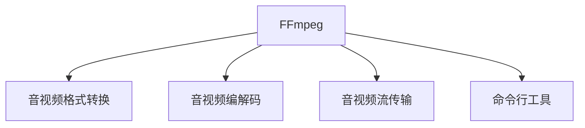

                 

# FFmpeg命令行音视频处理

> 关键词：FFmpeg,音视频格式转换,音视频编解码,音视频流传输,音视频处理工具

## 1. 背景介绍

### 1.1 问题由来
在数字化和网络化的浪潮下，音视频数据已经成为了信息传播的主要载体。无论是传统的电视广播，还是现代的在线视频平台，音视频技术的革新都直接关系到用户体验和内容传播的效率。面对海量音视频数据的存储、处理和传输需求，音视频处理工具变得日益重要。

FFmpeg是一个开源的音视频处理工具集，它支持几乎所有已知的音视频格式，提供了一整套命令行的音视频处理工具，可以用于音视频格式的转换、编码解码、流媒体传输等多个方面。FFmpeg的强大功能和高性能使其成为了音视频处理领域的标准工具。

### 1.2 问题核心关键点
FFmpeg的核心优势在于其灵活性和高性能。通过命令行方式使用FFmpeg，用户可以轻松地对音视频数据进行处理，满足各种复杂的音视频应用需求。但同时，FFmpeg的使用也需要一定的技术基础和对命令行工具的熟练掌握。

本文将系统介绍FFmpeg的使用方法和原理，帮助读者掌握FFmpeg的命令语法和常用场景应用，为日常音视频处理提供可靠的技术支持。

## 2. 核心概念与联系

### 2.1 核心概念概述

为更好地理解FFmpeg的使用方法和原理，本节将介绍几个密切相关的核心概念：

- FFmpeg：一个开源的音视频处理工具集，支持音视频格式转换、编解码、流媒体传输等多种功能。
- 音视频格式：FFmpeg支持几乎所有已知的音视频格式，包括但不限于MP4、MKV、AVI、WMV等。
- 音视频编解码：将原始的音视频数据通过编码转换成适合传输的格式，或通过解码还原为原始数据。
- 音视频流传输：将音视频数据通过网络流传输，用于实时直播、点播、流媒体服务等。
- 命令行工具：通过命令行方式使用FFmpeg，进行音视频处理的自动化操作。

这些核心概念之间的逻辑关系可以通过以下Mermaid流程图来展示：



这个流程图展示了几大核心概念以及它们之间的相互关系：

1. FFmpeg是音视频处理的基础工具，提供音视频格式转换、编解码、流传输等多种功能。
2. 音视频格式转换是指将一种音视频格式转换成另一种格式，用于兼容不同设备和平台。
3. 音视频编解码是FFmpeg的核心功能之一，通过编码将音视频数据压缩成适合传输的格式，或通过解码还原为原始数据。
4. 音视频流传输是FFmpeg在实时直播、点播、流媒体服务等领域的重要应用。
5. 命令行工具是FFmpeg使用的主要方式，通过简单的命令行操作，可以实现对音视频数据的自动化处理。

## 3. 核心算法原理 & 具体操作步骤
### 3.1 算法原理概述

FFmpeg的音视频处理过程主要涉及音视频编解码、格式转换和流传输三个方面。以下是每个方面的一些核心算法原理：

- **音视频编解码**：
  - 音视频编解码的核心是压缩算法，如H.264、H.265、AAC等，这些算法通过去除冗余数据，将音视频数据压缩到更小的体积。
  - 编码过程包括分割、量化、熵编码等步骤，而解码过程则通过相反的步骤，将压缩后的数据还原为原始数据。

- **音视频格式转换**：
  - 音视频格式转换主要涉及音视频数据的重构，即通过解析器将原始数据重新组织为另一种格式，同时确保数据的完整性和正确性。
  - 格式转换的算法复杂度较高，涉及音视频流的复用、同步、分离等过程。

- **音视频流传输**：
  - 流传输的核心是多媒体数据的分组、封装和传输协议，如RTP、RTSP、HTTP等。
  - 通过流传输协议，可以将音视频数据实时传输到客户端，支持直播、点播等应用。

### 3.2 算法步骤详解

下面以音视频格式转换为例，详细讲解使用FFmpeg进行格式转换的具体步骤：

**Step 1: 安装FFmpeg**
首先需要在系统中安装FFmpeg，一般可以通过源码编译安装，也可以使用预编译的安装包进行安装。例如，在Ubuntu系统上，可以使用以下命令安装：

```bash
sudo apt-get update
sudo apt-get install ffmpeg
```

**Step 2: 确定输入输出格式**
使用`ffmpeg`命令前，需要明确输入和输出的音视频格式。例如，将一个MP4文件转换为MKV格式：

```bash
ffmpeg -i input.mp4 output.mkv
```

**Step 3: 设置转换参数**
根据具体需求，可以调整格式转换的参数，例如调整分辨率、码率、帧率等。例如，将分辨率调整为720p：

```bash
ffmpeg -i input.mp4 -vf scale=1280:720 output.mkv
```

**Step 4: 执行格式转换**
执行格式转换命令后，FFmpeg会自动读取输入文件，并进行格式转换操作。转换完成后，输出文件会保存在当前目录下。

**Step 5: 验证转换结果**
转换完成后，可以通过其他工具如VLC、QuickTime Player等打开输出文件，验证转换结果是否正确。

### 3.3 算法优缺点

FFmpeg的主要优点包括：

- 功能全面：支持几乎所有已知的音视频格式，满足各种复杂的音视频应用需求。
- 性能高效：采用多线程、优化的编解码库，实现高性能的音视频处理。
- 命令行简单：通过简单的命令行操作，可以实现音视频处理的自动化操作。

同时，FFmpeg也存在一些局限性：

- 学习曲线陡峭：需要一定的技术基础和对命令行工具的熟练掌握。
- 依赖性高：依赖于系统编译器、库文件等，安装和配置较为复杂。
- 可扩展性有限：对于特定格式的音视频处理，可能需要自行开发或使用第三方插件。

### 3.4 算法应用领域

FFmpeg广泛应用于多个领域，包括但不限于：

- **媒体制作**：音视频剪辑、合成、特效制作等。
- **流媒体传输**：实时直播、点播、流媒体服务等。
- **多媒体应用**：移动端应用、嵌入式系统、数字电视等。
- **音视频分析**：音视频格式检测、编解码质量检测等。

此外，FFmpeg还被广泛应用于音视频编码器的开发和音视频格式的规范制定，成为音视频处理领域的标准工具。

## 4. 数学模型和公式 & 详细讲解 & 举例说明

### 4.1 数学模型构建

音视频编解码的数学模型主要涉及压缩算法和熵编码。以H.264为例，其编解码过程可以概括为以下几个步骤：

1. 分割：将原始数据分割成若干块，每块大小为8x8或16x16像素。
2. 变换：对每个块进行离散余弦变换(DCT)，将空间域数据转换到频率域。
3. 量化：对变换后的频率域数据进行量化，去除冗余数据。
4. 熵编码：对量化后的数据进行熵编码，如Huffman编码或算术编码，将数据压缩到更小的体积。
5. 解码：将压缩后的数据还原为原始数据，逆向执行编码过程。

### 4.2 公式推导过程

以H.264的熵编码为例，其熵编码过程可以表示为：

$$
E(x) = \sum_{i=0}^N p_i \log_2 p_i
$$

其中 $p_i$ 为第 $i$ 个符号出现的概率，$E(x)$ 为符号序列的熵。H.264采用变长编码，通过对符号概率进行统计，生成编码表，实现高效压缩。

### 4.3 案例分析与讲解

以下是一个使用FFmpeg进行音视频格式转换的实际案例：

假设需要将一个MP4格式的视频文件转换为MKV格式，并调整分辨率为720p。

**Step 1: 确定输入输出格式**
```bash
ffmpeg -i input.mp4 output.mkv
```

**Step 2: 设置转换参数**
```bash
ffmpeg -i input.mp4 -vf scale=1280:720 output.mkv
```

**Step 3: 执行格式转换**
执行命令后，FFmpeg会自动读取输入文件，并进行格式转换操作。转换完成后，输出文件会保存在当前目录下。

**Step 4: 验证转换结果**
转换完成后，可以通过其他工具如VLC、QuickTime Player等打开输出文件，验证转换结果是否正确。

## 5. 项目实践：代码实例和详细解释说明
### 5.1 开发环境搭建

在进行FFmpeg的音视频处理实践前，我们需要准备好开发环境。以下是使用Linux系统进行FFmpeg环境配置的步骤：

1. 安装gcc编译器：
```bash
sudo apt-get install g++
```

2. 安装依赖库：
```bash
sudo apt-get install libavcodec-dev libavformat-dev libswscale-dev libswresample-dev
```

3. 编译安装FFmpeg：
```bash
./configure --prefix=/usr/local
make -j4
sudo make install
```

完成以上步骤后，即可在`/usr/local`目录下找到FFmpeg的bin文件，开始进行音视频处理实践。

### 5.2 源代码详细实现

以下是一个使用FFmpeg进行音视频格式转换的Python代码实现：

```python
import subprocess

# 定义输入输出文件路径
input_file = 'input.mp4'
output_file = 'output.mkv'

# 定义命令行参数
cmd = f'ffmpeg -i {input_file} -c:v libx264 -preset slow -crf 28 -c:a aac -b:a 192k {output_file}'

# 执行命令行
result = subprocess.run(cmd, shell=True, check=True)

# 输出结果
print(result.stdout)
```

该代码首先定义了输入输出文件路径和命令行参数，然后使用`subprocess`模块执行FFmpeg命令，输出结果到控制台。执行结果将包含命令行执行的详细信息，包括输入输出文件路径、参数设置等。

### 5.3 代码解读与分析

让我们再详细解读一下关键代码的实现细节：

**cmd变量定义**：
- `ffmpeg`：指定使用FFmpeg进行格式转换。
- `-i input.mp4`：指定输入文件路径。
- `-c:v libx264`：指定视频编解码器为H.264。
- `-preset slow`：设置编解码器预设参数，降低编解码速度以换取更好的压缩质量。
- `-crf 28`：设置H.264的压缩质量参数，28代表中等质量，可以根据实际需求进行调整。
- `-c:a aac`：指定音频编解码器为AAC。
- `-b:a 192k`：设置音频码率，192kbps为较低的码率，适合网络传输。
- `{output_file}`：指定输出文件路径。

**subprocess.run()方法**：
- `subprocess.run()`方法用于执行命令行操作，并返回执行结果。
- `shell=True`：指定执行shell命令，避免出现跨平台兼容性问题。
- `check=True`：执行成功后返回0，执行失败返回1。

**result.stdout**：
- `result.stdout`是`subprocess.run()`方法的输出，包含命令行执行的详细信息，包括输入输出文件路径、参数设置等。

**执行结果分析**：
- 执行结果将包含命令行执行的详细信息，包括输入输出文件路径、参数设置等。
- 如果执行成功，`result.stdout`将包含执行命令的标准输出和错误输出。
- 如果执行失败，`result.stdout`将包含执行命令的标准输出和错误输出，并指示失败原因。

## 6. 实际应用场景
### 6.1 流媒体直播

流媒体直播是FFmpeg的重要应用场景之一。通过FFmpeg可以将音视频数据实时传输到客户端，实现实时直播、点播等应用。例如，在嵌入式设备上，可以使用FFmpeg进行音视频编码和流传输，实现低功耗、高可靠性的音视频直播。

在实际应用中，需要根据网络带宽、设备性能等参数进行参数调整，确保直播的流畅性和稳定性。例如，可以使用`-r`参数设置帧率，使用`-b:v`参数设置视频码率，使用`-b:a`参数设置音频码率等。

### 6.2 音视频剪辑制作

音视频剪辑是媒体制作中不可或缺的一环。通过FFmpeg可以对音视频数据进行剪辑、合成、特效制作等操作。例如，可以使用`-ss`参数设置起始时间戳，使用`-t`参数设置剪辑时间，使用`-f`参数设置输出格式等。

在音视频剪辑过程中，需要根据具体需求调整参数，如分辨率、码率、帧率等。例如，可以使用`-vf`参数设置视频滤镜，使用`-af`参数设置音频滤镜，使用`-i`参数指定多个输入文件等。

### 6.3 音视频格式转换

音视频格式转换是FFmpeg的重要功能之一，可以满足各种复杂的音视频应用需求。例如，在嵌入式设备上，可以使用FFmpeg将音视频数据转换成适合设备播放的格式，实现高效的音视频播放。

在音视频格式转换过程中，需要根据具体需求调整参数，如分辨率、码率、帧率等。例如，可以使用`-vf`参数设置视频滤镜，使用`-af`参数设置音频滤镜，使用`-i`参数指定多个输入文件等。

## 7. 工具和资源推荐
### 7.1 学习资源推荐

为了帮助读者系统掌握FFmpeg的使用方法和原理，这里推荐一些优质的学习资源：

1. **FFmpeg官方文档**：官方文档是学习FFmpeg的最佳资源之一，提供了详细的命令行参数说明和应用案例。

2. **FFmpeg入门教程**：网上有许多优秀的FFmpeg入门教程，可以帮助初学者快速上手。

3. **FFmpeg高级教程**：对于有一定基础的开发者，可以参考高级教程，深入学习FFmpeg的高级应用。

4. **FFmpeg实战案例**：通过实战案例，学习FFmpeg的实际应用场景和参数调整技巧。

### 7.2 开发工具推荐

FFmpeg的开发和应用离不开一些辅助工具的支持。以下是几款常用的开发工具：

1. **g++编译器**：用于编译FFmpeg源码，支持Linux、macOS、Windows等平台。

2. **依赖库**：包括libavcodec、libavformat、libswscale等，用于支持FFmpeg的音视频编解码、格式转换等核心功能。

3. **IDE开发环境**：如VS Code、Atom等，支持代码编辑、调试、构建等操作，方便开发过程。

### 7.3 相关论文推荐

FFmpeg作为音视频处理领域的标准工具，其应用和研究一直是NLP、计算机视觉等领域的重点。以下是几篇具有代表性的相关论文，推荐阅读：

1. **FFmpeg格式解析与处理**：详细介绍了FFmpeg格式解析与处理的算法原理和应用案例。

2. **FFmpeg流传输优化**：讨论了FFmpeg流传输的优化技术，包括多线程、缓存、编码器优化等。

3. **FFmpeg音视频编解码**：介绍FFmpeg的音视频编解码原理和应用，包括H.264、H.265、AAC等编码器。

## 8. 总结：未来发展趋势与挑战
### 8.1 总结

本文对FFmpeg的音视频处理方法和原理进行了全面系统的介绍。首先阐述了FFmpeg在音视频格式转换、编解码、流传输等方面的强大功能，以及其在多媒体制作、流媒体直播、音视频剪辑等领域的应用。通过本文的系统梳理，读者可以系统掌握FFmpeg的使用方法和原理，为日常音视频处理提供可靠的技术支持。

通过本文的学习，相信读者可以更深入地理解FFmpeg的音视频处理过程，熟练掌握其命令行操作，并在实际应用中得心应手。

### 8.2 未来发展趋势

展望未来，FFmpeg在音视频处理领域将继续发挥重要作用。其发展趋势主要包括以下几个方面：

1. **多平台支持**：随着FFmpeg在多平台上的应用日益广泛，其跨平台兼容性和开发性能将不断提升，支持更多操作系统和硬件平台。

2. **模块化设计**：未来的FFmpeg将采用模块化设计，各模块可以根据需求进行灵活组合和扩展，提高FFmpeg的可维护性和可扩展性。

3. **性能优化**：FFmpeg将继续优化编解码算法和流传输协议，提高处理速度和压缩质量，满足更多高需求应用的需求。

4. **功能增强**：未来的FFmpeg将增加更多功能，如人工智能增强、实时分析等，为音视频处理带来更多可能。

5. **社区支持**：FFmpeg的社区将持续活跃，不断引入新技术和新应用，推动FFmpeg的发展。

以上趋势凸显了FFmpeg作为音视频处理领域的标准工具，其广阔的应用前景和发展潜力。未来的FFmpeg必将更好地支持多媒体制作、流媒体直播、音视频剪辑等应用，成为音视频处理领域的核心工具。

### 8.3 面临的挑战

尽管FFmpeg在音视频处理领域取得了巨大成功，但未来仍面临以下挑战：

1. **跨平台兼容性**：FFmpeg需要支持更多操作系统和硬件平台，同时保持高性能和高兼容性。

2. **参数调整复杂**：FFmpeg的命令行参数众多，需要一定的技术基础和对命令行工具的熟练掌握，增加了使用难度。

3. **开发和维护成本**：FFmpeg的开发和维护成本较高，需要持续的社区支持和资金投入。

4. **性能瓶颈**：FFmpeg在高性能、大容量音视频处理方面仍面临性能瓶颈，需要不断优化算法和架构。

5. **兼容性问题**：FFmpeg需要支持更多的音视频格式和编解码器，保持兼容性的同时需要不断更新和维护。

### 8.4 研究展望

面对FFmpeg所面临的挑战，未来的研究需要在以下几个方面寻求新的突破：

1. **跨平台兼容性优化**：改进FFmpeg的跨平台兼容性，提高其在不同系统上的性能和稳定性。

2. **命令行参数简化**：简化FFmpeg的命令行参数，提高使用便捷性，降低使用门槛。

3. **高性能优化**：优化FFmpeg的编解码算法和流传输协议，提高处理速度和压缩质量。

4. **功能扩展**：增加更多功能，如人工智能增强、实时分析等，提升FFmpeg的适用性和应用场景。

5. **社区支持加强**：加强社区支持和用户反馈，推动FFmpeg的持续发展和创新。

通过不断优化和创新，FFmpeg必将在音视频处理领域继续发挥重要作用，成为多媒体制作、流媒体直播、音视频剪辑等领域的重要工具。面向未来，FFmpeg的研究和发展将更加多样化和前沿化，推动音视频处理技术的不断进步。

## 9. 附录：常见问题与解答

**Q1：FFmpeg是否可以处理所有的音视频格式？**

A: FFmpeg支持几乎所有已知的音视频格式，但在某些特定格式的音视频处理方面可能存在兼容性问题。需要根据具体需求进行调整。

**Q2：如何提高FFmpeg的音视频编解码速度？**

A: 提高FFmpeg的音视频编解码速度可以通过以下几种方式：

1. 使用多线程：通过`-mt`参数开启多线程处理，提高编解码速度。
2. 调整编解码参数：根据实际需求调整编解码参数，如分辨率、码率、帧率等。
3. 优化输入输出文件格式：使用更高效的音视频格式，如MKV、WebM等。

**Q3：FFmpeg如何进行音视频流传输？**

A: 音视频流传输是FFmpeg的重要应用之一，可以通过以下命令实现：

1. 使用`-f`参数指定输出格式，如`-f flv`表示使用FLV格式。
2. 使用`-r`参数设置帧率，如`-r 30`表示设置帧率为30fps。
3. 使用`-b:v`和`-b:a`参数设置视频和音频码率，如`-b:v 1000k -b:a 64k`表示设置视频码率为1000kbps，音频码率为64kbps。

**Q4：FFmpeg在嵌入式设备上的应用需要注意哪些问题？**

A: 在嵌入式设备上使用FFmpeg进行音视频处理，需要注意以下问题：

1. 设备性能：嵌入式设备的计算能力和存储能力有限，需要选择适合的编解码器和格式。
2. 能耗优化：嵌入式设备需要考虑能耗问题，需要在性能和能耗之间进行权衡。
3. 硬件兼容性：嵌入式设备需要考虑硬件兼容性问题，可能需要对FFmpeg进行适配和优化。

**Q5：FFmpeg在音视频剪辑中的应用需要注意哪些问题？**

A: 在音视频剪辑中使用FFmpeg，需要注意以下问题：

1. 时间精度：音视频剪辑需要精确控制时间点，可以使用`-ss`参数设置起始时间戳，使用`-t`参数设置剪辑时间。
2. 文件大小：音视频剪辑需要控制文件大小，可以使用`-threads`参数设置线程数，使用`-tune`参数设置编解码器预设参数。
3. 分辨率和码率：音视频剪辑需要根据实际需求调整分辨率和码率，可以使用`-vf`参数和`-af`参数设置视频和音频滤镜。

总之，FFmpeg作为音视频处理领域的标准工具，其应用和研究一直是NLP、计算机视觉等领域的重点。通过本文的系统梳理，读者可以系统掌握FFmpeg的使用方法和原理，为日常音视频处理提供可靠的技术支持。面向未来，FFmpeg的研究和发展将更加多样化和前沿化，推动音视频处理技术的不断进步。

---

作者：禅与计算机程序设计艺术 / Zen and the Art of Computer Programming

