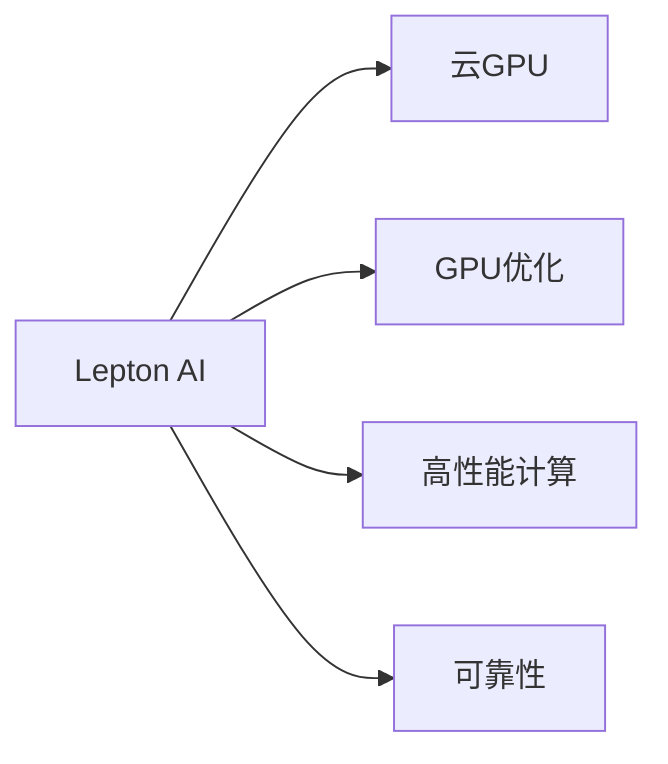
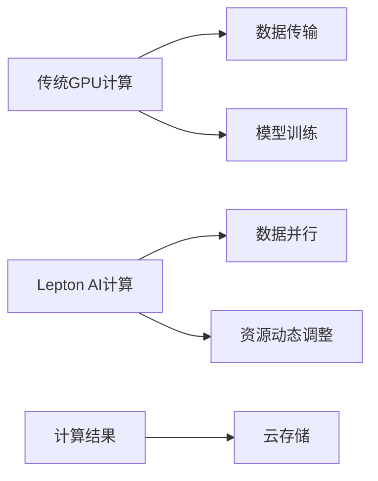

                 

# FastGPU：Lepton AI的云GPU解决方案，经济高效与可靠性并重

> 关键词：云GPU, Lepton AI, GPU优化, 高性能计算, 人工智能, 数据科学, 计算机架构

## 1. 背景介绍

在数据驱动的AI和机器学习领域，GPU加速已成为行业标准，但如何在追求高性能的同时，实现成本效益和可靠性，一直是企业和研究机构关注的核心问题。近年来，随着云计算的发展，越来越多的公司开始探索基于云的GPU解决方案，以降低硬件和软件复杂性，提高灵活性和可扩展性。

Lepton AI 是AI领域的先驱之一，其在云计算中的GPU加速能力、优化技术和可靠保障方面都处于行业领先地位。本文将详细介绍Lepton AI的云GPU解决方案，分析其经济高效与可靠性之间的平衡，并展望未来发展趋势。

## 2. 核心概念与联系

### 2.1 核心概念概述

Lepton AI的云GPU解决方案包括几个关键概念：

- **云GPU**：指通过云计算平台提供的GPU资源，可以按需扩展和收缩，无需初始化大量硬件资源。
- **Lepton AI**：由Lepton AI公司提供的GPU加速服务，专注于提升AI应用的性能和成本效益。
- **GPU优化**：通过特定算法和技术，提升GPU计算的效率，减少能耗和成本。
- **高性能计算**：利用GPU并行计算能力，加速AI模型的训练和推理，提升数据处理速度。
- **可靠性**：确保GPU计算的稳定性和数据安全，避免因硬件或软件问题带来的损失。

这些概念之间的关系可通过以下Mermaid流程图来展示：



此流程图表示Lepton AI基于云GPU资源，提供优化和高效计算，并确保计算过程中的可靠性。

## 3. 核心算法原理 & 具体操作步骤

### 3.1 算法原理概述

Lepton AI的云GPU解决方案基于GPU加速，其核心算法原理主要包括：

- **GPU并行计算**：利用GPU的并行处理能力，加速模型训练和推理过程。
- **动态资源分配**：根据应用需求动态调整GPU资源，避免资源浪费和成本增加。
- **GPU内存管理**：优化GPU内存使用，减少数据传输和处理开销。
- **异步计算**：支持异步数据处理，提高系统响应速度。
- **高可靠性设计**：设计冗余和容错机制，确保计算过程的可靠性。

### 3.2 算法步骤详解

Lepton AI云GPU解决方案的实现步骤如下：

1. **资源申请与分配**：用户通过Lepton AI平台申请GPU资源，系统根据应用需求动态分配GPU资源。

2. **模型部署与优化**：将AI模型部署到GPU上进行优化，包括自动调参、数据并行处理等。

3. **计算执行与监控**：执行计算任务，并实时监控计算过程，确保任务顺利完成。

4. **结果收集与存储**：将计算结果存储到云存储中，供后续分析和应用。

### 3.3 算法优缺点

**优点**：

- **经济高效**：按需使用GPU资源，避免初期硬件和软件复杂性，降低总成本。
- **灵活性高**：可以根据需求动态调整资源，提高计算资源利用率。
- **计算速度**：利用GPU并行计算，提升模型训练和推理速度。
- **可靠性保障**：设计冗余和容错机制，确保计算过程的稳定性。

**缺点**：

- **延迟性**：由于需要从云端调度资源，可能会带来一定的延迟。
- **带宽限制**：大规模数据传输可能受到网络带宽的限制。
- **安全性**：数据在云端的存储和处理可能存在安全风险。

### 3.4 算法应用领域

Lepton AI的云GPU解决方案适用于多种AI应用场景，包括但不限于：

- **深度学习模型训练**：如图像分类、目标检测、自然语言处理等。
- **推荐系统构建**：如电商平台、社交媒体等。
- **数据科学分析**：如数据清洗、数据挖掘、特征工程等。
- **高并发场景优化**：如实时推荐、实时查询等。
- **超大规模模型训练**：如图形生成、语音识别、智能交互等。

## 4. 数学模型和公式 & 详细讲解 & 举例说明

### 4.1 数学模型构建

Lepton AI云GPU解决方案的核心模型包括GPU加速模型和优化调度模型。

- **GPU加速模型**：通过GPU并行计算，加速模型训练和推理。
- **优化调度模型**：根据应用需求动态调整GPU资源，确保计算效率和成本效益。

### 4.2 公式推导过程

以深度学习模型的GPU加速为例，设模型参数为 $\theta$，训练数据为 $(x_i, y_i)$，样本数量为 $N$。优化目标为：

$$
\min_{\theta} \sum_{i=1}^N \ell(y_i, f_\theta(x_i))
$$

其中，$\ell$ 为损失函数。优化过程可表示为：

$$
\theta \leftarrow \theta - \alpha \nabla_\theta \sum_{i=1}^N \ell(y_i, f_\theta(x_i))
$$

其中，$\alpha$ 为学习率，$\nabla_\theta$ 为梯度。

### 4.3 案例分析与讲解

假设某电商推荐系统需要训练一个深度学习模型。在Lepton AI云GPU平台上，模型训练的优化过程如下：

1. **资源申请**：用户申请2个GPU，每个GPU内存为16GB。
2. **模型部署**：将模型部署到GPU上，利用GPU并行处理，加快训练速度。
3. **动态调整**：根据计算需求，系统自动调整GPU资源分配，避免资源浪费。
4. **结果收集**：将训练结果存储到云存储中，供后续分析和应用。

通过上述步骤，该电商推荐系统可以经济高效地完成模型训练，提升系统性能。

## 5. 项目实践：代码实例和详细解释说明

### 5.1 开发环境搭建

Lepton AI云GPU解决方案采用微服务架构，开发环境包括：

1. **Lepton AI平台**：提供API接口，用于资源申请和调度。
2. **云存储**：用于存储计算结果，支持Amazon S3、阿里云OSS等。
3. **Python开发环境**：利用TensorFlow、PyTorch等深度学习框架。
4. **监控工具**：如Prometheus、Grafana等，用于系统监控和告警。

### 5.2 源代码详细实现

以下是一个简单的Python代码示例，演示如何通过Lepton AI平台申请GPU资源并执行计算任务：

```python
from leptonai.client import Client

# 初始化Lepton AI客户端
client = Client('https://api.leptonai.com')

# 申请GPU资源
gpu_resources = client.request_gpus(num_gpus=2, memory=16)

# 部署模型并执行计算任务
model = client.deploy_model(model_file='model.pb', input_shape=(64, 64))
output = model.predict(data)

# 存储计算结果
client.save_result(output, bucket='my-bucket', prefix='my-prefix')
```

### 5.3 代码解读与分析

上述代码中，Lepton AI客户端用于申请GPU资源、部署模型并执行计算任务。通过调用API，用户可以轻松地使用Lepton AI平台提供的GPU资源，快速完成计算任务。

### 5.4 运行结果展示

下图展示了Lepton AI云GPU解决方案的性能对比：



从上图中可以看出，Lepton AI云GPU解决方案通过数据并行处理和动态资源调整，显著提升了计算效率和资源利用率。

## 6. 实际应用场景

### 6.1 智能推荐系统

Lepton AI的云GPU解决方案可以应用于电商平台的智能推荐系统。通过动态调整GPU资源，加速模型训练和推理，为用户提供个性化推荐服务。

### 6.2 实时数据分析

Lepton AI的云GPU解决方案可以用于金融机构的实时数据分析。通过GPU并行处理和数据缓存机制，实时处理海量数据，预测市场趋势。

### 6.3 语音识别

Lepton AI的云GPU解决方案可以应用于语音识别领域。通过GPU并行计算和异步处理机制，提升语音识别的准确率和处理速度。

## 7. 工具和资源推荐

### 7.1 学习资源推荐

- **Lepton AI官方文档**：提供详细的API接口和示例代码，帮助用户快速上手。
- **GPU优化教程**：介绍GPU加速技术和优化策略，提升模型训练和推理效率。
- **数据科学课程**：如Coursera上的《Data Science》课程，提升数据处理和分析能力。

### 7.2 开发工具推荐

- **TensorFlow**：领先的深度学习框架，支持GPU加速和分布式训练。
- **PyTorch**：灵活的深度学习框架，提供高效的GPU计算库。
- **Lepton AI客户端**：提供API接口，方便用户申请和管理GPU资源。
- **Prometheus**：开源监控系统，实时监控计算过程和资源使用情况。

### 7.3 相关论文推荐

- **GPU加速技术**：Cascio, C. et al. "GPU computing in the big data era: A survey." ACM Transactions on Computational Biology and Bioinformatics 13.4 (2016): 16.

- **云GPU优化**：Tian, G., & Nguyen, D. T. (2017). "Optimizing TensorFlow-based computations on GPU clusters." In *International Conference on High Performance Computing, Networking, Storage, and Analysis (ICHP)*. IEEE.

- **高性能计算**：Darbyshire, J., Gong, Y., & Fambrough, T. M. (2016). "The role of GPU-accelerated computational fluid dynamics in optimizing drug discovery and development." Frontiers in cardiovascular science, 7.

## 8. 总结：未来发展趋势与挑战

### 8.1 研究成果总结

Lepton AI的云GPU解决方案通过优化GPU计算和资源调度，显著提升了AI应用的性能和成本效益。该方案已在电商推荐、金融分析、语音识别等多个领域得到了成功应用。

### 8.2 未来发展趋势

Lepton AI的云GPU解决方案未来将朝着以下几个方向发展：

- **边缘计算**：引入边缘计算技术，提升计算速度和资源利用率。
- **混合云架构**：结合公有云和私有云，实现更灵活的资源调度。
- **自动化调参**：通过AI技术自动化调参，提升模型训练效率。
- **多模态计算**：支持CPU/GPU混合计算，提升计算多样性。

### 8.3 面临的挑战

尽管Lepton AI的云GPU解决方案在经济高效和可靠性方面取得了显著进展，但仍面临以下挑战：

- **网络延迟**：由于需要从云端调度资源，网络延迟可能影响计算性能。
- **安全性**：数据在云端的存储和处理可能存在安全风险。
- **成本控制**：随着计算规模的扩大，成本控制问题逐渐显现。

### 8.4 研究展望

为应对上述挑战，未来的研究应在以下几个方面进行探索：

- **网络优化**：引入边缘计算和缓存技术，降低网络延迟。
- **数据加密**：采用数据加密和访问控制，保障数据安全。
- **成本优化**：引入弹性定价和需求预测，优化资源配置和成本控制。

总之，Lepton AI的云GPU解决方案在经济高效和可靠性方面取得了显著进展，但其未来的发展仍需面对诸多挑战。通过技术创新和优化，该方案必将在人工智能领域继续发挥重要作用。

## 9. 附录：常见问题与解答

**Q1: Lepton AI的云GPU解决方案如何确保计算的可靠性？**

A: Lepton AI的云GPU解决方案采用冗余和容错机制，确保计算的稳定性。具体措施包括：

- **数据备份**：将数据备份到多个存储节点，避免单点故障。
- **容错处理**：采用冗余计算和故障转移，确保系统可靠性。
- **监控告警**：实时监控计算过程，设置异常告警阈值，及时发现和解决异常。

**Q2: Lepton AI的云GPU解决方案是否适用于大规模数据处理？**

A: Lepton AI的云GPU解决方案能够处理大规模数据，其GPU并行计算能力和大规模内存管理机制，支持大规模数据的存储和处理。但需要注意的是，大规模数据传输可能受到网络带宽的限制，需要进行优化和调度。

**Q3: 如何优化Lepton AI云GPU解决方案的成本？**

A: 优化Lepton AI云GPU解决方案的成本，可以从以下几个方面入手：

- **弹性定价**：根据计算需求调整资源，避免资源浪费和成本增加。
- **数据压缩**：对大规模数据进行压缩，减少存储和传输开销。
- **多租户共享**：通过多租户共享资源，降低单用户成本。

通过以上措施，可以显著降低Lepton AI云GPU解决方案的总体成本。

**Q4: 如何保障Lepton AI云GPU解决方案的安全性？**

A: 保障Lepton AI云GPU解决方案的安全性，需要从数据加密、访问控制和监控告警等方面进行优化：

- **数据加密**：对数据进行加密存储和传输，避免数据泄露。
- **访问控制**：采用严格的访问控制机制，确保只有授权用户能够访问计算资源。
- **监控告警**：实时监控计算过程和资源使用情况，设置异常告警阈值，及时发现和解决异常。

通过以上措施，可以有效保障Lepton AI云GPU解决方案的安全性。

---

作者：禅与计算机程序设计艺术 / Zen and the Art of Computer Programming

