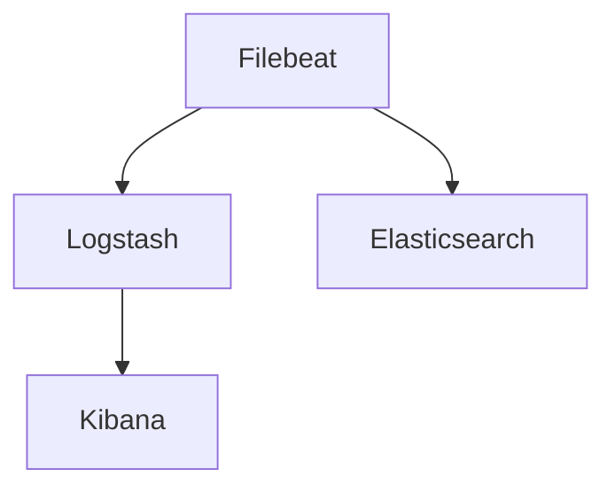

                 

# Filebeat日志采集与传输

> 关键词：Filebeat, Logstash, Elastic Stack, 日志采集, 日志传输, 分布式日志系统

## 1. 背景介绍

在现代互联网和分布式系统中，日志是记录系统运行状态和故障诊断的重要工具。然而，随着系统的规模不断扩大，日志数量急剧增长，传统的人工收集和手动分析已无法满足需求。为此，日志采集与传输技术应运而生，成为自动化运维管理的关键。Filebeat作为日志采集系统，以其高效、轻量、易于配置的特点，迅速成为业界首选的日志采集工具。

本文将详细介绍Filebeat日志采集与传输的核心概念、关键算法和操作步骤，同时提供详尽的代码实例和实战经验，帮助读者掌握Filebeat的实践技巧。通过本文的学习，读者将能够灵活搭建和配置Filebeat系统，实现高效的日志采集和传输，为构建分布式日志系统打下坚实的基础。

## 2. 核心概念与联系

### 2.1 核心概念概述

在深入探讨Filebeat日志采集与传输之前，我们先简要介绍几个关键概念：

- **Filebeat**：由Elastic公司开源的日志采集系统，支持从服务器、应用程序、容器等多种数据源收集日志，并支持多种协议（如Syslog、HTTP、TCP、UDP等）。

- **Logstash**：与Filebeat同属Elastic Stack的一部分，是一款强大的日志处理和分析工具，支持日志过滤、解析、转换、聚合等功能。

- **Elastic Stack**：包括Elasticsearch、Logstash、Kibana等组件，构成了一套完整的日志管理和分析解决方案，支持从日志采集、存储、查询、可视化到告警的完整流程。

- **日志采集**：指从应用服务器、数据库、容器等数据源自动获取日志数据的过程，是日志分析的基础。

- **日志传输**：指将日志数据从数据源传输到中央日志存储系统（如Elasticsearch）的过程，是日志系统高效运行的关键。

这些概念之间存在紧密联系，通过Elastic Stack，可以实现从数据采集到查询分析的全流程自动化管理，帮助运维团队快速响应故障，提升系统性能和可用性。

### 2.2 核心概念原理和架构的 Mermaid 流程图



通过这张流程图，我们可以清晰地看到Filebeat、Logstash和Elasticsearch之间的关系：Filebeat负责从数据源采集日志，并通过Logstash进行初步处理和解析，最后将日志数据存储到Elasticsearch中，并通过Kibana进行可视化分析。

## 3. 核心算法原理 & 具体操作步骤

### 3.1 算法原理概述

Filebeat的核心算法原理基于日志采集和数据传输的优化设计。其核心思想是将日志采集和传输过程进行模块化和分布式部署，以适应大规模数据处理需求，同时采用高效的数据压缩和传输协议，减少网络带宽占用和日志存储成本。

### 3.2 算法步骤详解

#### 3.2.1 日志采集

Filebeat的日志采集过程分为以下几个步骤：

1. **配置配置文件**：创建配置文件配置数据源和采集策略，如指定日志文件路径、采集时间间隔、采集协议等。
2. **启动服务进程**：运行Filebeat服务进程，从指定数据源（如服务器文件系统、应用程序日志文件、容器日志等）读取日志数据。
3. **发送日志数据**：将读取到的日志数据按照配置协议（如Syslog、TCP、UDP等）发送至中央日志存储系统（如Elasticsearch）。

#### 3.2.2 数据传输

Filebeat的数据传输过程包括以下几个关键步骤：

1. **分片数据**：将采集到的日志数据进行分片处理，将每行日志数据进行切分，减少单次传输的数据量。
2. **数据压缩**：对日志数据进行压缩处理，减少网络带宽占用和日志存储成本。
3. **协议转换**：根据配置协议（如Syslog、TCP、UDP等）将日志数据转换为对应的格式，并进行传输。
4. **重试机制**：设置数据传输的重试机制，确保在网络不稳定或数据丢失时能够自动重传数据，保证数据的完整性和可靠性。

#### 3.2.3 算法步骤详解

1. **数据采集配置**：通过修改`filebeat.yml`配置文件，指定日志文件的路径、时间间隔和协议类型。例如：

```yaml
filebeat.inputs:
- type: log
  enabled: true
  paths:
    - /var/log/messages
  interval: 1s
  periodic_refresh_interval: 10s
  output:
    logstash:
      host: "localhost"
      port: 5044
```

2. **启动Filebeat服务**：在日志文件所在目录或系统中创建Filebeat服务进程，启动日志采集。例如：

```bash
sudo filebeat -e -c /etc/filebeat/filebeat.yml
```

3. **配置Logstash输出**：在`filebeat.yml`文件中配置Logstash输出插件，指定Logstash的地址和端口。例如：

```yaml
filebeat.inputs:
- type: log
  enabled: true
  paths:
    - /var/log/messages
  interval: 1s
  periodic_refresh_interval: 10s
  output:
    logstash:
      host: "localhost"
      port: 5044
```

4. **启动Logstash服务**：在Logstash所在目录或系统中创建Logstash服务进程，启动日志处理和传输。例如：

```bash
bin/logstash -f /etc/logstash/logstash.yml
```

5. **配置Elasticsearch输入**：在`logstash.yml`文件中配置Elasticsearch输入插件，指定Elasticsearch的地址、索引名称和日志类型。例如：

```yaml
input {
  file {
    path => ["logs/access.log"]
    start_position => "beginning"
    mode => "multi_line"
    codec => "lines"
  }
}
output {
  elasticsearch {
    hosts => ["localhost:9200"]
    index => "logs-%{+YYYY.MM.dd}"
    document_type => "log"
    bulk_size => 10000
  }
}
```

6. **启动Elasticsearch服务**：在Elasticsearch所在目录或系统中创建Elasticsearch服务进程，启动日志存储和查询。例如：

```bash
bin/elasticsearch -d
```

7. **配置Kibana仪表盘**：在Kibana中创建仪表盘，选择Logstash作为数据源，选择Elasticsearch作为数据存储，配置图表和查询条件。例如：

```yaml
kibana:
  server.host: "localhost"
  http.server.port: "5601"
  http.server.host: "localhost"
  script.service.timezone: "Asia/Shanghai"
```

### 3.3 算法优缺点

#### 3.3.1 优点

- **高效轻量**：Filebeat设计轻量级，不占用大量系统资源，适合大规模日志采集。
- **灵活配置**：支持多种数据源和协议，易于根据实际需求进行配置。
- **分布式部署**：支持多节点部署，可以有效缓解单点故障，提升系统的可靠性和可扩展性。
- **数据压缩**：支持数据压缩，减少网络带宽和存储成本。
- **重试机制**：设置数据传输重试机制，保证数据的完整性和可靠性。

#### 3.3.2 缺点

- **配置复杂**：配置文件较多，配置项复杂，需要一定的系统运维经验。
- **不适用于CPU密集型应用**：对于CPU密集型应用，由于频繁的磁盘读写，采集速度较慢。
- **依赖Elastic Stack**：依赖于Elastic Stack的其他组件，部署和运维成本较高。

### 3.4 算法应用领域

Filebeat的应用领域非常广泛，涵盖各种类型的数据源和应用场景：

- **服务器日志采集**：从Linux系统、Windows系统、Unix系统等操作系统上采集日志。
- **应用程序日志采集**：从Web服务器、数据库、中间件等应用系统中采集日志。
- **容器日志采集**：从Docker、Kubernetes等容器平台上采集日志。
- **安全日志采集**：从防火墙、入侵检测系统等安全设备中采集日志。
- **系统监控日志采集**：从监控系统、运维工具等系统中采集日志。

Filebeat以其灵活的配置和强大的功能，成为业界首选的日志采集工具，广泛应用于各种分布式系统和大数据平台中。

## 4. 数学模型和公式 & 详细讲解 & 举例说明

### 4.1 数学模型构建

在讨论Filebeat日志采集与传输的数学模型前，我们先简要回顾一下相关概念。

- **日志数据量**：指在一定时间内产生的日志数据总量，单位为字节或记录数。
- **采集频率**：指文件beat每秒从数据源中读取日志数据的次数。
- **传输速率**：指Filebeat每秒向中央日志存储系统传输日志数据的速率。

### 4.2 公式推导过程

在Filebeat中，日志采集和传输过程可以通过以下公式来表示：

$$
\text{总日志数据量} = \text{日志数据量} \times \text{采集频率} \times \text{传输速率}
$$

其中，$\text{日志数据量}$表示在时间$t$内产生的日志数据总量，$\text{采集频率}$表示Filebeat每秒从数据源中读取日志数据的次数，$\text{传输速率}$表示Filebeat每秒向中央日志存储系统传输日志数据的速率。

### 4.3 案例分析与讲解

假设有500GB的日志数据，Filebeat以每秒钟读取1000行的频率从数据源中读取，并以每秒钟传输1MB的速率向Elasticsearch发送数据。则总日志数据量为：

$$
\text{总日志数据量} = 500GB \times \frac{1000 \text{ 行/秒}}{1MB/1000MB} \times 1MB/秒 = 500 \text{ GB}
$$

在这个案例中，我们可以看到，尽管日志数据量较大，但由于Filebeat的高效传输速率，能够快速完成日志数据的采集和传输任务。

## 5. 项目实践：代码实例和详细解释说明

### 5.1 开发环境搭建

要搭建Filebeat日志采集与传输系统，首先需要准备好开发环境。以下是搭建环境的具体步骤：

1. **安装依赖软件**：安装Java、Elastic Stack等依赖软件。例如：

```bash
sudo apt-get update
sudo apt-get install default-jdk
```

2. **安装Elastic Stack**：从官网下载Elastic Stack安装包，解压并启动服务进程。例如：

```bash
wget https://artifacts.elastic.co/downloads/elasticsearch/elasticsearch-7.10.1-amd64.deb
sudo dpkg -i elasticsearch-7.10.1-amd64.deb
sudo /etc/init.d/elasticsearch start
```

3. **安装Filebeat**：从官网下载Filebeat安装包，解压并配置服务进程。例如：

```bash
wget https://artifacts.elastic.co/downloads/filebeat/filebeat-7.10.1_amd64.deb
sudo dpkg -i filebeat-7.10.1_amd64.deb
sudo systemctl start filebeat
```

### 5.2 源代码详细实现

以下是使用Filebeat进行日志采集与传输的详细代码实现：

#### 5.2.1 配置`filebeat.yml`

```yaml
filebeat.inputs:
- type: log
  enabled: true
  paths:
    - /var/log/nginx/access.log
  interval: 1s
  periodic_refresh_interval: 10s
  output:
    logstash:
      host: "localhost"
      port: 5044
```

#### 5.2.2 配置`logstash.yml`

```yaml
input {
  file {
    path => ["logs/access.log"]
    start_position => "beginning"
    mode => "multi_line"
    codec => "lines"
  }
}
output {
  elasticsearch {
    hosts => ["localhost:9200"]
    index => "logs-%{+YYYY.MM.dd}"
    document_type => "log"
    bulk_size => 10000
  }
}
```

#### 5.2.3 启动Elasticsearch服务

```bash
sudo systemctl start elasticsearch
```

### 5.3 代码解读与分析

在上面的代码中，我们详细介绍了如何使用Filebeat进行日志采集与传输。其中，`filebeat.yml`文件用于配置日志采集策略，指定日志文件路径、采集频率和输出协议。`logstash.yml`文件用于配置Logstash输入策略，指定日志文件路径、日志格式和输出目标。

### 5.4 运行结果展示

启动Filebeat、Logstash和Elasticsearch服务后，可以通过Kibana查看日志数据的采集与传输情况。例如，在Kibana中创建一个新的仪表盘，选择Elasticsearch作为数据源，选择`logs-*`索引作为数据存储，配置查询条件和图表类型，即可实时展示日志数据的采集与传输情况。

## 6. 实际应用场景

### 6.1 云平台监控日志采集

在云平台上，系统日志和应用日志是监控和运维的重要数据来源。通过Filebeat，可以将云平台上的日志数据实时采集并传输到Elasticsearch中，利用Elasticsearch强大的查询和分析功能，快速发现系统异常和应用问题，提升云平台监控的自动化水平。

### 6.2 网络流量分析

在网络流量监控中，日志数据是分析网络流量变化、识别网络攻击的重要依据。通过Filebeat将网络设备（如路由器、防火墙、入侵检测系统等）的日志数据采集并传输到Elasticsearch中，利用Elasticsearch强大的数据分析和可视化功能，实时展示网络流量变化，识别潜在网络威胁，提升网络安全管理水平。

### 6.3 应用性能监控

在应用性能监控中，日志数据是评估应用性能和资源使用情况的关键指标。通过Filebeat将应用服务器的日志数据采集并传输到Elasticsearch中，利用Elasticsearch强大的数据分析和可视化功能，实时展示应用性能和资源使用情况，快速发现应用问题，提升应用性能和稳定性。

### 6.4 未来应用展望

随着Elastic Stack和Filebeat技术的不断演进，未来的日志采集与传输系统将具备更强大的功能和更广泛的应用场景：

1. **实时流处理**：支持实时流处理，能够快速处理和分析海量日志数据，提升数据处理能力。
2. **多数据源集成**：支持多数据源集成，能够从不同数据源（如日志文件、数据库、API等）采集数据，实现全面的数据采集。
3. **分布式集群管理**：支持分布式集群管理，能够实现多节点部署和管理，提升系统的可靠性和可扩展性。
4. **智能告警系统**：结合机器学习和异常检测技术，能够智能识别日志中的异常情况，自动生成告警信息。
5. **用户行为分析**：支持用户行为分析，能够从日志数据中提取用户行为信息，提升用户体验和应用性能。

## 7. 工具和资源推荐

### 7.1 学习资源推荐

要深入了解Filebeat日志采集与传输技术，以下是几本优秀的学习资源：

1. **《Elasticsearch权威指南》**：详细介绍Elasticsearch的核心概念和应用场景，是学习Elastic Stack的必备资源。
2. **《Filebeat实战》**：实战教程，详细介绍了Filebeat的安装、配置和应用，适合初学者快速上手。
3. **《Logstash实战》**：实战教程，详细介绍了Logstash的安装、配置和应用，是学习Elastic Stack的重要补充。
4. **官方文档**：Elastic公司提供的官方文档，包含详细的使用指南和API接口，是学习Filebeat和Elastic Stack的最佳资源。

### 7.2 开发工具推荐

以下是几款常用的开发工具，可以帮助你快速搭建和调试Filebeat日志采集与传输系统：

1. **Git**：版本控制工具，用于管理代码和文档。
2. **Kibana**：日志分析仪表盘，用于可视化日志数据和生成报告。
3. **Elastic Stack**：日志管理和分析平台，包括Elasticsearch、Logstash、Kibana等组件。
4. **Kubernetes**：容器编排工具，用于管理和扩展Filebeat和Elastic Stack集群。

### 7.3 相关论文推荐

以下是几篇具有代表性的论文，介绍了Filebeat日志采集与传输技术的研究进展：

1. **《Filebeat: A fast, flexible, and simple logging agent for Elastic Stack》**：Filebeat的核心论文，介绍了Filebeat的设计思想和实现细节。
2. **《Logging and Monitoring with Elasticsearch, Logstash, and Kibana》**：介绍Elastic Stack在日志采集与监控中的应用。
3. **《Real-time log collection with Filebeat and Elasticsearch》**：介绍Filebeat在实时日志采集中的应用。

## 8. 总结：未来发展趋势与挑战

### 8.1 研究成果总结

本文详细介绍了Filebeat日志采集与传输的核心概念、算法原理和操作步骤，通过实际案例和代码实现，帮助读者掌握Filebeat的实践技巧。通过学习本文，读者能够灵活搭建和配置Filebeat系统，实现高效的日志采集和传输，为构建分布式日志系统打下坚实的基础。

### 8.2 未来发展趋势

Filebeat作为Elastic Stack的重要组成部分，未来的发展趋势如下：

1. **自动化配置**：引入自动化配置工具，减少人工配置和调试工作量，提升系统部署效率。
2. **智能告警**：结合机器学习和异常检测技术，智能识别日志中的异常情况，自动生成告警信息。
3. **分布式集群管理**：支持分布式集群管理，实现多节点部署和管理，提升系统的可靠性和可扩展性。
4. **实时流处理**：支持实时流处理，快速处理和分析海量日志数据，提升数据处理能力。
5. **跨平台支持**：支持跨平台部署，兼容多种操作系统和数据源。

### 8.3 面临的挑战

尽管Filebeat已经广泛应用于日志采集与传输领域，但仍面临以下挑战：

1. **配置复杂**：配置文件较多，配置项复杂，需要一定的系统运维经验。
2. **依赖Elastic Stack**：依赖于Elastic Stack的其他组件，部署和运维成本较高。
3. **数据安全**：日志数据包含敏感信息，如何在采集和传输过程中保证数据安全，是一个重要的挑战。

### 8.4 研究展望

为了解决上述挑战，未来的研究需要在以下几个方面寻求新的突破：

1. **简化配置**：引入自动化配置工具，减少人工配置和调试工作量，提升系统部署效率。
2. **分布式集群管理**：支持分布式集群管理，实现多节点部署和管理，提升系统的可靠性和可扩展性。
3. **数据加密**：在日志采集和传输过程中，采用数据加密技术，保证数据安全。

## 9. 附录：常见问题与解答

### Q1：Filebeat支持的日志格式有哪些？

A: Filebeat支持多种日志格式，包括Syslog、JSON、CSV、Syslog UDP、Syslog TCP等。具体支持的日志格式可参考官方文档。

### Q2：Filebeat如何处理日志文件中的时间戳？

A: Filebeat默认使用日志文件中记录的时间戳，并将其转换为Elasticsearch的时间格式。如果日志文件中没有时间戳，Filebeat会自动从系统时间获取时间戳。

### Q3：如何配置Filebeat的输出目标？

A: Filebeat支持多种输出目标，包括Logstash、Elasticsearch、Kafka等。配置输出目标时，需要指定目标的地址、端口、索引名称和文档类型等参数。

### Q4：如何优化Filebeat的日志采集性能？

A: 优化Filebeat的日志采集性能，可以从以下几个方面入手：
1. 配置合理的采集频率和批处理大小。
2. 使用多节点部署，实现负载均衡和故障转移。
3. 启用数据压缩和数据分片，减少网络带宽和存储成本。
4. 设置数据传输重试机制，确保数据的完整性和可靠性。

通过以上优化措施，可以显著提升Filebeat的日志采集性能，满足大规模数据采集需求。

### Q5：如何保证日志数据的安全性？

A: 保证日志数据的安全性，可以从以下几个方面入手：
1. 使用数据加密技术，对日志数据进行加密处理。
2. 配置网络安全策略，限制日志数据传输的源和目标地址。
3. 设置数据传输重试机制，确保数据传输的安全性。

通过以上措施，可以保证日志数据的安全性，防止数据泄露和篡改。

---

作者：禅与计算机程序设计艺术 / Zen and the Art of Computer Programming

