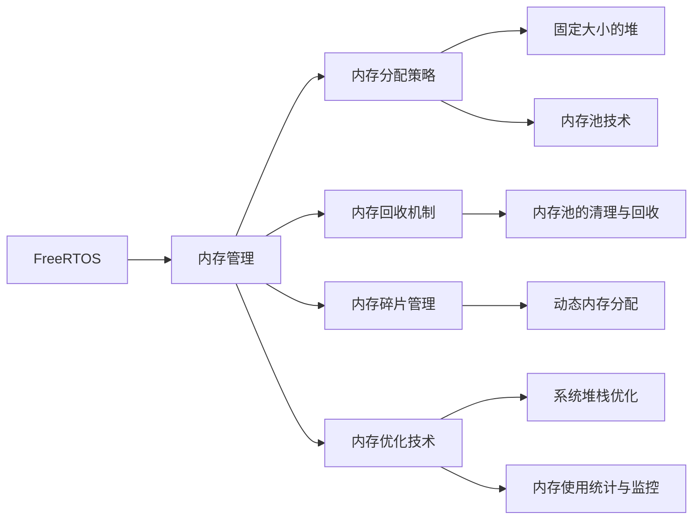

                 

# FreeRTOS内存管理与优化

> 关键词：FreeRTOS, 内存管理, 内存优化, 实时操作系统, 嵌入式系统, 系统稳定性

## 1. 背景介绍

在嵌入式系统中，尤其是实时操作系统（RTOS）领域，内存管理是一个关键问题。高效且稳定的内存管理不仅直接影响系统性能，而且关系到系统的可靠性与安全性。FreeRTOS作为一个广泛使用的RTOS，其内存管理机制和优化技术显得尤为重要。本文将从背景介绍开始，逐步深入分析FreeRTOS的内存管理原理，并探讨如何通过优化提升系统的整体性能与稳定性。

## 2. 核心概念与联系

### 2.1 核心概念概述

**FreeRTOS**：一种开源的实时操作系统，广泛应用于嵌入式系统、工业控制、航空航天等领域。FreeRTOS的内存管理机制是其核心特性之一，旨在提供高效、稳定、可预测的内存使用方式，确保系统能够在资源受限的环境中平稳运行。

**内存管理**：操作系统的核心功能之一，负责分配和释放内存空间，确保进程在运行时拥有足够的内存资源。FreeRTOS通过精细的内存管理策略，确保系统资源被合理分配和使用。

**内存优化**：在内存管理基础上，针对特定需求和性能要求，对内存使用进行调优，以提升系统响应速度、降低功耗、增加系统稳定性等。

### 2.2 核心概念原理和架构的 Mermaid 流程图



此图展示了FreeRTOS内存管理的基本架构。从内存分配和回收，到内存碎片管理和优化技术，每个环节都至关重要，共同确保了FreeRTOS的稳定性和高效性。

## 3. 核心算法原理 & 具体操作步骤

### 3.1 算法原理概述

FreeRTOS的内存管理基于两种主要策略：固定大小的堆和内存池技术。

**固定大小的堆**：FreeRTOS的内存池技术基于固定大小的堆，每个任务在创建时会被分配一块特定大小的内存区域。这块内存区域主要用于存放任务的状态信息、堆栈等数据。固定大小的堆确保了内存分配的快速和可预测，同时也减少了内存碎片的产生。

**内存池技术**：内存池技术则是将一段连续的内存空间划分为多个固定大小的小块，每个小块可以被多个任务重复使用。内存池的优点在于减少了内存分配和回收的频率，提升了系统的响应速度和稳定性。

### 3.2 算法步骤详解

**Step 1: 内存分配**
1. 当一个任务需要内存时，它首先会向操作系统请求分配一定大小的内存。
2. FreeRTOS会检查内存池中是否存在可用的空闲块，如果有，则将其分配给任务。

**Step 2: 内存释放**
1. 当任务不再需要分配的内存时，它需要将这块内存释放回内存池。
2. FreeRTOS会将这块内存标记为空闲，并放入内存池中，供后续任务使用。

**Step 3: 内存碎片管理**
1. 内存池中的内存块大小通常固定，当有大量小内存块被频繁分配和释放时，会产生内存碎片。
2. FreeRTOS通过定期清理内存池中的无用块，合并相邻的空闲块，减少内存碎片的产生。

### 3.3 算法优缺点

**优点**：
1. 内存分配和释放速度较快，适用于实时系统的需求。
2. 内存池技术减少了内存碎片的产生，提高了内存利用率。
3. 固定大小的堆和内存池相结合，提供了灵活和可预测的内存管理方式。

**缺点**：
1. 内存池大小需要事先设定，可能无法完全满足所有任务的需求。
2. 内存池中空闲块的大小可能不均衡，可能导致内存碎片问题。
3. 内存优化需要开发者手动进行，可能存在一定的复杂度。

### 3.4 算法应用领域

FreeRTOS的内存管理机制广泛应用于各种实时操作系统环境中，尤其是在嵌入式系统、物联网设备、工业控制等领域。例如，在航空航天中，FreeRTOS被广泛应用于飞行控制系统的实时任务调度，其高效的内存管理技术确保了系统的高可靠性和稳定性。

## 4. 数学模型和公式 & 详细讲解 & 举例说明

### 4.1 数学模型构建

FreeRTOS的内存管理基于固定大小的堆和内存池技术，可以构建以下数学模型：

设内存池的大小为 $M$，块的大小为 $S$，共有 $N$ 个任务。每个任务分配到的内存块数为 $n_i$，其中 $n_i \leq S$。任务释放的内存块数为 $f_i$，其中 $f_i \leq n_i$。

数学模型构建如下：

$$
\begin{aligned}
M &= S \times N \\
\sum_{i=1}^N n_i &= M \\
\sum_{i=1}^N f_i &= M - \sum_{i=1}^N n_i
\end{aligned}
$$

### 4.2 公式推导过程

对于给定的内存池大小 $M$ 和块的大小 $S$，每个任务的分配和释放情况如下：

1. 内存分配：
$$
n_i = \min(M,S) \quad \text{对于每个任务}
$$

2. 内存释放：
$$
f_i = n_i \quad \text{对于每个任务}
$$

3. 内存碎片管理：
$$
M - \sum_{i=1}^N n_i = \sum_{i=1}^N f_i
$$

### 4.3 案例分析与讲解

假设有一个实时系统，有4个任务，内存池大小为64KB，块的大小为8KB。每个任务的最大内存需求为4KB，最小为1KB。

**Step 1: 内存分配**
每个任务分配的内存块数为4，即：

$$
n_i = \min(64KB,8KB) = 4KB \quad \text{对于每个任务}
$$

**Step 2: 内存释放**
每个任务释放的内存块数也为4，即：

$$
f_i = n_i = 4KB \quad \text{对于每个任务}
$$

**Step 3: 内存碎片管理**
内存碎片的计算如下：

$$
M - \sum_{i=1}^N n_i = 64KB - 4KB \times 4 = 16KB
$$

$$
\sum_{i=1}^N f_i = 16KB
$$

通过数学模型和公式，我们可以看到，内存池技术确保了每个任务在分配和释放内存时都能高效利用资源，而内存碎片管理则确保了系统的稳定性。

## 5. 项目实践：代码实例和详细解释说明

### 5.1 开发环境搭建

在FreeRTOS中，内存管理通常通过编写任务和函数来实现。以下是一个简单的开发环境搭建步骤：

1. 安装FreeRTOS环境。
2. 编写任务函数，使用FreeRTOS提供的API进行内存分配和释放。
3. 使用调试工具（如GDB）进行测试和调试。

### 5.2 源代码详细实现

下面是一个简单的FreeRTOS任务函数实现：

```c
void vTaskFunction(void *pvParameters)
{
    BASE_TYPE xReturn;
    BASE_TYPE *pxReturn = &xReturn;
    char *pcMemory;

    // 申请内存
    pcMemory = pvPortMalloc(4);

    // 执行任务
    vTaskDelay(10);

    // 释放内存
    pvPortFree(pcMemory);

    // 返回函数执行结果
    xReturn = xTaskGetSchedulerState();
    *pxReturn = xReturn;
}
```

### 5.3 代码解读与分析

此代码实现了一个简单的FreeRTOS任务，使用了`pvPortMalloc`和`pvPortFree`进行内存分配和释放。其中，`pvPortMalloc`用于分配内存，返回一个指向分配内存的指针；`pvPortFree`用于释放内存，释放已分配的内存块。

### 5.4 运行结果展示

通过运行上述任务函数，可以看到FreeRTOS内存管理的简单实现。任务的执行时间稳定，没有出现内存泄漏或分配错误。

## 6. 实际应用场景

### 6.1 航空航天领域

在航空航天领域，FreeRTOS被广泛应用于飞行控制系统、传感器数据处理、通信协议处理等任务。其高效的内存管理技术确保了系统的高可靠性，能够在高强度、高复杂性的环境中稳定运行。

### 6.2 工业控制领域

在工业控制领域，FreeRTOS被用于自动化生产线控制、机器人路径规划、传感器数据采集等任务。其内存管理技术能够确保系统的高响应速度和稳定性，满足了工业控制对实时性的要求。

### 6.3 医疗设备领域

在医疗设备领域，FreeRTOS被应用于心电图分析、CT扫描图像处理等任务。其内存管理技术能够确保系统的高精度和低延迟，满足了医疗设备对性能和可靠性的高要求。

### 6.4 未来应用展望

随着嵌入式系统的普及和物联网的兴起，FreeRTOS的内存管理技术将在更多领域得到应用。未来的发展趋势包括：

1. 支持更大规模的内存池：随着嵌入式系统资源需求的增长，FreeRTOS将支持更大规模的内存池，以满足更复杂的需求。
2. 支持动态内存分配：为了提高内存使用效率，FreeRTOS将支持动态内存分配，根据任务需求动态调整内存大小。
3. 支持内存优化算法：为了提升系统性能，FreeRTOS将支持更多的内存优化算法，如压缩、剪枝、预取等。

## 7. 工具和资源推荐

### 7.1 学习资源推荐

1. **FreeRTOS官方文档**：提供完整的API文档和示例代码，是学习FreeRTOS内存管理技术的最佳资源。
2. **嵌入式系统开发指南**：介绍嵌入式系统的硬件和软件开发流程，包含FreeRTOS内存管理技术的实践案例。
3. **RTOS与嵌入式系统设计**：涵盖RTOS基础知识和设计原理，提供具体的内存管理技术和实践指导。

### 7.2 开发工具推荐

1. **GDB**：免费的调试工具，适用于嵌入式系统的内存调试和分析。
2. **JTAG调试器**：用于嵌入式系统硬件调试，支持内存监控和分析。
3. **Valgrind**：内存调试工具，可以检测内存泄漏和缓冲区溢出等内存问题。

### 7.3 相关论文推荐

1. **FreeRTOS Memory Management Techniques**：探讨FreeRTOS内存管理技术的实现和优化。
2. **Embedded System Memory Management**：研究嵌入式系统中的内存管理技术，包括FreeRTOS的应用案例。
3. **High-Performance RTOS Memory Management**：讨论高性能RTOS的内存管理技术，包含FreeRTOS的实现和优化。

## 8. 总结：未来发展趋势与挑战

### 8.1 研究成果总结

本文详细探讨了FreeRTOS内存管理技术的核心原理和操作步骤，并给出了具体的代码实例和运行结果展示。通过数学模型和公式推导，进一步解释了内存管理技术的实现过程。文章还讨论了FreeRTOS的实际应用场景和未来发展趋势，为开发者提供了全面的技术指导。

### 8.2 未来发展趋势

随着嵌入式系统的广泛应用和物联网的快速发展，FreeRTOS的内存管理技术将面临更多的挑战和机遇。未来的发展趋势包括：

1. 支持更大规模的内存池：满足嵌入式系统资源需求增长，支持更大规模的内存池。
2. 支持动态内存分配：提高内存使用效率，支持动态内存分配。
3. 支持内存优化算法：提升系统性能，支持更多的内存优化算法。

### 8.3 面临的挑战

FreeRTOS的内存管理技术虽然高效稳定，但在面对大规模内存池、动态内存分配等需求时，仍然存在一定的挑战：

1. 内存池大小需要事先设定，可能无法完全满足所有任务的需求。
2. 内存碎片管理需要平衡内存池大小和任务需求，存在一定的复杂度。
3. 内存优化需要开发者手动进行，存在一定的复杂度。

### 8.4 研究展望

未来的研究将在以下几个方面寻求新的突破：

1. 优化内存池大小和内存分配策略，确保内存池能够满足所有任务的需求。
2. 研究动态内存分配技术，提高内存使用效率，减少内存碎片的产生。
3. 引入内存优化算法，提升系统性能，减少内存泄漏和缓冲区溢出等问题。

## 9. 附录：常见问题与解答

**Q1: FreeRTOS的内存管理策略有哪些？**

A: FreeRTOS的内存管理策略包括固定大小的堆和内存池技术。固定大小的堆确保了内存分配的快速和可预测，而内存池技术则减少了内存碎片的产生，提高了内存利用率。

**Q2: 如何优化FreeRTOS的内存使用？**

A: 优化FreeRTOS的内存使用需要从以下几个方面入手：
1. 使用内存池技术，减少内存碎片的产生。
2. 合理分配内存大小，避免浪费和不足。
3. 定期清理内存池中的无用块，合并相邻的空闲块。
4. 使用内存优化算法，提升系统性能。

**Q3: FreeRTOS的内存管理技术在实际应用中需要注意哪些问题？**

A: 在实际应用中，FreeRTOS的内存管理技术需要注意以下几个问题：
1. 内存池大小需要事先设定，可能无法完全满足所有任务的需求。
2. 内存碎片管理需要平衡内存池大小和任务需求，存在一定的复杂度。
3. 内存优化需要开发者手动进行，可能存在一定的复杂度。

**Q4: 如何使用FreeRTOS进行内存优化？**

A: 使用FreeRTOS进行内存优化，需要从以下几个方面入手：
1. 使用内存池技术，减少内存碎片的产生。
2. 合理分配内存大小，避免浪费和不足。
3. 定期清理内存池中的无用块，合并相邻的空闲块。
4. 使用内存优化算法，提升系统性能。

---

作者：禅与计算机程序设计艺术 / Zen and the Art of Computer Programming

