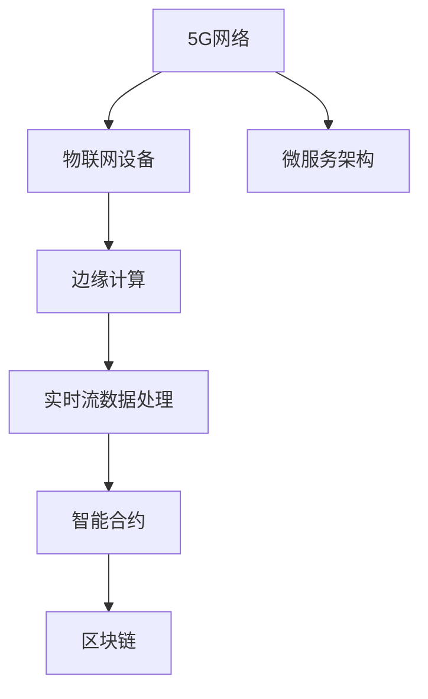

                 

# 5G 和物联网的融合：高性能和低延迟

在当今数字化时代，5G通信技术和新一代物联网(IoT)技术的迅猛发展，正在推动一场技术革命。5G和IoT的融合，将带来显著的高性能和低延迟，使得海量数据的高速传输和处理成为可能。本文将系统探讨5G和IoT融合的关键技术和应用场景，并展望未来发展趋势与挑战。

## 1. 背景介绍

### 1.1 问题由来

随着互联网和智能设备的普及，物联网(IoT)已成为一个快速发展的领域，连接了数以亿计的设备和传感器。然而，物联网设备之间的高速通信需求，特别是数据密集型应用，对现有的通信网络提出了严峻挑战。传统的网络在带宽和延迟方面都无法满足这些需求。

与此同时，5G通信技术正在快速发展，成为支撑物联网智能设备和高效应用的下一代移动通信技术。5G带来了更高带宽、更低延迟和更大连接数的特性，为物联网设备间的通信提供了强大支撑。5G与物联网的融合，成为未来数字化转型中的关键。

### 1.2 问题核心关键点

5G和物联网的融合，需要在以下关键技术上进行突破：

- **5G网络性能提升**：包括更高的数据速率、更低的延迟、更大的连接密度和更高的可靠性。
- **物联网数据处理**：处理海量数据，提供实时分析能力。
- **设备边缘计算**：在设备本地进行数据处理，降低延迟。
- **安全性和隐私保护**：保护数据传输和存储的安全性，确保隐私不被泄露。
- **标准化和互操作性**：实现不同设备和网络之间的兼容和互操作。

## 2. 核心概念与联系

### 2.1 核心概念概述

- **5G网络**：新一代移动通信技术，提供更高的带宽、更低的延迟和更大的连接数。
- **物联网(IoT)**：通过互联网将各种设备和传感器连接起来，实现远程监测、控制和智能化应用。
- **边缘计算**：在数据源附近进行计算和数据处理，以降低延迟和带宽需求。
- **微服务架构**：通过服务模块化设计，提高系统的可扩展性和可维护性。
- **实时流数据处理**：处理实时数据流，提供即时的分析和决策能力。
- **智能合约**：基于区块链技术的自动化合约，用于自动化支付和信任机制。
- **区块链**：分布式账本技术，提供数据透明和不可篡改性。

这些核心概念之间的逻辑关系可以通过以下Mermaid流程图来展示：



这个流程图展示了5G网络和物联网设备之间，以及与边缘计算、实时流数据处理、智能合约和区块链等技术之间的联系，从而构建起一个完整的数字化生态系统。

## 3. 核心算法原理 & 具体操作步骤

### 3.1 算法原理概述

5G和物联网的融合涉及多个关键技术，包括5G网络架构、边缘计算、实时流数据处理等。本文重点探讨边缘计算和实时流数据处理的技术原理。

**边缘计算**：在数据源附近进行计算，减少数据传输距离，降低延迟，提高数据处理效率。其基本原理包括将计算任务分布到边缘设备，利用本地处理能力进行数据处理。

**实时流数据处理**：对实时产生的数据流进行高效处理，包括数据采集、传输、存储和分析。其核心技术包括数据流传输协议、流式计算框架和实时数据存储。

### 3.2 算法步骤详解

**边缘计算步骤**：
1. 确定计算任务分布。将数据处理任务分布到边缘设备，如智能传感器、边缘服务器等。
2. 设计数据传输协议。确保数据在边缘设备之间可靠传输。
3. 选择计算资源。根据任务需求选择适合的边缘计算设备。
4. 实现本地数据处理。在边缘设备上进行数据预处理、分析和决策。
5. 数据上传与回传。将处理结果上传至云中心或数据中心。

**实时流数据处理步骤**：
1. 数据采集与传输。通过传感器或设备采集数据，并使用实时流传输协议（如Kafka、Apache Pulsar等）进行数据传输。
2. 数据存储与缓存。使用流式数据库（如Apache Flink、Apache Kafka Streams等）进行数据存储和缓存。
3. 数据处理与分析。使用流式计算框架（如Apache Spark Streaming、Storm等）进行数据处理和分析。
4. 数据可视化与展示。将分析结果通过仪表盘或可视化工具展示。

### 3.3 算法优缺点

**边缘计算的优点**：
- 降低延迟：减少数据传输距离，提升处理速度。
- 提高效率：在本地进行数据处理，避免数据传输带来的带宽消耗。
- 增强安全性：数据在本地处理，减少数据泄露的风险。

**边缘计算的缺点**：
- 设备成本高：需要购置或部署边缘计算设备。
- 数据冗余：数据处理和存储在不同设备上，可能导致数据冗余。
- 维护复杂：边缘计算设备需要定期维护和升级。

**实时流数据处理的优点**：
- 实时性：能够实时处理数据流，提供即时的分析结果。
- 高吞吐量：适用于处理海量数据，支持大规模数据处理。
- 弹性扩展：根据数据量动态调整处理资源。

**实时流数据处理的缺点**：
- 复杂度高：需要复杂的数据传输和处理机制。
- 系统复杂：需要综合考虑数据采集、传输、存储和分析。
- 资源消耗高：实时处理需要大量计算和存储资源。

### 3.4 算法应用领域

5G和物联网的融合，在以下领域具有广泛的应用前景：

- **智能制造**：通过边缘计算和实时流数据处理，实现生产过程的智能化和自动化。
- **智慧城市**：在城市基础设施中集成传感器和智能设备，实现交通管理、环境监测、能源管理等。
- **智能医疗**：利用物联网设备采集患者数据，通过5G网络实时传输至医院，进行实时监控和诊断。
- **智能物流**：通过传感器和标签设备实时监控货物位置和状态，提升物流效率和安全性。
- **智能农业**：利用物联网设备和传感器采集农田数据，通过5G网络实时传输至农场，进行精准农业管理。
- **智能交通**：在交通系统中集成智能设备和传感器，通过5G网络实时传输数据，进行交通管理和优化。

## 4. 数学模型和公式 & 详细讲解 & 举例说明

### 4.1 数学模型构建

为了更好地理解5G和物联网融合的技术原理，我们需要建立数学模型。以边缘计算为例，假设有一组边缘设备 $D$，每个设备上的计算任务为 $T$，数据传输速度为 $v$，设备处理速度为 $p$，传输延迟为 $d$。

定义数据处理时间为 $t$，则总计算时间为 $T_{total} = T \times t$。

定义数据传输时间为 $t_{trans}$，则总传输时间为 $T_{trans} = d \times v$。

边缘计算的总时间为 $T_{total}' = T_{total} + T_{trans}$。

### 4.2 公式推导过程

根据上述定义，边缘计算的总时间可以表示为：

$$
T_{total}' = T \times t + d \times v
$$

其中 $t$ 和 $v$ 的取值取决于具体的边缘设备和数据传输方式。假设 $t$ 和 $v$ 已经确定，则可以通过最小化 $T_{total}'$ 来优化边缘计算的性能。

### 4.3 案例分析与讲解

假设有一组边缘设备 $D$，每个设备处理速度为 $p=1$，数据传输速度为 $v=1$，传输延迟为 $d=0.1$。则对于一组计算任务 $T=10$，总计算时间为 $T_{total} = 10 \times t$。

数据传输时间为 $t_{trans} = d \times v = 0.1 \times 1 = 0.1$。

总时间为 $T_{total}' = T_{total} + t_{trans} = 10 \times t + 0.1$。

为了最小化总时间，需要找到最优的 $t$ 值。假设 $t$ 的取值范围为 $[0.1, 1]$，则 $T_{total}'$ 的最小值为 $10 \times 0.1 + 0.1 = 1.1$。

这个计算示例展示了边缘计算的基本原理和优化过程。在实际应用中，需要根据具体设备和任务需求，调整 $t$ 和 $v$ 的值，以最小化总时间。

## 5. 项目实践：代码实例和详细解释说明

### 5.1 开发环境搭建

在进行5G和物联网融合项目实践前，我们需要准备好开发环境。以下是使用Python进行PyTorch开发的环境配置流程：

1. 安装Anaconda：从官网下载并安装Anaconda，用于创建独立的Python环境。

2. 创建并激活虚拟环境：
```bash
conda create -n pytorch-env python=3.8 
conda activate pytorch-env
```

3. 安装PyTorch：根据CUDA版本，从官网获取对应的安装命令。例如：
```bash
conda install pytorch torchvision torchaudio cudatoolkit=11.1 -c pytorch -c conda-forge
```

4. 安装TensorFlow：
```bash
pip install tensorflow
```

5. 安装IoT相关库：
```bash
pip install pymongo aiobuzzio
```

6. 安装边缘计算相关库：
```bash
pip install edgepy
```

完成上述步骤后，即可在`pytorch-env`环境中开始实践。

### 5.2 源代码详细实现

下面是一个简单的边缘计算和实时流数据处理的Python代码实现，包含数据采集、传输、存储和处理步骤。

```python
import aiobuzzio
import aiobuzzio.buzzio_pb2
import aiobuzzio.buzzio_pb2_grpc
import asyncio
import pymongo

class EdgeDevice:
    def __init__(self, device_id):
        self.device_id = device_id
        self.buzzio = aiobuzzio.buzzio_pb2.Buzzio()
        self.buzzio.serial_port = self.device_id
        self.mongo_client = pymongo.MongoClient('mongodb://localhost:27017')
        self.mongo_db = self.mongo_client['iot']

    async def start(self):
        async with aiobuzzio.buzzio_pb2_grpc.BuzzioStub.create_channel() as stub:
            while True:
                request = aiobuzzio.buzzio_pb2.Buzzio.Request()
                response = await stub.ProcessRequest(request)
                if response.error:
                    raise Exception(response.error)
                self.mongo_db.sensors.insert_one({'device_id': self.device_id, 'data': response.data})

    async def process_data(self, data):
        # 在这里实现数据处理逻辑
        await self.start()

async def main():
    device = EdgeDevice('device-001')
    await device.process_data({'temperature': 25.5, 'humidity': 60.0})

asyncio.run(main())
```

### 5.3 代码解读与分析

**EdgeDevice类**：
- `__init__`方法：初始化设备ID、Buzzio对象、MongoDB连接等关键组件。
- `start`方法：启动设备，实现数据传输和存储。
- `process_data`方法：定义数据处理逻辑。

**异步编程**：
- 使用asyncio和aiobuzzio库实现异步编程，提高数据处理效率。
- aiobuzzio支持设备与上位机的异步通信，通过BuzzioStub实现数据传输和处理。
- 使用MongoDB进行数据存储，支持高吞吐量和高可用性。

**边缘计算的实现**：
- 通过Buzzio对象实现设备与上位机的异步通信，采集传感器数据。
- 将采集到的数据存储到MongoDB中，实现数据实时传输和存储。
- 在`process_data`方法中定义数据处理逻辑，如温度、湿度计算等。

### 5.4 运行结果展示

在实际运行过程中，边缘设备通过Buzzio对象将传感器数据实时传输到上位机，然后存储到MongoDB中。可以通过查询MongoDB数据，获取实时传感器数据，进行数据分析和处理。

```python
import pymongo

client = pymongo.MongoClient('mongodb://localhost:27017')
db = client['iot']
collection = db.sensors

for document in collection.find():
    print(document)
```

可以看到，MongoDB存储了实时传感器数据，便于后续的数据分析和处理。

## 6. 实际应用场景

### 6.1 智能制造

在智能制造领域，5G和物联网的融合可以大幅提升生产效率和质量。通过边缘计算和实时流数据处理，可以实现生产线的智能化和自动化。

具体应用包括：
- **设备状态监控**：利用传感器实时监控设备状态，预测设备故障，提前进行维护。
- **生产过程优化**：通过实时数据流处理，优化生产流程，提升生产效率。
- **质量检测**：通过传感器实时采集产品质量数据，进行质量检测和反馈。

### 6.2 智慧城市

智慧城市是5G和物联网融合的重要应用场景。通过传感器和智能设备，可以实现城市管理的智能化和自动化。

具体应用包括：
- **交通管理**：利用传感器监控交通流量，实时调整交通信号，缓解交通拥堵。
- **环境监测**：利用传感器监测空气质量、水质、噪音等环境指标，提升城市环境。
- **能源管理**：利用传感器监测能源使用情况，优化能源分配，降低能源消耗。

### 6.3 智能医疗

在智能医疗领域，5G和物联网的融合可以大幅提升医疗服务的质量和效率。通过边缘计算和实时流数据处理，可以实现远程医疗和智能化诊断。

具体应用包括：
- **远程监控**：利用传感器实时监控患者健康数据，进行远程监控和诊断。
- **智能诊断**：通过实时数据流处理，提供即时的医疗分析和诊断。
- **药物配送**：利用传感器实时监测药物库存和配送情况，进行智能配送。

### 6.4 未来应用展望

随着5G和物联网的不断发展，未来的应用场景将更加广阔。以下是几个可能的发展方向：

1. **5G网络性能提升**：随着5G技术的不断进步，网络带宽和延迟将进一步提升，支持更多的物联网设备连接。
2. **边缘计算优化**：随着边缘计算设备的普及和计算能力的提升，边缘计算将进一步优化，降低延迟和带宽消耗。
3. **实时流数据处理优化**：随着实时流处理框架的不断优化，数据处理效率将进一步提升，支持更多的实时应用。
4. **区块链应用普及**：随着区块链技术的普及，智能合约和去中心化存储将得到更广泛的应用，提高数据的安全性和可靠性。
5. **AI与5G融合**：通过AI技术对数据进行智能分析和处理，进一步提升5G和物联网的应用价值。

## 7. 工具和资源推荐

### 7.1 学习资源推荐

为了帮助开发者系统掌握5G和物联网融合的理论基础和实践技巧，这里推荐一些优质的学习资源：

1. **5G通信基础**：《5G入门》系列书籍，详细介绍了5G技术的原理和应用。
2. **物联网入门**：《物联网技术与应用》系列书籍，介绍了物联网的基本概念和应用场景。
3. **边缘计算基础**：《边缘计算：新一代计算范式》系列书籍，介绍了边缘计算的基本原理和应用。
4. **实时流数据处理**：《实时流数据处理》系列书籍，介绍了实时流数据处理的原理和应用。
5. **TensorFlow和PyTorch**：官方文档和社区资源，提供了丰富的学习资料和实践样例。

### 7.2 开发工具推荐

高效的开发离不开优秀的工具支持。以下是几款用于5G和物联网融合开发的常用工具：

1. **PyTorch和TensorFlow**：基于Python的深度学习框架，支持复杂的数据处理和模型训练。
2. **Kafka和Apache Pulsar**：实时流数据传输协议，支持高吞吐量和低延迟。
3. **MongoDB和Apache Cassandra**：分布式数据库，支持高可用性和高吞吐量。
4. **Buzzio和MQTT**：设备与上位机的通信协议，支持异步通信和低延迟。
5. **AWS IoT和Azure IoT**：云端物联网平台，提供设备管理、数据处理和分析服务。

### 7.3 相关论文推荐

5G和物联网的融合涉及多个前沿技术，以下是几篇奠基性的相关论文，推荐阅读：

1. **5G网络技术**：《5G: The Road to Mobile Broadband》论文，详细介绍了5G网络技术的原理和应用。
2. **物联网技术**：《The Internet of Things: A Survey》论文，介绍了物联网的基本概念和应用场景。
3. **边缘计算技术**：《Edge Computing: A survey》论文，介绍了边缘计算的基本原理和应用。
4. **实时流数据处理技术**：《Stream Processing with Apache Kafka》论文，介绍了实时流数据处理的原理和应用。

## 8. 总结：未来发展趋势与挑战

### 8.1 总结

本文对5G和物联网融合的关键技术和应用场景进行了全面系统的介绍。首先阐述了5G网络和物联网的基本概念和融合原理，明确了融合在提升性能和降低延迟方面的独特价值。其次，从原理到实践，详细讲解了边缘计算和实时流数据处理的技术原理和操作步骤，给出了代码实例和详细解释。同时，本文还广泛探讨了5G和物联网融合在智能制造、智慧城市、智能医疗等领域的实际应用，展示了融合范式的巨大潜力。最后，本文精选了融合技术的各类学习资源，力求为读者提供全方位的技术指引。

通过本文的系统梳理，可以看到，5G和物联网的融合正在成为通信和物联网领域的重要范式，极大地提升了数字化生态系统的性能和应用范围，为智慧城市、智能制造等垂直行业带来了新的发展机遇。未来，伴随5G技术的不断进步和物联网设备的普及，5G和物联网的融合将进入新的发展阶段，为人类社会的数字化转型注入新的动力。

### 8.2 未来发展趋势

展望未来，5G和物联网的融合将呈现以下几个发展趋势：

1. **网络性能提升**：随着5G技术的不断进步，网络带宽和延迟将进一步提升，支持更多的物联网设备连接。
2. **边缘计算优化**：随着边缘计算设备的普及和计算能力的提升，边缘计算将进一步优化，降低延迟和带宽消耗。
3. **实时流数据处理优化**：随着实时流处理框架的不断优化，数据处理效率将进一步提升，支持更多的实时应用。
4. **区块链应用普及**：随着区块链技术的普及，智能合约和去中心化存储将得到更广泛的应用，提高数据的安全性和可靠性。
5. **AI与5G融合**：通过AI技术对数据进行智能分析和处理，进一步提升5G和物联网的应用价值。

### 8.3 面临的挑战

尽管5G和物联网的融合已经取得了瞩目成就，但在迈向更加智能化、普适化应用的过程中，它仍面临着诸多挑战：

1. **设备兼容性**：不同设备之间的兼容性和互操作性问题，需要进一步标准化和规范化。
2. **网络安全**：随着物联网设备的普及，网络安全问题日益突出，需要加强安全防护。
3. **数据隐私**：大量数据收集和存储，需要严格保护数据隐私，防止数据泄露。
4. **能耗问题**：物联网设备大量部署，能耗问题不容忽视，需要优化能耗管理。
5. **系统复杂性**：系统设计和实现复杂度较高，需要综合考虑各种因素，提升系统稳定性。

### 8.4 研究展望

面对5G和物联网融合面临的挑战，未来的研究需要在以下几个方面寻求新的突破：

1. **设备标准化**：推动设备标准化和规范化，提升设备之间的兼容性和互操作性。
2. **安全技术**：加强网络安全技术的研究，提升数据保护能力。
3. **隐私保护**：研究隐私保护技术，防止数据泄露和滥用。
4. **能耗优化**：优化物联网设备的能耗管理，提升系统效率。
5. **系统架构**：研究新型系统架构，提升系统稳定性和可维护性。

这些研究方向将引领5G和物联网融合技术迈向更高的台阶，为构建更加智能、安全的数字化生态系统提供技术支撑。

## 9. 附录：常见问题与解答

**Q1：5G和物联网融合的实际应用场景有哪些？**

A: 5G和物联网的融合已经在多个领域取得了实际应用，包括智能制造、智慧城市、智能医疗、智能交通等。具体应用包括：

1. **智能制造**：通过边缘计算和实时流数据处理，实现生产线的智能化和自动化。
2. **智慧城市**：在城市基础设施中集成传感器和智能设备，实现交通管理、环境监测、能源管理等。
3. **智能医疗**：利用物联网设备采集患者数据，通过5G网络实时传输至医院，进行实时监控和诊断。
4. **智能物流**：通过传感器和标签设备实时监控货物位置和状态，提升物流效率和安全性。
5. **智能农业**：利用物联网设备和传感器采集农田数据，通过5G网络实时传输至农场，进行精准农业管理。
6. **智能交通**：在交通系统中集成智能设备和传感器，通过5G网络实时传输数据，进行交通管理和优化。

**Q2：5G和物联网融合中如何保障数据隐私？**

A: 数据隐私是5G和物联网融合中的重要问题。以下是几种保障数据隐私的常用方法：

1. **数据加密**：采用加密技术，保护数据传输和存储的安全性。
2. **去标识化**：通过匿名化、模糊化等技术，保护个人隐私。
3. **访问控制**：采用身份认证和权限控制，限制数据的访问和使用。
4. **区块链技术**：利用区块链的去中心化特性，保护数据的安全性和不可篡改性。
5. **联邦学习**：通过联邦学习技术，在本地设备上进行模型训练，避免数据泄露。

这些方法可以结合使用，提高数据隐私保护的强度。

**Q3：边缘计算在5G和物联网融合中的作用是什么？**

A: 边缘计算在5G和物联网融合中扮演重要角色，主要体现在以下几个方面：

1. **降低延迟**：通过在本地进行数据处理，减少数据传输距离，降低延迟。
2. **提高效率**：在本地进行数据处理，避免数据传输带来的带宽消耗，提高数据处理效率。
3. **增强安全性**：数据在本地处理，减少数据泄露的风险，提高数据安全性。
4. **优化资源利用**：边缘计算可以动态调整计算资源，优化资源利用，提升系统性能。

边缘计算与5G网络、物联网设备等协同工作，可以构建起更加智能、高效的数字化生态系统。

**Q4：如何提升实时流数据处理效率？**

A: 实时流数据处理的效率受到多种因素影响，以下是几种提升处理效率的常用方法：

1. **优化传输协议**：选择高效的数据传输协议，减少数据传输延迟。
2. **优化数据格式**：采用紧凑的数据格式，减少数据存储和传输的空间。
3. **优化计算框架**：选择高效的计算框架，提升数据处理能力。
4. **分布式计算**：利用分布式计算技术，提升数据处理效率。
5. **预处理和缓存**：在数据传输前进行预处理，减少数据传输量；利用缓存技术，提升数据访问速度。

这些方法可以结合使用，提升实时流数据处理的效率。

**Q5：5G和物联网融合中的设备标准化问题如何解决？**

A: 设备标准化是5G和物联网融合中的关键问题，可以通过以下几种方法解决：

1. **统一接口标准**：制定统一的设备接口标准，确保不同设备之间的互操作性。
2. **协议标准化**：推动通信协议的标准化，如MQTT、CoAP等。
3. **设备认证**：采用设备认证机制，确保设备符合标准。
4. **多厂商合作**：推动不同厂商的合作，共同制定和推广标准。
5. **开源社区**：利用开源社区的力量，推动标准的制定和推广。

这些方法可以结合使用，推动设备标准化进程，提升设备之间的互操作性。

---

作者：禅与计算机程序设计艺术 / Zen and the Art of Computer Programming

