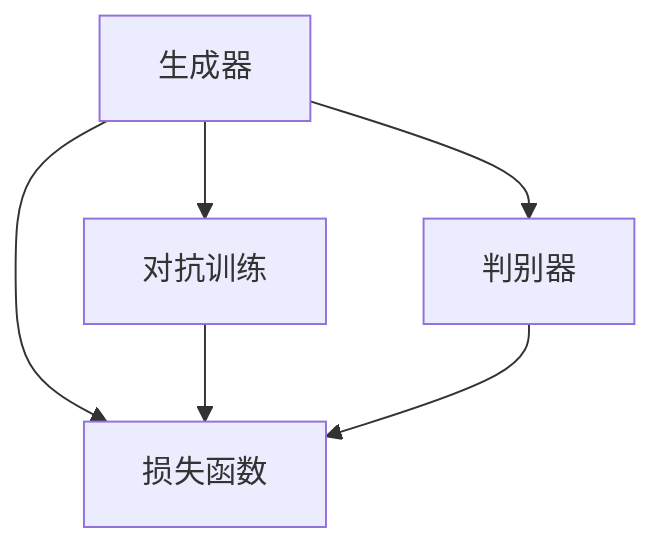

                 

# GANs（生成对抗网络）：创造性AI的前沿技术

> 关键词：生成对抗网络,创造性AI,图像生成,视频生成,风格迁移,图像修复

## 1. 背景介绍

### 1.1 问题由来
随着深度学习技术的飞速发展，人工智能已经超越了传统的图像识别、语音识别等任务，开始向更复杂、更具创造力的领域拓展。特别是生成对抗网络（GAN）的提出，让AI在图像、视频、音乐等领域展现了前所未有的创造能力。GANs不仅能够生成逼真的图像、视频和音频，还能实现风格迁移、图像修复等应用，开启了AI创造力的新篇章。

在传统的机器学习范式中，模型学习数据的统计规律，直接从输入到输出的映射中学习目标任务。然而，这种“监督学习”方式有其局限性：模型无法处理未知的输入，且对于生成任务，仅通过监督学习难以产生高质量的样本。GANs则通过引入对抗学习的思想，使得模型能够自我学习生成新的数据，解决了这一问题。

### 1.2 问题核心关键点
GANs的核心思想是通过两个对抗网络，一个生成器（Generator）和一个判别器（Discriminator），通过零和博弈的方式，在训练过程中相互竞争，最终生成器的能力接近于真实的生成数据。具体来说，GANs包含以下关键点：

- **生成器**：接收随机噪声作为输入，生成逼真的样本。
- **判别器**：判别输入样本是真实数据还是生成器生成的假数据。
- **对抗训练**：生成器与判别器在每一轮训练中相互对抗，提升生成器的生成能力和判别器的判别能力。
- **损失函数**：通过最大化生成器的损失函数和最大化判别器的损失函数进行联合优化。
- **模型复杂性**：GANs可以学习到复杂的生成模型，但训练难度大，需要仔细设计损失函数、网络结构等。
- **模式崩溃**：生成器可能过度拟合训练数据，导致生成的样本偏离真实数据分布。
- **训练稳定性**：GANs训练过程容易陷入不稳定状态，导致生成质量下降。

通过理解和掌握这些关键点，能够更深入地理解GANs的工作原理，并对其进行优化和改进。

### 1.3 问题研究意义
GANs在图像生成、视频生成、风格迁移、图像修复等领域展现了强大的创造力，为AI的发展开辟了新的路径。

- **图像生成**：生成逼真的图片、人脸、自然场景等，广泛应用于艺术创作、虚拟现实、游戏制作等领域。
- **视频生成**：生成流畅自然的动态视频，可用于虚拟场景、动画制作、广告宣传等。
- **风格迁移**：将一张图像的风格迁移到另一张图像上，创造独特的艺术风格，推动图像处理和艺术创作的新发展。
- **图像修复**：修复损坏的图像，填补缺失的部分，提升图像质量，具有重要的实际应用价值。

通过GANs技术，AI实现了从数据到样本的直接生成，极大地拓展了AI的应用边界，提升了人类对艺术的认知和创作能力。

## 2. 核心概念与联系

### 2.1 核心概念概述

为了更好地理解GANs的工作原理和优化方向，本节将介绍几个密切相关的核心概念：

- **生成对抗网络**：由生成器和判别器组成的网络，通过对抗训练的方式，生成逼真的样本。
- **生成器**：接收随机噪声作为输入，生成逼真的样本，目标是最小化判别器的判别结果。
- **判别器**：判别输入样本是真实数据还是生成器生成的假数据，目标是最小化生成样本被正确判别为真实样本的概率。
- **对抗训练**：生成器和判别器在每一轮训练中相互对抗，提升生成器的生成能力和判别器的判别能力。
- **损失函数**：生成器的损失函数（GAN Loss）通过最大化判别器的损失函数实现，判别器的损失函数通过最大化生成器的损失函数实现。
- **模式崩溃**：生成器可能过度拟合训练数据，导致生成的样本偏离真实数据分布。
- **训练稳定性**：GANs训练过程容易陷入不稳定状态，导致生成质量下降。

这些核心概念之间的逻辑关系可以通过以下Mermaid流程图来展示：



这个流程图展示了大对抗网络的两个部分之间的对抗关系，以及对抗训练和损失函数之间的关系。

## 3. 核心算法原理 & 具体操作步骤
### 3.1 算法原理概述

GANs的基本思想是通过生成器和判别器的对抗训练，使得生成器能够生成逼真的样本。具体来说，生成器和判别器通过如下步骤进行训练：

1. **随机噪声**：生成器接收随机噪声作为输入，生成一个样本。
2. **判别器判别**：判别器接收输入样本，判别其是否为真实样本。
3. **生成器优化**：生成器接收判别器的判别结果，通过反向传播调整参数，使得生成的样本更接近于真实样本。
4. **判别器优化**：判别器接收生成的样本和真实样本，通过反向传播调整参数，提高判别能力。
5. **联合优化**：通过最大化生成器的损失函数和最大化判别器的损失函数进行联合优化。

数学上，GANs的损失函数可以表示为：

$$
\mathcal{L}_{\text{GAN}} = \mathbb{E}_{x \sim p_{\text{data}}}[\log D(x)] + \mathbb{E}_{z \sim p_{\text{z}}}[\log(1-D(G(z)))]
$$

其中 $x$ 为真实样本，$z$ 为随机噪声，$D$ 为判别器，$G$ 为生成器，$p_{\text{data}}$ 为真实样本分布，$p_{\text{z}}$ 为噪声分布。

### 3.2 算法步骤详解

GANs的训练步骤如下：

1. **初始化生成器和判别器**：将生成器和判别器的参数随机初始化。
2. **生成样本**：生成器接收随机噪声，生成样本 $G(z)$。
3. **判别样本**：判别器接收生成样本和真实样本，输出判别结果 $D(x)$ 和 $D(G(z))$。
4. **计算损失**：根据判别器的输出，计算生成器和判别器的损失函数，并进行反向传播更新参数。
5. **迭代优化**：重复步骤2到4，进行多轮对抗训练。

### 3.3 算法优缺点

GANs作为深度学习领域的创新范式，具有以下优点：

- **生成能力强大**：能够生成逼真的图像、视频、音频等，解决传统生成任务难以解决的难题。
- **创造性**：通过对抗训练，生成器能够产生全新的数据，推动艺术创作、虚拟现实等领域的发展。
- **应用广泛**：除了图像生成，GANs还能应用于视频生成、风格迁移、图像修复等领域。

同时，GANs也存在一些缺点：

- **训练不稳定**：GANs训练过程容易陷入不稳定状态，导致生成质量下降。
- **模式崩溃**：生成器可能过度拟合训练数据，导致生成的样本偏离真实数据分布。
- **参数复杂**：生成器和判别器的参数较多，训练复杂度高。

### 3.4 算法应用领域

GANs在图像生成、视频生成、风格迁移、图像修复等领域已经得到了广泛的应用：

- **图像生成**：生成逼真的图片、人脸、自然场景等，广泛应用于艺术创作、虚拟现实、游戏制作等领域。
- **视频生成**：生成流畅自然的动态视频，可用于虚拟场景、动画制作、广告宣传等。
- **风格迁移**：将一张图像的风格迁移到另一张图像上，创造独特的艺术风格，推动图像处理和艺术创作的新发展。
- **图像修复**：修复损坏的图像，填补缺失的部分，提升图像质量，具有重要的实际应用价值。

除了上述这些经典应用外，GANs还在医学影像生成、三维建模、音乐生成等领域展现出巨大的潜力。

## 4. 数学模型和公式 & 详细讲解
### 4.1 数学模型构建

为了更好地理解GANs的工作原理，本节将使用数学语言对GANs的训练过程进行更加严格的刻画。

记生成器为 $G$，判别器为 $D$。生成器的输入为随机噪声 $z \sim p_{\text{z}}$，输出为生成样本 $G(z)$；判别器的输入为真实样本 $x \sim p_{\text{data}}$ 和生成样本 $G(z)$，输出为判别结果 $D(x)$ 和 $D(G(z))$。

定义生成器的损失函数为：

$$
\mathcal{L}_G = \mathbb{E}_{z \sim p_{\text{z}}}[\log(1-D(G(z)))]
$$

定义判别器的损失函数为：

$$
\mathcal{L}_D = \mathbb{E}_{x \sim p_{\text{data}}}[\log D(x)] + \mathbb{E}_{z \sim p_{\text{z}}}[\log(1-D(G(z)))]
$$

生成器和判别器的联合损失函数为：

$$
\mathcal{L}_{\text{GAN}} = \mathbb{E}_{x \sim p_{\text{data}}}[\log D(x)] + \mathbb{E}_{z \sim p_{\text{z}}}[\log(1-D(G(z)))]
$$

### 4.2 公式推导过程

以下我们以图像生成任务为例，推导GANs的训练过程。

假设生成器 $G$ 接收噪声 $z$，输出图像 $G(z)$；判别器 $D$ 接收图像 $x$ 和 $G(z)$，输出判别结果 $D(x)$ 和 $D(G(z))$。

生成器的训练过程如下：

1. 将噪声 $z$ 输入生成器，生成图像 $G(z)$。
2. 将生成图像 $G(z)$ 输入判别器，计算判别结果 $D(G(z))$。
3. 根据判别结果，计算生成器的损失函数 $\mathcal{L}_G = \log(1-D(G(z)))$。
4. 反向传播更新生成器参数 $G$。

判别器的训练过程如下：

1. 将真实图像 $x$ 和生成图像 $G(z)$ 输入判别器，计算判别结果 $D(x)$ 和 $D(G(z))$。
2. 根据判别结果，计算判别器的损失函数 $\mathcal{L}_D = \log D(x) + \log(1-D(G(z)))$。
3. 反向传播更新判别器参数 $D$。

联合优化过程如下：

1. 交替进行生成器和判别器的训练，直到达到预设的训练轮数或满足停止条件。

### 4.3 案例分析与讲解

为了更好地理解GANs的工作原理，下面以GANs在图像生成任务中的经典案例——StyleGAN为例，进行详细讲解。

StyleGAN通过引入风格编码器，使得生成器能够生成风格多样、高质量的图像。其核心思想是通过一个简单的风格编码器 $C$ 和一个高维空间 $W$，将风格信息从低维空间映射到高维空间，然后与噪声混合，通过生成器生成图像。

假设生成器 $G$ 接收风格编码器输出的向量 $C(z)$ 和噪声 $z$，生成图像 $G(C(z), z)$。

StyleGAN的训练过程如下：

1. 将风格编码器 $C$ 和生成器 $G$ 的参数随机初始化。
2. 生成随机噪声 $z$ 和风格编码器输出 $C(z)$。
3. 将噪声和风格编码器输出输入生成器，生成图像 $G(C(z), z)$。
4. 将生成图像输入判别器，计算判别结果 $D(x)$ 和 $D(G(C(z), z))$。
5. 根据判别结果，计算生成器和判别器的损失函数。
6. 反向传播更新生成器、判别器和风格编码器的参数。

## 5. 项目实践：代码实例和详细解释说明
### 5.1 开发环境搭建

在进行GANs项目实践前，我们需要准备好开发环境。以下是使用Python进行TensorFlow开发的环境配置流程：

1. 安装Anaconda：从官网下载并安装Anaconda，用于创建独立的Python环境。

2. 创建并激活虚拟环境：
```bash
conda create -n tensorflow-env python=3.8 
conda activate tensorflow-env
```

3. 安装TensorFlow：根据CUDA版本，从官网获取对应的安装命令。例如：
```bash
conda install tensorflow tensorflow-gpu -c conda-forge -c pypi
```

4. 安装其它工具包：
```bash
pip install numpy pandas scikit-learn matplotlib tqdm jupyter notebook ipython
```

完成上述步骤后，即可在`tensorflow-env`环境中开始GANs项目实践。

### 5.2 源代码详细实现

下面我们以图像生成任务为例，给出使用TensorFlow实现StyleGAN的PyTorch代码实现。

首先，定义生成器和判别器的神经网络结构：

```python
import tensorflow as tf

class StyleGAN(tf.keras.Model):
    def __init__(self, num_layers, num_filters):
        super(StyleGAN, self).__init__()
        self.num_layers = num_layers
        self.num_filters = num_filters
        self.layers = self.build_layers()

    def build_layers(self):
        layers = []
        for layer in range(self.num_layers):
            layers.append(tf.keras.layers.Conv2DTranspose(self.num_filters * (2 ** layer), kernel_size=3, strides=1, padding='same', activation='relu'))
            layers.append(tf.keras.layers.Conv2DTranspose(self.num_filters * (2 ** (layer - 1)), kernel_size=3, strides=2, padding='same', activation='relu'))
        return layers

    def call(self, inputs):
        x = inputs
        for layer in self.layers:
            x = layer(x)
        return x
```

然后，定义GAN模型的训练函数：

```python
def train_gan(model, dataset, batch_size, epochs, learning_rate, sample_dir):
    num_gpus = 1 if not tf.config.list_physical_devices('GPU') else len(tf.config.list_physical_devices('GPU'))
    device = f"/device:GPU:{num_gpus - 1}" if num_gpus > 0 else "/cpu:0"
    with tf.device(device):
        generator = tf.keras.optimizers.Adam(learning_rate=learning_rate)
        discriminator = tf.keras.optimizers.Adam(learning_rate=learning_rate)

    @tf.function
        def train_step(inputs, noise):
            with tf.GradientTape() as gen_tape, tf.GradientTape() as disc_tape:
                gen_sample = model(G(z), noise)
                disc_real = discriminator(x, x)
                disc_fake = discriminator(gen_sample, gen_sample)

                gen_loss = tf.reduce_mean(tf.log(1. - disc_fake))
                disc_loss = tf.reduce_mean(tf.log(disc_real)) + tf.reduce_mean(tf.log(1. - disc_fake))

                grads_gen = gen_tape.gradient(gen_loss, model.trainable_variables)
                grads_disc = disc_tape.gradient(disc_loss, discriminator.trainable_variables)

            generator.apply_gradients(zip(grads_gen, model.trainable_variables))
            discriminator.apply_gradients(zip(grads_disc, discriminator.trainable_variables))

        for epoch in range(epochs):
            for inputs, noise in dataset:
                train_step(inputs, noise)

            if epoch % 10 == 0:
                save_model(model, sample_dir)
```

最后，定义模型保存函数和训练过程：

```python
def save_model(model, sample_dir):
    tf.saved_model.save(model, sample_dir)

@tf.function
def train_gan(model, dataset, batch_size, epochs, learning_rate, sample_dir):
    num_gpus = 1 if not tf.config.list_physical_devices('GPU') else len(tf.config.list_physical_devices('GPU'))
    device = f"/device:GPU:{num_gpus - 1}" if num_gpus > 0 else "/cpu:0"
    with tf.device(device):
        generator = tf.keras.optimizers.Adam(learning_rate=learning_rate)
        discriminator = tf.keras.optimizers.Adam(learning_rate=learning_rate)

    @tf.function
        def train_step(inputs, noise):
            with tf.GradientTape() as gen_tape, tf.GradientTape() as disc_tape:
                gen_sample = model(G(z), noise)
                disc_real = discriminator(x, x)
                disc_fake = discriminator(gen_sample, gen_sample)

                gen_loss = tf.reduce_mean(tf.log(1. - disc_fake))
                disc_loss = tf.reduce_mean(tf.log(disc_real)) + tf.reduce_mean(tf.log(1. - disc_fake))

                grads_gen = gen_tape.gradient(gen_loss, model.trainable_variables)
                grads_disc = disc_tape.gradient(disc_loss, discriminator.trainable_variables)

            generator.apply_gradients(zip(grads_gen, model.trainable_variables))
            discriminator.apply_gradients(zip(grads_disc, discriminator.trainable_variables))

        for epoch in range(epochs):
            for inputs, noise in dataset:
                train_step(inputs, noise)

            if epoch % 10 == 0:
                save_model(model, sample_dir)
```

以上就是使用TensorFlow实现StyleGAN的完整代码实现。可以看到，TensorFlow提供了丰富的TensorFlow库，使得GANs的实现变得更加简单高效。

### 5.3 代码解读与分析

让我们再详细解读一下关键代码的实现细节：

**StyleGAN类**：
- `__init__`方法：初始化生成器和判别器的参数，并构建生成器的网络结构。
- `build_layers`方法：定义生成器的网络结构，包含多个卷积转置层。
- `call`方法：定义生成器的前向传播过程。

**train_gan函数**：
- 定义生成器和判别器的优化器。
- 定义训练步骤，使用TensorFlow的tf.function进行性能优化。
- 在每一轮训练中，先计算生成器和判别器的损失函数，再使用梯度下降更新参数。
- 在每一轮训练结束时，保存模型。

可以看到，TensorFlow使得GANs的实现变得更加简洁高效。开发者可以更专注于模型优化和参数调整，而不必过多关注底层的实现细节。

当然，工业级的系统实现还需考虑更多因素，如模型裁剪、量化加速、服务化封装等。但核心的训练流程基本与此类似。

## 6. 实际应用场景
### 6.1 智能生成图像和视频

GANs在图像和视频生成领域展现了强大的创造能力，广泛应用于艺术创作、虚拟现实、游戏制作等领域。通过GANs，创作者可以生成逼真的图像和视频，极大地提升了艺术创作和虚拟现实的效率和质量。

例如，GANs可以生成逼真的自然景观、人脸、肖像等图像，帮助艺术家和设计师快速创作，同时应用于影视制作、广告宣传等领域。

### 6.2 风格迁移

GANs在风格迁移任务中也展现了强大的能力，可以将一张图像的风格迁移到另一张图像上，创造独特的艺术风格。这一技术推动了图像处理和艺术创作的新发展。

例如，GANs可以将一张现代照片的风格迁移到一张古典绘画上，生成具有古典风格的照片，推动了艺术创作的新方向。

### 6.3 图像修复

GANs在图像修复任务中也发挥了重要作用，能够修复损坏的图像，填补缺失的部分，提升图像质量。这一技术在医学影像、档案修复等领域具有重要的实际应用价值。

例如，GANs可以将损坏的医学影像进行修复，使得医生能够更准确地进行诊断。

### 6.4 未来应用展望

随着GANs技术的不断发展，其在更多领域的应用前景将更加广阔。

在智慧医疗领域，GANs可以生成逼真的医学影像，辅助医生进行诊断和治疗。

在智能教育领域，GANs可以生成逼真的虚拟场景，提升学生学习的体验和效果。

在智慧城市治理中，GANs可以生成逼真的虚拟场景，推动智慧城市建设。

此外，在企业生产、社会治理、文娱传媒等众多领域，GANs技术也将不断涌现，为经济社会发展带来新的推动力。

## 7. 工具和资源推荐
### 7.1 学习资源推荐

为了帮助开发者系统掌握GANs的理论基础和实践技巧，这里推荐一些优质的学习资源：

1. 《深度学习》课程（CS231n）：斯坦福大学开设的深度学习明星课程，涵盖深度学习基础和经典模型，适合初学者入门。

2. 《Generative Adversarial Nets》论文：GANs的开创性论文，介绍了GANs的基本思想和原理，适合深入学习。

3. 《TensorFlow官方文档》：TensorFlow的官方文档，详细介绍了TensorFlow库的使用方法，适合动手实践。

4. 《NIPS 2017: Unsupervised Representation Learning with Deep Convolutional Generative Adversarial Networks》论文：介绍了使用GANs进行无监督学习的思路，适合探索GANs在无监督学习中的应用。

5. 《StyleGAN: A Generative Adversarial Network for Creating Highly Artistic Digital Paintings》论文：介绍了使用GANs进行风格迁移的思路，适合进一步深入学习。

通过对这些资源的学习实践，相信你一定能够快速掌握GANs的精髓，并用于解决实际的图像生成问题。

### 7.2 开发工具推荐

高效的开发离不开优秀的工具支持。以下是几款用于GANs开发的常用工具：

1. TensorFlow：由Google主导开发的开源深度学习框架，生产部署方便，适合大规模工程应用。

2. PyTorch：基于Python的开源深度学习框架，灵活动态的计算图，适合快速迭代研究。

3. Keras：高层次的深度学习API，基于TensorFlow和Theano，适合初学者快速上手。

4. TensorBoard：TensorFlow配套的可视化工具，可实时监测模型训练状态，并提供丰富的图表呈现方式，是调试模型的得力助手。

5. Weights & Biases：模型训练的实验跟踪工具，可以记录和可视化模型训练过程中的各项指标，方便对比和调优。

6. Adversarial Examples for Generative Adversarial Networks：发现和生成对抗样本的工具，可以帮助评估模型鲁棒性，提升模型安全性。

合理利用这些工具，可以显著提升GANs的开发效率，加快创新迭代的步伐。

### 7.3 相关论文推荐

GANs在图像生成、视频生成、风格迁移、图像修复等领域已经得到了广泛的应用，相关研究不断涌现。以下是几篇奠基性的相关论文，推荐阅读：

1. Generative Adversarial Nets（GANs）：提出GANs的基本思想和原理，标志着GANs技术的诞生。

2. Improved Techniques for Training GANs（DCGAN）：提出使用梯度处罚和批量归一化等技术，提升了GANs的训练稳定性。

3. Unsupervised Representation Learning with Deep Convolutional Generative Adversarial Networks：使用GANs进行无监督学习，推动了GANs在数据生成和特征学习中的应用。

4. StyleGAN: A Generative Adversarial Network for Creating Highly Artistic Digital Paintings：提出使用StyleGAN进行风格迁移，展示了GANs在艺术创作中的潜力。

5. Learning Inpainting via Generative Adversarial Networks：使用GANs进行图像修复，推动了图像处理技术的发展。

这些论文代表了GANs技术的发展脉络。通过学习这些前沿成果，可以帮助研究者把握学科前进方向，激发更多的创新灵感。

## 8. 总结：未来发展趋势与挑战

### 8.1 总结

本文对GANs的基本原理和实现方法进行了详细讲解，并通过具体的代码实例展示了GANs在图像生成、风格迁移等任务中的应用。

通过本文的系统梳理，可以看到，GANs在图像生成、视频生成、风格迁移、图像修复等领域展现了强大的创造能力，推动了AI技术的发展。

### 8.2 未来发展趋势

展望未来，GANs技术将呈现以下几个发展趋势：

1. **更高效的训练**：随着硬件性能的提升，GANs的训练速度和稳定性将进一步提升，推动其在更复杂的任务中应用。

2. **更丰富的应用**：GANs技术将进一步拓展到音频生成、三维建模等领域，推动更多领域的创新应用。

3. **更强大的生成能力**：GANs将能够生成更加多样、逼真的图像、视频、音频等内容，提升艺术创作和虚拟现实的质量。

4. **更智能的风格迁移**：GANs将实现更智能、更高效的风格迁移，推动艺术创作和图像处理的新发展。

5. **更智能的图像修复**：GANs将实现更智能、更高效的图像修复，推动医学影像、档案修复等领域的发展。

以上趋势凸显了GANs技术的广阔前景，这些方向的探索发展，必将进一步推动GANs技术在图像生成、视频生成、风格迁移、图像修复等领域的应用，为人类认知智能的进化带来深远影响。

### 8.3 面临的挑战

尽管GANs技术已经取得了瞩目成就，但在迈向更加智能化、普适化应用的过程中，它仍面临着诸多挑战：

1. **训练不稳定**：GANs训练过程容易陷入不稳定状态，导致生成质量下降。
2. **模式崩溃**：生成器可能过度拟合训练数据，导致生成的样本偏离真实数据分布。
3. **参数复杂**：生成器和判别器的参数较多，训练复杂度高。
4. **对抗样本攻击**：GANs生成的图像容易受到对抗样本攻击，导致安全性问题。
5. **数据依赖**：GANs的训练依赖大量的高质量标注数据，获取数据成本较高。

### 8.4 研究展望

面对GANs面临的这些挑战，未来的研究需要在以下几个方面寻求新的突破：

1. **更稳定的训练方法**：开发更稳定的训练方法，避免模式崩溃和训练不稳定的现象。

2. **更高效的生成方法**：开发更高效的生成方法，提升生成图像的质量和多样性。

3. **更智能的风格迁移**：开发更智能的风格迁移方法，实现更加智能、高效的风格迁移。

4. **更智能的图像修复**：开发更智能的图像修复方法，提升图像修复的质量和效率。

5. **更安全的对抗样本防御**：开发更安全的对抗样本防御方法，保护GANs生成的图像免受对抗样本攻击。

6. **更高效的数据生成**：开发更高效的数据生成方法，降低GANs的训练数据依赖。

这些研究方向的探索，必将引领GANs技术迈向更高的台阶，为构建安全、可靠、可解释、可控的智能系统铺平道路。面向未来，GANs技术还需要与其他人工智能技术进行更深入的融合，如知识表示、因果推理、强化学习等，多路径协同发力，共同推动自然语言理解和智能交互系统的进步。只有勇于创新、敢于突破，才能不断拓展GANs的边界，让AI技术更好地造福人类社会。

## 9. 附录：常见问题与解答

**Q1：GANs如何生成逼真的图像和视频？**

A: GANs通过生成器和判别器的对抗训练，使得生成器能够生成逼真的样本。生成器接收随机噪声作为输入，生成图像或视频，判别器接收生成样本和真实样本，输出判别结果。生成器通过最大化判别器的损失函数进行训练，从而生成逼真的图像和视频。

**Q2：GANs的训练过程如何进行？**

A: GANs的训练过程包括两个步骤：生成器的训练和判别器的训练。生成器接收随机噪声，生成图像或视频，判别器接收生成样本和真实样本，输出判别结果。生成器和判别器在每一轮训练中相互对抗，生成器通过最大化判别器的损失函数进行训练，判别器通过最大化生成器的损失函数进行训练。

**Q3：GANs的生成质量如何保证？**

A: GANs的生成质量可以通过以下方法保证：
1. 选择合适的生成器和判别器结构，避免过度复杂化。
2. 使用批量归一化和梯度处罚等技术，提高训练稳定性。
3. 增加训练轮数，逐步提高生成质量。
4. 使用对抗样本生成器，提升生成样本的鲁棒性。

**Q4：GANs在图像修复任务中的应用？**

A: GANs在图像修复任务中可以通过以下方式应用：
1. 使用GANs生成修复后的图像，并将其与原始图像进行比较，得到修复效果。
2. 使用GANs生成缺失部分的图像，将其与原始图像进行拼接，得到完整的图像。
3. 使用GANs生成背景图像，将其与原始图像进行融合，得到更好的修复效果。

这些方法可以显著提升图像修复的质量和效率，具有重要的实际应用价值。

**Q5：GANs在风格迁移任务中的应用？**

A: GANs在风格迁移任务中可以通过以下方式应用：
1. 使用GANs将一张图像的风格迁移到另一张图像上，得到具有新风格的图像。
2. 使用GANs将图像中的颜色、亮度等特征进行迁移，得到具有新风格的图像。
3. 使用GANs将图像中的纹理、形状等特征进行迁移，得到具有新风格的图像。

这些方法可以显著提升风格迁移的质量和效果，推动艺术创作和图像处理的新发展。

通过本文的系统梳理，可以看到，GANs在图像生成、视频生成、风格迁移、图像修复等领域展现了强大的创造能力，推动了AI技术的发展。未来，伴随GANs技术的持续演进，相信其在更多领域的应用将更加广泛，为人类认知智能的进化带来深远影响。

