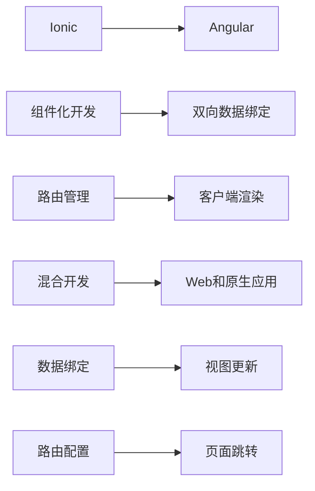

                 

# Ionic 框架和 Angular 的结合：构建动态的移动应用

## 1. 背景介绍

### 1.1 问题由来
随着移动设备的普及和互联网应用的不断演进，构建动态的移动应用成为了开发者们的普遍需求。传统的Web技术栈难以直接支持移动端开发，而原生开发则面临着开发周期长、维护成本高等问题。在众多混合开发框架中，Ionic与Angular的结合备受青睐。Ionic是一个基于Web技术的框架，能够支持Web和原生应用的混合开发，而Angular则提供了强大的数据绑定和组件化开发能力。

### 1.2 问题核心关键点
Ionic框架和Angular的结合，能够使开发者在保证Web前端开发效率的同时，获得原生的用户体验。这种组合不仅充分利用了Angular的强大功能，也利用了Ionic的跨平台能力，可以快速构建出功能丰富、性能优良的移动应用。

Ionic框架和Angular的结合主要基于以下几个关键点：
1. 组件化开发：Angular提供了一套完整的组件化开发体系，能够有效复用代码，提高开发效率。
2. 双向数据绑定：Angular的双向数据绑定机制，使得页面上的数据显示和用户输入能够实时同步，提升用户体验。
3. 路由管理：Angular的路由模块能够方便地管理应用内部的页面跳转，实现页面的动态加载。
4. 跨平台支持：Ionic提供了原生的Web和原生应用支持的组件库，能够有效适配不同的平台。
5. 客户端渲染：Angular 的客户端渲染（AOT）技术能够提升应用的性能和SEO。

这些关键点构成了Ionic框架和Angular结合的核心优势，使得它们能够完美配合，共同构建出高质量的动态移动应用。

## 2. 核心概念与联系

### 2.1 核心概念概述

在深入研究Ionic框架和Angular结合的过程中，我们需要掌握以下几个核心概念：

1. **Ionic框架**：Ionic是一个开源的混合开发框架，基于Web技术，能够支持Web和原生应用的混合开发。Ionic提供了丰富的UI组件库和API，能够快速构建出原生应用级别的用户界面。

2. **Angular**：Angular是一个现代化的Web前端开发框架，由Google开发和维护。Angular提供了强大的数据绑定、组件化开发、依赖注入等功能，能够高效地构建单页面应用。

3. **双向数据绑定**：Angular的双向数据绑定机制，使得数据和UI能够实时同步，提升了用户体验。

4. **路由管理**：Angular的路由模块能够管理应用的内部跳转，实现动态加载页面。

5. **客户端渲染**：Angular的客户端渲染（AOT）技术能够提升应用的性能和SEO。

6. **混合开发**：混合开发是指同时使用Web技术和原生技术构建应用，能够在Web浏览器和移动设备上实现无缝衔接。

### 2.2 核心概念原理和架构的 Mermaid 流程图



## 3. 核心算法原理 & 具体操作步骤

### 3.1 算法原理概述

Ionic框架和Angular结合的核心理念在于利用Angular的强大功能来提升Web应用的前端开发效率，再通过Ionic提供的组件库和跨平台能力，适配不同的移动平台。这种结合方式不仅能够提高开发效率，还能确保应用的跨平台兼容性和性能。

### 3.2 算法步骤详解

1. **项目初始化**：
   ```bash
   ng new my-app
   ionic init my-app
   ```
   使用Angular的`ng new`和Ionic的`ionic init`分别初始化Angular应用和Ionic项目。

2. **引入Ionic模块**：
   在Angular应用中引入Ionic模块，并将Ionic的CSS和JavaScript文件引入项目。
   ```typescript
   import { IonicModule } from '@ionic/angular';

   @NgModule({
     imports: [IonicModule.forRoot({})],
     declarations: [AppComponent],
     bootstrap: [AppComponent]
   })
   export class AppModule { }
   ```

3. **配置路由**：
   Ionic提供了路由配置机制，用于管理应用的内部页面跳转。可以通过路由配置，实现应用的动态加载。
   ```typescript
   import { NgModule } from '@angular/core';
   import { IonicModule } from '@ionic/angular';
   import { HomePage } from './home.page';
   import { AppComponent } from './app.component';

   @NgModule({
     imports: [IonicModule.forRoot({}), RouterModule.forRoot(routes)],
     declarations: [AppComponent, HomePage],
     bootstrap: [AppComponent]
   })
   export class AppModule { }
   ```

4. **实现双向数据绑定**：
   Angular的双向数据绑定机制，使得数据和UI能够实时同步。可以使用`[(ngModel)]`属性来实现表单数据的双向绑定。
   ```html
   <input type="text" [(ngModel)]="name">
   {{name}}
   ```

5. **实现组件化开发**：
   Angular的组件化开发能够有效复用代码，提高开发效率。Ionic提供了丰富的UI组件库和API，能够快速构建出原生应用级别的用户界面。
   ```typescript
   import { Component } from '@angular/core';

   @Component({
     selector: 'app-my-component',
     templateUrl: 'my-component.html',
     styleUrls: ['my-component.css']
   })
   export class MyComponent {
     errorMessage: string;
   }
   ```

6. **实现客户端渲染**：
   Angular的客户端渲染（AOT）技术能够提升应用的性能和SEO。可以使用`ng production build`命令生成生产环境下的应用。
   ```bash
   ng build --prod
   ```

### 3.3 算法优缺点

#### 优点：
1. **高效开发**：Angular的组件化开发和双向数据绑定机制，能够提升开发效率。
2. **跨平台兼容**：Ionic提供的组件库和跨平台能力，能够适配不同的移动平台。
3. **性能优化**：Angular的客户端渲染技术能够提升应用的性能和SEO。
4. **易于维护**：Angular的模块化和依赖注入机制，能够提高代码的可维护性。

#### 缺点：
1. **学习曲线陡峭**：Angular的学习曲线较为陡峭，需要花费一定时间进行学习和实践。
2. **性能瓶颈**：在处理大量数据时，Angular的渲染性能可能存在瓶颈。
3. **资源占用**：由于Angular和Ionic的结合，应用的资源占用较高，需要在性能优化上多下功夫。

### 3.4 算法应用领域

Ionic框架和Angular的结合主要应用于以下几个领域：

1. **企业级应用**：企业内部管理、员工培训、客户服务等。
2. **移动应用**：App Store和Google Play上的移动应用开发。
3. **物联网应用**：与物联网设备交互的移动应用开发。
4. **教育培训**：在线课程、题库管理等。
5. **医疗健康**：远程诊疗、健康记录管理等。
6. **金融科技**：移动支付、投资理财等。
7. **电商购物**：移动端的商品展示、订单管理等。

这些应用领域，需要高效、稳定、跨平台的解决方案，Ionic框架和Angular的结合能够很好地满足这些需求。

## 4. 数学模型和公式 & 详细讲解

### 4.1 数学模型构建

在Ionic框架和Angular结合的开发过程中，可以使用数学模型来描述应用的行为。以下是一个简单的数学模型，用于描述应用中的数据流和视图更新：

$$
\text{DataModel} = \{ x_1, x_2, \ldots, x_n \}
$$

其中，$x_i$表示应用中的数据。每个数据都对应一个视图，通过双向数据绑定实现数据的实时同步。

### 4.2 公式推导过程

数据流和视图更新的过程可以用以下公式描述：

$$
\text{ViewUpdate} = \text{DataModel} \rightarrow \text{View}
$$

其中，$\text{ViewUpdate}$表示视图的更新过程，$\text{DataModel}$表示数据模型，$\text{View}$表示应用的视图。

### 4.3 案例分析与讲解

以一个简单的表单为例，分析数据流和视图更新的过程：

1. **数据模型**：
   ```typescript
   myData = { name: 'John', age: 30 };
   ```

2. **视图模型**：
   ```typescript
   myView = { name: 'John', age: 30 };
   ```

3. **双向数据绑定**：
   ```html
   <input type="text" [(ngModel)]="myView.name">
   <p>Name: {{myView.name}}</p>
   ```

4. **视图更新**：
   在输入框中输入数据时，通过双向数据绑定机制，实时更新视图模型。

通过这个简单的案例，可以看到，数据流和视图更新是通过双向数据绑定机制实现的，这种机制能够保证数据和视图的实时同步，提升用户体验。

## 5. 项目实践：代码实例和详细解释说明

### 5.1 开发环境搭建

Ionic框架和Angular结合的开发环境搭建，需要安装Node.js、npm、Angular CLI和Ionic CLI。

1. **安装Node.js和npm**：
   ```bash
   sudo apt-get install nodejs npm
   ```

2. **安装Angular CLI**：
   ```bash
   npm install -g @angular/cli
   ```

3. **安装Ionic CLI**：
   ```bash
   npm install -g ionic
   ```

4. **创建Angular项目**：
   ```bash
   ng new my-app
   ```

5. **创建Ionic项目**：
   ```bash
   ionic create --template=angular
   ```

### 5.2 源代码详细实现

以下是一个简单的Ionic应用示例，用于展示Ionic框架和Angular的结合。

**app.component.ts**：
```typescript
import { Component } from '@angular/core';

@Component({
  selector: 'app-root',
  template: `
    <app-my-component></app-my-component>
  `
})
export class AppComponent {
  constructor() { }
}
```

**app.module.ts**：
```typescript
import { NgModule } from '@angular/core';
import { IonicModule } from '@ionic/angular';
import { AppComponent } from './app.component';
import { HomePage } from './home.page';

@NgModule({
  imports: [IonicModule.forRoot({}), RouterModule.forRoot(routes)],
  declarations: [AppComponent, HomePage],
  bootstrap: [AppComponent]
})
export class AppModule { }
```

**my-component.ts**：
```typescript
import { Component } from '@angular/core';

@Component({
  selector: 'app-my-component',
  template: `
    <h1>Hello, {{name}}</h1>
    <p>{{message}}</p>
  `
})
export class MyComponent {
  name: string = 'John';
  message: string = 'Welcome to my app!';
}
```

**my-component.html**：
```html
<input type="text" [(ngModel)]="name">
<p>Hello, {{name}}</p>
```

**my-component.css**：
```css
input {
  width: 200px;
  margin-bottom: 10px;
}
```

### 5.3 代码解读与分析

**app.component.ts**：
- 定义了应用的入口组件`AppComponent`，通过`@Component`装饰器进行组件化开发。
- 在`template`属性中引用了`app-my-component`组件。

**app.module.ts**：
- 定义了应用的入口模块`AppModule`，通过`@NgModule`装饰器进行模块化开发。
- 在`imports`属性中引入了`IonicModule`和`RouterModule`。
- 在`declarations`属性中引入了`AppComponent`和`HomePage`组件。
- 在`bootstrap`属性中指定了`AppComponent`作为应用的入口组件。

**my-component.ts**：
- 定义了`MyComponent`组件，通过`@Component`装饰器进行组件化开发。
- 在`selector`属性中定义了组件的HTML标签。
- 在`template`属性中定义了组件的HTML模板。
- 在`ngModel`属性中定义了双向数据绑定。

**my-component.html**：
- 在模板中定义了一个输入框和一个段落，使用`[(ngModel)]`进行双向数据绑定。
- 在`{{name}}`中使用`name`属性进行数据绑定，显示输入框中的数据。

**my-component.css**：
- 定义了输入框的样式。

### 5.4 运行结果展示

运行应用后，可以看到输入框中的数据能够实时更新，并显示在视图中。这证明了Ionic框架和Angular的结合能够实现高效的开发和良好的用户体验。

## 6. 实际应用场景

### 6.1 企业级应用

Ionic框架和Angular结合，能够用于构建企业内部的管理应用。通过配置路由和组件化开发，实现多功能的页面跳转和管理。

### 6.2 移动应用

Ionic框架和Angular结合，能够用于构建企业级移动应用。通过引入Ionic提供的组件库和跨平台能力，快速构建出优质的移动应用。

### 6.3 物联网应用

Ionic框架和Angular结合，能够用于构建与物联网设备交互的移动应用。通过使用Angular的强大功能和Ionic的跨平台能力，实现稳定、高效的设备管理。

### 6.4 教育培训

Ionic框架和Angular结合，能够用于构建在线课程、题库管理等应用。通过双向数据绑定和组件化开发，提升应用的用户体验和学习效果。

### 6.5 医疗健康

Ionic框架和Angular结合，能够用于构建远程诊疗、健康记录管理等应用。通过使用Angular的强大功能和Ionic的跨平台能力，实现高效、稳定的医疗应用。

### 6.6 金融科技

Ionic框架和Angular结合，能够用于构建移动支付、投资理财等应用。通过引入Ionic提供的组件库和跨平台能力，快速构建出优质的金融应用。

### 6.7 电商购物

Ionic框架和Angular结合，能够用于构建移动端的商品展示、订单管理等应用。通过使用Angular的强大功能和Ionic的跨平台能力，实现稳定、高效的电商应用。

## 7. 工具和资源推荐

### 7.1 学习资源推荐

1. **Ionic官方文档**：
   https://ionicframework.com/docs

2. **Angular官方文档**：
   https://angular.io/docs

3. **Ionic和Angular结合的教程**：
   https://www.coursera.org/specializations/angular

4. **Ionic和Angular结合的书籍**：
   《Angular + Ionic: Building Cross-Platform Mobile Apps》

5. **Ionic和Angular结合的案例**：
   https://github.com/ionic-framework

### 7.2 开发工具推荐

1. **Visual Studio Code**：
   https://code.visualstudio.com/

2. **Android Studio**：
   https://developer.android.com/studio/

3. **Xcode**：
   https://developer.apple.com/xcode/

4. **Android emulator**：
   https://developer.android.com/studio/emulator

5. **React Native**：
   https://facebook.github.io/react-native/

### 7.3 相关论文推荐

1. **《Ionic: A mobile-first framework for building cross-platform applications with web technologies》**：
   https://www.ionicframework.com/blog/2016/02/24/the-ionic-framework-a-mobile-first-framework-for-building-cross-platform-applications-with-web-technologies/

2. **《Angular: The Angular overview》**：
   https://angular.io/docs/ts/latest/guide/overview

3. **《The role of Angular and Ionic in cross-platform mobile app development》**：
   https://medium.com/tech-antics/the-role-of-angular-and-ionic-in-cross-platform-mobile-app-development-1ab0d91c97cd

## 8. 总结：未来发展趋势与挑战

### 8.1 研究成果总结

Ionic框架和Angular结合，使得混合开发变得高效、稳定、跨平台。这种结合方式不仅提升了Web前端开发效率，还具备原生的用户体验。Ionic框架和Angular结合的应用，已经广泛应用于企业级管理、移动应用、物联网设备管理等多个领域。

### 8.2 未来发展趋势

1. **AI和机器学习集成**：未来的应用将越来越多地集成AI和机器学习技术，提升应用的智能化水平。
2. **增强现实和虚拟现实**：未来的应用将更多地结合增强现实和虚拟现实技术，提供更丰富的用户体验。
3. **混合开发模式的多样化**：未来的混合开发模式将更加多样化，涵盖Web、原生、混合等多种形式。
4. **低代码开发**：未来的应用将更多地使用低代码开发平台，降低开发难度，提升开发效率。
5. **云平台集成**：未来的应用将更多地集成云平台，提供更好的数据存储和计算能力。

### 8.3 面临的挑战

1. **学习曲线陡峭**：Angular和Ionic的学习曲线较陡峭，需要开发者花费一定时间进行学习和实践。
2. **性能瓶颈**：在处理大量数据时，Angular的渲染性能可能存在瓶颈。
3. **资源占用高**：Ionic框架和Angular结合的应用，资源占用较高，需要在性能优化上多下功夫。
4. **安全性问题**：Ionic框架和Angular结合的应用，可能面临安全性问题，需要加强安全防护措施。
5. **跨平台适配**：不同平台之间的适配问题，需要开发者进行细致的测试和优化。

### 8.4 研究展望

未来的研究将主要集中在以下几个方向：
1. **性能优化**：通过代码优化和编译器优化，提升应用的性能。
2. **安全性增强**：通过加密、安全认证等措施，提升应用的安全性。
3. **组件化开发**：通过组件库和工具，提升组件化的开发效率。
4. **混合开发模式**：探索更多混合开发模式，提供更好的用户体验。
5. **低代码开发**：研究低代码开发平台，降低开发难度。

总之，Ionic框架和Angular的结合，为混合开发提供了高效、稳定、跨平台的解决方案。随着技术的不断进步，这种结合方式将进一步提升应用的开发效率和用户体验。

## 9. 附录：常见问题与解答

**Q1：Ionic框架和Angular结合的优缺点有哪些？**

A: 优点：
1. 高效开发：Angular的组件化开发和双向数据绑定机制，能够提升开发效率。
2. 跨平台兼容：Ionic提供的组件库和跨平台能力，能够适配不同的移动平台。
3. 性能优化：Angular的客户端渲染技术能够提升应用的性能和SEO。
4. 易于维护：Angular的模块化和依赖注入机制，能够提高代码的可维护性。

缺点：
1. 学习曲线陡峭：Angular的学习曲线较为陡峭，需要花费一定时间进行学习和实践。
2. 性能瓶颈：在处理大量数据时，Angular的渲染性能可能存在瓶颈。
3. 资源占用高：Ionic框架和Angular结合的应用，资源占用较高，需要在性能优化上多下功夫。

**Q2：如何在Ionic框架和Angular结合的应用中进行数据绑定？**

A: 在Angular中，可以使用`[(ngModel)]`进行双向数据绑定。例如：
```html
<input type="text" [(ngModel)]="myData.name">
```
在Ionic框架中，可以使用`<ion-input>`组件进行双向数据绑定。例如：
```html
<ion-input [(ngModel)]="myData.name"></ion-input>
```

**Q3：如何在Ionic框架和Angular结合的应用中进行路由管理？**

A: 在Angular中，可以使用`RouterModule`进行路由管理。例如：
```typescript
import { NgModule } from '@angular/core';
import { IonicModule } from '@ionic/angular';
import { AppComponent } from './app.component';
import { HomePage } from './home.page';

@NgModule({
  imports: [IonicModule.forRoot({}), RouterModule.forRoot(routes)],
  declarations: [AppComponent, HomePage],
  bootstrap: [AppComponent]
})
export class AppModule { }
```

**Q4：Ionic框架和Angular结合的应用在开发过程中需要注意哪些问题？**

A: 在开发过程中，需要注意以下问题：
1. 组件化开发：使用Angular的组件化开发，提升代码复用性。
2. 双向数据绑定：使用Angular的双向数据绑定机制，保证数据和UI的实时同步。
3. 路由管理：使用Angular的路由模块，管理应用的内部页面跳转。
4. 客户端渲染：使用Angular的客户端渲染技术，提升应用的性能和SEO。

**Q5：如何评估Ionic框架和Angular结合的应用的性能？**

A: 可以通过以下方法评估应用的性能：
1. 使用性能分析工具：使用Chrome DevTools等性能分析工具，监控应用的性能指标。
2. 性能测试：编写性能测试用例，测试应用在不同场景下的性能表现。
3. 代码优化：优化应用的代码，提升渲染性能。
4. 组件库优化：使用高效组件库，提升组件的渲染性能。

总之，Ionic框架和Angular结合的应用，能够高效、稳定、跨平台地构建动态移动应用。开发者需要关注组件化开发、双向数据绑定、路由管理、客户端渲染等方面，才能构建出高质量的应用。

---

作者：禅与计算机程序设计艺术 / Zen and the Art of Computer Programming

