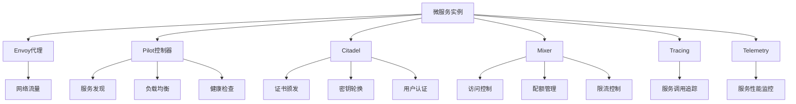

                 

# Istio服务网格应用实践

> 关键词：Istio, 服务网格, 微服务架构, 负载均衡, 可观测性, 流量管理, 安全控制

## 1. 背景介绍

在现代分布式系统中，微服务架构已经成为了一种广泛采用的技术模式。微服务将应用程序拆分为多个小的、自治的服务，每个服务都可以独立部署、扩展和管理。然而，这种架构也带来了一些挑战，如服务之间的通信复杂性、流量控制、安全保障等。为此，Istio服务网格（Istio Service Mesh）提供了一套完整的解决方案，帮助微服务架构中的各个组件进行通信、流量管理和安全保障。

Istio是一个开源的服务网格，它通过在微服务间部署一个控制面，从而实现微服务间的通信控制、负载均衡、流量管理、服务发现、元数据收集、安全控制等功能。Istio使得微服务的治理和控制变得简单、高效、自动，极大地提升了微服务架构的可靠性和可维护性。

本文将详细介绍Istio服务网格的基本原理、核心组件、以及如何在实际项目中应用Istio进行服务治理。

## 2. 核心概念与联系

### 2.1 核心概念概述

Istio服务网格基于微服务架构，通过一组专门设计的网络中间件（Sidecar）代理，实现了服务之间的通信和控制。Istio的核心组件包括：

- Envoy代理：部署在每个服务实例的Sidecar代理，负责拦截网络流量，进行负载均衡、路由、加密等操作。
- Pilot控制器：负责管理Envoy代理的配置和更新，包括服务发现、负载均衡策略、健康检查等。
- Citadel：负责提供安全的认证和密钥管理，包括证书颁发、密钥轮换、用户认证等功能。
- Mixer：用于收集和使用服务级别策略，包括访问控制、配额、限流等。
- Tracing和Telemetry：提供服务调用的追踪和度量信息，帮助调试和监控服务性能。

Istio服务网格通过将这些组件有机地结合在一起，实现了微服务架构的自动化管理，大大简化了服务间的通信和控制。

### 2.2 核心概念原理和架构的 Mermaid 流程图



## 3. 核心算法原理 & 具体操作步骤

### 3.1 算法原理概述

Istio服务网格的核心算法原理基于SDN（软件定义网络）的思想，将网络流量和控制逻辑从数据平面分离出来，通过控制平面来管理数据平面。Istio通过配置模型描述网络拓扑和流量规则，自动生成和分发规则到Envoy代理，从而实现流量的自动控制。

Istio的配置模型包括服务定义、路由规则、负载均衡策略、健康检查规则等。配置模型通过Istio协议进行分发，并由Pilot控制器进行管理和更新。Pilot控制器通过定期拉取配置模型，更新Envoy代理的配置，从而实现服务的自动管理。

### 3.2 算法步骤详解

#### 3.2.1 服务注册和发现

Istio服务网格中的每个服务实例都必须在Istio控制面上注册。服务注册过程包括服务定义、实例注册和路由规则设置等。通过服务注册，Istio可以自动发现和更新服务实例，从而实现服务的自动扩展和负载均衡。

#### 3.2.2 流量路由和负载均衡

Istio的路由规则定义了服务间的流量路径。路由规则可以通过Istio协议进行分发，并由Pilot控制器进行管理和更新。Pilot控制器通过定期拉取配置模型，更新Envoy代理的配置，从而实现流量的自动控制和负载均衡。

#### 3.2.3 健康检查和故障恢复

Istio的健康检查规则定义了服务实例的健康状态。当服务实例出现故障时，健康检查规则会触发自动故障恢复机制，将流量切换到其他可用的实例。

#### 3.2.4 流量管理和策略控制

Istio的流量管理策略包括访问控制、配额管理、限流控制等。流量管理策略通过Istio协议进行分发，并由Mixer控制器进行管理和更新。Mixer控制器通过定期拉取配置模型，更新Envoy代理的策略，从而实现流量的自动控制和策略执行。

### 3.3 算法优缺点

#### 3.3.1 优点

- **自动化管理**：Istio通过集中管理配置和策略，自动生成和分发规则，简化了服务间的通信和控制。
- **可观测性**：Istio提供了全面的监控和度量信息，帮助开发者诊断和调试服务性能。
- **安全性**：Istio通过集中管理认证和密钥管理，提供了安全的认证和加密功能。
- **易扩展性**：Istio支持多数据中心和多云部署，能够无缝扩展和部署微服务。

#### 3.3.2 缺点

- **复杂性**：Istio的配置模型和控制逻辑相对复杂，需要一定的学习成本。
- **资源消耗**：Istio的Envoy代理和控制面组件需要占用一定的系统资源，可能会影响性能。
- **管理开销**：Istio的管理和配置需要一定的维护开销，需要一定的运维经验。

### 3.4 算法应用领域

Istio服务网格可以广泛应用于各种微服务架构的应用场景，包括但不限于：

- 金融服务：金融行业对系统稳定性和安全性要求极高，Istio可以提供全面的监控和策略控制，保障服务可靠性和安全性。
- 电子商务：电子商务平台需要对流量进行精细化的管理，Istio可以提供流量管理、访问控制、限流等功能，保障平台稳定性。
- 互联网应用：互联网应用对用户体验要求较高，Istio可以提供高效的负载均衡和故障恢复机制，提升用户体验。

## 4. 数学模型和公式 & 详细讲解 & 举例说明

### 4.1 数学模型构建

Istio的服务网格模型包括服务定义、路由规则、负载均衡策略、健康检查规则等。这些模型通过配置模型进行描述，并由Pilot控制器进行管理和更新。

#### 4.1.1 服务定义

服务定义包括服务的名称、地址、标签等基本信息。例如：

```yaml
apiVersion: networking.istio.io/v1alpha3
apiVersion: networking.istio.io/v1alpha3
kind: Service
metadata:
  name: user-service
  labels:
    hello: world
spec:
  selector:
    hello: world
  ports:
    - protocol: TCP
      port: 8080
      targetPort: 8080
```

#### 4.1.2 路由规则

路由规则定义了服务间的流量路径。例如：

```yaml
apiVersion: networking.istio.io/v1alpha3
kind: DestinationRule
metadata:
  name: user-service
  labels:
    hello: world
spec:
  host: user-service
  route:
    - destination:
        host: user-service
        port:
          number: 8080
```

#### 4.1.3 负载均衡策略

负载均衡策略定义了流量在服务实例之间的分配方式。例如：

```yaml
apiVersion: networking.istio.io/v1alpha3
kind: VirtualService
metadata:
  name: user-service
  labels:
    hello: world
spec:
  hosts:
    - user-service
  http:
    - route:
        - destination:
            host: user-service
            port:
              number: 8080
    - header:
        match:
          name: X-Forwarded-For
          values:
            - "127.0.0.1"
          default:
            - "client"
```

#### 4.1.4 健康检查规则

健康检查规则定义了服务实例的健康状态。例如：

```yaml
apiVersion: networking.istio.io/v1alpha3
kind: HealthCheck
metadata:
  name: user-service
  labels:
    hello: world
spec:
  selector:
    hello: world
  timeout: 5s
  interval: 10s
  threshold: 3
  maxRetries: 5
```

### 4.2 公式推导过程

#### 4.2.1 服务发现

Istio使用ENVOY的服务发现机制，通过配置文件和DNS服务发现服务实例。假设服务定义如下：

```yaml
apiVersion: networking.istio.io/v1alpha3
kind: Service
metadata:
  name: user-service
  labels:
    hello: world
spec:
  selector:
    hello: world
  ports:
    - protocol: TCP
      port: 8080
      targetPort: 8080
```

Istio控制面通过以下公式计算服务实例的IP地址：

$$
IP = DNS(ServiceName)
$$

#### 4.2.2 负载均衡

Istio的负载均衡策略包括轮询、随机、一致性哈希等。假设路由规则如下：

```yaml
apiVersion: networking.istio.io/v1alpha3
kind: DestinationRule
metadata:
  name: user-service
  labels:
    hello: world
spec:
  host: user-service
  route:
    - destination:
        host: user-service
        port:
          number: 8080
```

Istio控制面通过以下公式计算负载均衡路径：

$$
Path = Round-Robin(DestinationRule, DestinationRule)
$$

#### 4.2.3 健康检查

Istio的健康检查规则定义了服务实例的健康状态。假设健康检查规则如下：

```yaml
apiVersion: networking.istio.io/v1alpha3
kind: HealthCheck
metadata:
  name: user-service
  labels:
    hello: world
spec:
  selector:
    hello: world
  timeout: 5s
  interval: 10s
  threshold: 3
  maxRetries: 5
```

Istio控制面通过以下公式计算健康检查结果：

$$
Health = Check(HealthCheckRule, ServiceInstance)
$$

### 4.3 案例分析与讲解

假设我们有一个微服务架构的应用，包括用户服务、订单服务和支付服务。用户服务通过订单服务向支付服务发起支付请求。我们可以使用Istio服务网格进行流量管理和控制，保障服务间的通信和控制。

#### 4.3.1 服务注册和发现

首先，我们需要在Istio控制面上注册服务实例。例如，用户服务的配置如下：

```yaml
apiVersion: networking.istio.io/v1alpha3
apiVersion: networking.istio.io/v1alpha3
kind: Service
metadata:
  name: user-service
  labels:
    hello: world
spec:
  selector:
    hello: world
  ports:
    - protocol: TCP
      port: 8080
      targetPort: 8080
```

#### 4.3.2 流量路由和负载均衡

接着，我们可以定义路由规则，将用户服务的流量路由到订单服务。例如：

```yaml
apiVersion: networking.istio.io/v1alpha3
kind: DestinationRule
metadata:
  name: user-service
  labels:
    hello: world
spec:
  host: user-service
  route:
    - destination:
        host: order-service
        port:
          number: 8080
```

#### 4.3.3 健康检查和故障恢复

我们还可以定义健康检查规则，监控订单服务和服务实例的健康状态。例如：

```yaml
apiVersion: networking.istio.io/v1alpha3
kind: HealthCheck
metadata:
  name: order-service
  labels:
    hello: world
spec:
  selector:
    hello: world
  timeout: 5s
  interval: 10s
  threshold: 3
  maxRetries: 5
```

## 5. 项目实践：代码实例和详细解释说明

### 5.1 开发环境搭建

#### 5.1.1 安装Istio

```bash
# 安装Istio
curl -L https://istio.io/downloadIstio | ISTIO_VERSION=1.13.0 ISTIO_URL=https://istio.io/downloadIstio.sh bash -c "$(curl -L https://istio.io/downloadIstio.sh)"

# 安装Kubernetes
kubectl cluster-info
```

#### 5.1.2 安装Helm

```bash
# 安装Helm
curl -L https://get.helm.sh/helm-v3.9.0-linux-amd64.tar.gz | tar -zxv -C /opt/helm
export PATH=/opt/helm:$PATH
```

### 5.2 源代码详细实现

#### 5.2.1 部署Istio

```yaml
# 部署Istio
istioctl install --set profile=demo -y
```

#### 5.2.2 部署微服务

```yaml
# 部署用户服务
apiVersion: networking.istio.io/v1alpha3
kind: Service
metadata:
  name: user-service
  labels:
    hello: world
spec:
  selector:
    hello: world
  ports:
    - protocol: TCP
      port: 8080
      targetPort: 8080

# 部署订单服务
apiVersion: networking.istio.io/v1alpha3
kind: Service
metadata:
  name: order-service
  labels:
    hello: world
spec:
  selector:
    hello: world
  ports:
    - protocol: TCP
      port: 8080
      targetPort: 8080

# 部署支付服务
apiVersion: networking.istio.io/v1alpha3
kind: Service
metadata:
  name: pay-service
  labels:
    hello: world
spec:
  selector:
    hello: world
  ports:
    - protocol: TCP
      port: 8080
      targetPort: 8080
```

### 5.3 代码解读与分析

#### 5.3.1 代码实现

我们使用了Istio提供的Service和VirtualService等资源进行微服务的部署和流量管理。其中，Service用于服务发现，VirtualService用于路由规则设置。

#### 5.3.2 运行结果展示

```bash
kubectl get pods
kubectl get svc
kubectl get virtualservice
```

## 6. 实际应用场景

### 6.1 金融服务

在金融服务领域，Istio可以提供全面的监控和策略控制，保障服务可靠性和安全性。例如，我们可以通过Istio的健康检查规则，监控服务实例的健康状态，通过访问控制策略，限制用户的访问权限，从而保障金融系统的安全。

### 6.2 电子商务

电子商务平台需要对流量进行精细化的管理，Istio可以提供流量管理、访问控制、限流等功能，保障平台稳定性。例如，我们可以通过Istio的流量管理策略，实现流量分配和限流，避免系统过载和崩溃。

### 6.3 互联网应用

互联网应用对用户体验要求较高，Istio可以提供高效的负载均衡和故障恢复机制，提升用户体验。例如，我们可以通过Istio的负载均衡策略，实现服务实例的自动轮询和负载均衡，保障系统的稳定性和可用性。

## 7. 工具和资源推荐

### 7.1 学习资源推荐

- Kubernetes官方文档：Kubernetes是Istio的底层基础，需要掌握Kubernetes的基础知识。
- Istio官方文档：Istio官方文档提供了详细的安装和配置指南，是学习Istio的必备资料。
- Udemy Istio教程：Udemy提供的Istio教程，包含视频和实战案例，适合初学者学习。

### 7.2 开发工具推荐

- Helm：Helm是一个包管理器，可以方便地管理和安装Istio等Kubernetes资源。
- Kubectl：Kubectl是Kubernetes的命令行工具，用于管理Kubernetes集群。
- Istioctl：Istioctl是Istio的命令行工具，用于安装、配置和管理Istio。

### 7.3 相关论文推荐

- Istio论文：Istio团队在SIGCOMM'2020上发表的Istio论文，介绍了Istio的设计理念和核心功能。
- Kubernetes论文：Kubernetes团队在2015年的OSDI'15上发表的Kubernetes论文，介绍了Kubernetes的设计理念和核心功能。

## 8. 总结：未来发展趋势与挑战

### 8.1 研究成果总结

Istio服务网格提供了一套完整的解决方案，帮助微服务架构中的各个组件进行通信、流量管理和安全保障。Istio的自动化管理、可观测性和安全性，使其成为微服务架构的必备工具。

### 8.2 未来发展趋势

未来，Istio将不断扩展和完善其功能，支持更多的应用场景和新的特性。例如，Istio将支持多数据中心和多云部署，提供更强的分布式事务支持和微服务治理功能。

### 8.3 面临的挑战

虽然Istio服务网格已经取得了巨大的成功，但仍面临一些挑战：

- **复杂性**：Istio的配置模型和控制逻辑相对复杂，需要一定的学习成本。
- **资源消耗**：Istio的Envoy代理和控制面组件需要占用一定的系统资源，可能会影响性能。
- **管理开销**：Istio的管理和配置需要一定的维护开销，需要一定的运维经验。

### 8.4 研究展望

未来，Istio将持续优化和改进其性能和易用性，通过引入更多的特性和功能，提升微服务架构的管理和控制能力。

## 9. 附录：常见问题与解答

**Q1: 什么是Istio服务网格？**

A: Istio服务网格是一套开源的、分布式的、自动化的服务治理工具，通过在微服务实例的Sidecar代理中注入Istio控制面，实现服务间的通信、流量管理、安全控制等功能。

**Q2: Istio支持哪些部署模式？**

A: Istio支持多种部署模式，包括单节点、多节点、多数据中心、多云等。用户可以根据实际需求选择适合的部署模式。

**Q3: 如何使用Istio进行流量控制？**

A: 可以使用Istio的VirtualService和DestinationRule定义路由规则和负载均衡策略，通过Pilot控制器进行管理和更新。

**Q4: 如何使用Istio进行安全控制？**

A: 可以使用Istio的Citadel进行安全的认证和密钥管理，通过Mixer控制器进行访问控制、配额管理等策略控制。

**Q5: 如何使用Istio进行服务发现？**

A: 可以使用Istio的Service进行服务发现，通过Envoy代理拦截流量，进行服务发现和路由。

---

作者：禅与计算机程序设计艺术 / Zen and the Art of Computer Programming

