                 

# Java 在 Web 开发中的应用：Spring 和 Servlet

> 关键词：Java, Web开发, Spring, Servlet, MVC框架, RESTful API, 安全性, 性能优化, 组件化开发

## 1. 背景介绍

### 1.1 问题由来

随着互联网技术的快速发展，Web开发已经成为软件开发中的一个重要方向。Web开发不仅包括前端页面的设计与实现，还涉及到后端逻辑的处理。在后端开发中，Java 语言凭借其强大的性能和丰富的开发工具，一直占据着重要地位。

在Java Web开发中，Servlet和Spring框架是两个重要的技术。Servlet是一种轻量级的Web组件，用于处理HTTP请求和响应。而Spring框架则是一个广泛使用的开源框架，它提供了丰富的功能，包括依赖注入、AOP、事务管理等。

本文将详细探讨Java Web开发中Servlet和Spring框架的应用，并通过具体的代码示例，展示如何利用这些技术进行Web开发。

### 1.2 问题核心关键点

Servlet和Spring框架的结合，使得Java Web开发变得更加高效和灵活。Servlet负责处理HTTP请求，并将请求转发到不同的处理组件进行处理。而Spring框架则提供了强大的功能支持，包括依赖注入、AOP、事务管理等。Servlet和Spring框架的结合，可以更好地实现组件化开发，提升开发效率和应用性能。

本文将从Servlet的基本原理、Spring框架的核心组件、Spring MVC框架和RESTful API等方面，系统介绍Java Web开发中Servlet和Spring框架的应用。

### 1.3 问题研究意义

Servlet和Spring框架的结合，极大地提升了Java Web开发的效率和灵活性。通过合理使用这些技术，开发者可以构建高效、可扩展的Web应用。

本文旨在帮助Java Web开发者更好地理解Servlet和Spring框架的应用，并掌握如何利用这些技术构建高性能、易维护的Web应用。

## 2. 核心概念与联系

### 2.1 核心概念概述

为了更好地理解Servlet和Spring框架的应用，本节将介绍几个关键概念：

- **Servlet**：一种轻量级的Web组件，用于处理HTTP请求和响应。
- **Spring框架**：一个广泛使用的开源框架，提供依赖注入、AOP、事务管理等功能。
- **Spring MVC**：Spring框架的一个子框架，提供MVC框架的支持，用于处理Web请求和响应。
- **RESTful API**：一种基于HTTP协议的Web服务架构风格，支持高效的数据交互和应用扩展。

这些核心概念之间的联系可以通过以下Mermaid流程图来展示：

```mermaid
graph TB
    A[Servlet] --> B[Spring Framework]
    B --> C[Spring MVC]
    B --> D[RESTful API]
```



这个流程图展示了几者之间的关系：

1. Servlet负责处理HTTP请求和响应。
2. Spring框架提供了依赖注入、AOP、事务管理等核心功能。
3. Spring MVC是Spring框架的一个子框架，提供MVC框架的支持。
4. RESTful API是一种Web服务架构风格，支持高效的数据交互和应用扩展。

这些概念共同构成了Java Web开发的核心框架，使得开发者可以高效、灵活地构建Web应用。

## 3. 核心算法原理 & 具体操作步骤
### 3.1 算法原理概述

Servlet和Spring框架的应用主要基于MVC（Model-View-Controller）架构模式。MVC架构将应用分为模型、视图和控制器三个部分，每个部分负责不同的功能。

- 模型负责数据的存储和处理。
- 视图负责将模型数据呈现给用户。
- 控制器负责处理用户请求，并将请求转发到相应的模型和视图进行处理。

Spring框架提供了依赖注入、AOP、事务管理等核心功能，使得控制器、模型和视图的开发和维护更加高效和灵活。

### 3.2 算法步骤详解

Servlet和Spring框架的应用主要包括以下几个关键步骤：

**Step 1: 准备开发环境**

- 安装Java Development Kit（JDK），配置好环境变量。
- 安装Servlet容器，如Tomcat或Jetty。
- 安装Spring框架及其依赖库。

**Step 2: 开发Spring应用**

- 创建Spring配置文件，定义Bean和Service等组件。
- 编写Service层代码，处理业务逻辑。
- 编写Controller层代码，处理用户请求。
- 编写视图层代码，呈现数据。

**Step 3: 部署Servlet应用**

- 将Spring应用部署到Servlet容器，启动应用。
- 在Servlet容器中配置Servlet和JSP页面。
- 测试应用，确保功能正常。

### 3.3 算法优缺点

Servlet和Spring框架的应用具有以下优点：

1. 组件化开发：Spring框架提供了依赖注入、AOP、事务管理等功能，使得应用开发更加高效和灵活。
2. 可维护性好：Spring框架的分层架构，使得代码结构清晰，易于维护和扩展。
3. 高效性能：Spring框架提供的缓存机制和异步支持，可以显著提高应用的性能。

然而，Servlet和Spring框架的应用也存在一些缺点：

1. 学习曲线较陡：Spring框架功能强大，但需要一定的学习成本。
2. 配置复杂：Spring框架的配置文件较多，增加了开发和维护的复杂度。
3. 性能优化难度较大：Spring框架提供的缓存机制和异步支持，需要开发者进行合理的配置和优化。

### 3.4 算法应用领域

Servlet和Spring框架的应用领域非常广泛，主要包括以下几个方面：

1. Web应用开发：利用Spring MVC框架，开发Web应用，处理HTTP请求和响应。
2. RESTful API开发：利用Spring MVC框架和RESTful API，构建高效的Web服务。
3. 企业应用开发：利用Spring框架的依赖注入、AOP、事务管理等功能，开发企业级应用。
4. 大数据处理：利用Spring框架的异步支持和大数据处理工具，构建高性能的数据处理应用。

以上应用领域覆盖了Web开发中的大部分场景，为开发者提供了丰富的选择。

## 4. 数学模型和公式 & 详细讲解 & 举例说明

### 4.1 数学模型构建

在Java Web开发中，Servlet和Spring框架的应用主要基于MVC架构模式。下面将详细描述MVC架构的数学模型。

假设应用中存在以下三个组件：

- 模型：负责数据的存储和处理，定义为一个类。
- 视图：负责将模型数据呈现给用户，定义为一个JSP页面或HTML页面。
- 控制器：负责处理用户请求，并将请求转发到相应的模型和视图进行处理，定义为一个Servlet。

模型的数据定义如下：

$$
M = \{m_1, m_2, \dots, m_n\}
$$

其中，$m_i$ 表示第 $i$ 个模型的数据。

视图的呈现定义如下：

$$
V = \{v_1, v_2, \dots, v_n\}
$$

其中，$v_i$ 表示第 $i$ 个视图的呈现内容。

控制器的处理定义如下：

$$
C = \{c_1, c_2, \dots, c_n\}
$$

其中，$c_i$ 表示第 $i$ 个控制器处理请求的方式。

MVC架构的数学模型可以用以下公式表示：

$$
V = C(M)
$$

其中，$V$ 表示视图，$C$ 表示控制器，$M$ 表示模型。

### 4.2 公式推导过程

MVC架构的公式推导过程如下：

1. 用户通过浏览器发送HTTP请求。
2. 请求被转发到控制器进行处理。
3. 控制器根据请求类型，调用相应的服务进行处理。
4. 服务处理完数据后，将结果返回给控制器。
5. 控制器根据服务返回的数据，调用相应的视图呈现给用户。

这个过程可以用以下公式表示：

$$
V = C(\text{Service处理后的结果})
$$

其中，$\text{Service处理后的结果}$ 表示服务处理后的数据。

### 4.3 案例分析与讲解

以下是一个简单的Java Web应用案例，展示如何使用Servlet和Spring框架开发Web应用。

假设我们开发一个简单的Web应用，实现用户登录和注册功能。应用中的主要组件包括：

- 模型：用户信息管理模块，负责存储和处理用户信息。
- 视图：用户登录和注册页面，呈现给用户。
- 控制器：用户登录和注册处理模块，负责处理用户请求。

下面展示具体的代码实现。

### 5. 项目实践：代码实例和详细解释说明

#### 5.1 开发环境搭建

为了构建Java Web应用，需要安装以下工具：

- JDK：用于Java开发的环境。
- Tomcat：Servlet容器，用于部署Java Web应用。
- Spring框架：提供依赖注入、AOP、事务管理等功能。

安装完成后，可以开始构建Java Web应用。

#### 5.2 源代码详细实现

以下是一个简单的Java Web应用示例，展示如何使用Servlet和Spring框架开发Web应用。

**Spring配置文件**

```xml
<beans>
    <bean id="userService" class="com.example.UserService"/>
    <bean id="userDao" class="com.example.UserDao"/>
    <bean id="userController" class="com.example.UserController"/>
</beans>
```

**UserServiceImpl类**

```java
@Service
public class UserServiceImpl implements UserService {
    @Autowired
    private UserDao userDao;

    @Override
    public User getUserById(int id) {
        return userDao.getUserById(id);
    }

    @Override
    public void saveUser(User user) {
        userDao.saveUser(user);
    }
}
```

**UserDao接口**

```java
public interface UserDao {
    User getUserById(int id);
    void saveUser(User user);
}
```

**UserDaoImpl类**

```java
@Repository
public class UserDaoImpl implements UserDao {
    @Override
    public User getUserById(int id) {
        // 实现获取用户信息的功能
    }

    @Override
    public void saveUser(User user) {
        // 实现保存用户信息的功能
    }
}
```

**UserController类**

```java
@Controller
public class UserController {
    @Autowired
    private UserService userService;

    @GetMapping("/login")
    public String login() {
        return "login";
    }

    @GetMapping("/register")
    public String register() {
        return "register";
    }

    @PostMapping("/login")
    public String handleLogin(@RequestParam String username, @RequestParam String password) {
        User user = userService.getUserByUsernameAndPassword(username, password);
        if (user != null) {
            return "redirect:/home";
        } else {
            return "redirect:/login";
        }
    }

    @PostMapping("/register")
    public String handleRegister(@RequestParam String username, @RequestParam String password) {
        User user = new User();
        user.setUsername(username);
        user.setPassword(password);
        userService.saveUser(user);
        return "redirect:/login";
    }
}
```

**User类**

```java
@Entity
public class User {
    @Id
    @GeneratedValue(strategy = GenerationType.IDENTITY)
    private int id;
    private String username;
    private String password;
    // 其他属性省略
}
```

**UserControllerTest类**

```java
@RunWith(SpringRunner.class)
@SpringBootTest
public class UserControllerTest {
    @Autowired
    private UserController userController;

    @Test
    public void testLogin() {
        String result = userController.login();
        assertEquals("login", result);
    }

    @Test
    public void testRegister() {
        String result = userController.register();
        assertEquals("register", result);
    }

    @Test
    public void testHandleLogin() {
        String result = userController.handleLogin("testUser", "testPassword");
        assertEquals("redirect:/home", result);
    }

    @Test
    public void testHandleRegister() {
        String result = userController.handleRegister("testUser", "testPassword");
        assertEquals("redirect:/login", result);
    }
}
```

#### 5.3 代码解读与分析

以下是具体的代码实现和分析：

**Spring配置文件**

定义了UserService、UserDao和UserController三个Bean，分别负责处理业务逻辑、数据存储和请求处理。

**UserServiceImpl类**

实现了UserService接口，提供用户信息的查询和保存功能。

**UserDao接口**

定义了用户信息的查询和保存方法。

**UserDaoImpl类**

实现了UserDao接口，具体实现用户信息的查询和保存功能。

**UserController类**

实现了UserController接口，处理用户登录和注册请求。

**User类**

定义了用户信息的数据模型。

**UserControllerTest类**

编写测试用例，验证用户登录和注册功能的正确性。

### 5.4 运行结果展示

运行Java Web应用，可以访问以下URL：

- 登录页面：http://localhost:8080/login
- 注册页面：http://localhost:8080/register
- 登录处理：http://localhost:8080/login
- 注册处理：http://localhost:8080/register

运行测试用例，可以验证用户登录和注册功能的正确性。

## 6. 实际应用场景

### 6.1 智能客服系统

智能客服系统是一种利用自然语言处理技术，实现自动客服的应用。它可以通过自然语言理解和处理，快速响应用户的查询和需求，提供高效、便捷的客服服务。

智能客服系统通常需要处理大量的用户请求，为了提高系统的响应速度和处理能力，可以采用Servlet和Spring框架构建高效、可扩展的智能客服系统。

### 6.2 电商应用

电商应用是一种利用Web技术，实现在线购物和交易的应用。电商应用通常需要处理大量的用户请求和数据处理，为了提高系统的性能和可维护性，可以采用Servlet和Spring框架构建高性能、可扩展的电商应用。

### 6.3 企业管理系统

企业管理系统是一种利用Web技术，实现企业管理和业务处理的应用。企业管理系统通常需要处理大量的业务数据和操作，为了提高系统的性能和可维护性，可以采用Servlet和Spring框架构建高性能、可扩展的企业管理系统。

## 7. 工具和资源推荐

### 7.1 学习资源推荐

为了帮助Java Web开发者更好地理解Servlet和Spring框架的应用，以下是一些推荐的学习资源：

- Java Web开发教程：介绍Java Web开发的常用技术和工具，包括Servlet、JSP、Spring框架等。
- Spring框架官方文档：Spring框架的官方文档，详细介绍了Spring框架的核心功能和使用方法。
- Spring Boot官方文档：Spring Boot框架的官方文档，介绍如何基于Spring Boot构建Web应用。
- Java Web开发实战：一本Java Web开发实战指南，涵盖Java Web开发的常用技术和工具，包括Servlet、JSP、Spring框架等。

通过学习这些资源，可以系统掌握Servlet和Spring框架的应用，构建高性能、可扩展的Java Web应用。

### 7.2 开发工具推荐

Servlet和Spring框架的应用离不开开发工具的支持。以下是几款常用的开发工具：

- IntelliJ IDEA：一款Java开发工具，支持Servlet和Spring框架的开发和调试。
- Eclipse：一款Java开发工具，支持Servlet和Spring框架的开发和调试。
- VS Code：一款跨平台的开发工具，支持Java开发和调试。

合理使用这些开发工具，可以显著提高Java Web开发的效率和质量。

### 7.3 相关论文推荐

Servlet和Spring框架的应用是Java Web开发中的重要技术，以下是几篇经典的论文，推荐阅读：

- 《Java Servlet》：介绍Java Servlet的原理和使用方法。
- 《Spring in Action》：介绍Spring框架的核心功能和使用方法。
- 《Spring MVC in Action》：介绍Spring MVC框架的核心功能和使用方法。
- 《Spring Boot in Action》：介绍Spring Boot框架的核心功能和使用方法。

这些论文代表了大语言模型微调技术的发展脉络，通过学习这些前沿成果，可以帮助开发者更好地理解Servlet和Spring框架的应用。

## 8. 总结：未来发展趋势与挑战

### 8.1 总结

本文系统介绍了Java Web开发中Servlet和Spring框架的应用。Servlet和Spring框架的结合，使得Java Web开发变得更加高效和灵活。通过合理使用这些技术，开发者可以构建高效、可扩展的Web应用。

通过本文的系统梳理，可以看到，Servlet和Spring框架的应用在Java Web开发中具有重要地位。这些技术不仅提高了Java Web开发的效率，还提升了应用的可维护性和性能。

### 8.2 未来发展趋势

展望未来，Java Web开发将呈现以下几个发展趋势：

1. 组件化开发：Servlet和Spring框架的组件化开发将进一步提升应用的效率和可维护性。
2. 云原生架构：基于云原生架构的应用将更加高效和灵活，支持微服务、容器化等技术。
3. 自动化测试：自动化测试技术的应用将进一步提高应用的稳定性和可靠性。
4. 人工智能应用：Java Web应用将越来越多地结合人工智能技术，实现更高效的数据处理和应用场景。

以上趋势凸显了Java Web开发的广阔前景。这些方向的探索发展，将进一步提升Java Web应用的性能和应用范围，为Java Web开发者提供更多的技术选择。

### 8.3 面临的挑战

尽管Servlet和Spring框架的应用已经取得了显著成果，但在迈向更加智能化、普适化应用的过程中，仍面临一些挑战：

1. 性能优化：Servlet和Spring框架的应用需要合理的配置和优化，才能充分发挥其性能优势。
2. 学习成本：Spring框架的功能丰富，需要一定的学习成本，开发者需要花费更多时间学习和掌握。
3. 安全性：Servlet和Spring框架的应用需要考虑安全性问题，避免安全漏洞和攻击。
4. 性能瓶颈：Servlet和Spring框架的应用可能会面临性能瓶颈，需要合理配置和优化。

### 8.4 研究展望

未来，Servlet和Spring框架的研究还需要从以下几个方面进行探索：

1. 自动化配置：进一步优化Spring框架的自动化配置，减少开发者的手工配置工作。
2. 性能优化：通过合理的配置和优化，进一步提高Servlet和Spring框架的性能。
3. 安全性：研究安全漏洞和攻击的防护方法，保障应用的安全性。
4. 可扩展性：进一步提升Servlet和Spring框架的可扩展性，支持更多功能和应用场景。

这些研究方向的探索，将进一步提升Servlet和Spring框架的应用范围和性能，为Java Web开发带来更多的创新和突破。

## 9. 附录：常见问题与解答

**Q1：Servlet和Spring框架的应用需要安装哪些工具？**

A: 构建Java Web应用，需要安装以下工具：

- JDK：用于Java开发的环境。
- Tomcat：Servlet容器，用于部署Java Web应用。
- Spring框架：提供依赖注入、AOP、事务管理等功能。

安装完成后，可以开始构建Java Web应用。

**Q2：Servlet和Spring框架的应用有哪些优点和缺点？**

A: Servlet和Spring框架的应用具有以下优点：

1. 组件化开发：Spring框架提供了依赖注入、AOP、事务管理等功能，使得应用开发更加高效和灵活。
2. 可维护性好：Spring框架的分层架构，使得代码结构清晰，易于维护和扩展。
3. 高效性能：Spring框架提供的缓存机制和异步支持，可以显著提高应用的性能。

然而，Servlet和Spring框架的应用也存在一些缺点：

1. 学习曲线较陡：Spring框架功能强大，但需要一定的学习成本。
2. 配置复杂：Spring框架的配置文件较多，增加了开发和维护的复杂度。
3. 性能优化难度较大：Spring框架提供的缓存机制和异步支持，需要开发者进行合理的配置和优化。

**Q3：Servlet和Spring框架的应用在哪些领域有广泛应用？**

A: Servlet和Spring框架的应用领域非常广泛，主要包括以下几个方面：

1. Web应用开发：利用Spring MVC框架，开发Web应用，处理HTTP请求和响应。
2. RESTful API开发：利用Spring MVC框架和RESTful API，构建高效的Web服务。
3. 企业应用开发：利用Spring框架的依赖注入、AOP、事务管理等功能，开发企业级应用。
4. 大数据处理：利用Spring框架的异步支持和大数据处理工具，构建高性能的数据处理应用。

以上应用领域覆盖了Web开发中的大部分场景，为开发者提供了丰富的选择。

**Q4：如何使用Servlet和Spring框架构建高性能的Java Web应用？**

A: 为了构建高性能的Java Web应用，可以采用以下方法：

1. 合理配置缓存机制，提高应用的数据访问效率。
2. 使用异步处理技术，提高应用的处理能力。
3. 优化Spring框架的配置文件，减少不必要的资源消耗。
4. 采用高并发处理技术，提高应用的并发处理能力。

通过合理配置和优化，可以构建高效、可扩展的Java Web应用。

**Q5：Servlet和Spring框架的应用面临哪些挑战？**

A: Servlet和Spring框架的应用面临以下挑战：

1. 性能优化：需要合理的配置和优化，才能充分发挥其性能优势。
2. 学习成本：Spring框架的功能丰富，需要一定的学习成本，开发者需要花费更多时间学习和掌握。
3. 安全性：需要考虑安全性问题，避免安全漏洞和攻击。
4. 性能瓶颈：需要合理配置和优化，避免性能瓶颈。

通过合理应对这些挑战，可以进一步提升Servlet和Spring框架的应用范围和性能。

---

作者：禅与计算机程序设计艺术 / Zen and the Art of Computer Programming

