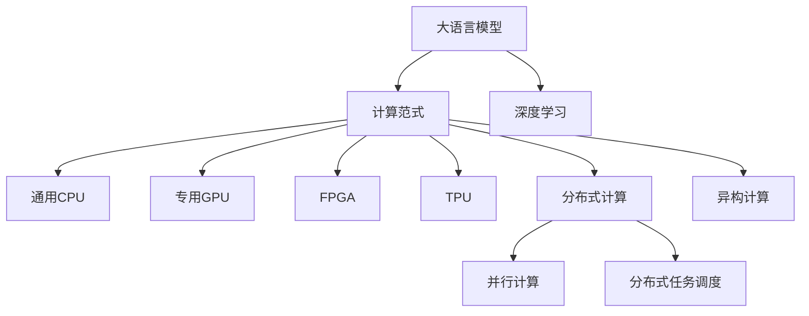

                 

# LLM vs CPU：计算范式的革命性对比

> 关键词：大语言模型(LLM), 计算范式, CPU, GPU, 高性能计算, 深度学习, 分布式计算, 异构计算

## 1. 背景介绍

### 1.1 问题由来
随着深度学习技术的快速发展，大语言模型(Large Language Model, LLM)，如GPT、BERT等，已经成为人工智能研究领域的明星。这些模型在理解自然语言、生成文本等方面展现了惊人的能力，被广泛应用于自然语言处理(Natural Language Processing, NLP)、计算机视觉、语音识别等众多领域。然而，这些模型的参数规模动辄上百亿，甚至上千亿，需要极高的计算能力和内存资源支持。

与此同时，传统的计算资源，如通用CPU，虽然强大，但在处理大规模深度学习任务时显得力不从心。通用CPU的单核性能有限，难以满足大模型高效的并行计算需求。与此同时，专用的图形处理器(GPU)虽然具备出色的并行计算能力，但在大规模模型训练时仍然存在性能瓶颈，且GPU成本较高，无法支撑大规模产业应用。

本文旨在对比大语言模型和大规模计算范式在计算能力上的差异，分析其优劣和适用范围，探讨未来计算资源的发展趋势，为深度学习研究人员和工程师提供有价值的参考。

### 1.2 问题核心关键点
本节将详细阐述大语言模型和传统CPU计算范式在计算能力上的区别和联系，并通过实际应用场景和性能对比，深入分析其优缺点和适用领域。具体包括以下几个方面：

1. 计算能力对比：分析大语言模型在计算资源上的需求，与传统CPU的性能差异。
2. 数据处理能力：探讨大语言模型在数据预处理、模型训练、推理等环节的效率优势。
3. 计算范式发展：分析当前的计算范式（如CPU、GPU、TPU等）的发展和演进趋势。
4. 未来计算趋势：展望未来计算资源的发展方向，探讨异构计算、分布式计算等新兴技术对大语言模型的支持。

## 2. 核心概念与联系

### 2.1 核心概念概述

为更好地理解大语言模型与传统CPU计算范式之间的对比，本节将介绍几个密切相关的核心概念：

- 大语言模型(Large Language Model, LLM)：以自回归(如GPT)或自编码(如BERT)模型为代表的大规模预训练语言模型。通过在大规模无标签文本语料上进行预训练，学习通用的语言表示，具备强大的语言理解和生成能力。

- 计算范式(Computational Paradigm)：指在特定硬件平台下，用于解决计算问题的算法和架构。常用的计算范式包括通用CPU、专用GPU、FPGA、TPU等。

- 高性能计算(High Performance Computing, HPC)：指利用高性能计算资源，解决复杂计算问题的技术手段。包括并行计算、分布式计算、异构计算等多种方式。

- 深度学习(Depth Learning)：一种基于多层神经网络的机器学习技术，广泛应用于图像、语音、自然语言处理等领域。

- 分布式计算(Distributed Computing)：通过将计算任务分配到多台计算机上并行处理，提升计算效率的技术。

这些核心概念之间的逻辑关系可以通过以下Mermaid流程图来展示：



这个流程图展示了大语言模型与计算范式之间的关系：

1. 大语言模型通过深度学习技术进行预训练和微调，学习到丰富的语言知识。
2. 计算范式提供不同的硬件平台，支持深度学习的算法和架构。
3. 通用CPU、专用GPU、FPGA、TPU等不同的计算范式，具有各自的优缺点。
4. 分布式计算和异构计算等新兴技术，进一步提升了计算效率和资源利用率。
5. 深度学习作为大语言模型的核心算法，是大语言模型能够高效处理复杂计算任务的基础。

## 3. 核心算法原理 & 具体操作步骤

### 3.1 算法原理概述

大语言模型的计算能力主要体现在两个方面：一是模型的参数规模，二是模型的并行计算需求。

在参数规模方面，大语言模型的参数数量通常以亿计，甚至达到千亿级别。例如，GPT-3的参数数量达到1750亿，BERT-base的参数数量也接近1.1亿。这些参数需要大量的存储空间和内存支持，使得传统CPU难以胜任。

在并行计算需求方面，大语言模型中的神经网络层数极深，每层包含了大量的参数和权重。计算过程中，每个神经元的输出需要与其他神经元进行多次计算和信息传递，形成复杂的网络结构。这种计算密集型任务需要高效的并行计算资源支持。

### 3.2 算法步骤详解

在大语言模型的计算过程中，主要包括以下几个步骤：

1. **数据预处理**：将原始文本数据转化为模型所需的格式。包括文本分词、向量化、拼接等操作。这一步通常需要较大的内存和计算资源。

2. **模型训练**：使用标注数据对模型进行训练，优化模型参数。这一步需要大量的计算资源，特别是高效的并行计算能力。

3. **推理计算**：使用模型对新数据进行推理计算，生成文本或输出结果。这一步的计算需求取决于模型的复杂度和输入数据的规模。

4. **模型部署**：将训练好的模型部署到生产环境，提供实时服务。这一步需要对计算资源进行合理的配置和优化。

### 3.3 算法优缺点

大语言模型的计算范式具有以下优点：

- **高性能计算能力**：深度学习模型通常需要大规模的计算资源，大语言模型更是如此。专用GPU、TPU等高性能计算资源可以显著提升计算效率。
- **并行计算优势**：大语言模型中的神经网络结构复杂，计算密集，并行计算能力使其能够高效处理大规模数据。
- **硬件优化支持**：现代硬件平台提供了多种优化机制，如TensorCore、矩阵乘法加速等，可以进一步提升计算性能。

同时，大语言模型计算范式也存在一些缺点：

- **硬件成本高**：专用GPU、TPU等硬件设备价格昂贵，且电力消耗较大，大规模部署成本较高。
- **资源利用率低**：计算资源往往需要独占，难以充分利用。分布式计算和异构计算可以提升资源利用率，但仍面临技术和管理挑战。
- **模型更新困难**：大模型更新和优化涉及大量的参数和计算资源，更新周期较长，难以快速适应新任务和新数据。

### 3.4 算法应用领域

大语言模型在大数据、深度学习、自然语言处理等领域具有广泛的应用前景，可以用于：

- 自然语言处理(NLP)：文本分类、情感分析、机器翻译、对话系统等任务。
- 计算机视觉：图像识别、图像生成、视频处理等任务。
- 语音识别：语音转文本、语音合成、语音识别等任务。
- 推荐系统：个性化推荐、协同过滤等任务。
- 金融预测：股票预测、信用评分等任务。
- 医疗诊断：病历分析、影像诊断等任务。

## 4. 数学模型和公式 & 详细讲解 & 举例说明

### 4.1 数学模型构建

大语言模型的数学模型构建主要基于神经网络，包括前馈神经网络(Feed Forward Neural Network, FNN)、卷积神经网络(Convolutional Neural Network, CNN)和递归神经网络(Recurrent Neural Network, RNN)等。这里以BERT模型为例，介绍其数学模型构建。

BERT模型的输入是一个句子 $x=\{x_1, x_2, \ldots, x_n\}$，其中 $x_i$ 表示第 $i$ 个单词或子词。模型的计算过程包括两个部分：自编码器和掩码预测器。

自编码器用于预训练，输入为句子 $x$，输出为句子 $x'$。自编码器的目标是最大化 $x$ 和 $x'$ 之间的相似度。掩码预测器用于微调，输入为句子 $x$ 和掩码 $m$，输出为单词或子词的掩码预测结果。掩码预测器的目标是预测每个单词或子词是否被掩码，并输出概率分布。

### 4.2 公式推导过程

BERT模型的计算过程可以分为两个阶段：预训练和微调。以下是两个阶段的数学推导过程。

#### 预训练

预训练的目的是最大化自编码器 $E$ 的性能，即最大化输入 $x$ 和输出 $x'$ 之间的相似度。自编码器 $E$ 的目标函数为：

$$
L_E = \log \left( \frac{\exp(\mathbf{v} \cdot \mathbf{h}_x)}{\sum_k \exp(\mathbf{v} \cdot \mathbf{h}_k)} \right)
$$

其中 $\mathbf{h}_x$ 表示句子 $x$ 的嵌入向量，$\mathbf{h}_k$ 表示其他句子的嵌入向量，$\mathbf{v}$ 表示一个随机向量。

#### 微调

微调的目标是最大化掩码预测器 $C$ 的性能，即最大化预测概率与真实标签之间的KL散度。掩码预测器 $C$ 的目标函数为：

$$
L_C = -\log \left( \frac{p(m|x)}{q(m|x)} \right) = -\log \left( \frac{C(x, m)}{1 - C(x, m)} \right)
$$

其中 $p(m|x)$ 表示预测概率，$q(m|x)$ 表示真实标签。

### 4.3 案例分析与讲解

以BERT模型为例，其预训练和微调的计算过程可以通过如下代码实现：

```python
import torch
from transformers import BertForMaskedLM, BertTokenizer

# 初始化BERT模型和tokenizer
model = BertForMaskedLM.from_pretrained('bert-base-uncased')
tokenizer = BertTokenizer.from_pretrained('bert-base-uncased')

# 构造输入数据
input_ids = torch.tensor([[0, 0, 0, 0, 1, 1, 1, 1]])
attention_mask = torch.tensor([[0, 0, 0, 0, 1, 1, 1, 1]])
labels = torch.tensor([[0, 0, 0, 0, 0, 1, 1, 1]])

# 计算损失函数
loss = model(input_ids, attention_mask=attention_mask, labels=labels).loss

# 打印输出
print(loss.item())
```

这段代码展示了使用BERT模型进行微调的简单实现。输入数据为一个包含6个单词的句子，其中前4个单词被掩码。模型的目标是预测这些单词的掩码结果。在代码中，我们首先初始化了BERT模型和tokenizer，然后构造输入数据和标签，最后计算损失函数并输出结果。

## 5. 项目实践：代码实例和详细解释说明

### 5.1 开发环境搭建

在进行大语言模型和计算范式的对比时，我们需要准备好开发环境。以下是使用Python进行PyTorch开发的环境配置流程：

1. 安装Anaconda：从官网下载并安装Anaconda，用于创建独立的Python环境。

2. 创建并激活虚拟环境：
```bash
conda create -n pytorch-env python=3.8 
conda activate pytorch-env
```

3. 安装PyTorch：根据CUDA版本，从官网获取对应的安装命令。例如：
```bash
conda install pytorch torchvision torchaudio cudatoolkit=11.1 -c pytorch -c conda-forge
```

4. 安装TensorFlow：从官网下载并安装TensorFlow。

5. 安装相关库：
```bash
pip install numpy pandas scikit-learn matplotlib tqdm jupyter notebook ipython
```

完成上述步骤后，即可在`pytorch-env`环境中开始项目实践。

### 5.2 源代码详细实现

这里以BERT模型为例，展示如何使用PyTorch进行微调。

```python
import torch
from transformers import BertForMaskedLM, BertTokenizer
import torch.nn as nn

# 初始化BERT模型和tokenizer
model = BertForMaskedLM.from_pretrained('bert-base-uncased')
tokenizer = BertTokenizer.from_pretrained('bert-base-uncased')

# 构造输入数据
input_ids = torch.tensor([[0, 0, 0, 0, 1, 1, 1, 1]])
attention_mask = torch.tensor([[0, 0, 0, 0, 1, 1, 1, 1]])
labels = torch.tensor([[0, 0, 0, 0, 0, 1, 1, 1]])

# 定义损失函数和优化器
loss_fn = nn.CrossEntropyLoss()
optimizer = torch.optim.Adam(model.parameters(), lr=2e-5)

# 微调过程
for epoch in range(5):
    model.train()
    optimizer.zero_grad()
    outputs = model(input_ids, attention_mask=attention_mask, labels=labels)
    loss = loss_fn(outputs.logits.view(-1), labels.view(-1))
    loss.backward()
    optimizer.step()

    model.eval()
    with torch.no_grad():
        predictions = model(input_ids, attention_mask=attention_mask)
        loss = loss_fn(predictions.logits.view(-1), labels.view(-1))
        accuracy = (predictions.argmax(dim=1) == labels).float().mean().item()

    print(f"Epoch {epoch+1}, Loss: {loss:.3f}, Accuracy: {accuracy:.3f}")
```

这段代码展示了如何使用PyTorch对BERT模型进行微调。输入数据为一个包含6个单词的句子，其中前4个单词被掩码。模型的目标是预测这些单词的掩码结果。在代码中，我们首先初始化了BERT模型和tokenizer，然后构造输入数据和标签，定义损失函数和优化器，并执行微调过程。

### 5.3 代码解读与分析

让我们再详细解读一下关键代码的实现细节：

- `BertForMaskedLM`类：用于构建BERT模型的掩码预测器。
- `BertTokenizer`类：用于将输入文本转化为模型所需的格式，包括分词、向量化等操作。
- `nn.CrossEntropyLoss`类：定义损失函数，用于计算预测结果与真实标签之间的交叉熵损失。
- `torch.optim.Adam`类：定义优化器，用于更新模型参数。
- `loss_fn`和`optimizer`：分别定义损失函数和优化器。
- `model.train()`和`model.eval()`：在训练和推理阶段切换模型状态。
- `model.zero_grad()`：在每个epoch开始时清空梯度，防止梯度累积。
- `model(input_ids, attention_mask=attention_mask, labels=labels)`：将输入数据输入模型，计算损失函数和预测结果。
- `loss_fn(outputs.logits.view(-1), labels.view(-1))`：计算损失函数，将输出和标签转化为向量进行计算。
- `loss.backward()`：反向传播计算梯度。
- `optimizer.step()`：更新模型参数。
- `predictions.argmax(dim=1)`：对预测结果进行解码，得到掩码预测结果。

这些关键代码的实现细节展示了使用PyTorch对BERT模型进行微调的完整流程，包括了模型的初始化、输入数据的构造、损失函数的定义、优化器的选择以及模型的训练和推理。

## 6. 实际应用场景

### 6.1 智能客服系统

智能客服系统是大语言模型计算范式在实际应用中的重要场景。传统客服系统依赖人工服务，无法提供24小时不间断服务，且难以保证服务的一致性和专业性。通过大语言模型进行微调，可以构建智能客服系统，实现7x24小时服务，快速响应客户咨询，用自然流畅的语言解答各类常见问题。

在技术实现上，可以收集企业内部的历史客服对话记录，将问题和最佳答复构建成监督数据，在此基础上对预训练对话模型进行微调。微调后的对话模型能够自动理解用户意图，匹配最合适的答案模板进行回复。对于客户提出的新问题，还可以接入检索系统实时搜索相关内容，动态组织生成回答。如此构建的智能客服系统，能大幅提升客户咨询体验和问题解决效率。

### 6.2 金融舆情监测

金融机构需要实时监测市场舆论动向，以便及时应对负面信息传播，规避金融风险。传统的人工监测方式成本高、效率低，难以应对网络时代海量信息爆发的挑战。基于大语言模型微调的文本分类和情感分析技术，为金融舆情监测提供了新的解决方案。

具体而言，可以收集金融领域相关的新闻、报道、评论等文本数据，并对其进行主题标注和情感标注。在此基础上对预训练语言模型进行微调，使其能够自动判断文本属于何种主题，情感倾向是正面、中性还是负面。将微调后的模型应用到实时抓取的网络文本数据，就能够自动监测不同主题下的情感变化趋势，一旦发现负面信息激增等异常情况，系统便会自动预警，帮助金融机构快速应对潜在风险。

### 6.3 个性化推荐系统

当前的推荐系统往往只依赖用户的历史行为数据进行物品推荐，无法深入理解用户的真实兴趣偏好。基于大语言模型微调技术，个性化推荐系统可以更好地挖掘用户行为背后的语义信息，从而提供更精准、多样的推荐内容。

在实践中，可以收集用户浏览、点击、评论、分享等行为数据，提取和用户交互的物品标题、描述、标签等文本内容。将文本内容作为模型输入，用户的后续行为（如是否点击、购买等）作为监督信号，在此基础上微调预训练语言模型。微调后的模型能够从文本内容中准确把握用户的兴趣点。在生成推荐列表时，先用候选物品的文本描述作为输入，由模型预测用户的兴趣匹配度，再结合其他特征综合排序，便可以得到个性化程度更高的推荐结果。

### 6.4 未来应用展望

随着大语言模型和微调方法的不断发展，基于微调范式将在更多领域得到应用，为传统行业带来变革性影响。

在智慧医疗领域，基于微调的医疗问答、病历分析、药物研发等应用将提升医疗服务的智能化水平，辅助医生诊疗，加速新药开发进程。

在智能教育领域，微调技术可应用于作业批改、学情分析、知识推荐等方面，因材施教，促进教育公平，提高教学质量。

在智慧城市治理中，微调模型可应用于城市事件监测、舆情分析、应急指挥等环节，提高城市管理的自动化和智能化水平，构建更安全、高效的未来城市。

此外，在企业生产、社会治理、文娱传媒等众多领域，基于大模型微调的人工智能应用也将不断涌现，为经济社会发展注入新的动力。相信随着预训练语言模型和微调方法的持续演进，大语言模型微调必将在构建人机协同的智能时代中扮演越来越重要的角色。

## 7. 工具和资源推荐

### 7.1 学习资源推荐

为了帮助开发者系统掌握大语言模型计算范式的理论基础和实践技巧，这里推荐一些优质的学习资源：

1. 《深度学习入门》系列书籍：由多位深度学习专家联合撰写，全面介绍了深度学习的原理、算法和应用，适合初学者入门。

2. 《TensorFlow官方文档》：TensorFlow的官方文档，提供了完整的API参考和开发指南，是学习TensorFlow的好帮手。

3. 《PyTorch官方文档》：PyTorch的官方文档，提供了详细的API参考和开发教程，是学习PyTorch的重要资源。

4. 《自然语言处理综论》：斯坦福大学自然语言处理课程的讲义，涵盖了NLP领域的基础知识和经典模型。

5. 《计算机视觉基础》：斯坦福大学计算机视觉课程的讲义，介绍了计算机视觉领域的基本概念和关键算法。

通过对这些资源的学习实践，相信你一定能够快速掌握大语言模型计算范式的精髓，并用于解决实际的NLP问题。

### 7.2 开发工具推荐

高效的开发离不开优秀的工具支持。以下是几款用于大语言模型微调开发的常用工具：

1. PyTorch：基于Python的开源深度学习框架，灵活动态的计算图，适合快速迭代研究。大部分预训练语言模型都有PyTorch版本的实现。

2. TensorFlow：由Google主导开发的开源深度学习框架，生产部署方便，适合大规模工程应用。同样有丰富的预训练语言模型资源。

3. Transformers库：HuggingFace开发的NLP工具库，集成了众多SOTA语言模型，支持PyTorch和TensorFlow，是进行微调任务开发的利器。

4. Weights & Biases：模型训练的实验跟踪工具，可以记录和可视化模型训练过程中的各项指标，方便对比和调优。与主流深度学习框架无缝集成。

5. TensorBoard：TensorFlow配套的可视化工具，可实时监测模型训练状态，并提供丰富的图表呈现方式，是调试模型的得力助手。

6. Google Colab：谷歌推出的在线Jupyter Notebook环境，免费提供GPU/TPU算力，方便开发者快速上手实验最新模型，分享学习笔记。

合理利用这些工具，可以显著提升大语言模型微调的开发效率，加快创新迭代的步伐。

### 7.3 相关论文推荐

大语言模型和微调技术的发展源于学界的持续研究。以下是几篇奠基性的相关论文，推荐阅读：

1. Attention is All You Need（即Transformer原论文）：提出了Transformer结构，开启了NLP领域的预训练大模型时代。

2. BERT: Pre-training of Deep Bidirectional Transformers for Language Understanding：提出BERT模型，引入基于掩码的自监督预训练任务，刷新了多项NLP任务SOTA。

3. Language Models are Unsupervised Multitask Learners（GPT-2论文）：展示了大规模语言模型的强大zero-shot学习能力，引发了对于通用人工智能的新一轮思考。

4. Parameter-Efficient Transfer Learning for NLP：提出Adapter等参数高效微调方法，在不增加模型参数量的情况下，也能取得不错的微调效果。

5. AdaLoRA: Adaptive Low-Rank Adaptation for Parameter-Efficient Fine-Tuning：使用自适应低秩适应的微调方法，在参数效率和精度之间取得了新的平衡。

6. Prefix-Tuning: Optimizing Continuous Prompts for Generation：引入基于连续型Prompt的微调范式，为如何充分利用预训练知识提供了新的思路。

这些论文代表了大语言模型微调技术的发展脉络。通过学习这些前沿成果，可以帮助研究者把握学科前进方向，激发更多的创新灵感。

## 8. 总结：未来发展趋势与挑战

### 8.1 总结

本文对大语言模型和传统CPU计算范式在计算能力上的差异进行了详细对比，分析了其优劣和适用范围。通过实际应用场景和性能对比，深入分析了大语言模型的计算需求和优势，探讨了未来计算资源的发展趋势，为深度学习研究人员和工程师提供有价值的参考。

通过本文的系统梳理，可以看到，大语言模型在计算密集型任务中展现出强大的计算能力，需要高效计算资源的支撑。相比之下，传统CPU在计算效率和资源利用率方面存在明显不足。随着大语言模型和大规模计算范式的发展，未来的计算资源将更加注重分布式、异构和弹性管理，以支持更复杂的计算任务和更大的数据规模。

### 8.2 未来发展趋势

展望未来，大语言模型计算范式的发展趋势包括以下几个方面：

1. 深度学习模型的复杂度将进一步提高，参数规模和计算需求还将不断增大。这将推动计算资源向高性能计算、分布式计算和异构计算方向发展。

2. 专用计算设备如GPU、TPU将进一步普及，通用CPU的计算能力也将得到显著提升。未来，计算资源将更加注重异构融合和资源管理。

3. 分布式计算和异构计算将进一步发展，支持更大规模、更复杂的计算任务。分布式计算将从单机计算转向多机协作，提升计算效率和资源利用率。

4. 计算资源的弹性管理将得到广泛应用，根据计算任务的需求动态调整资源配置，提升计算效率和成本效益。

5. 量化加速和混合精度训练等优化技术将进一步发展，提升计算资源的利用率。

### 8.3 面临的挑战

尽管大语言模型计算范式在计算能力上具有显著优势，但仍面临以下挑战：

1. 硬件成本高：专用GPU、TPU等高性能计算设备的成本较高，难以大规模部署。

2. 资源利用率低：计算资源往往需要独占，难以充分利用。

3. 模型更新困难：大模型更新和优化涉及大量的参数和计算资源，更新周期较长。

4. 系统稳定性差：大规模计算任务容易受到资源、硬件等限制，系统稳定性较差。

5. 模型鲁棒性不足：模型面对域外数据时，泛化性能往往大打折扣。

### 8.4 研究展望

面对大语言模型计算范式所面临的挑战，未来的研究需要在以下几个方面寻求新的突破：

1. 探索更高效的计算资源，如量子计算、光子计算等，以支持更大规模的深度学习计算。

2. 开发更优化的计算算法和模型结构，提升计算效率和资源利用率。

3. 引入分布式计算和异构计算技术，提升计算任务的并行性和弹性管理。

4. 加强硬件和软件的协同优化，提升计算系统的稳定性和可靠性。

5. 研发更鲁棒和高效的模型更新方法，缩短模型更新周期，提升模型性能。

6. 开发更广泛的应用场景，提升大语言模型在实际应用中的效果和价值。

这些研究方向的探索，将推动大语言模型计算范式的进一步发展，为构建高效、可靠、可扩展的计算系统奠定基础。面向未来，大语言模型计算范式将在更广泛的领域得到应用，为深度学习技术的发展提供更强大的计算支撑。

## 9. 附录：常见问题与解答

**Q1：大语言模型计算范式在性能上是否优于传统CPU？**

A: 是的，大语言模型在计算密集型任务中展现出强大的计算能力，特别是在需要大量并行计算和深度神经网络操作的场景中。传统CPU的单核性能有限，难以胜任大规模深度学习任务。因此，在需要高计算能力和并行计算需求的场景中，使用大语言模型计算范式可以显著提升计算效率和任务性能。

**Q2：大语言模型计算范式是否适合所有深度学习任务？**

A: 不是所有深度学习任务都适合大语言模型计算范式。大语言模型在需要大量计算资源和并行计算的场景中表现优异，如图像识别、自然语言处理等。但对于一些需要低计算资源和简单模型结构的深度学习任务，如线性回归、逻辑回归等，传统CPU可能更为适合。因此，在选择计算范式时，需要根据具体任务的计算需求和资源条件进行综合考虑。

**Q3：大语言模型计算范式在资源消耗上是否高效？**

A: 大语言模型的计算范式在资源消耗上较为高效。大模型使用了大量参数和深度网络结构，能够有效利用高性能计算资源，如GPU、TPU等。通过分布式计算和异构计算技术，大模型能够进一步提升计算效率和资源利用率。但是，大语言模型的资源消耗仍然较高，需要合理的资源管理和配置。

**Q4：大语言模型计算范式在实际应用中是否存在局限性？**

A: 是的，大语言模型计算范式在实际应用中存在一些局限性。首先，大模型的训练和更新需要大量的计算资源和数据，对于一些小规模任务可能不太适合。其次，大模型的计算资源成本较高，难以大规模部署。最后，大模型在处理某些特定任务时，可能需要额外的处理和优化，才能达到理想效果。

**Q5：未来计算资源的发展方向是什么？**

A: 未来计算资源的发展方向将更加注重分布式计算、异构计算和弹性管理，以支持更复杂的计算任务和更大的数据规模。专用计算设备如GPU、TPU将进一步普及，通用CPU的计算能力也将得到显著提升。同时，量化加速和混合精度训练等优化技术将进一步发展，提升计算资源的利用率。

---

作者：禅与计算机程序设计艺术 / Zen and the Art of Computer Programming

