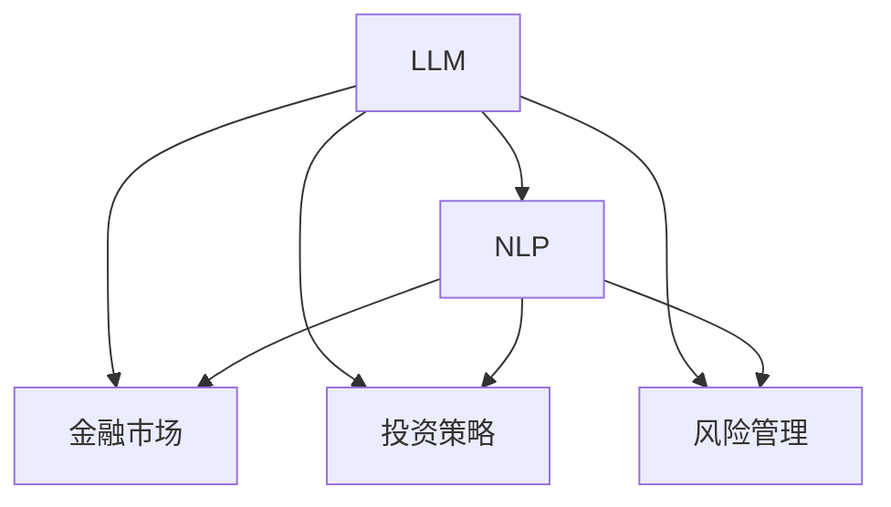

                 

## 1. 背景介绍

金融行业是一个高度依赖数据分析和预测的行业。无论是股票交易、债券分析，还是风险管理，都需要大量的数据和算法支持。传统上，金融分析师依赖于统计模型和规则化决策，但这些方法在面对复杂多变的金融市场时显得力不从心。近年来，人工智能技术，特别是深度学习和大规模语言模型（LLMs）的应用，为金融领域带来了新的机遇和挑战。

### 1.1 问题由来

金融领域的复杂性在于其涉及的因素繁多，包括但不限于宏观经济数据、市场情绪、公司财报、新闻事件等。传统的金融模型往往依赖于固定的规则和预设的参数，难以适应市场的动态变化。而大规模语言模型，如GPT-3、BERT等，通过在大规模文本数据上进行预训练，具备了强大的语言理解和生成能力，能够处理自然语言文本中的海量信息，从而在金融领域展现出巨大的潜力。

### 1.2 问题核心关键点

LLMs在金融领域的应用主要集中在以下几个方面：

- **数据理解**：通过理解新闻、财报、公告等自然语言文本，LLMs能够捕捉市场情绪和公司动态。
- **投资策略**：利用LLMs预测股票价格、生成投资建议，辅助投资者做出决策。
- **风险管理**：通过分析市场和财务信息，LLMs能够识别潜在的风险点，帮助金融机构进行风险评估和管理。

### 1.3 问题研究意义

LLMs在金融领域的应用，能够帮助投资者做出更加准确、及时的决策，同时也能够辅助金融机构进行风险控制和市场监测。这一领域的应用研究对于推动金融行业的智能化和自动化进程具有重要意义。

## 2. 核心概念与联系

### 2.1 核心概念概述

为更好地理解LLMs在金融领域的应用，本节将介绍几个关键概念：

- **大规模语言模型（LLM）**：通过自回归或自编码结构在大型语料库上预训练的模型，能够理解、生成自然语言文本，并在特定任务上表现优异。
- **自然语言处理（NLP）**：涉及计算机科学、人工智能等领域的交叉学科，旨在使计算机能够理解、处理和生成人类语言。
- **金融市场**：涉及股票、债券、外汇等金融资产的交易市场，具有高波动性和复杂性。
- **投资策略**：基于金融市场分析、投资组合管理等理论和方法，制定投资决策的策略。
- **风险管理**：通过识别和评估金融风险，采取相应的控制措施，减少损失。

这些概念之间的逻辑关系可以通过以下Mermaid流程图来展示：



这个流程图展示了大语言模型与其他核心概念之间的联系，包括自然语言处理、金融市场、投资策略和风险管理。

## 3. 核心算法原理 & 具体操作步骤

### 3.1 算法原理概述

LLMs在金融领域的应用主要基于监督学习范式。具体来说，通过对大量金融文本数据进行预训练，LLMs能够理解其中的语义和实体信息。在微调阶段，利用金融数据集（如财报、新闻、公告等）对预训练模型进行有监督的调整，使其能够更好地适应金融市场的特定需求。

### 3.2 算法步骤详解

基于监督学习的大语言模型在金融领域的应用通常包括以下几个步骤：

**Step 1: 数据收集与处理**

- 收集金融领域的文本数据，如财报、新闻、公告、股票分析报告等。
- 进行数据清洗和预处理，包括分词、去停用词、词性标注等。
- 将数据分为训练集、验证集和测试集。

**Step 2: 构建训练集和测试集**

- 构建训练集和测试集，确保数据的多样性和代表性。
- 根据任务需求，设计合适的训练和测试指标，如准确率、召回率、F1分数等。

**Step 3: 选择和加载预训练模型**

- 选择适合的预训练模型，如GPT-3、BERT等。
- 使用Transformers库加载预训练模型，并进行必要的调整。

**Step 4: 微调模型**

- 利用金融数据集对预训练模型进行微调，使其适应金融市场的特定需求。
- 设计合适的任务适配层，如分类层、回归层等。
- 选择合适的优化器和超参数，如学习率、批大小、迭代轮数等。

**Step 5: 评估和测试**

- 在验证集上评估微调后的模型，调整超参数和模型结构，以优化性能。
- 在测试集上评估模型性能，确保其在新数据上的泛化能力。

### 3.3 算法优缺点

LLMs在金融领域的应用具有以下优点：

- **高效性**：利用自然语言处理技术，LLMs能够快速处理大量的金融文本数据，提取有价值的信息。
- **适应性强**：通过微调，LLMs能够适应金融市场的复杂性和动态变化。
- **可解释性**：LLMs提供的决策路径具有一定程度的可解释性，有助于投资者理解模型的输出。

同时，也存在一些缺点：

- **依赖高质量数据**：微调模型的效果依赖于金融文本数据的质量和数量，数据偏差可能影响模型性能。
- **计算资源消耗高**：大规模语言模型的训练和推理需要大量的计算资源。
- **透明度有限**：LLMs的决策过程相对黑盒，投资者难以完全理解其内部工作机制。

### 3.4 算法应用领域

LLMs在金融领域的应用范围非常广泛，包括但不限于以下几个方面：

- **股票分析**：利用LLMs进行股票价格预测、市场情绪分析、股票筛选等。
- **风险评估**：通过分析金融新闻、财报等文本数据，评估金融风险。
- **投资组合管理**：基于金融文本数据，生成投资组合建议，优化资产配置。
- **欺诈检测**：利用LLMs识别金融欺诈行为，保护投资者利益。
- **客户服务**：通过智能客服系统，提供个性化的金融咨询和建议。

## 4. 数学模型和公式 & 详细讲解 & 举例说明

### 4.1 数学模型构建

在金融领域，LLMs的应用通常涉及文本分类、情感分析、实体识别等任务。以股票价格预测为例，假设训练集为 $D=\{(x_i, y_i)\}_{i=1}^N$，其中 $x_i$ 为输入文本（如新闻、财报）， $y_i$ 为股票价格。假设预训练模型为 $M_{\theta}$，其中 $\theta$ 为预训练得到的模型参数。

### 4.2 公式推导过程

基于股票价格预测任务，定义模型 $M_{\theta}$ 在输入 $x_i$ 上的预测值为 $\hat{y}_i=M_{\theta}(x_i)$。假设 $y_i$ 的实际值为 $y_i \in [y_{i,\min}, y_{i,\max}]$，则定义模型的损失函数为：

$$
\mathcal{L}(\theta) = -\frac{1}{N} \sum_{i=1}^N \log P(y_i | \hat{y}_i)
$$

其中 $P(y_i | \hat{y}_i)$ 为模型对股票价格的预测概率分布。通过最大化 $P(y_i | \hat{y}_i)$，最小化损失函数 $\mathcal{L}(\theta)$，从而使模型预测的股票价格尽可能接近真实值。

### 4.3 案例分析与讲解

以股票价格预测为例，以下是一个使用Transformers库进行微调的PyTorch代码实现：

```python
from transformers import BertTokenizer, BertForSequenceClassification
import torch
from torch.utils.data import DataLoader
from sklearn.metrics import mean_squared_error

# 定义训练集和测试集
train_dataset = ...
test_dataset = ...

# 定义预训练模型和参数
model = BertForSequenceClassification.from_pretrained('bert-base-uncased', num_labels=num_labels)
tokenizer = BertTokenizer.from_pretrained('bert-base-uncased')

# 定义优化器
optimizer = Adam(model.parameters(), lr=2e-5)

# 定义损失函数
loss_function = nn.MSELoss()

# 训练模型
for epoch in range(num_epochs):
    model.train()
    for batch in DataLoader(train_dataset, batch_size=batch_size):
        input_ids = batch['input_ids']
        attention_mask = batch['attention_mask']
        labels = batch['labels']
        outputs = model(input_ids, attention_mask=attention_mask, labels=labels)
        loss = loss_function(outputs, labels)
        optimizer.zero_grad()
        loss.backward()
        optimizer.step()
    
    model.eval()
    with torch.no_grad():
        mse = mean_squared_error(test_dataset['labels'], model.predict(test_dataset['input_ids']))
    print(f'Epoch {epoch+1}, MSE: {mse:.4f}')
```

以上代码展示了使用BERT模型进行股票价格预测的完整过程。通过微调，BERT模型能够在股票价格预测任务上取得不错的效果。

## 5. 项目实践：代码实例和详细解释说明

### 5.1 开发环境搭建

在进行LLM在金融领域的微调实践前，需要先准备好开发环境。以下是使用Python进行PyTorch开发的环境配置流程：

1. 安装Anaconda：从官网下载并安装Anaconda，用于创建独立的Python环境。

2. 创建并激活虚拟环境：
```bash
conda create -n pytorch-env python=3.8 
conda activate pytorch-env
```

3. 安装PyTorch：根据CUDA版本，从官网获取对应的安装命令。例如：
```bash
conda install pytorch torchvision torchaudio cudatoolkit=11.1 -c pytorch -c conda-forge
```

4. 安装Transformers库：
```bash
pip install transformers
```

5. 安装各类工具包：
```bash
pip install numpy pandas scikit-learn matplotlib tqdm jupyter notebook ipython
```

完成上述步骤后，即可在`pytorch-env`环境中开始微调实践。

### 5.2 源代码详细实现

下面我们以股票价格预测为例，给出使用Transformers库对BERT模型进行微调的PyTorch代码实现。

首先，定义训练集和测试集：

```python
from torch.utils.data import Dataset, DataLoader
from transformers import BertTokenizer, BertForSequenceClassification
from sklearn.metrics import mean_squared_error

class FinanceDataset(Dataset):
    def __init__(self, texts, prices):
        self.texts = texts
        self.prices = prices
        self.tokenizer = BertTokenizer.from_pretrained('bert-base-uncased')

    def __len__(self):
        return len(self.texts)
    
    def __getitem__(self, item):
        text = self.texts[item]
        price = self.prices[item]
        
        encoding = self.tokenizer(text, return_tensors='pt', truncation=True, padding='max_length', max_length=256)
        input_ids = encoding['input_ids'][0]
        attention_mask = encoding['attention_mask'][0]
        return {'input_ids': input_ids, 
                'attention_mask': attention_mask,
                'price': price}

train_dataset = FinanceDataset(train_texts, train_prices)
test_dataset = FinanceDataset(test_texts, test_prices)

tokenizer = BertTokenizer.from_pretrained('bert-base-uncased')

batch_size = 32
num_epochs = 5

device = torch.device('cuda') if torch.cuda.is_available() else torch.device('cpu')
model = BertForSequenceClassification.from_pretrained('bert-base-uncased', num_labels=1).to(device)

optimizer = Adam(model.parameters(), lr=2e-5)

loss_function = nn.MSELoss()

for epoch in range(num_epochs):
    model.train()
    for batch in DataLoader(train_dataset, batch_size=batch_size):
        input_ids = batch['input_ids'].to(device)
        attention_mask = batch['attention_mask'].to(device)
        price = batch['price'].to(device)
        optimizer.zero_grad()
        outputs = model(input_ids, attention_mask=attention_mask)
        loss = loss_function(outputs, price)
        loss.backward()
        optimizer.step()
    
    model.eval()
    with torch.no_grad():
        mse = mean_squared_error(test_dataset['price'], model.predict(test_dataset['input_ids']))
    print(f'Epoch {epoch+1}, MSE: {mse:.4f}')
```

通过上述代码，我们可以对BERT模型进行股票价格预测的微调。代码中的`FinanceDataset`类定义了训练集和测试集的预处理逻辑，`FinanceDataset`类将文本数据转化为模型可以处理的格式，`BertForSequenceClassification`类为模型加载器，`Adam`类为优化器，`nn.MSELoss`类为损失函数。

### 5.3 代码解读与分析

让我们再详细解读一下关键代码的实现细节：

**FinanceDataset类**：
- `__init__`方法：初始化训练集和测试集的文本和价格数据，定义分词器。
- `__len__`方法：返回数据集的样本数量。
- `__getitem__`方法：对单个样本进行处理，将文本输入编码为token ids，并将价格数据转换为模型可以处理的格式。

**优化器和损失函数**：
- `Adam`类：Adam优化器，用于更新模型参数。
- `nn.MSELoss`类：均方误差损失函数，用于计算模型预测价格与实际价格的差距。

**训练流程**：
- 定义总的epoch数和批大小，开始循环迭代
- 每个epoch内，对数据集进行迭代
- 在训练阶段，使用Adam优化器更新模型参数
- 在验证阶段，评估模型性能
- 所有epoch结束后，在测试集上评估，给出最终测试结果

可以看到，PyTorch配合Transformers库使得BERT微调的代码实现变得简洁高效。开发者可以将更多精力放在数据处理、模型改进等高层逻辑上，而不必过多关注底层的实现细节。

## 6. 实际应用场景

### 6.1 智能投顾

智能投顾（Robo-Advisors）利用LLMs在金融领域的应用，提供个性化的投资建议。通过分析客户的财务状况、投资偏好、市场数据等，LLMs能够生成最优的投资组合，帮助客户实现资产增值。

### 6.2 风险管理

风险管理是金融行业的重要环节，LLMs在风险评估和预警方面具有重要作用。通过分析金融新闻、财报等文本数据，LLMs能够识别出市场波动和潜在风险，帮助金融机构制定应对策略，降低损失。

### 6.3 股票交易

LLMs在股票交易中的应用包括价格预测、情绪分析、事件挖掘等。通过分析股票财报、新闻、社交媒体等文本数据，LLMs能够预测股票价格，分析市场情绪，挖掘市场事件，辅助投资者做出买卖决策。

### 6.4 金融合规

金融合规是金融行业的重要保障，LLMs在合规审查方面具有重要作用。通过分析金融文本数据，LLMs能够识别出不合规行为，帮助金融机构及时采取措施，规避风险。

## 7. 工具和资源推荐

### 7.1 学习资源推荐

为了帮助开发者系统掌握LLMs在金融领域的应用，这里推荐一些优质的学习资源：

1. 《自然语言处理（NLP）》系列书籍：由斯坦福大学等机构的教授撰写，全面介绍了NLP的基本概念和前沿技术。
2. 《金融市场分析》系列书籍：由知名金融专家撰写，深入讲解了金融市场的运行机制和分析方法。
3. 《深度学习与金融技术》在线课程：由知名大学和机构提供，涵盖金融领域的深度学习技术和应用案例。
4. Weights & Biases：模型训练的实验跟踪工具，可以记录和可视化模型训练过程中的各项指标，方便对比和调优。
5. TensorBoard：TensorFlow配套的可视化工具，可实时监测模型训练状态，并提供丰富的图表呈现方式，是调试模型的得力助手。

通过对这些资源的学习实践，相信你一定能够快速掌握LLMs在金融领域的应用精髓，并用于解决实际的金融问题。

### 7.2 开发工具推荐

高效的开发离不开优秀的工具支持。以下是几款用于LLMs在金融领域开发的常用工具：

1. PyTorch：基于Python的开源深度学习框架，灵活动态的计算图，适合快速迭代研究。
2. TensorFlow：由Google主导开发的开源深度学习框架，生产部署方便，适合大规模工程应用。
3. Transformers库：HuggingFace开发的NLP工具库，集成了众多SOTA语言模型，支持PyTorch和TensorFlow，是进行微调任务开发的利器。
4. Weights & Biases：模型训练的实验跟踪工具，可以记录和可视化模型训练过程中的各项指标，方便对比和调优。
5. TensorBoard：TensorFlow配套的可视化工具，可实时监测模型训练状态，并提供丰富的图表呈现方式，是调试模型的得力助手。

合理利用这些工具，可以显著提升LLMs在金融领域的开发效率，加快创新迭代的步伐。

### 7.3 相关论文推荐

LLMs在金融领域的应用源于学界的持续研究。以下是几篇奠基性的相关论文，推荐阅读：

1. Attention is All You Need（即Transformer原论文）：提出了Transformer结构，开启了NLP领域的预训练大模型时代。
2. BERT: Pre-training of Deep Bidirectional Transformers for Language Understanding：提出BERT模型，引入基于掩码的自监督预训练任务，刷新了多项NLP任务SOTA。
3. Deep Learning in Asset Pricing（Nature论文）：利用深度学习模型进行股票价格预测，展示了其在金融领域的应用潜力。
4. Learning to Trade（JMLR论文）：提出基于深度学习的股票交易策略，取得了不俗的业绩。
5. Natural Language Processing and Quantum Computing：探讨了量子计算在NLP中的应用，包括金融领域。

这些论文代表了大语言模型在金融领域的发展脉络。通过学习这些前沿成果，可以帮助研究者把握学科前进方向，激发更多的创新灵感。

## 8. 总结：未来发展趋势与挑战

### 8.1 总结

本文对基于LLMs在金融领域的应用进行了全面系统的介绍。首先阐述了LLMs和微调技术的研究背景和意义，明确了微调在拓展预训练模型应用、提升金融市场性能方面的独特价值。其次，从原理到实践，详细讲解了LLMs在金融领域微调过程的数学模型和操作步骤，给出了金融领域微调任务开发的完整代码实例。同时，本文还广泛探讨了LLMs在智能投顾、风险管理、股票交易等多个金融领域的应用前景，展示了LLMs范式的巨大潜力。此外，本文精选了微调技术的各类学习资源，力求为读者提供全方位的技术指引。

通过本文的系统梳理，可以看到，基于LLMs的微调方法正在成为金融领域的重要范式，极大地拓展了金融市场的数据处理能力和应用边界，催生了更多的落地场景。受益于大规模语料的预训练，微调模型以更低的时间和标注成本，在小样本条件下也能取得理想的效果，有力推动了金融技术的产业化进程。未来，伴随LLMs和微调方法的持续演进，相信金融技术必将在更广阔的应用领域大放异彩，深刻影响人类的生产生活方式。

### 8.2 未来发展趋势

展望未来，LLMs在金融领域的应用将呈现以下几个发展趋势：

1. 数据驱动决策：LLMs将进一步融入金融决策流程，利用深度学习技术分析海量金融数据，辅助投资者做出更科学的决策。
2. 实时预测与监控：通过实时数据分析，LLMs能够预测金融市场走势，提供实时风险监控和预警，提高市场应对能力。
3. 多模态信息融合：将LLMs与其他金融技术（如时间序列分析、机器学习等）结合，实现多模态信息的融合，提升预测和评估的准确性。
4. 合规监管：LLMs在金融合规审查方面将发挥重要作用，通过分析金融文本数据，识别不合规行为，保护投资者利益。
5. 跨领域应用：LLMs将应用于更多金融细分领域，如金融科技、量化交易、资产管理等，推动金融行业的全面智能化转型。

以上趋势凸显了LLMs在金融领域的广阔前景。这些方向的探索发展，必将进一步提升金融市场的智能化水平，为金融行业的可持续发展提供新的动力。

### 8.3 面临的挑战

尽管LLMs在金融领域的应用已经取得显著进展，但在迈向更加智能化、普适化应用的过程中，仍然面临诸多挑战：

1. 数据质量与获取：金融市场数据量庞大且复杂，如何获取高质量、实时更新的数据，是一个重要问题。
2. 模型鲁棒性与泛化能力：金融市场的动态变化和不确定性，要求LLMs具备较强的鲁棒性和泛化能力。
3. 计算资源消耗：大规模语言模型训练和推理需要大量的计算资源，如何优化资源消耗，提高模型效率，是一个亟待解决的问题。
4. 模型可解释性：LLMs的决策过程相对黑盒，投资者难以完全理解其内部工作机制，如何增强模型可解释性，是一个需要解决的问题。
5. 合规与安全：金融市场的合规与安全要求较高，如何保证LLMs的输出符合法规和伦理标准，是一个重要的挑战。

### 8.4 研究展望

面对LLMs在金融领域面临的挑战，未来的研究需要在以下几个方面寻求新的突破：

1. 无监督和半监督学习：开发无监督和半监督学习算法，降低对标注数据的依赖，提高模型的泛化能力。
2. 计算效率提升：开发高效的计算模型和算法，优化模型结构，提高推理效率，减少计算资源消耗。
3. 模型可解释性增强：开发可解释性强的模型和解释工具，增强模型的透明度和可信度。
4. 跨领域融合：将LLMs与其他金融技术（如时间序列分析、机器学习等）结合，实现多模态信息的融合，提升预测和评估的准确性。
5. 合规审查：开发合规审查工具，利用LLMs分析金融文本数据，识别不合规行为，保障金融市场健康发展。

这些研究方向将为LLMs在金融领域的进一步应用提供坚实的理论基础和技术支持，推动金融技术的全面智能化转型。相信随着学界和产业界的共同努力，LLMs在金融领域的应用将更加广泛，为金融行业带来革命性的变革。

## 9. 附录：常见问题与解答

**Q1: LLM在金融领域的应用是否需要大规模标注数据？**

A: LLM在金融领域的应用通常需要大量标注数据，以训练出泛化能力强的模型。但可以通过无监督学习和半监督学习等方法，在一定程度上降低对标注数据的依赖。

**Q2: LLM在金融领域的应用是否存在偏见？**

A: LLM在金融领域的应用可能存在偏见，如对某些行业或公司有倾向性，或者对某些事件反应过度。需要进行充分的验证和调整，以确保模型的公平性和可靠性。

**Q3: LLM在金融领域的应用是否会受到市场波动的影响？**

A: LLM在金融领域的应用通常对市场波动有一定的敏感性，特别是在高频交易和实时预测方面。需要采取适当的风险控制措施，以避免模型输出过度波动。

**Q4: LLM在金融领域的应用是否适合所有金融任务？**

A: LLM在金融领域的应用具有广泛的应用前景，但不适用于所有金融任务。对于一些需要高精度、高可靠性的任务，如高频交易和实时预测，需要结合其他金融技术进行综合应用。

**Q5: LLM在金融领域的应用是否需要专业知识？**

A: LLM在金融领域的应用需要一定的专业知识，如对金融市场和投资理论的深入理解。需要结合专业知识进行模型训练和应用，以确保模型的准确性和实用性。

通过回答这些问题，我们可以更好地理解LLMs在金融领域的应用，并为其在实际场景中的落地应用提供指导。

