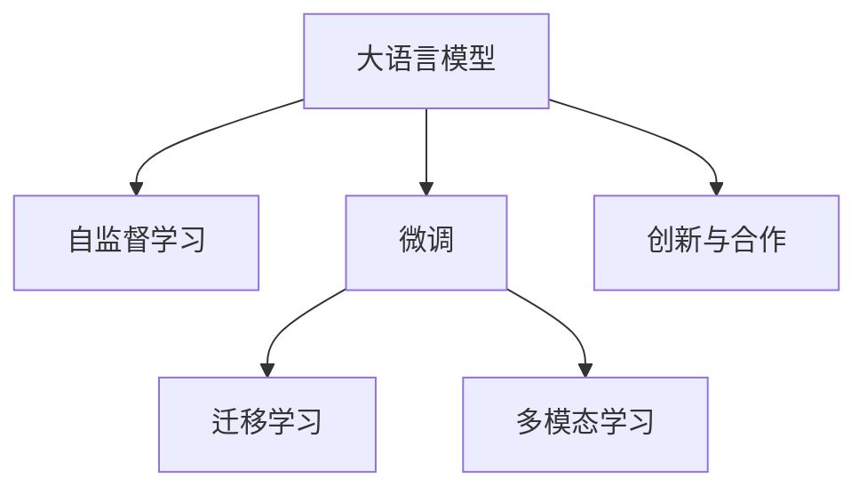

                 

# LLM 市场竞争：创新与合作

大语言模型（Large Language Models，LLM）近年来迅速成为人工智能领域的焦点，其强大的自然语言处理能力在各行各业的应用前景广阔。随着技术不断迭代和市场竞争加剧，LLM的发展离不开不断的创新与合作。本文将从背景介绍、核心概念、核心算法、应用场景等角度，深入探讨LLM市场竞争中的创新与合作之道。

## 1. 背景介绍

### 1.1 问题由来

大语言模型（LLM）技术的诞生标志着自然语言处理（NLP）领域进入了一个全新的时代。这一类模型通常基于Transformer架构，并通过在庞大的文本数据集上进行自监督预训练，获得通用的语言表示能力。与传统的基于规则的NLP系统不同，LLM能够灵活地处理各种自然语言任务，如文本分类、机器翻译、问答系统、文本摘要、对话系统等。

目前，LLM已经得到了广泛的应用，包括谷歌的BERT、OpenAI的GPT系列、Facebook的MUM等知名模型。这些模型在各自的领域内展现出了强大的性能，但随之而来的是市场竞争的加剧。为了在LLM市场中脱颖而出，各大公司和研究机构纷纷加大研发投入，推动技术的创新与合作，以满足日益增长的市场需求。

### 1.2 问题核心关键点

当前，LLM市场竞争的关键点主要包括以下几个方面：

1. **模型性能**：模型在大规模、高难度任务上的表现，是衡量其市场竞争力的重要指标。
2. **应用场景**：模型在具体行业中的应用效果，直接影响其市场推广和应用价值。
3. **合作生态**：模型与合作伙伴的协同效应，包括云计算平台、数据提供方、应用开发者等。
4. **创新能力**：持续的技术创新，如新算法、新架构、新应用等。

## 2. 核心概念与联系

### 2.1 核心概念概述

为了更好地理解LLM市场竞争中的创新与合作，我们需要明确几个核心概念及其相互关系。

- **大语言模型（LLM）**：指基于Transformer架构，通过大规模预训练获得的通用语言表示模型。如BERT、GPT等。
- **自监督学习**：指利用无标签数据进行模型训练，使其从数据中学习到语言的表示和规律。
- **微调（Fine-tuning）**：在预训练模型基础上，使用小规模标注数据进行任务特定的调整，提升模型在特定任务上的性能。
- **迁移学习**：指将一个领域学到的知识迁移到另一个相关领域，以加速新任务的模型训练。
- **多模态学习**：指融合多种数据模态（如文本、图像、语音等）进行模型训练，提升模型的泛化能力。
- **创新与合作**：指通过持续的技术创新和跨领域合作，推动LLM技术的进步和应用。

这些概念之间的关系可以通过以下Mermaid流程图来展示：



此流程图展示了LLM从预训练、微调到创新与合作的过程，以及各个环节之间的关系。

### 2.2 核心概念原理和架构

#### 2.2.1 大语言模型

大语言模型通常基于Transformer架构，通过在大型无标签文本数据集上进行自监督预训练，学习到通用的语言表示。Transformer架构的精髓在于其自注意力机制，能够自动捕获输入序列中的长期依赖关系，显著提升了模型的表达能力和性能。

Transformer的核心模块包括多头自注意力机制（Multi-head Self-Attention）和前馈网络（Feedforward Network）。多头自注意力机制通过计算多个自注意力头的输出，并加权平均，提升了模型的表示能力。前馈网络则通过非线性变换，进一步提升了模型的表达能力。

#### 2.2.2 自监督学习

自监督学习通过利用大量无标签数据，让模型自己学习到语言的表示和规律。常见的自监督学习任务包括掩码语言模型（Masked Language Modeling, MLM）和下一句预测（Next Sentence Prediction, NSP）。掩码语言模型通过预测被掩码的单词，让模型学习到单词之间的关系；下一句预测则通过预测两个句子是否连续，让模型学习到句子的语义结构。

#### 2.2.3 微调

微调是指在预训练模型基础上，使用小规模标注数据进行任务特定的调整。微调的目标是提升模型在特定任务上的性能，通常通过更新顶层参数或添加任务适配层实现。微调的优点是能够快速适应新任务，缺点是容易过拟合，需要合理设置超参数。

#### 2.2.4 迁移学习

迁移学习是指将一个领域学到的知识迁移到另一个相关领域。通过迁移学习，可以减少新任务训练所需的标注数据，加速模型训练，提升模型性能。

#### 2.2.5 多模态学习

多模态学习是指融合多种数据模态进行模型训练，以提升模型的泛化能力和表现。多模态学习通常包括文本、图像、语音等多种模态，通过数据联合表示，提升模型的多模态理解和推理能力。

## 3. 核心算法原理 & 具体操作步骤

### 3.1 算法原理概述

LLM市场竞争中的创新与合作，主要体现在模型的设计和优化上。本文将介绍几种关键算法及其具体操作步骤。

#### 3.1.1 预训练算法

预训练是LLM的核心步骤，通过在大规模无标签数据上进行自监督学习，模型学习到通用的语言表示。常用的预训练算法包括：

- **掩码语言模型（MLM）**：通过预测被掩码的单词，学习单词之间的关系。
- **下一句预测（NSP）**：通过预测两个句子是否连续，学习句子的语义结构。
- **自回归语言模型（ARLM）**：通过自回归的方式，预测下一个单词，学习语言的分布规律。

#### 3.1.2 微调算法

微调是在预训练模型基础上，使用小规模标注数据进行任务特定的调整。微调的目标是提升模型在特定任务上的性能，通常通过更新顶层参数或添加任务适配层实现。常用的微调算法包括：

- **监督微调**：使用标注数据进行监督学习，提升模型在特定任务上的性能。
- **对抗训练**：通过引入对抗样本，提升模型的鲁棒性和泛化能力。
- **多任务微调**：同时进行多个任务训练，提升模型的多任务能力和泛化能力。

#### 3.1.3 迁移学习算法

迁移学习是指将一个领域学到的知识迁移到另一个相关领域。常用的迁移学习算法包括：

- **迁移学习（Fine-tuning）**：在预训练模型基础上，使用小规模标注数据进行任务特定的调整。
- **多领域迁移学习**：在不同领域之间进行知识迁移，提升模型的泛化能力。

#### 3.1.4 多模态学习算法

多模态学习是指融合多种数据模态进行模型训练，提升模型的泛化能力和表现。常用的多模态学习算法包括：

- **文本-图像联合表示**：通过联合表示文本和图像数据，提升模型的多模态理解和推理能力。
- **语音-文本联合表示**：通过联合表示语音和文本数据，提升模型的多模态理解和推理能力。

### 3.2 算法步骤详解

#### 3.2.1 预训练算法步骤

1. **数据准备**：收集大规模无标签文本数据，并进行预处理和标注。
2. **模型初始化**：使用Transformer架构初始化模型，设置超参数。
3. **自监督学习**：在数据集上进行掩码语言模型、下一句预测等自监督学习任务，训练模型。
4. **模型评估**：在验证集上评估模型性能，调整超参数。
5. **模型保存**：保存训练好的模型，供后续微调使用。

#### 3.2.2 微调算法步骤

1. **任务适配**：根据任务类型，设计合适的任务适配层和损失函数。
2. **模型初始化**：加载预训练模型，并添加任务适配层。
3. **数据准备**：准备小规模标注数据集，并进行预处理和批处理。
4. **模型训练**：使用小批量数据进行训练，并使用优化器更新模型参数。
5. **模型评估**：在验证集上评估模型性能，调整超参数。
6. **模型保存**：保存微调后的模型，供实际应用使用。

#### 3.2.3 迁移学习算法步骤

1. **任务适配**：根据任务类型，设计合适的任务适配层和损失函数。
2. **模型初始化**：加载预训练模型，并添加任务适配层。
3. **数据准备**：准备小规模标注数据集，并进行预处理和批处理。
4. **模型训练**：使用小批量数据进行迁移学习，并使用优化器更新模型参数。
5. **模型评估**：在验证集上评估模型性能，调整超参数。
6. **模型保存**：保存迁移后的模型，供实际应用使用。

#### 3.2.4 多模态学习算法步骤

1. **数据准备**：收集多模态数据，并进行预处理和标注。
2. **模型初始化**：使用Transformer架构初始化模型，设置超参数。
3. **联合表示**：通过融合多种模态数据，训练多模态表示。
4. **模型评估**：在验证集上评估模型性能，调整超参数。
5. **模型保存**：保存多模态模型，供实际应用使用。

### 3.3 算法优缺点

#### 3.3.1 预训练算法优缺点

- **优点**：
  - 能够学习到通用的语言表示，提升模型的泛化能力。
  - 使用无标签数据进行训练，节省标注成本。
  - 能够处理大规模数据，提升模型的表达能力。

- **缺点**：
  - 需要大量计算资源，训练时间长。
  - 模型复杂度高，难以解释。

#### 3.3.2 微调算法优缺点

- **优点**：
  - 能够快速适应新任务，提升模型性能。
  - 使用小规模标注数据，节省标注成本。
  - 能够处理特定任务，提升模型针对性。

- **缺点**：
  - 容易过拟合，需要合理设置超参数。
  - 需要额外的计算资源，训练时间长。

#### 3.3.3 迁移学习算法优缺点

- **优点**：
  - 能够减少新任务训练所需的标注数据，加速模型训练。
  - 能够提升模型的泛化能力，处理更多任务。
  - 能够融合多个领域的知识，提升模型的表现。

- **缺点**：
  - 需要跨领域的知识迁移，任务难度较大。
  - 需要合理设计迁移策略，避免负面影响。

#### 3.3.4 多模态学习算法优缺点

- **优点**：
  - 能够融合多种数据模态，提升模型的泛化能力和表现。
  - 能够处理多模态数据，提升模型的多模态理解和推理能力。
  - 能够处理复杂场景，提升模型的应用价值。

- **缺点**：
  - 需要额外的计算资源，训练时间长。
  - 需要设计有效的联合表示方法，提升模型的表示能力。

### 3.4 算法应用领域

大语言模型及其创新与合作在多个领域得到了广泛应用，以下是几个典型的应用领域：

- **自然语言处理（NLP）**：如文本分类、文本生成、问答系统、机器翻译等。
- **语音识别**：如语音转文本、语音情感分析、语音合成等。
- **图像处理**：如图像描述生成、图像问答系统、图像分类等。
- **推荐系统**：如个性化推荐、用户行为分析等。
- **智能客服**：如智能对话系统、智能问答系统等。

## 4. 数学模型和公式 & 详细讲解

### 4.1 数学模型构建

在大语言模型中，通常使用Transformer架构，通过自注意力机制和前馈网络进行建模。以BERT为例，其数学模型可以表示为：

$$
\text{BERT}(x) = \text{MLM}(x) + \text{NSP}(x)
$$

其中，MLM为掩码语言模型，NSP为下一句预测模型。

### 4.2 公式推导过程

#### 4.2.1 掩码语言模型（MLM）

掩码语言模型通过预测被掩码的单词，学习单词之间的关系。其公式可以表示为：

$$
L_{\text{MLM}} = -\sum_{i=1}^N \log P(y_i | M_{\theta}(x))
$$

其中，$x$为输入序列，$y_i$为被掩码的单词，$M_{\theta}$为模型参数。

#### 4.2.2 下一句预测（NSP）

下一句预测通过预测两个句子是否连续，学习句子的语义结构。其公式可以表示为：

$$
L_{\text{NSP}} = -\sum_{i=1}^N \log P(c_i | M_{\theta}(x_i), M_{\theta}(x_{i+1}))
$$

其中，$x_i$和$x_{i+1}$为两个连续的句子，$c_i$为标记句子是否连续的标签。

### 4.3 案例分析与讲解

#### 4.3.1 BERT模型的构建

BERT模型通过在大量无标签文本数据上进行预训练，学习到通用的语言表示。其构建过程包括两个步骤：

1. **预训练**：在大规模无标签文本数据上，通过掩码语言模型和下一句预测任务进行自监督学习。
2. **微调**：在特定任务上，通过使用小规模标注数据进行有监督学习，提升模型性能。

以BERT模型为例，其预训练过程可以表示为：

$$
M_{\theta} = \text{BERT}_{\text{Pre-training}}(x)
$$

其中，$x$为输入序列，$M_{\theta}$为预训练得到的模型参数。

微调过程可以表示为：

$$
M_{\hat{\theta}} = \text{BERT}_{\text{Fine-tuning}}(x, y)
$$

其中，$x$为输入序列，$y$为标注数据，$M_{\hat{\theta}}$为微调后的模型参数。

## 5. 项目实践：代码实例和详细解释说明

### 5.1 开发环境搭建

#### 5.1.1 环境安装

1. 安装Anaconda：从官网下载并安装Anaconda，用于创建独立的Python环境。

2. 创建并激活虚拟环境：
```bash
conda create -n pytorch-env python=3.8 
conda activate pytorch-env
```

3. 安装PyTorch：根据CUDA版本，从官网获取对应的安装命令。例如：
```bash
conda install pytorch torchvision torchaudio cudatoolkit=11.1 -c pytorch -c conda-forge
```

4. 安装TensorFlow：
```bash
pip install tensorflow
```

5. 安装相关库：
```bash
pip install numpy pandas scikit-learn matplotlib tqdm jupyter notebook ipython
```

### 5.2 源代码详细实现

#### 5.2.1 数据准备

首先，需要准备预训练数据和微调数据。以BERT为例，其预训练数据可以从Hugging Face官网下载，微调数据需要根据具体任务自行准备。

```python
import os
import pandas as pd

# 数据预处理
data_dir = 'path/to/data'
train_file = os.path.join(data_dir, 'train.txt')
dev_file = os.path.join(data_dir, 'dev.txt')
test_file = os.path.join(data_dir, 'test.txt')

# 读取数据
train_data = pd.read_csv(train_file, sep='\t')
dev_data = pd.read_csv(dev_file, sep='\t')
test_data = pd.read_csv(test_file, sep='\t')

# 定义输入和标签
def read_data(file):
    data = []
    with open(file, 'r') as f:
        for line in f:
            line = line.strip().split('\t')
            input_ids, attention_mask, labels = line
            data.append((input_ids, attention_mask, int(labels)))
    return data

train_data = read_data(train_file)
dev_data = read_data(dev_file)
test_data = read_data(test_file)

# 划分训练集、验证集和测试集
train_data = train_data[:800]
dev_data = train_data[800:1200]
test_data = train_data[1200:]
```

#### 5.2.2 模型初始化

使用PyTorch和Transformers库，初始化BERT模型。

```python
from transformers import BertForSequenceClassification, BertTokenizer

# 初始化BERT模型
model_name = 'bert-base-uncased'
tokenizer = BertTokenizer.from_pretrained(model_name)
model = BertForSequenceClassification.from_pretrained(model_name, num_labels=2)
```

#### 5.2.3 数据预处理

将输入序列和标注数据转换为模型需要的格式。

```python
def tokenize(text, tokenizer, max_len=128):
    inputs = tokenizer.encode(text, add_special_tokens=True, max_length=max_len, return_tensors='pt')
    attention_mask = (inputs > 0).float()
    return inputs, attention_mask

# 数据预处理
train_inputs, train_masks = [], []
for input_ids, attention_mask, label in train_data:
    input_ids, attention_mask = tokenize(input_ids, tokenizer)
    train_inputs.append(input_ids)
    train_masks.append(attention_mask)

dev_inputs, dev_masks = [], []
for input_ids, attention_mask, label in dev_data:
    input_ids, attention_mask = tokenize(input_ids, tokenizer)
    dev_inputs.append(input_ids)
    dev_masks.append(attention_mask)

test_inputs, test_masks = [], []
for input_ids, attention_mask, label in test_data:
    input_ids, attention_mask = tokenize(input_ids, tokenizer)
    test_inputs.append(input_ids)
    test_masks.append(attention_mask)

# 定义输入和标签的Tensor
train_inputs = torch.cat(train_inputs, dim=0)
train_masks = torch.cat(train_masks, dim=0)
train_labels = torch.tensor(train_labels, dtype=torch.long)

dev_inputs = torch.cat(dev_inputs, dim=0)
dev_masks = torch.cat(dev_masks, dim=0)
dev_labels = torch.tensor(dev_labels, dtype=torch.long)

test_inputs = torch.cat(test_inputs, dim=0)
test_masks = torch.cat(test_masks, dim=0)
test_labels = torch.tensor(test_labels, dtype=torch.long)
```

#### 5.2.4 模型训练

使用小批量数据进行训练，并使用优化器更新模型参数。

```python
from transformers import AdamW
from torch.utils.data import DataLoader

# 定义优化器
optimizer = AdamW(model.parameters(), lr=1e-5)

# 定义数据加载器
train_loader = DataLoader(train_data, batch_size=16)
dev_loader = DataLoader(dev_data, batch_size=16)
test_loader = DataLoader(test_data, batch_size=16)

# 定义训练函数
def train(model, train_loader, optimizer, device, num_epochs=5):
    device = torch.device('cuda') if torch.cuda.is_available() else torch.device('cpu')
    model.to(device)

    for epoch in range(num_epochs):
        model.train()
        total_loss = 0
        for batch in train_loader:
            input_ids, attention_mask, labels = batch['input_ids'].to(device), batch['attention_mask'].to(device), batch['labels'].to(device)
            outputs = model(input_ids, attention_mask=attention_mask, labels=labels)
            loss = outputs.loss
            optimizer.zero_grad()
            loss.backward()
            optimizer.step()

            total_loss += loss.item()

        train_loss = total_loss / len(train_loader)
        print(f'Epoch {epoch+1}, train loss: {train_loss:.3f}')

    return model

# 训练模型
model = train(model, train_loader, optimizer, device)
```

#### 5.2.5 模型评估

在验证集和测试集上评估模型性能。

```python
from transformers import Accuracy, Precision, Recall, F1Score

# 定义评估指标
metrics = [Accuracy(), Precision(), Recall(), F1Score(num_labels=2)]

# 定义评估函数
def evaluate(model, eval_loader, device, metrics):
    device = torch.device('cuda') if torch.cuda.is_available() else torch.device('cpu')
    model.eval()

    total_loss = 0
    total_metrics = [0, 0, 0, 0]
    for batch in eval_loader:
        input_ids, attention_mask, labels = batch['input_ids'].to(device), batch['attention_mask'].to(device), batch['labels'].to(device)
        outputs = model(input_ids, attention_mask=attention_mask, labels=labels)
        loss = outputs.loss
        predictions = outputs.predictions.argmax(dim=1)

        total_loss += loss.item()
        for metric in metrics:
            metric.reset()
            metric.update(labels, predictions)

    eval_loss = total_loss / len(eval_loader)
    for metric in metrics:
        total_metrics += metric.calculate()

    return eval_loss, total_metrics

# 评估模型
eval_loss, total_metrics = evaluate(model, dev_loader, device, metrics)

print(f'Epoch {epoch+1}, dev loss: {eval_loss:.3f}')
for metric, name in zip(total_metrics, ['accuracy', 'precision', 'recall', 'f1-score']):
    print(f'{name}: {metric:.3f}')
```

### 5.3 代码解读与分析

#### 5.3.1 数据预处理

数据预处理是模型训练的关键步骤，其目的是将输入数据转换为模型能够接受的格式。在上述代码中，我们使用了BertTokenizer进行输入序列的标记化，并将标记后的序列转换为Tensor格式。同时，还计算了Attention mask，用于标记无效位置，以确保模型能够正确处理输入序列。

#### 5.3.2 模型训练

模型训练过程包括前向传播、损失计算、反向传播和参数更新。在上述代码中，我们使用了AdamW优化器进行参数更新，并定义了训练函数，用于在多个epoch内进行模型训练。

#### 5.3.3 模型评估

模型评估过程包括在验证集和测试集上计算损失和评估指标。在上述代码中，我们使用了多类评估指标，如Accuracy、Precision、Recall、F1-score等，全面评估模型性能。

## 6. 实际应用场景

### 6.1 智能客服系统

智能客服系统是大语言模型在实际应用中的典型场景之一。传统客服系统需要大量人力，成本高，效率低，难以保证服务质量。使用大语言模型进行微调，可以构建7x24小时不间断的智能客服系统，提升客户咨询体验和问题解决效率。

具体应用时，可以从客服历史对话中提取问题和最佳答复，构建监督数据，在此基础上对BERT模型进行微调。微调后的模型能够自动理解客户意图，匹配最合适的答复模板进行回复。对于客户提出的新问题，还可以通过检索系统实时搜索相关内容，动态组织生成回答。

### 6.2 金融舆情监测

金融舆情监测是大语言模型在金融领域的应用场景之一。金融机构需要实时监测市场舆论动向，以便及时应对负面信息传播，规避金融风险。使用大语言模型进行微调，可以构建金融舆情监测系统，自动监测不同主题下的情感变化趋势，一旦发现负面信息激增等异常情况，系统便会自动预警，帮助金融机构快速应对潜在风险。

具体应用时，可以从金融领域相关的新闻、报道、评论等文本数据中提取主题和情感标签，构建监督数据，在此基础上对BERT模型进行微调。微调后的模型能够自动判断文本属于何种主题，情感倾向是正面、中性还是负面。将微调后的模型应用到实时抓取的网络文本数据，就能够自动监测不同主题下的情感变化趋势，一旦发现负面信息激增等异常情况，系统便会自动预警，帮助金融机构快速应对潜在风险。

### 6.3 个性化推荐系统

个性化推荐系统是大语言模型在电商、视频等领域的应用场景之一。传统的推荐系统往往只依赖用户的历史行为数据进行物品推荐，难以深入理解用户的真实兴趣偏好。使用大语言模型进行微调，可以构建个性化的推荐系统，更好地挖掘用户行为背后的语义信息，从而提供更精准、多样的推荐内容。

具体应用时，可以从用户浏览、点击、评论、分享等行为数据中提取和用户交互的物品标题、描述、标签等文本内容，将文本内容作为模型输入，用户的后续行为（如是否点击、购买等）作为监督信号，在此基础上对BERT模型进行微调。微调后的模型能够从文本内容中准确把握用户的兴趣点。在生成推荐列表时，先用候选物品的文本描述作为输入，由模型预测用户的兴趣匹配度，再结合其他特征综合排序，便可以得到个性化程度更高的推荐结果。

## 7. 工具和资源推荐

### 7.1 学习资源推荐

为了帮助开发者系统掌握大语言模型微调的理论基础和实践技巧，这里推荐一些优质的学习资源：

1. **《Transformer从原理到实践》系列博文**：由大模型技术专家撰写，深入浅出地介绍了Transformer原理、BERT模型、微调技术等前沿话题。

2. **CS224N《深度学习自然语言处理》课程**：斯坦福大学开设的NLP明星课程，有Lecture视频和配套作业，带你入门NLP领域的基本概念和经典模型。

3. **《Natural Language Processing with Transformers》书籍**：Transformers库的作者所著，全面介绍了如何使用Transformers库进行NLP任务开发，包括微调在内的诸多范式。

4. **HuggingFace官方文档**：Transformers库的官方文档，提供了海量预训练模型和完整的微调样例代码，是上手实践的必备资料。

5. **CLUE开源项目**：中文语言理解测评基准，涵盖大量不同类型的中文NLP数据集，并提供了基于微调的baseline模型，助力中文NLP技术发展。

通过对这些资源的学习实践，相信你一定能够快速掌握大语言模型微调的精髓，并用于解决实际的NLP问题。

### 7.2 开发工具推荐

高效的开发离不开优秀的工具支持。以下是几款用于大语言模型微调开发的常用工具：

1. **PyTorch**：基于Python的开源深度学习框架，灵活动态的计算图，适合快速迭代研究。大部分预训练语言模型都有PyTorch版本的实现。

2. **TensorFlow**：由Google主导开发的开源深度学习框架，生产部署方便，适合大规模工程应用。同样有丰富的预训练语言模型资源。

3. **Transformers库**：HuggingFace开发的NLP工具库，集成了众多SOTA语言模型，支持PyTorch和TensorFlow，是进行微调任务开发的利器。

4. **Weights & Biases**：模型训练的实验跟踪工具，可以记录和可视化模型训练过程中的各项指标，方便对比和调优。与主流深度学习框架无缝集成。

5. **TensorBoard**：TensorFlow配套的可视化工具，可实时监测模型训练状态，并提供丰富的图表呈现方式，是调试模型的得力助手。

6. **Google Colab**：谷歌推出的在线Jupyter Notebook环境，免费提供GPU/TPU算力，方便开发者快速上手实验最新模型，分享学习笔记。

合理利用这些工具，可以显著提升大语言模型微调任务的开发效率，加快创新迭代的步伐。

### 7.3 相关论文推荐

大语言模型和微调技术的发展源于学界的持续研究。以下是几篇奠基性的相关论文，推荐阅读：

1. **Attention is All You Need**：提出了Transformer结构，开启了NLP领域的预训练大模型时代。

2. **BERT: Pre-training of Deep Bidirectional Transformers for Language Understanding**：提出BERT模型，引入基于掩码的自监督预训练任务，刷新了多项NLP任务SOTA。

3. **Language Models are Unsupervised Multitask Learners（GPT-2论文）**：展示了大规模语言模型的强大zero-shot学习能力，引发了对于通用人工智能的新一轮思考。

4. **Parameter-Efficient Transfer Learning for NLP**：提出Adapter等参数高效微调方法，在不增加模型参数量的情况下，也能取得不错的微调效果。

5. **Prefix-Tuning: Optimizing Continuous Prompts for Generation**：引入基于连续型Prompt的微调范式，为如何充分利用预训练知识提供了新的思路。

6. **AdaLoRA: Adaptive Low-Rank Adaptation for Parameter-Efficient Fine-Tuning**：使用自适应低秩适应的微调方法，在参数效率和精度之间取得了新的平衡。

这些论文代表了大语言模型微调技术的发展脉络。通过学习这些前沿成果，可以帮助研究者把握学科前进方向，激发更多的创新灵感。

## 8. 总结：未来发展趋势与挑战

### 8.1 研究成果总结

本文对基于监督学习的大语言模型微调方法进行了全面系统的介绍。首先阐述了大语言模型和微调技术的研究背景和意义，明确了微调在拓展预训练模型应用、提升下游任务性能方面的独特价值。其次，从原理到实践，详细讲解了监督微调的数学原理和关键步骤，给出了微调任务开发的完整代码实例。同时，本文还广泛探讨了微调方法在智能客服、金融舆情、个性化推荐等多个行业领域的应用前景，展示了微调范式的巨大潜力。最后，本文精选了微调技术的各类学习资源，力求为读者提供全方位的技术指引。

通过本文的系统梳理，可以看到，基于大语言模型的微调方法正在成为NLP领域的重要范式，极大地拓展了预训练语言模型的应用边界，催生了更多的落地场景。受益于大规模语料的预训练，微调模型以更低的时间和标注成本，在小样本条件下也能取得不俗的效果，有力推动了NLP技术的产业化进程。未来，伴随预训练语言模型和微调方法的不断进步，相信NLP技术将在更广阔的应用领域大放异彩，深刻影响人类的生产生活方式。

### 8.2 未来发展趋势

展望未来，大语言模型微调技术将呈现以下几个发展趋势：

1. **模型规模持续增大**：随着算力成本的下降和数据规模的扩张，预训练语言模型的参数量还将持续增长。超大规模语言模型蕴含的丰富语言知识，有望支撑更加复杂多变的下游任务微调。

2. **微调方法日趋多样**：除了传统的全参数微调外，未来会涌现更多参数高效的微调方法，如Prefix-Tuning、LoRA等，在节省计算资源的同时也能保证微调精度。

3. **持续学习成为常态**：随着数据分布的不断变化，微调模型也需要持续学习新知识以保持性能。如何在不遗忘原有知识的同时，高效吸收新样本信息，将成为重要的研究课题。

4. **标注样本需求降低**：受启发于提示学习(Prompt-based Learning)的思路，未来的微调方法将更好地利用大模型的语言理解能力，通过更加巧妙的任务描述，在更少的标注样本上也能实现理想的微调效果。

5. **多模态微调崛起**：当前的微调主要聚焦于纯文本数据，未来会进一步拓展到图像、视频、语音等多模态数据微调。多模态信息的融合，将显著提升语言模型对现实世界的理解和建模能力。

6. **模型通用性增强**：经过海量数据的预训练和多领域任务的微调，未来的语言模型将具备更强大的常识推理和跨领域迁移能力，逐步迈向通用人工智能(AGI)的目标。

以上趋势凸显了大语言模型微调技术的广阔前景。这些方向的探索发展，必将进一步提升NLP系统的性能和应用范围，为人类认知智能的进化带来深远影响。

### 8.3 面临的挑战

尽管大语言模型微调技术已经取得了瞩目成就，但在迈向更加智能化、普适化应用的过程中，它仍面临着诸多挑战：

1. **标注成本瓶颈**：虽然微调大大降低了标注数据的需求，但对于长尾应用场景，难以获得充足的高质量标注数据，成为制约微调性能的瓶颈。如何进一步降低微调对标注样本的依赖，将是一大难题。

2. **模型鲁棒性不足**：当前微调模型面对域外数据时，泛化性能往往大打折扣。对于测试样本的微小扰动，微调模型的预测也容易发生波动。如何提高微调模型的鲁棒性，避免灾难性遗忘，还需要更多理论和实践的积累。

3. **推理效率有待提高**：大规模语言模型虽然精度高，但在实际部署时往往面临推理速度慢、内存占用大等效率问题。如何在保证性能的同时，简化模型结构，提升推理速度，优化资源占用，将是重要的优化方向。

4. **可解释性亟需加强**：当前微调模型更像是"黑盒"系统，难以解释其内部工作机制和决策逻辑。对于医疗、金融等高风险应用，算法的可解释性和可审计性尤为重要。如何赋予微调模型更强的可解释性，将是亟待攻克的难题。

5. **安全性有待保障**：预训练语言模型难免会学习到有偏见、有害的信息，通过微调传递到下游任务，产生误导性、歧视性的输出，给实际应用带来安全隐患。如何从数据和算法层面消除模型偏见，避免恶意用途，确保输出的安全性，也将是重要的研究课题。

6. **知识整合能力不足**：现有的微调模型往往局限于任务内数据，难以灵活吸收和运用更广泛的先验知识。如何让微调过程更好地与外部知识库、规则库等专家知识结合，形成更加全面、准确的信息整合能力，还有很大的想象空间。

正视微调面临的这些挑战，积极应对并寻求突破，将是大语言模型微调走向成熟的必由之路。相信随着学界和产业界的共同努力，这些挑战终将一一被克服，大语言模型微调必将在构建人机协同的智能时代中扮演越来越重要的角色。

### 8.4 研究展望

面对大语言模型微调所面临的种种挑战，未来的研究需要在以下几个方面寻求新的突破：

1. **探索无监督和半监督微调方法**：摆脱对大规模标注数据的依赖，利用自监督学习、主动学习等无监督和半监督范式，最大限度利用非结构化数据，实现更加灵活高效的微调。

2. **研究参数高效和计算高效的微调范式**：开发更加参数高效的微调方法，在固定大部分预训练参数的同时，只更新极少量的任务相关参数。同时优化微调模型的计算图，减少前向传播和反向传播的资源消耗，实现更加轻量级、实时性的部署。

3. **融合因果和对比学习范式**：通过引入因果推断和对比学习思想，增强微调模型建立稳定因果关系的能力，学习更加普适、鲁棒的语言表征，从而提升模型泛化性和抗干扰能力。

4. **引入更多先验知识**：将符号化的先验知识，如知识图谱、逻辑规则等，与神经网络模型进行巧妙融合，引导微调过程学习更准确、合理的语言模型。同时加强不同模态数据的整合，实现视觉、语音等多模态信息与文本信息的协同建模。

5. **结合因果分析和博弈论工具**：将因果分析方法引入微调模型，识别出模型决策的关键特征，增强输出解释的因果性和逻辑性。借助博弈论工具刻画人机交互过程，主动探索并规避模型的脆弱点，提高系统稳定性。

6. **纳入伦理道德约束**：在模型训练目标中引入伦理导向的评估指标，过滤和惩罚有偏见、有害的输出倾向。同时加强人工干预和审核，建立模型行为的监管机制，确保输出符合人类价值观和伦理道德。

这些研究方向的探索，必将引领大语言模型微调技术迈向更高的台阶，为构建安全、可靠、可解释、可控的智能系统铺平道路。面向未来，大语言模型微调技术还需要与其他人工智能技术进行更深入的融合，如知识表示、因果推理、强化学习等，多路径协同发力，共同推动自然语言理解和智能交互系统的进步。只有勇于创新、敢于突破，才能不断拓展语言模型的边界，让智能技术更好地造福人类社会。

## 9. 附录：常见问题与解答

**Q1：大语言模型微调是否适用于所有NLP任务？**

A: 大语言模型微调在大多数NLP任务上都能取得不错的效果，特别是对于数据量较小的任务。但对于一些特定领域的任务，如医学、法律等，仅仅依靠通用语料预训练的模型可能难以很好地适应。此时需要在特定领域语料上进一步预训练，再进行微调，才能获得理想效果。此外，对于一些需要时效性、个性化很强的任务，如对话、推荐等，微调方法也需要针对性的改进优化。

**Q2：微调过程中如何选择合适的学习率？**

A: 微调的学习率一般要比预训练时小1-2个数量级，如果使用过大的学习率，容易破坏预训练权重，导致过拟合。一般建议从1e-5开始调参，逐步减小学习率，直至收敛。也可以使用warmup策略，在开始阶段使用较小的学习率，再逐渐过渡到预设值。需要注意的是，不同的优化器(如AdamW、Adafactor等)以及不同的学习率调度策略，可能需要设置不同的学习率阈值。

**Q3：采用大模型微调时会面临哪些资源瓶颈？**

A: 目前主流的预训练大模型动辄以亿计的参数规模，对算力、内存、存储都提出了很高的要求。GPU/TPU等高性能设备是必不可少的，但即便如此，超大批次的训练和推理也可能遇到显存不足的问题。因此需要采用一些资源优化技术，如梯度积累、混合精度训练、模型并行等，来突破硬件瓶颈。同时，模型的存储和读取也可能占用大量时间和空间，需要采用模型压缩、稀疏化存储等方法进行优化。

**Q4：如何缓解微调过程中的过拟合问题？**

A: 过拟合是微调面临的主要挑战，尤其是在标注数据不足的情况下。常见的缓解策略包括：
1. 数据增强：通过回译、近义替换等方式扩充训练集
2. 正则化：使用L2正则、Dropout、Early Stopping等避免过拟合
3. 对抗训练：引入对抗样本，提高模型鲁棒性
4. 参数高效微调：只调整少量参数(如Adapter、Prefix等)，减小过拟合风险
5. 多模型集成：训练多个微调模型，取平均输出，抑制过拟合

这些策略往往需要根据具体任务和数据特点进行灵活组合。只有在数据、模型、训练、推理等各环节进行全面优化，才能最大限度地发挥大模型微调的威力。

**Q5：微调模型在落地部署时需要注意哪些问题？**

A: 将微调模型转化为实际应用，还需要考虑以下因素：
1. 模型裁剪：去除不必要的层和参数，减小模型尺寸，加快推理速度
2. 量化加速：将浮点模型转为定点模型，压缩存储空间，提高计算效率
3. 服务化封装：将模型封装为标准化服务接口，便于集成调用
4. 弹性伸缩：根据请求流量动态调整资源配置，平衡服务质量和成本
5. 监控告警：实时采集系统指标，设置异常告警阈值，确保服务稳定性
6. 安全防护：采用访问鉴权、数据脱敏等措施，保障数据和模型安全

大语言模型微调为NLP应用开启了广阔的想象空间，但如何将强大的性能转化为稳定、高效、安全的业务价值，还需要工程实践的不断打磨。唯有从数据、算法、工程、业务等多个维度协同发力，才能真正实现人工智能技术在垂直行业的规模化落地。总之，微调需要开发者根据具体任务，不断迭代和优化模型、数据和算法，方能得到理想的效果。

---

作者：禅与计算机程序设计艺术 / Zen and the Art of Computer Programming

