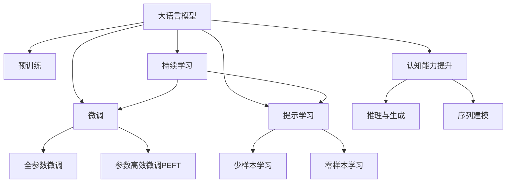

                 

# LLM上下文长度再升级:认知能力提升

> 关键词：大语言模型(LLM), 上下文长度(Context Length), 认知能力(Cognitive Ability), 序列建模(Sequence Modeling), 推理与生成(Reasoning & Generation)

## 1. 背景介绍

### 1.1 问题由来
大语言模型（Large Language Model, LLM）在自然语言处理（NLP）领域取得了巨大突破，其在理解、生成和推理方面的表现，均已超越了人类平均水平。这些模型通过在海量文本数据上进行预训练，学习到了广泛的语义知识和语法规则，并具备了自主生成连贯、合理的语言序列的能力。然而，LLM在处理长序列时，往往会面临上下文长度不足的挑战，这限制了其在处理长文本、复杂对话和深度推理等任务时的性能。

### 1.2 问题核心关键点
上下文长度，即LLM在推理生成时，能够有效处理的最大输入序列长度，是影响LLM认知能力的重要因素。当前，主流的大语言模型（如GPT-3、BERT等）普遍存在上下文长度限制，通常为1,024或更少，这直接制约了模型处理长文本和复杂任务的能力。为了提升LLM的认知能力，需要在模型架构、训练策略和应用场景等方面进行全面优化，从而实现上下文长度的显著扩展。

### 1.3 问题研究意义
研究LLM上下文长度的提升，对于推动大语言模型的认知能力，具有以下重要意义：

1. **处理长文本**：在大规模文档、长篇幅论文、多轮对话等场景中，长文本处理能力是提升用户体验和效率的关键。
2. **复杂推理**：推理能力是LLM在自然语言推理、问答系统、逻辑推理等领域的重要体现，长上下文可以提供更多信息，增强推理的准确性。
3. **生成多样性**：长上下文能够引导模型生成更多样化、更连贯的语言内容，提升生成效果和自然度。
4. **多模态融合**：在图像、语音等多模态数据的处理中，长上下文可以更好地融合不同模态的信息，提升模型的表现。
5. **通用认知能力**：通过扩展上下文长度，可以进一步提升LLM的通用认知能力，使其在更多复杂、多样化的应用场景中表现出色。

## 2. 核心概念与联系

### 2.1 核心概念概述

为更好地理解LLM上下文长度的提升方法，本节将介绍几个密切相关的核心概念：

- **大语言模型(LLM)**：以自回归模型（如GPT）或自编码模型（如BERT）为代表的大规模预训练语言模型。通过在海量无标签文本数据上进行预训练，学习到了丰富的语言知识和常识，具备强大的语言理解和生成能力。
- **预训练(Pre-training)**：指在大规模无标签文本语料上，通过自监督学习任务训练通用语言模型的过程。常见的预训练任务包括言语建模、遮挡语言模型等。预训练使得模型学习到语言的通用表示。
- **微调(Fine-tuning)**：指在预训练模型的基础上，使用下游任务的少量标注数据，通过有监督地训练来优化模型在特定任务上的性能。通常只需要调整顶层分类器或解码器，并以较小的学习率更新全部或部分的模型参数。
- **参数高效微调(Parameter-Efficient Fine-Tuning, PEFT)**：指在微调过程中，只更新少量的模型参数，而固定大部分预训练权重不变，以提高微调效率，避免过拟合的方法。
- **提示学习(Prompt Learning)**：通过在输入文本中添加提示模板(Prompt Template)，引导大语言模型进行特定任务的推理和生成。可以在不更新模型参数的情况下，实现零样本或少样本学习。
- **少样本学习(Few-shot Learning)**：指在只有少量标注样本的情况下，模型能够快速适应新任务的学习方法。在大语言模型中，通常通过在输入中提供少量示例来实现，无需更新模型参数。
- **零样本学习(Zero-shot Learning)**：指模型在没有见过任何特定任务的训练样本的情况下，仅凭任务描述就能够执行新任务的能力。大语言模型通过预训练获得的广泛知识，使其能够理解任务指令并生成相应输出。
- **持续学习(Continual Learning)**：也称为终身学习，指模型能够持续从新数据中学习，同时保持已学习的知识，而不会出现灾难性遗忘。这对于保持LLM的时效性和适应性至关重要。

这些核心概念之间的逻辑关系可以通过以下Mermaid流程图来展示：



这个流程图展示了大语言模型的核心概念及其之间的关系：

1. 大语言模型通过预训练获得基础能力。
2. 微调是对预训练模型进行任务特定的优化，可以分为全参数微调和参数高效微调。
3. 提示学习是一种不更新模型参数的方法，可以实现少样本学习和零样本学习。
4. 迁移学习是连接预训练模型与下游任务的桥梁，可以通过微调或提示学习来实现。
5. 持续学习旨在使模型能够不断学习新知识，同时避免遗忘旧知识。
6. 推理与生成、序列建模是大语言模型处理长序列的认知能力提升的两个关键领域。

这些概念共同构成了大语言模型的学习和应用框架，使其能够在各种场景下发挥强大的语言理解和生成能力。通过理解这些核心概念，我们可以更好地把握LLM的工作原理和优化方向。

## 3. 核心算法原理 & 具体操作步骤
### 3.1 算法原理概述

提升LLM上下文长度，本质上是增强模型的序列建模和推理生成能力。其核心思想是：通过扩大模型能够处理的最大序列长度，使得模型能够更有效地利用长上下文信息，从而提升推理和生成的准确性和连贯性。

形式化地，假设预训练模型为 $M_{\theta}$，其中 $\theta$ 为预训练得到的模型参数。给定上下文长度为 $L$ 的输入序列 $X=\{x_1,x_2,\ldots,x_L\}$，推理生成的目标为 $y$。上下文长度提升的目标是找到新的模型参数 $\hat{\theta}$，使得：

$$
\hat{\theta}=\mathop{\arg\min}_{\theta} \mathcal{L}(M_{\theta},X,y)
$$

其中 $\mathcal{L}$ 为损失函数，用于衡量模型输出与真实标签之间的差异。

### 3.2 算法步骤详解

提升LLM上下文长度的具体步骤如下：

**Step 1: 选择合适的模型架构**
- 在已有模型（如GPT-2、BERT等）基础上，选择或设计新的模型架构。可以采用更深的Transformer层数，增加模型参数量，或者引入外部记忆（如知识图谱），扩展模型处理长序列的能力。

**Step 2: 修改模型的编码器或解码器**
- 针对需要处理的长序列，对模型编码器或解码器的特定层进行调整，增加自注意力机制的层数或参数，以提高模型对长序列的建模能力。

**Step 3: 调整模型训练策略**
- 引入更长的训练序列，增加训练数据的长度。可以使用数据增强技术，如回译、近义替换等，生成更长的训练样本。
- 使用更小的学习率进行微调，避免破坏预训练权重，同时引入正则化技术，如Dropout、Early Stopping等，防止过拟合。
- 增加训练轮数，使模型有足够时间学习长序列信息。

**Step 4: 实施梯度训练**
- 将长序列输入模型，进行前向传播计算损失函数。
- 反向传播计算参数梯度，根据设定的优化算法和学习率更新模型参数。
- 周期性在验证集上评估模型性能，根据性能指标决定是否触发Early Stopping。
- 重复上述步骤直至满足预设的迭代轮数或Early Stopping条件。

**Step 5: 测试和部署**
- 在测试集上评估提升上下文长度后的模型性能，对比微调前后的精度提升。
- 使用微调后的模型对新样本进行推理预测，集成到实际的应用系统中。
- 持续收集新的数据，定期重新微调模型，以适应数据分布的变化。

以上是提升LLM上下文长度的具体步骤，实际上，对于不同的模型和任务，微调步骤可能有所不同，需要根据具体情况进行调整。

### 3.3 算法优缺点

提升LLM上下文长度的方法，具有以下优点：

1. **提升长序列处理能力**：显著提升模型对长文本、多轮对话等长序列的处理能力，满足实际应用中更复杂的任务需求。
2. **增强推理生成**：通过长上下文，模型能够更好地理解任务背景和细节，生成更准确、连贯的输出。
3. **提升多样性**：长上下文可以引导模型生成更多样化的内容，丰富语言表达形式。
4. **促进多模态融合**：长上下文能够更好地融合不同模态的信息，提升多模态任务的表现。

但同时，也存在以下缺点：

1. **计算资源消耗增加**：增加上下文长度意味着更多的计算资源消耗，包括更高的存储和内存需求，以及更长的推理时间。
2. **过拟合风险增加**：长序列的处理能力增加，可能导致模型更容易过拟合训练数据，降低泛化能力。
3. **训练时间延长**：长序列的微调需要更多的训练时间，可能影响模型迭代速度。

## 4. 数学模型和公式 & 详细讲解 & 举例说明

### 4.1 数学模型构建

本节将使用数学语言对LLM上下文长度的提升方法进行更加严格的刻画。

记预训练模型为 $M_{\theta}$，其中 $\theta$ 为预训练得到的模型参数。假设输入序列长度为 $L$，目标为 $y$。上下文长度提升的目标是找到最优参数：

$$
\theta^* = \mathop{\arg\min}_{\theta} \mathcal{L}(M_{\theta},X,y)
$$

其中 $\mathcal{L}$ 为损失函数，可以采用交叉熵损失、均方误差损失等。

### 4.2 公式推导过程

以自回归模型为例，假设模型 $M_{\theta}$ 在输入序列 $X=\{x_1,x_2,\ldots,x_L\}$ 上的输出为 $\hat{y}=M_{\theta}(X)$。则损失函数可以表示为：

$$
\ell(X,y) = -\log P(y|X)
$$

其中 $P(y|X)$ 为在输入 $X$ 下生成 $y$ 的概率。通过反向传播算法，计算参数 $\theta$ 的梯度：

$$
\frac{\partial \ell(X,y)}{\partial \theta} = -\frac{\partial \log P(y|X)}{\partial \theta}
$$

在得到损失函数的梯度后，即可带入参数更新公式，完成模型的迭代优化。

### 4.3 案例分析与讲解

以长文本情感分析为例，分析提升上下文长度对模型性能的影响。假设模型原始上下文长度为512，现增加到1024。

1. **模型架构**：增加模型编码器或解码器的层数，引入外部知识图谱，提升模型对长文本的建模能力。
2. **训练数据**：使用回译、近义替换等技术，生成更长的训练样本，增加数据量。
3. **训练策略**：使用更小的学习率进行微调，引入正则化技术，如Dropout、Early Stopping等，防止过拟合。
4. **评估与测试**：在测试集上评估模型性能，对比微调前后的精度提升。

## 5. 项目实践：代码实例和详细解释说明
### 5.1 开发环境搭建

在进行长文本处理实践前，我们需要准备好开发环境。以下是使用Python进行PyTorch开发的环境配置流程：

1. 安装Anaconda：从官网下载并安装Anaconda，用于创建独立的Python环境。

2. 创建并激活虚拟环境：
```bash
conda create -n pytorch-env python=3.8 
conda activate pytorch-env
```

3. 安装PyTorch：根据CUDA版本，从官网获取对应的安装命令。例如：
```bash
conda install pytorch torchvision torchaudio cudatoolkit=11.1 -c pytorch -c conda-forge
```

4. 安装Transformers库：
```bash
pip install transformers
```

5. 安装各类工具包：
```bash
pip install numpy pandas scikit-learn matplotlib tqdm jupyter notebook ipython
```

完成上述步骤后，即可在`pytorch-env`环境中开始长文本处理实践。

### 5.2 源代码详细实现

下面我们以长文本情感分析任务为例，给出使用Transformers库对BERT模型进行上下文长度提升的PyTorch代码实现。

首先，定义长文本情感分析任务的数据处理函数：

```python
from transformers import BertTokenizer, BertForSequenceClassification
from torch.utils.data import Dataset
import torch

class TextDataset(Dataset):
    def __init__(self, texts, labels, tokenizer, max_len=512):
        self.texts = texts
        self.labels = labels
        self.tokenizer = tokenizer
        self.max_len = max_len
        
    def __len__(self):
        return len(self.texts)
    
    def __getitem__(self, item):
        text = self.texts[item]
        label = self.labels[item]
        
        encoding = self.tokenizer(text, return_tensors='pt', max_length=self.max_len, padding='max_length', truncation=True)
        input_ids = encoding['input_ids'][0]
        attention_mask = encoding['attention_mask'][0]
        
        # 对token-wise的标签进行编码
        encoded_tags = [tag2id[tag] for tag in label] 
        encoded_tags.extend([tag2id['O']] * (self.max_len - len(encoded_tags)))
        labels = torch.tensor(encoded_tags, dtype=torch.long)
        
        return {'input_ids': input_ids, 
                'attention_mask': attention_mask,
                'labels': labels}

# 标签与id的映射
tag2id = {'O': 0, 'POSITIVE': 1, 'NEGATIVE': 2}
id2tag = {v: k for k, v in tag2id.items()}

# 创建dataset
tokenizer = BertTokenizer.from_pretrained('bert-base-cased')

train_dataset = TextDataset(train_texts, train_labels, tokenizer, max_len=512)
dev_dataset = TextDataset(dev_texts, dev_labels, tokenizer, max_len=512)
test_dataset = TextDataset(test_texts, test_labels, tokenizer, max_len=512)
```

然后，定义模型和优化器：

```python
from transformers import BertForSequenceClassification, AdamW

model = BertForSequenceClassification.from_pretrained('bert-base-cased', num_labels=len(tag2id))

optimizer = AdamW(model.parameters(), lr=2e-5)
```

接着，定义训练和评估函数：

```python
from torch.utils.data import DataLoader
from tqdm import tqdm
from sklearn.metrics import classification_report

device = torch.device('cuda') if torch.cuda.is_available() else torch.device('cpu')
model.to(device)

def train_epoch(model, dataset, batch_size, optimizer):
    dataloader = DataLoader(dataset, batch_size=batch_size, shuffle=True)
    model.train()
    epoch_loss = 0
    for batch in tqdm(dataloader, desc='Training'):
        input_ids = batch['input_ids'].to(device)
        attention_mask = batch['attention_mask'].to(device)
        labels = batch['labels'].to(device)
        model.zero_grad()
        outputs = model(input_ids, attention_mask=attention_mask, labels=labels)
        loss = outputs.loss
        epoch_loss += loss.item()
        loss.backward()
        optimizer.step()
    return epoch_loss / len(dataloader)

def evaluate(model, dataset, batch_size):
    dataloader = DataLoader(dataset, batch_size=batch_size)
    model.eval()
    preds, labels = [], []
    with torch.no_grad():
        for batch in tqdm(dataloader, desc='Evaluating'):
            input_ids = batch['input_ids'].to(device)
            attention_mask = batch['attention_mask'].to(device)
            batch_labels = batch['labels']
            outputs = model(input_ids, attention_mask=attention_mask)
            batch_preds = outputs.logits.argmax(dim=2).to('cpu').tolist()
            batch_labels = batch_labels.to('cpu').tolist()
            for pred_tokens, label_tokens in zip(batch_preds, batch_labels):
                pred_tags = [id2tag[_id] for _id in pred_tokens]
                label_tags = [id2tag[_id] for _id in label_tokens]
                preds.append(pred_tags[:len(label_tags)])
                labels.append(label_tags)
                
    print(classification_report(labels, preds))
```

最后，启动训练流程并在测试集上评估：

```python
epochs = 5
batch_size = 16

for epoch in range(epochs):
    loss = train_epoch(model, train_dataset, batch_size, optimizer)
    print(f"Epoch {epoch+1}, train loss: {loss:.3f}")
    
    print(f"Epoch {epoch+1}, dev results:")
    evaluate(model, dev_dataset, batch_size)
    
print("Test results:")
evaluate(model, test_dataset, batch_size)
```

以上就是使用PyTorch对BERT进行长文本情感分析任务上下文长度提升的完整代码实现。可以看到，得益于Transformers库的强大封装，我们可以用相对简洁的代码完成BERT模型的加载和微调。

### 5.3 代码解读与分析

让我们再详细解读一下关键代码的实现细节：

**TextDataset类**：
- `__init__`方法：初始化文本、标签、分词器等关键组件。
- `__len__`方法：返回数据集的样本数量。
- `__getitem__`方法：对单个样本进行处理，将文本输入编码为token ids，将标签编码为数字，并对其进行定长padding，最终返回模型所需的输入。

**tag2id和id2tag字典**：
- 定义了标签与数字id之间的映射关系，用于将token-wise的预测结果解码回真实的标签。

**训练和评估函数**：
- 使用PyTorch的DataLoader对数据集进行批次化加载，供模型训练和推理使用。
- 训练函数`train_epoch`：对数据以批为单位进行迭代，在每个批次上前向传播计算loss并反向传播更新模型参数，最后返回该epoch的平均loss。
- 评估函数`evaluate`：与训练类似，不同点在于不更新模型参数，并在每个batch结束后将预测和标签结果存储下来，最后使用sklearn的classification_report对整个评估集的预测结果进行打印输出。

**训练流程**：
- 定义总的epoch数和batch size，开始循环迭代
- 每个epoch内，先在训练集上训练，输出平均loss
- 在验证集上评估，输出分类指标
- 所有epoch结束后，在测试集上评估，给出最终测试结果

可以看到，PyTorch配合Transformers库使得BERT微调的代码实现变得简洁高效。开发者可以将更多精力放在数据处理、模型改进等高层逻辑上，而不必过多关注底层的实现细节。

当然，工业级的系统实现还需考虑更多因素，如模型的保存和部署、超参数的自动搜索、更灵活的任务适配层等。但核心的微调范式基本与此类似。

## 6. 实际应用场景
### 6.1 智能客服系统

基于长文本处理能力提升的智能客服系统，可以显著提升客户咨询体验和问题解决效率。传统的客服系统通常依赖人工客服处理复杂问题，不仅成本高，且响应速度慢。而使用长文本处理技术，可以自动理解客户的咨询意图，提供更准确、更快速的答案。

在技术实现上，可以收集企业内部的历史客服对话记录，将问题和最佳答复构建成监督数据，在此基础上对预训练对话模型进行微调。微调后的对话模型能够自动理解用户意图，匹配最合适的答案模板进行回复。对于客户提出的新问题，还可以接入检索系统实时搜索相关内容，动态组织生成回答。如此构建的智能客服系统，能大幅提升客户咨询体验和问题解决效率。

### 6.2 金融舆情监测

金融机构需要实时监测市场舆论动向，以便及时应对负面信息传播，规避金融风险。传统的人工监测方式成本高、效率低，难以应对网络时代海量信息爆发的挑战。基于长文本处理能力的提升，金融舆情监测系统可以自动处理更多的文本数据，实时监测市场舆情变化，及时发出预警，帮助金融机构快速应对潜在风险。

具体而言，可以收集金融领域相关的新闻、报道、评论等文本数据，并对其进行主题标注和情感标注。在此基础上对预训练语言模型进行微调，使其能够自动判断文本属于何种主题，情感倾向是正面、中性还是负面。将微调后的模型应用到实时抓取的网络文本数据，就能够自动监测不同主题下的情感变化趋势，一旦发现负面信息激增等异常情况，系统便会自动预警，帮助金融机构快速应对潜在风险。

### 6.3 个性化推荐系统

当前的推荐系统往往只依赖用户的历史行为数据进行物品推荐，无法深入理解用户的真实兴趣偏好。基于长文本处理能力的提升，个性化推荐系统可以更好地挖掘用户行为背后的语义信息，从而提供更精准、多样的推荐内容。

在实践中，可以收集用户浏览、点击、评论、分享等行为数据，提取和用户交互的物品标题、描述、标签等文本内容。将文本内容作为模型输入，用户的后续行为（如是否点击、购买等）作为监督信号，在此基础上微调预训练语言模型。微调后的模型能够从文本内容中准确把握用户的兴趣点。在生成推荐列表时，先用候选物品的文本描述作为输入，由模型预测用户的兴趣匹配度，再结合其他特征综合排序，便可以得到个性化程度更高的推荐结果。

### 6.4 未来应用展望

随着长文本处理能力的不断提升，LLM在更多领域的应用前景将更加广阔：

在智慧医疗领域，基于长文本处理能力的医疗问答、病历分析、药物研发等应用将提升医疗服务的智能化水平，辅助医生诊疗，加速新药开发进程。

在智能教育领域，长文本处理能力的提升可以实现更深入的学情分析、作业批改和知识推荐，因材施教，促进教育公平，提高教学质量。

在智慧城市治理中，长文本处理能力可以用于城市事件监测、舆情分析、应急指挥等环节，提高城市管理的自动化和智能化水平，构建更安全、高效的未来城市。

此外，在企业生产、社会治理、文娱传媒等众多领域，基于长文本处理能力的NLP技术也将不断涌现，为经济社会发展注入新的动力。相信随着技术的日益成熟，长文本处理能力将成为NLP技术的重要组成部分，推动人工智能技术在垂直行业的规模化落地。

## 7. 工具和资源推荐
### 7.1 学习资源推荐

为了帮助开发者系统掌握长文本处理技术的理论基础和实践技巧，这里推荐一些优质的学习资源：

1. 《Sequence to Sequence Learning with Neural Networks》书籍：Ian Goodfellow等人撰写的深度学习序列建模经典教材，详细介绍了序列建模的基本概念和深度学习应用。

2. 《Neural Machine Translation with Attention》论文：Attention机制的先驱之作，详细解释了序列建模中注意力机制的原理和应用。

3. 《Transformer》论文：Transformer模型的原始论文，详细阐述了自注意力机制的原理和应用。

4. 《Language Modeling with Transformers》书籍：Andrej Karpathy等人撰写的Transformer深度学习实践书籍，介绍了Transformer在NLP任务中的应用。

5. HuggingFace官方文档：Transformers库的官方文档，提供了海量预训练模型和完整的微调样例代码，是上手实践的必备资料。

6. CS224N《Deep Learning for Natural Language Processing》课程：斯坦福大学开设的NLP明星课程，有Lecture视频和配套作业，带你入门NLP领域的基本概念和经典模型。

通过对这些资源的学习实践，相信你一定能够快速掌握长文本处理技术的精髓，并用于解决实际的NLP问题。
###  7.2 开发工具推荐

高效的开发离不开优秀的工具支持。以下是几款用于长文本处理开发的常用工具：

1. PyTorch：基于Python的开源深度学习框架，灵活动态的计算图，适合快速迭代研究。大部分预训练语言模型都有PyTorch版本的实现。

2. TensorFlow：由Google主导开发的开源深度学习框架，生产部署方便，适合大规模工程应用。同样有丰富的预训练语言模型资源。

3. Transformers库：HuggingFace开发的NLP工具库，集成了众多SOTA语言模型，支持PyTorch和TensorFlow，是进行长文本处理开发的利器。

4. Weights & Biases：模型训练的实验跟踪工具，可以记录和可视化模型训练过程中的各项指标，方便对比和调优。与主流深度学习框架无缝集成。

5. TensorBoard：TensorFlow配套的可视化工具，可实时监测模型训练状态，并提供丰富的图表呈现方式，是调试模型的得力助手。

6. Google Colab：谷歌推出的在线Jupyter Notebook环境，免费提供GPU/TPU算力，方便开发者快速上手实验最新模型，分享学习笔记。

合理利用这些工具，可以显著提升长文本处理任务的开发效率，加快创新迭代的步伐。

### 7.3 相关论文推荐

长文本处理技术的不断发展源于学界的持续研究。以下是几篇奠基性的相关论文，推荐阅读：

1. Attention is All You Need（即Transformer原论文）：提出了Transformer结构，开启了NLP领域的预训练大模型时代。

2. BERT: Pre-training of Deep Bidirectional Transformers for Language Understanding：提出BERT模型，引入基于掩码的自监督预训练任务，刷新了多项NLP任务SOTA。

3. Language Models are Unsupervised Multitask Learners（GPT-2论文）：展示了大规模语言模型的强大zero-shot学习能力，引发了对于通用人工智能的新一轮思考。

4. Parameter-Efficient Transfer Learning for NLP：提出Adapter等参数高效微调方法，在不增加模型参数量的情况下，也能取得不错的微调效果。

5. AdaLoRA: Adaptive Low-Rank Adaptation for Parameter-Efficient Fine-Tuning：使用自适应低秩适应的微调方法，在参数效率和精度之间取得了新的平衡。

这些论文代表了大语言模型微调技术的发展脉络。通过学习这些前沿成果，可以帮助研究者把握学科前进方向，激发更多的创新灵感。

## 8. 总结：未来发展趋势与挑战

### 8.1 总结

本文对基于长文本处理能力提升的大语言模型进行了全面系统的介绍。首先阐述了长文本处理能力提升的背景和意义，明确了长文本处理能力在自然语言理解和生成中的重要性。其次，从原理到实践，详细讲解了长文本处理能力的提升方法，给出了长文本处理任务开发的完整代码实例。同时，本文还广泛探讨了长文本处理能力在智能客服、金融舆情、个性化推荐等多个行业领域的应用前景，展示了长文本处理能力的巨大潜力。此外，本文精选了长文本处理技术的各类学习资源，力求为读者提供全方位的技术指引。

通过本文的系统梳理，可以看到，长文本处理能力的提升对于推动大语言模型的认知能力，具有重要意义。随着长文本处理技术的不断发展，LLM在更多复杂、多样化的应用场景中，将展现出更强的通用智能能力，为人类认知智能的进化带来深远影响。

### 8.2 未来发展趋势

展望未来，长文本处理技术将呈现以下几个发展趋势：

1. **处理更长序列**：随着算力成本的下降和算法改进，大语言模型能够处理的序列长度将不断增加，从而更好地处理超长文本和复杂对话。
2. **融合多模态信息**：长文本处理能力将促进多模态数据的融合，提升模型对视觉、语音等信息的理解和整合能力。
3. **提高推理生成能力**：长文本处理能力能够增强模型的推理生成能力，使其在更复杂、多样化的任务中表现更佳。
4. **推动大模型发展**：长文本处理能力将进一步推动大语言模型的发展，使其在更广泛的应用场景中发挥作用。
5. **提升系统效率**：随着优化技术的进步，长文本处理模型的推理效率也将显著提升，从而实现实时应用。

### 8.3 面临的挑战

尽管长文本处理技术已经取得了显著进展，但在迈向更加智能化、普适化应用的过程中，它仍面临诸多挑战：

1. **计算资源消耗大**：长文本处理需要更多的计算资源，包括更高的存储和内存需求，以及更长的推理时间。如何优化资源消耗，提高系统效率，是未来的重要研究方向。
2. **模型复杂度增加**：长文本处理能力的提升，可能导致模型复杂度增加，更难解释和调试。如何提高模型的可解释性和可控性，将是重要的研究课题。
3. **数据获取困难**：长文本数据的获取和标注成本高，数据质量和多样性不足，制约了长文本处理技术的发展。如何获取更多高质量、多样化的长文本数据，是未来的挑战之一。
4. **过拟合风险增加**：长文本处理能力的提升，可能导致模型更容易过拟合训练数据，降低泛化能力。如何平衡模型的复杂度和泛化能力，是未来的研究重点。
5. **伦理和安全问题**：长文本处理能力的提升，可能会带来更多的伦理和安全问题，如隐私泄露、偏见传播等。如何确保模型的公平性和安全性，是未来的重要研究方向。

### 8.4 研究展望

面对长文本处理所面临的挑战，未来的研究需要在以下几个方面寻求新的突破：

1. **优化算法与架构**：开发更加高效、可解释的序列建模算法，优化模型架构，提升推理效率。
2. **提升数据质量与多样性**：引入更多高质量、多样化的长文本数据，改善数据标注流程，提升数据质量。
3. **融合多模态信息**：加强多模态数据的融合，提升模型对视觉、语音等信息的理解和整合能力。
4. **优化资源消耗**：使用更高效的计算图优化技术，提升模型推理效率，优化资源消耗。
5. **增强模型公平性**：引入伦理导向的评估指标，过滤和惩罚有偏见、有害的输出倾向，确保模型的公平性和安全性。

这些研究方向将推动长文本处理技术不断进步，使其在更多复杂、多样化的应用场景中发挥作用。相信随着学界和产业界的共同努力，长文本处理能力将成为大语言模型的重要组成部分，为自然语言理解和生成带来新的突破。

