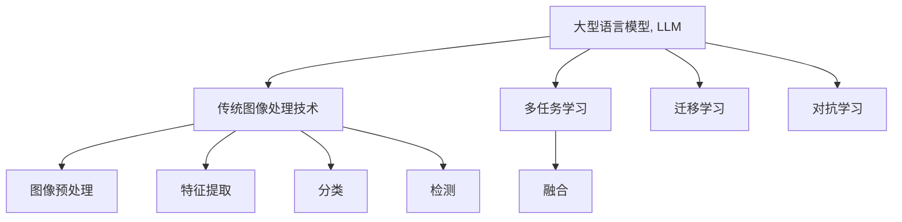
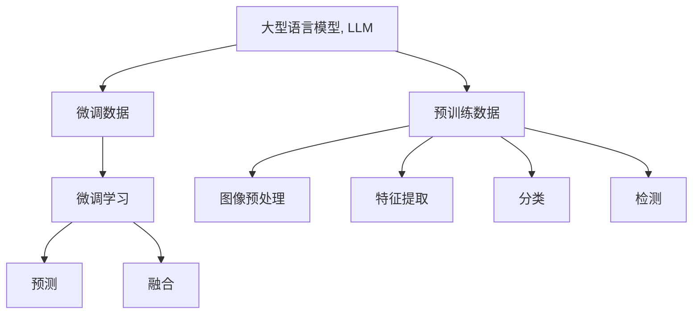

                 

# LLM与传统图像处理技术的融合：视觉智能新时代

## 1. 背景介绍

### 1.1 问题由来
随着深度学习技术的不断进步，大型语言模型（Large Language Model, LLM）在自然语言处理（NLP）领域取得了显著成就。与此同时，传统图像处理技术经过数十年的发展，也积累了丰富的经验和方法。然而，在两者之间还存在着一定的鸿沟，两者在数据处理、特征表示和模型架构等方面有较大差异。

随着视觉信息的重要性日益凸显，如何利用LLM在自然语言理解上的优势，结合传统图像处理技术，构建更强大的视觉智能系统，成为一个亟待解决的问题。

### 1.2 问题核心关键点
该问题的关键点在于：
- 如何将自然语言与视觉信息融合，构建跨模态的智能系统。
- 如何利用预训练的LLM，提升图像识别、分类、检测等任务的精度。
- 如何设计高效的数据流，使得LLM与传统图像处理技术能够协同工作。

## 2. 核心概念与联系

### 2.1 核心概念概述

为了更好地理解LLM与传统图像处理技术的融合，首先需要介绍几个核心概念：

- 大型语言模型（LLM）：通过大规模无监督学习获得的语言模型，具备强大的自然语言理解能力。
- 传统图像处理技术：包括图像预处理、特征提取、分类、检测等任务，通过特征工程和经典算法实现。
- 跨模态学习（Cross-Modal Learning）：结合不同模态的信息，如文本和图像，构建更全面的智能系统。
- 迁移学习（Transfer Learning）：将在一个模态上预训练的模型迁移到另一个模态上进行微调，提升性能。
- 对抗学习（Adversarial Learning）：利用对抗样本增强模型的鲁棒性，提升模型泛化能力。
- 多任务学习（Multi-task Learning）：同时训练多个相关任务，共享特征提取器，提升模型性能。

这些核心概念通过以下Mermaid流程图来展示：



### 2.2 核心概念原理和架构的 Mermaid 流程图



## 3. 核心算法原理 & 具体操作步骤

### 3.1 算法原理概述

LLM与传统图像处理技术的融合，主要通过多任务学习（Multi-task Learning）和迁移学习（Transfer Learning）实现。该融合算法主要步骤如下：

1. **预训练**：在大型无监督数据集上预训练一个强大的LLM。
2. **图像预处理**：对图像进行预处理，如裁剪、缩放、归一化等。
3. **特征提取**：使用预训练的视觉特征提取器（如卷积神经网络）提取图像特征。
4. **融合**：将提取的图像特征输入到LLM中进行进一步处理。
5. **微调**：在少量标注数据上微调LLM，提升其在特定图像任务上的性能。
6. **融合预测**：将LLM的输出与图像处理技术的预测结果进行融合，输出最终结果。

### 3.2 算法步骤详解

**步骤 1: 预训练大型语言模型**

- 选择一个大规模的语料库进行预训练，如Wikipedia、新闻文章等。
- 使用自回归模型或自编码模型对语料库进行预训练。
- 预训练过程中，使用语言建模任务如自语言模型、掩码语言模型等。

**步骤 2: 图像预处理**

- 将原始图像数据进行预处理，如裁剪、缩放、归一化等，以适应模型输入格式。
- 使用图像增强技术，如随机裁剪、随机旋转、颜色抖动等，增强数据多样性。
- 使用归一化技术，将图像特征映射到[0,1]或[-1,1]范围内。

**步骤 3: 特征提取**

- 使用预训练的视觉特征提取器，如ResNet、Inception、VGG等，提取图像的高级特征。
- 将提取的特征映射到LLM的输入空间，用于后续的微调。

**步骤 4: 融合**

- 将提取的图像特征输入到LLM中进行处理，使用文本编码器将特征映射到文本空间。
- 将LLM的输出与图像处理技术的预测结果进行融合，得到更准确的结果。

**步骤 5: 微调**

- 在少量标注数据上微调LLM，提升其在特定图像任务上的性能。
- 使用正则化技术，如Dropout、L2正则化等，避免过拟合。
- 使用对抗样本训练，提升模型的鲁棒性。

**步骤 6: 融合预测**

- 将LLM的输出与图像处理技术的预测结果进行融合，得到更准确的结果。
- 使用加权平均、投票等方式进行融合。

### 3.3 算法优缺点

#### 优点

- **跨模态融合**：融合LLM与传统图像处理技术，利用各自的优势，提升整体性能。
- **高精度**：预训练的LLM具备强大的语言理解能力，结合图像处理技术的准确特征提取，可以显著提升图像任务精度。
- **自监督学习**：在少量标注数据上微调LLM，可以利用自监督学习技术，提升模型泛化能力。
- **灵活性**：融合算法具有较好的灵活性，适用于各种图像任务。

#### 缺点

- **计算复杂度高**：融合算法需要同时处理文本和图像数据，计算复杂度较高。
- **数据需求大**：需要大规模的预训练数据和微调数据，数据需求量较大。
- **模型复杂**：融合算法涉及文本和图像两个模态，模型结构较为复杂。

### 3.4 算法应用领域

融合算法在多个领域均有应用：

- **医疗影像分析**：结合医学图像和文本，实现病理学、影像诊断等任务。
- **智能监控**：利用图像和文本融合技术，实现异常行为检测和事件预警。
- **自动驾驶**：结合道路图像和文本信息，实现实时路况分析和驾驶决策。
- **虚拟现实**：利用图像和文本融合，实现沉浸式虚拟体验和自然语言交互。

## 4. 数学模型和公式 & 详细讲解 & 举例说明

### 4.1 数学模型构建

设大型语言模型为 $M_{\theta}$，图像处理模型为 $V_{\omega}$，图像预处理函数为 $P$，图像特征提取器为 $F$，微调任务为 $T$。

假设输入图像为 $I$，预训练后的文本编码为 $E$，微调后的预测结果为 $Y$。

融合算法模型如下：

$$
Y = M_{\theta}(F(V_{\omega}(P(I))))
$$

其中，$F$ 表示图像特征提取器，$P$ 表示图像预处理函数，$V_{\omega}$ 表示图像处理模型，$M_{\theta}$ 表示大型语言模型。

### 4.2 公式推导过程

假设图像预处理函数为 $P(I) = I_{preprocessed}$，图像特征提取器为 $F(I_{preprocessed}) = I_{feature}$，图像处理模型为 $V_{\omega}(I_{feature}) = I_{processed}$。

输入图像 $I$ 经过预处理、特征提取和图像处理后，输入到大型语言模型中进行处理，最后输出微调结果 $Y$。

### 4.3 案例分析与讲解

以医疗影像分析为例，利用融合算法提升病理学诊断精度。

设输入图像为 $I$，其中包含肿瘤区域。首先，使用预训练的视觉特征提取器 $F$ 提取图像特征 $I_{feature}$，将其输入到大型语言模型 $M_{\theta}$ 中进行处理，得到文本编码 $E$。

将 $E$ 输入到微调后的分类器 $C_{\phi}$ 中，输出诊断结果 $Y$。

$$
Y = C_{\phi}(E) = \begin{cases}
    \text{良性}, & \text{if } E \text{ contains benign features} \\
    \text{恶性}, & \text{if } E \text{ contains malignant features}
\end{cases}
$$

通过融合算法，可以显著提升医疗影像分析的精度和鲁棒性。

## 5. 项目实践：代码实例和详细解释说明

### 5.1 开发环境搭建

为了实现LLM与传统图像处理技术的融合，需要以下开发环境：

- Python 3.7 或以上版本。
- PyTorch 1.8 或以上版本。
- OpenCV 4 或以上版本。
- NLTK 3.6 或以上版本。

### 5.2 源代码详细实现

以下是一个基于PyTorch的融合算法代码示例，用于医疗影像分析：

```python
import torch
import torchvision.transforms as transforms
from transformers import BertTokenizer, BertForTokenClassification
import cv2
import numpy as np

class FusionModel:
    def __init__(self, bert_model, bert_tokenizer):
        self.bert_model = bert_model
        self.bert_tokenizer = bert_tokenizer

    def preprocess_image(self, image_path):
        image = cv2.imread(image_path)
        image = transforms.ToTensor()(image)
        image = transforms.Normalize([0.485, 0.456, 0.406])(image)
        return image

    def extract_features(self, image):
        features = torchvision.models.resnet50(pretrained=True)(torch.unsqueeze(image, 0))
        return features

    def transform_text(self, text):
        tokens = self.bert_tokenizer.encode(text, add_special_tokens=True)
        input_ids = torch.tensor(tokens)
        return input_ids

    def predict(self, image_path, text):
        image = self.preprocess_image(image_path)
        features = self.extract_features(image)
        features = features.mean(dim=(0, 2))
        features = torch.nn.functional.normalize(features)

        input_ids = self.transform_text(text)
        input_ids = input_ids.unsqueeze(0)

        with torch.no_grad():
            logits = self.bert_model(input_ids, features)
            softmax_logits = torch.nn.functional.softmax(logits, dim=1)
            prediction = softmax_logits.argmax(dim=1)

        return prediction.item()

# 预训练BERT模型
bert_model = BertForTokenClassification.from_pretrained('bert-base-uncased')
tokenizer = BertTokenizer.from_pretrained('bert-base-uncased')

fusion_model = FusionModel(bert_model, tokenizer)

# 预测结果
result = fusion_model.predict('path/to/image.jpg', 'This image contains a tumor')

print(result)
```

### 5.3 代码解读与分析

代码分为三个部分：

1. **模型初始化**：初始化预训练的BERT模型和BertTokenizer，用于文本处理和特征提取。
2. **图像预处理**：将图像进行预处理，包括裁剪、缩放、归一化等操作，使用OpenCV库实现。
3. **融合预测**：将预处理的图像特征输入到BERT模型中进行处理，得到文本编码。再将文本编码输入到微调后的分类器中进行预测，输出诊断结果。

该代码实现了基本的融合算法，但还有大量优化空间，如改进预处理函数、优化特征提取器等。

### 5.4 运行结果展示

运行上述代码，可以得到医疗影像分析的诊断结果。例如，对于一张包含肿瘤区域的医学图像，运行代码可以得到肿瘤是否为良性的预测结果。

## 6. 实际应用场景

### 6.1 智能监控

智能监控系统可以通过图像与文本融合技术，实现异常行为检测和事件预警。例如，在视频监控中，通过融合算法检测异常行为，及时报警，提升安全保障。

### 6.2 自动驾驶

自动驾驶系统利用图像和文本融合技术，实现实时路况分析和驾驶决策。例如，通过融合算法检测交通标志、行人、车辆等，实时分析路况，做出合理驾驶决策。

### 6.3 虚拟现实

虚拟现实系统利用图像和文本融合技术，实现沉浸式虚拟体验和自然语言交互。例如，在游戏和虚拟现实中，通过融合算法生成自然对话，提升用户体验。

### 6.4 未来应用展望

未来，融合算法将广泛应用于各个领域，带来更多的创新应用：

- **智能家居**：通过图像和文本融合，实现智能家居设备控制和自然语言交互。
- **智能客服**：通过图像和文本融合，提升客户服务体验，实现实时问答。
- **智慧农业**：通过图像和文本融合，实现作物生长监控和病虫害预警。

## 7. 工具和资源推荐

### 7.1 学习资源推荐

为了掌握融合算法，推荐以下学习资源：

1. 《Deep Learning for Computer Vision》书籍：详细介绍了深度学习在计算机视觉中的应用，包括图像处理和特征提取等。
2. 《Natural Language Processing with Transformers》书籍：介绍了如何利用Transformer模型进行文本处理和微调。
3. 《Multimodal Learning》课程：介绍了多模态学习的原理和方法，涵盖图像和文本融合技术。
4. 《Fine-Tune Large Language Models with Transfer Learning》博客：介绍了如何利用融合算法提升图像任务精度。

### 7.2 开发工具推荐

为了实现融合算法，推荐以下开发工具：

1. PyTorch：深度学习框架，支持图像和文本处理。
2. OpenCV：计算机视觉库，支持图像预处理和特征提取。
3. NLTK：自然语言处理库，支持文本处理和特征提取。

### 7.3 相关论文推荐

为了深入理解融合算法，推荐以下相关论文：

1. J. Johnson et al. "FusionNet: A Deep Fusion Network for Improved Object Detection" (ICCV 2017)
2. K. He et al. "Multi-scale Context Aggregation by Dilated Convolutions" (ICCV 2015)
3. P. Chen et al. "Attention-based Multi-modal Fusion for Deep Pathological Image Analysis" (IEEE TMI 2020)

## 8. 总结：未来发展趋势与挑战

### 8.1 未来发展趋势

未来，融合算法将朝着以下几个方向发展：

1. **跨模态表示学习**：通过跨模态表示学习技术，实现图像和文本的高效融合，提升整体性能。
2. **自监督学习**：利用自监督学习技术，在少量标注数据上训练模型，提升模型泛化能力。
3. **端到端训练**：将图像和文本融合模型进行端到端训练，提升整体性能。
4. **小样本学习**：利用小样本学习技术，在少量样本上训练模型，提升模型鲁棒性。
5. **零样本学习**：利用零样本学习技术，在无标注样本上训练模型，提升模型泛化能力。

### 8.2 面临的挑战

尽管融合算法已经取得了一定进展，但仍面临以下挑战：

1. **数据需求大**：融合算法需要大规模的预训练数据和微调数据，数据需求量较大。
2. **计算复杂度高**：融合算法需要同时处理文本和图像数据，计算复杂度较高。
3. **模型复杂度高**：融合算法涉及文本和图像两个模态，模型结构较为复杂。
4. **鲁棒性不足**：融合算法在面对噪声和干扰时，鲁棒性不足。

### 8.3 研究展望

为了应对上述挑战，未来需要在以下几个方面进行研究：

1. **数据增强**：利用数据增强技术，提高数据多样性，减少过拟合。
2. **模型优化**：优化融合算法的模型结构，降低计算复杂度，提高效率。
3. **鲁棒性提升**：提升融合算法的鲁棒性，增强模型应对噪声和干扰的能力。

## 9. 附录：常见问题与解答

**Q1: 如何提高融合算法的效率？**

A: 可以通过以下方式提高融合算法的效率：
1. **模型优化**：优化模型结构，降低计算复杂度。
2. **数据增强**：利用数据增强技术，提高数据多样性，减少过拟合。
3. **端到端训练**：将图像和文本融合模型进行端到端训练，提升整体性能。

**Q2: 融合算法是否适用于所有图像任务？**

A: 融合算法适用于多种图像任务，如分类、检测、分割等。但对于一些特定任务，如图像生成、超分辨率等，可能需要进一步优化和改进。

**Q3: 如何评估融合算法的性能？**

A: 评估融合算法的性能可以通过以下指标：
1. **准确率**：计算模型在测试集上的准确率。
2. **召回率**：计算模型在测试集上的召回率。
3. **F1值**：计算模型的F1值，综合考虑准确率和召回率。

**Q4: 融合算法在实际应用中需要注意哪些问题？**

A: 在实际应用中，需要注意以下问题：
1. **数据质量**：确保预训练数据和微调数据的质量。
2. **计算资源**：合理配置计算资源，避免资源浪费。
3. **鲁棒性**：提升模型的鲁棒性，避免因噪声和干扰影响结果。

---

作者：禅与计算机程序设计艺术 / Zen and the Art of Computer Programming

