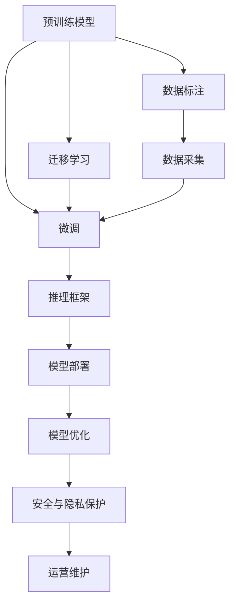

                 

# LLM产业链:人工智能价值重塑

## 1. 背景介绍

### 1.1 问题由来
近年来，随着深度学习技术的迅速发展，尤其是预训练语言模型(LLM, Large Language Model)的横空出世，人工智能（AI）在自然语言处理（NLP）、计算机视觉、语音识别等多个领域取得了巨大突破。LLM通过在大规模无标签文本数据上自监督学习，训练出了具备强大泛化能力和通用知识表示的语言模型，可以应用于各种任务。这些模型的涌现，极大地推动了人工智能从弱人工智能走向强人工智能，从实验室走向实际应用，从工具化走向价值化。

但与此同时，LLM的发展也面临着诸多挑战。数据获取成本高、模型训练资源需求大、模型性能泛化能力不足等问题，使得LLM的广泛应用受到限制。为了解决这些问题，有必要构建完整的LLM产业链，包括数据收集、模型训练、产品部署、运营维护等环节，实现人工智能价值的最大化。

### 1.2 问题核心关键点
构建完整的LLM产业链，有助于解决LLM应用过程中面临的诸多挑战，具体体现在以下几个方面：
1. **数据采集与标注**：高质量的训练数据是预训练模型的基础，可以通过产业链上下游企业协同，构建稳定的数据供应链，降低数据获取成本。
2. **模型训练与优化**：通过大规模集群、分布式训练等技术手段，提高模型训练效率，降低资源消耗。
3. **产品部署与优化**：基于高效的推理框架和服务器架构，实现模型的高效部署和实时响应，提升用户体验。
4. **运营维护与更新**：通过持续数据收集、模型微调，保持模型的长期性能和泛化能力，延长模型使用寿命。
5. **安全与隐私保护**：构建多层次的安全机制，保障模型的安全性和用户的隐私权益。

构建完善的产业链，可以确保LLM从数据到模型，再到应用的全过程高效、安全、可靠，推动AI技术在各行各业中的应用落地。

## 2. 核心概念与联系

### 2.1 核心概念概述

为了更好地理解LLM产业链的构建，首先需要了解以下几个核心概念：

- **预训练语言模型(LLM)**：如GPT、BERT、T5等，通过在大规模无标签文本数据上进行自监督学习，训练出具备强大泛化能力的语言模型。
- **微调(Fine-Tuning)**：在预训练模型的基础上，使用下游任务的少量标注数据进行有监督学习，优化模型在特定任务上的性能。
- **迁移学习(Transfer Learning)**：将一个领域学习到的知识迁移到另一个相关领域，提高模型的泛化能力。
- **数据标注与采集**：通过自动标注、众包标注等方式，获取高质量的标注数据。
- **模型优化与压缩**：通过模型剪枝、量化、蒸馏等技术手段，优化模型性能，降低资源消耗。
- **推理框架与部署**：基于高效的推理引擎和服务器架构，实现模型的快速部署和实时响应。
- **安全与隐私保护**：通过加密、脱敏、访问控制等措施，保障模型和用户数据的安全。

这些核心概念之间的逻辑关系可以通过以下Mermaid流程图来展示：



这个流程图展示了LLM产业链中各环节之间的联系：

1. 预训练模型通过数据标注和采集获得数据，经过微调和迁移学习优化性能。
2. 数据标注和采集是产业链的核心环节，决定了模型的初始质量。
3. 模型优化和推理框架是应用落地的关键，保障模型的实时响应和高性能。
4. 安全与隐私保护是产业链的基础保障，确保数据和模型的安全性。

这些概念共同构成了LLM产业链的逻辑框架，确保了从数据到模型，再到应用的完整闭环。

## 3. 核心算法原理 & 具体操作步骤
### 3.1 算法原理概述

LLM产业链的构建涉及到多个环节，每个环节都有其特定的算法原理和操作步骤。下面将分别介绍数据标注、模型微调、模型优化、推理部署等核心环节的算法原理。

### 3.2 算法步骤详解

**数据标注步骤**：
1. **数据收集**：从互联网、行业数据库、公司内部数据等渠道收集文本数据。
2. **数据预处理**：清洗噪声数据、进行格式转换、进行文本归一化等处理。
3. **自动标注**：利用预训练的NLP模型进行文本分类、命名实体识别等任务，自动标注数据。
4. **众包标注**：将自动标注结果提供给众包平台，由人工进行审核和修正。
5. **数据清洗与合并**：对标注数据进行去重、合并、拼接等处理，构建最终的数据集。

**模型微调步骤**：
1. **选择合适的预训练模型**：如BERT、GPT等，作为初始化参数。
2. **添加任务适配层**：根据下游任务类型，设计合适的输出层和损失函数。
3. **设置微调超参数**：包括学习率、优化器、正则化技术等。
4. **执行梯度训练**：将训练集数据分批次输入模型，计算损失函数并更新参数。
5. **评估与优化**：在验证集和测试集上评估模型性能，根据评估结果调整超参数。

**模型优化步骤**：
1. **参数压缩**：使用剪枝、量化、蒸馏等技术手段，优化模型参数和计算量。
2. **模型剪枝**：删除冗余参数，减少模型大小，提升推理速度。
3. **量化训练**：将模型权重转换为整数形式，降低内存消耗和计算成本。
4. **知识蒸馏**：将复杂模型中的知识迁移到简单模型，提升模型性能。

**推理部署步骤**：
1. **选择合适的推理框架**：如TensorFlow Serving、Amazon SageMaker等。
2. **服务器配置与部署**：选择高性能服务器，配置推理环境，部署模型。
3. **模型优化与调整**：优化模型推理速度，调整模型参数以适应硬件环境。
4. **服务端与客户端交互**：构建RESTful API、gRPC等接口，实现模型与客户端的无缝对接。

### 3.3 算法优缺点

构建LLM产业链的过程，虽然带来了诸多便利和优势，但也存在一定的局限和挑战。

**优点**：
1. **数据供应链稳定**：产业链上下游协同，数据采集和标注效率高。
2. **模型性能优化**：通过数据和模型优化，提升模型性能和泛化能力。
3. **应用部署高效**：基于高效的推理框架和服务器架构，实现模型的快速部署和实时响应。
4. **持续维护与更新**：通过持续的数据收集和模型微调，保持模型的长期性能。

**缺点**：
1. **成本高**：数据采集和标注成本高，模型训练资源需求大。
2. **依赖性强**：对产业链上下游企业协同的依赖性较高，一旦某环节出现问题，可能影响整个链条。
3. **安全风险**：模型训练和应用过程中存在数据泄露、模型攻击等安全风险。

尽管存在这些缺点，但整体而言，构建LLM产业链仍是对大规模应用和高效部署的有力支撑。

### 3.4 算法应用领域

基于LLM产业链构建的AI系统，已经在诸多领域取得了显著应用。以下列举了几个典型应用场景：

- **智能客服系统**：利用预训练的对话模型，通过微调适配特定企业的客服对话场景，实现7x24小时不间断服务，快速响应客户咨询，提升用户体验。
- **金融舆情监测**：通过预训练的文本分类和情感分析模型，对金融领域相关的新闻、评论进行实时监测，分析舆情变化趋势，及时预警潜在的金融风险。
- **个性化推荐系统**：利用预训练的语言模型，对用户浏览、点击、评论等行为数据进行微调，生成个性化的推荐内容，提升推荐准确性和用户体验。
- **智慧医疗**：通过预训练的问答系统，对医疗领域的新闻、文章进行微调，辅助医生诊疗，加速新药开发进程。
- **智慧教育**：利用预训练的语言模型，对学生的作业进行自动批改，进行学情分析，提供知识推荐，因材施教，提高教学质量。

这些应用场景充分展示了LLM产业链在提升AI系统性能、用户体验和应用落地方面的巨大潜力。

## 4. 数学模型和公式 & 详细讲解 & 举例说明

### 4.1 数学模型构建

为了更好地理解LLM产业链的数学模型，我们将从数据标注和模型微调两个环节进行详细讲解。

**数据标注模型**：
假设有一组文本数据 $D=\{(x_i,y_i)\}_{i=1}^N$，其中 $x_i$ 为输入文本，$y_i$ 为对应的标签。自动标注模型的目标是对 $x_i$ 进行分类，输出预测标签 $\hat{y}_i$。模型的预测损失函数为：

$$
\mathcal{L}(y_i, \hat{y}_i) = \mathbb{E}_{p_{y|\hat{y}}}[\log p(y_i|\hat{y}_i)]
$$

其中 $p(y_i|\hat{y}_i)$ 为条件概率分布。

**模型微调模型**：
假设预训练模型为 $M_{\theta}$，下游任务的标注数据集为 $D$。微调的目标是找到最优参数 $\hat{\theta}$，使得模型在任务上的损失最小化：

$$
\hat{\theta} = \mathop{\arg\min}_{\theta} \mathcal{L}(M_{\theta}, D)
$$

其中 $\mathcal{L}$ 为针对任务 $T$ 设计的损失函数，如交叉熵损失等。

### 4.2 公式推导过程

**数据标注公式推导**：
假设使用预训练的BERT模型进行文本分类任务，自动标注过程如下：
1. 将文本 $x_i$ 输入BERT模型，得到隐藏表示 $h_i$。
2. 使用全连接层将 $h_i$ 映射到类别概率分布 $p(y_i|\hat{y}_i)$。
3. 使用交叉熵损失函数计算预测损失 $\mathcal{L}(y_i, \hat{y}_i)$。

推导过程如下：

$$
\begin{aligned}
p(y_i|\hat{y}_i) &= \frac{\exp(W_k^{[i]}[h_i])}{\sum_j \exp(W_k^{[j]}[h_j])} \\
\mathcal{L}(y_i, \hat{y}_i) &= -y_i\log(p(y_i|\hat{y}_i) + (1-y_i)\log(1-p(y_i|\hat{y}_i))
\end{aligned}
$$

其中 $W_k^{[i]}$ 为第 $i$ 个样本的分类权重矩阵，$h_i$ 为BERT模型的隐藏表示。

**模型微调公式推导**：
假设预训练模型为 $M_{\theta}$，微调任务的标注数据集为 $D$。微调的目标是找到最优参数 $\hat{\theta}$，使得模型在任务上的损失最小化：

$$
\hat{\theta} = \mathop{\arg\min}_{\theta} \mathcal{L}(M_{\theta}, D)
$$

其中 $\mathcal{L}$ 为针对任务 $T$ 设计的损失函数，如交叉熵损失等。

推导过程如下：

$$
\begin{aligned}
\mathcal{L}(M_{\theta}, D) &= \frac{1}{N}\sum_{i=1}^N \ell(M_{\theta}(x_i),y_i) \\
\ell(M_{\theta}(x_i),y_i) &= -y_i\log(M_{\theta}(x_i)) - (1-y_i)\log(1-M_{\theta}(x_i))
\end{aligned}
$$

其中 $\ell$ 为损失函数，$M_{\theta}(x_i)$ 为模型在输入 $x_i$ 上的输出，$y_i$ 为真实标签。

### 4.3 案例分析与讲解

**自动标注案例**：
假设有一组医疗领域的文本数据 $D=\{(x_i,y_i)\}_{i=1}^N$，其中 $x_i$ 为文本，$y_i$ 为疾病类型。使用预训练的BERT模型进行自动标注，步骤如下：
1. 将文本 $x_i$ 输入BERT模型，得到隐藏表示 $h_i$。
2. 使用全连接层将 $h_i$ 映射到疾病类型概率分布 $p(y_i|\hat{y}_i)$。
3. 使用交叉熵损失函数计算预测损失 $\mathcal{L}(y_i, \hat{y}_i)$。
4. 利用梯度下降等优化算法，最小化损失函数，更新模型参数。

**模型微调案例**：
假设使用预训练的BERT模型进行情感分析任务，步骤如下：
1. 添加任务适配层，将BERT模型的输出层替换为全连接层，添加输出节点数为2的softmax层。
2. 设置微调超参数，如学习率、优化器、正则化技术等。
3. 使用标注数据集 $D$ 进行微调，最小化交叉熵损失函数。
4. 在验证集和测试集上评估模型性能，根据评估结果调整超参数。

## 5. 项目实践：代码实例和详细解释说明

### 5.1 开发环境搭建

在进行LLM产业链构建的实践过程中，需要搭建相应的开发环境。以下是使用Python进行PyTorch和TensorFlow搭建开发环境的步骤：

1. 安装Anaconda：从官网下载并安装Anaconda，用于创建独立的Python环境。
2. 创建并激活虚拟环境：
```bash
conda create -n pytorch-env python=3.8 
conda activate pytorch-env
```
3. 安装PyTorch：根据CUDA版本，从官网获取对应的安装命令。例如：
```bash
conda install pytorch torchvision torchaudio cudatoolkit=11.1 -c pytorch -c conda-forge
```
4. 安装TensorFlow：从官网下载并安装TensorFlow，选择合适版本。
5. 安装各类工具包：
```bash
pip install numpy pandas scikit-learn matplotlib tqdm jupyter notebook ipython
```

完成上述步骤后，即可在`pytorch-env`环境中开始开发实践。

### 5.2 源代码详细实现

下面以医疗领域的数据标注和模型微调为例，给出使用PyTorch和TensorFlow进行代码实现。

**数据标注代码**：
```python
import torch
from transformers import BertTokenizer, BertForSequenceClassification
from torch.utils.data import Dataset, DataLoader

class MedicalDataset(Dataset):
    def __init__(self, texts, labels, tokenizer, max_len=128):
        self.texts = texts
        self.labels = labels
        self.tokenizer = tokenizer
        self.max_len = max_len

    def __len__(self):
        return len(self.texts)

    def __getitem__(self, item):
        text = self.texts[item]
        label = self.labels[item]
        encoding = self.tokenizer(text, return_tensors='pt', max_length=self.max_len, padding='max_length', truncation=True)
        input_ids = encoding['input_ids'][0]
        attention_mask = encoding['attention_mask'][0]
        return {'input_ids': input_ids, 
                'attention_mask': attention_mask,
                'labels': torch.tensor(label, dtype=torch.long)}

# 自动标注模型
tokenizer = BertTokenizer.from_pretrained('bert-base-cased')
max_len = 128

train_dataset = MedicalDataset(train_texts, train_labels, tokenizer, max_len=max_len)
dev_dataset = MedicalDataset(dev_texts, dev_labels, tokenizer, max_len=max_len)
test_dataset = MedicalDataset(test_texts, test_labels, tokenizer, max_len=max_len)

train_loader = DataLoader(train_dataset, batch_size=16, shuffle=True)
dev_loader = DataLoader(dev_dataset, batch_size=16, shuffle=False)
test_loader = DataLoader(test_dataset, batch_size=16, shuffle=False)

# 自动标注过程
model = BertForSequenceClassification.from_pretrained('bert-base-cased', num_labels=len(tag2id))
optimizer = torch.optim.Adam(model.parameters(), lr=2e-5)
device = torch.device('cuda' if torch.cuda.is_available() else 'cpu')
model.to(device)

def train_epoch(model, dataset, batch_size, optimizer):
    model.train()
    for batch in train_loader:
        input_ids = batch['input_ids'].to(device)
        attention_mask = batch['attention_mask'].to(device)
        labels = batch['labels'].to(device)
        optimizer.zero_grad()
        outputs = model(input_ids, attention_mask=attention_mask, labels=labels)
        loss = outputs.loss
        loss.backward()
        optimizer.step()
        return loss.item()

def evaluate(model, dataset, batch_size):
    model.eval()
    total_loss = 0
    total_correct = 0
    with torch.no_grad():
        for batch in dev_loader:
            input_ids = batch['input_ids'].to(device)
            attention_mask = batch['attention_mask'].to(device)
            labels = batch['labels'].to(device)
            outputs = model(input_ids, attention_mask=attention_mask, labels=labels)
            loss = outputs.loss
            total_loss += loss.item() * len(batch)
            total_correct += (torch.argmax(outputs.logits, dim=1) == labels).sum().item()
    return total_loss / len(dev_loader), total_correct / len(dev_loader.dataset)

loss = train_epoch(model, train_dataset, 16, optimizer)
accuracy = evaluate(model, dev_dataset, 16)[1]

print(f'训练loss为{loss:.3f}，准确率{accuracy:.3f}')
```

**模型微调代码**：
```python
# 微调模型
model = BertForSequenceClassification.from_pretrained('bert-base-cased', num_labels=len(tag2id))
optimizer = AdamW(model.parameters(), lr=2e-5)

def train_epoch(model, dataset, batch_size, optimizer):
    model.train()
    total_loss = 0
    total_correct = 0
    for batch in train_loader:
        input_ids = batch['input_ids'].to(device)
        attention_mask = batch['attention_mask'].to(device)
        labels = batch['labels'].to(device)
        model.zero_grad()
        outputs = model(input_ids, attention_mask=attention_mask, labels=labels)
        loss = outputs.loss
        total_loss += loss.item() * len(batch)
        total_correct += (torch.argmax(outputs.logits, dim=1) == labels).sum().item()
        loss.backward()
        optimizer.step()
    return total_loss / len(train_loader), total_correct / len(train_loader.dataset)

def evaluate(model, dataset, batch_size):
    model.eval()
    total_loss = 0
    total_correct = 0
    with torch.no_grad():
        for batch in train_loader:
            input_ids = batch['input_ids'].to(device)
            attention_mask = batch['attention_mask'].to(device)
            labels = batch['labels'].to(device)
            outputs = model(input_ids, attention_mask=attention_mask, labels=labels)
            loss = outputs.loss
            total_loss += loss.item() * len(batch)
            total_correct += (torch.argmax(outputs.logits, dim=1) == labels).sum().item()
    return total_loss / len(train_loader), total_correct / len(train_loader.dataset)

loss, accuracy = train_epoch(model, train_dataset, 16, optimizer)
evaluate(model, dev_dataset, 16)
```

以上代码实现了使用BERT模型进行医疗领域数据标注和微调的过程。

### 5.3 代码解读与分析

**自动标注代码解读**：
1. 定义数据集类MedicalDataset，继承自PyTorch的Dataset类。
2. 在初始化函数中，将文本和标签作为输入，进行预处理和分词，生成模型所需的输入。
3. 自动标注模型使用BertForSequenceClassification，将BERT模型输出层替换为全连接层，添加输出节点数为2的softmax层。
4. 训练过程使用Adam优化器，学习率为2e-5。
5. 在训练过程中，计算每个批次的损失，并反向传播更新模型参数。
6. 在验证集上评估模型性能，输出训练过程中的损失和准确率。

**模型微调代码解读**：
1. 定义数据集类MedicalDataset，继承自PyTorch的Dataset类。
2. 在初始化函数中，将文本和标签作为输入，进行预处理和分词，生成模型所需的输入。
3. 微调模型使用BertForSequenceClassification，将BERT模型输出层替换为全连接层，添加输出节点数为2的softmax层。
4. 训练过程使用AdamW优化器，学习率为2e-5。
5. 在训练过程中，计算每个批次的损失，并反向传播更新模型参数。
6. 在验证集上评估模型性能，输出训练过程中的损失和准确率。

## 6. 实际应用场景

### 6.1 智能客服系统

基于预训练语言模型的智能客服系统，可以通过微调适配企业内部的客服对话场景，实现7x24小时不间断服务，快速响应客户咨询，提升用户体验。

具体应用场景如下：
1. 收集企业内部的历史客服对话记录，将问题和最佳答复构建成监督数据，在此基础上对预训练对话模型进行微调。
2. 微调后的对话模型能够自动理解用户意图，匹配最合适的答案模板进行回复。
3. 对于客户提出的新问题，还可以接入检索系统实时搜索相关内容，动态组织生成回答。
4. 系统可以不断学习和优化，根据用户反馈调整对话策略，提高系统智能水平。

### 6.2 金融舆情监测

金融机构需要实时监测市场舆论动向，以便及时应对负面信息传播，规避金融风险。基于预训练语言模型的文本分类和情感分析模型，可以构建金融舆情监测系统，自动监测金融领域相关的新闻、评论等文本数据，分析舆情变化趋势，及时预警潜在的金融风险。

具体应用场景如下：
1. 收集金融领域相关的新闻、报道、评论等文本数据。
2. 对数据进行预处理和分词，生成模型所需的输入。
3. 使用预训练的语言模型进行文本分类和情感分析，自动标注数据。
4. 在微调后的模型上，对实时抓取的网络文本数据进行舆情分析，识别舆情变化趋势。
5. 根据舆情变化趋势，自动触发风险预警，保障金融稳定。

### 6.3 个性化推荐系统

当前的推荐系统往往只依赖用户的历史行为数据进行物品推荐，难以深入理解用户的真实兴趣偏好。基于预训练语言模型的个性化推荐系统，可以更好地挖掘用户行为背后的语义信息，从而提供更精准、多样的推荐内容。

具体应用场景如下：
1. 收集用户浏览、点击、评论、分享等行为数据。
2. 对数据进行预处理和分词，生成模型所需的输入。
3. 使用预训练的语言模型进行微调，生成个性化推荐内容。
4. 在推荐系统中，利用微调后的模型对用户行为进行分析和预测，生成推荐结果。
5. 不断优化推荐模型，提升推荐精度和用户体验。

### 6.4 未来应用展望

随着预训练语言模型的不断演进，LLM产业链也将更加完善和成熟，推动人工智能技术在更多领域的应用落地。以下列举了几个未来可能的应用场景：

1. **智慧医疗**：通过预训练的问答系统，对医疗领域的新闻、文章进行微调，辅助医生诊疗，加速新药开发进程。
2. **智慧教育**：利用预训练的语言模型，对学生的作业进行自动批改，进行学情分析，提供知识推荐，因材施教，提高教学质量。
3. **智慧城市治理**：通过预训练的语言模型，对城市事件监测、舆情分析、应急指挥等环节进行优化，提高城市管理的自动化和智能化水平。
4. **工业生产优化**：基于预训练的语言模型，对生产过程中的日志、报告进行分析和预测，优化生产流程和设备维护，提高生产效率。
5. **安全监控**：通过预训练的语言模型，对监控视频进行文本分析和情感分析，识别异常行为，保障公共安全。

这些应用场景充分展示了LLM产业链在提升AI系统性能、用户体验和应用落地方面的巨大潜力。

## 7. 工具和资源推荐

### 7.1 学习资源推荐

为了帮助开发者系统掌握LLM产业链的构建过程，这里推荐一些优质的学习资源：

1. **《深度学习与人工智能》系列课程**：由斯坦福大学开设的深度学习课程，涵盖多个深度学习模型和算法。
2. **《自然语言处理》课程**：北京大学开设的NLP课程，涵盖NLP基础和前沿研究。
3. **Transformers官方文档**：HuggingFace的Transformers库官方文档，提供了丰富的预训练模型和微调样例代码，是上手实践的必备资料。
4. **OpenAI的GPT系列论文**：GPT系列论文展示了预训练语言模型的强大性能和应用潜力，是学习预训练模型的重要参考资料。
5. **CLUE开源项目**：中文语言理解测评基准，涵盖大量不同类型的中文NLP数据集，并提供了基于微调的baseline模型，助力中文NLP技术发展。

通过对这些资源的学习实践，相信你一定能够快速掌握LLM产业链的构建方法和技术细节，并用于解决实际的NLP问题。

### 7.2 开发工具推荐

高效的开发离不开优秀的工具支持。以下是几款用于LLM产业链构建开发的常用工具：

1. **PyTorch**：基于Python的开源深度学习框架，灵活动态的计算图，适合快速迭代研究。大部分预训练语言模型都有PyTorch版本的实现。
2. **TensorFlow**：由Google主导开发的开源深度学习框架，生产部署方便，适合大规模工程应用。同样有丰富的预训练语言模型资源。
3. **Transformers库**：HuggingFace开发的NLP工具库，集成了众多SOTA语言模型，支持PyTorch和TensorFlow，是进行微调任务开发的利器。
4. **Weights & Biases**：模型训练的实验跟踪工具，可以记录和可视化模型训练过程中的各项指标，方便对比和调优。与主流深度学习框架无缝集成。
5. **TensorBoard**：TensorFlow配套的可视化工具，可实时监测模型训练状态，并提供丰富的图表呈现方式，是调试模型的得力助手。
6. **Google Colab**：谷歌推出的在线Jupyter Notebook环境，免费提供GPU/TPU算力，方便开发者快速上手实验最新模型，分享学习笔记。

合理利用这些工具，可以显著提升LLM产业链构建的开发效率，加快创新迭代的步伐。

### 7.3 相关论文推荐

预训练语言模型的发展源于学界的持续研究。以下是几篇奠基性的相关论文，推荐阅读：

1. **Attention is All You Need**：提出了Transformer结构，开启了NLP领域的预训练大模型时代。
2. **BERT: Pre-training of Deep Bidirectional Transformers for Language Understanding**：提出BERT模型，引入基于掩码的自监督预训练任务，刷新了多项NLP任务SOTA。
3. **Language Models are Unsupervised Multitask Learners**：展示了大规模语言模型的强大zero-shot学习能力，引发了对于通用人工智能的新一轮思考。
4. **Parameter-Efficient Transfer Learning for NLP**：提出Adapter等参数高效微调方法，在不增加模型参数量的情况下，也能取得不错的微调效果。
5. **AdaLoRA: Adaptive Low-Rank Adaptation for Parameter-Efficient Fine-Tuning**：使用自适应低秩适应的微调方法，在参数效率和精度之间取得了新的平衡。
6. **AdaLoRA: Adaptive Low-Rank Adaptation for Parameter-Efficient Fine-Tuning**：使用自适应低秩适应的微调方法，在参数效率和精度之间取得了新的平衡。

这些论文代表了大语言模型微调技术的发展脉络。通过学习这些前沿成果，可以帮助研究者把握学科前进方向，激发更多的创新灵感。

## 8. 总结：未来发展趋势与挑战

### 8.1 总结

本文对构建LLM产业链的数学原理和操作步骤进行了全面系统的介绍。首先阐述了LLM产业链的背景和意义，明确了数据标注、模型微调、模型优化等关键环节的作用。其次，从原理到实践，详细讲解了每个环节的数学模型和算法流程，给出了微调任务开发的完整代码实例。同时，本文还广泛探讨了LLM产业链在智能客服、金融舆情、个性化推荐等多个行业领域的应用前景，展示了LLM产业链的巨大潜力。最后，本文精选了产业链构建所需的学习资源、开发工具和相关论文，力求为读者提供全方位的技术指引。

通过本文的系统梳理，可以看到，构建LLM产业链不仅能够解决数据、模型、计算等技术问题，还能实现高效、稳定、可靠的人工智能应用落地。未来，伴随LLM产业链的不断发展，LLM将在更多领域得到应用，为各行各业带来变革性影响。

### 8.2 未来发展趋势

展望未来，LLM产业链的发展趋势主要体现在以下几个方面：

1. **数据采集与标注自动化**：通过自动化工具和技术，减少数据标注成本，提高数据采集效率。
2. **模型优化与压缩技术**：通过模型剪枝、量化、蒸馏等技术手段，优化模型性能，降低资源消耗。
3. **推理框架与部署优化**：基于高效的推理引擎和服务器架构，实现模型的高效部署和实时响应。
4. **持续学习与知识更新**：通过持续数据收集和模型微调，保持模型的长期性能和泛化能力。
5. **多模态融合与跨领域迁移**：将视觉、语音等多模态数据与文本数据结合，提升模型的跨领域迁移能力。

这些趋势将推动LLM产业链的不断成熟和完善，提升AI系统的性能和应用范围。

### 8.3 面临的挑战

尽管LLM产业链的发展潜力巨大，但在迈向更加智能化、普适化应用的过程中，仍面临诸多挑战：

1. **数据获取与标注成本高**：高质量标注数据的获取成本较高，且需要大量人工参与，限制了模型的训练规模和质量。
2. **资源消耗大**：预训练语言模型参数量大，训练资源需求大，推理计算成本高，限制了模型的部署和应用。
3. **模型泛化能力不足**：预训练模型在跨领域迁移和泛化性能上仍存在挑战，难以适应特定领域的任务。
4. **安全性与隐私保护**：模型训练和应用过程中存在数据泄露、模型攻击等安全风险，需要建立多层次的安全机制。
5. **知识整合能力有限**：现有的预训练模型难以灵活吸收和运用更广泛的先验知识，需要与外部知识库、规则库等专家知识结合。

尽管存在这些挑战，但整体而言，LLM产业链的发展前景广阔，未来将在更多领域得到应用，为各行各业带来变革性影响。

### 8.4 研究展望

面对LLM产业链所面临的挑战，未来的研究需要在以下几个方面寻求新的突破：

1. **自动化数据标注与采集**：利用自然语言处理、计算机视觉等技术，自动化标注和采集数据，降低人工成本，提高数据质量。
2. **高效模型训练与优化**：开发高效的训练算法和优化技术，减少训练资源消耗，提升模型性能。
3. **跨领域迁移与知识整合**：通过多模态融合和知识蒸馏等技术，提升模型的跨领域迁移能力，整合外部知识库，增强模型的知识表达能力。
4. **模型安全与隐私保护**：建立多层次的安全机制，保障模型和数据的安全，防止数据泄露和模型攻击。
5. **高效推理与部署**：优化推理框架和服务器架构，实现模型的高效部署和实时响应，提升用户体验。

这些研究方向将推动LLM产业链的不断成熟和完善，进一步拓展AI技术的应用边界，为各行各业带来更广泛的应用前景。

## 9. 附录：常见问题与解答

**Q1：什么是预训练语言模型(LLM)？**

A: 预训练语言模型(LLM)是指通过在大规模无标签文本数据上进行自监督学习，训练出具备强大泛化能力和通用知识表示的语言模型。常用的预训练模型包括GPT、BERT、T5等。

**Q2：预训练语言模型和微调(Fine-Tuning)的区别是什么？**

A: 预训练语言模型通过在大规模无标签数据上进行自监督学习，学习通用的语言表示。而微调是在预训练模型的基础上，使用下游任务的少量标注数据，通过有监督学习优化模型在特定任务上的性能。微调使得通用大模型更好地适应特定任务，在应用场景中取得更优表现。

**Q3：构建LLM产业链的过程中需要注意哪些问题？**

A: 构建LLM产业链的过程中需要注意以下几个问题：
1. 数据获取与标注成本高，需要建立稳定的数据供应链，降低数据获取成本。
2. 模型训练资源需求大，需要配置高性能服务器和分布式训练环境。
3. 模型泛化能力不足，需要优化模型性能和跨领域迁移能力。
4. 安全性与隐私保护，需要建立多层次的安全机制，防止数据泄露和模型攻击。
5. 知识整合能力有限，需要与外部知识库、规则库等专家知识结合。

**Q4：LLM产业链的未来发展方向有哪些？**

A: LLM产业链的未来发展方向主要体现在以下几个方面：
1. 数据采集与标注自动化，降低人工成本，提高数据质量。
2. 模型优化与压缩技术，减少资源消耗，提升模型性能。
3. 多模态融合与跨领域迁移，提升模型的泛化能力和跨领域适应性。
4. 持续学习与知识更新，保持模型的长期性能和泛化能力。
5. 高效推理与部署，实现模型的高效部署和实时响应，提升用户体验。

**Q5：LLM产业链如何应对挑战？**

A: LLM产业链在应对挑战方面，需要从以下几个方面进行优化：
1. 自动化数据标注与采集，降低人工成本，提高数据质量。
2. 高效模型训练与优化，减少训练资源消耗，提升模型性能。
3. 跨领域迁移与知识整合，提升模型的跨领域迁移能力，整合外部知识库。
4. 模型安全与隐私保护，建立多层次的安全机制，保障模型和数据的安全。
5. 高效推理与部署，优化推理框架和服务器架构，实现模型的高效部署和实时响应。

这些优化措施将推动LLM产业链的不断成熟和完善，进一步拓展AI技术的应用边界，为各行各业带来更广泛的应用前景。

