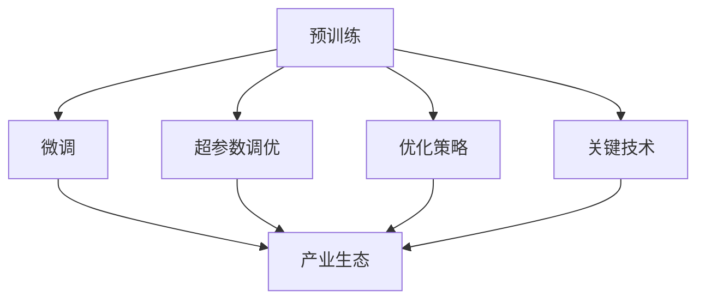

                 

# LLM产业链全景：从研发到应用

> 关键词：大规模语言模型(LLM)、产业生态、研发流程、商业应用、优化策略、关键技术

## 1. 背景介绍

### 1.1 问题由来
近年来，随着深度学习技术的飞速发展，大规模语言模型(LLM)在自然语言处理(NLP)领域取得了突破性进展。以GPT-3、BERT等为代表的大模型，以其在理解自然语言、生成自然语言方面的卓越表现，吸引了全球科技巨头和创业公司的广泛关注。然而，从理论到应用，从研发到商业化的过程中，LLM产业链的各个环节面临着巨大的挑战和机遇。

### 1.2 问题核心关键点
LLM产业链的核心问题包括：

- **研发流程**：如何高效、低成本地开发出高质量的大模型？
- **产业生态**：如何构建起一个高效、开放的产业生态，推动LLM技术的落地应用？
- **应用场景**：LLM技术如何在金融、医疗、教育等垂直领域发挥最大价值？
- **优化策略**：如何提升LLM模型的性能、效率和安全性，实现更好的用户体验？
- **关键技术**：LLM技术开发中需要突破哪些关键技术瓶颈？

这些问题不仅关乎LLM技术的学术前沿和产业应用，更关乎到LLM技术的长远发展和广泛普及。本文将从研发到应用，全面剖析LLM产业链的全景，探讨其中的关键问题和解决方案。

## 2. 核心概念与联系

### 2.1 核心概念概述

为了更深入地理解LLM产业链，本节将介绍几个核心概念及其相互关系：

- **大规模语言模型(LLM)**：基于Transformer架构，通过自监督学习和有监督学习训练而成的通用语言模型。如GPT系列、BERT等。

- **预训练与微调**：先在大规模无标注数据上进行预训练，然后在特定任务上进行微调优化，以适应任务需求。

- **产业生态**：由开发者、用户、服务提供商、技术供应商、市场环境等因素共同构成的商业环境。

- **优化策略**：包括超参数调优、正则化、数据增强、对抗训练等方法，以提升模型性能和泛化能力。

- **关键技术**：如自适应学习率、参数高效微调、多模态融合、隐私保护等，是实现高性能LLM模型的关键。

这些概念之间的联系可以通过以下Mermaid流程图来展示：



这个流程图展示了LLM研发、微调、优化和产业化的各个环节，以及这些环节之间的关系：

1. 预训练是LLM技术的基础，通过在大规模无标注数据上训练，获得通用的语言表示。
2. 微调是针对特定任务的优化过程，通过调整模型参数，适应任务需求。
3. 超参数调优、优化策略和关键技术都是提升模型性能和泛化能力的有效手段。
4. 产业生态是LLM技术落地应用的关键，包括开发者、用户、服务提供商和技术供应商的互动。

## 3. 核心算法原理 & 具体操作步骤
### 3.1 算法原理概述

LLM产业链的核心是研发和应用两个环节，每个环节都涉及到一系列关键技术和方法。以下将详细介绍LLM的研发和应用过程中的核心算法原理和具体操作步骤。

### 3.2 算法步骤详解

**预训练阶段**：

1. **数据准备**：收集大规模无标注数据，通常使用互联网上的文本数据，包括新闻、书籍、论文等。

2. **模型选择**：选择适合的预训练模型架构，如BERT、GPT等。

3. **训练流程**：在大规模数据集上进行预训练，通常使用自监督学习任务，如语言模型预测、掩码语言模型等。

4. **模型评估**：在验证集上评估模型性能，选择性能最优的预训练模型。

**微调阶段**：

1. **数据准备**：收集特定任务的标注数据，如情感分类、问答系统、机器翻译等。

2. **模型加载**：加载预训练模型，通常只微调模型的顶层，保留大部分预训练参数。

3. **模型适配**：根据任务需求，设计合适的任务适配层和损失函数，如线性分类器、交叉熵损失等。

4. **模型训练**：使用标注数据进行微调训练，通常使用有监督学习方式，以梯度下降等优化算法更新模型参数。

5. **模型评估**：在验证集和测试集上评估微调后的模型性能，选择性能最优的微调模型。

### 3.3 算法优缺点

**优点**：

- **高效性**：通过预训练和微调相结合的方式，可以在较短的时间内获得高性能的LLM模型。
- **泛化能力**：预训练模型可以学习到通用的语言表示，微调模型可以适应特定任务需求，提高模型泛化能力。
- **灵活性**：可以根据任务需求，灵活选择模型架构和优化策略。

**缺点**：

- **数据需求**：预训练和微调都依赖大规模数据，获取高质量标注数据成本较高。
- **计算资源**：需要高性能计算资源，如GPU、TPU等，否则训练和推理速度较慢。
- **可解释性**：LLM模型通常被视为"黑盒"，难以解释其内部决策过程。

### 3.4 算法应用领域

LLM技术在多个领域都有广泛的应用，包括但不限于：

- **自然语言处理**：文本分类、情感分析、命名实体识别等。
- **机器翻译**：将一种语言翻译成另一种语言。
- **对话系统**：自动生成对话回复，应用于客服、教育、娱乐等。
- **文本摘要**：将长文本压缩成简短摘要。
- **推荐系统**：基于用户行为和文本内容进行推荐。

## 4. 数学模型和公式 & 详细讲解 & 举例说明

### 4.1 数学模型构建

LLM模型通常基于Transformer架构，使用自监督学习任务进行预训练，然后通过微调任务进行优化。以下将以BERT模型为例，介绍其数学模型构建过程。

**BERT预训练模型**：

1. **输入表示**：将文本转换为token ids和attention mask。

2. **Transformer编码器**：使用多个自注意力层和前馈神经网络层，对输入表示进行编码。

3. **预训练任务**：包括掩码语言模型和下一句预测等，通过预测任务优化模型参数。

**微调模型**：

1. **任务适配层**：根据任务需求，设计合适的输出层和损失函数。如分类任务使用线性分类器，生成任务使用解码器。

2. **损失函数**：如交叉熵损失、均方误差损失等。

### 4.2 公式推导过程

**BERT预训练公式**：

$$
L(\theta) = \frac{1}{N} \sum_{i=1}^N \left[ \frac{1}{2} \sum_{j=1}^{20} -log \sigma (q_j^T k_j) \right]
$$

其中，$q_j$ 和 $k_j$ 分别是输入和输出句子的表示，$\sigma$ 是softmax函数。

**微调模型公式**：

$$
L(\theta) = \frac{1}{N} \sum_{i=1}^N \left[ -log softmax(M_{\theta}(x_i),y_i) \right]
$$

其中，$M_{\theta}(x_i)$ 是微调模型对输入 $x_i$ 的输出，$y_i$ 是标注标签。

### 4.3 案例分析与讲解

**BERT微调示例**：

1. **数据准备**：收集情感分类数据集，如IMDB评论数据集。

2. **模型加载**：加载预训练的BERT模型，通常只微调顶层，即语言模型层。

3. **任务适配层设计**：设计线性分类器作为输出层，交叉熵损失函数作为损失函数。

4. **模型训练**：使用标注数据进行微调训练，通常使用Adam优化算法，学习率设置为0.001。

5. **模型评估**：在验证集上评估微调模型性能，选择准确率最高的模型进行应用。

## 5. 项目实践：代码实例和详细解释说明

### 5.1 开发环境搭建

为了进行LLM模型的研发和微调，需要配置好开发环境。以下以PyTorch和HuggingFace Transformers库为例，介绍环境配置过程：

1. **安装Anaconda**：从官网下载并安装Anaconda，用于创建独立的Python环境。

2. **创建虚拟环境**：
```bash
conda create -n llm-env python=3.8 
conda activate llm-env
```

3. **安装必要的库**：
```bash
pip install torch torchvision torchaudio transformers
```

### 5.2 源代码详细实现

**BERT微调代码实现**：

```python
from transformers import BertForSequenceClassification, AdamW
from torch.utils.data import Dataset, DataLoader
from torch.nn import CrossEntropyLoss
import torch

class SentimentDataset(Dataset):
    def __init__(self, data):
        self.data = data
        self.tokenizer = BertTokenizer.from_pretrained('bert-base-uncased')
    
    def __len__(self):
        return len(self.data)
    
    def __getitem__(self, idx):
        text = self.data[idx]['text']
        label = self.data[idx]['label']
        encoding = self.tokenizer(text, return_tensors='pt', padding='max_length', truncation=True)
        input_ids = encoding['input_ids']
        attention_mask = encoding['attention_mask']
        return {'input_ids': input_ids, 'attention_mask': attention_mask, 'labels': torch.tensor(label, dtype=torch.long)}

# 加载预训练模型和数据集
model = BertForSequenceClassification.from_pretrained('bert-base-uncased', num_labels=2)
train_dataset = SentimentDataset(train_data)
val_dataset = SentimentDataset(val_data)
test_dataset = SentimentDataset(test_data)

# 设置优化器和损失函数
optimizer = AdamW(model.parameters(), lr=2e-5)
loss_fn = CrossEntropyLoss()

# 定义训练和评估函数
def train_epoch(model, dataset, batch_size, optimizer, loss_fn):
    dataloader = DataLoader(dataset, batch_size=batch_size, shuffle=True)
    model.train()
    epoch_loss = 0
    for batch in dataloader:
        input_ids = batch['input_ids'].to(device)
        attention_mask = batch['attention_mask'].to(device)
        labels = batch['labels'].to(device)
        model.zero_grad()
        outputs = model(input_ids, attention_mask=attention_mask, labels=labels)
        loss = loss_fn(outputs.logits, labels)
        epoch_loss += loss.item()
        loss.backward()
        optimizer.step()
    return epoch_loss / len(dataloader)

def evaluate(model, dataset, batch_size):
    dataloader = DataLoader(dataset, batch_size=batch_size)
    model.eval()
    preds, labels = [], []
    with torch.no_grad():
        for batch in dataloader:
            input_ids = batch['input_ids'].to(device)
            attention_mask = batch['attention_mask'].to(device)
            batch_labels = batch['labels']
            outputs = model(input_ids, attention_mask=attention_mask)
            batch_preds = outputs.logits.argmax(dim=1).to('cpu').tolist()
            batch_labels = batch_labels.to('cpu').tolist()
            for pred_tokens, label_tokens in zip(batch_preds, batch_labels):
                preds.append(pred_tokens[:len(label_tokens)])
                labels.append(label_tokens)
    return preds, labels

# 训练和评估
epochs = 5
batch_size = 16

device = torch.device('cuda') if torch.cuda.is_available() else torch.device('cpu')
model.to(device)

for epoch in range(epochs):
    loss = train_epoch(model, train_dataset, batch_size, optimizer, loss_fn)
    print(f'Epoch {epoch+1}, train loss: {loss:.3f}')
    
    val_preds, val_labels = evaluate(model, val_dataset, batch_size)
    print(f'Epoch {epoch+1}, dev accuracy: {accuracy_score(val_labels, val_preds):.3f}')
    
print('Test results:')
test_preds, test_labels = evaluate(model, test_dataset, batch_size)
print(f'Test accuracy: {accuracy_score(test_labels, test_preds):.3f}')
```

### 5.3 代码解读与分析

**SentimentDataset类**：
- `__init__`方法：初始化数据集和分词器。
- `__len__`方法：返回数据集样本数量。
- `__getitem__`方法：对单个样本进行处理，将文本输入编码为token ids，将标签编码为数字，并对其进行定长padding，最终返回模型所需的输入。

**train_epoch函数**：
- 对数据集进行批次化加载，迭代训练模型，计算损失，更新模型参数。

**evaluate函数**：
- 与训练类似，不同点在于不更新模型参数，并在每个batch结束后将预测和标签结果存储下来，最后使用sklearn的accuracy_score函数对整个评估集的预测结果进行打印输出。

**训练流程**：
- 定义总的epoch数和batch size，开始循环迭代。
- 每个epoch内，先在训练集上训练，输出平均loss。
- 在验证集上评估，输出准确率。
- 所有epoch结束后，在测试集上评估，给出最终测试结果。

以上代码展示了BERT模型的微调过程，可以用于情感分类任务的训练和评估。

## 6. 实际应用场景

### 6.1 智能客服系统

基于LLM技术的智能客服系统，可以通过微调使预训练模型适应具体的客服场景，自动理解和回答客户咨询。系统可以基于对话历史和常见问题，不断学习和优化回复策略，提升客户满意度和服务效率。

### 6.2 金融舆情监测

金融行业需要实时监测网络舆情，及时响应市场变化。LLM技术可以通过微调模型，学习金融领域的语言表示，快速识别和分析舆情信息，预测市场趋势，帮助金融机构做出更好的决策。

### 6.3 个性化推荐系统

LLM技术可以应用于推荐系统的文本处理和用户画像构建，通过微调模型学习用户行为和文本内容的关联，生成个性化的推荐结果，提升用户体验和推荐效果。

### 6.4 未来应用展望

随着LLM技术的不断发展，未来LLM模型将在更多领域得到应用，为人类社会带来新的变革：

- **智慧医疗**：LLM技术可以应用于病历分析、医疗问答等，帮助医生提供精准诊断和治疗方案。
- **智能教育**：LLM技术可以用于智能辅导、自动批改作业等，提高教学质量和效率。
- **智慧城市**：LLM技术可以应用于城市事件监测、智能交通管理等，提升城市治理水平。

## 7. 工具和资源推荐

### 7.1 学习资源推荐

为了帮助开发者系统掌握LLM技术的理论基础和实践技巧，这里推荐一些优质的学习资源：

1. **《自然语言处理综述》**：由斯坦福大学教授刘江涛等合著，全面介绍自然语言处理的基本概念和经典模型。

2. **《深度学习与自然语言处理》**：由清华大学教授周志华等合著，深入浅出地讲解深度学习在NLP中的应用。

3. **HuggingFace官方文档**：提供丰富的预训练模型和微调样例，是学习LLM技术的重要资源。

4. **OpenAI博客**：展示GPT系列模型的最新进展和应用案例，值得关注。

### 7.2 开发工具推荐

为了高效开发和部署LLM模型，推荐使用以下工具：

1. **PyTorch**：灵活的深度学习框架，支持动态计算图和GPU/TPU加速。

2. **TensorFlow**：强大的分布式计算框架，支持高性能模型训练和部署。

3. **HuggingFace Transformers库**：提供丰富的预训练模型和微调接口，方便快速开发。

4. **Weights & Biases**：实验跟踪工具，可以记录和可视化模型训练过程。

5. **TensorBoard**：可视化工具，实时监测模型训练状态，提供丰富的图表呈现方式。

### 7.3 相关论文推荐

LLM技术的研究推动了NLP领域的快速发展。以下是几篇奠基性的相关论文，推荐阅读：

1. **Attention is All You Need**：Transformer的原始论文，提出了自注意力机制，奠定了LLM模型的基础。

2. **BERT: Pre-training of Deep Bidirectional Transformers for Language Understanding**：BERT的原始论文，提出预训练语言模型的思想，刷新了多项NLP任务SOTA。

3. **GPT-3: Language Models are Unsupervised Multitask Learners**：GPT-3的原始论文，展示了大规模语言模型的零样本学习能力。

4. **Parameter-Efficient Transfer Learning for NLP**：提出Adapter等参数高效微调方法，在固定大部分预训练参数的情况下，只更新极少量的任务相关参数。

5. **AdaLoRA: Adaptive Low-Rank Adaptation for Parameter-Efficient Fine-Tuning**：提出AdaLoRA等低秩适应的微调方法，在参数效率和精度之间取得了新的平衡。

这些论文代表了大规模语言模型的发展脉络，对于深入理解LLM技术的理论基础和应用实践具有重要意义。

## 8. 总结：未来发展趋势与挑战

### 8.1 总结

本文全面介绍了LLM产业链的全景，从研发到应用，涉及预训练、微调、优化和产业生态等多个环节。通过详细的算法原理和操作步骤，展示了大规模语言模型的开发流程和应用潜力。通过分析实际应用场景和未来趋势，探讨了LLM技术在多个领域的应用前景和挑战。

### 8.2 未来发展趋势

未来，LLM技术将继续在多个领域得到广泛应用，推动NLP技术的不断进步和创新：

1. **模型规模增大**：预训练模型的参数量将不断增大，带来更丰富的语言表示。

2. **参数高效微调**：开发更多参数高效的微调方法，如Adapter、LoRA等，提升微调效率和效果。

3. **跨领域迁移**：提升模型的跨领域迁移能力，减少微调对标注数据的依赖。

4. **实时应用**：提升模型的实时性和计算效率，满足实际应用的高性能需求。

5. **隐私保护**：在模型训练和应用中引入隐私保护机制，确保数据安全。

### 8.3 面临的挑战

尽管LLM技术在许多领域展示了巨大的潜力，但仍面临诸多挑战：

1. **数据资源不足**：标注数据获取成本较高，标注过程耗时耗力。

2. **计算资源需求高**：模型训练和推理需要高性能计算资源，如GPU、TPU等。

3. **模型可解释性差**：LLM模型通常被视为"黑盒"，难以解释其内部决策过程。

4. **系统稳定性问题**：模型在特定输入下可能出现不稳定性或错误。

5. **隐私和安全风险**：模型可能存在隐私泄露和安全漏洞。

### 8.4 研究展望

未来，需要在以下方向进行更多研究，以推动LLM技术的不断进步：

1. **无监督学习**：探索无监督学习范式，减少对标注数据的依赖。

2. **多模态融合**：将视觉、语音等多模态信息与文本信息进行融合，提升模型的理解和生成能力。

3. **因果推理**：引入因果推理方法，增强模型的稳定性和可解释性。

4. **隐私保护**：开发隐私保护技术，确保数据安全。

5. **伦理道德**：引入伦理道德约束，确保模型行为的合规性。

## 9. 附录：常见问题与解答

**Q1: 大规模语言模型在预训练和微调过程中需要注意哪些关键点？**

A: 预训练和微调过程中需要注意以下关键点：

- **数据质量**：预训练和微调都需要高质量的数据，数据应覆盖广泛的语料库，避免偏斜。

- **模型架构**：选择合适的预训练模型架构，如BERT、GPT等，确保模型具有足够的能力进行学习。

- **优化策略**：选择合适的优化算法和超参数，如Adam、学习率、batch size等，确保模型训练的稳定性和效果。

- **任务适配**：根据具体任务需求，设计合适的任务适配层和损失函数，确保模型能够适应特定任务。

- **评估指标**：选择合适的评估指标，如准确率、F1-score等，评估模型性能，及时调整模型和训练策略。

**Q2: 如何优化大规模语言模型的计算效率？**

A: 优化大规模语言模型的计算效率，可以从以下几个方面入手：

- **模型裁剪**：去掉不必要的层和参数，减小模型尺寸，加快推理速度。

- **量化加速**：将浮点模型转为定点模型，压缩存储空间，提高计算效率。

- **混合精度训练**：使用混合精度训练，减少内存消耗，提升训练速度。

- **模型并行**：采用模型并行技术，将模型拆分为多个部分，并行训练，提高训练速度。

- **GPU/TPU加速**：使用高性能计算设备，如GPU、TPU等，加速模型训练和推理。

**Q3: 如何提升大规模语言模型的鲁棒性和泛化能力？**

A: 提升大规模语言模型的鲁棒性和泛化能力，可以从以下几个方面入手：

- **数据增强**：使用数据增强技术，如回译、近义替换等，扩充训练集，提高模型泛化能力。

- **正则化**：引入正则化技术，如L2正则、Dropout等，防止模型过拟合。

- **对抗训练**：使用对抗训练技术，引入对抗样本，提高模型鲁棒性。

- **模型融合**：使用模型融合技术，如集成学习、蒸馏等，提升模型性能。

- **任务适配**：根据具体任务需求，设计合适的任务适配层和损失函数，确保模型能够适应特定任务。

**Q4: 大规模语言模型在实际应用中需要注意哪些问题？**

A: 大规模语言模型在实际应用中需要注意以下问题：

- **模型裁剪**：去掉不必要的层和参数，减小模型尺寸，加快推理速度。

- **量化加速**：将浮点模型转为定点模型，压缩存储空间，提高计算效率。

- **服务化封装**：将模型封装为标准化服务接口，便于集成调用。

- **弹性伸缩**：根据请求流量动态调整资源配置，平衡服务质量和成本。

- **监控告警**：实时采集系统指标，设置异常告警阈值，确保服务稳定性。

- **安全防护**：采用访问鉴权、数据脱敏等措施，保障数据和模型安全。

通过以上措施，可以确保大规模语言模型在实际应用中的高效性和安全性。

**Q5: 大规模语言模型的隐私保护有哪些技术手段？**

A: 大规模语言模型的隐私保护可以通过以下技术手段实现：

- **差分隐私**：在模型训练过程中引入噪声，确保模型参数不泄露个人隐私信息。

- **联邦学习**：在多客户端本地训练模型，不共享模型参数，保护数据隐私。

- **数据匿名化**：对输入数据进行匿名化处理，确保数据无法被反向推断出个体信息。

- **模型加密**：对模型进行加密保护，确保模型在传输和存储过程中不被窃取或篡改。

- **隐私计算**：采用隐私计算技术，如多方安全计算、同态加密等，确保数据在计算过程中的隐私保护。

通过以上措施，可以确保大规模语言模型在隐私保护方面的安全性。

---

作者：禅与计算机程序设计艺术 / Zen and the Art of Computer Programming

