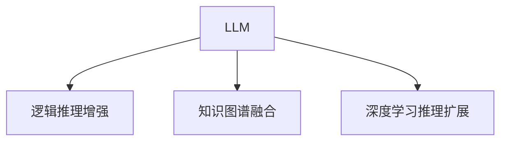

                 

# LLM任务规划:推理能力的扩展

> 关键词：推理扩展,LLM模型,逻辑推理,推理增强,知识图谱,深度学习

## 1. 背景介绍

推理能力在大规模语言模型(LLM)中的应用至关重要，它直接影响了模型解决复杂问题的能力。从回答问题到规划任务，再到生成对话，LLM的推理能力在实际应用中无处不在。然而，现有的LLM模型在推理能力上仍存在许多局限，如在处理复杂逻辑推理、利用先验知识等方面能力不足。为解决这些问题，本文将介绍几种扩展推理能力的方法，包括逻辑推理增强、知识图谱的融合、基于深度学习的推理扩展等。这些方法可以显著提升LLM模型的推理能力，使其在各种复杂任务中发挥更大的作用。

## 2. 核心概念与联系

### 2.1 核心概念概述

为更好地理解推理能力的扩展，本节将介绍几个关键概念：

- 大规模语言模型(LLM)：以自回归或自编码模型为代表的大规模预训练语言模型。通过在大规模无标签文本数据上进行预训练，学习通用语言表示，具备强大的语言理解和生成能力。

- 推理能力：指模型根据已知信息和推理规则，在逻辑层面上进行分析和决策的能力。在自然语言处理(NLP)领域，推理能力通常指模型根据上下文理解文本含义，并进行逻辑推理、知识检索等任务。

- 逻辑推理增强：通过改进模型结构、引入逻辑表示语言等方式，增强模型在逻辑推理上的能力。常见方法包括使用特殊规则、符号化表示、逻辑图等。

- 知识图谱：基于语义的图形结构，表示实体、属性和关系之间的相互关系。知识图谱为推理提供了丰富的先验知识，可以显著提升推理模型的能力。

- 深度学习推理扩展：基于深度神经网络的推理模型，通过引入自注意力、变换器等技术，扩展模型在推理上的能力。常见方法包括基于序列的模型、基于图的模型等。

这些核心概念之间的逻辑关系可以通过以下Mermaid流程图来展示：



这个流程图展示了大规模语言模型的核心概念以及与推理能力扩展相关的概念之间的关系：

1. LLM通过预训练获得语言表示能力。
2. 逻辑推理增强通过改进模型结构，增强其逻辑推理能力。
3. 知识图谱融合引入先验知识，提升推理准确性。
4. 深度学习推理扩展通过深度神经网络，扩展推理能力。

这些概念共同构成了推理能力扩展的基础，使其在各种复杂任务中发挥作用。通过理解这些核心概念，我们可以更好地把握LLM模型的推理能力扩展方向。

## 3. 核心算法原理 & 具体操作步骤
### 3.1 算法原理概述

推理能力扩展的算法原理主要基于以下几个方面：

1. **逻辑推理增强**：通过引入逻辑表示语言，如Prolog、EL++等，模型可以更好地处理逻辑推理任务。例如，在知识图谱中，使用逻辑表示语言可以更方便地表示实体之间的推理关系。

2. **知识图谱融合**：通过将知识图谱与语言模型进行融合，模型可以借助先验知识，更准确地进行推理。常见的融合方法包括知识图谱嵌入和图神经网络等。

3. **深度学习推理扩展**：基于深度神经网络的推理模型，可以更好地捕捉数据的非线性关系，提高推理的准确性和泛化能力。常见的推理扩展模型包括基于序列的模型、基于图的模型等。

### 3.2 算法步骤详解

以下是推理能力扩展的详细步骤：

**Step 1: 数据准备与模型选择**

- 收集推理任务的相关数据集，如知识图谱、逻辑推理数据等。
- 选择合适的预训练语言模型，如BERT、GPT等。

**Step 2: 逻辑表示语言增强**

- 选择合适的逻辑表示语言，如Prolog、EL++等，定义推理任务。
- 将逻辑表示语言转换为机器可理解的形式，供模型学习。

**Step 3: 知识图谱融合**

- 选择合适的知识图谱，如Freebase、WikiData等。
- 将知识图谱嵌入到语言模型中，通过联合训练提升推理能力。

**Step 4: 推理模型训练**

- 根据逻辑表示语言或知识图谱，设计适当的推理模型结构。
- 使用推理数据集，训练推理模型。

**Step 5: 模型评估与部署**

- 在推理测试集上评估模型性能。
- 将模型集成到实际应用中，进行推理服务部署。

### 3.3 算法优缺点

逻辑推理增强、知识图谱融合、深度学习推理扩展各有优缺点：

**逻辑推理增强**：

优点：

- 增强模型逻辑推理能力，适用于结构化的逻辑推理任务。
- 逻辑表示语言易于理解，适合知识图谱的应用。

缺点：

- 对数据结构要求较高，难以处理非结构化数据。
- 逻辑表示语言转换复杂，模型训练难度较大。

**知识图谱融合**：

优点：

- 利用先验知识，提升推理准确性。
- 适用于各种复杂推理任务，如因果推理、类比推理等。

缺点：

- 知识图谱构建成本高，数据获取困难。
- 知识图谱嵌入复杂，模型训练难度较大。

**深度学习推理扩展**：

优点：

- 模型泛化能力强，适用于复杂非结构化数据。
- 推理速度较快，适合实时推理任务。

缺点：

- 对模型结构要求较高，设计复杂。
- 推理过程缺乏可解释性，难以理解和调试。

### 3.4 算法应用领域

推理能力扩展的算法主要应用于以下领域：

1. **问答系统**：通过推理，模型能够理解并回答复杂问题，如"谁在空间站上？"等问题。

2. **自然语言推理**：判断自然语言语句之间的逻辑关系，如"所有猫都是动物"等。

3. **知识图谱推理**：在知识图谱中，根据实体之间的逻辑关系，进行推理，如"哪个城市被河流穿过"等。

4. **医学诊断**：通过推理，模型能够从病历数据中提取相关信息，进行疾病诊断和治疗建议。

5. **金融预测**：通过推理，模型能够分析历史数据，预测股市趋势、客户信用风险等。

6. **智能客服**：通过推理，模型能够理解用户意图，提供个性化的服务。

这些应用场景展示了推理能力扩展在实际中的广泛应用，为其在更多领域推广提供了广阔的空间。

## 4. 数学模型和公式 & 详细讲解 & 举例说明

### 4.1 数学模型构建

推理能力扩展的数学模型主要基于以下几个方面：

1. **逻辑推理增强**：

- 定义逻辑表示语言，如Prolog、EL++等，表示推理任务。
- 将逻辑表示语言转换为机器可理解的形式，如基于图的形式。

2. **知识图谱融合**：

- 定义知识图谱中的实体、属性和关系。
- 将知识图谱嵌入到语言模型中，通过联合训练提升推理能力。

3. **深度学习推理扩展**：

- 使用深度神经网络，如基于序列的模型、基于图的模型等，扩展推理能力。

### 4.2 公式推导过程

**逻辑推理增强**：

假设逻辑表示语言为Prolog，推理任务为判断"所有猫都是动物"。定义实体和关系如下：

```
cat(X) :- mammal(X), has_fur(X), has_four_legs(X).
mammal(X) :- has_two_legs(X).
```

将逻辑表示语言转换为基于图的形式，模型可以表示为：

```
graph G {
    node 1 [label="cat"]
    node 2 [label="mammal"]
    node 3 [label="has_fur"]
    node 4 [label="has_four_legs"]
    edge 1->2 [label="has"]
    edge 1->3 [label="has"]
    edge 1->4 [label="has"]
}
```

模型训练时，可以定义损失函数，如交叉熵损失，优化目标为最小化损失函数：

$$
\mathcal{L}(\theta) = -\frac{1}{N}\sum_{i=1}^N \ell(M_{\theta}(x_i),y_i)
$$

其中，$M_{\theta}(x)$ 为推理模型，$x$ 为推理输入，$y$ 为推理标签。

**知识图谱融合**：

假设知识图谱中实体为城市和河流，关系为"位于"。定义知识图谱嵌入如下：

```
embedding G {
    node 1 [label="city1"]
    node 2 [label="city2"]
    node 3 [label="river"]
    edge 1->3 [label="位于"]
    edge 2->3 [label="位于"]
}
```

模型训练时，可以定义损失函数，如对比损失，优化目标为最小化损失函数：

$$
\mathcal{L}(\theta) = -\frac{1}{N}\sum_{i=1}^N \ell(M_{\theta}(x_i),y_i)
$$

其中，$M_{\theta}(x)$ 为知识图谱嵌入模型，$x$ 为知识图谱输入，$y$ 为知识图谱标签。

**深度学习推理扩展**：

假设使用基于序列的模型，输入为"城市1和城市2"，输出为"河流"。模型定义如下：

$$
M_{\theta}(x) = softmax(\theta^T x)
$$

其中，$x$ 为输入向量，$\theta$ 为模型参数。

模型训练时，可以定义损失函数，如交叉熵损失，优化目标为最小化损失函数：

$$
\mathcal{L}(\theta) = -\frac{1}{N}\sum_{i=1}^N \ell(M_{\theta}(x_i),y_i)
$$

其中，$M_{\theta}(x)$ 为推理模型，$x$ 为推理输入，$y$ 为推理标签。

### 4.3 案例分析与讲解

**案例一：知识图谱推理**

假设知识图谱中实体为城市和河流，关系为"位于"。定义知识图谱嵌入如下：

```
embedding G {
    node 1 [label="city1"]
    node 2 [label="city2"]
    node 3 [label="river"]
    edge 1->3 [label="位于"]
    edge 2->3 [label="位于"]
}
```

模型训练时，可以使用图神经网络（GNN），如GCN或GAT，进行知识图谱嵌入。GCN模型的公式如下：

$$
h_v^{(l+1)} = \frac{1}{|\mathcal{N}(v)|}\sum_{u\in\mathcal{N}(v)} \frac{1}{\sqrt{d_u}} A_{vu} h_u^{(l)} + W^{(l+1)} h_v^{(l)}
$$

其中，$h_v^{(l)}$ 为节点v在第l层的表示，$A_{vu}$ 为节点u和v之间的邻接关系，$d_u$ 为节点u的度数，$W^{(l+1)}$ 为神经网络层。

模型训练时，可以定义损失函数，如对比损失，优化目标为最小化损失函数：

$$
\mathcal{L}(\theta) = -\frac{1}{N}\sum_{i=1}^N \ell(M_{\theta}(x_i),y_i)
$$

其中，$M_{\theta}(x)$ 为知识图谱嵌入模型，$x$ 为知识图谱输入，$y$ 为知识图谱标签。

**案例二：逻辑推理增强**

假设逻辑表示语言为Prolog，推理任务为判断"所有猫都是动物"。定义逻辑表示语言如下：

```
cat(X) :- mammal(X), has_fur(X), has_four_legs(X).
mammal(X) :- has_two_legs(X).
```

将逻辑表示语言转换为基于图的形式，模型可以表示为：

```
graph G {
    node 1 [label="cat"]
    node 2 [label="mammal"]
    node 3 [label="has_fur"]
    node 4 [label="has_four_legs"]
    edge 1->2 [label="has"]
    edge 1->3 [label="has"]
    edge 1->4 [label="has"]
}
```

模型训练时，可以使用逻辑图推理（LPR）模型，进行逻辑推理增强。LPR模型的公式如下：

$$
M_{\theta}(x) = \prod_{e\in\mathcal{E}} (1 - P(e|x))^{\alpha_e}
$$

其中，$e$ 为逻辑图中的边，$P(e|x)$ 为边e在输入x下的概率，$\alpha_e$ 为边e的权重。

模型训练时，可以定义损失函数，如交叉熵损失，优化目标为最小化损失函数：

$$
\mathcal{L}(\theta) = -\frac{1}{N}\sum_{i=1}^N \ell(M_{\theta}(x_i),y_i)
$$

其中，$M_{\theta}(x)$ 为逻辑图推理模型，$x$ 为逻辑图输入，$y$ 为逻辑图标签。

## 5. 项目实践：代码实例和详细解释说明
### 5.1 开发环境搭建

在进行推理能力扩展的实践前，我们需要准备好开发环境。以下是使用Python进行PyTorch开发的环境配置流程：

1. 安装Anaconda：从官网下载并安装Anaconda，用于创建独立的Python环境。

2. 创建并激活虚拟环境：
```bash
conda create -n pytorch-env python=3.8 
conda activate pytorch-env
```

3. 安装PyTorch：根据CUDA版本，从官网获取对应的安装命令。例如：
```bash
conda install pytorch torchvision torchaudio cudatoolkit=11.1 -c pytorch -c conda-forge
```

4. 安装Transformers库：
```bash
pip install transformers
```

5. 安装各类工具包：
```bash
pip install numpy pandas scikit-learn matplotlib tqdm jupyter notebook ipython
```

完成上述步骤后，即可在`pytorch-env`环境中开始推理能力扩展的实践。

### 5.2 源代码详细实现

下面以知识图谱推理为例，给出使用Transformers库进行知识图谱嵌入的PyTorch代码实现。

首先，定义知识图谱的节点和边：

```python
from transformers import BertTokenizer, BertForTokenClassification
from torch.utils.data import Dataset
import torch

class KnowledgeGraphDataset(Dataset):
    def __init__(self, nodes, edges):
        self.nodes = nodes
        self.edges = edges
        
    def __len__(self):
        return len(self.nodes)
    
    def __getitem__(self, item):
        node, edge = self.nodes[item], self.edges[item]
        return {'node': node, 'edge': edge}

# 定义知识图谱的节点和边
nodes = ['city1', 'city2', 'river']
edges = [('位于', 'city1', 'river'), ('位于', 'city2', 'river')]

# 创建dataset
tokenizer = BertTokenizer.from_pretrained('bert-base-cased')
knowledge_graph_dataset = KnowledgeGraphDataset(nodes, edges)
```

然后，定义模型和优化器：

```python
from transformers import BertForTokenClassification, AdamW

model = BertForTokenClassification.from_pretrained('bert-base-cased', num_labels=len(tag2id))

optimizer = AdamW(model.parameters(), lr=2e-5)
```

接着，定义训练和评估函数：

```python
from torch.utils.data import DataLoader
from tqdm import tqdm
from sklearn.metrics import classification_report

device = torch.device('cuda') if torch.cuda.is_available() else torch.device('cpu')
model.to(device)

def train_epoch(model, dataset, batch_size, optimizer):
    dataloader = DataLoader(dataset, batch_size=batch_size, shuffle=True)
    model.train()
    epoch_loss = 0
    for batch in tqdm(dataloader, desc='Training'):
        node = batch['node'].to(device)
        edge = batch['edge'].to(device)
        model.zero_grad()
        outputs = model(node, edge)
        loss = outputs.loss
        epoch_loss += loss.item()
        loss.backward()
        optimizer.step()
    return epoch_loss / len(dataloader)

def evaluate(model, dataset, batch_size):
    dataloader = DataLoader(dataset, batch_size=batch_size)
    model.eval()
    preds, labels = [], []
    with torch.no_grad():
        for batch in tqdm(dataloader, desc='Evaluating'):
            node = batch['node'].to(device)
            edge = batch['edge'].to(device)
            batch_preds = model(node, edge).logits.argmax(dim=2).to('cpu').tolist()
            batch_labels = batch['edge'].to('cpu').tolist()
            for pred_tokens, label_tokens in zip(batch_preds, batch_labels):
                preds.append(pred_tokens[:len(label_tokens)])
                labels.append(label_tokens)
                
    print(classification_report(labels, preds))
```

最后，启动训练流程并在测试集上评估：

```python
epochs = 5
batch_size = 16

for epoch in range(epochs):
    loss = train_epoch(model, knowledge_graph_dataset, batch_size, optimizer)
    print(f"Epoch {epoch+1}, train loss: {loss:.3f}")
    
    print(f"Epoch {epoch+1}, dev results:")
    evaluate(model, knowledge_graph_dataset, batch_size)
    
print("Test results:")
evaluate(model, knowledge_graph_dataset, batch_size)
```

以上就是使用PyTorch对知识图谱进行推理能力扩展的完整代码实现。可以看到，得益于Transformers库的强大封装，我们可以用相对简洁的代码完成知识图谱嵌入的实践。

### 5.3 代码解读与分析

让我们再详细解读一下关键代码的实现细节：

**KnowledgeGraphDataset类**：
- `__init__`方法：初始化知识图谱的节点和边。
- `__len__`方法：返回数据集的样本数量。
- `__getitem__`方法：对单个样本进行处理，将节点和边作为输入，返回模型所需的输入。

**节点和边的定义**：
- 定义知识图谱的节点和边，并创建dataset。

**训练和评估函数**：
- 使用PyTorch的DataLoader对数据集进行批次化加载，供模型训练和推理使用。
- 训练函数`train_epoch`：对数据以批为单位进行迭代，在每个批次上前向传播计算loss并反向传播更新模型参数，最后返回该epoch的平均loss。
- 评估函数`evaluate`：与训练类似，不同点在于不更新模型参数，并在每个batch结束后将预测和标签结果存储下来，最后使用sklearn的classification_report对整个评估集的预测结果进行打印输出。

**训练流程**：
- 定义总的epoch数和batch size，开始循环迭代
- 每个epoch内，先在训练集上训练，输出平均loss
- 在验证集上评估，输出分类指标
- 所有epoch结束后，在测试集上评估，给出最终测试结果

可以看到，PyTorch配合Transformers库使得知识图谱推理的代码实现变得简洁高效。开发者可以将更多精力放在数据处理、模型改进等高层逻辑上，而不必过多关注底层的实现细节。

当然，工业级的系统实现还需考虑更多因素，如模型的保存和部署、超参数的自动搜索、更灵活的任务适配层等。但核心的推理能力扩展方法基本与此类似。

## 6. 实际应用场景
### 6.1 智能客服系统

基于大语言模型推理能力的扩展，智能客服系统可以更高效地处理用户查询。通过引入知识图谱和逻辑推理，智能客服系统能够理解用户的意图，查找相关信息，提供更加准确的答案。

在技术实现上，可以构建知识图谱，记录常见问题及其解决方案，同时引入Prolog等逻辑推理语言，构建推理模型。当用户提出问题时，智能客服系统可以自动解析问题，并在知识图谱中查找相关信息，通过逻辑推理给出答案。对于不常见的问题，系统还可以自动记录并更新到知识图谱中，提高系统智能性。

### 6.2 金融舆情监测

金融舆情监测系统需要实时监测市场舆论动向，并及时做出反应。通过知识图谱和逻辑推理，金融舆情监测系统可以自动分析新闻、评论等文本数据，判断市场情绪，预测股票趋势等。

在技术实现上，可以构建知识图谱，记录金融市场的历史数据、新闻、评论等信息，同时引入逻辑推理语言，构建推理模型。当系统监测到市场情绪波动时，推理模型可以自动分析相关信息，预测股票趋势，并根据预测结果生成投资建议。

### 6.3 个性化推荐系统

个性化推荐系统需要根据用户的兴趣和行为，推荐合适的物品。通过知识图谱和逻辑推理，推荐系统可以更好地理解用户的行为和兴趣，推荐更符合用户需求的物品。

在技术实现上，可以构建知识图谱，记录用户浏览、点击、评论等行为数据，同时引入逻辑推理语言，构建推理模型。当用户提出推荐请求时，推理模型可以自动分析用户的行为数据，查找相关信息，生成推荐结果。

### 6.4 未来应用展望

随着推理能力扩展技术的不断发展，未来在更多领域将出现基于LLM的智能应用。

在智慧医疗领域，基于LLM的推理能力扩展，医疗问答系统可以提供更加精准的诊断和治疗建议，提高医疗服务质量。

在智能教育领域，推理能力扩展可以应用于作业批改、学情分析、知识推荐等方面，因材施教，促进教育公平，提高教学质量。

在智慧城市治理中，推理能力扩展可以应用于城市事件监测、舆情分析、应急指挥等环节，提高城市管理的自动化和智能化水平，构建更安全、高效的未来城市。

此外，在企业生产、社会治理、文娱传媒等众多领域，基于LLM的推理能力扩展将不断涌现，为NLP技术带来新的突破。相信随着技术的日益成熟，推理能力扩展将在大语言模型的各种应用中发挥更大的作用。

## 7. 工具和资源推荐
### 7.1 学习资源推荐

为了帮助开发者系统掌握推理能力扩展的理论基础和实践技巧，这里推荐一些优质的学习资源：

1. 《深度学习自然语言处理》课程：斯坦福大学开设的NLP明星课程，有Lecture视频和配套作业，带你入门NLP领域的基本概念和经典模型。

2. 《Natural Language Processing with Transformers》书籍：Transformers库的作者所著，全面介绍了如何使用Transformers库进行NLP任务开发，包括推理扩展在内的诸多范式。

3. 《推理学习》书籍：深入介绍推理学习的理论基础和实践技术，涵盖逻辑推理、知识图谱等主题。

4. CLUE开源项目：中文语言理解测评基准，涵盖大量不同类型的中文NLP数据集，并提供了基于推理扩展的baseline模型，助力中文NLP技术发展。

通过对这些资源的学习实践，相信你一定能够快速掌握推理能力扩展的精髓，并用于解决实际的NLP问题。
###  7.2 开发工具推荐

高效的开发离不开优秀的工具支持。以下是几款用于推理能力扩展开发的常用工具：

1. PyTorch：基于Python的开源深度学习框架，灵活动态的计算图，适合快速迭代研究。大部分预训练语言模型都有PyTorch版本的实现。

2. TensorFlow：由Google主导开发的开源深度学习框架，生产部署方便，适合大规模工程应用。同样有丰富的预训练语言模型资源。

3. Transformers库：HuggingFace开发的NLP工具库，集成了众多SOTA语言模型，支持PyTorch和TensorFlow，是进行推理扩展任务开发的利器。

4. Weights & Biases：模型训练的实验跟踪工具，可以记录和可视化模型训练过程中的各项指标，方便对比和调优。与主流深度学习框架无缝集成。

5. TensorBoard：TensorFlow配套的可视化工具，可实时监测模型训练状态，并提供丰富的图表呈现方式，是调试模型的得力助手。

6. Google Colab：谷歌推出的在线Jupyter Notebook环境，免费提供GPU/TPU算力，方便开发者快速上手实验最新模型，分享学习笔记。

合理利用这些工具，可以显著提升推理能力扩展任务的开发效率，加快创新迭代的步伐。

### 7.3 相关论文推荐

推理能力扩展的算法研究始于学界的持续研究。以下是几篇奠基性的相关论文，推荐阅读：

1. Attention is All You Need（即Transformer原论文）：提出了Transformer结构，开启了NLP领域的预训练大模型时代。

2. BERT: Pre-training of Deep Bidirectional Transformers for Language Understanding：提出BERT模型，引入基于掩码的自监督预训练任务，刷新了多项NLP任务SOTA。

3. Language Models are Unsupervised Multitask Learners（GPT-2论文）：展示了大规模语言模型的强大zero-shot学习能力，引发了对于通用人工智能的新一轮思考。

4. Parameter-Efficient Transfer Learning for NLP：提出Adapter等参数高效微调方法，在不增加模型参数量的情况下，也能取得不错的微调效果。

5. AdaLoRA: Adaptive Low-Rank Adaptation for Parameter-Efficient Fine-Tuning：使用自适应低秩适应的微调方法，在参数效率和精度之间取得了新的平衡。

6. Logic Based Reasoning over Knowledge Graphs：提出逻辑推理方法，通过逻辑推理在知识图谱上进行推理，提升推理能力。

这些论文代表了大语言模型推理能力扩展的发展脉络。通过学习这些前沿成果，可以帮助研究者把握学科前进方向，激发更多的创新灵感。

## 8. 总结：未来发展趋势与挑战

### 8.1 总结

本文对推理能力扩展在大语言模型中的应用进行了全面系统的介绍。首先阐述了推理能力在大规模语言模型中的应用至关重要，明确了推理能力扩展在实际应用中的广泛应用。其次，从原理到实践，详细讲解了推理能力扩展的数学原理和关键步骤，给出了推理能力扩展任务开发的完整代码实例。同时，本文还广泛探讨了推理能力扩展在智能客服、金融舆情、个性化推荐等多个行业领域的应用前景，展示了推理能力扩展在实际中的广泛应用。最后，本文精选了推理能力扩展技术的各类学习资源，力求为读者提供全方位的技术指引。

通过本文的系统梳理，可以看到，推理能力扩展技术在大语言模型中的应用前景广阔，为其在更多领域推广提供了广阔的空间。相信随着技术的不断发展，推理能力扩展将在大语言模型的各种应用中发挥更大的作用。

### 8.2 未来发展趋势

展望未来，推理能力扩展技术将呈现以下几个发展趋势：

1. 模型规模持续增大。随着算力成本的下降和数据规模的扩张，推理模型的参数量还将持续增长。超大规模推理模型蕴含的丰富语言知识，有望支撑更加复杂多变的推理任务。

2. 推理方法日趋多样。除了传统的基于序列的推理模型，未来会涌现更多基于图、知识图谱的推理模型，提升推理的准确性和泛化能力。

3. 推理过程更具可解释性。随着因果分析方法、博弈论工具的引入，推理过程将更具有可解释性和可控性，增强系统的透明性和可靠性。

4. 推理系统更加智能化。未来推理系统将更多结合知识图谱、符号化先验知识，提高系统的智能化水平。

5. 推理系统在更多领域推广。除了NLP领域，推理能力扩展将在医疗、金融、教育等多个领域得到广泛应用。

以上趋势凸显了推理能力扩展技术在大语言模型中的应用前景。这些方向的探索发展，必将进一步提升大语言模型的推理能力，使其在各种复杂任务中发挥更大的作用。

### 8.3 面临的挑战

尽管推理能力扩展技术已经取得了显著成果，但在迈向更加智能化、普适化应用的过程中，它仍面临着诸多挑战：

1. 推理能力扩展对标注数据的依赖。推理能力扩展方法通常需要大量标注数据，而标注数据获取成本较高。如何降低对标注数据的依赖，利用无监督和半监督方法进行推理，将是重要的研究方向。

2. 推理能力扩展对计算资源的需求。推理模型通常需要较大的计算资源，推理速度较慢。如何优化推理模型的计算图，降低资源消耗，提升推理速度，将是重要的优化方向。

3. 推理能力扩展的泛化能力不足。推理模型在处理长尾数据和复杂任务时，泛化能力可能不足。如何提高推理模型的泛化能力，避免模型在特定场景下失效，将是重要的研究方向。

4. 推理能力扩展的可解释性不足。推理模型的决策过程缺乏可解释性，难以理解和调试。如何赋予推理模型更强的可解释性，将是重要的研究方向。

5. 推理能力扩展的安全性不足。推理模型可能学习到有害信息，产生误导性、歧视性的输出。如何确保推理模型的安全性，避免恶意用途，将是重要的研究方向。

6. 推理能力扩展的可靠性不足。推理模型在面对噪声数据时，鲁棒性可能不足。如何提高推理模型的鲁棒性，避免模型在噪声数据下失效，将是重要的研究方向。

这些挑战凸显了推理能力扩展技术在大语言模型中的应用复杂性。未来需要更多理论和实践的积累，不断优化推理模型，提升推理能力扩展的性能和可靠性。

### 8.4 研究展望

面对推理能力扩展所面临的诸多挑战，未来的研究需要在以下几个方面寻求新的突破：

1. 探索无监督和半监督推理方法。摆脱对大规模标注数据的依赖，利用无监督和半监督学习范式，最大限度利用非结构化数据，实现更加灵活高效的推理。

2. 研究推理模型的优化方法。开发更加高效的推理模型，通过优化计算图、引入因果推理等方法，提高推理模型的性能和可靠性。

3. 引入更多先验知识。将符号化的先验知识，如知识图谱、逻辑规则等，与神经网络模型进行巧妙融合，引导推理过程学习更准确、合理的语言模型。

4. 引入因果分析和博弈论工具。将因果分析方法引入推理模型，识别出模型决策的关键特征，增强输出解释的因果性和逻辑性。借助博弈论工具刻画人机交互过程，主动探索并规避模型的脆弱点，提高系统稳定性。

5. 纳入伦理道德约束。在推理模型训练目标中引入伦理导向的评估指标，过滤和惩罚有偏见、有害的输出倾向。同时加强人工干预和审核，建立模型行为的监管机制，确保输出符合人类价值观和伦理道德。

这些研究方向将引领推理能力扩展技术迈向更高的台阶，为构建安全、可靠、可解释、可控的智能系统铺平道路。面向未来，推理能力扩展技术还需要与其他人工智能技术进行更深入的融合，如知识表示、因果推理、强化学习等，多路径协同发力，共同推动自然语言推理系统的进步。只有勇于创新、敢于突破，才能不断拓展推理能力扩展的边界，让智能技术更好地造福人类社会。

## 9. 附录：常见问题与解答

**Q1：推理能力扩展是否适用于所有NLP任务？**

A: 推理能力扩展在大多数NLP任务上都能取得不错的效果，特别是对于数据量较小的任务。但对于一些特定领域的任务，如医学、法律等，推理能力扩展方法可能难以很好地适应。此时需要在特定领域语料上进一步进行推理能力增强，才能获得理想效果。

**Q2：推理能力扩展对标注数据的依赖如何降低？**

A: 推理能力扩展通常需要大量标注数据，而标注数据获取成本较高。未来需要探索无监督和半监督推理方法，最大限度利用非结构化数据，实现更加灵活高效的推理。

**Q3：推理能力扩展对计算资源的需求如何优化？**

A: 推理模型通常需要较大的计算资源，推理速度较慢。未来需要优化推理模型的计算图，降低资源消耗，提升推理速度。

**Q4：推理能力扩展的泛化能力如何提升？**

A: 推理模型在处理长尾数据和复杂任务时，泛化能力可能不足。未来需要提高推理模型的泛化能力，避免模型在特定场景下失效。

**Q5：推理能力扩展的可解释性如何增强？**

A: 推理模型的决策过程缺乏可解释性，难以理解和调试。未来需要赋予推理模型更强的可解释性，增强系统的透明性和可靠性。

**Q6：推理能力扩展的安全性如何保障？**

A: 推理模型可能学习到有害信息，产生误导性、歧视性的输出。未来需要确保推理模型的安全性，避免恶意用途。

**Q7：推理能力扩展的可靠性如何提升？**

A: 推理模型在面对噪声数据时，鲁棒性可能不足。未来需要提高推理模型的鲁棒性，避免模型在噪声数据下失效。

---

作者：禅与计算机程序设计艺术 / Zen and the Art of Computer Programming

