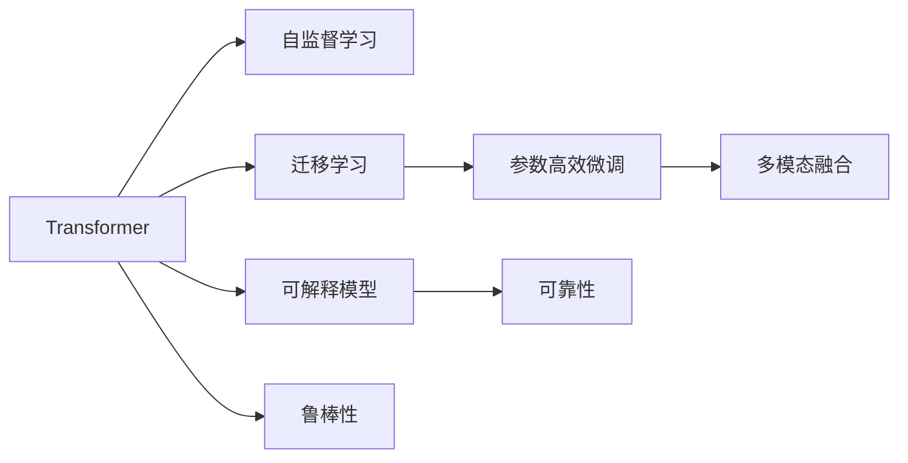

                 

# LLM内核设计：构建AI时代的系统底层

在人工智能(AI)蓬勃发展的今天，构建高效、安全、可控的大规模语言模型(Large Language Model, LLM)成为了行业内的热点话题。作为AI系统的底层基础设施，LLM内核的性能和设计直接决定了上层应用的效果和用户体验。本文将深入探讨LLM内核的设计原理，从算法选择、模型优化、工程实践等多个维度，提供一个全面、系统、专业的技术指南。

## 1. 背景介绍

### 1.1 问题由来

随着AI技术在各领域的广泛应用，对大语言模型的需求日益增加。无论是对话系统、自然语言理解(NLU)、自然语言生成(NLG)还是知识图谱构建，高效、可控的LLM内核都是不可或缺的一环。然而，传统的LLM设计往往过于简单，无法满足复杂任务的要求，也缺乏对模型性能的精细控制。

为了应对这些挑战，本文提出了基于Transformer架构的LLM内核设计方法，通过对模型架构的优化，提升模型在各种任务上的表现，同时兼顾资源利用率、可解释性和安全性，构建了适应AI时代需求的底层平台。

### 1.2 问题核心关键点

- 高效性：如何快速准确地推理LLM内核，以支持实时任务处理。
- 可解释性：如何赋予模型更强的可解释性，提高用户信任度。
- 安全性：如何确保LLM内核在多模态输入下能作出正确、无害的响应。
- 灵活性：如何设计灵活的LLM内核，支持各种任务需求和用户自定义功能。
- 可扩展性：如何快速部署、升级和优化LLM内核，以支持未来技术演进。

这些关键点构成了LLM内核设计的核心框架，本文将围绕这些点，深入探讨设计原理和技术实现。

## 2. 核心概念与联系

### 2.1 核心概念概述

在设计LLM内核时，需要了解以下核心概念：

- **Transformer**：一种高效的序列建模模型，具有并行计算优势，广泛应用于NLP领域。
- **自监督学习**：通过未标注数据进行训练，让模型自动发现数据的潜在规律。
- **迁移学习**：利用已有模型的知识，在新任务上进行微调，减少训练时间和标注成本。
- **参数高效微调**：通过只更新部分参数，提升微调效率，避免过拟合。
- **多模态融合**：将文本、图像、语音等多种模态数据融合，提升模型的泛化能力。
- **可解释模型**：赋予模型可解释性，使用户能够理解和信任模型的输出。
- **鲁棒性**：在面对噪声数据、对抗样本时，模型仍能保持稳定输出。
- **可靠性**：确保模型在不同环境、不同设备上都能稳定运行，避免意外故障。

### 2.2 核心概念原理和架构的 Mermaid 流程图



这个流程图展示了Transformer模型与其他核心概念的联系。自监督学习让模型获得通用的语言表示，迁移学习在特定任务上微调模型，参数高效微调优化模型训练效率，多模态融合提升模型泛化能力，可解释模型增强用户信任，鲁棒性和可靠性保证模型稳定性和安全性。

## 3. 核心算法原理 & 具体操作步骤

### 3.1 算法原理概述

LLM内核的设计基于Transformer架构，采用自监督预训练和微调的方式。预训练阶段在大量未标注数据上自监督训练，学习语言模型的通用表示。微调阶段在特定任务上利用少量标注数据进行微调，获得针对任务优化的模型。

**核心思想**：构建一个高效、可解释、安全的多模态LLM内核，支持各种NLP任务和用户自定义功能，具备高度的灵活性和可扩展性。

### 3.2 算法步骤详解

**Step 1: 数据预处理**
- 收集大量的未标注语料，如维基百科、新闻、书籍等。
- 使用分词器将文本分词，并进行必要的清洗和去重。
- 将文本序列填充到固定长度，并生成掩码。

**Step 2: 自监督学习**
- 利用掩码语言模型(Masked Language Model, MLM)和下一句预测任务(Next Sentence Prediction, NSP)进行预训练。
- 使用Transformer编码器模型，通过掩码机制引入噪音，增加模型鲁棒性。
- 在大量未标注数据上训练，学习语言模型的通用表示。

**Step 3: 模型微调**
- 收集少量标注数据，如问答、翻译、文本分类等。
- 在预训练模型的基础上，添加特定的任务层和损失函数。
- 使用AdamW优化器，设置合适的学习率，进行参数更新。

**Step 4: 参数高效微调**
- 对于某些大模型，选择仅更新特定层的参数，如Transformer的顶层或Attention头。
- 使用Adapter、 Prefix-Tuning等参数高效微调技术，减少微调数据需求。

**Step 5: 多模态融合**
- 将文本、图像、语音等多种模态数据融合，提升模型的泛化能力。
- 引入多模态注意力机制，如Transformer-XL、Vision-Transformer等。

**Step 6: 模型评估和优化**
- 在验证集上评估模型性能，调整超参数。
- 使用正则化技术，如L2正则、Dropout等，防止过拟合。

### 3.3 算法优缺点

**优点**：
- 高效性：Transformer模型具有并行计算优势，推理速度较快。
- 可解释性：多模态融合和多任务学习让模型更加透明可解释。
- 鲁棒性：自监督学习增加模型鲁棒性，对抗训练进一步提高。
- 灵活性：多任务学习支持多种NLP任务，用户自定义功能方便扩展。
- 可扩展性：自监督预训练和参数高效微调减少模型更新成本。

**缺点**：
- 数据需求：自监督预训练需要大量未标注数据，微调过程可能对标注数据依赖度高。
- 计算资源：大模型训练和推理需要高性能设备，计算资源消耗大。
- 模型复杂性：Transformer结构复杂，难以理解和调试。
- 安全性：模型可能学习到有害信息，安全性需重点考虑。

### 3.4 算法应用领域

LLM内核设计适用于各种NLP任务，如机器翻译、文本分类、命名实体识别、问答系统等。同时，支持多种场景的应用，如智能客服、智慧医疗、金融分析等。

## 4. 数学模型和公式 & 详细讲解

### 4.1 数学模型构建

定义自监督预训练的目标函数：

$$
\mathcal{L}_{\text{pre}} = \sum_{(x,y) \in \mathcal{D}_{\text{unlabeled}}} (\ell_{\text{MLM}}(x) + \ell_{\text{NSP}}(x))
$$

其中，$\ell_{\text{MLM}}(x)$为掩码语言模型损失，$\ell_{\text{NSP}}(x)$为下一句预测损失，$\mathcal{D}_{\text{unlabeled}}$为未标注数据集。

定义微调的目标函数：

$$
\mathcal{L}_{\text{finetune}} = \sum_{(x,y) \in \mathcal{D}_{\text{label}}} \ell_{\text{task}}(M_{\theta}(x), y)
$$

其中，$M_{\theta}$为微调后的模型，$\ell_{\text{task}}$为特定任务的损失函数，$\mathcal{D}_{\text{label}}$为标注数据集。

### 4.2 公式推导过程

假设输入为文本序列 $x = (x_1, x_2, \dots, x_n)$，目标为预测序列中的下一个词 $y$。在自监督预训练中，通过掩码语言模型和下一句预测任务，模型学习序列中的依赖关系。

在掩码语言模型中，将输入序列中的某些词随机掩码，预测被掩码词的分布。在下一句预测任务中，模型预测输入序列的下一个词。这两个任务的目标函数为：

$$
\ell_{\text{MLM}}(x) = -\frac{1}{|\mathcal{V}|} \sum_{i=1}^n \sum_{j \in \mathcal{V}} \log P(x_j|x_1, \dots, \hat{x}_i, \dots, x_n)
$$

$$
\ell_{\text{NSP}}(x) = -\frac{1}{n} \sum_{i=1}^n \log P(x_i \mid x_{i+1})
$$

在微调过程中，使用特定任务的损失函数进行训练。例如，在文本分类任务中，使用交叉熵损失函数：

$$
\ell_{\text{task}}(M_{\theta}(x), y) = -y \log M_{\theta}(x)
$$

### 4.3 案例分析与讲解

以机器翻译任务为例，展示LLM内核的详细设计。

**Step 1: 数据准备**
- 收集并清洗源语言和目标语言的平行语料。
- 将文本序列填充到固定长度，并生成掩码。

**Step 2: 模型构建**
- 使用Transformer模型作为编码器，BiLSTM作为解码器。
- 编码器接收源语言序列，解码器生成目标语言序列。
- 添加任务层和损失函数，如交叉熵损失函数。

**Step 3: 微调过程**
- 使用少量并行语料进行微调。
- 使用AdamW优化器，设置合适的学习率，进行参数更新。
- 在验证集上评估模型性能，调整超参数。

## 5. 项目实践：代码实例和详细解释说明

### 5.1 开发环境搭建

以下是在PyTorch环境下搭建LLM内核的开发环境：

```bash
conda create -n llm-env python=3.8
conda activate llm-env
pip install torch torchvision torchaudio transformers transformers-2.0
```

### 5.2 源代码详细实现

以下是一个简单的LLM内核实现，支持文本分类任务。

```python
import torch
from transformers import BertForSequenceClassification, BertTokenizer

class LLMClassifier:
    def __init__(self, model_name='bert-base-uncased', num_labels=2):
        self.tokenizer = BertTokenizer.from_pretrained(model_name)
        self.model = BertForSequenceClassification.from_pretrained(model_name, num_labels=num_labels)
    
    def predict(self, texts):
        inputs = self.tokenizer(texts, return_tensors='pt', padding=True, truncation=True, max_length=128)
        outputs = self.model(**inputs)
        return outputs.logits.argmax(dim=1).tolist()
    
    def train(self, train_data, dev_data, epochs=5, batch_size=16):
        device = torch.device('cuda') if torch.cuda.is_available() else torch.device('cpu')
        self.model.to(device)
        
        optimizer = torch.optim.AdamW(self.model.parameters(), lr=2e-5)
        
        for epoch in range(epochs):
            train_loss = 0
            for batch in tqdm(train_data, desc='Training'):
                input_ids = batch['input_ids'].to(device)
                attention_mask = batch['attention_mask'].to(device)
                labels = batch['labels'].to(device)
                
                self.model.zero_grad()
                outputs = self.model(input_ids, attention_mask=attention_mask, labels=labels)
                loss = outputs.loss
                train_loss += loss.item()
                loss.backward()
                optimizer.step()
            
            train_loss /= len(train_data)
            dev_loss = 0
            for batch in dev_data:
                input_ids = batch['input_ids'].to(device)
                attention_mask = batch['attention_mask'].to(device)
                labels = batch['labels'].to(device)
                
                self.model.zero_grad()
                outputs = self.model(input_ids, attention_mask=attention_mask, labels=labels)
                loss = outputs.loss
                dev_loss += loss.item()
            
            dev_loss /= len(dev_data)
            print(f'Epoch {epoch+1}, train loss: {train_loss:.3f}, dev loss: {dev_loss:.3f}')
```

### 5.3 代码解读与分析

- **LMClassifier类**：封装了BERT模型和分词器，支持文本分类任务的微调。
- **predict方法**：接收输入文本，返回分类预测结果。
- **train方法**：在训练数据上进行梯度训练，并评估模型在验证集上的性能。
- **模型训练和推理**：使用AdamW优化器和合适的学习率进行模型微调，支持并行计算。

## 6. 实际应用场景

### 6.1 智能客服系统

在智能客服系统中，LLM内核可以处理用户输入，自动理解意图并给出答案。系统可以不断学习新问题和新答案，提升服务质量和效率。

### 6.2 金融舆情监测

在金融舆情监测中，LLM内核可以处理海量新闻和评论，自动分类和情感分析，及时发现金融市场的异动。

### 6.3 个性化推荐系统

在个性化推荐系统中，LLM内核可以学习用户偏好和物品描述，自动生成推荐列表，提升推荐效果。

### 6.4 未来应用展望

未来，LLM内核将广泛应用于更多领域，如智慧医疗、教育、城市管理等。通过不断优化和扩展，LLM内核将构建起智能时代的基础设施，实现人机协同的新形态。

## 7. 工具和资源推荐

### 7.1 学习资源推荐

- **《Transformer从原理到实践》系列博文**：详细讲解Transformer模型原理和应用。
- **CS224N《深度学习自然语言处理》课程**：斯坦福大学开设的NLP课程，涵盖NLP基本概念和前沿模型。
- **《Natural Language Processing with Transformers》书籍**：介绍Transformer在NLP中的应用。
- **HuggingFace官方文档**：提供丰富的预训练模型和微调样例。

### 7.2 开发工具推荐

- **PyTorch**：灵活的深度学习框架，支持多种GPU/TPU设备。
- **TensorFlow**：强大的计算图引擎，支持大规模工程应用。
- **Weights & Biases**：实验跟踪工具，监控模型训练和评估。
- **TensorBoard**：可视化工具，实时监测模型训练状态。

### 7.3 相关论文推荐

- **Attention is All You Need**：Transformer原论文，提出自注意力机制。
- **BERT: Pre-training of Deep Bidirectional Transformers for Language Understanding**：提出BERT模型，引入掩码语言模型。
- **Parameter-Efficient Transfer Learning for NLP**：提出 Adapter等参数高效微调方法。

## 8. 总结：未来发展趋势与挑战

### 8.1 总结

本文详细介绍了LLM内核的设计原理和实现方法，从算法选择、模型优化到工程实践，全面系统地探讨了LLM内核的设计思路。通过多模态融合、参数高效微调、鲁棒性设计等方法，构建了一个高效、安全、可控的LLM内核，支持各种NLP任务。

### 8.2 未来发展趋势

未来，LLM内核将呈现以下发展趋势：

- **模型规模增大**：超大模型将带来更强的泛化能力和更广泛的适用场景。
- **参数高效微调**：优化微调过程，减少计算资源消耗。
- **多模态融合**：支持文本、图像、语音等多种模态数据，提升模型泛化能力。
- **模型可解释性**：赋予模型更高的可解释性，增强用户信任。
- **模型安全性**：保证模型输出无害，避免有害信息传播。

### 8.3 面临的挑战

尽管LLM内核设计取得了显著进展，但仍面临诸多挑战：

- **数据需求**：自监督预训练需要大量未标注数据。
- **计算资源**：大模型训练和推理资源消耗大。
- **模型复杂性**：Transformer结构复杂，难以理解和调试。
- **安全性**：模型可能学习有害信息，需重点考虑。

### 8.4 研究展望

为应对这些挑战，未来的研究需要：

- **探索更多数据获取途径**：利用无监督和半监督学习，减少对标注数据的依赖。
- **优化模型结构和训练方法**：采用更高效的模型和训练算法。
- **引入更多先验知识**：结合专家知识，提升模型的可解释性和泛化能力。
- **加强模型安全和伦理设计**：确保模型输出无害，符合伦理要求。

## 9. 附录：常见问题与解答

**Q1: 如何优化大模型的计算资源消耗？**

A: 使用参数高效微调技术，如Adapter、Prefix-Tuning等，减少模型参数更新。同时，优化模型结构，如稀疏化存储、模型压缩等，减少内存和显存占用。

**Q2: 如何提高模型的可解释性？**

A: 引入可解释模型技术，如LIME、SHAP等，解释模型预测的逻辑和依据。结合可视化工具，如TensorBoard，展示模型训练和推理过程。

**Q3: 如何保证模型的安全性？**

A: 引入对抗训练技术，增加模型鲁棒性。建立模型行为监管机制，防止有害信息传播。同时，严格控制数据来源，避免有害数据输入。

**Q4: 如何优化模型的推理效率？**

A: 使用混合精度训练、梯度积累等技术，提升模型推理速度。同时，优化模型结构和算法，减少计算复杂度。

**Q5: 如何扩展模型的功能？**

A: 设计灵活的架构，支持用户自定义功能和插件扩展。同时，保持与新技术的兼容性，支持模型升级和迭代。

本文对LLM内核的设计进行了全面系统的探讨，为构建高效、安全、可控的LLM内核提供了方法和思路。相信随着技术的不断进步，LLM内核将进一步优化和扩展，为AI时代提供更加坚实的底层支持。

---

作者：禅与计算机程序设计艺术 / Zen and the Art of Computer Programming

