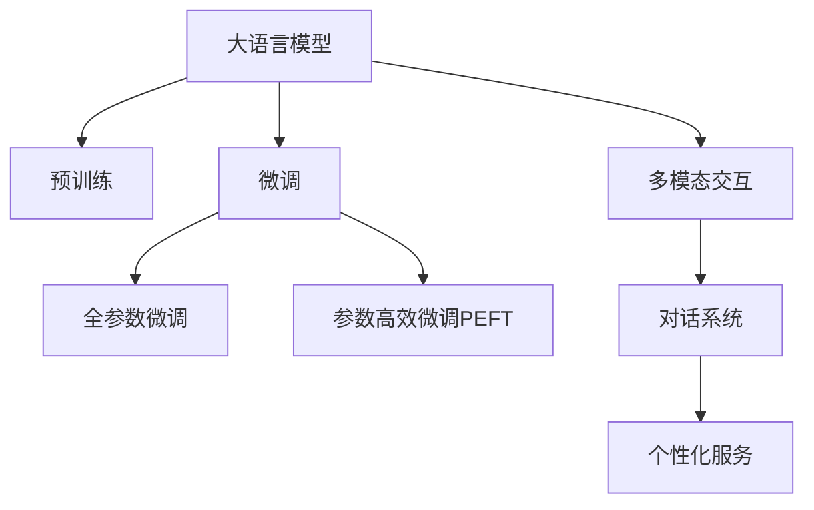

                 

# 大语言模型在个人助理领域的革新

> 关键词：大语言模型, 自然语言处理, 个性化服务, 智能助理, 语音识别, 多模态交互, 对话系统, 情感分析

## 1. 背景介绍

### 1.1 问题由来
个人助理，作为现代社会中不可或缺的智能助手，其发展经历了从简单的文本查询到复杂的对话交互的演进过程。早期的文本助理，如Apple的Siri、Google Assistant等，主要通过语音识别、文本解析和知识库查询等技术，帮助用户获取信息或执行特定任务。然而，这些系统往往缺乏语境理解能力和个性化交互能力，用户体验有限。

近年来，随着自然语言处理(Natural Language Processing, NLP)技术的飞速发展，大语言模型(Large Language Model, LLM)的涌现，个人助理系统迈入了智能化、个性化、多模态交互的新阶段。LLM技术通过大规模语料预训练，学习到丰富的语言知识和语义表示，具备强大的语言理解和生成能力，能够理解和执行复杂的多轮对话，甚至处理多模态数据，从而大幅提升个人助理系统的功能和用户体验。

### 1.2 问题核心关键点
大语言模型在个人助理领域的应用，主要聚焦于以下几个关键点：
- **语言理解与生成**：LLM能够理解自然语言指令，生成准确、流畅的文本或语音回复，从而实现与用户的自然对话。
- **个性化服务**：LLM可以学习用户的兴趣、偏好和习惯，提供个性化推荐和服务。
- **多模态交互**：结合文本、语音、图像等多种数据模态，构建多模态交互系统，增强用户互动体验。
- **知识融合与推理**：LLM能够整合各类知识库、规则库，进行事实验证和因果推理，增强决策的准确性和可靠性。
- **系统鲁棒性与泛化能力**：LLM在处理不同用户、不同场景下的指令时，保持稳定、可靠的输出。

这些关键点共同决定了LLM在个人助理领域的应用效果和用户满意度。

### 1.3 问题研究意义
大语言模型在个人助理领域的应用，不仅能够显著提升用户的交互体验，还能带来一系列社会经济效益：

1. **提高工作效率**：个人助理系统可以帮助用户自动化处理日常事务，如日程安排、邮件管理、文件查找等，大幅提升工作和生活效率。
2. **优化用户体验**：通过多轮对话和个性化推荐，LLM能够提供更加自然、智能的交互方式，让用户感到更加便利和愉悦。
3. **赋能企业创新**：企业可以将个人助理系统整合到内部系统，优化客户服务、市场分析、创新研发等环节，提高企业竞争力。
4. **促进数字化转型**：个人助理系统作为数字化工具的一部分，可以帮助企业和个人更好地应对数字化挑战，推动智能化、信息化的进程。
5. **推动社会智能化**：LLM在个人助理领域的应用，可以逐步普及到更多智能设备中，为智慧城市的建设贡献力量。

## 2. 核心概念与联系

### 2.1 核心概念概述

为更好地理解LLM在个人助理领域的应用，本节将介绍几个关键概念：

- **大语言模型(Large Language Model, LLM)**：以自回归(如GPT)或自编码(如BERT)模型为代表的大规模预训练语言模型。通过在大规模无标签文本语料上进行预训练，学习到丰富的语言知识和常识，具备强大的语言理解和生成能力。

- **预训练(Pre-training)**：指在大规模无标签文本语料上，通过自监督学习任务训练通用语言模型的过程。常见的预训练任务包括言语建模、遮挡语言模型等。预训练使得模型学习到语言的通用表示。

- **微调(Fine-tuning)**：指在预训练模型的基础上，使用下游任务的少量标注数据，通过有监督学习优化模型在特定任务上的性能。通常只需要调整顶层分类器或解码器，并以较小的学习率更新全部或部分的模型参数。

- **多模态交互(Multimodal Interaction)**：结合文本、语音、图像等多种数据模态，构建多模态交互系统，增强用户互动体验。

- **对话系统(Dialogue System)**：通过多轮对话，与用户进行自然交互的系统。常见的对话系统包括基于规则的对话系统、统计机器学习对话系统和基于深度学习的对话系统。

- **个性化服务(Personalized Service)**：根据用户的兴趣、偏好和历史行为，提供定制化的服务。

这些核心概念之间的逻辑关系可以通过以下Mermaid流程图来展示：



这个流程图展示了大语言模型的核心概念及其之间的关系：

1. 大语言模型通过预训练获得基础能力。
2. 微调是对预训练模型进行任务特定的优化，可以分为全参数微调和参数高效微调（PEFT）。
3. 多模态交互结合文本、语音、图像等多种数据模态，构建多模态交互系统。
4. 对话系统通过多轮对话，与用户进行自然交互。
5. 个性化服务根据用户的兴趣、偏好和历史行为，提供定制化的服务。

这些概念共同构成了大语言模型在个人助理领域的应用框架，使其能够在各种场景下提供强大的语言理解和生成能力。

## 3. 核心算法原理 & 具体操作步骤
### 3.1 算法原理概述

基于大语言模型在个人助理领域的应用，本质上是一个有监督的细粒度迁移学习过程。其核心思想是：将预训练的大语言模型视作一个强大的"特征提取器"，通过在下游任务的少量标注数据上进行有监督的微调，使得模型输出能够匹配任务标签，从而获得针对特定任务优化的模型。

形式化地，假设预训练模型为 $M_{\theta}$，其中 $\theta$ 为预训练得到的模型参数。给定下游任务 $T$ 的标注数据集 $D=\{(x_i, y_i)\}_{i=1}^N$，微调的目标是找到新的模型参数 $\hat{\theta}$，使得：

$$
\hat{\theta}=\mathop{\arg\min}_{\theta} \mathcal{L}(M_{\theta},D)
$$

其中 $\mathcal{L}$ 为针对任务 $T$ 设计的损失函数，用于衡量模型预测输出与真实标签之间的差异。常见的损失函数包括交叉熵损失、均方误差损失等。

通过梯度下降等优化算法，微调过程不断更新模型参数 $\theta$，最小化损失函数 $\mathcal{L}$，使得模型输出逼近真实标签。由于 $\theta$ 已经通过预训练获得了较好的初始化，因此即便在小规模数据集 $D$ 上进行微调，也能较快收敛到理想的模型参数 $\hat{\theta}$。

### 3.2 算法步骤详解

基于大语言模型在个人助理领域的应用，一般包括以下几个关键步骤：

**Step 1: 准备预训练模型和数据集**
- 选择合适的预训练语言模型 $M_{\theta}$ 作为初始化参数，如 BERT、GPT 等。
- 准备下游任务 $T$ 的标注数据集 $D$，划分为训练集、验证集和测试集。一般要求标注数据与预训练数据的分布不要差异过大。

**Step 2: 添加任务适配层**
- 根据任务类型，在预训练模型顶层设计合适的输出层和损失函数。
- 对于分类任务，通常在顶层添加线性分类器和交叉熵损失函数。
- 对于生成任务，通常使用语言模型的解码器输出概率分布，并以负对数似然为损失函数。

**Step 3: 设置微调超参数**
- 选择合适的优化算法及其参数，如 AdamW、SGD 等，设置学习率、批大小、迭代轮数等。
- 设置正则化技术及强度，包括权重衰减、Dropout、Early Stopping 等。
- 确定冻结预训练参数的策略，如仅微调顶层，或全部参数都参与微调。

**Step 4: 执行梯度训练**
- 将训练集数据分批次输入模型，前向传播计算损失函数。
- 反向传播计算参数梯度，根据设定的优化算法和学习率更新模型参数。
- 周期性在验证集上评估模型性能，根据性能指标决定是否触发 Early Stopping。
- 重复上述步骤直到满足预设的迭代轮数或 Early Stopping 条件。

**Step 5: 测试和部署**
- 在测试集上评估微调后模型 $M_{\hat{\theta}}$ 的性能，对比微调前后的精度提升。
- 使用微调后的模型对新样本进行推理预测，集成到实际的应用系统中。
- 持续收集新的数据，定期重新微调模型，以适应数据分布的变化。

以上是基于大语言模型在个人助理领域的应用的一般流程。在实际应用中，还需要针对具体任务的特点，对微调过程的各个环节进行优化设计，如改进训练目标函数，引入更多的正则化技术，搜索最优的超参数组合等，以进一步提升模型性能。

### 3.3 算法优缺点

基于大语言模型在个人助理领域的应用方法具有以下优点：
1. 简单高效。只需准备少量标注数据，即可对预训练模型进行快速适配，获得较大的性能提升。
2. 通用适用。适用于各种个人助理任务，包括问答、对话、摘要等，设计简单的任务适配层即可实现微调。
3. 参数高效。利用参数高效微调技术，在固定大部分预训练参数的情况下，仍可取得不错的提升。
4. 效果显著。在学术界和工业界的诸多任务上，基于微调的方法已经刷新了最先进的性能指标。

同时，该方法也存在一定的局限性：
1. 依赖标注数据。微调的效果很大程度上取决于标注数据的质量和数量，获取高质量标注数据的成本较高。
2. 迁移能力有限。当目标任务与预训练数据的分布差异较大时，微调的性能提升有限。
3. 负面效果传递。预训练模型的固有偏见、有害信息等，可能通过微调传递到下游任务，造成负面影响。
4. 可解释性不足。微调模型的决策过程通常缺乏可解释性，难以对其推理逻辑进行分析和调试。

尽管存在这些局限性，但就目前而言，基于大语言模型的微调方法仍然是大语言模型应用的最主流范式。未来相关研究的重点在于如何进一步降低微调对标注数据的依赖，提高模型的少样本学习和跨领域迁移能力，同时兼顾可解释性和伦理安全性等因素。

### 3.4 算法应用领域

基于大语言模型在个人助理领域的应用方法，在NLP领域已经得到了广泛的应用，覆盖了几乎所有常见任务，例如：

- 文本分类：如情感分析、主题分类、意图识别等。通过微调使模型学习文本-标签映射。
- 命名实体识别：识别文本中的人名、地名、机构名等特定实体。通过微调使模型掌握实体边界和类型。
- 关系抽取：从文本中抽取实体之间的语义关系。通过微调使模型学习实体-关系三元组。
- 问答系统：对自然语言问题给出答案。将问题-答案对作为微调数据，训练模型学习匹配答案。
- 机器翻译：将源语言文本翻译成目标语言。通过微调使模型学习语言-语言映射。
- 文本摘要：将长文本压缩成简短摘要。将文章-摘要对作为微调数据，使模型学习抓取要点。
- 对话系统：使机器能够与人自然对话。将多轮对话历史作为上下文，微调模型进行回复生成。

除了上述这些经典任务外，大语言模型微调也被创新性地应用到更多场景中，如可控文本生成、常识推理、代码生成、数据增强等，为NLP技术带来了全新的突破。随着预训练模型和微调方法的不断进步，相信NLP技术将在更广阔的应用领域大放异彩。

## 4. 数学模型和公式 & 详细讲解  
### 4.1 数学模型构建

本节将使用数学语言对基于大语言模型在个人助理领域的应用过程进行更加严格的刻画。

记预训练语言模型为 $M_{\theta}$，其中 $\theta$ 为预训练得到的模型参数。假设微调任务的训练集为 $D=\{(x_i,y_i)\}_{i=1}^N, x_i \in \mathcal{X}, y_i \in \mathcal{Y}$。

定义模型 $M_{\theta}$ 在数据样本 $(x,y)$ 上的损失函数为 $\ell(M_{\theta}(x),y)$，则在数据集 $D$ 上的经验风险为：

$$
\mathcal{L}(\theta) = \frac{1}{N} \sum_{i=1}^N \ell(M_{\theta}(x_i),y_i)
$$

微调的优化目标是最小化经验风险，即找到最优参数：

$$
\theta^* = \mathop{\arg\min}_{\theta} \mathcal{L}(\theta)
$$

在实践中，我们通常使用基于梯度的优化算法（如SGD、Adam等）来近似求解上述最优化问题。设 $\eta$ 为学习率，$\lambda$ 为正则化系数，则参数的更新公式为：

$$
\theta \leftarrow \theta - \eta \nabla_{\theta}\mathcal{L}(\theta) - \eta\lambda\theta
$$

其中 $\nabla_{\theta}\mathcal{L}(\theta)$ 为损失函数对参数 $\theta$ 的梯度，可通过反向传播算法高效计算。

### 4.2 公式推导过程

以下我们以命名实体识别(NER)任务为例，推导交叉熵损失函数及其梯度的计算公式。

假设模型 $M_{\theta}$ 在输入 $x$ 上的输出为 $\hat{y}=M_{\theta}(x) \in [0,1]$，表示样本属于正类的概率。真实标签 $y \in \{0,1\}$。则二分类交叉熵损失函数定义为：

$$
\ell(M_{\theta}(x),y) = -[y\log \hat{y} + (1-y)\log (1-\hat{y})]
$$

将其代入经验风险公式，得：

$$
\mathcal{L}(\theta) = -\frac{1}{N}\sum_{i=1}^N [y_i\log M_{\theta}(x_i)+(1-y_i)\log(1-M_{\theta}(x_i))]
$$

根据链式法则，损失函数对参数 $\theta_k$ 的梯度为：

$$
\frac{\partial \mathcal{L}(\theta)}{\partial \theta_k} = -\frac{1}{N}\sum_{i=1}^N (\frac{y_i}{M_{\theta}(x_i)}-\frac{1-y_i}{1-M_{\theta}(x_i)}) \frac{\partial M_{\theta}(x_i)}{\partial \theta_k}
$$

其中 $\frac{\partial M_{\theta}(x_i)}{\partial \theta_k}$ 可进一步递归展开，利用自动微分技术完成计算。

在得到损失函数的梯度后，即可带入参数更新公式，完成模型的迭代优化。重复上述过程直至收敛，最终得到适应下游任务的最优模型参数 $\theta^*$。

## 5. 项目实践：代码实例和详细解释说明
### 5.1 开发环境搭建

在进行微调实践前，我们需要准备好开发环境。以下是使用Python进行PyTorch开发的环境配置流程：

1. 安装Anaconda：从官网下载并安装Anaconda，用于创建独立的Python环境。

2. 创建并激活虚拟环境：
```bash
conda create -n pytorch-env python=3.8 
conda activate pytorch-env
```

3. 安装PyTorch：根据CUDA版本，从官网获取对应的安装命令。例如：
```bash
conda install pytorch torchvision torchaudio cudatoolkit=11.1 -c pytorch -c conda-forge
```

4. 安装Transformers库：
```bash
pip install transformers
```

5. 安装各类工具包：
```bash
pip install numpy pandas scikit-learn matplotlib tqdm jupyter notebook ipython
```

完成上述步骤后，即可在`pytorch-env`环境中开始微调实践。

### 5.2 源代码详细实现

下面我们以命名实体识别(NER)任务为例，给出使用Transformers库对BERT模型进行微调的PyTorch代码实现。

首先，定义NER任务的数据处理函数：

```python
from transformers import BertTokenizer
from torch.utils.data import Dataset
import torch

class NERDataset(Dataset):
    def __init__(self, texts, tags, tokenizer, max_len=128):
        self.texts = texts
        self.tags = tags
        self.tokenizer = tokenizer
        self.max_len = max_len
        
    def __len__(self):
        return len(self.texts)
    
    def __getitem__(self, item):
        text = self.texts[item]
        tags = self.tags[item]
        
        encoding = self.tokenizer(text, return_tensors='pt', max_length=self.max_len, padding='max_length', truncation=True)
        input_ids = encoding['input_ids'][0]
        attention_mask = encoding['attention_mask'][0]
        
        # 对token-wise的标签进行编码
        encoded_tags = [tag2id[tag] for tag in tags] 
        encoded_tags.extend([tag2id['O']] * (self.max_len - len(encoded_tags)))
        labels = torch.tensor(encoded_tags, dtype=torch.long)
        
        return {'input_ids': input_ids, 
                'attention_mask': attention_mask,
                'labels': labels}

# 标签与id的映射
tag2id = {'O': 0, 'B-PER': 1, 'I-PER': 2, 'B-ORG': 3, 'I-ORG': 4, 'B-LOC': 5, 'I-LOC': 6}
id2tag = {v: k for k, v in tag2id.items()}

# 创建dataset
tokenizer = BertTokenizer.from_pretrained('bert-base-cased')

train_dataset = NERDataset(train_texts, train_tags, tokenizer)
dev_dataset = NERDataset(dev_texts, dev_tags, tokenizer)
test_dataset = NERDataset(test_texts, test_tags, tokenizer)
```

然后，定义模型和优化器：

```python
from transformers import BertForTokenClassification, AdamW

model = BertForTokenClassification.from_pretrained('bert-base-cased', num_labels=len(tag2id))

optimizer = AdamW(model.parameters(), lr=2e-5)
```

接着，定义训练和评估函数：

```python
from torch.utils.data import DataLoader
from tqdm import tqdm
from sklearn.metrics import classification_report

device = torch.device('cuda') if torch.cuda.is_available() else torch.device('cpu')
model.to(device)

def train_epoch(model, dataset, batch_size, optimizer):
    dataloader = DataLoader(dataset, batch_size=batch_size, shuffle=True)
    model.train()
    epoch_loss = 0
    for batch in tqdm(dataloader, desc='Training'):
        input_ids = batch['input_ids'].to(device)
        attention_mask = batch['attention_mask'].to(device)
        labels = batch['labels'].to(device)
        model.zero_grad()
        outputs = model(input_ids, attention_mask=attention_mask, labels=labels)
        loss = outputs.loss
        epoch_loss += loss.item()
        loss.backward()
        optimizer.step()
    return epoch_loss / len(dataloader)

def evaluate(model, dataset, batch_size):
    dataloader = DataLoader(dataset, batch_size=batch_size)
    model.eval()
    preds, labels = [], []
    with torch.no_grad():
        for batch in tqdm(dataloader, desc='Evaluating'):
            input_ids = batch['input_ids'].to(device)
            attention_mask = batch['attention_mask'].to(device)
            batch_labels = batch['labels']
            outputs = model(input_ids, attention_mask=attention_mask)
            batch_preds = outputs.logits.argmax(dim=2).to('cpu').tolist()
            batch_labels = batch_labels.to('cpu').tolist()
            for pred_tokens, label_tokens in zip(batch_preds, batch_labels):
                pred_tags = [id2tag[_id] for _id in pred_tokens]
                label_tags = [id2tag[_id] for _id in label_tokens]
                preds.append(pred_tags[:len(label_tags)])
                labels.append(label_tags)
                
    print(classification_report(labels, preds))
```

最后，启动训练流程并在测试集上评估：

```python
epochs = 5
batch_size = 16

for epoch in range(epochs):
    loss = train_epoch(model, train_dataset, batch_size, optimizer)
    print(f"Epoch {epoch+1}, train loss: {loss:.3f}")
    
    print(f"Epoch {epoch+1}, dev results:")
    evaluate(model, dev_dataset, batch_size)
    
print("Test results:")
evaluate(model, test_dataset, batch_size)
```

以上就是使用PyTorch对BERT进行命名实体识别任务微调的完整代码实现。可以看到，得益于Transformers库的强大封装，我们可以用相对简洁的代码完成BERT模型的加载和微调。

### 5.3 代码解读与分析

让我们再详细解读一下关键代码的实现细节：

**NERDataset类**：
- `__init__`方法：初始化文本、标签、分词器等关键组件。
- `__len__`方法：返回数据集的样本数量。
- `__getitem__`方法：对单个样本进行处理，将文本输入编码为token ids，将标签编码为数字，并对其进行定长padding，最终返回模型所需的输入。

**tag2id和id2tag字典**：
- 定义了标签与数字id之间的映射关系，用于将token-wise的预测结果解码回真实的标签。

**训练和评估函数**：
- 使用PyTorch的DataLoader对数据集进行批次化加载，供模型训练和推理使用。
- 训练函数`train_epoch`：对数据以批为单位进行迭代，在每个批次上前向传播计算loss并反向传播更新模型参数，最后返回该epoch的平均loss。
- 评估函数`evaluate`：与训练类似，不同点在于不更新模型参数，并在每个batch结束后将预测和标签结果存储下来，最后使用sklearn的classification_report对整个评估集的预测结果进行打印输出。

**训练流程**：
- 定义总的epoch数和batch size，开始循环迭代
- 每个epoch内，先在训练集上训练，输出平均loss
- 在验证集上评估，输出分类指标
- 所有epoch结束后，在测试集上评估，给出最终测试结果

可以看到，PyTorch配合Transformers库使得BERT微调的代码实现变得简洁高效。开发者可以将更多精力放在数据处理、模型改进等高层逻辑上，而不必过多关注底层的实现细节。

当然，工业级的系统实现还需考虑更多因素，如模型的保存和部署、超参数的自动搜索、更灵活的任务适配层等。但核心的微调范式基本与此类似。

## 6. 实际应用场景
### 6.1 智能客服系统

基于大语言模型微调的对话技术，可以广泛应用于智能客服系统的构建。传统客服往往需要配备大量人力，高峰期响应缓慢，且一致性和专业性难以保证。而使用微调后的对话模型，可以7x24小时不间断服务，快速响应客户咨询，用自然流畅的语言解答各类常见问题。

在技术实现上，可以收集企业内部的历史客服对话记录，将问题和最佳答复构建成监督数据，在此基础上对预训练对话模型进行微调。微调后的对话模型能够自动理解用户意图，匹配最合适的答案模板进行回复。对于客户提出的新问题，还可以接入检索系统实时搜索相关内容，动态组织生成回答。如此构建的智能客服系统，能大幅提升客户咨询体验和问题解决效率。

### 6.2 金融舆情监测

金融机构需要实时监测市场舆论动向，以便及时应对负面信息传播，规避金融风险。传统的人工监测方式成本高、效率低，难以应对网络时代海量信息爆发的挑战。基于大语言模型微调的文本分类和情感分析技术，为金融舆情监测提供了新的解决方案。

具体而言，可以收集金融领域相关的新闻、报道、评论等文本数据，并对其进行主题标注和情感标注。在此基础上对预训练语言模型进行微调，使其能够自动判断文本属于何种主题，情感倾向是正面、中性还是负面。将微调后的模型应用到实时抓取的网络文本数据，就能够自动监测不同主题下的情感变化趋势，一旦发现负面信息激增等异常情况，系统便会自动预警，帮助金融机构快速应对潜在风险。

### 6.3 个性化推荐系统

当前的推荐系统往往只依赖用户的历史行为数据进行物品推荐，无法深入理解用户的真实兴趣偏好。基于大语言模型微调技术，个性化推荐系统可以更好地挖掘用户行为背后的语义信息，从而提供更精准、多样的推荐内容。

在实践中，可以收集用户浏览、点击、评论、分享等行为数据，提取和用户交互的物品标题、描述、标签等文本内容。将文本内容作为模型输入，用户的后续行为（如是否点击、购买等）作为监督信号，在此基础上微调预训练语言模型。微调后的模型能够从文本内容中准确把握用户的兴趣点。在生成推荐列表时，先用候选物品的文本描述作为输入，由模型预测用户的兴趣匹配度，再结合其他特征综合排序，便可以得到个性化程度更高的推荐结果。

### 6.4 未来应用展望

随着大语言模型和微调方法的不断发展，基于微调范式将在更多领域得到应用，为传统行业带来变革性影响。

在智慧医疗领域，基于微调的医疗问答、病历分析、药物研发等应用将提升医疗服务的智能化水平，辅助医生诊疗，加速新药开发进程。

在智能教育领域，微调技术可应用于作业批改、学情分析、知识推荐等方面，因材施教，促进教育公平，提高教学质量。

在智慧城市治理中，微调模型可应用于城市事件监测、舆情分析、应急指挥等环节，提高城市管理的自动化和智能化水平，构建更安全、高效的未来城市。

此外，在企业生产、社会治理、文娱传媒等众多领域，基于大模型微调的人工智能应用也将不断涌现，为NLP技术带来了全新的突破。随着预训练模型和微调方法的不断进步，相信NLP技术将在更广阔的应用领域大放异彩。

## 7. 工具和资源推荐
### 7.1 学习资源推荐

为了帮助开发者系统掌握大语言模型微调的理论基础和实践技巧，这里推荐一些优质的学习资源：

1. 《Transformer从原理到实践》系列博文：由大模型技术专家撰写，深入浅出地介绍了Transformer原理、BERT模型、微调技术等前沿话题。

2. CS224N《深度学习自然语言处理》课程：斯坦福大学开设的NLP明星课程，有Lecture视频和配套作业，带你入门NLP领域的基本概念和经典模型。

3. 《Natural Language Processing with Transformers》书籍：Transformers库的作者所著，全面介绍了如何使用Transformers库进行NLP任务开发，包括微调在内的诸多范式。

4. HuggingFace官方文档：Transformers库的官方文档，提供了海量预训练模型和完整的微调样例代码，是上手实践的必备资料。

5. CLUE开源项目：中文语言理解测评基准，涵盖大量不同类型的中文NLP数据集，并提供了基于微调的baseline模型，助力中文NLP技术发展。

通过对这些资源的学习实践，相信你一定能够快速掌握大语言模型微调的精髓，并用于解决实际的NLP问题。
###  7.2 开发工具推荐

高效的开发离不开优秀的工具支持。以下是几款用于大语言模型微调开发的常用工具：

1. PyTorch：基于Python的开源深度学习框架，灵活动态的计算图，适合快速迭代研究。大部分预训练语言模型都有PyTorch版本的实现。

2. TensorFlow：由Google主导开发的开源深度学习框架，生产部署方便，适合大规模工程应用。同样有丰富的预训练语言模型资源。

3. Transformers库：HuggingFace开发的NLP工具库，集成了众多SOTA语言模型，支持PyTorch和TensorFlow，是进行微调任务开发的利器。

4. Weights & Biases：模型训练的实验跟踪工具，可以记录和可视化模型训练过程中的各项指标，方便对比和调优。与主流深度学习框架无缝集成。

5. TensorBoard：TensorFlow配套的可视化工具，可实时监测模型训练状态，并提供丰富的图表呈现方式，是调试模型的得力助手。

6. Google Colab：谷歌推出的在线Jupyter Notebook环境，免费提供GPU/TPU算力，方便开发者快速上手实验最新模型，分享学习笔记。

合理利用这些工具，可以显著提升大语言模型微调任务的开发效率，加快创新迭代的步伐。

### 7.3 相关论文推荐

大语言模型和微调技术的发展源于学界的持续研究。以下是几篇奠基性的相关论文，推荐阅读：

1. Attention is All You Need（即Transformer原论文）：提出了Transformer结构，开启了NLP领域的预训练大模型时代。

2. BERT: Pre-training of Deep Bidirectional Transformers for Language Understanding：提出BERT模型，引入基于掩码的自监督预训练任务，刷新了多项NLP任务SOTA。

3. Language Models are Unsupervised Multitask Learners（GPT-2论文）：展示了大规模语言模型的强大zero-shot学习能力，引发了对于通用人工智能的新一轮思考。

4. Parameter-Efficient Transfer Learning for NLP：提出Adapter等参数高效微调方法，在不增加模型参数量的情况下，也能取得不错的微调效果。

5. Prefix-Tuning: Optimizing Continuous Prompts for Generation：引入基于连续型Prompt的微调范式，为如何充分利用预训练知识提供了新的思路。

6. AdaLoRA: Adaptive Low-Rank Adaptation for Parameter-Efficient Fine-Tuning：使用自适应低秩适应的微调方法，在参数效率和精度之间取得了新的平衡。

这些论文代表了大语言模型微调技术的发展脉络。通过学习这些前沿成果，可以帮助研究者把握学科前进方向，激发更多的创新灵感。

## 8. 总结：未来发展趋势与挑战

### 8.1 总结

本文对基于大语言模型在个人助理领域的应用进行了全面系统的介绍。首先阐述了大语言模型和微调技术的研究背景和意义，明确了微调在拓展预训练模型应用、提升下游任务性能方面的独特价值。其次，从原理到实践，详细讲解了基于大语言模型的微调过程，给出了微调任务开发的完整代码实例。同时，本文还广泛探讨了微调方法在智能客服、金融舆情、个性化推荐等多个行业领域的应用前景，展示了微调范式的巨大潜力。此外，本文精选了微调技术的各类学习资源，力求为读者提供全方位的技术指引。

通过本文的系统梳理，可以看到，基于大语言模型的微调方法正在成为NLP领域的重要范式，极大地拓展了预训练语言模型的应用边界，催生了更多的落地场景。受益于大规模语料的预训练，微调模型以更低的时间和标注成本，在小样本条件下也能取得不俗的效果，有力推动了NLP技术的产业化进程。未来，伴随预训练语言模型和微调方法的持续演进，相信NLP技术将在更广阔的应用领域大放异彩，深刻影响人类的生产生活方式。

### 8.2 未来发展趋势

展望未来，大语言模型在个人助理领域的应用将呈现以下几个发展趋势：

1. **多模态交互的提升**：结合文本、语音、图像等多种数据模态，构建更加丰富的多模态交互系统，提升用户互动体验。

2. **个性化的深度挖掘**：通过多轮对话和上下文理解，更好地挖掘用户的兴趣和需求，提供更加精准、个性化的服务。

3. **知识图谱的整合**：将符号化的先验知识与神经网络模型进行融合，构建更加全面、准确的知识图谱，增强系统的决策能力。

4. **推理能力的增强**：引入因果推断和逻辑推理方法，增强系统的逻辑推理和事实验证能力，提升决策的可靠性。

5. **联邦学习的应用**：在用户数据隐私保护的前提下，通过联邦学习技术，实现模型在分布式环境下的联合训练，提升模型的泛化能力。

6. **零样本和少样本学习**：利用大语言模型在大量语料上学习到的知识，实现对新任务的低样本和零样本学习，降低对标注数据的依赖。

7. **多领域应用的拓展**：将大语言模型微调技术应用于更多行业领域，如医疗、教育、金融等，推动这些行业的智能化转型。

8. **可持续发展的智能助理**：构建能够自我学习和适应新场景的智能助理系统，实现可持续发展。

以上趋势凸显了大语言模型在个人助理领域的应用前景。这些方向的探索发展，必将进一步提升系统的功能性和用户体验，为人工智能技术在更多场景中的落地应用提供新的动力。

### 8.3 面临的挑战

尽管大语言模型在个人助理领域的应用已经取得了显著进展，但在迈向更加智能化、普适化应用的过程中，仍面临诸多挑战：

1. **隐私保护**：如何保护用户隐私，尤其是在对话、推荐等应用中，用户的个人数据如何安全处理和存储，是一个重要问题。

2. **用户接受度**：智能助理系统如何获得用户的信任和接受，尤其是对于隐私敏感的领域，如何让用户放心使用。

3. **模型偏见**：大语言模型可能在训练过程中学习到偏见和歧视性信息，如何识别和消除这些偏见，是一个重要的研究课题。

4. **交互自然性**：如何构建自然流畅的对话，避免机械化的回应，提升用户满意度。

5. **计算资源**：大语言模型往往需要高计算资源支持，如何在资源有限的条件下，提供高效、优质的服务。

6. **可解释性**：如何增强系统的可解释性，让用户理解和信任其决策过程。

7. **人机协作**：如何构建人机协作系统，在特定场景下，与人类协作完成任务，而不是简单取代人类。

8. **系统鲁棒性**：如何在不同场景和不同数据分布下，保持系统的稳定性和鲁棒性。

这些挑战需要学术界、产业界和用户社区的共同努力，才能逐步克服，实现大语言模型在个人助理领域的广泛应用。

### 8.4 研究展望

面对大语言模型在个人助理领域的应用所面临的挑战，未来的研究需要在以下几个方面寻求新的突破：

1. **隐私保护技术的创新**：开发更加安全的隐私保护技术，如差分隐私、联邦学习等，保护用户数据的安全和隐私。

2. **自然语言理解能力的提升**：利用最新的自然语言理解技术，提升智能助理系统的语言理解和生成能力，构建更加自然的交互体验。

3. **知识图谱的构建和融合**：构建更加全面、准确的知识图谱，与神经网络模型进行有效融合，增强系统的决策能力。

4. **因果推理和逻辑推理**：引入因果推断和逻辑推理方法，增强系统的逻辑推理和事实验证能力，提升决策的可靠性。

5. **联邦学习的应用**：通过联邦学习技术，实现模型在分布式环境下的联合训练，提升模型的泛化能力。

6. **零样本和少样本学习**：利用大语言模型在大量语料上学习到的知识，实现对新任务的低样本和零样本学习，降低对标注数据的依赖。

7. **多领域应用的拓展**：将大语言模型微调技术应用于更多行业领域，如医疗、教育、金融等，推动这些行业的智能化转型。

8. **可持续发展的智能助理**：构建能够自我学习和适应新场景的智能助理系统，实现可持续发展。

这些研究方向的探索，必将引领大语言模型在个人助理领域迈向更高的台阶，为构建安全、可靠、可解释、可控的智能系统铺平道路。面向未来，大语言模型在个人助理领域的应用需要与其他人工智能技术进行更深入的融合，如知识表示、因果推理、强化学习等，多路径协同发力，共同推动自然语言理解和智能交互系统的进步。只有勇于创新、敢于突破，才能不断拓展语言模型的边界，让智能技术更好地造福人类社会。

## 9. 附录：常见问题与解答

**Q1：大语言模型在个人助理领域是否有局限性？**

A: 大语言模型在个人助理领域的应用确实存在一些局限性，主要体现在以下几个方面：

1. **隐私保护问题**：在对话、推荐等应用中，用户的个人数据如何安全处理和存储，是一个重要问题。需要采取差分隐私、联邦学习等技术手段来保护用户隐私。

2. **用户接受度**：如何获得用户的信任和接受，尤其是对于隐私敏感的领域，如何让用户放心使用，是一个需要重点考虑的问题。

3. **模型偏见**：大语言模型可能在训练过程中学习到偏见和歧视性信息，如何识别和消除这些偏见，是一个重要的研究课题。

4. **交互自然性**：如何构建自然流畅的对话，避免机械化的回应，提升用户满意度，是一个关键问题。

5. **计算资源**：大语言模型往往需要高计算资源支持，如何在资源有限的条件下，提供高效、优质的服务，是一个挑战。

6. **可解释性**：如何增强系统的可解释性，让用户理解和信任其决策过程，是一个需要解决的问题。

7. **人机协作**：如何构建人机协作系统，在特定场景下，与人类协作完成任务，而不是简单取代人类，是一个需要深入研究的问题。

8. **系统鲁棒性**：如何在不同场景和不同数据分布下，保持系统的稳定性和鲁棒性，是一个需要重视的问题。

这些局限性需要我们在应用大语言模型时，进行全面考虑和优化，才能充分发挥其优势，提供更加优质的服务。

**Q2：如何选择适合个人助理系统的大语言模型？**

A: 选择适合个人助理系统的大语言模型，需要综合考虑以下几个方面：

1. **语言能力**：选择能够处理自然语言指令、生成自然语言回复的模型，如GPT-3、T5等。

2. **数据量**：选择在大规模无标签语料上预训练过的模型，如BERT、GPT等，以保证其在各种任务上的泛化能力。

3. **参数量**：选择参数量适中的模型，以在计算资源有限的情况下，仍能保证性能。

4. **可解释性**：选择具有较好可解释性的模型，如使用自注意力机制、规则可解释的模型等，便于对模型的决策过程进行分析和调试。

5. **多模态处理能力**：选择能够处理文本、语音、图像等多模态数据的模型，如Multimodal T5等。

6. **开源和社区支持**：选择开源、社区活跃的模型，便于获取学习资源和技术支持。

7. **应用场景匹配**：选择适用于特定应用场景的模型，如金融舆情监测、智能客服、个性化推荐等。

综上所述，选择合适的模型需要根据具体的任务需求、数据条件、计算资源等因素进行综合评估。

**Q3：大语言模型在个人助理系统中如何进行多轮对话？**

A: 大语言模型在个人助理系统中进行多轮对话，通常需要设计合适的对话管理机制和上下文跟踪机制。

1. **对话管理机制**：通过对话管理策略，确定对话的流程和交互方式，如规则型、统计型、生成型等。

2. **上下文跟踪机制**：在多轮对话中，需要记录和传递上下文信息，确保对话的连贯性和一致性。

3. **意图识别**：通过自然语言理解技术，识别用户的意图和需求，指导对话系统的下一步操作。

4. **状态转移**：根据用户的反馈和上下文信息，动态调整对话的状态和策略，提升对话的自然性和交互体验。

5. **记忆和回溯**：在对话过程中，需要保存对话历史，以便在后续对话中回溯和利用。

综上所述，多轮对话的实现需要对话管理、上下文跟踪、意图识别、状态转移和记忆回溯等多方面的协同工作，才能构建自然流畅、高效的对话系统。

**Q4：大语言模型在个人助理系统中如何进行个性化服务？**

A: 大语言模型在个人助理系统中进行个性化服务，通常需要设计合适的个性化推荐算法和用户画像构建机制。

1. **个性化推荐算法**：通过学习用户的兴趣、偏好和历史行为，提供个性化的推荐内容，如推荐系统、知识推荐等。

2. **用户画像构建**：通过多轮对话和上下文理解，构建详细的用户画像，包括用户的兴趣、习惯、行为等。

3. **数据隐私保护**：在构建用户画像时，需要严格保护用户隐私，如采用差分隐私、联邦学习等技术手段。

4. **动态调整**：根据用户的反馈和行为，动态调整推荐算法和用户画像，提升个性化服务的准确性和时效性。

5. **多样性和公平性**：在推荐过程中，需要考虑多样性和公平性，避免推荐内容的同质化和偏见。

综上所述，个性化服务的实现需要个性化推荐算法和用户画像构建的协同工作，同时严格保护用户隐私，动态调整和优化推荐策略，才能提供高效、精准的个性化服务。

**Q5：大语言模型在个人助理系统中如何进行多领域应用？**

A: 大语言模型在个人助理系统中进行多领域应用，通常需要设计合适的领域适配层和任务适配层。

1

