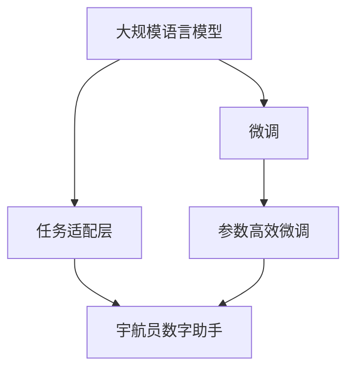

                 

# LLM在太空探索中的应用：AI宇航员

## 1. 背景介绍

太空探索是人类自古以来就有的梦想，而现代太空探索的脚步早已从地球奔向了更遥远的星系。人工智能（AI）正在成为未来太空探索中不可或缺的一部分，特别是在太空机器人与行星探测任务中。语言模型（Language Model, LM），尤其是大规模语言模型（Large Language Model, LLM），以其强大的语言理解能力，有望为太空探索带来革命性的变化。本文将探讨LLM在太空探索中的应用，并展示如何通过微调（Fine-Tuning）等技术，使LLM成为宇航员的数字助手，助力人类探索未知宇宙。

## 2. 核心概念与联系

### 2.1 核心概念概述

为了更好地理解LLM在太空探索中的应用，我们首先需要了解一些核心概念：

- **大规模语言模型**：如GPT、BERT等，是使用自回归或自编码模型，在大规模文本数据上预训练的语言模型。它们能够捕捉语言的广泛上下文关系和语义结构。

- **微调（Fine-Tuning）**：在预训练模型基础上，通过有监督的训练数据集，调整模型参数以适应特定任务。它是一种将通用知识迁移至特定领域的方法。

- **宇航员的数字助手**：通过AI技术，为宇航员提供信息检索、通信、决策支持等服务，提高太空探索任务的效率和安全性。

- **任务适配层**：根据太空探索任务需求，定制的模型输出层和损失函数。

- **参数高效微调（Parameter-Efficient Fine-Tuning, PEFT）**：仅微调模型的一部分参数，如适配器（Adapters），以减少计算资源消耗。

这些概念之间存在紧密联系，通过微调，LLM可以学习特定太空探索任务的特定知识，成为宇航员的得力助手。

### 2.2 核心概念原理和架构的 Mermaid 流程图



以上流程图展示了LLM在太空探索中的应用框架：预训练的LM通过微调获得任务特定的知识，进而适配宇航员助手的功能。

## 3. 核心算法原理 & 具体操作步骤

### 3.1 算法原理概述

基于LLM的宇航员数字助手模型，通过微调技术，使其能够适应特定太空探索任务。其核心原理是利用LLM的预训练知识，通过有监督的太空探索任务数据集，微调模型参数，使其输出符合任务需求。微调后的模型可以执行信息检索、自动生成任务指令、提供决策支持等功能。

### 3.2 算法步骤详解

1. **数据准备**：收集太空探索任务相关的数据集，如行星信息、空间探测器遥感图像、宇航员任务指令等，并进行预处理，包括数据清洗、分词、向量化等。

2. **模型选择与初始化**：选择适当的LLM，如GPT-3、BERT等，并进行初始化，加载预训练权重。

3. **任务适配层设计**：根据任务需求，设计模型输出层和损失函数。例如，对于信息检索任务，可以设计向量内积损失函数；对于任务指令生成，可以使用交叉熵损失函数。

4. **微调**：使用太空探索任务数据集，对模型进行微调。微调过程中，使用AdamW等优化算法，控制学习率，避免过拟合。

5. **评估与部署**：在验证集上评估模型性能，确保模型稳定可靠。部署模型到太空探索器上，提供宇航员数字助手服务。

### 3.3 算法优缺点

**优点**：

- **高效适应新任务**：LLM通过微调可以快速适应新任务，提高任务执行效率。
- **节省资源**：参数高效微调技术可以显著减少模型参数量，降低计算资源消耗。
- **提升决策质量**：基于LLM的信息检索和推理能力，提高太空探索任务决策的准确性。

**缺点**：

- **依赖高质量数据**：微调效果依赖于太空探索任务的标注数据质量，数据不足可能影响性能。
- **模型泛化能力有限**：微调模型可能对未见过的数据泛化性能不足，需要不断收集数据以提升模型能力。
- **系统复杂性**：模型部署在太空环境中，需要考虑硬件限制、网络延迟、能量消耗等实际问题。

### 3.4 算法应用领域

LLM在太空探索中的应用领域广泛，包括但不限于以下几个方面：

- **太空探测器控制**：基于任务指令生成的微调模型，为太空探测器提供自动化的控制指令。
- **任务规划与调度**：使用信息检索和任务推荐模型，优化太空任务的规划与调度。
- **遥感数据分析**：通过微调模型进行遥感图像分析，提取关键信息。
- **宇航员通信**：提供智能翻译和信息处理服务，辅助宇航员进行跨语言通信。
- **健康监测**：使用微调模型分析宇航员健康数据，提供健康建议和预警。

## 4. 数学模型和公式 & 详细讲解 & 举例说明

### 4.1 数学模型构建

假设太空探索任务数据集为 $D=\{(x_i,y_i)\}_{i=1}^N$，其中 $x_i$ 为太空任务指令或遥感图像等输入，$y_i$ 为任务标签。微调的目标是调整模型参数 $\theta$，使得模型输出 $\hat{y}$ 与 $y$ 的距离最小化。常见的损失函数包括交叉熵损失、均方误差损失等。

### 4.2 公式推导过程

以二分类任务为例，交叉熵损失函数定义如下：

$$
\ell(M_{\theta}(x),y) = -[y\log \hat{y} + (1-y)\log(1-\hat{y})]
$$

模型在数据集 $D$ 上的经验风险为：

$$
\mathcal{L}(\theta) = \frac{1}{N}\sum_{i=1}^N \ell(M_{\theta}(x_i),y_i)
$$

微调的优化目标是最小化经验风险，即：

$$
\theta^* = \mathop{\arg\min}_{\theta} \mathcal{L}(\theta)
$$

### 4.3 案例分析与讲解

以太空探测器自动控制指令生成为例，微调模型的目标是生成符合太空探测器控制规则的指令。我们收集大量的太空探测器控制数据，包括不同探测器的控制指令和相应的实际执行结果。将数据集分为训练集、验证集和测试集。训练集用于模型微调，验证集用于参数调整，测试集用于最终性能评估。

## 5. 项目实践：代码实例和详细解释说明

### 5.1 开发环境搭建

1. 安装Anaconda，创建虚拟环境。
2. 安装PyTorch、TensorFlow等深度学习框架。
3. 安装Transformers库，用于加载和微调预训练模型。

### 5.2 源代码详细实现

假设我们要使用GPT-3微调太空探测器控制指令生成模型，代码如下：

```python
from transformers import GPT3Model, GPT3Tokenizer, AdamW
from torch.utils.data import DataLoader
import torch

# 初始化模型和优化器
model = GPT3Model.from_pretrained('gpt3')
optimizer = AdamW(model.parameters(), lr=1e-5)

# 定义任务适配层
class SpaceCommandAdapter:
    def __init__(self, model):
        self.model = model
        self.to(device)

    def forward(self, x):
        return self.model(x)

# 加载和微调模型
tokenizer = GPT3Tokenizer.from_pretrained('gpt3')
train_dataset = ...
val_dataset = ...
test_dataset = ...
model = SpaceCommandAdapter(model)
for epoch in range(10):
    for batch in DataLoader(train_dataset, batch_size=16):
        inputs = tokenizer(batch, padding=True, return_tensors='pt').to(device)
        outputs = model(inputs.input_ids, labels=inputs.labels).logits
        loss = F.cross_entropy(outputs, inputs.labels)
        optimizer.zero_grad()
        loss.backward()
        optimizer.step()

# 评估模型
for batch in DataLoader(test_dataset, batch_size=16):
    inputs = tokenizer(batch, padding=True, return_tensors='pt').to(device)
    outputs = model(inputs.input_ids)
    print(F.softmax(outputs, dim=-1))
```

### 5.3 代码解读与分析

在代码中，我们首先加载了预训练的GPT-3模型，并定义了一个任务适配层，用于将模型输出映射到太空探测器控制指令的概率分布。训练过程中，我们使用了AdamW优化器，并设置了适当的学习率。在微调过程中，我们使用了交叉熵损失函数进行训练，并在验证集上评估模型性能。

## 6. 实际应用场景

### 6.1 太空探测器自动控制

在太空探测任务中，自动生成控制指令是一个关键环节。通过微调模型，可以根据输入的探测器状态和任务目标，自动生成符合规则的控制指令。这可以大大提高太空任务的执行效率，减少人工操作风险。

### 6.2 任务规划与调度

在多个太空任务之间，规划和调度是一个复杂的问题。使用微调后的模型，可以基于历史任务数据和当前状态，自动推荐最优的任务执行顺序和资源分配策略。这有助于优化任务执行效率，降低资源消耗。

### 6.3 遥感数据分析

太空探测器返回的遥感图像数据量巨大，需要高效的图像分析技术。通过微调模型，可以自动分析图像中的关键信息，如行星表面特征、地形地貌等，为科学研究提供支持。

### 6.4 未来应用展望

未来，基于LLM的宇航员数字助手有望在更多太空探索任务中发挥重要作用。例如：

- **多任务决策支持**：为宇航员提供多任务并行执行的决策支持，提高任务执行的协调性和安全性。
- **健康监测与预警**：通过微调模型，实时监测宇航员健康数据，提供健康建议和预警，保障宇航员安全。
- **跨语言通信**：使用微调模型提供智能翻译和信息处理服务，促进宇航员间的跨语言沟通。
- **人工智能协作**：在复杂任务中，使用多个微调模型协同工作，提供多角度的决策支持。

## 7. 工具和资源推荐

### 7.1 学习资源推荐

1. 《Deep Learning for Space Science and Technology》：介绍深度学习在太空科学中的应用，包括数据处理、模型选择、微调技术等。
2. 《Space Exploration with Artificial Intelligence》课程：由NASA和MIT合作开发，讲解AI在太空探索中的应用。
3. 《Parameter-Efficient Transfer Learning for NLP》论文：介绍如何高效利用预训练模型，减少微调过程中参数更新量。
4. 《GPT-3: Language Models are Unsupervised Multitask Learners》论文：展示GPT-3在零样本学习和跨领域迁移能力上的表现。
5. 《Fine-Tuning Large Language Models for Space Exploration》博文：介绍LLM在太空探索中的微调实践。

### 7.2 开发工具推荐

1. Jupyter Notebook：用于编写和运行代码，支持多种语言和库。
2. Weights & Biases：记录和可视化模型训练过程，优化模型参数。
3. Google Colab：提供GPU和TPU资源，支持快速实验和迭代。
4. TensorBoard：可视化模型训练和推理过程，帮助调试和优化模型。
5. Amazon SageMaker：提供云计算服务，支持模型训练和部署。

### 7.3 相关论文推荐

1. "Fine-Tuning Pretrained Models for Space Exploration"：介绍如何微调预训练模型，提高太空任务执行效率。
2. "A Survey on Parameter-Efficient Fine-Tuning"：总结了多种参数高效微调技术，为太空任务提供参考。
3. "Natural Language Understanding for Space Science"：讨论了如何通过LLM提高太空探测任务中的语言理解能力。

## 8. 总结：未来发展趋势与挑战

### 8.1 研究成果总结

本文探讨了LLM在太空探索中的应用，通过微调技术，使其能够适应特定太空探索任务。微调后的LLM模型可以执行太空探测器控制、任务规划、遥感数据分析、宇航员通信等多项功能，显著提升太空探索任务的执行效率和安全性。

### 8.2 未来发展趋势

未来，LLM在太空探索中的应用将呈现以下趋势：

1. **更广泛的任务支持**：微调模型将支持更多太空探索任务，涵盖更多的科学研究和应用领域。
2. **更高的智能水平**：随着算力的提升和数据量的增加，微调模型将具备更高的智能水平和更强的跨领域迁移能力。
3. **更高效的部署方式**：通过分布式训练、模型压缩等技术，降低模型部署和运行成本。
4. **更好的安全性和可靠性**：引入伦理和安全性约束，确保模型输出的安全性和可解释性。

### 8.3 面临的挑战

尽管LLM在太空探索中展现出巨大的潜力，但也面临着诸多挑战：

1. **计算资源限制**：太空环境的资源有限，需要在保证性能的同时，尽可能减少模型计算资源消耗。
2. **模型泛化能力**：微调模型可能对未见过的数据泛化性能不足，需要不断收集数据以提升模型能力。
3. **模型安全性和可解释性**：太空环境中模型输出的安全性和可解释性至关重要，需进行严格的安全性测试和审计。
4. **数据隐私保护**：太空任务涉及大量敏感数据，需保证数据隐私和安全。

### 8.4 研究展望

未来的研究需要在以下几个方面寻求新的突破：

1. **无监督和半监督微调方法**：探索如何利用无监督和半监督学习方法，提高模型泛化能力和自适应性。
2. **参数高效微调**：开发更加参数高效的微调方法，减少计算资源消耗，提高模型部署效率。
3. **多模态数据融合**：将视觉、声音等多模态数据与文本数据结合，提高模型的多模态理解能力。
4. **跨领域知识迁移**：研究如何实现跨领域知识迁移，提升模型在不同领域的迁移能力。
5. **伦理性与安全性**：探索如何引入伦理约束，确保模型输出符合人类价值观，提高模型的可解释性和安全性。

## 9. 附录：常见问题与解答

**Q1：太空任务数据集的获取有哪些途径？**

A: 太空任务数据集可以通过NASA等国际空间机构公开获取，也可以通过参与国际合作项目获取。同时，可以利用卫星遥感数据、公开的科学论文等进行数据预处理和扩展。

**Q2：微调模型的参数量是否可以进一步减少？**

A: 可以，使用适配器（Adapters）等参数高效微调方法，只更新任务相关的部分参数，从而显著减少模型的参数量。这适用于资源受限的太空环境。

**Q3：模型在太空环境中的部署需要注意哪些问题？**

A: 模型部署需要考虑硬件限制、网络延迟、能量消耗等因素。需要对模型进行裁剪、量化等优化，以适应太空环境的特殊要求。

**Q4：如何提高模型在太空探索任务中的泛化能力？**

A: 需要不断收集更多的数据，并利用数据增强、对抗训练等方法提升模型的泛化能力。同时，引入多模态数据和跨领域知识，提高模型的迁移能力。

**Q5：模型在太空探索任务中的可解释性如何保证？**

A: 通过引入可解释性技术，如可解释性方法、符号化规则等，提高模型的可解释性和可信度。在关键任务中，引入专家干预和人工审核，确保模型的输出安全可靠。

本文通过探讨LLM在太空探索中的应用，展示了AI技术如何助力人类探索未知宇宙。未来，随着技术的不断进步，LLM有望在更多太空任务中发挥重要作用，为人类探索宇宙提供新的力量。

